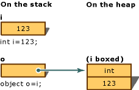
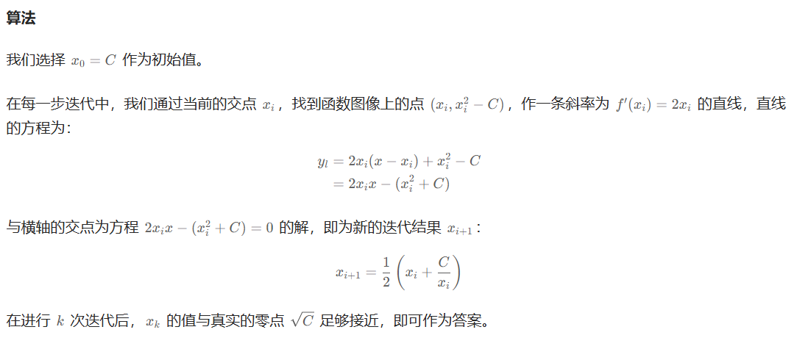

# YH 2025 寒假学习计划

> 注：
>
> 【1】分割线表示可以休息两小时；
>
> 【2】==高亮部分表示不需要互相讲解的内容，但要提供学习内容和重点的笔记；==

## 规则

【1】完成每日任务=4抽，2月2号结算一次，提前完成可以提前抽

【2】额外学习内容：完成每日任务后，可以额外计时学习/运动，2小时1抽


## 记录

当前可用抽数（1抽==8元小礼物）

> 抽数5-1=4
>
> ￥40-8=32

总的抽数：

已使用抽数：

注释：

+5抽是因为胖胖1点半扣5抽

-1 学习时候看手机 被胖胖抓到


紧急：

腾讯实习1.16已开启，

雷火实习1.20已开启，DDL 2.5（剩余15天）

看手机-1抽


# 2025.1.20

## Y

- [ ] 【1】Leetcode：最大子数组和专题。参考https://leetcode.cn/circle/discuss/tXLS3i/ 1.3节，共7题左右。
  - [x] [53. 最大子数组和](https://leetcode.cn/problems/maximum-subarray/)
  - [x] 2606：[找到最大开销的子字符串](https://leetcode.cn/problems/find-the-substring-with-maximum-cost/) 
  - [x] [1749. 任意子数组和的绝对值的最大值](https://leetcode.cn/problems/maximum-absolute-sum-of-any-subarray/)
  - [x] [1191. K 次串联后最大子数组之和](https://leetcode.cn/problems/k-concatenation-maximum-sum/)
  - [x] [918. 环形子数组的最大和](https://leetcode.cn/problems/maximum-sum-circular-subarray/)
  - [x] [2321. 拼接数组的最大分数](https://leetcode.cn/problems/maximum-score-of-spliced-array/) 
  - [x] [152. 乘积最大子数组](https://leetcode.cn/problems/maximum-product-subarray/)

------

- [ ] 【2】继续做延迟渲染的教程，理解延迟渲染（2小时）（重点内容可以讲，==剩下部分可以直接看==）；

------

- [x] 运动一小时以上！！（1.19运动时间=2h，1.20 出去玩走了一天 也算2h吧）（19日提前完成-1）

抽数：	

## H

- [x] 【1】Leetcode：DFS基础
  - [x] [547. 省份数量](https://leetcode.cn/problems/number-of-provinces/)
  - [x] [1971. 寻找图中是否存在路径](https://leetcode.cn/problems/find-if-path-exists-in-graph/)
    - [x] 注意，这题C++ DFS会超时，可以用BFS或者并查集来做，而且这道题目也不能用邻接矩阵来做，要用邻接表（并查集很快！） 用了并查集
  - [x] [797. 所有可能的路径](https://leetcode.cn/problems/all-paths-from-source-to-target/)
  - [x] [841. 钥匙和房间](https://leetcode.cn/problems/keys-and-rooms/) 
  - [x] [2316. 统计无向图中无法互相到达点对数](https://leetcode.cn/problems/count-unreachable-pairs-of-nodes-in-an-undirected-graph/)
    - [x] 这道题目有DFS和并查集两种做法，均可以尝试一下
      - [ ] DFS：有一定的学习价值
      - [x] **并查集：应该会比较快一些，但需要稍微改动一点并查集的代码，可以看下提交记录（值得讲一下）**
  - [x] [1319. 连通网络的操作次数](https://leetcode.cn/problems/number-of-operations-to-make-network-connected/)
    - [x] dfs
    - [x] +并查集


------


- [ ] 【2】==游戏引擎架构：阅读第十章：渲染引擎==
- [ ] 【3】游戏引擎架构：复习第十一章：动画系统相关 （重点内容可以讲，==剩下部分可以直接看==）

- [x] 运动一小时以上！！（19日提前完成-2）

------

# 2025.1.21

## Y

- [ ] 【1】Leetcode：网格图DP
  - [x] [64. 最小路径和](https://leetcode.cn/problems/minimum-path-sum/)
  - [x] [62. 不同路径](https://leetcode.cn/problems/unique-paths/)
  - [x] [63. 不同路径 II](https://leetcode.cn/problems/unique-paths-ii/)
  - [x] [120. 三角形最小路径和](https://leetcode.cn/problems/triangle/)
  - [x] [3393. 统计异或值为给定值的路径数目](https://leetcode.cn/problems/count-paths-with-the-given-xor-value/) 

------

- [ ] 【2】八股文集合

  - [x] ==介绍下A*算法==  D:\PGPostgraduate\githubNotePrepareForWork\PrepareForWorkNotes\2025寒假\Y\note\知识点\A星寻路算法

    https://zhuanlan.zhihu.com/p/385733813

    - [x] ==A*算法的缺点，为什么游戏中不使用==
    - [x] ==A*算法和Dijkstra算法的区别==

  - [x] ==SSAA，MSAA，FXAA==，TAA，==SMAA==（这个应该不用了解太多）  D:\PGPostgraduate\githubNotePrepareForWork\PrepareForWorkNotes\计算机图形学\图形学教程\Lesson 6——反走样技术.md

  - [x] 【增加】还可以提一下Nvidia的超分辨率DLSS系列全家桶。

  D:\PGPostgraduate\githubNotePrepareForWork\PrepareForWorkNotes\2025寒假\Y\note\知识点\超分辨率\超分辨率 DLSS等.md

  - [x] ==帧同步和状态同步==
  - [x] ==析构函数可以是虚函数么？==
  - [ ] ==Unity Monobehavior生命周期==（有重要的部分可以讲一下！）

    - [ ] 三个Update之间的区别，FixedUpdate是如何实现的稳定更新？
  - [ ] 总结一下游戏中的阴影实现方法。除了shadow map，PCF/PCSS，VSSM这些，最好再了解一些可以用于trick阴影的方法。
  - [ ] ==线程之间的通信方式==
  - [ ] Unity中的对象池介绍，必要内容，以及可以有一个手撕的简单对象池demo。（有需要简单讲一讲就好）
  - [ ] 【增加】在渲染中，透明物体的深度测试和深度写入

  

- [x] 【3】运动一小时以上！！（20日提前完成-1）

  今日运动2h 提前完成

------


## H

- [ ] 【1】Leetcode：BFS基础
  - [ ] [3243. 新增道路查询后的最短距离](https://leetcode.cn/problems/shortest-distance-after-road-addition-queries-i/)
  - [ ] [1311. 获取你好友已观看的视频](https://leetcode.cn/problems/get-watched-videos-by-your-friends/)
  - [ ] [1129. 颜色交替的最短路径](https://leetcode.cn/problems/shortest-path-with-alternating-colors/)
  - [ ] [1298. 你能从盒子里获得的最大糖果数](https://leetcode.cn/problems/maximum-candies-you-can-get-from-boxes/)
  - [ ] [2039. 网络空闲的时刻](https://leetcode.cn/problems/the-time-when-the-network-becomes-idle/)
  - [ ] [2608. 图中的最短环](https://leetcode.cn/problems/shortest-cycle-in-a-graph/)
  - [ ] [815. 公交路线](https://leetcode.cn/problems/bus-routes/) 

------


- [ ] 【2】八股文集合：

  - [ ] ==子类的构造函数可以调虚函数吗？内联函数可以是虚函数么？==
  - [ ] ==static 和 const 的区别==
  - [ ] ==new 出来的对象可以用 free 释放吗，会报错吗==
  - [ ] ==面向对象三大特性==
  - [ ] ==编译器调试时看到的地址是物理地址还是逻辑地址==
  - [ ] C++虚函数部分全家桶，包括虚函数如何实现多态？虚表指针相关，以及各种函数能不能是虚函数，可以找找有没有虚函数部分的面经，集体总结一下。**重要的部分需要讲解。**
  - [ ] ==类的存储/C++的内存布局==
  - [ ] vector怎么实现的一定都要开辟再拷贝么？能不能在原来基础上开辟呢？vector 插入元素发生了什么？最好了解一下vector的所有面经，包括push_back&emplace_back这种
  - [ ] ==map和unordered_map区别== 简单说一下红黑树，为什么不用AVL树用红黑树
  - [ ] Unity的NavMesh系统原理了解一下，可以结合文档和youtube教程玩玩这个系统。

  

- [x] 【3】运动一小时以上！！（20日提前完成-2）

------


# 2025.1.22

## 互相分享

- [ ] 胖胖讲堂部分，讲解前面两天需要讲解的内容（包含一部分八股中的重点以及算法题目）；

------


## 其他

- [ ] 互相刷一下对方做过讲过的题目，学习对方分享的面经相关内容和链接；
- [ ] 复习1~2小时的图形学教程中的内容，有需要添加笔记的话记得互相通知一下防止冲突！
- [x] 运动一小时以上！！（21日运动2h 提前完成-1）

------


# 2025.1.23

## Y

- [ ] 【1】Leetcode：图论部分：DFS
  - [x] [2492. 两个城市间路径的最小分数](https://leetcode.cn/problems/minimum-score-of-a-path-between-two-cities/)
  
  - [x] [3387. 两天自由外汇交易后的最大货币数](https://leetcode.cn/problems/maximize-amount-after-two-days-of-conversions/)
  
    这题目也是没谁了 以后没官方题解的 / 没人做的 就不做了
  
  - [ ] [3310. 移除可疑的方法](https://leetcode.cn/problems/remove-methods-from-project/)     :cold_sweat:  没官方题解的 and 没人做 不做 后面补题
  
  - [ ] [2685. 统计完全连通分量的数量](https://leetcode.cn/problems/count-the-number-of-complete-components/)    :cold_sweat:  没官方题解的 and 没人做 不做 后面补题
  
  - [x] [2192. 有向无环图中一个节点的所有祖先](https://leetcode.cn/problems/all-ancestors-of-a-node-in-a-directed-acyclic-graph/)
  
    - [x] 逆向DFS
  
    - [x] 【增加  补上题-1】 拓扑排序
  
  - [ ] [924. 尽量减少恶意软件的传播](https://leetcode.cn/problems/minimize-malware-spread/)

------

- [ ] 【2】八股部分：
  - [ ] ==C#会不会出现空引用？C++和C#的一些区别（这个问题太宽泛了，找一些比较经典的区别和考题就行）==
  - [ ] ==C++智能指针复习，手写玩具智能指针demo（包括计数、weakptr那些），智能指针的使用场景==。
    - [ ] `unique<ptr>`可以作为返回值么？智能指针是否是线程安全的？
  - [ ] ==操作系统进程和线程的区别==
  - [ ] ==enum class 的好处/和enum相比较==
  - [ ] ==说一下TCP协议和UDP协议的区别==
  - [ ] ==Drawcall具体是什么==, Unity中合批, 图集的概念是什么？静态合批和动态合批
  - [ ] ==两个AABB的相交和包含怎么判断？（二维/三维，给出思路和伪代码）==
  - [ ] https://zhuanlan.zhihu.com/p/430541328，这篇文章包含许多图形学八股，可以看一看，重要的题目可以在胖胖讲堂中分享（今天不一定看完）；


- [x] 运动一小时及以上！（21日运动2h 提前完成-2）

## H

- [ ] 【1】Leetcode：网格图dp基础
  - [x] [931. 下降路径最小和](https://leetcode.cn/problems/minimum-falling-path-sum/)
  - [x] [2684. 矩阵中移动的最大次数](https://leetcode.cn/problems/maximum-number-of-moves-in-a-grid/) 
  - [x] [2304. 网格中的最小路径代价](https://leetcode.cn/problems/minimum-path-cost-in-a-grid/) 
  - [x] [1289. 下降路径最小和 II](https://leetcode.cn/problems/minimum-falling-path-sum-ii/)
  - [x] [3418. 机器人可以获得的最大金币数](https://leetcode.cn/problems/maximum-amount-of-money-robot-can-earn/)
  - [x] [1594. 矩阵的最大非负积](https://leetcode.cn/problems/maximum-non-negative-product-in-a-matrix/)
- [ ] 【2】八股部分：
  - [ ] 了解一下ECS和Job System是什么？推荐可以看Games104对应这一节视频https://www.bilibili.com/video/BV1EP411V7jx?spm_id_from=333.788.videopod.sections&vd_source=f0e5ebbc6d14fe7f10f6a52debc41c99以及其下一节，如果讲的不错的话可以直接推荐！
  - [ ] RPC调用过程
  - [ ] C++八股文相关/其他基础知识八股，可以参考链接：https://github.com/huihut/interview?tab=readme-ov-file#design-pattern，https://zhuanlan.zhihu.com/p/417640759同样也是重要的地方讲一讲（今天不一定看完）；


- [x] 运动一小时及以上！（22日运动九日山2h 提前完成-1）


# 2025.1.24

## Y

- [ ] 【1】Leetcode DFS篇：
  - [ ] [2101. 引爆最多的炸弹](https://leetcode.cn/problems/detonate-the-maximum-bombs/)
  - [ ] [721. 账户合并](https://leetcode.cn/problems/accounts-merge/)
  - [ ] [207. 课程表](https://leetcode.cn/problems/course-schedule/) 
  - [ ] [802. 找到最终的安全状态](https://leetcode.cn/problems/find-eventual-safe-states/) 
  - [ ] [928. 尽量减少恶意软件的传播 II](https://leetcode.cn/problems/minimize-malware-spread-ii/) 
  - [ ] [2092. 找出知晓秘密的所有专家](https://leetcode.cn/problems/find-all-people-with-secret/) 
  - [ ] [3108. 带权图里旅途的最小代价](https://leetcode.cn/problems/minimum-cost-walk-in-weighted-graph/) 

感觉可能有点难


------

- [ ] 【2】图形学八股：https://zhuanlan.zhihu.com/p/430541328
- [x] 运动一小时以上！（22日运动九日山2h 提前完成-2）


## H

- [ ] 【1】Leetcode DP篇：
  - [ ] [1301. 最大得分的路径数目](https://leetcode.cn/problems/number-of-paths-with-max-score/)
  - [ ] [2435. 矩阵中和能被 K 整除的路径](https://leetcode.cn/problems/paths-in-matrix-whose-sum-is-divisible-by-k/)
  - [ ] [174. 地下城游戏](https://leetcode.cn/problems/dungeon-game/)
  - [ ] [329. 矩阵中的最长递增路径](https://leetcode.cn/problems/longest-increasing-path-in-a-matrix/)
  - [ ] [2328. 网格图中递增路径的数目](https://leetcode.cn/problems/number-of-increasing-paths-in-a-grid/)
- [ ] 【2】背包部分：0-1背包
  - [ ] [2915. 和为目标值的最长子序列的长度](https://leetcode.cn/problems/length-of-the-longest-subsequence-that-sums-to-target/)
  - [ ] [416. 分割等和子集](https://leetcode.cn/problems/partition-equal-subset-sum/)


------

- [ ] 【3】计算机基础知识八股继续看，可以参考链接：https://github.com/huihut/interview?tab=readme-ov-file#design-pattern（数据库之类的非游戏开发项可以不管），https://zhuanlan.zhihu.com/p/417640759
- [ ] 运动一小时以上！


# 2025.1.25

## 互相分享

- [ ] 胖胖讲堂部分，讲解前面两天需要讲解的内容（包含一部分八股中的重点以及算法题目）；

------


## 其他

- [ ] 互相刷一下对方做过讲过的题目，学习对方分享的面经相关内容和链接；
- [ ] 复习1~2小时的图形学教程中的内容，有需要添加笔记的话记得互相通知一下防止冲突！
- [x] 运动一小时以上！！（爬清源山登顶+走西街 6h 提前完成-1）


# 2025.1.26

## Y

【1】Leetcode算法：拓扑排序

- [ ] [1557. 可以到达所有点的最少点数目](https://leetcode.cn/problems/minimum-number-of-vertices-to-reach-all-nodes/)：有助于理解拓扑排序
- [ ] [210. 课程表 II](https://leetcode.cn/problems/course-schedule-ii/)
- [ ] [1462. 课程表 IV](https://leetcode.cn/problems/course-schedule-iv/)
- [ ] [2115. 从给定原材料中找到所有可以做出的菜](https://leetcode.cn/problems/find-all-possible-recipes-from-given-supplies/) 
- [ ] [851. 喧闹和富有](https://leetcode.cn/problems/loud-and-rich/) 
- [ ] [310. 最小高度树](https://leetcode.cn/problems/minimum-height-trees/)
- [ ] [2392. 给定条件下构造矩阵](https://leetcode.cn/problems/build-a-matrix-with-conditions/) 


- [ ] 【2】面经：
  - [ ] 继续看：https://zhuanlan.zhihu.com/p/430541328

- [x] 运动一小时以上！！（爬清源山登顶+走西街 6h 提前完成-2）

## H


- [ ] 【1】Leetcode算法：0-1背包问题：

  - [ ] [494. 目标和](https://leetcode.cn/problems/target-sum/)
  - [ ] [2787. 将一个数字表示成幂的和的方案数](https://leetcode.cn/problems/ways-to-express-an-integer-as-sum-of-powers/)
  - [ ] [3180. 执行操作可获得的最大总奖励 I](https://leetcode.cn/problems/maximum-total-reward-using-operations-i/)
  - [ ] [474. 一和零](https://leetcode.cn/problems/ones-and-zeroes/)
  - [ ] [1049. 最后一块石头的重量 II](https://leetcode.cn/problems/last-stone-weight-ii/) 
  - [ ] [1774. 最接近目标价格的甜点成本](https://leetcode.cn/problems/closest-dessert-cost/)
  - [ ] [879. 盈利计划](https://leetcode.cn/problems/profitable-schemes/) 

  

- [ ] 【2】面经：
  - [ ] 计算机基础知识八股继续看，可以参考链接：https://github.com/huihut/interview?tab=readme-ov-file#design-pattern（数据库之类的非游戏开发项可以不管），https://zhuanlan.zhihu.com/p/417640759，https://www.xiaolincoding.com/

- [ ] 运动一小时以上！！

# 2025.1.27~2025.2.2

## 算法部分

一共7天，主要内容是补上面的，以及7天一共需要做30题。题单如下：

### Y

前缀和的题目

- [ ] 【1】[303. 区域和检索 - 数组不可变](https://leetcode.cn/problems/range-sum-query-immutable/)
- [ ] 【2】[2559. 统计范围内的元音字符串数](https://leetcode.cn/problems/count-vowel-strings-in-ranges/)
- [ ] 【3】[2389. 和有限的最长子序列](https://leetcode.cn/problems/longest-subsequence-with-limited-sum/)
- [ ] 【4】[3152. 特殊数组 II](https://leetcode.cn/problems/special-array-ii/) 
- [ ] 【5】[1749. 任意子数组和的绝对值的最大值](https://leetcode.cn/problems/maximum-absolute-sum-of-any-subarray/)
- [ ] 【6】[2438. 二的幂数组中查询范围内的乘积](https://leetcode.cn/problems/range-product-queries-of-powers/)
- [ ] 【7】[3361. 两个字符串的切换距离](https://leetcode.cn/problems/shift-distance-between-two-strings/) 
- [ ] 【8】[2055. 蜡烛之间的盘子](https://leetcode.cn/problems/plates-between-candles/)
- [ ] 【9】[1744. 你能在你最喜欢的那天吃到你最喜欢的糖果吗？](https://leetcode.cn/problems/can-you-eat-your-favorite-candy-on-your-favorite-day/) 
- [ ] 【10】[53. 最大子数组和](https://leetcode.cn/problems/maximum-subarray/)（[题解：前缀和做法](https://leetcode.cn/problems/maximum-subarray/solution/qian-zhui-he-zuo-fa-ben-zhi-shi-mai-mai-abu71/)）

前缀和与哈希表

- [ ] 【11】[930. 和相同的二元子数组](https://leetcode.cn/problems/binary-subarrays-with-sum/) 
- [ ] 【12】[560. 和为 K 的子数组](https://leetcode.cn/problems/subarray-sum-equals-k/)
- [ ] 【13】[1524. 和为奇数的子数组数目](https://leetcode.cn/problems/number-of-sub-arrays-with-odd-sum/) 
- [ ] 【14】[974. 和可被 K 整除的子数组](https://leetcode.cn/problems/subarray-sums-divisible-by-k/) 
- [ ] 【15】[523. 连续的子数组和](https://leetcode.cn/problems/continuous-subarray-sum/)
- [ ] 【16】[437. 路径总和 III](https://leetcode.cn/problems/path-sum-iii/)
- [ ] 【17】[2588. 统计美丽子数组数目](https://leetcode.cn/problems/count-the-number-of-beautiful-subarrays/)
- [ ] 【18】[525. 连续数组](https://leetcode.cn/problems/contiguous-array/)
- [ ] 【19】[3026. 最大好子数组和](https://leetcode.cn/problems/maximum-good-subarray-sum/) 
- [ ] 【20】[1477. 找两个和为目标值且不重叠的子数组](https://leetcode.cn/problems/find-two-non-overlapping-sub-arrays-each-with-target-sum/) 
- [ ] 【21】[1546. 和为目标值且不重叠的非空子数组的最大数目](https://leetcode.cn/problems/maximum-number-of-non-overlapping-subarrays-with-sum-equals-target/)
- [ ] 【22】[1124. 表现良好的最长时间段](https://leetcode.cn/problems/longest-well-performing-interval/) 
- [ ] 【23】[3381. 长度可被 K 整除的子数组的最大元素和](https://leetcode.cn/problems/maximum-subarray-sum-with-length-divisible-by-k/)
- [ ] 【24】[2488. 统计中位数为 K 的子数组](https://leetcode.cn/problems/count-subarrays-with-median-k/) 

前缀和与有序集合

- [ ] 【25】[3364. 最小正和子数组](https://leetcode.cn/problems/minimum-positive-sum-subarray/)

距离和

- [ ] 【26】[1685. 有序数组中差绝对值之和](https://leetcode.cn/problems/sum-of-absolute-differences-in-a-sorted-array/)
- [ ] 【27】[2615. 等值距离和](https://leetcode.cn/problems/sum-of-distances/) 
- [ ] 【28】[2602. 使数组元素全部相等的最少操作次数](https://leetcode.cn/problems/minimum-operations-to-make-all-array-elements-equal/)
- [ ] 【29】[2968. 执行操作使频率分数最大](https://leetcode.cn/problems/apply-operations-to-maximize-frequency-score/) 
- [ ] 【30】[1703. 得到连续 K 个 1 的最少相邻交换次数](https://leetcode.cn/problems/minimum-adjacent-swaps-for-k-consecutive-ones/)

### H

**滑动窗口全家桶**

以下为定长滑动窗口

- [ ] 【1】[1456. 定长子串中元音的最大数目](https://leetcode.cn/problems/maximum-number-of-vowels-in-a-substring-of-given-length/) 
- [ ] 【2】[643. 子数组最大平均数 I](https://leetcode.cn/problems/maximum-average-subarray-i/)
- [ ] 【3】[1343. 大小为 K 且平均值大于等于阈值的子数组数目](https://leetcode.cn/problems/number-of-sub-arrays-of-size-k-and-average-greater-than-or-equal-to-threshold/)
- [ ] 【4】[2090. 半径为 k 的子数组平均值](https://leetcode.cn/problems/k-radius-subarray-averages/)
- [ ] 【5】[2379. 得到 K 个黑块的最少涂色次数](https://leetcode.cn/problems/minimum-recolors-to-get-k-consecutive-black-blocks/)
- [ ] 【6】[1052. 爱生气的书店老板](https://leetcode.cn/problems/grumpy-bookstore-owner/) 
- [ ] 【7】[1461. 检查一个字符串是否包含所有长度为 K 的二进制子串](https://leetcode.cn/problems/check-if-a-string-contains-all-binary-codes-of-size-k/)
- [ ] 【8】[2841. 几乎唯一子数组的最大和](https://leetcode.cn/problems/maximum-sum-of-almost-unique-subarray/) 
- [ ] 【9】[2461. 长度为 K 子数组中的最大和](https://leetcode.cn/problems/maximum-sum-of-distinct-subarrays-with-length-k/)
- [ ] 【10】[1423. 可获得的最大点数](https://leetcode.cn/problems/maximum-points-you-can-obtain-from-cards/)
- [ ] 【11】[1652. 拆炸弹](https://leetcode.cn/problems/defuse-the-bomb/) 
- [ ] 【12】[1297. 子串的最大出现次数](https://leetcode.cn/problems/maximum-number-of-occurrences-of-a-substring/)
- [ ] 【13】[2134. 最少交换次数来组合所有的 1 II](https://leetcode.cn/problems/minimum-swaps-to-group-all-1s-together-ii/)
- [ ] 【14】[2653. 滑动子数组的美丽值](https://leetcode.cn/problems/sliding-subarray-beauty/)
- [ ] 【15】[567. 字符串的排列](https://leetcode.cn/problems/permutation-in-string/)
- [ ] 【16】[438. 找到字符串中所有字母异位词](https://leetcode.cn/problems/find-all-anagrams-in-a-string/)
- [ ] 【17】[30. 串联所有单词的子串](https://leetcode.cn/problems/substring-with-concatenation-of-all-words/)
- [ ] 【18】[1016. 子串能表示从 1 到 N 数字的二进制串](https://leetcode.cn/problems/binary-string-with-substrings-representing-1-to-n/)

以下为不定长滑动窗口：

- [ ] 【19】[3. 无重复字符的最长子串](https://leetcode.cn/problems/longest-substring-without-repeating-characters/)
- [ ] 【20】[3090. 每个字符最多出现两次的最长子字符串](https://leetcode.cn/problems/maximum-length-substring-with-two-occurrences/) 
- [ ] 【21】[1493. 删掉一个元素以后全为 1 的最长子数组](https://leetcode.cn/problems/longest-subarray-of-1s-after-deleting-one-element/) 
- [ ] 【22】[1208. 尽可能使字符串相等](https://leetcode.cn/problems/get-equal-substrings-within-budget/)
- [ ] 【23】[2730. 找到最长的半重复子字符串](https://leetcode.cn/problems/find-the-longest-semi-repetitive-substring/)
- [ ] 【24】[904. 水果成篮](https://leetcode.cn/problems/fruit-into-baskets/) 
- [ ] 【25】[1695. 删除子数组的最大得分](https://leetcode.cn/problems/maximum-erasure-value/)
- [ ] 【26】[2958. 最多 K 个重复元素的最长子数组](https://leetcode.cn/problems/length-of-longest-subarray-with-at-most-k-frequency/) 
- [ ] 【27】[2779. 数组的最大美丽值](https://leetcode.cn/problems/maximum-beauty-of-an-array-after-applying-operation/) 
- [ ] 【28】[2024. 考试的最大困扰度](https://leetcode.cn/problems/maximize-the-confusion-of-an-exam/) 
- [ ] 【29】[1004. 最大连续 1 的个数 III](https://leetcode.cn/problems/max-consecutive-ones-iii/) 
- [ ] 【30】[1658. 将 x 减到 0 的最小操作数](https://leetcode.cn/problems/minimum-operations-to-reduce-x-to-zero/) 


## 面经部分

需要完成的内容：

- 这一周的时间，确保以下的八股文集锦里面的内容有进行遍历：
  - [ ] https://github.com/huihut/interview?tab=readme-ov-file#design-pattern，数据库之类的非游戏开发项可以不管
  - [ ] 计算机基础知识八股：https://zhuanlan.zhihu.com/p/417640759
  - [ ] 计算机图形学八股：https://zhuanlan.zhihu.com/p/430541328

- bonus：https://www.xiaolincoding.com/ 这里面有一些基础知识可以学习，但不作为强制学习的内容


## 其他

- [ ] 确保上面的算法题目和重要的八股面经都有通过胖胖讲堂进行讲解，并且有做复习、回顾和总结

  （选做）可以补全Games101，Games102，Games104中的没看部分，以及复习那些掌握不好的部分

- [ ] 确保每天尽量一个小时以上的运动量！

  - [x] （爬清源山登顶+走西街 6h 提前完成-3-6 补到30日 还有日常逛街 都算进去先不记了  每天打游戏都是站着玩！多亏了手柄嘿嘿）
  - [x] 30日走到世界城来回，+逛没有坐下 算运动2h  31+1日
  - [ ] 


后面有需要再学习的内容可以添加进来。

- [ ] （1）《游戏引擎架构》剩余的部分
- [ ] （2）《Effective C++》阅读
- [ ] （3）《More Effecive C++》阅读
- [ ] （4）额外的各种算法题


# 2025.2.3


# 2025.2.4


# 2025.2.5


# 2025.2.6


# 2025.2.7


# 2025.2.8

# C#

## 装箱和拆箱

https://learn.microsoft.com/zh-cn/dotnet/csharp/programming-guide/types/boxing-and-unboxing

①装箱就是隐式的将一个值类型转换为 `object` 类型/引用型对象

装箱时隐式的

常见语言运行时 (CLR) 对值类型进行装箱时，会将值包装在 [System.Object](https://learn.microsoft.com/zh-cn/dotnet/api/system.object) 实例中并将其存储在托管**堆**中。 

```C#
int a=0;
System.Object obj =a;
//或者
object obj=a;
```


②拆箱就是将一个引用型对象转换成任意值型 / 从对象中提取值类型

拆箱是显式的

```
int b=(int)obj; 
```

https://blog.csdn.net/michaelafeng/article/details/117460052

以下示例演示如何在 C# 中使用装箱。

C#

```csharp
// String.Concat example.
// String.Concat has many versions. Rest the mouse pointer on
// Concat in the following statement to verify that the version
// that is used here takes three object arguments. Both 42 and
// true must be boxed.
Console.WriteLine(String.Concat("Answer", 42, true));

// List example.
// Create a list of objects to hold a heterogeneous collection
// of elements.
List<object> mixedList = new List<object>();

// Add a string element to the list.
mixedList.Add("First Group:");

// Add some integers to the list.
for (int j = 1; j < 5; j++)
{
    // Rest the mouse pointer over j to verify that you are adding
    // an int to a list of objects. Each element j is boxed when
    // you add j to mixedList.
    mixedList.Add(j);
}

// Add another string and more integers.
mixedList.Add("Second Group:");
for (int j = 5; j < 10; j++)
{
    mixedList.Add(j);
}

// Display the elements in the list. Declare the loop variable by
// using var, so that the compiler assigns its type.
foreach (var item in mixedList)
{
    // Rest the mouse pointer over item to verify that the elements
    // of mixedList are objects.
    Console.WriteLine(item);
}

// The following loop sums the squares of the first group of boxed
// integers in mixedList. The list elements are objects, and cannot
// be multiplied or added to the sum until they are unboxed. The
// unboxing must be done explicitly.
var sum = 0;
for (var j = 1; j < 5; j++)
{
    // The following statement causes a compiler error: Operator
    // '*' cannot be applied to operands of type 'object' and
    // 'object'.
    //sum += mixedList[j] * mixedList[j];

    // After the list elements are unboxed, the computation does
    // not cause a compiler error.
    sum += (int)mixedList[j] * (int)mixedList[j];
}

// The sum displayed is 30, the sum of 1 + 4 + 9 + 16.
Console.WriteLine("Sum: " + sum);

// Output:
// Answer42True
// First Group:
// 1
// 2
// 3
// 4
// Second Group:
// 5
// 6
// 7
// 8
// 9
// Sum: 30
```

性能

相对于简单的赋值而言，装箱和取消装箱过程需要进行大量的计算。 对值类型进行装箱时，必须分配并构造一个新对象。 取消装箱所需的强制转换也需要进行大量的计算，只是程度较轻。 有关更多信息，请参阅[性能](https://learn.microsoft.com/zh-cn/dotnet/framework/performance/performance-tips)。

更具体一点：

### 装箱

装箱用于在垃圾回收堆中存储值类型。 装箱是[值类型](https://learn.microsoft.com/zh-cn/dotnet/csharp/language-reference/builtin-types/value-types)到 `object` 类型或到此值类型所实现的任何接口类型的隐式转换。 对值类型装箱会在堆中分配一个对象实例，并将该值复制到新的对象中。

请看以下值类型变量的声明：

```csharp
int i = 123;
```

以下语句对变量 `i` 隐式应用了装箱操作：

```csharp
// Boxing copies the value of i into object o.
object o = i;
```

此语句的结果是在堆栈上创建对象引用 `o`，而在堆上则引用 `int` 类型的值。 该值是赋给变量 `i` 的值类型值的一个副本。 以下装箱转换图说明了 `i` 和 `o` 这两个变量之间的差异：



还可以像下面的示例一样执行显式装箱，但显式装箱从来不是必需的：

```csharp
int i = 123;
object o = (object)i;  // explicit boxing
```


#### 示例

此示例使用装箱将整型变量 `i` 转换为对象 `o`。 这样一来，存储在变量 `i` 中的值就从 `123` 更改为 `456`。 该示例表明原始值类型和装箱的对象使用不同的内存位置，因此能够存储不同的值。

C#

```csharp
class TestBoxing
{
    static void Main()
    {
        int i = 123;

        // Boxing copies the value of i into object o.
        object o = i;

        // Change the value of i.
        i = 456;

        // The change in i doesn't affect the value stored in o.
        System.Console.WriteLine("The value-type value = {0}", i);
        System.Console.WriteLine("The object-type value = {0}", o);
    }
}
/* Output:
    The value-type value = 456
    The object-type value = 123
*/
```


### 取消装箱

取消装箱是从 `object` 类型到[值类型](https://learn.microsoft.com/zh-cn/dotnet/csharp/language-reference/builtin-types/value-types)或从接口类型到实现该接口的值类型的显式转换。 取消装箱操作包括：

- 检查对象实例，以确保它是给定值类型的装箱值。
- 将该值从实例复制到值类型变量中。

下面的语句演示装箱和取消装箱两种操作：

C#

```csharp
int i = 123;      // a value type
object o = i;     // boxing
int j = (int)o;   // unboxing
```

下图演示了上述语句的结果：


要在运行时成功取消装箱值类型，被取消装箱的项必须是对一个对象的引用，该对象是先前通过装箱该值类型的实例创建的。 尝试取消装箱 `null` 会导致 [NullReferenceException](https://learn.microsoft.com/zh-cn/dotnet/api/system.nullreferenceexception)。 尝试取消装箱对不兼容值类型的引用会导致 [InvalidCastException](https://learn.microsoft.com/zh-cn/dotnet/api/system.invalidcastexception)。


#### 示例

下面的示例演示无效的取消装箱及引发的 `InvalidCastException`。 使用 `try` 和 `catch`，在发生错误时显示错误信息。

C#

```csharp
class TestUnboxing
{
    static void Main()
    {
        int i = 123;
        object o = i;  // implicit boxing

        try
        {
            int j = (short)o;  // attempt to unbox

            System.Console.WriteLine("Unboxing OK.");
        }
        catch (System.InvalidCastException e)
        {
            System.Console.WriteLine("{0} Error: Incorrect unboxing.", e.Message);
        }
    }
}
```

此程序输出：

```
Specified cast is not valid. Error: Incorrect unboxing.
```

如果将下列语句：

```csharp
int j = (short)o;
```

更改为：

```csharp
int j = (int)o;
```

将执行转换，并将得到以下输出：

```
Unboxing OK.
```


**C#中可以给class装箱吗**

gpt:

在C#中，装箱（Boxing）是将值类型（例如`int`, `float`, `struct`等）转换为引用类型（如`object`或接口类型）的过程。然而，对于类（class）类型，本身就是引用类型，因此不需要装箱。

### 装箱和拆箱的概念

- **装箱 (Boxing)**：将值类型封装到一个对象中。这通常发生在将值类型赋给一个`object`类型的变量时。

  ```
  csharp复制代码int number = 42;
  object boxedNumber = number; // 装箱
  ```

- **拆箱 (Unboxing)**：将被装箱的对象还原为其原始值类型。

  ```
  csharp复制代码int unboxedNumber = (int)boxedNumber; // 拆箱
  ```

### 类的特性

由于类本身是引用类型，所以你不需要执行装箱操作。例如：

```
csharp复制代码class MyClass
{
    public int Value { get; set; }
}

// 实例化类
MyClass myObject = new MyClass();
object obj = myObject; // 这里没有装箱，因为 myObject 已经是引用类型
```

在上面的代码中，你可以直接将`MyClass`实例赋给一个`object`类型的变量，而不涉及任何装箱过程。

### 总结

- **装箱**：只适用于值类型。
- **类**：作为引用类型，不需要装箱。


关于装箱拆箱大的作用：

https://www.runoob.com/csharp/csharp-arraylist.html

- `ArrayList` 是非泛型集合，所有元素被存储为 `object` 类型。这意味着它可以存储任意类型的对象，但需要注意装箱（boxing）和拆箱（unboxing）的性能影响。


## 工厂模式

工厂顾名思义就是创建产品，根据产品是具体产品还是具体工厂可分为**简单工厂模式**和**工厂方法模式**，根据工厂的抽象程度可分为工厂方法模式和**抽象工厂模式**。该模式用于封装和管理对象的创建，是一种创建型模式。

具体看**https://www.cnblogs.com/yssjun/p/11102162.html**

### 简单工厂模式


### 工厂方法模式

和简单工厂模式中工厂负责生产所有产品相比，工厂方法模式将生成具体产品的任务分发给具体的产品工厂


### 抽象工厂模式

上面两种模式不管工厂怎么拆分抽象，都只是针对一类产品**Phone**（AbstractProduct），如果要生成另一种产品PC，应该怎么表示呢？最简单的方式是把2中介绍的工厂方法模式完全复制一份，不过这次生产的是PC。


# Leetcode:

##  1.最大子数组和

DP:

```C++
class Solution 
{
public:
    int maxSubArray(vector<int>& nums) 
    {
        //dp[i] 表示以 nums[i] *结尾* 的最大子数组和。
        int n =nums.size();
        // int dp[100010]={0};
        vector<int> dp(n,0);
        int maxNum=nums[0];//[-1]
        dp[0]=nums[0];
        for(int i=1;i<n;i++)
        {
            dp[i]=max(dp[i-1],0)+nums[i];
            maxNum=max(maxNum,dp[i]);
        }
        // return maxNum;
        //或者C++20 新特性:
        return maxNum;
    }
};
```

或者滑动窗口）应该可以？


## 2.判断括号字符串是否有效，有三种括号{},[],()，()里面有[],{}也是非法的，[]里面有{}也非法。

//[  {}[][{

#### 2.1 没有优先级的情况下  [20. 有效的括号](https://leetcode.cn/problems/valid-parentheses/)

没有优先级的情况下：

```C++
#define kuohao
#ifdef kuohao

#include<iostream>
#include<stack>
using namespace std;
//empty )]}
//temp={[(
bool isValid(string s)
{
	stack<char> st;
	for (int i = 0; i < s.size(); i++)
	{
		if (st.empty())
		{
			if (s[i] == ')' || s[i] == ']' || s[i] == '}')return false;
			st.push(s[i]);
		}
		else
		{
			char topS = st.top();
			if (s[i] == ')')
			{
				if (topS == '(')st.pop();
				else st.push(s[i]);
			}
			else if (s[i] == '}')
			{
				if (topS == '{')st.pop();
				else st.push(s[i]);
			}
			else if (s[i] == ']')
			{
				if (topS == '[')st.pop();
				else st.push(s[i]);
			}
			else//([{
			{
				st.push(s[i]);
			}
		}
	}
	if (st.empty())return true;
	return false;
}
int main()
{
	string str1 = "()";
	cout << isValid(str1);
	return 0;
}

#endif
```

比较冗余，可以优化为

```C++
class Solution {
public:
    bool isValid(string s) {
	stack<char> st;
	for (int i = 0; i < s.size(); i++)
	{
		if (st.empty())
		{
			if (s[i] == ')' || s[i] == ']' || s[i] == '}')return false;
			st.push(s[i]);
		}
		else
		{
			char topS = st.top();
			if ((s[i] == ')'&&topS == '(')||
            (s[i] == ']'&&topS == '[')||
            (s[i] == '}'&&topS == '{'))
			{
				st.pop();
			}
            else st.push(s[i]);
		}
	}
	if (st.empty())return true;
	return false;
}
};
```


官方：

```C++
class Solution {
public:
    bool isValid(string s) {
        int n = s.size();
        if (n % 2 == 1) {
            return false;
        }

        unordered_map<char, char> pairs = {
            {')', '('},
            {']', '['},
            {'}', '{'}
        };
        stack<char> stk;
        for (char ch: s) {
            if (pairs.count(ch)) {
                if (stk.empty() || stk.top() != pairs[ch]) {
                    return false;
                }
                stk.pop();
            }
            else {
                stk.push(ch);
            }
        }
        return stk.empty();
    }
};

作者：力扣官方题解
链接：https://leetcode.cn/problems/valid-parentheses/solutions/373578/you-xiao-de-gua-hao-by-leetcode-solution/
来源：力扣（LeetCode）
著作权归作者所有。商业转载请联系作者获得授权，非商业转载请注明出处。
```


#### 有优先级的情况下：

me:以下正确

https://www.acwing.com/file_system/file/content/whole/index/content/12618509/

```C++
#include<iostream>
#include<stack>
#include<unordered_map>
#include<string>
using namespace std;
bool isValid(string str, unordered_map<char, int>& m)
{
    stack<char> st;
    for (int i = 0; i < str.size(); i++)
    {
        //)  1、空 false  2、！=（ false
        if (m[str[i]] > 0)
        {
            if (st.empty() || m[str[i]] != -1 * m[st.top()])
                return false;//)
            //else if (!st.empty() && m[str[i]] == -1 * m[st.top()]) 上面那句的反面就是这句 所以并不需要
            st.pop();
        }
        else if (m[str[i]] < 0) // [-3 {-4  
        {
            if (!st.empty()&&m[str[i]] < m[st.top()])
                return false;
            else st.push(str[i]);
        }

    }
    if (!st.empty())return false;
    return true;
}
int main()//2010-2044
{
    int n;
    cin >> n;
    unordered_map<char, int> m;
    m['{'] = -4; m['}'] = 4;
    m['['] = -3; m[']'] = 3;
    m['('] = -2; m[')'] = 2;
    m['<'] = -1; m['>'] = 1;
    for (int i = 0; i < n; i++)
    {
        string str;
        cin >> str;
        cout << (isValid(str, m) == true ? "YES" : "NO") << endl;
    }
    return 0;
}

```


不确定是否正确啊 因为没有找到题目和判题网站

```C++
//有优先级的情况下
#define kuohaoYX1
#ifdef kuohaoYX

#include<iostream>
#include<stack>
using namespace std;
//empty )]}
//temp={[(
bool isValid(string s)
{
	stack<char> st;
	for (int i = 0; i < s.size(); i++)
	{
		if (st.empty())
		{
			if (s[i] == ')' || s[i] == ']' || s[i] == '}')return false;
			st.push(s[i]);
		}
		else
		{
			char topS = st.top();
			if (s[i] == ')')//([{//}])
			{
				if (topS == '(')st.pop();
				else st.push(s[i]);
			}
			else if (s[i] == ']')
			{
				if (topS == '[')st.pop();
				else st.push(s[i]);
			}
			else if (s[i] == '}')
			{
				if (topS == '{')st.pop();
				else st.push(s[i]);
			}
			if (s[i] == '(')//([{//}])
			{
				st.push(s[i]);
			}
			else if (s[i] == '[')
			{
				if (topS == '(')return false;
				else st.push(s[i]);
			}
			else if (s[i] == '{')
			{
				if (topS == '['||topS=='(')return false;
				else st.push(s[i]);
			}

			
		}
	}
	if (st.empty())return true;
	return false;
}
int main()
{
	/*string str1 = "([])";
	cout << isValid(str1);
	str1 = "([])";
	cout << isValid(str1);*/
	string testCases[] = {
		"([])",     
		"{[()]}",   
		"{[(])}",   
		"{}[]()",   
		"([{}])",   
		"((()))",   
		"[{()}]",   
		"[{(})]",   
		"(",        
		")",        
		"]",        
		"[",        
		"{{{{}}}}", 
		"(((([]))))"
		"({[{()[]}]}())", 
		"({[)}]",    
		"}{",        
		"([)]",      
		"([{}][]){}",
		"[]{}()()",  
		"([{}]{})",  
		"",          
	};

	for (const auto& testCase : testCases) {
		cout << "Input: \"" << testCase << "\" => Output: " << (isValid(testCase) ? "true" : "false") << endl;
	}

	return 0;
}

#endif
```

可以优化为

```C++
bool isValid(string s)
{
	stack<char> st;
	for (int i = 0; i < s.size(); i++)
	{
		if (st.empty())
		{
			if (s[i] == ')' || s[i] == ']' || s[i] == '}')return false;
			st.push(s[i]);
		}
		else
		{
			char topS = st.top();
			if ((s[i] == ')' && topS == '(') ||
				(s[i] == ']' && topS == '[') ||
				(s[i] == '}' && topS == '{'))
			{
				st.pop();
			}
			else if (s[i] == '(')//([{//}])
			{
				st.push(s[i]);
			}
			else if (s[i] == '[')
			{
				if (topS == '(')return false;
				else st.push(s[i]);
			}
			else if (s[i] == '{')
			{
				if (topS == '['||topS=='(')return false;
				else st.push(s[i]);
			}
			else st.push(s[i]);
			
		}
	}
	if (st.empty())return true;
	return false;
}
```

合法的是{[()]}


## 1.牛顿迭代法开方

### [69. x 的平方根 ](https://leetcode.cn/problems/sqrtx/)

https://leetcode.cn/problems/sqrtx/solutions/238553/x-de-ping-fang-gen-by-leetcode-solution/

#### 法1：袖珍计算器算法

### 方法一：袖珍计算器算法

「袖珍计算器算法」是一种用指数函数 exp 和对数函数$\ln$代替平方根函数的方法。我们通过有限的可以使用的数学函数，得到我们想要计算的结果。

我们将$\sqrt x$写成幂的形式$x^{1/2}$,再使用自然对数$e$进行换底，即可得到


$$\sqrt{x}=x^{1/2}=(e^{\ln x})^{1/2}=e^{\frac12\ln x}$$

（)

这样我们就可以得到$\sqrt{x}$的值了。

注意：由于计算机无法存储浮点数的精确值 (浮点数的存储方法可以参考 IEEE 754,这里不再赘述),而指数函数和对数函数的参数和返回值均为浮点数，因此运算过程中会存在**误差**。例如当$x=2147395600$时，$e^{\frac12\ln x}$的计算结果与正确值 46340 相差 10$^{-11}$,这样在对结果取整数部分时，会得到 46339 这个错误的结果。

因此在得到结果的整数部分ans后，我们应当找出**ans与$ans+1$中哪一个是真正的答案**。****

```C++
class Solution {
public:
    int mySqrt(int x) 
    {
        if(x==0)return 0;
        //
        int ans = exp(0.5*log(x));//C++语法上log(x)就是ln(x) 
        return ((long long )(ans+1)*(ans+1)<=x?ans+1:ans);
    }
};
```

log()是对数函数 ，格式是log底数(x)，如果没设底数，及只有log，那就是以e为底


#### 法2：二分

```C++
class Solution //5m
{
public:
    int mySqrt(int x) 
    {
        long long l=1,r=x;
        long long  mid;
        long long  temp;
        while(l<=r)
        {
            mid = l+((r-l)>>2);
            temp = mid*mid;
            if(temp<x)
            {
                l=mid+1;
            }
            else if(temp>x)
            {
                r=mid-1;
            }
            else
            {
                return mid;
            }
        }
        return r;

    }
};
```

#### 法3：牛顿迭代法





```C++
class Solution {
public:
    int mySqrt(int x) 
    {
        if(x==0)return 0;
        double C=x,x0=x;
        while(true)
        {
            double xi=0.5*(x0+C/x0);
            if((x0-xi)<1e-7)
            {
                break;
            }
            x0=xi;
        }
        return int(x0);
    }
};
```


## 469：凸多边形


LeetCode刷题实战469：凸多边形

今天和大家聊的问题叫做 凸多边形，我们先来看题面：

https://leetcode-cn.com/problems/convex-polygon/

Given a list of points that form a polygon when joined sequentially, find if this polygon is convex (Convex polygon definition).

Note:

There are at least 3 and at most 10,000 points.

Coordinates are in the range -10,000 to 10,000.

You may assume the polygon formed by given points is always a simple polygon (Simple polygon definition). In other words, we ensure that exactly two edges intersect at each vertex, and that edges otherwise don't intersect each other.

给定一个按顺序连接的多边形的顶点，判断该多边形是否为凸多边形。（凸多边形的定义）

注：

顶点个数至少为 3 个且不超过 10,000。

坐标范围为 -10,000 到 10,000。

你可以假定给定的点形成的多边形均为简单多边形（简单多边形的定义）。换句话说，保

每个顶点处恰好是两条边的汇合点，并且这些边 互不相交 。

示例                             
示例 1：

[[0,0],[0,1],[1,1],[1,0]]

输出：True
解释：

	


示例 2：

[[0,0],[0,10],[10,10],[10,0],[5,5]]

输出：False
解释：

解题
叉乘判断

设A(x1,y1),B(x2,y2),C(x3,y3)则三角形两边的矢量分别是：

AB=(x2-x1,y2-y1), AC=(x3-x1,y3-y1)

`则AB和AC的叉积为：(2*2的行列式) 值为：(x2-x1)*(y3-y1) - (y2-y1)*(x3-x1)`

利用右手法则进行判断：

如果AB*AC>0,则三角形ABC是逆时针的

如果AB*AC<0,则三角形ABC是顺时针的

因为不知道顶点是顺时针输入，还是逆时针输入，所以要记录符号，后面点叉乘如果一样就是凸多边形。


c++

```C++
class Solution {
public:
    bool isConvex(vector<vector<int>>& points) 
    {
        int N = points.size();
        long pre = 0;
        for (int i = 0; i < N; ++i) 
        {
            long cur = angle({points[i], points[(i + 1) % N], points[(i + 2) % N]});
            if (cur != 0) 
			{
                if (cur * pre < 0)
                    return false;
                else
                    pre = cur;
            }
        }
        return true;
    }
    int angle(vector<vector<int>> A) 	
    {
        return  (A[1][0] - A[0][0]) * (A[2][1] - A[0][1]) - 
                (A[1][1] - A[0][1]) * (A[2][0] - A[0][0]);

    }
};
```


原文链接：https://blog.csdn.net/itcodexy/article/details/121987650


java

```java
class Solution:
    def isConvex(self, points: List[List[invt]]) -> bool:
        def cal_cross_product(A, B, C):
            AB = [B[0] - A[0], B[1] - A[1]]
            AC = [C[0] - A[0], C[1] - A[1]]
            return AB[0] * AC[1] - AB[1] * AC[0]
	flag = 0
    n = len(points)
    for i in range(n):
        # cur > 0 表示points是按逆时针输出的;cur < 0,顺时针
        cur = cal_cross_product(points[i], points[(i + 1) % n], points[(i + 2) % n])
        if cur != 0:
            # 说明异号, 说明有个角大于180度
            if cur * flag < 0:
                return False
            else:
                flag = cur
    return True
```


## 1. C#的编译过程: .Net, IL, JIT

**回答建议：**

.NET 是一个免费的跨平台[开放源代码开发人员平台](https://github.com/dotnet/core)，用于生成[多种类型的应用程序](https://learn.microsoft.com/zh-cn/dotnet/core/apps)。 .NET 可以运行使用[多种语言](https://learn.microsoft.com/zh-cn/dotnet/fundamentals/languages)编写的程序，其中 [C#](https://learn.microsoft.com/zh-cn/dotnet/csharp/) 是最常用的语言。 .NET 依赖于许多[大规模应用](https://devblogs.microsoft.com/dotnet/category/developer-stories/)在生产中使用的[高性能](https://devblogs.microsoft.com/dotnet/category/performance/)运行时。

C#的编译过程可以分为以下几个步骤：

1. **源代码编译为IL（Intermediate Language）**：当你编写C#代码并编译时，C#编译器（如`csc.exe`）会将你的源代码编译为中间语言（IL），也称为MSIL（Microsoft Intermediate Language）或CIL（Common Intermediate Language）。**IL是一种与平台无关的低级语言**，类似于汇编语言，但它并不是机器码。

2. **IL存储在程序集中**：编译后的IL代码会被存储在程序集（通常是`.dll`或`.exe`文件）中。程序集还包含元数据，用于描述程序集中的类型、方法、属性等信息。

3. **JIT编译（Just-In-Time Compilation）**：当程序运行时，.NET运行时（CLR，Common Language Runtime）会通过JIT编译器将IL代码编译为本地机器码。JIT编译是动态进行的，只有在方法第一次被调用时才会被编译为机器码。这种方式可以提高程序的启动速度，并且允许进行一些运行时优化。

4. **执行机器码**：一旦IL代码被JIT编译为机器码，CPU就可以直接执行这些机器码指令。

**总结：** C#的编译过程分为两个主要阶段：首先将源代码编译为IL，然后在运行时通过JIT编译器将IL编译为机器码并执行。

## 2. C#的字符串是什么类型？ C#两个字符串相同，指向同一个地方吗？

https://developer.aliyun.com/article/298536

<u></u>**回答建议：**

在C#中，字符串是`System.String`类型，它是一个引用类型。字符串在C#中是不可变的（immutable），这意味着一旦字符串被创建，它的内容就不能被修改。

**关于字符串相同是否指向同一个地方：**

在C#中，字符串有一个称为“字符串驻留”（String Interning）的特性。当你创建两个内容相同的字符串时，CLR会尝试将它们指向同一个内存地址，以减少内存占用。例如：

```csharp
string str1 = "hello";
string str2 = "hello";
```

在这个例子中，`str1`和`str2`会指向同一个内存地址，因为它们的值是相同的，CLR会进行字符串驻留优化。

但是，如果你通过`new`关键字显式创建字符串，或者通过字符串拼接等方式动态生成字符串，CLR可能不会进行驻留，这时两个内容相同的字符串可能不会指向同一个地方：

```csharp
string str3 = new string("hello");
string str4 = new string("hello");
```

在这个例子中，`str3`和`str4`虽然内容相同，但它们指向不同的内存地址。

**总结：** C#中的字符串是`System.String`类型，是不可变的引用类型。如果两个字符串的内容相同，CLR可能会通过字符串驻留机制让它们指向同一个内存地址，但通过`new`关键字创建的字符串不会进行驻留。


>**Q: 你是说c#的字符串不能改么，不是可以重新赋值吗**
>
>你提到的“重新赋值”和“字符串不可变”是两个不同的概念。让我详细解释一下：
>
>### 字符串不可变（Immutable）的含义
>
>在C#中，字符串是不可变的，这意味着一旦一个字符串对象被创建，它的内容就不能被修改。任何对字符串的“修改”操作（比如拼接、替换、插入等）实际上都会创建一个新的字符串对象，而不是修改原有的字符串。
>
>例如：
>
>```csharp
>string str = "hello";
>str = str + " world";  // 这里实际上是创建了一个新的字符串对象
>```
>
>在这个例子中，`str`最初指向一个包含`"hello"`的字符串对象。当执行`str = str + " world"`时，C#会创建一个新的字符串对象`"hello world"`，然后将`str`指向这个新的对象。原来的`"hello"`字符串对象并没有被修改，它仍然存在于内存中，直到垃圾回收器将其回收。
>
>### 重新赋值 vs 修改内容
>
>- **重新赋值**：你可以将一个字符串变量重新赋值为另一个字符串。这并不会修改原有的字符串对象，而是让变量指向一个新的字符串对象。
>
>  ```csharp
>  string str = "hello";
>  str = "world";  // 重新赋值，str现在指向一个新的字符串对象
>  ```
>
>- **修改内容**：你不能直接修改一个字符串对象的内容。例如，你不能通过索引来修改字符串中的某个字符：
>
>  ```csharp
>  string str = "hello";
>  str[0] = 'H';  // 这行代码会编译错误，因为字符串是不可变的
>  ```
>
>### 为什么字符串要设计为不可变？
>
>1. **线程安全**：由于字符串是不可变的，它们可以被多个线程共享而不需要额外的同步机制。
>2. **性能优化**：字符串驻留（String Interning）等优化技术依赖于字符串的不可变性。
>3. **安全性**：不可变性可以防止字符串在不知情的情况下被修改，这在处理敏感数据时尤为重要。
>
>### 如何“修改”字符串？
>
>如果你需要频繁修改字符串内容，可以使用`StringBuilder`类。`StringBuilder`是一个可变的字符串缓冲区，它允许你在不创建新对象的情况下修改字符串内容。
>
>例如：
>
>```csharp
>StringBuilder sb = new StringBuilder("hello");
>sb[0] = 'H';  // 可以直接修改字符
>sb.Append(" world");  // 可以追加字符串
>string result = sb.ToString();  // 最终转换为字符串
>```
>
>**总结：** C#中的字符串是不可变的，这意味着你不能修改一个已存在的字符串对象的内容。你可以通过重新赋值来让字符串变量指向一个新的字符串对象，但这并不会修改原有的字符串。如果需要频繁修改字符串内容，可以使用`StringBuilder`。

## 3. Unity协程, Unity协程和C#多线程使用上的区别，C#异步

**回答建议：**

**Unity协程：**

Unity中的协程（Coroutine）是一种特殊的函数，它可以在执行过程中暂停并在稍后的时间点继续执行。协程通常用于处理需要分步执行的任务，比如等待一段时间、等待某个条件满足等。协程通过`yield`关键字来实现暂停和继续。

例如：

```csharp
IEnumerator MyCoroutine()
{
    Debug.Log("Start");
    yield return new WaitForSeconds(1); // 暂停1秒
    Debug.Log("After 1 second");
}
```

**Unity协程与C#多线程的区别：**

1. **执行环境**：Unity协程是在主线程上执行的，它们并不是真正的多线程。协程的暂停和继续是通过Unity的主循环来控制的。而C#的多线程是通过`Thread`类或`Task`类创建的，它们可以在不同的线程上并行执行。

2. **用途**：协程通常用于处理需要分步执行的任务，比如动画、延时操作等。而多线程通常用于处理需要并行执行的任务，比如计算密集型操作、IO操作等。

3. **线程安全**：由于协程是在主线程上执行的，因此它们可以安全地访问Unity的对象（如`GameObject`、`Transform`等）。而多线程操作Unity对象时需要注意线程安全问题，通常需要通过主线程来操作Unity对象。

**C#异步：**

C#中的异步编程是通过`async`和`await`关键字来实现的。异步操作通常用于处理IO操作、网络请求等耗时操作，以避免阻塞主线程。

例如：

```csharp
async Task MyAsyncMethod()
{
    Debug.Log("Start");
    await Task.Delay(1000); // 异步等待1秒
    Debug.Log("After 1 second");
}
```


>异步
>
>**异步**（Asynchronous）是一种编程模式，允许程序在等待某些耗时操作（如I/O操作、网络请求、文件读写等）完成时，不阻塞当前线程，而是继续执行其他任务。当耗时操作完成后，程序再回来处理结果。
>
>### 异步的核心思想
>异步的核心思想是**“不等待”**。通过异步编程，你可以让程序在等待某个操作完成的同时，继续执行其他任务，从而提高程序的效率和响应性。
>
>### 同步 vs 异步
>- **同步（Synchronous）**：程序按顺序执行，每一步都必须等待前一步完成。如果某个操作耗时较长，程序会一直阻塞，直到操作完成。
>  - 例如：你打电话给客服，电话接通后你一直等待，直到客服处理完你的问题。
>  
>- **异步（Asynchronous）**：程序在发起某个操作后，不需要等待操作完成，而是继续执行其他任务。当操作完成后，程序会通过回调、事件或任务（Task）等方式得到通知。
>  - 例如：你打电话给客服，电话接通后你告诉客服你的问题，然后挂断电话去做其他事情。客服处理完后会回电通知你结果。
>
>---
>
>### C# 中的异步编程
>在C#中，异步编程主要通过 `async` 和 `await` 关键字来实现。`async` 用于标记一个方法是异步的，`await` 用于等待一个异步操作的完成。
>
>#### 示例：异步方法
>```csharp
>using System;
>using System.Threading.Tasks;
>
>class Program
>{
>    static async Task Main(string[] args)
>    {
>        Console.WriteLine("开始执行异步方法");
>        await DoSomethingAsync();  // 等待异步方法完成
>        Console.WriteLine("异步方法执行完毕");
>    }
>
>    static async Task DoSomethingAsync()
>    {
>        Console.WriteLine("异步操作开始");
>        await Task.Delay(2000);  // 模拟一个耗时操作（延迟2秒）
>        Console.WriteLine("异步操作完成");
>    }
>}
>```
>
>#### 输出：
>```
>开始执行异步方法
>异步操作开始
>（等待2秒）
>异步操作完成
>异步方法执行完毕
>```
>
>#### 关键点：
>1. **`async`**：标记一个方法为异步方法。异步方法通常返回 `Task` 或 `Task<T>`。
>2. **`await`**：等待一个异步操作完成。`await` 会暂停当前方法的执行，直到异步操作完成，但不会阻塞线程。
>3. **`Task`**：表示一个异步操作。`Task.Delay` 是一个模拟耗时操作的异步方法。
>
>---
>
>### 异步的优点
>1. **提高响应性**：异步操作不会阻塞主线程，因此程序可以继续响应用户输入或其他任务。
>2. **提高资源利用率**：异步操作可以充分利用CPU和I/O资源，避免线程空闲等待。
>3. **适合I/O密集型操作**：异步编程特别适合处理文件读写、网络请求等I/O密集型操作，因为这些操作通常需要等待外部资源。
>
>---
>
>### 异步的适用场景
>1. **网络请求**：例如从Web API获取数据。
>2. **文件读写**：例如读取大文件或写入数据到磁盘。
>3. **数据库操作**：例如查询数据库或执行存储过程。
>4. **UI编程**：在桌面或移动应用中，异步操作可以避免UI线程被阻塞，保持界面流畅。
>
>---
>
>### 异步与多线程的区别
>- **异步**：关注的是任务的非阻塞执行，不一定涉及多线程。异步操作可能使用单线程（如JavaScript的异步模型）或多线程（如C#的异步模型）。
>- **多线程**：关注的是并行执行多个任务，通常涉及多个线程。
>
>在C#中，异步操作通常使用线程池中的线程来执行，但异步编程的核心思想是通过 `async` 和 `await` 实现非阻塞的任务调度，而不是直接管理线程。
>
>---
>
>### 总结
>- **异步**是一种编程模式，允许程序在等待耗时操作时继续执行其他任务。
>- 在C#中，异步编程通过 `async` 和 `await` 实现，适合处理I/O密集型操作或需要提高程序响应性的场景。
>- 异步的核心思想是“不等待”，通过非阻塞的方式提高程序的效率和用户体验。


**总结：** Unity协程是在主线程上执行的，适合处理分步执行的任务；C#多线程可以在不同线程上并行执行，适合处理计算密集型任务；C#异步编程通过`async`和`await`关键字实现，适合处理IO操作等耗时任务。

---

在面试中，除了回答这些问题，你还可以结合实际项目经验，举例说明你在项目中如何使用这些技术，这样可以更好地展示你的能力和经验。


在面试中，回答Unity相关问题时，除了要准确回答问题本身，还要尽量展示你对Unity引擎的理解和实际开发经验。以下是针对你提出的几个问题的回答建议：

---

## 1. Unity脚本的生命周期

**回答建议：**

Unity脚本的生命周期是指从脚本被加载到场景中，到脚本被销毁的整个过程。Unity提供了一系列的事件函数（也称为生命周期函数），开发者可以在这些函数中编写代码来控制游戏对象的行为。以下是Unity脚本的主要生命周期函数：

1. **Awake()**：
   - 在脚本实例被创建时调用，即使脚本未启用也会调用。
   - 通常用于初始化变量或获取组件引用。
   - 注意：`Awake` 只会在脚本实例化时调用一次。

2. **OnEnable()**：
   - 当脚本启用时调用（例如通过 `SetActive(true)` 或勾选脚本组件）。
   - 适合用于重新启用脚本时的初始化操作。

3. **Start()**：
   - 在脚本启用后，第一次调用 `Update` 之前调用。
   - 通常用于初始化需要在 `Awake` 之后执行的操作。

4. **FixedUpdate()**：
   - 以固定的时间间隔调用（默认每秒50次，可通过 `Time.fixedDeltaTime` 调整）。
   - 适合用于物理相关的操作，如刚体运动。

5. **Update()**：
   - 每帧调用一次，频率取决于设备的帧率。
   - 适合用于处理游戏逻辑、输入检测等。

6. **LateUpdate()**：
   - 在 `Update` 之后调用，每帧调用一次。
   - 适合用于需要在所有 `Update` 逻辑执行完毕后执行的操作，如相机跟随。

7. **OnDisable()**：
   - 当脚本被禁用时调用（例如通过 `SetActive(false)` 或取消勾选脚本组件）。
   - 适合用于清理资源或停止某些操作。

8. **OnDestroy()**：
   - 当脚本被销毁时调用（例如对象被销毁或场景切换）。
   - 适合用于释放资源或保存数据。

**总结：** Unity脚本的生命周期包括从初始化到销毁的多个阶段，开发者可以通过重写这些生命周期函数来控制游戏对象的行为。

---

## 2. Update、LateUpdate 和 FixedUpdate 的区别

**回答建议：**

- **Update()**：
  - 每帧调用一次，调用频率取决于设备的帧率（FPS）。
  - 适合用于处理游戏逻辑、输入检测、动画控制等。
  - 例如：检测玩家输入、更新角色位置。

- **LateUpdate()**：
  - 在 `Update` 之后调用，每帧调用一次。
  - 适合用于需要在所有 `Update` 逻辑执行完毕后执行的操作。
  - 例如：相机跟随逻辑（确保相机在角色移动后更新）。

- **FixedUpdate()**：
  - 以固定的时间间隔调用（默认每秒50次，可通过 `Time.fixedDeltaTime` 调整）。
  - 适合用于物理相关的操作，如刚体运动、碰撞检测等。
  - 例如：施加力到刚体、处理物理碰撞。

**总结：**
- `Update` 用于每帧更新的逻辑。
- `LateUpdate` 用于在 `Update` 之后执行的逻辑。
- `FixedUpdate` 用于物理相关的逻辑，调用频率固定。

---

## 3. 怎么判断子弹与人物的碰撞

**回答建议：**

在Unity中，判断子弹与人物的碰撞通常使用 **碰撞检测** 或 **触发器检测**。以下是两种常见的方式：

#### 方法1：使用碰撞检测（Collision）
1. 确保子弹和人物都有 **Collider** 组件（如 `BoxCollider`、`SphereCollider` 等）。
2. 确保至少有一个对象（子弹或人物）有 **Rigidbody** 组件。
3. 在子弹的脚本中实现 `OnCollisionEnter` 方法，检测碰撞事件。

```csharp
void OnCollisionEnter(Collision collision)
{
    if (collision.gameObject.CompareTag("Player")) // 假设人物有 "Player" 标签
    {
        Debug.Log("子弹击中了人物");
        // 处理击中逻辑，如扣血、销毁子弹等
        Destroy(gameObject); // 销毁子弹
    }
}
```

#### 方法2：使用触发器检测（Trigger）
1. 将子弹或人物的 Collider 设置为 **Is Trigger**。
2. 在子弹的脚本中实现 `OnTriggerEnter` 方法，检测触发事件。

```csharp
void OnTriggerEnter(Collider other)
{
    if (other.CompareTag("Player")) // 假设人物有 "Player" 标签
    {
        Debug.Log("子弹击中了人物");
        // 处理击中逻辑，如扣血、销毁子弹等
        Destroy(gameObject); // 销毁子弹
    }
}
```

#### 优化建议：
- **标签（Tag）**：为人物和子弹设置标签，方便快速判断碰撞对象。
- **层级碰撞矩阵（Layer Collision Matrix）**：通过设置层级碰撞矩阵，优化碰撞检测的性能。
- **对象池（Object Pooling）**：如果子弹频繁生成和销毁，可以使用对象池技术来优化性能。

**总结：**

- 使用 `OnCollisionEnter` 或 `OnTriggerEnter` 检测子弹与人物的碰撞。
- 通过标签或层级区分碰撞对象。
- 根据需求选择碰撞检测或触发器检测。

todo:什么时候调用OntriggerEnter或者Collider..


## 1. 可靠UDP的实现，如何减少UDP丢包

**回答建议：**

UDP（User Datagram Protocol）是一个无连接的传输协议，它不保证数据的可靠传输。为了实现可靠的UDP传输，通常需要在应用层实现一些机制来确保数据的可靠性和顺序性。以下是一些常见的实现方式：

#### 可靠UDP的实现
1. **确认机制（ACK）**：
   - 发送方发送数据包后，接收方需要返回一个确认（ACK）消息。
   - 如果发送方在一定时间内没有收到ACK，则认为数据包丢失，并进行重传。

2. **序列号（Sequence Number）**：
   - 每个数据包都附带一个序列号，接收方根据序列号来检测丢失的数据包和保证数据的有序性。

3. **重传机制（Retransmission）**：
   - 当发送方检测到数据包丢失时，会重新发送丢失的数据包。

4. **滑动窗口（Sliding Window）**：
   - 通过滑动窗口机制，发送方可以在未收到ACK的情况下继续发送多个数据包，从而提高传输效率。

5. **冗余校验（Checksum）**：
   - 在数据包中加入校验和，接收方可以通过校验和来检测数据包是否损坏。

#### 减少UDP丢包的方法
1. **流量控制**：
   - 通过控制发送速率，避免网络拥塞，从而减少丢包。

2. **拥塞控制**：
   - 实现类似于TCP的拥塞控制算法（如慢启动、拥塞避免等），动态调整发送速率。

3. **前向纠错（FEC）**：
   - 在发送数据时加入冗余信息，接收方可以通过这些冗余信息恢复部分丢失的数据包。

4. **路径优化**：
   - 通过选择更优的网络路径或使用多路径传输，减少丢包的可能性。

**总结：** 可靠UDP的实现通常需要在应用层加入确认机制、序列号、重传机制和滑动窗口等技术。减少UDP丢包的方法包括流量控制、拥塞控制、前向纠错和路径优化等。

---

## 2. 定点数的实现

https://zhuanlan.zhihu.com/p/338588296

**回答建议：**

定点数（Fixed-Point Number）是一种用于表示小数的数据类型，它通过固定小数点的位置来表示数值。定点数通常用于嵌入式系统或性能要求较高的场景，因为它的计算速度比浮点数快。

#### 定点数的实现
1. **表示方法**：
   - 定点数通常用一个整数来表示，其中一部分位表示整数部分，另一部分位表示小数部分。
   - 例如，一个16位的定点数可以用前8位表示整数部分，后8位表示小数部分。

2. **运算规则**：
   - **加法和减法**：直接对整数进行加减操作，结果仍然是定点数。
   - **乘法**：两个定点数相乘后，需要对结果进行右移操作，以保持小数点的位置。
   - **除法**：两个定点数相除后，需要对结果进行左移操作，以保持小数点的位置。

3. **精度控制**：
   - 定点数的精度取决于小数部分的位数。例如，8位小数部分的精度为1/256。

#### 示例代码
```c
typedef int32_t fixed_t;

#define FIXED_POINT_FRACTIONAL_BITS 16
#define FIXED_POINT_SCALE (1 << FIXED_POINT_FRACTIONAL_BITS)

fixed_t float_to_fixed(float f) {
    return (fixed_t)(f * FIXED_POINT_SCALE);
}

float fixed_to_float(fixed_t f) {
    return (float)f / FIXED_POINT_SCALE;
}

fixed_t fixed_multiply(fixed_t a, fixed_t b) {
    return (a * b) >> FIXED_POINT_FRACTIONAL_BITS;
}

fixed_t fixed_divide(fixed_t a, fixed_t b) {
    return (a << FIXED_POINT_FRACTIONAL_BITS) / b;
}
```

**总结：** 定点数通过固定小数点的位置来表示小数，适合用于性能要求较高的场景。定点数的实现包括表示方法、运算规则和精度控制。

---

## 3. RTTI（Run-Time Type Information）和 dynamic_cast 原理

现代C++中的四种CAST - 孙梓轩的文章 - 知乎
https://zhuanlan.zhihu.com/p/578828427

**回答建议：**

RTTI（Run-Time Type Information）是C++中的一种机制，用于在运行时获取对象的类型信息。RTTI主要包括两种操作符：`typeid` 和 `dynamic_cast`。

C++通过以下的两个操作提供RTTI：

（1）typeid运算符，该运算符返回其表达式或类型名的实际类型。

（2）dynamic_cast运算符，该运算符将基类的指针或引用安全地转换为派生类类型的指针或引用。

#### RTTI 的四种类型转换
1. **static_cast**：
   - 用于静态类型转换，通常在编译时进行类型检查。
   - 例如：将基类指针转换为派生类指针。

2. **dynamic_cast**：
   - 用于动态类型转换，通常在运行时进行类型检查。
   - 例如：将基类指针转换为派生类指针，并检查转换是否成功。

3. **const_cast**：
   - 用于去除或添加 `const` 或 `volatile` 修饰符。
   - 例如：将 `const int*` 转换为 `int*`。

4. **reinterpret_cast**：
   - 用于低级别的类型转换，通常不进行类型检查。
   - 例如：将指针转换为整数。

#### dynamic_cast 原理
`dynamic_cast` 是RTTI的一部分，用于在运行时进行安全的类型转换。它通常用于将基类指针或引用转换为派生类指针或引用。

- **工作原理**：
  - `dynamic_cast` 依赖于虚函数表（vtable）来实现类型检查。
  - 当使用 `dynamic_cast` 进行转换时，C++运行时会检查对象的实际类型是否与目标类型兼容。
  - 如果转换成功，返回目标类型的指针或引用；如果转换失败，返回 `nullptr`（对于指针）或抛出 `std::bad_cast` 异常（对于引用）。

- **示例代码**：
```cpp
class Base {
public:
    virtual ~Base() {} // 必须有虚函数
};

class Derived : public Base {};

Base* basePtr = new Derived;
Derived* derivedPtr = dynamic_cast<Derived*>(basePtr);
if (derivedPtr) {
    // 转换成功
} else {
    // 转换失败
}
```

**总结：** RTTI 是C++中的运行时类型信息机制，`dynamic_cast` 是RTTI的一部分，用于在运行时进行安全的类型转换。`dynamic_cast` 依赖于虚函数表来实现类型检查，确保转换的安全性。

---

typeid 底层实现是什么 和模板萃取有关系吗

`typeid` 是 C++ 中用于获取类型信息的运算符，其底层实现依赖于 RTTI（Run-Time Type Information）机制。RTTI 允许程序在运行时获取对象的类型信息，通常由编译器实现。

### 底层实现
1. **类型信息存储**：
   - 编译器为每个多态类型（包含虚函数的类）生成一个 `std::type_info` 对象，存储类型信息。
   - 这些对象通常保存在只读内存段中，程序运行时通过虚表（vtable）访问。

2. **虚表（vtable）**：
   - 多态类对象的虚表包含指向 `type_info` 对象的指针。
   - 调用 `typeid` 时，编译器生成代码从虚表中获取 `type_info` 对象。

3. **typeid 运算符**：
   - 对于多态类型，`typeid` 通过虚表获取 `type_info` 对象。
   - 对于非多态类型，`typeid` 在编译时直接返回对应的 `type_info` 对象。

### 与模板萃取的关系
模板萃取（Type Traits）是编译时类型推导和操作的技术，与 `typeid` 的运行时类型信息不同：

1. **编译时 vs 运行时**：
   - 模板萃取在编译时操作类型信息。
   - `typeid` 在运行时获取类型信息。

2. **用途不同**：
   - 模板萃取用于优化和类型推导。
   - `typeid` 用于运行时类型检查和调试。

3. **结合使用**：
   - 虽然用途不同，但在某些场景下可以结合使用，例如在模板函数中根据 `typeid` 的结果进行不同操作。

### 示例代码
```cpp
#include <iostream>
#include <typeinfo>
#include <type_traits>

template <typename T>
void check_type(const T& value) {
    if (typeid(value) == typeid(int)) {
        std::cout << "Type is int" << std::endl;
    } else if (typeid(value) == typeid(double)) {
        std::cout << "Type is double" << std::endl;
    } else {
        std::cout << "Unknown type" << std::endl;
    }

    if (std::is_integral<T>::value) {
        std::cout << "T is an integral type" << std::endl;
    } else {
        std::cout << "T is not an integral type" << std::endl;
    }
}

int main() {
    int i = 42;
    double d = 3.14;

    check_type(i);
    check_type(d);

    return 0;
}
```

### 总结
- `typeid` 的底层实现依赖于 RTTI，通过虚表获取 `type_info` 对象。
- 模板萃取在编译时操作类型信息，与 `typeid` 的运行时机制不同，但可以结合使用。


讲一下RTTI（没听说过，面试官提示我四种类型转换），讲一下dynamic_cast原理（不会，瞎猜了一个跟虚函数表有关）。


//protobuf VS json（protobuf：variant，zigzag）


