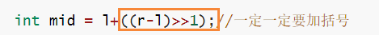
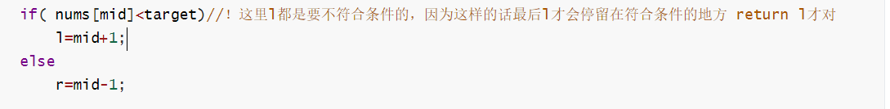
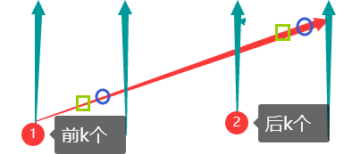
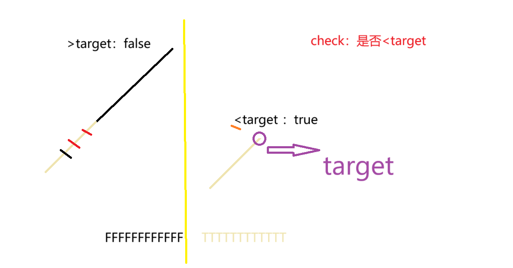

力扣 刷题 二分


34. 在排序数组中查找元素的第一个和最后一个位置 https://leetcode.cn/problems/find-first-and-last-position-of-element-in-sorted-array/solution/er-fen-cha-zhao-zong-shi-xie-bu-dui-yi-g-t9l9/

课后作业：
2529. 正整数和负整数的最大计数 https://leetcode.cn/problems/maximum-count-of-positive-integer-and-negative-integer/
2300. 咒语和药水的成功对数 https://leetcode.cn/problems/successful-pairs-of-spells-and-potions/
2563. 统计公平数对的数目 https://leetcode.cn/problems/count-the-number-of-fair-pairs/
275. H 指数 II https://leetcode.cn/problems/h-index-ii/
875. 爱吃香蕉的珂珂 https://leetcode.cn/problems/koko-eating-bananas/
2187. 完成旅途的最少时间 https://leetcode.cn/problems/minimum-time-to-complete-trips/
2861. 最大合金数 https://leetcode.cn/problems/maximum-number-of-alloys/
2439. 最小化数组中的最大值 https://leetcode.cn/problems/minimize-maximum-of-array/
2517. 礼盒的最大甜蜜度 https://leetcode.cn/problems/maximum-tastiness-of-candy-basket/

课后作业题解：
2529 https://leetcode.cn/problems/maximum-count-of-positive-integer-and-negative-integer/solution/mo-ni-by-endlesscheng-8e43/
2300 https://leetcode.cn/problems/successful-pairs-of-spells-and-potions/solution/by-endlesscheng-1kbp/
2563 https://leetcode.cn/problems/count-the-number-of-fair-pairs/solution/er-fen-cha-zhao-de-ling-huo-yun-yong-by-wplbj/
275 https://leetcode.cn/problems/h-index-ii/solution/tu-jie-yi-tu-zhang-wo-er-fen-da-an-si-ch-d15k/
875 https://leetcode.cn/problems/koko-eating-bananas/solution/er-fen-da-an-fu-ti-dan-pythonjavacgojsru-eb18/
2187 https://leetcode.cn/problems/minimum-time-to-complete-trips/solution/er-fen-da-an-python-yi-xing-gao-ding-by-xwvs8/
2861 https://leetcode.cn/problems/maximum-number-of-alloys/solution/er-fen-da-an-fu-ti-dan-by-endlesscheng-3jdr/
2439 https://leetcode.cn/problems/minimize-maximum-of-array/solution/liang-chong-zuo-fa-er-fen-da-an-fen-lei-qhee6/
2517 https://leetcode.cn/problems/maximum-tastiness-of-candy-basket/solution/er-fen-da-an-by-endlesscheng-r418/

更多二分题目：
https://leetcode.cn/circle/discuss/SqopEo/

## 二分

lower_bound( begin,end,num)：从数组的begin位置到**end-1**位置二分查找**第一个大于或等于num**的数字，找到返回该数字的地址，不存在则返回end。通过返回的地址减去起始地址begin,得到找到数字在数组中的下标。

upper_bound( begin,end,num)：从数组的begin位置到**end-1**位置二分查找**第一个大于num**的数字，找到返回该数字的地址，不存在则返回end。通过返回的地址减去起始地址begin,得到找到数字在数组中的下标。
————————————————

原文链接：https://blog.csdn.net/qq_40160605/article/details/80150252


>
>
>注意点：
>
>1、这层一定一定要加括号
>
>
>
>2、if( nums[mid]<target)//！这里l都是要不符合条件的，因为这样的话最后l才会停留在符合条件的地方 return l才对
>
>
>
>3、


https://www.bilibili.com/video/BV1AP41137w7/?spm_id_from=333.788.top_right_bar_window_history.content.click&vd_source=f2def4aba42c7ed69fc648e1a2029c7b

### [34. 在排序数组中查找元素的第一个和最后一个位置](https://leetcode.cn/problems/find-first-and-last-position-of-element-in-sorted-array/)

```C++
class Solution {
public:
    int lowerbound(vector<int>& nums, int target)
    {
        int n=nums.size();
        int l=0,r=n-1;
        while(l<=r)
        {
            int mid = l+((r-l)>>1);//一定一定要加括号
            if( nums[mid]<target)//！这里l都是要不符合条件的，因为这样的话最后l才会停留在符合条件的地方 return l才对
                l=mid+1;
            else
                r=mid-1;
        }
        return l;
    }
    vector<int> searchRange(vector<int>& nums, int target) {
        int n=nums.size();
        //先判断start是否找到
        //第一个>=x
        int begin = lowerbound(nums,target);
        if(begin==n||nums[begin]!=target)
        {
            return {-1,-1};
        }
        //如果start找到了 那么end肯定也能找到
        //最后一个<=x 即  第一个 >=(x+1) 的索引-1
        int end = lowerbound(nums,target+1)-1;
        return {begin,end};
    }
};
```


### [2529. 正整数和负整数的最大计数](https://leetcode.cn/problems/maximum-count-of-positive-integer-and-negative-integer/)

```C++
class Solution {
public:
    int lowerBound(vector<int>& nums,int target)
    {
        int n=nums.size();
        int l=0;
        int r=nums.size()-1;
        while(l<=r)
        {
            int mid = l+((r-l)>>1);
            if(nums[mid]<target)
                l=mid+1;
            else r=mid-1;
        }
        return l;
    }
    int maximumCount(vector<int>& nums) 
    {
        int n=nums.size();
        //获取第一个>0的数字 即第一个>=(0+1)的数字
        int Positivelower = lowerBound(nums,1);
        int posNum=n-Positivelower;
        //获取最后一个<0的数字，即第一个>=0的数字索引-1
        int NegUpper = lowerBound(nums,0)-1;
        int NegNum = NegUpper+1;
        return max(posNum,NegNum);

    }
};
```


### [2300. 咒语和药水的成功对数](https://leetcode.cn/problems/successful-pairs-of-spells-and-potions/)

```C++
class Solution {
public:
    // int lowerBound(vector<int>& potions, long long spell,long long success)
    int lowerBound(vector<int>& potions, long long target)
    {
        int n=potions.size();
        int l=0,r=n-1;
        while(l<=r)
        {
            int mid = l+((r-l)>>1);
            if(potions[mid]<target)
                l=mid+1;
            else r=mid-1;
        }
        return l;
    }
    vector<int> successfulPairs(vector<int>& spells, vector<int>& potions, long long success) 
    {
        sort(potions.begin(),potions.end());
        //第一个  >= success / spells[i] // *spell[i]>=success
        int n= spells.size();
        vector<int> res(n,0);
        int nPotions = potions.size();
        for(int i=0;i<n;i++)
        {
            // long long target = ceil(success*1.0 / spells[i]); //这个向上取整可以
            long long target = (success+spells[i]-1) / spells[i];//这个向上取整也可以
            // cout<< target <<endl;

            int l=lowerBound(potions,target);
            res[i]+=(nPotions-l);
        } 
        return res;
    }
};
```

### 2529. 统计公平数对的数目


2529. 统计公平数对的数目 https://leetcode.cn/problems/count-the-number-of-fair-pairs/

##### 用C++接口

```C++
class Solution {
public:
    long long countFairPairs(vector<int>& nums, int lower, int upper) 
    {
        //逐个2分
        //或者滑动窗口 但是要排序 所以最小也是nlogn
        
        sort(nums.begin(),nums.end());
        long long cnt=0;
        int n=nums.size();
        for(int i=0;i<n;i++)
        {
            int target = lower-nums[i];
            //lower_bound第一个>=t的索引
            auto indexL = lower_bound(nums.begin(),nums.begin()+i, target);
           
            target = upper-nums[i];
             //upper_bound第一个>t的索引
            auto indexU = upper_bound(nums.begin(),nums.begin()+i,target);
            cnt += (indexU-indexL);//其实是 indexU-(indexL-1)+1
        }
        return cnt;
    }
};
```

lower_bound( begin,end,num)：从数组的begin位置到**end-1**位置二分查找**第一个大于或等于num**的数字，找到返回该数字的地址，不存在则返回end。通过返回的地址减去起始地址begin,得到找到数字在数组中的下标。

upper_bound( begin,end,num)：从数组的begin位置到**end-1**位置二分查找**第一个大于num**的数字，找到返回该数字的地址，不存在则返回end。通过返回的地址减去起始地址begin,得到找到数字在数组中的下标。
————————————————

原文链接：https://blog.csdn.net/qq_40160605/article/details/80150252

##### 自己写二分

```C++
class Solution {
public:
    int lowerBound(vector<int>& nums,int l,int r,int target)
    {
        // int l=0;
        // int r= nums.size()-1;
        while(l<=r)
        {
            int mid = (l+((r-l)>>1));
            if(nums[mid]<target)
            {
                l=mid+1;
            }
            else r=mid-1;
        }
        return l;
    }
    long long countFairPairs(vector<int>& nums, int lower, int upper) 
    {
        //逐个2分
        //或者滑动窗口 但是要排序 所以最小也是nlogn
        
        sort(nums.begin(),nums.end());
        long long cnt=0;
        int n=nums.size();
        for(int i=0;i<n;i++)
        {
            int target = lower-nums[i];
            //第一个>=t的索引
            int indexL = lowerBound(nums,i+1,n-1, target);
           
            target = upper-nums[i];
             //最后一个 <=t 第一个>=(x+1)-1
            int indexU = lowerBound(nums,i+1,n-1,target+1)-1;
            cnt += (indexU-indexL+1);
        }
        return cnt;
    }
};
```

### 2529. H 指数 II  :open_mouth:
2529. H 指数 II https://leetcode.cn/problems/h-index-ii/

正常写法：

```C++
class Solution {
public:
//https://leetcode.cn/problems/h-index-ii/solutions/870989/h-zhi-shu-ii-by-leetcode-solution-si7h/
    int lowerBound(vector<int>& citations,int n)
    {
        // int l=0,r=citations.size()-1;
        int l=0,r=citations.size()-1;
        while(l<=r)
        {
            int mid = l+((r-l)>>1);
            if(citations[mid]<n-mid)//如果论文引用量 小于 后面那些符合要求的论文 说明h还可以更高 
            {
                l=mid+1;
            }
            else r=mid-1;
        }
        return n-l;
    }
    int hIndex(vector<int>& citations) {
        //论文的数量n-i 是  引用数量>=c[i]   的论文的数量
        int n=citations.size();
        int a=lowerBound(citations,n);
        return a;
    }
};
```


特殊情况：

输入

citations =

[100]

预期结果

1

这样的话其实应该输出1，也就是符合>=h的个数


非板子写法，不过可能更好理解点：

> if(citations[mid]>=n-mid)
>                r= mid-1;
>            else
>                l=mid+1;
>
>这里与板子写的是反的

```C++
class Solution {
public:
//https://leetcode.cn/problems/h-index-ii/solutions/870989/h-zhi-shu-ii-by-leetcode-solution-si7h/
    int lowerBound(vector<int>& citations,int n)
    {
        // int l=0,r=citations.size()-1;
        int l=0,r=citations.size()-1;
        while(l<=r)
        {
            int mid = l+((r-l)>>1);
            //找到第一个满足条件citations[mid] >= n - mid的位置mid，(引用次数>=h)
            //此时h = n - mid（因为从mid到末尾共有n - mid篇论文，均满足引用次数≥h）
            if(citations[mid]>=n-mid)
                r= mid-1;
            else
                l=mid+1;
        }
        
        return n-l;
    }
    int hIndex(vector<int>& citations) {
        //论文的数量n-i 是  引用数量>=c[i]   的论文的数量
        //寻找 n-i <= c[i] 就是 c[i]+i>=n 的第一个值
        int n=citations.size();
        int a=lowerBound(citations,n);
        return a;
    }
};
```


### 2530. 爱吃香蕉的珂珂

2530. 爱吃香蕉的珂珂 https://leetcode.cn/problems/koko-eating-bananas/

Y:

```C++
class Solution {
public:
    long long eatTime(vector<int>& piles,int k)
    {
        long long sum=0;
        for(int i=0;i<piles.size();i++)
        {
            sum +=(long long)(piles[i]+k-1)/k;
        }
        return sum;
    }
    int minEatingSpeed(vector<int>& piles, int h) 
    {
        //每小时，第i堆吃k根  if <k,吃完
        // 3 6 7 11
        // 0 6 7 11
        // 0 2 7 11
        // 0 0 7 11
        // 0 0 3 11
        // 0 0 0 11

        //sum ceil(piles[i]/k) <=h
        //最小的第一个值 使得<=h

        int pilesN = piles.size();
        //满足 piles.length <= h  则一定能吃完，最快就是一小时吃 max_element
        int maxele = *max_element(piles.begin(),piles.end());

        // k ->(1 ~ pilesN)
        int l=1,r=maxele;
        while(l<=r)
        {
            int mid = l+((r-l)>>1);
            if(eatTime(piles,mid)>h)//吃的总时间超过了 ，速度要加快
            {
                l=mid+1;
            }
            else r=mid-1;
        }
        //最后是l
        //第一个<=h的
        return l;

    }
};
```


## 7.[2070. 每一个查询的最大美丽值](https://leetcode.cn/problems/most-beautiful-item-for-each-query/)

这道题目需要先找到price符合要求的数，然后再看这些数里面beauty最大的值是多少。可以维护一个截止到索引`i`的最大值，即维护一个前缀最大值，然后查询即可。

```C++
class Solution {
public:
    static bool cmp(vector<int> &item1,vector<int> &item2)//static!!!!要有
    {
        return item1[0]<item2[0];
    }
    vector<int> maximumBeauty(vector<vector<int>>& items, vector<int>& queries) {
        sort(items.begin(),items.end(),cmp);
        int  n=items.size();
        vector<int> m(n);//维护比它钱少的东西中（包含它） 美丽值最大的美丽值值
        int maxBeauty=0;
        for(int i=0;i<n;i++)
        {
            maxBeauty = max(maxBeauty,items[i][1]);
            m[i]=maxBeauty;
        }
        int qn = queries.size();
        int l=0,r;
        vector<int> res(qn);
        //items中寻找最后一个价格<=queries i --》 第一个价格>qi的索引-1 ----》第一个价格>=（qi+1）的索引-1  
        for(int i=0;i<qn;i++)
        {
            l=0,r=n-1;
            while(l<=r)
            {
                int mid = l+((r-l)>>1);
                if((queries[i]+1)>items[mid][0])
                {
                    l=mid+1;
                }
                else r=mid-1;
            }
            int resIdx = l-1;
            if(resIdx<0)res[i]=0;//!!!需要这个
            else  res[i]=m[resIdx];
        }
        return res;
    }
};
```


# 三、二分答案

## 1.求最小

题目求什么，就二分什么。

题目求什么，就二分什么。

### （1）[1283. 使结果不超过阈值的最小除数](https://leetcode.cn/problems/find-the-smallest-divisor-given-a-threshold/)

```c++
class Solution {
public:
    int getSum(vector<int>& nums, int k){
        int sum = 0;
        for(int i=0;i<nums.size();i++)
        {
            sum+=(nums[i]+k-1)/k; //向上取整
        }
        return sum;
    }
    int smallestDivisor(vector<int>& nums, int threshold) 
    {
        //这就是香蕉那个题目的变种
        //使得sum(nums[i]/k)<=thresold的最小k,当k增大的时候,sum(nums[i]/k)会更小,当k减小的时候,不满足题意,因此要找的就是最优的位置
        int m = *max_element(nums.begin(), nums.end());
        int n = nums.size();
        //也可以auto it = minmax_element(nums.begin(),nums.end());
        //int minN = *it.first,maxN = *it.second;
        //int n=nums.size();
        //long long l=(minN*1.0/threshold*n) ;
        int left = 1, right = m; // 其实本题不需要排序,找到最大值的m即可开始二分!!边界!	
        while(left<=right){
            int mid = left+((right-left)>>1);
            int sum = getSum(nums, mid);
            if(sum>threshold){
                left = mid + 1;
            } else{
                right = mid - 1;
            }
        }
        return left;
    }
};
```


### 2531. 完成旅途的最少时间 

2531. 完成旅途的最少时间 https://leetcode.cn/problems/minimum-time-to-complete-trips/

在做二分题目的时候，**美丽C++有long long范围溢出的问题不会报错**。注意，如果题目可能会达到`long long`的范围。

```C++
class Solution {
public:
    long long getTrips(vector<int>& time, long long a)
    {
        long long sumtrip=0;//都得ll 不然都得死 还不报溢出错 感觉是不然这里加ll会有误差?
        for(int t:time)
        {
            sumtrip+=a/t;
        }
        return sumtrip;
    }
    long long minimumTime(vector<int>& time, int totalTrips) 
    {
        // sum (floor t/time[i]) >=totaltrips

        //最快的车1趟1h 跑totalTrips=5趟，需要5h
        long long minCarTime = *min_element(time.begin(),time.end());//2
        long long l=1,r=totalTrips* minCarTime;//1*2=2
        while(l<=r)
        {
            long long mid =l+((r-l)>>1);
            if(getTrips(time, mid)<totalTrips)//完成的旅途偏少，增加时间
            {
                l=mid+1;
            }
            else r=mid-1;
        }
        return l;
    }
};
```

返回的就是long long 是时间,l,r,mid也是 自然也要long long


### （3）[1870. 准时到达的列车最小时速](https://leetcode.cn/problems/minimum-speed-to-arrive-on-time/)（美丽算法，超光速上班，逃离银河系）


### [1870. 准时到达的列车最小时速](https://leetcode.cn/problems/minimum-speed-to-arrive-on-time/)

```C++
class Solution {
public:
    long long getHour(vector<int>& dist, long long v)
    {
        int n=dist.size();
        long long sumhour =0;
        for(int i=0;i<n-1;i++)
        {
            sumhour+=(((long long)dist[i]-1)/v+1);
        }
        sumhour*=v;
        sumhour+=dist[n-1];
        return round(sumhour*100);
    }
    // //以下这样写是错的  原因在下面
    // long long getHour(vector<int>& dist, long long v)
    // {
    //     int n=dist.size();
    //     long long sumhour =0;
    //     for(int i=0;i<n-1;i++)
    //     {
    //         sumhour+=(((long long)dist[i]*100-1)/v+1);//
    //     }
    //     sumhour*=v;
    //     sumhour+=dist[n-1]*100;//
    //     return round(sumhour);//
    // }
    int minSpeedOnTime(vector<int>& dist, double hour) 
    {
        long long h100 = llround(hour*100);
        int n=dist.size();
        if(hour<=n-1)return -1;
        //getHour sum(di(0-n-2)/v)+di n-1/v <=hour
        //getHour sum(di(0-n-2)/v)*v+di n-1 <=hour*v
        //最后一个<=hour  111 222 444 算出来后最后一个<=hour的 第一个
        long long l=1,r=1e7;
        while(l<=r)
        {
            long long mid = l+((r-l)>>1);
            // 时间小了，速度可以更慢点小一点
            // 时间大了，速度要更大
            if(getHour(dist, mid)>h100*mid) 
            {
                l=mid+1;
            }
            else r=mid-1;

        }
        return l;


    }
};
```

牢记：

- （1）比如题目有最多两位小数的浮点数，那可以考虑在**浮点数全部计算完，在比较或进一步运算的时候，乘100再取round，`llround`是一个可以使用的接口**(round是做四舍五入)
- （2）涉及到浮点数，且`a/k>b`，**最好**转换为`a>b*k`,否则可能会有不好的事情发生（效果不正确）.


>问题“
>
>为什么以下这么些会错
>
>```C++
>//long long getHour(vector<int>& dist, long long v)
>    // {
>    //     int n=dist.size();
>    //     long long sumhour =0;
>    //     for(int i=0;i<n-1;i++)
>    //     {
>    //         sumhour+=(((long long)dist[i]*100-1)/v+1);//
>    //     }
>    //     sumhour*=v;
>    //     sumhour+=dist[n-1]*100;//
>    //     return round(sumhour);//
>    // }
>```
>
>结果
>
>```
>输入
>dist =
>[1,1,100000]
>hour =
>2.01
>输出
>50252
>预期结果
>10000000
>```
>
>
>
>要解决这个问题，我们需要找到最小的列车时速，使得按顺序乘坐所有列车后的总通勤时间不超过给定的时间。由于列车只能在整点发车，我们需要考虑等待时间。
>
>### 方法思路
>
>1. **问题分析**：
>   - 每趟列车（除了最后一趟）的运行时间需要向上取整，因为必须等到下一个整点才能发车。
>   - 最后一趟列车的运行时间不需要向上取整，因为它到达后不需要换乘。
>
>2. **关键思路**：
>   - 使用二分查找法来找到最小时速。二分查找的范围是1到10^7，因为题目保证答案不超过10^7。
>   - 通过转换计算避免浮点数精度问题，将小时转换为整数处理。
>
>3. **计算总时间**：
>   - 对于前n-1趟列车，计算每趟列车的运行时间并向上取整。
>   - 最后一趟列车的运行时间直接计算，不需要向上取整。
>   - 将总时间转换为整数处理以避免浮点误差。
>
>### 解决代码
>
>```cpp
>#include <vector>
>#include <cmath>
>#include <algorithm>
>
>using namespace std;
>
>class Solution {
>public:
>    long long getHour(vector<int>& dist, long long v) {
>        int n = dist.size();
>        long long sumhour = 0;
>        for (int i = 0; i < n - 1; ++i) {
>            sumhour += ((dist[i] + v - 1) / v; // 等价于ceil(dist[i]/v)
>        }
>        sumhour *= v; // 将前n-1趟的时间转换为总距离的整数倍
>        sumhour += dist.back(); // 加上最后一趟的距离
>        return sumhour * 100; // 转换为整数处理
>    }
>
>    int minSpeedOnTime(vector<int>& dist, double hour) {
>        long long h100 = llround(hour * 100);
>        int n = dist.size();
>        if (h100 < (n - 1) * 100) { // 总时间必须大于等于n-1小时
>            return -1;
>        }
>
>        long long left = 1;
>        long long right = 1e7;
>
>        while (left <= right) {
>            long long mid = left + (right - left) / 2;
>            long long total = getHour(dist, mid);
>            if (total > h100 * mid) { // 检查总时间是否超过允许的小时数
>                left = mid + 1;
>            } else {
>                right = mid - 1;
>            }
>        }
>
>        return left > 1e7 ? -1 : left;
>    }
>};
>```
>
>### 代码解释
>
>1. **getHour函数**：
>   - 计算前n-1趟列车的运行时间，向上取整后累加。
>   - 将累加的时间乘以速度转换为总距离，加上最后一趟列车的距离。
>   - 返回总时间的整数形式（乘以100以避免浮点误差）。
>
>2. **minSpeedOnTime函数**：
>   - 将给定小时转换为整数形式（h100）。
>   - 使用二分查找确定最小速度，检查每个中间速度是否满足总时间要求。
>   - 调整二分查找的左右边界，直到找到最小速度或确定无法按时到达。
>
>该方法通过避免浮点数计算，确保精度，有效解决了问题。


## 2.求最大

### （1）[2226. 每个小孩最多能分到多少糖果](https://leetcode.cn/problems/maximum-candies-allocated-to-k-children/)  CHECK

[2226. 每个小孩最多能分到多少糖果](https://leetcode.cn/problems/maximum-candies-allocated-to-k-children/)

给你一个 **下标从 0 开始** 的整数数组 `candies` 。数组中的每个元素表示大小为 `candies[i]` 的一堆糖果。你可以将每堆糖果分成任意数量的 **子堆** ，但 **无法** 再将两堆合并到一起。

另给你一个整数 `k` 。你需要将这些糖果分配给 `k` 个小孩，使每个小孩分到 **相同** 数量的糖果。每个小孩可以拿走 **至多一堆** 糖果，有些糖果可能会不被分配。

返回每个小孩可以拿走的 **最大糖果数目** 。

**示例 1：**

```
输入：candies = [5,8,6], k = 3
输出：5
解释：可以将 candies[1] 分成大小分别为 5 和 3 的两堆，然后把 candies[2] 分成大小分别为 5 和 1 的两堆。现在就有五堆大小分别为 5、5、3、5 和 1 的糖果。可以把 3 堆大小为 5 的糖果分给 3 个小孩。可以证明无法让每个小孩得到超过 5 颗糖果。
```

**示例 2：**

```
输入：candies = [2,5], k = 11
输出：0
解释：总共有 11 个小孩，但只有 7 颗糖果，但如果要分配糖果的话，必须保证每个小孩至少能得到 1 颗糖果。因此，最后每个小孩都没有得到糖果，答案是 0 。
```

 

```C++
class Solution {
public:
    bool check(vector<int>& candies, long long k,int mid)
    {
        long long sum=0;
        //计算小孩可以拿走的糖果数量mid ，能满足多少小孩
        for(int i=0;i<candies.size();i++)
        {
            sum+=candies[i]/mid;
        }
        return sum<k;
    }
    int maximumCandies(vector<int>& candies, long long k) 
    {
        //check  给childGetNum=mid个 小孩可以拿走的糖果数量  能否保证k个小孩都可以吃上
        //随着mid增大，F F F F T T T ，满足k个小孩可以吃上-》不满足
        //check 是否 不满足k个小孩不能吃上（满足的小孩数量<k），要求要 能满足的最大mid 最后一个F 找第一个true-1
        
        long long totalSum = accumulate(candies.begin(),candies.end(),0LL);//啊?? accumulate算longlong,初始值要是0LL 如果是0就会报错(因为会溢出)
        if(totalSum<k)return 0;////特判相当于left=0的情况,不然上面一除可能分母为0导致错误
        int l=1,r=*max_element(candies.begin(),candies.end());
        while(l<=r)
        {
            int mid = l+((r-l)>>1);
            if(check(candies,k,mid))
            {
                r=mid-1;
            }
            else l=mid+1;
        }
        return l-1;
        
    }
};
```

【美丽C++，爱护靠大家】：`long long sum = accumulate(candies.begin(), candies.end(), 0LL);`，如果计算的总和是一个`long long`的话，`accumulate`函数最后一个参数得显式地指明为`0LL`，不然运行时会越界报错。


>//跟前面的题有类似指出,随着最大糖果数目的增加,能分配小孩的数目不会再上涨了.
>        //sum((向下取整)candies[i]/c)>=k的最后一个,即sum...<k的第一个-1
>        //本题要找false的最后一个
>        //如果candies的总和都比小孩数少,则一个小孩都拿不到,return 0

### [2576. 求出最多标记下标](https://leetcode.cn/problems/find-the-maximum-number-of-marked-indices/) check函数大法 胖胖自创


check



```C++
class Solution {
public:
    bool check(vector<int>& nums, int k )
    {
        //k对能否匹配
        //前k小和后k大拿出来 一一比较 
        //0~k-1 i  ---  n-k~n-1   i+n-k
        //eg // 01234567 k=3  012 i~K-1  567 i+n-k //n8 8-3=5
        int n=nums.size();
        for(int i=0;i<k;i++)
        {
            if(nums[i]*2>nums[i+n-k])return true;
        }
        return false;
    }
    int maxNumOfMarkedIndices(vector<int>& nums) {
        sort(nums.begin(),nums.end());
        //k
        // F F F T T T
        // 随着k的增大，能匹配-》不能匹配
        //F 能匹配   T 不能匹配
        //要找到是最后一个F = 第一个T-1
        int n=nums.size();
        int l = 0,r=n/2;
        while(l<=r)
        {
            int mid = l+((r-l)>>1);
            if(check(nums,mid))
            {
                r=mid-1;
            }
            else l=mid+1;
        }
        return (l-1)*2;
    }
};
```


2532. 最大合金数 https://leetcode.cn/problems/maximum-number-of-alloys/
2533. 最小化数组中的最大值 https://leetcode.cn/problems/minimize-maximum-of-array/
2534. 礼盒的最大甜蜜度 https://leetcode.cn/problems/maximum-tastiness-of-candy-basket/


### check函数大法 胖胖自创  [153. 寻找旋转排序数组中的最小值](https://leetcode.cn/problems/find-minimum-in-rotated-sorted-array/)


已知一个长度为 `n` 的数组，预先按照升序排列，经由 `1` 到 `n` 次 **旋转** 后，得到输入数组。例如，原数组 `nums = [0,1,2,4,5,6,7]` 在变化后可能得到：

- 若旋转 `4` 次，则可以得到 `[4,5,6,7,0,1,2]`
- 若旋转 `7` 次，则可以得到 `[0,1,2,4,5,6,7]`

注意，数组 `[a[0], a[1], a[2], ..., a[n-1]]` **旋转一次** 的结果为数组 `[a[n-1], a[0], a[1], a[2], ..., a[n-2]]` 。

给你一个元素值 **互不相同** 的数组 `nums` ，它原来是一个升序排列的数组，并按上述情形进行了多次旋转。请你找出并返回数组中的 **最小元素** 。

你必须设计一个时间复杂度为 `O(log n)` 的算法解决此问题。

 

**示例 1：**

```
输入：nums = [3,4,5,1,2]
输出：1
解释：原数组为 [1,2,3,4,5] ，旋转 3 次得到输入数组。
```



```C++
class Solution {
public:
    bool check(vector<int>& nums,int k,int target ) //check:F：>target ,T：<=target【FFFTTTT】
    {
        if(nums[k]>target)return false;
        else return true;
    }
    int findMin(vector<int>& nums) {
        int n=nums.size();
        int target = nums[n-1];
        int l=0,r=n-2;
        while(l<=r)
        {
            int mid = l+((r-l)>>1);
            if(check(nums,mid,target))r=mid-1;
            else l=mid+1;
        }
        return nums[l];

        
    }
};
```

