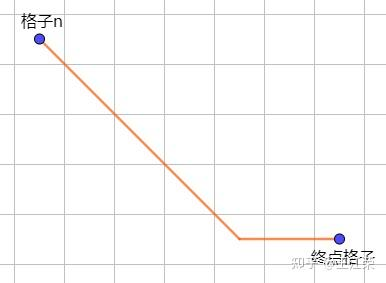
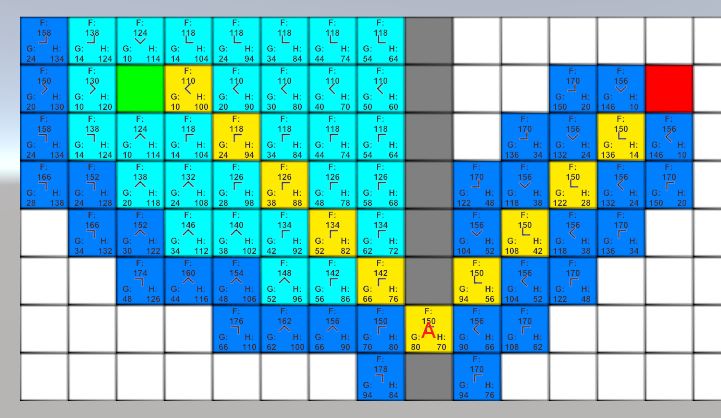
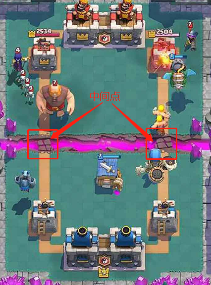
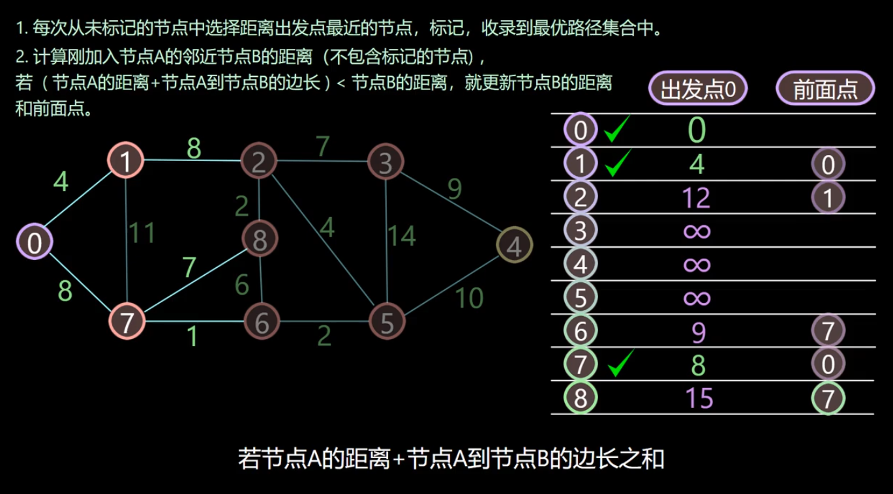

==介绍下A*算法== A星寻路算法

https://zhuanlan.zhihu.com/p/385733813

- [x] ==A*算法的缺点，为什么游戏中不使用==
- [x] ==A*算法和Dijkstra算法的区别==

### 估价函数

前面我们说了要对每个可能到达的格子进行估价，来判断应该先往哪个格子走，因此我们需要一个估价函数来计算。

对于任意一个格子n，其估价函数如下：

> f(n) = g(n) + h(n)

**其中 g(n) 指的是从起始格子到格子n的实际代价，而 h(n) 指的是从格子n到终点格子的估计代价。**

>感觉可能是因为
>
>- **g(n)**: **g**o -> 实际代价，从起始点“去”到当前节点的代价。
>- **h(n)**: **h**euristic -> 启发式估计，从当前节点估计到目标的代价。

启发式函数选择:

**[欧几里得距离](https://zhida.zhihu.com/search?content_id=173849187&content_type=Article&match_order=1&q=欧几里得距离&zhida_source=entity)**

曼哈顿距离  **只准水平或垂直移动**

对角线+直线距离

​	既然我们可以对角线移动，那么我们就可以根据水平方向的差值与竖直方向的差值中较小的那个值，计算出对角线，然后再平移。示意图如下：

## A*算法的缺点，为什么游戏中不使用？

gpt：

虽然A*算法在路径搜索中非常有效，但在某些情况下，它的缺点可能使其不适合用于游戏开发。以下是一些主要的缺点和原因：

### 1. **计算开销**

- A*算法需要存储整个开放列表（即待评估的节点）和封闭列表（即已评估的节点），这在大型地图或复杂场景中会消耗大量内存和处理能力。
- 在实时游戏中，这种计算开销可能导致较大的延迟，影响游戏性能。

### 2. **启发式函数依赖**

- A*算法的效率高度依赖于选择的启发式函数。如果选择不当，可能会导致搜索过程变得低效，甚至退化成类似于广度优先搜索的表现。
- 不同的游戏环境和目标要求定制启发式函数，这增加了实现的复杂性。

### 3. **动态变化的环境**

- 在许多游戏中，环境是动态变化的，例如障碍物的移动、敌人的出现等。A*算法在静态图上表现良好，但在动态环境下，需要频繁地重新计算路径，这会增加额外的计算负担。

### 4. **非最优解**

- 虽然A*旨在找到最优路径，但在某些情况下（特别是在存在不可达区域或复杂地形时），它可能无法找到最佳解决方案。

### 5. **复杂性和可实现性**

- 对于新手开发者来说，A*算法的实现可能相对复杂。在简单的场景中，使用更简单的算法（如随机游走或Dijkstra算法）可能会更容易实施。

### 游戏中的替代方法

由于这些缺点，许多游戏开发者可能更倾向于使用其他算法或策略，例如：

- **Dijkstra算法**：虽然开销较大，但在某些情境下可以保证找到最优路径。
- **基于状态机的路径规划**：在特定场景下使用状态机来管理角色行为，而不是总是计算路径。
- **局部路径规划**：例如，以“避障”为主的局部搜索算法，可以快速调整路径以应对动态环境。

总之，尽管A*算法在理论上非常强大，但在实际游戏开发中，由于计算需求、灵活性和性能等问题，开发者往往会根据具体需求选择更合适的替代方案。

其他的一些优化：

当我们地图被某些障碍物分割，只留了一两个可通过的小口时，可以将寻路过程拆解开来，例如下图：

障碍物左侧做了很多没有意义的格子计算

可以将起点到终点的寻路过程拆分为起点到A点，A点到终点的两段寻路过程，来减少不必要的计算。像皇室战争这样的地图就可以使用这样的方式：

# Dijkstra**算法**

**https://youtu.be/JLARzu7coEs**

https://www.freecodecamp.org/chinese/news/dijkstras-shortest-path-algorithm-visual-introduction/

### 算法目标和使用场景

使用 Dijkstra 算法，可以寻找图中节点之间的最短路径。特别是，可以**在图中寻找一个节点（称为“源节点”）到所有其它节点的最短路径**，生成一个最短路径树。

GPS 设备使用这个算法来寻找当前位置到目标位置的最短路径。Dijkstra 算法被广泛应用在工业上，尤其是需要建模网络的领域。

### 必要条件

Dijkstra 只能用在权重为**正**的图中，因为计算过程中需要将边的权重相加来寻找最短路径。

## 比较

https://blog.csdn.net/wangjingqi930330/article/details/72457584

Dijkstra算法和A*算法都是在图论中寻找最短路径的有效方法。Dijkstra算法适用于没有负权重的图，而A*算法则可以在存在负权重的图中找到最短路径。在实际应用中，应根据具体问题和场景选择合适的算法。例如，在[游戏](https://cloud.baidu.com/solution/game.html)地图寻路中，A*算法通常比Dijkstra算法更高效。而在[网络](https://cloud.baidu.com/product/et.html)路由等场景中，Dijkstra算法则可能更为适用。

gpt:

### 3. **效率**

- **Dijkstra算法**:
  - 在没有启发式信息的情况下，Dijkstra算法可能会探索更多的节点，特别是在大型图中。这使得算法效率较低。
- **A\*算法**:
  - A*算法通常比Dijkstra算法更高效，因为它可以优先探索更接近目标的节点。如果启发式函数设计得当（例如一致性和可估计性），A*算法可以显著减少需要探索的节点数量。

### 4. **适用场景**

- **Dijkstra算法**:
  - 更适合用于找出从起点到所有其他节点的最短路径问题，尤其是在没有明确目标的情况下。
- **A\*算法**:
  - 更适合在二维或三维空间中寻找特定目标路径的问题，如游戏开发中的角色移动或机器人导航等情况。

### 总结

- **Dijkstra算法**：适合全局最短路径计算，不考虑目标节点的估计信息。
- **A\*算法**：通过引入启发式函数提高搜索效率，适合特定目标的最短路径查找。

