# 内存对齐

\PrepareForWorkNotes\2025寒假\Y\note\知识点\内存对齐

粗略理解：

为了内存获取速度更快

CPU访问的时候是一组一组的访问

以下访问b时，只访问了1次。

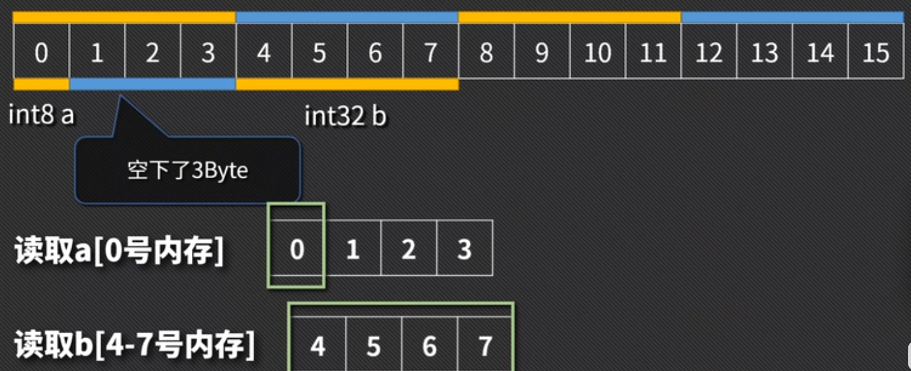

以下访问b时，访问了2次。然后再拼在一起

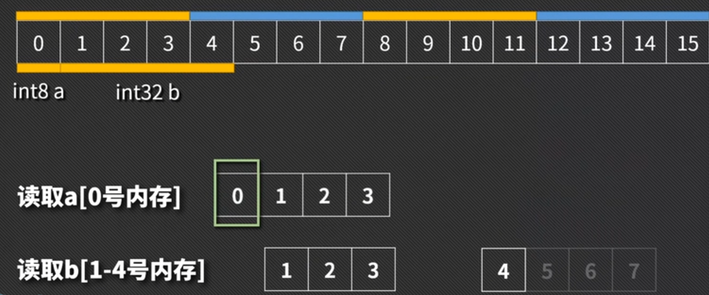

CPU访问内存速度很慢，尽量不要让它访问多次。

更深刻理解：

【【Golang】这个内存对齐呀！？】 https://www.bilibili.com/video/BV1Ja4y1i7AF/?share_source=copy_web&vd_source=067de257d5f13e60e5b36da1a0ec151e

>#### **1. 地址总线（Address Bus）**
>
>- **作用**：传输内存地址，告诉内存“CPU要访问哪个位置的数据”。
>  - 相当于快递单号，告诉快递员去哪个地址取包裹。下单在上海某公司买个立牌
>- **位宽决定寻址空间**：
>  - 如果地址总线有8根（8位），能表示的地址范围是 `0~255`（共256个地址），每个地址对应1字节内存，因此最大寻址空间为 **256字节**。
>  - 若地址总线是32位，可表示 `0~2^32-1` 个地址，每个地址对应1字节，寻址空间为 **4GB**（`2^32 字节 = 4,294,967,296 字节 ≈ 4GB`）。
>
>#### **2. 数据总线（Data Bus）**
>
>- **作用**：传输数据内容，告诉CPU“内存返回的具体数据是什么”。
>  - 相当于快递员把包裹从指定地址运回来。从上海把立牌寄过来
>- **位宽决定单次传输量**：
>  - 如果数据总线是32位，一次可传输 **4字节**（`32位 ÷ 8位/字节 = 4字节`）。
>  - 如果是64位，一次可传输 **8字节**。
>
>#### **3. 机器字长**
>
>- **定义**：CPU一次能处理的数据位数，通常等于数据总线的位宽。
>  - 32位CPU → 数据总线32位 → 单次操作4字节。
>  - 64位CPU → 数据总线64位 → 单次操作8字节。
>- **为什么重要**：
>  - 字长越大，单次处理的数据量越大，性能越高。
>  - 例如：64位CPU处理8字节数据比32位CPU快一倍（假设操作次数相同）。
>
>
>
>------
>
>### **类比理解**
>
>1. **地址总线**：
>   - 类似“楼层房间号”，告诉服务员去哪个房间取东西。
>   - 房间号位数越多（地址总线越宽），能管理的房间（内存地址）越多。
>2. **数据总线**：
>   - 类似“货梯容量”，决定一次能搬运多少东西。
>   - 货梯越大（数据总线越宽），单次搬运的货物（数据）越多。
>3. **机器字长**：
>   - 类似“工人的体力”，决定工人一次能搬多少货物。
>   - 体力越好（字长越大），工作效率越高。
>
>------
>
>### **示例场景**
>
>- **32位系统**：
>  - 地址总线32位 → 能管理4GB内存。
>  - 数据总线32位 → 一次读写4字节。
>- **64位系统**：
>  - 地址总线64位 → 能管理海量内存（理论16EB）。
>  - 数据总线64位 → 一次读写8字节。
>
>### **常见问题**
>
>1. **为什么数据总线宽度要和字长一致？**
>   - CPU的设计需要匹配数据总线的能力，否则会浪费性能。例如，64位CPU配32位数据总线，相当于工人有搬8箱的体力，但每次只能搬4箱。
>2. **地址总线和数据总线可以不同宽度吗？**
>   - 可以。例如，早期8086 CPU是16位字长（数据总线16位），但地址总线20位，能寻址1MB内存（`2^20 = 1,048,576 字节`）。
>
>

CPU想要读取内存的话，需要通过地址总线，将地址传输给内存。

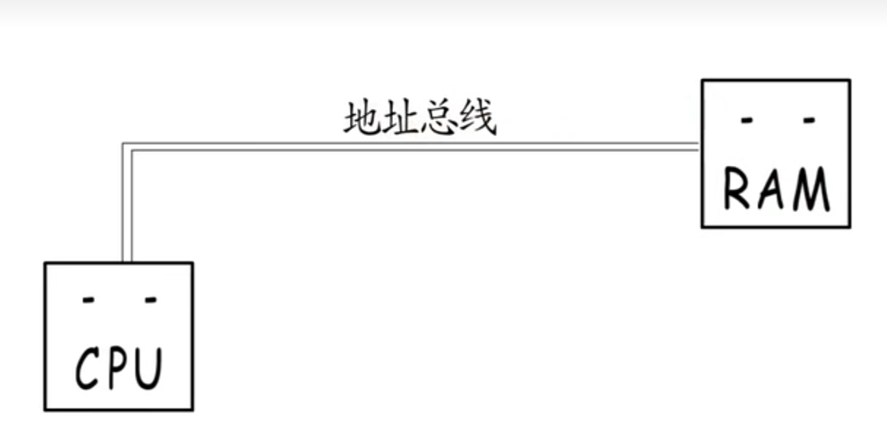

内存准备好数据，输出到 数据总线，交给CPU

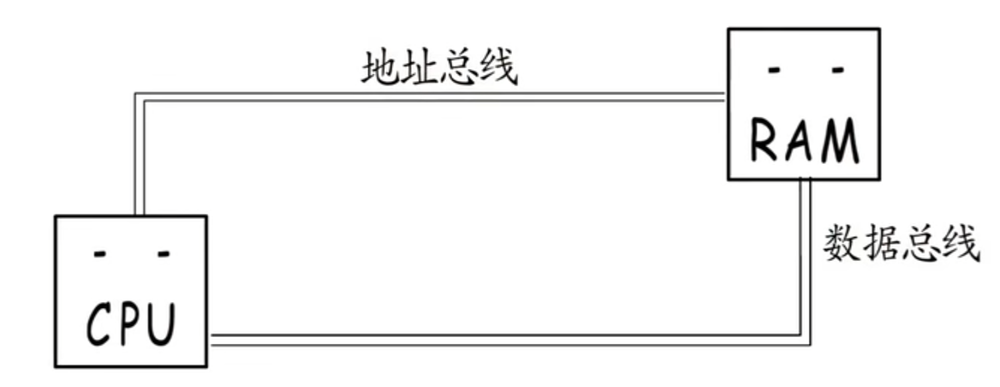

如果地址总线只有8根，那么这个地址就只有8位，可以表示256个地址<（0000 0000 - 1111 1111）=（0-255）>。因为表示不了更多的地址，就用不到更大的内存。

8根地址总线能寻址的最大空间是256字节

（每个地址对应1字节=8位内存，同一个地址在8块banks上找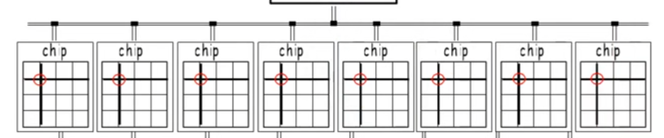)

要使用更大的内存，比如4G，就要使用更宽的地址总线

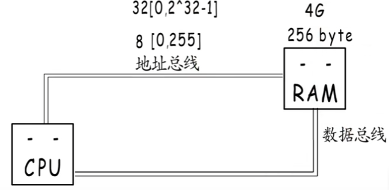

每次操作一个字节太慢，就加宽数据总线。

要想每次操作4字节，就需要32位数据总线。8字节就要64位。

这里每次操作的字节数， 就是机器字长

实际上的内存：

一个内存条的一面是1个Rank，

一个Rank有8个Chip，

一个Chip包括8个Bank

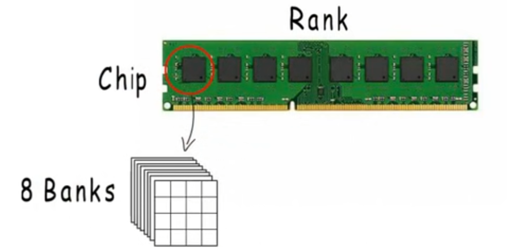

到Bank这里就可以通过选择行，选择列来定位一个地址了。

这不像我们逻辑上认为的连续的存在，但他们共用同一个地址，各自选择同一个位置的同一个字节，再组合起来，作为我们逻辑上认为的连续8个字节。

通过这样的并行操作，提高了内存访问的效率。但如果使用这种设计，这里的**地址就只能是8的倍数**

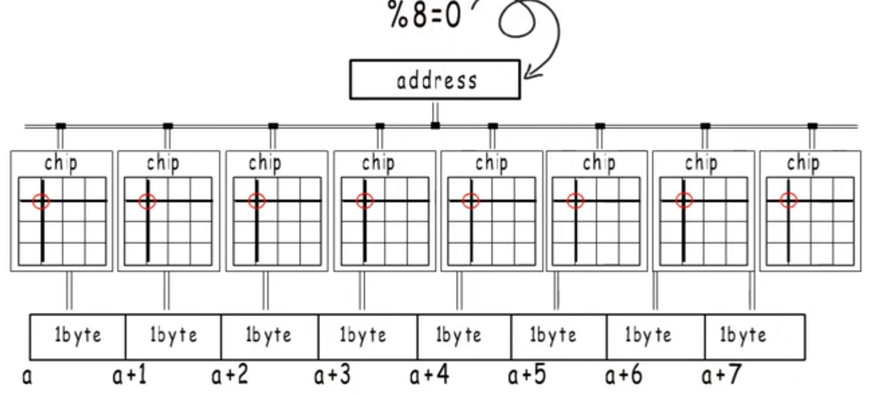

如果想访问任意地址，那么就需要读取两个再拼接起来

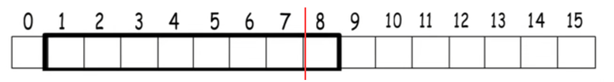

内存对齐要求**1、数据存储地址**，以及**2、占用的字节数**都要是**它对其边界**的**倍数** 

常见的32位平台，指针宽度=4，寄存器宽度=4

常见的64位平台，指针宽度=8，寄存器宽度=8

寄存器宽度=机器字长=最大对齐边界

数据对齐边界 = min( 类型大小，平台对齐边界 )

>对齐边界由以下两者共同决定：
>
>- **数据类型自身大小**（如 `int` 为4字节，`double` 为8字节）。
>- **平台最大对齐边界**（32位系统为4字节，64位系统为8字节）。
>
>**实际对齐边界** = `min(数据类型大小, 平台对齐边界)`。

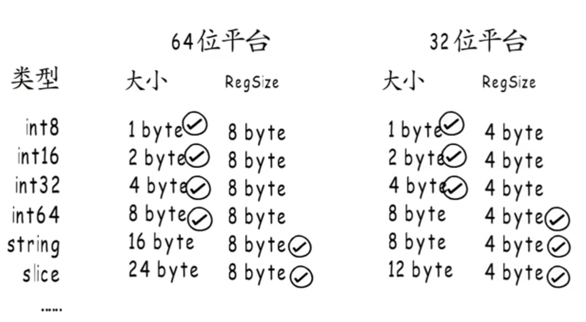

做题：

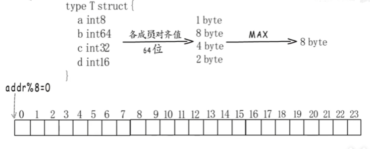

答案：

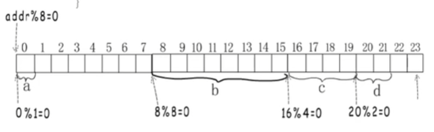

精简点说（面试回答版）

#### **内存对齐的原理**

内存对齐是为了 **让CPU高效访问内存**，避免因数据跨越访问粒度边界而引发多次内存操作或硬件异常。

其核心规则是：
**数据的存储地址和占用的字节数必须是对齐边界的整数倍**，而对齐边界取 **数据类型大小** 和 **平台最大对齐边界** 的较小值。

#### **为什么要对齐？**

- **性能优化**：
  CPU按固定字长（如4/8字节）访问内存，对齐后单次读取即可获取数据；非对齐数据可能需多次访问并拼接，增加延迟。
- **硬件兼容性**：
  某些架构（如ARM）直接禁止非对齐访问，会触发异常。

#### **内存物理结构的对齐影响**

现代内存模块（如DDR）由多个 **Bank** 和 **Chip** 组成，通过并行操作提升吞吐量。

- **并行访问**：若地址是8的倍数，可同时访问8个Chip的同一位置，组合为连续8字节（逻辑上）。
- **非对齐代价**：访问非8倍数的地址需两次操作并拼接数据，效率下降。