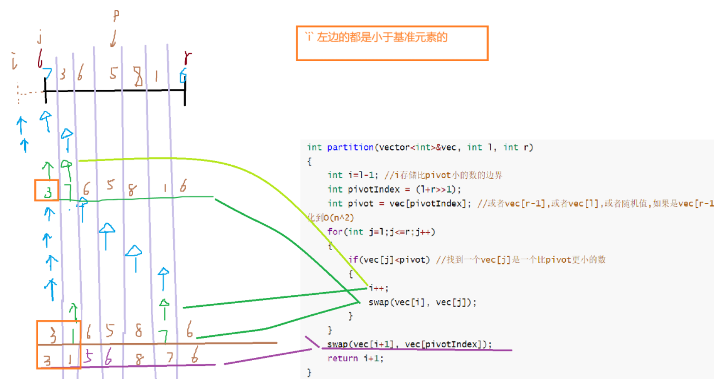
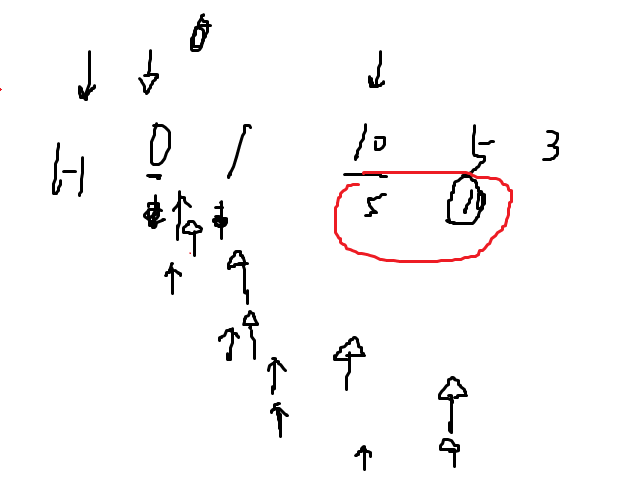

# 快排 排序算法补充

## 【2】快速排序的原理和时间复杂度

> 在排序算法对应的章节中，有对快排进行介绍。
>
> - （1）基本思路：找一个`pivot`，通常选中间或者随机元素（避免最坏情况），然后做`partition`操作，将小于基准的元素移到左侧，将大于基准的移到右侧，基准归为到最终位置，然后对左右子数组递归重复上述过程。
> - （2）快速排序的平均时间复杂度为$O(nlogn)$，最坏的时间复杂度是$O(n^2)$，是不稳定的排序；
>
> \PrepareForWorkNotes\Algos\算法笔记\排序算法专题.md


## 1.快速排序

> 它的时间复杂度也是` O(nlogn)`，但它在时间复杂度为 `O(nlogn) `级的几种排序算法中，大多数情况下效率更高，所以快速排序的应用非常广泛。再加上快速排序所采用的分治思想非常实用，使得快速排序深受面试官的青睐，所以掌握快速排序的思想尤为重要。

快速排序算法的基本思想是：

- 从数组中取出一个数，称之为基数（pivot）
- 遍历数组，将比基数大的数字放到它的右边，比基数小的数字放到它的左边。遍历完成后，数组被分成了左右两个区域
- 将左右两个区域视为两个数组，重复前两个步骤，直到排序完成


事实上，快速排序的每一次遍历，**都将基数摆到了最终位置上**。第一轮遍历排好 1 个基数，第二轮遍历排好 2 个基数（每个区域一个基数，但如果某个区域为空，则此轮只能排好一个基数），第三轮遍历排好 4 个基数（同理，最差的情况下，只能排好一个基数），以此类推。总遍历次数为 logn～n 次，每轮遍历的时间复杂度为 O(n)，所以很容易分析出快速排序的时间复杂度为 O(nlogn) ～ O($n^2$)，平均时间复杂度为 O(nlogn)。

用动图示意如下：


### （2）传统快排

与前面Acwing的板子相比，**其实唯一的不同在于一个`partition`函数，这里我们先给出最终的可解释性高可用于面试的快排代码：**

```c++
class Solution {
public:
int partition(vector<int>&vec, int l, int r)
{
    int i=l-1; //i存储比pivot小的数的边界
    int pivotIndex = ((l+r)>>1);
    int pivot = vec[pivotIndex]; //或者vec[r-1],或者vec[l],或者随机值,如果是vec[r-1]这种,给定测试用例是排好序的可能退化到O(n^2)
    swap(vec[r],vec[pivotIndex]);//要换到最右边，不然可能会被换掉
    for(int j=l;j<r;j++)
    {
        if(vec[j]<pivot) //找到一个vec[j]是一个比pivot更小的数
        {
            i++;
            swap(vec[i], vec[j]);
        }
    }
    swap(vec[i+1], vec[r]);
    return i+1;
}

void quickSortCommon(vector<int>& vec, int l, int r)
{
    if(l>=r) return;
    int index = partition(vec, l, r);
    quickSortCommon(vec, l, index-1);
    quickSortCommon(vec, index+1, r);
}

    vector<int> sortArray(vector<int>& nums) {
        quickSortCommon(nums,0,nums.size()-1);
        return nums;
    }
};
```

以下是关于`partition`函数的解释：

> - `i` 是一个指针，表示**小于基准元素的边界**。它初始设置为 `low - 1`，因为在开始时还没有找到任何小于基准的元素。
>
> 1. ```c++
>    int partition(vector<int>&vec, int l, int r)
>    {
>        int i=l-1; //i存储比pivot小的数的边界
>        int pivotIndex = ((l+r)>>1);
>        int pivot = vec[pivotIndex]; //或者vec[r-1],或者vec[l],或者随机值,如果是vec[r-1]这种,给定测试用例是排好序的可能退化到O(n^2)
>        swap(vec[r],vec[pivotIndex]);//要换到最右边，不然可能会被换掉
>        for(int j=l;j<r;j++)
>        {
>            if(vec[j]<pivot) //找到一个vec[j]是一个比pivot更小的数
>            {
>                i++;
>                swap(vec[i], vec[j]);
>            }
>        }
>        swap(vec[i+1], vec[r]);
>        return i+1;
>    }
>    ```
>
>    - 使用一个循环，从 `low` 到 `high - 1` 遍历数组中的元素。
>    - 对于每个元素`arr[j]`，检查它是否小于基准`pivot`：
>      - 如果是，将 `i` 增加 1，并将 `arr[i]` 和 `arr[j]` 的值进行交换。这会把当前元素移到小于基准的区间。
>    - 这样，每次发现一个小于基准的元素，就扩大了小于基准的区域，通过交换将其移动到前面。
>
> 2. **放置基准元素**：
>
>    ```c
>    swap(arr[i + 1], arr[pivotIndex]);
>    ```
>
>    - 循环结束后，`i` 指向最后一个小于基准元素的位置。因此，我们需要将基准元素 `arr[pivotIndex]` 放到 `i + 1` 的位置上，这样就确保了基准元素的左侧都是小于它的元素，右侧都是大于或等于它的元素。
>
> 3. **返回基准位置**：
>
>    ```c++
>    return i + 1; // 返回基准的位置
>    ```
>
>    - 最后，函数返回基准元素的最终位置 `i + 1`。这个位置是在经过分区后，基准元素应该放置的位置。


以下这个是错误的代码对应的，先不用管，。。】



**上述这个一般模式下的快排需要我们记住，这种思想也是值得学习的。**

我们来详细分析你提供的快速排序代码，并通过一个具体的例子（序列 `7 3 6 5 8 1 6`）来理解它的执行过程。最后，我会指出代码的正确性以及可能的改进点。

---

### 代码分析（可能是基于错的代码 可以不管）

#### 1. `partition` 函数
```cpp
int partition(vector<int>& vec, int l, int r) {
    int i = l - 1; // i 存储比 pivot 小的数的边界
    int pivotIndex = (l + r) >> 1; // 选择中间元素作为 pivot
    int pivot = vec[pivotIndex]; // pivot 的值

    for (int j = l; j <= r; j++) {
        if (vec[j] < pivot) { // 找到一个比 pivot 小的数
            i++;
            swap(vec[i], vec[j]); // 将小的数交换到左边
        }
    }
    swap(vec[i + 1], vec[pivotIndex]); // 将 pivot 放到正确的位置
    return i + 1; // 返回 pivot 的最终位置
}
```

- **功能**：将数组分为两部分，左边部分的所有元素小于 `pivot`，右边部分的所有元素大于或等于 `pivot`。
- **关键点**：
  - `i` 是比 `pivot` 小的元素的边界。
  - `pivot` 选择的是中间元素（`(l + r) >> 1`）。
  - 最后将 `pivot` 放到正确的位置（`i + 1`）。

#### 2. `quickSortCommon` 函数
```cpp
void quickSortCommon(vector<int>& vec, int l, int r) {
    if (l >= r) return; // 递归终止条件
    int index = partition(vec, l, r); // 分区
    quickSortCommon(vec, l, index - 1); // 递归排序左半部分
    quickSortCommon(vec, index + 1, r); // 递归排序右半部分
}
```

- **功能**：递归地对数组进行快速排序。
- **关键点**：
  - 递归终止条件是 `l >= r`。
  - 每次递归调用都会对 `pivot` 的左右两部分进行排序。

---

### 示例分析

假设初始序列为 `7 3 6 5 8 1 6`，索引从 `0` 到 `6`。

#### 第一次调用 `quickSortCommon(vec, 0, 6)`

1. **选择 `pivot`**：
   - `pivotIndex = (0 + 6) >> 1 = 3`，`pivot = vec[3] = 5`。

2. **分区过程**：
   - 初始化：`i = -1`，`j` 从 `0` 到 `6`。
   - 遍历数组：
     - `j = 0`，`vec[0] = 7`，`7 >= 5`，不交换。
     - `j = 1`，`vec[1] = 3`，`3 < 5`，交换 `vec[0]` 和 `vec[1]`，数组变为 `3 7 6 5 8 1 6`，`i = 0`。
     - `j = 2`，`vec[2] = 6`，`6 >= 5`，不交换。
     - `j = 3`，`vec[3] = 5`，`5 >= 5`，不交换。
     - `j = 4`，`vec[4] = 8`，`8 >= 5`，不交换。
     - `j = 5`，`vec[5] = 1`，`1 < 5`，交换 `vec[1]` 和 `vec[5]`，数组变为 `3 1 6 5 8 7 6`，`i = 1`。
     - `j = 6`，`vec[6] = 6`，`6 >= 5`，不交换。
   - 最后将 `pivot` 放到正确的位置：交换 `vec[i + 1]` 和 `vec[pivotIndex]`，即交换 `vec[2]` 和 `vec[3]`，数组变为 `3 1 5 6 8 7 6`。
   - 返回 `pivot` 的位置 `index = 2`。

3. **递归调用**：
   - 左半部分：`quickSortCommon(vec, 0, 1)`。
   - 右半部分：`quickSortCommon(vec, 3, 6)`。

---

#### 递归调用 `quickSortCommon(vec, 0, 1)`

1. **选择 `pivot`**：
   - `pivotIndex = (0 + 1) >> 1 = 0`，`pivot = vec[0] = 3`。

2. **分区过程**：
   - 初始化：`i = -1`，`j` 从 `0` 到 `1`。
   - 遍历数组：
     - `j = 0`，`vec[0] = 3`，`3 >= 3`，不交换。
     - `j = 1`，`vec[1] = 1`，`1 < 3`，交换 `vec[0]` 和 `vec[1]`，数组变为 `1 3 5 6 8 7 6`，`i = 0`。
   - 最后将 `pivot` 放到正确的位置：交换 `vec[i + 1]` 和 `vec[pivotIndex]`，即交换 `vec[1]` 和 `vec[0]`，数组不变。
   - 返回 `pivot` 的位置 `index = 0`。

3. **递归调用**：
   - 左半部分：`quickSortCommon(vec, 0, -1)`（终止）。
   - 右半部分：`quickSortCommon(vec, 1, 1)`（终止）。

---

#### 递归调用 `quickSortCommon(vec, 3, 6)`

1. **选择 `pivot`**：
   - `pivotIndex = (3 + 6) >> 1 = 4`，`pivot = vec[4] = 8`。

2. **分区过程**：
   - 初始化：`i = 2`，`j` 从 `3` 到 `6`。
   - 遍历数组：
     - `j = 3`，`vec[3] = 6`，`6 < 8`，交换 `vec[3]` 和 `vec[3]`，数组不变，`i = 3`。
     - `j = 4`，`vec[4] = 8`，`8 >= 8`，不交换。
     - `j = 5`，`vec[5] = 7`，`7 < 8`，交换 `vec[4]` 和 `vec[5]`，数组变为 `1 3 5 6 7 8 6`，`i = 4`。
     - `j = 6`，`vec[6] = 6`，`6 < 8`，交换 `vec[5]` 和 `vec[6]`，数组变为 `1 3 5 6 7 6 8`，`i = 5`。
   - 最后将 `pivot` 放到正确的位置：交换 `vec[i + 1]` 和 `vec[pivotIndex]`，即交换 `vec[6]` 和 `vec[4]`，数组变为 `1 3 5 6 7 6 8`。
   - 返回 `pivot` 的位置 `index = 6`。

3. **递归调用**：
   - 左半部分：`quickSortCommon(vec, 3, 5)`。
   - 右半部分：`quickSortCommon(vec, 7, 6)`（终止）。

---

#### 递归调用 `quickSortCommon(vec, 3, 5)`

1. **选择 `pivot`**：
   - `pivotIndex = (3 + 5) >> 1 = 4`，`pivot = vec[4] = 7`。

2. **分区过程**：
   - 初始化：`i = 2`，`j` 从 `3` 到 `5`。
   - 遍历数组：
     - `j = 3`，`vec[3] = 6`，`6 < 7`，交换 `vec[3]` 和 `vec[3]`，数组不变，`i = 3`。
     - `j = 4`，`vec[4] = 7`，`7 >= 7`，不交换。
     - `j = 5`，`vec[5] = 6`，`6 < 7`，交换 `vec[4]` 和 `vec[5]`，数组变为 `1 3 5 6 6 7 8`，`i = 4`。
   - 最后将 `pivot` 放到正确的位置：交换 `vec[i + 1]` 和 `vec[pivotIndex]`，即交换 `vec[5]` 和 `vec[4]`，数组不变。
   - 返回 `pivot` 的位置 `index = 5`。

3. **递归调用**：
   - 左半部分：`quickSortCommon(vec, 3, 4)`。
   - 右半部分：`quickSortCommon(vec, 6, 5)`（终止）。

---

#### 递归调用 `quickSortCommon(vec, 3, 4)`

1. **选择 `pivot`**：
   - `pivotIndex = (3 + 4) >> 1 = 3`，`pivot = vec[3] = 6`。

2. **分区过程**：
   - 初始化：`i = 2`，`j` 从 `3` 到 `4`。
   - 遍历数组：
     - `j = 3`，`vec[3] = 6`，`6 >= 6`，不交换。
     - `j = 4`，`vec[4] = 6`，`6 >= 6`，不交换。
   - 最后将 `pivot` 放到正确的位置：交换 `vec[i + 1]` 和 `vec[pivotIndex]`，即交换 `vec[3]` 和 `vec[3]`，数组不变。
   - 返回 `pivot` 的位置 `index = 3`。

3. **递归调用**：
   - 左半部分：`quickSortCommon(vec, 3, 2)`（终止）。
   - 右半部分：`quickSortCommon(vec, 4, 4)`（终止）。

---

### 最终排序结果

经过上述过程，数组最终变为 `1 3 5 6 6 7 8`，排序完成。

---

### 代码正确性

1. **正确性**：
   - 代码逻辑是正确的，能够正确实现快速排序。
   - 通过选择中间元素作为 `pivot`，避免了最坏情况（如已排序数组）下的 `O(n^2)` 时间复杂度。

2. **改进点**：
   - 如果数组中有大量重复元素，可能会导致分区不均匀。可以通过三路快排（将数组分为小于、等于、大于 `pivot` 的三部分）来优化。
   - 可以选择随机 `pivot` 来进一步避免最坏情况。

---

### 改进后的代码（随机 `pivot`）

```cpp
int partition(vector<int>& vec, int l, int r) {
    int i = l - 1;
    int pivotIndex = l + rand() % (r - l + 1); // 随机选择 pivot
    int pivot = vec[pivotIndex];
    swap(vec[pivotIndex], vec[r]); // 将 pivot 放到最后
    for (int j = l; j < r; j++) {
        if (vec[j] < pivot) {
            i++;
            swap(vec[i], vec[j]);
        }
    }
    swap(vec[i + 1], vec[r]); // 将 pivot 放到正确的位置
    return i + 1;
}
```

---

### 总结

- 你的代码是正确的，能够实现快速排序。
- 通过选择中间元素作为 `pivot`，避免了最坏情况。
- 可以通过随机选择 `pivot` 或三路快排进一步优化。


错的原因：

