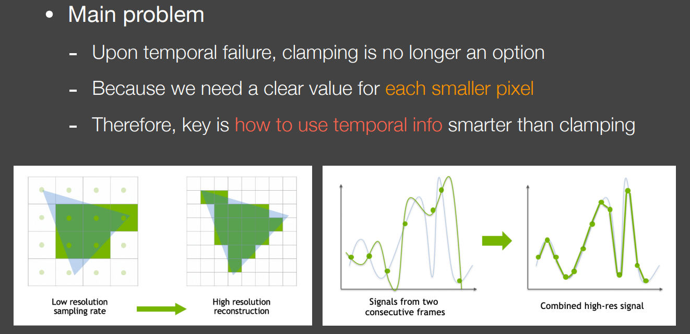

超分辨率 DLSS等

games202

DLSS给低分辨率 ，变成高分辨率的图

DLSS2.0思想

## 3.Temporal Super Resolution

- Super resolution (or super sampling) 低分辨率变成高分辨率
  - 字面理解：为了增加图像的分辨率；

DLSS就是这么一种技术，将一张低分辨率的图输入最后得到一张高分辨率的输出：

- **Source 1 (DLSS 1.0):out of nowhere / completely guessed**
  - DLSS1.0的思路是通过数据驱动的方法来做的，效果并不是很好。因为其只在当前帧中进行，不依靠temporal的累积，等于没有任何的额外信息来源。将低分辨率硬拉成高分辨率，如果不想让最后的结果模糊，必须需要一些额外的信息，DLSS1.0是通过猜测来提供额外信息的，也就是针对于每个游戏或者场景单独训练出一个神经网络，其会去学习一些常见的物体边缘从而在低分辨率拉成高分辨率之后将模糊的边缘换成不模糊的边缘，这就是DLSS1.0的思路。

- **Source 2 (DLSS 2.0):from temporal information**
  - DLSS2.0则摒弃了通过神经网络猜测的结果，而是更希望去利用temporal的信息，核心思想不在DL上了而在temporal上。DLSS2.0的核心思路在于**TAA**，更多的去结合上一帧的信息运用到当前帧中，仍然是temporal reuse。对于静止场景中的TAA而言，连续四帧我们使用不同的感知sample点，当前帧使用上一帧的信息就等于是变相的提升了分辨率，这样想是对的，但是DLSS2.0中要面临一些问题。	
    - （1）如果有temporal failure时，我们不可以再使用clamping的方法来解决，也就是对temporal的信息利用要求更加严格。
    - （2）因为我们最终要的是一个增大了分辨率的图，如下图，分辨率提高也就是像素点增多，那么我们需要知道新增加的小的pixel的像素值是多少，如果此时只是用上一帧的结果盲目的clamping，势必会使得一些小的像素的值是根据周围的点的颜色猜测出来的，而且猜测的值很像周围的点，此时就会得到一个高分辨率的图但是很糊。总结来说由于DLSS真正的提升了分辨率，因此我们要求新产生的像素的值是要与之前有本质的不同的，否则就会得到一个糊掉的结果。

因此我们需要一个比clamping更好的复用temporal信息的方案，基本思路如上图右侧所示，左边中的蓝色代表上一帧，绿色代表当前帧，绿点是当前帧给了一个采样信号得到的值，在上一帧也就是蓝色曲线中我们可以从另一个信号采样出来值，最后我们要把二者综合在一起得出一个当前帧**增加了采样点后的值。**DLSS2.0中的神经网络没有输出任何混合后的颜色，而是**输出了如何将上一帧找到的信息和当前帧结合在一起。**

> 关于DLSS 2.0的其他细节，可以后面再整理进来。

关于DLSS 2.0的一些总结：

- An importance practical issue
  - 如果DLSS每一帧需要消耗30ms，那DLSS就太慢了，因此训练出这个网络之后要去提升inference性能，针对NVidia的硬件进行优化。但具体如何做的并不清楚。
- 其他公司的”DLSS“算法：
  - By AMD：FidelityFX Super Resolution
  - By Facebook：Neural Supersampling for Real-time Rendering [Xiao et al.]

