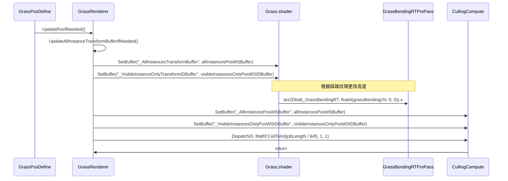
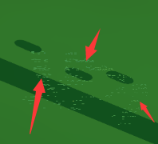
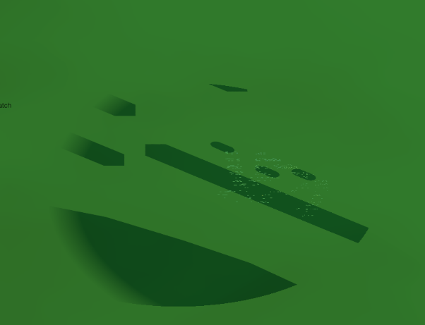
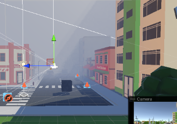
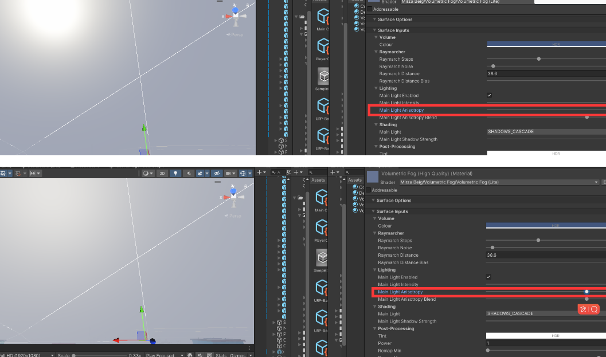
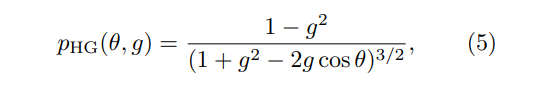

# 高墙之屿 项目复习

## 渲染


### 草地渲染

**InstancedIndirectGrassRenderer.cs**：这个文件是一个Unity的脚本文件，它负责管理草地的渲染过程。这个文件中定义了一些重要的类和方法，如InstancedIndirectGrassRenderer类，以及OnEnable、LateUpdate、OnGUI、OnDisable等方法。

**InstancedIndirectGrass.shader**：这是一个用于渲染草地的着色器。它使用了**GPU Instancing**技术来批量渲染大量的草地，从而提高性能。这个着色器还包含了风的模拟，使得草地能够随风摇摆。

**InstancedIndirectGrassPosDefine.cs **这个类主要用于定义草地实例的位置。

**GrassBendingRTPrePass.cs**：这个类是一个自定义的渲染特性，它在渲染草地之前创建一个渲染纹理，用于存储草地的**弯曲信息**。这个信息是通过一个自定义的渲染通道（CustomRenderPass）生成的，该通道在每一帧中都会被执行。  

**CullingCompute.compute**：这是一个compute shader，它用于执行**视锥体裁剪**。这个过程是为了优化性能，只渲染在摄像机视野内的草地。  



先单元格cell ，再在cell中生成草地

3个点

```
//direct diffuse 半兰伯特，模拟草的SSS(次表面散射)
                half directDiffuse = dot(N, light.direction) * 0.5 + 0.5; //half lambert, to fake grass SSS

```

#### 草地交互

##### GrassBendingRTPrePass.cs

bendpass

创建一个新的视图矩阵，这个视图矩阵与一个想象中的摄像机相同，这个摄像机位于草地中心的上方1个单位处，并且朝向草地（鸟瞰视图）


 其中，这些就是轨迹


##### GrassBendingRTPrePassTrailShader.shader 草交互拖尾shader

D:\myUnityProj\buDaiXi\proj\githubWork\fromGitO\Assets\Artist\Effects\YVFXEff\URPMobileGrassInstancedIndirectDemo\InstancedIndirectGrass\Core\GrassBending\GrassBendingRTPrePassTrailShader.shader

挂载在trail上

想要有压草效果的物体必须携带trail，其上material为GrassBendingRTPrePassPS


### 体积雾

具体看大电脑笔记

https://assetstore.unity.com/packages/vfx/shaders/fullscreen-camera-effects/volumetric-fog-urp-277702

**具体实现：**

1、通过深度值，从投影空间逆向得到屏幕上像素的世界坐标。

2、有了像素的世界坐标 和 相机的世界坐标，就可以得到观察方向

3、根据太阳光方向 和 观察方向，可以得到两者夹角(点乘)，用于散射公式的计算

4、将太阳光方向转换到投影空间，我们忽略掉 z轴，那么实际上就是没有做窗口变换的屏幕空间，在屏幕空间 从 像素出发 沿太阳光方向(实际上是太阳光方向的负方向)向太阳进发，沿路径做模糊处理。


```GLSL
#ifdef _MAIN_LIGHT_ENABLED 
#if defined(_MAIN_LIGHT_SHADOWS_ENABLED)
        // 计算主光源阴影 把模型的世界空间顶点坐标输入，得到阴影坐标，用于在shadowmap下进行比较。 
        float4 shadowCoord = TransformWorldToShadowCoord(position);
        // 计算带阴影衰减的主光源。https://www.bilibili.com/read/cv6436088/ 
        mainLightShadow = MainLightRealtimeShadow(shadowCoord);
        //mainLightShadow = MainLightShadow(shadowCoord, position, half4(1.0, 1.0, 1.0, 1.0), _MainLightOcclusionProbes);
        
        mainLightShadow = lerp(1.0, mainLightShadow, mainLightShadowStrength);
```

mainLightShadowStrength为1才有这个god ray 不然是没有的



在往太阳光线步进的时候也可以计算这个是不是阴影


Henyey Greenstein相位函数-HG相位函数

https://www.bilibili.com/opus/488668725971994976

```
 // Scattering.
        // 计算主光源散射
        mainLightScattering = CalculateMainLightScattering(cosTheta, cosThetaSquared, g2, gSquared);
        mainLightScattering = lerp(1.0, mainLightScattering, mainLightAnisotropyBlend);
```




```C#
/// \brief //HenyeyGreenstein 函数用于计算 Henyey-Greenstein 相函数值，该函数在常用于模拟参与介质（如雾或烟雾）中的光散射。
/// \param cosTheta 光方向和视线方向之间角度的余弦值
/// \param g2 向异性因子的两倍
/// \param gPow2 各向异性因子的平方
/// \return 
float HenyeyGreenstein(float cosTheta, float g2, float gPow2)
{
    float denominator = (1.0 + gPow2) - (g2 * cosTheta);
    return (1.0 - gPow2) / (4.0 * PI * pow(denominator, 1.5));
}

float CalculateMainLightScattering(float cosTheta, float costThetaPow2, float g2, float gPow2)
{
    return HenyeyGreenstein(cosTheta, g2, gPow2);
}
```

Mie散射相函数的计算过程比较复杂, 为了计 算方便, 常用表达形式简单、数值计算方便的H-G 相函数来替代



其中 θ 是散射角,

 g 是不对称因子.

 H-G相函数可以较好地模拟前向散射峰, 但是不能正确模拟后向散射, 且当g → 0时, 该相函数不能还原成瑞利散射相函数

https://zhuanlan.zhihu.com/p/21425792


### 沙地渲染


### 冰面渲染（宠物冰柱子攻击）

VFX 冰柱子攻击 https://zhuanlan.zhihu.com/p/670601962

### 植物生长

藤曼生长 shadergraph clip+顶点偏移 https://zhuanlan.zhihu.com/p/655190641

### SSPR

https://zhuanlan.zhihu.com/p/651134124

### 卡通渲染

描边 2PASS 顶点色 眼睛周围

面部阴影 sdf

rim color 

金属 matcap

Ramp贴图

AO

项目中的效果实现类似https://zhuanlan.zhihu.com/p/670601962

### 项目实现的各种shader

倒转乾坤

传送门

激光

消融 噪声贴图 clip


假室内 视差映射 https://zhuanlan.zhihu.com/p/376762518

