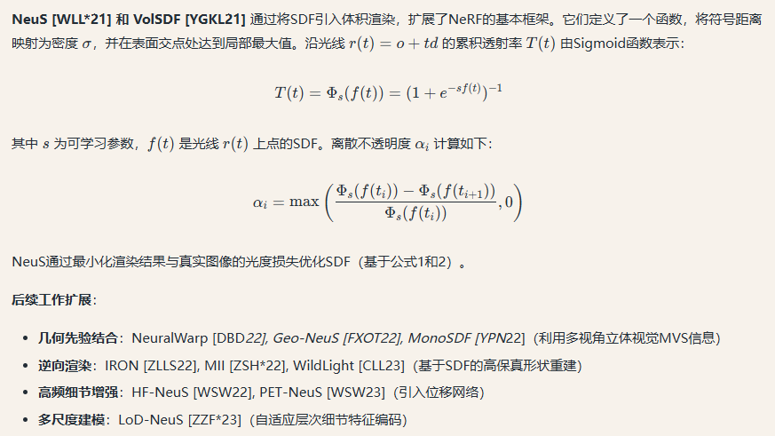

# 3D Generation ：Survey

## 1.Introduction部分

Recently, the success of neural representations, particularly Neural Radiance  Fields (NeRFs) [MST∗20,BMT∗21,MESK22,KKLD23], and generative models such as diffusion models [HJA20,RBL∗22a], has led to remarkable advancements in 3D content generation.

==可用于生成任务的常见模型：GAN, VAE, autoregressive  models，diffusion系列==。生成的除了图片以外，还包括video等。

随着3D内容的重要性日益凸显，该领域的研究工作呈现爆发式增长。然而，从2D到3D内容生成的过渡并非现有2D方法的简单扩展，而是需要应对独特挑战，并重新审视数据表示、问题建模及生成模型设计，以有效处理三维空间的复杂性。例如，

- 如何将三维场景表示整合到二维生成模型中以处理更高维度需求仍不明确。
- 与可以轻松从网络获取的图像或视频不同，3D资产相对稀缺。
- 此外，生成模型的质量评估面临额外挑战，特别是在考虑3D空间中的多视角一致性时，需要设计更优化的目标函数。

这些复杂性要求采用创新方法和新颖解决方案，以弥合2D与3D内容生成之间的鸿沟。

​														（图1）

尽管3D内容生成尚未达到2D生成技术的普及程度，但该领域已取得持续进展。如图1所示，从早期3D-GAN[WZX∗16]到近期Instant3D[LTZ∗23]等代表性方法，生成质量与多样性均实现显著提升。因此，本综述旨在系统梳理3D内容生成技术的快速发展与多维演进。我们将从三维表示方法、生成算法、数据集和应用场景等维度构建结构化框架，梳理该领域最新进展，并指明开放挑战。

​															（图2）

图2展示了本综述的总体架构。

- 首先在第2节界定研究范围并讨论相关工作。随后各章节深入分析3D内容生成的核心方法论：
- 第3节重点解析三维场景表示及其渲染机制；
- 第4节系统分类生成方法，基于算法原理将其划分为前馈生成、优化式生成、程序化生成和生成式新视角合成四大类（Sec. 4 explores a wide variety of 3D generation methods, which can be divided into four categories based on their algorithmic methodologies: **feedforward generation, optimization-based generation, procedural generation, and generative novel view synthesis.**），并通过技术演化树展示发展脉络。鉴于数据积累对深度学习模型的关键作用，我们专门梳理相关训练数据集。
- 最后讨论3D人体/面部生成等应用场景，总结开放挑战并展望未来。我们期望本综述能为相关研究者提供系统性参考，启发后续创新工作。

### （1）Scope of this survey

在本综述中，我们聚焦于三维模型生成技术及其相关数据集与应用场景。具体而言，首先简要介绍场景表示方法的核心概念。随后重点探讨如何将三维表征与生成模型有机结合，系统梳理生成方法的主要技术路线。我们同时深入分析支撑技术发展的数据集资源，以及三维人体生成、面部生成与编辑等前沿应用场景。本文致力于系统化总结与分类三维生成方法，并梳理相关数据与应用生态。所综述论文主要选自计算机视觉与图形学领域顶级会议/期刊，以及2023年arXiv平台发布的部分预印本。尽管难以穷尽所有三维生成相关方法，我们尽可能涵盖该领域主要技术分支。对各分支不展开详细技术解析，而是通过典型工作阐述其范式，具体技术细节可参考引文中的相关工作部分。

**相关工作界定** 神经场景表示与渲染技术与三维生成密切相关，但本报告不将其纳入讨论范围。关于神经渲染的综述推荐阅读[TFT∗20, TTM∗22]，其他神经表征技术可参考[KBM∗20, XTS∗22]。本综述核心关注点在于探索三维模型生成技术，因此不涵盖二维图像生成领域研究，相关技术细节可参阅：变分自编码器（VAEs）[Doe16]、生成对抗网络（GANs）[GSW∗21]、扩散模型（Diffusion）[PYG∗23, CHIS23]以及Transformer模型[KNH∗22]。现有三维生成相关综述多聚焦特定方向，如3D感知图像合成[XX23]、三维生成模型[SPX∗22]、文本到三维生成[LZW∗23]及点云深度学习[GWH∗20]。相较而言，本文将对不同三维生成方法进行全面解析。

> Our primary focus is on exploring techniques that generate 3D models.==其实就是本文聚焦于三维模型本身生成的技术，类似于NeRF的表达应该不是本文的讨论重点。==Therefore, this review does not encompass research on generation methods for 2D images within the realm of visual computing.额外可以扩展阅读的：VAEs，GANs，Diffusion，Transformers。
>
> There are also some surveys related to 3D generation that have their own focuses such as 3D-aware image synthesis [XX23],  3D generative models [SPX∗22], Text-to-3D [LZW∗23] and deep  learning for 3D point clouds [GWH∗20]. In this survey, we give a comprehensive analysis of different 3D generation methods.

## 3.Neural Scene Representations

对于AI 的3D内容生成，对于3D模型的合适表达方法是十分重要的。The generation process typically involves a scene representation and a differentiable rendering algorithm for creating 3D models and rendering 2D images.Conversely（反过来）, the created 3D models or 2D images could be supervised in the reconstruction domain or image domain, as illustrated in Fig. 3.

==有的方法直接监督场景中3D Mesh的生成，有的则将场景渲染到2D 图像上，然后再监督渲染结果的生成情况。==In the following, we broadly classify the scene representations into three groups: 

- explicit scene representations (Section 3.1), 
- implicit representations (Section 3.2), and 
- hybrid representations (Section 3.3).

 Note that, the rendering methods (e.g. ray casting, volume rendering, rasterization, etc), **which should be differentiable to optimize the scene representations from various inputs, are also introduced.**

### （1）Explicit representation

==个人补充：其实我们还是应该聚焦于Mesh的生成，因为对于游戏来说这还是非常重要的。==

By depicting scenes as an assembly of basic primitives, including point-like primitives, triangle-based meshes, and advanced parametric surfaces, these representations can create detailed and accurate visualizations of various environments and objects.

#### （a）点云

A point cloud is a collection of elements in Euclidean space, representing discrete points with addition attributes (e.g. colors and normals) in three-dimensional space.==In addition to simple points, which can be considered infinitesimally（无穷小地） small surface patches, oriented point clouds with a radius (surfels) can also be used [PZVBG00].==

**Surfels are used in computer graphics for rendering point clouds (called splitting), which are differentiable [YSW∗19, KKLD23] and allow researchers to define differentiable rendering pipelines to adjust point cloud positions and features, such as radius or color.**

> 对（a）部分以上内容的翻译与补充：
>
> 诸如基于神经点的渲染（Neural Point-based Rendering）[ASK∗20, DZL∗20]、SynSin [WGSJ20]、Pulsar [LZ21, KPLD21] 和 ADOP [RFS22] 等技术，利用可学习的特征存储物体表面外观和形状信息，从而生成更精确且细节丰富的渲染结果。其他方法如 FVS [RK20]、SVS [RK21] 和 FWD-Transformer [CRJ22] 也通过可学习特征提升渲染质量。这些方法通常将特征嵌入点云，并通过变形（warp）到目标视角解码颜色值，以实现场景的精准重建。
>
> ==个人理解就是让点云中存储可以学习的特征和外观等信息，在可微渲染中可以用梯度下降进行优化，有点Gaussian Splatting那个意思。==
>
> **对每项工作的简要概括：**
>
> 1. **Neural Point-based Rendering [ASK∗20, DZL∗20]**
>    - **已知内容**：该方法基于点云的神经渲染技术，通过将可学习特征与点云结合，直接生成多视角一致的图像。例如，Aliev 等人 [ASK∗20] 提出动态点云渲染框架，支持实时高保真渲染；Deng 等人 [DZL∗20] 则探索稀疏点云的隐式表示。
>    - **局限性**：具体技术细节需参考原文。
> 2. **SynSin [WGSJ20]**
>    - **已知内容**：由牛津大学团队提出，专注于从单张图像生成新视角的合成（novel view synthesis）。通过端到端训练，结合几何推理与纹理生成，解决单目图像的3D重建模糊性问题。
>    - **特点**：强调单目输入下的多视角一致性。
> 3. **Pulsar [LZ21, KPLD21]**
>    - **已知内容**：一种可微分的点云渲染器，支持高效梯度传播，用于优化3D形状与外观。例如，Lassner 等人 [LZ21] 提出基于球谐函数的点云渲染；Kania 等人 [KPLD21] 将其扩展为实时动态场景渲染。
>    - **应用**：常用于3D重建与生成模型的联合优化。
> 4. **ADOP [RFS22]**
>    - **已知内容**：一种结合可微分渲染与对抗训练的方法，通过单像素梯度优化实现高质量3D生成。作者 Rombach 等人 [RFS22] 提出对抗性单像素损失函数，提升细节生成能力。
>    - **创新点**：对抗训练与物理可导渲染的结合。
> 5. **FVS [RK20] 与 SVS [RK21]**
>    - **已知内容**：Rückert 等人的系列工作，专注于动态场景的可学习特征渲染。FVS（Forward Warping-based Synthesis）通过前向变形解决多视角投影问题；SVS（Structured View Synthesis）引入结构化特征提升遮挡区域推理。
>    - **贡献**：强调动态场景下特征变形与遮挡处理。
> 6. **FWD-Transformer [CRJ22]**
>    - **已知内容**：一种基于 Transformer 的点云变形框架，用于跨视角特征对齐。Chen 等人 [CRJ22] 提出前向变形注意力机制，解决点云稀疏性导致的渲染空洞问题。
>    - **优势**：Transformer 的长距离依赖建模能力。

通过将基于点云的可微分渲染器（differentiable renderers）整合到3D生成流程中，研究人员能够在保留点云优势的同时，兼容基于梯度的优化技术。这一过程通常可分为两类方法：**点分裂（point splitting）**——将离散的采样点与局部确定性模糊核（blurring kernels）结合[ZPVBG02, LKL18, ID18, RROG18]，以及**传统点渲染器（conventional point renderer）**[ASK∗20, DZL∗20, KPLD21, RALB22]。这些方法在保持可微分性的前提下，支持3D点云模型的生成与编辑，这对训练和优化3D生成任务中的神经网络至关重要。

> #### 1. **点分裂（Point Splitting）**
>
> - **核心思想**：通过将单个点分解为多个子点（splitting），并利用**局部模糊核**（如高斯核、径向基函数等）对离散点进行平滑插值，从而在渲染时模拟连续表面。这种方法旨在缓解点云稀疏性导致的渲染空洞或锯齿问题。
> - 技术实现：
>   - 离散的点云样本会被“模糊化”，每个点的影响范围通过核函数扩展到周围区域，使相邻点的颜色或几何信息能够平滑过渡。
>   - 例如，[ZPVBG02]可能是早期基于点云表面重建的模糊核方法，通过插值生成连续表面；[LKL18]可能提出动态点分裂策略以适应不同分辨率需求。
> - **优势**：适合处理稀疏点云，生成视觉上连续的表面，同时保持计算效率。
>
> #### 2. **传统点渲染器（Conventional Point Renderer）**
>
> - **核心思想**：直接基于原始点云进行可微分渲染，无需显式表面重建。通过定义每个点对最终像素颜色的贡献函数（如基于距离的权重插值），实现从点云到图像的映射，并支持梯度反向传播。
> - 技术实现：
>   - 例如，[ASK∗20]（Neural Point-based Rendering）将点云与可学习特征结合，通过可微投影生成多视角图像；[KPLD21]（Pulsar）提出基于球谐函数的点属性编码，实现高效可微渲染。
>   - 这些方法通常利用点云的位置、法线、颜色等属性，结合神经网络解码器直接生成像素值。
> - **优势**：保留点云的几何灵活性，适用于动态场景或非刚性物体的生成与优化。
>
> ------
>
> ### **关键区别**
>
> - **点分裂**侧重于通过模糊核“填补”点云之间的空隙，生成伪连续表面，适用于需要平滑输出的任务（如表面重建）。
> - **传统点渲染器**则直接操作原始点云，通过可微函数映射到图像空间，更适合需要几何精确性和动态属性的任务（如生成对抗网络中的3D形状优化）。

#### （b）Meshes

通过将多个顶点（vertices）与边（edges）连接，可构建更复杂的几何结构（如线框和网格）[BKP∗10]。这些结构可通过多边形（通常为三角形或四边形）进一步细化，以生成物体的逼真表示[SS87]。网格（meshes）提供了一种灵活高效的方式来表示复杂形状，因其易于被计算机算法操作与渲染。大多数图形编辑工具链采用三角形网格，此类表示因其广泛兼容性成为数字内容创作（DCC）流程中不可或缺的部分。为实现与现有流程无缝对接，研究者提出通过神经网络预测离散顶点位置[BNT21, TZN19]，从而可直接将结果导入DCC工具。此外，不同于离散纹理预测，基于神经网络的连续纹理优化方法（如纹理场[OMN∗19]和NeRF-Tex[BGP∗22]）被提出，以生成更精细的纹理，提升2D模型的真实感。

将网格表示整合到3D生成中需依赖基于网格的可微分渲染方法，此类方法支持以兼容梯度优化的方式光栅化网格。代表性技术包括OpenDR [LB14]、神经网格渲染器[KUH18]、Paparazzi [LTJ18]和Soft Rasterizer [LLCL19]。此外，通用物理渲染器如Mitsuba 2 [NDVZJ19]和Taichi [HLA∗19]也通过自动微分支持网格可微渲染。

> ### **对熟悉工作的简要概括**
>
> 1. **OpenDR [LB14]**
>    - 首个基于传统图形管线的可微分渲染框架，通过近似梯度实现网格参数（如顶点位置、材质）的优化，支持与深度学习框架结合。
>    - **局限性**：梯度计算依赖于近似方法，可能不够精确。
> 2. **神经网格渲染器（Neural Mesh Renderer）[KUH18]**
>    - 由Hiroharu Kato等人提出，通过可微分的渲染层将网格顶点位置与图像像素关联，支持端到端训练生成3D网格模型。
>    - **应用**：常用于单视图3D重建任务，如从单张图像预测网格。
> 3. **Soft Rasterizer [LLCL19]**
>    - 提出“软光栅化”方法，通过概率分配像素到三角形，避免传统硬光栅化的不可导问题，实现更平滑的梯度传播。
>    - **优势**：在形状生成与纹理优化中表现稳定。
> 4. **Mitsuba 2 [NDVZJ19]**
>    - 基于物理的可微分渲染器，支持自动微分计算光线传播的梯度，用于优化材质、几何与光照参数。
>    - **特点**：兼顾物理真实性与可微性，适用于逆渲染任务。
> 5. **Taichi [HLA∗19]**
>    - 高性能并行计算框架，提供可微分物理模拟与渲染功能，支持基于网格的实时梯度计算。
>    - **应用**：常用于动态场景的物理仿真与生成。
>
> ------
>
> ### **其他工作说明**
>
> - **纹理场（Texture Fields）[OMN∗19]**：将纹理表示为连续神经网络场，支持任意分辨率纹理生成，避免离散贴图的局限性。
> - **NeRF-Tex [BGP∗22]**：结合NeRF的体积渲染与纹理映射，通过隐式场生成高细节表面纹理。
> - **SS87**：经典论文提出参数化曲面变形技术（如自由变形FFD），为网格编辑奠定基础。
> - **Paparrazi [LTJ18]**：基于实时路径追踪的可微渲染器，支持复杂材质优化，具体细节需参考原文。

#### （c）Multi-layer Representations

在实时新视角合成领域，使用多层半透明颜色图层来表征场景已成为流行且成功的方案[ZTF∗18]。分层深度图像（Layered Depth Image, LDI）表示法[SGHS98]是该领域的典型代表，它通过包含多个带有对应颜色值的深度图层来扩展传统深度图。多种方法[PZ17, CGT∗19, SSKH20]受到LDI表示的启发，结合深度学习技术开发了能够预测LDI的网络架构。除LDI外，立体放大技术[ZTF∗18]首创了多层平面扫描（MPI）表示法，该方法通过平面扫描体在固定深度范围内使用多个前平行半透明层（包含颜色和透明度）描述场景。借助体素渲染和单应性投影（homography projection），可以实现实时的新视角合成。基于该技术，后续方法[FBD∗19, MSOC∗19, STB∗19]采用MPI表示提升了渲染质量。通过将平面替换为球面，[BFO∗20, ALG∗20, LXM∗20]等方法进一步扩展了多层表示法对广视角场景的支持。随着该领域研究的持续发展，我们期待这些方法将推动更高效、更优质的三维生成技术应用于实时渲染。

技术概括（基于了解的内容）：

1. LDI和MPI表示法的核心创新在于通过多层深度/透明度的混合表征提升渲染质量，这与现代图形学中基于延迟渲染的分层思想存在技术关联性。
2. 从平面到球面的扩展验证了参数化几何基元选择对视角覆盖范围的重要影响，这与360度全景渲染的技术演进路径一致。
3. 基于深度学习的LDI预测网络体现了传统图形学方法与神经渲染技术的融合趋势，这种混合架构在保持实时性的同时提升了场景重建的鲁棒性。

> **1. 多图层表示法 (Multi-layer Representations) 是什么？**
>
> 想象你要用Photoshop画一幅有遮挡关系的场景（比如：树在前，山在后）。传统方法是用一张深度图，每个像素只记录一个距离值，相当于“单层”的遮挡关系。但如果树中间有缝隙能透出后面的山，单层深度图就会出错——它不知道缝隙处应该显示山还是树。
>
> **解决方案**：用“多层透明图层”叠加。就像在Photoshop里叠加多个半透明图层，每一层记录不同深度的颜色和遮挡关系。渲染时，根据视角把这些图层按深度顺序混合，就能正确处理复杂遮挡（比如树缝后的山）。
>
> ---
>
> **2. LDI（分层深度图像）的思路：**
>
> - **核心**：对场景中的每个像素，允许存在多个“层”。比如树的像素有两层：第一层是树本身的颜色和深度，第二层是树后面被遮挡的山的颜色和深度。
> - **实现**：类似“动态扩展的深度图”。传统深度图每个像素只能存一个深度值，而LDI每个像素可以存多个深度值和对应的颜色。当视角变化时，系统会自动选择该视角下应该显示的层。
> - **优点**：能精确处理遮挡关系，适合复杂场景（比如树叶缝隙、网格物体）。
>
> ---
>
> **3. MPI（多层平面扫描）的思路：**
>
> - **核心**：在场景中平行放置多个“虚拟透明平面”（像一叠透明玻璃板），每个平面记录该位置的颜色和透明度。
> - **实现**：例如，在相机前每隔1米放一个透明平面，每个平面拍摄一张半透明的“快照”。当换新视角时，把这些平面图像通过投影变形（类似PS的透视变换），再按深度叠加混合。
> - **优点**：计算效率高（平面变形是数学运算，适合GPU加速），适合实时渲染。后来改进版用球面代替平面，还能支持360°全景。
>
> ---
>
> **类比总结：**
> - **LDI** 像“智能动态图层”：每个地方需要几层就存几层，灵活但计算复杂。
> - **MPI** 像“批量预设图层”：提前按固定间隔铺好平面，简单高效但可能浪费资源。
>
> 两者都解决了传统单层方法无法处理遮挡和视角变化的问题，是3D渲染中“用多层换质量”的经典思路。

#### 总结

以下是关于三种显式场景表示方法（点云、网格、多层表示）的对比表格，涵盖使用场景、核心思路、优缺点及代表性工作：

| **表示方法**               | **使用场景**                                                 | **核心思路**                                                 | **优点**                                                     | **缺点**                                                     | **代表性工作**                                               |
| -------------------------- | ------------------------------------------------------------ | ------------------------------------------------------------ | ------------------------------------------------------------ | ------------------------------------------------------------ | ------------------------------------------------------------ |
| **点云 (Point Clouds)**    | - 3D扫描数据重建 - 实时渲染（如VR/AR） - 动态场景表示（如粒子系统） | 通过离散点集表示物体表面，附加属性（颜色、法线等），支持可微分渲染优化。 | - 简单灵活，适合稀疏数据 - 支持动态场景 - 可微分渲染（如surfels） | - 缺乏拓扑结构，需后处理（如网格化） - 高密度点云存储开销大 - 渲染质量依赖点密度 | **Neural Point-based Rendering** [ASK∗20]：将可学习特征嵌入点云，通过变形解码颜色。 **ADOP** [RFS22]：结合点云与光线行进，实现高质量渲染。 **Pulsar** [LZ21]：使用球谐函数表示点属性，支持端到端训练。 |
| **网格 (Meshes)**          | - 数字内容创作（DCC） - 游戏/影视建模 - 工业设计（CAD） | 通过顶点、边、面（如三角形）定义几何结构，支持连续纹理优化和物理模拟。 | - 结构紧凑，存储高效 - 兼容主流工具链（如Blender） - 支持复杂拓扑和物理仿真 | - 拓扑固定，难以动态修改 - 高质量网格生成依赖人工或复杂优化 - 非均匀网格可能导致渲染瑕疵 | **Texture Fields** [OMN∗19]：用神经网络预测连续纹理，提升细节。 **NeRF-Tex** [BGP∗22]：结合NeRF与网格纹理，实现高保真材质。 **Soft Rasterizer** [LLCL19]：可微分网格渲染器，支持梯度反向传播。 |
| **多层表示 (Multi-layer)** | - 实时新视角合成（如VR/AR） - 大视场场景表示（如全景图） - 透明/半透明物体渲染 | 使用多层半透明平面或球面（含颜色/透明度）表示场景，通过体积渲染合成新视角。 | - 实时渲染性能高 - 支持透明效果 - 扩展性强（如球面层适应大视场） | - 层数固定可能导致深度不连续 - 内存占用随层数增加 - 动态场景适应性有限 | **Stereomagnification** [ZTF∗18]：首倡MPI表示，用平面扫描体渲染新视角。 **MPI扩展方法** [BFO∗20]：将平面替换为球面，支持360°场景。 **LDI方法** [SSKH20]：基于深度学习的多层深度图预测，增强几何细节。 |

补充说明：

1. **点云**的差异化渲染技术（如surfels）使其在动态场景中表现优异，但依赖后处理（如泊松重建）生成网格。
2. **网格**在工业流程中不可替代，但自动化生成高质量网格仍是挑战（如非流形结构处理）。
3. **多层表示**（如MPI）在实时应用中优势显著，但限于静态或低速动态场景，且需权衡层数与精度。

此表格总结了各方法的核心特性，可根据实际需求进一步扩展具体技术细节。

### （2）Implicit Representations

Unlike explicit scene representations that usually focus on object surfaces, **implicit representations could define the entire volume of a 3D object, and use volume rendering for image synthesis. These representations utilize mathematical functions, such as radiance fields [MST∗20] or signed distance fields [PFS∗19, CZ19], to describe the properties of a 3D space.**

#### （a）Neural Radiance Fields（NeRFs）

Rather than utilizing point clouds and meshes, NeRFs depict the scene as a continuous volume. This approach involves obtaining volumetric parameters, such as viewdependent radiance and volume density, **by querying an implicit neural network.** This innovative representation offers a more fluid and adaptable way to capture the intricacies of 3D scenes, paving the way for enhanced rendering and modeling techniques.

NeRF的相关技术简介：

#### **NeRF代表性工作分类表格**

| **应用领域**        | **代表性工作**                                          | **贡献与核心思想**                                           |
| ------------------- | ------------------------------------------------------- | ------------------------------------------------------------ |
| **基础方法**        | **NeRF (Mildenhall et al., 2020) [MST∗20]**             | 提出体积渲染框架，通过MLP隐式表示3D场景（密度+颜色），支持高质量新视角合成。 |
| **编辑与操控**      | **Editing NeRF (Yuan et al., 2022) [YSL∗22]**           | 支持用户交互式编辑NeRF场景（如物体删除、变形）。 **其他**： - [MBRS∗21]：通过语义分割编辑场景属性。 - [ZLLD21]：基于GAN的NeRF编辑。 |
| **相机位姿优化**    | **BARF (Lin et al., 2021) [LMTL21]**                    | 联合优化NeRF与相机位姿，解决输入图像位姿不准的问题。 **其他**： - [WWX∗21]：动态场景的相机位姿估计。 - [CCW∗23]：稀疏视图下的位姿优化。 |
| **逆向渲染**        | **NeRFactor (Zhang et al., 2021) [ZLW∗21]**             | 从NeRF中分解材质、光照等物理属性，支持重光照。 **其他**： - [SDZ∗21]：分离漫反射与高光反射。 - [ZZW∗23]：动态场景的逆向渲染。 |
| **泛化性提升**      | **PixelNeRF (Yu et al., 2021) [YYTK21]**                | 单张或多张图像输入即可生成NeRF，无需逐场景训练。 **其他**： - [WWG∗21]：跨场景预训练NeRF。 - [HZF∗23b]：少样本NeRF适应。 |
| **加速与实时渲染**  | **Instant-NGP (Müller et al., 2022) [RPLG21]**          | 使用哈希编码和多分辨率网格，训练速度提升1000倍。 **其他**： - [GKJ∗21]：基于张量分解的轻量化NeRF。 - [ZZZ∗23b]：硬件友好的稀疏体素渲染。 |
| **自由视点视频**    | **Dynamic NeRF (Park et al., 2021) [DZY∗21]**           | 将NeRF扩展到动态场景，支持时间维度的4D建模。 **其他**： - [LSZ∗22]：基于隐式变形场的动态NeRF。 - [PCPMMN21]：多人动态捕捉与渲染。 |
| **数字人生成**      | **HeadNeRF (Gafni et al., 2021) [GCL∗21]**              | 高保真头部Avatar合成，支持表情与视角控制。 **其他**： - [PDW∗21]：实时人体动作重演。 - [WCS∗22]：语音驱动的面部动画。 |
| **机器人/自动驾驶** | **NeRF in Robotics (Kerr et al., 2022) [KFH∗22]**       | 将NeRF用于机器人场景理解与路径规划。 **其他**： - [ZKW∗23]：NeRF辅助自动驾驶仿真。 - [ACC∗22]：无人机场景重建。 |
| **医学/科学成像**   | **NeRF for Tomography (Rückert et al., 2022) [RWL∗22]** | 将NeRF应用于CT/MRI数据重建，提升分辨率。 **其他**： - [ZLZ∗22]：天文观测数据的三维重建。 |
| **图像处理**        | **HDR-NeRF (Huang et al., 2022) [HZF∗22]**              | 支持HDR场景渲染与曝光控制。 **其他**： - [MLL∗22b]：NeRF用于图像超分辨率。 - [HZF∗23a]：低光增强的NeRF扩展。 |

#### （b）Neural Implicit Surfaces

This method is particularly effective in filling in missing information and generating smooth, continuous surfaces.

> 
>
> 

#### **2. 核心概念与工作分类**

##### **(a) 神经隐式表面的基础方法**

| **方法**                        | **核心思想**                                                 | **特点**                                          |
| ------------------------------- | ------------------------------------------------------------ | ------------------------------------------------- |
| **DeepSDF** [GCV*19]            | 用MLP学习符号距离场（SDF），通过 f(x)=0*f*(*x*)=0 等值面提取网格。 | 首个将SDF与神经网络结合的框架，支持连续表面表示。 |
| **Occupancy Networks** [XWC*19] | 预测点的占用概率（0/1），而非SDF。                           | 更简单的二分类任务，适合非闭合表面。              |
| **NeRF** [MST*20]               | 用体积密度和颜色场表示场景，隐式定义表面（密度峰值处）。     | 虽非显式SDF，但启发了后续隐式表面与渲染的结合。   |

##### **(b) SDF与体积渲染的结合（NeRF扩展）**

| **方法**             | **贡献**                                       | **技术亮点**                                                 |
| -------------------- | ---------------------------------------------- | ------------------------------------------------------------ |
| **VolSDF** [YGKL21]  | 将SDF转换为体积密度 σ，实现可微渲染。          |  |
| **NeuS** [WLL*21]    | 提出SDF-guided体积渲染，解决NeRF几何模糊问题。 | Sigmoid加权透射率，确保表面在SDF零值处聚焦。                 |
| **MonoSDF** [YPN*22] | 结合单目深度估计与SDF，实现稀疏视图重建。      | 引入几何一致性损失，增强单视图泛化能力。                     |

##### **(c) 高级应用与改进**

| **方向**     | **方法**         | **解决什么问题？**                                     |
| ------------ | ---------------- | ------------------------------------------------------ |
| **动态拓扑** | D-NeRF [PDW*21]  | 通过时间编码支持动态场景的隐式表面建模。               |
| **高频细节** | PET-NeuS [WSW23] | 添加可学习的位移场，捕捉表面微观结构（如纹理、凹槽）。 |
| **逆向渲染** | IRON [ZLLS22]    | 从SDF中分解材质、光照，支持物理合理的重光照。          |

### （3）Hybrid Surface Representation

DMTet的介绍。

#### DMTet

可以参考知乎文章：https://zhuanlan.zhihu.com/p/609866304。推荐看这个视频：https://www.bilibili.com/video/BV1Ke4y1q77C/?spm_id_from=333.337.search-card.all.click&vd_source=f0e5ebbc6d14fe7f10f6a52debc41c99。

很多隐式方法都是去回归一个SDF的值，DMTet是直接对重建表面进行优化，从而合成更精细的几何细节，同时伪影也更小。与Mesh等显式生成的方式也有所普通，DMTet可以生成任意拓扑的形状。可以来看一下其摘要部分：

> We introduce DMTET, a deep 3D conditional generative model that can ==synthesize high-resolution 3D shapes using simple user guides such as coarse voxels.  It marries the merits of implicit and explicit 3D representations by leveraging a novel hybrid 3D representation.== Compared to the current implicit approaches, which are trained to regress the signed distance values, **DMTET directly optimizes for the reconstructed surface, which enables us to synthesize finer geometric details with fewer artifacts. Unlike deep 3D generative models that directly generate explicit representations such as meshes, our model can synthesize shapes with arbitrary topology.**
>
> ==The core of DMTET includes a deformable tetrahedral grid that encodes a discretized signed distance function and a differentiable marching tetrahedra layer that converts the implicit signed distance representation to the explicit surface mesh representation.== （四面体的每个顶点都编码了一个SDF的值，而differentiable marching tetrahedra layer可以将隐式的SDF的呈现转换为显式的mesh的表示）This combination allows joint optimization of the surface geometry and topology as well as generation of the hierarchy of subdivisions using reconstruction and adversarial losses defined explicitly on the surface mesh. Our approach significantly outperforms existing work on conditional shape synthesis from coarse voxel inputs, trained on a dataset of complex 3D animal shapes. Project page: https://nv-tlabs.github.io/DMTet/.

# 总结——2025.04.16

一些需要注意的方法：3D-GAN，Deep-SDF，DMTet，EG3D，DreamFusion，PointE，Zero-1to-3，Instant3D。

