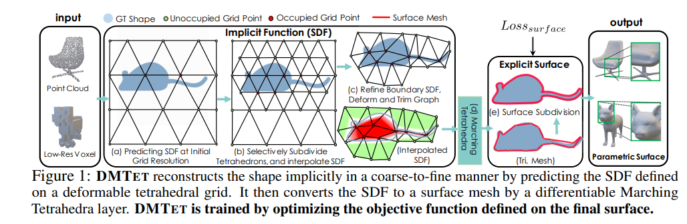
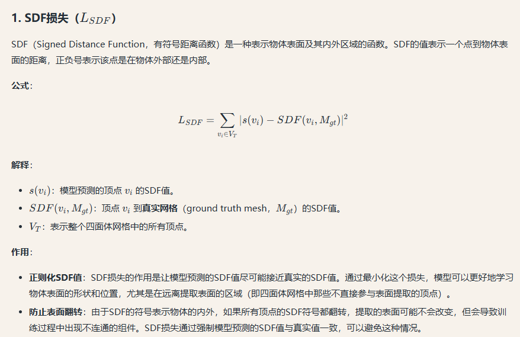
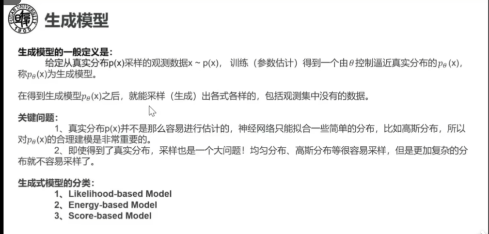

# 3D Generation ：Survey

可以搭配这个UP主的系列视频进行学习：https://space.bilibili.com/23460054/dynamic

## 1.Introduction部分

Recently, the success of neural representations, particularly Neural Radiance  Fields (NeRFs) [MST∗20,BMT∗21,MESK22,KKLD23], and generative models such as diffusion models [HJA20,RBL∗22a], has led to remarkable advancements in 3D content generation.

==可用于生成任务的常见模型：GAN, VAE, autoregressive  models，diffusion系列==。生成的除了图片以外，还包括video等。

随着3D内容的重要性日益凸显，该领域的研究工作呈现爆发式增长。然而，从2D到3D内容生成的过渡并非现有2D方法的简单扩展，而是需要应对独特挑战，并重新审视数据表示、问题建模及生成模型设计，以有效处理三维空间的复杂性。例如，

- 如何将三维场景表示整合到二维生成模型中以处理更高维度需求仍不明确。
- 与可以轻松从网络获取的图像或视频不同，3D资产相对稀缺。
- 此外，生成模型的质量评估面临额外挑战，特别是在考虑3D空间中的多视角一致性时，需要设计更优化的目标函数。

这些复杂性要求采用创新方法和新颖解决方案，以弥合2D与3D内容生成之间的鸿沟。

​														（图1）

尽管3D内容生成尚未达到2D生成技术的普及程度，但该领域已取得持续进展。如图1所示，从早期3D-GAN[WZX∗16]到近期Instant3D[LTZ∗23]等代表性方法，生成质量与多样性均实现显著提升。因此，本综述旨在系统梳理3D内容生成技术的快速发展与多维演进。我们将从三维表示方法、生成算法、数据集和应用场景等维度构建结构化框架，梳理该领域最新进展，并指明开放挑战。

​															（图2）

图2展示了本综述的总体架构。

- 首先在第2节界定研究范围并讨论相关工作。随后各章节深入分析3D内容生成的核心方法论：
- 第3节重点解析三维场景表示及其渲染机制；
- 第4节系统分类生成方法，基于算法原理将其划分为前馈生成、优化式生成、程序化生成和生成式新视角合成四大类（Sec. 4 explores a wide variety of 3D generation methods, which can be divided into four categories based on their algorithmic methodologies: **feedforward generation, optimization-based generation, procedural generation, and generative novel view synthesis.**），并通过技术演化树展示发展脉络。鉴于数据积累对深度学习模型的关键作用，我们专门梳理相关训练数据集。
- 最后讨论3D人体/面部生成等应用场景，总结开放挑战并展望未来。我们期望本综述能为相关研究者提供系统性参考，启发后续创新工作。

### （1）Scope of this survey

在本综述中，我们聚焦于三维模型生成技术及其相关数据集与应用场景。具体而言，首先简要介绍场景表示方法的核心概念。随后重点探讨如何将三维表征与生成模型有机结合，系统梳理生成方法的主要技术路线。我们同时深入分析支撑技术发展的数据集资源，以及三维人体生成、面部生成与编辑等前沿应用场景。本文致力于系统化总结与分类三维生成方法，并梳理相关数据与应用生态。所综述论文主要选自计算机视觉与图形学领域顶级会议/期刊，以及2023年arXiv平台发布的部分预印本。尽管难以穷尽所有三维生成相关方法，我们尽可能涵盖该领域主要技术分支。对各分支不展开详细技术解析，而是通过典型工作阐述其范式，具体技术细节可参考引文中的相关工作部分。

**相关工作界定** 神经场景表示与渲染技术与三维生成密切相关，但本报告不将其纳入讨论范围。关于神经渲染的综述推荐阅读[TFT∗20, TTM∗22]，其他神经表征技术可参考[KBM∗20, XTS∗22]。本综述核心关注点在于探索三维模型生成技术，因此不涵盖二维图像生成领域研究，相关技术细节可参阅：变分自编码器（VAEs）[Doe16]、生成对抗网络（GANs）[GSW∗21]、扩散模型（Diffusion）[PYG∗23, CHIS23]以及Transformer模型[KNH∗22]。现有三维生成相关综述多聚焦特定方向，如3D感知图像合成[XX23]、三维生成模型[SPX∗22]、文本到三维生成[LZW∗23]及点云深度学习[GWH∗20]。相较而言，本文将对不同三维生成方法进行全面解析。

> Our primary focus is on exploring techniques that generate 3D models.==其实就是本文聚焦于三维模型本身生成的技术，类似于NeRF的表达应该不是本文的讨论重点。==Therefore, this review does not encompass research on generation methods for 2D images within the realm of visual computing.额外可以扩展阅读的：VAEs，GANs，Diffusion，Transformers。
>
> There are also some surveys related to 3D generation that have their own focuses such as 3D-aware image synthesis [XX23],  3D generative models [SPX∗22], Text-to-3D [LZW∗23] and deep  learning for 3D point clouds [GWH∗20]. In this survey, we give a comprehensive analysis of different 3D generation methods.

## 3.Neural Scene Representations

对于AI 的3D内容生成，对于3D模型的合适表达方法是十分重要的。The generation process typically involves a scene representation and a differentiable rendering algorithm for creating 3D models and rendering 2D images.Conversely（反过来）, the created 3D models or 2D images could be supervised in the reconstruction domain or image domain, as illustrated in Fig. 3.

==有的方法直接监督场景中3D Mesh的生成，有的则将场景渲染到2D 图像上，然后再监督渲染结果的生成情况。==In the following, we broadly classify the scene representations into three groups: 

- explicit scene representations (Section 3.1), 
- implicit representations (Section 3.2), and 
- hybrid representations (Section 3.3).

 Note that, the rendering methods (e.g. ray casting, volume rendering, rasterization, etc), **which should be differentiable to optimize the scene representations from various inputs, are also introduced.**

### （1）Explicit representation

==个人补充：其实我们还是应该聚焦于Mesh的生成，因为对于游戏来说这还是非常重要的。==

By depicting scenes as an assembly of basic primitives, including point-like primitives, triangle-based meshes, and advanced parametric surfaces, these representations can create detailed and accurate visualizations of various environments and objects.

#### （a）点云

A point cloud is a collection of elements in Euclidean space, representing discrete points with addition attributes (e.g. colors and normals) in three-dimensional space.==In addition to simple points, which can be considered infinitesimally（无穷小地） small surface patches, oriented point clouds with a radius (surfels) can also be used [PZVBG00].==

**Surfels are used in computer graphics for rendering point clouds (called splitting), which are differentiable [YSW∗19, KKLD23] and allow researchers to define differentiable rendering pipelines to adjust point cloud positions and features, such as radius or color.**

> 对（a）部分以上内容的翻译与补充：
>
> 诸如基于神经点的渲染（Neural Point-based Rendering）[ASK∗20, DZL∗20]、SynSin [WGSJ20]、Pulsar [LZ21, KPLD21] 和 ADOP [RFS22] 等技术，利用可学习的特征存储物体表面外观和形状信息，从而生成更精确且细节丰富的渲染结果。其他方法如 FVS [RK20]、SVS [RK21] 和 FWD-Transformer [CRJ22] 也通过可学习特征提升渲染质量。这些方法通常将特征嵌入点云，并通过变形（warp）到目标视角解码颜色值，以实现场景的精准重建。
>
> ==个人理解就是让点云中存储可以学习的特征和外观等信息，在可微渲染中可以用梯度下降进行优化，有点Gaussian Splatting那个意思。==
>
> **对每项工作的简要概括：**
>
> 1. **Neural Point-based Rendering [ASK∗20, DZL∗20]**
>    - **已知内容**：该方法基于点云的神经渲染技术，通过将可学习特征与点云结合，直接生成多视角一致的图像。例如，Aliev 等人 [ASK∗20] 提出动态点云渲染框架，支持实时高保真渲染；Deng 等人 [DZL∗20] 则探索稀疏点云的隐式表示。
>    - **局限性**：具体技术细节需参考原文。
> 2. **SynSin [WGSJ20]**
>    - **已知内容**：由牛津大学团队提出，专注于从单张图像生成新视角的合成（novel view synthesis）。通过端到端训练，结合几何推理与纹理生成，解决单目图像的3D重建模糊性问题。
>    - **特点**：强调单目输入下的多视角一致性。
> 3. **Pulsar [LZ21, KPLD21]**
>    - **已知内容**：一种可微分的点云渲染器，支持高效梯度传播，用于优化3D形状与外观。例如，Lassner 等人 [LZ21] 提出基于球谐函数的点云渲染；Kania 等人 [KPLD21] 将其扩展为实时动态场景渲染。
>    - **应用**：常用于3D重建与生成模型的联合优化。
> 4. **ADOP [RFS22]**
>    - **已知内容**：一种结合可微分渲染与对抗训练的方法，通过单像素梯度优化实现高质量3D生成。作者 Rombach 等人 [RFS22] 提出对抗性单像素损失函数，提升细节生成能力。
>    - **创新点**：对抗训练与物理可导渲染的结合。
> 5. **FVS [RK20] 与 SVS [RK21]**
>    - **已知内容**：Rückert 等人的系列工作，专注于动态场景的可学习特征渲染。FVS（Forward Warping-based Synthesis）通过前向变形解决多视角投影问题；SVS（Structured View Synthesis）引入结构化特征提升遮挡区域推理。
>    - **贡献**：强调动态场景下特征变形与遮挡处理。
> 6. **FWD-Transformer [CRJ22]**
>    - **已知内容**：一种基于 Transformer 的点云变形框架，用于跨视角特征对齐。Chen 等人 [CRJ22] 提出前向变形注意力机制，解决点云稀疏性导致的渲染空洞问题。
>    - **优势**：Transformer 的长距离依赖建模能力。

通过将基于点云的可微分渲染器（differentiable renderers）整合到3D生成流程中，研究人员能够在保留点云优势的同时，兼容基于梯度的优化技术。这一过程通常可分为两类方法：**点分裂（point splitting）**——将离散的采样点与局部确定性模糊核（blurring kernels）结合[ZPVBG02, LKL18, ID18, RROG18]，以及**传统点渲染器（conventional point renderer）**[ASK∗20, DZL∗20, KPLD21, RALB22]。这些方法在保持可微分性的前提下，支持3D点云模型的生成与编辑，这对训练和优化3D生成任务中的神经网络至关重要。

> #### 1. **点分裂（Point Splitting）**
>
> - **核心思想**：通过将单个点分解为多个子点（splitting），并利用**局部模糊核**（如高斯核、径向基函数等）对离散点进行平滑插值，从而在渲染时模拟连续表面。这种方法旨在缓解点云稀疏性导致的渲染空洞或锯齿问题。
> - 技术实现：
>   - 离散的点云样本会被“模糊化”，每个点的影响范围通过核函数扩展到周围区域，使相邻点的颜色或几何信息能够平滑过渡。
>   - 例如，[ZPVBG02]可能是早期基于点云表面重建的模糊核方法，通过插值生成连续表面；[LKL18]可能提出动态点分裂策略以适应不同分辨率需求。
> - **优势**：适合处理稀疏点云，生成视觉上连续的表面，同时保持计算效率。
>
> #### 2. **传统点渲染器（Conventional Point Renderer）**
>
> - **核心思想**：直接基于原始点云进行可微分渲染，无需显式表面重建。通过定义每个点对最终像素颜色的贡献函数（如基于距离的权重插值），实现从点云到图像的映射，并支持梯度反向传播。
> - 技术实现：
>   - 例如，[ASK∗20]（Neural Point-based Rendering）将点云与可学习特征结合，通过可微投影生成多视角图像；[KPLD21]（Pulsar）提出基于球谐函数的点属性编码，实现高效可微渲染。
>   - 这些方法通常利用点云的位置、法线、颜色等属性，结合神经网络解码器直接生成像素值。
> - **优势**：保留点云的几何灵活性，适用于动态场景或非刚性物体的生成与优化。
>
> ------
>
> ### **关键区别**
>
> - **点分裂**侧重于通过模糊核“填补”点云之间的空隙，生成伪连续表面，适用于需要平滑输出的任务（如表面重建）。
> - **传统点渲染器**则直接操作原始点云，通过可微函数映射到图像空间，更适合需要几何精确性和动态属性的任务（如生成对抗网络中的3D形状优化）。

#### （b）Meshes

通过将多个顶点（vertices）与边（edges）连接，可构建更复杂的几何结构（如线框和网格）[BKP∗10]。这些结构可通过多边形（通常为三角形或四边形）进一步细化，以生成物体的逼真表示[SS87]。网格（meshes）提供了一种灵活高效的方式来表示复杂形状，因其易于被计算机算法操作与渲染。大多数图形编辑工具链采用三角形网格，此类表示因其广泛兼容性成为数字内容创作（DCC）流程中不可或缺的部分。为实现与现有流程无缝对接，研究者提出通过神经网络预测离散顶点位置[BNT21, TZN19]，从而可直接将结果导入DCC工具。此外，不同于离散纹理预测，基于神经网络的连续纹理优化方法（如纹理场[OMN∗19]和NeRF-Tex[BGP∗22]）被提出，以生成更精细的纹理，提升2D模型的真实感。

将网格表示整合到3D生成中需依赖基于网格的可微分渲染方法，此类方法支持以兼容梯度优化的方式光栅化网格。代表性技术包括OpenDR [LB14]、神经网格渲染器[KUH18]、Paparazzi [LTJ18]和Soft Rasterizer [LLCL19]。此外，通用物理渲染器如Mitsuba 2 [NDVZJ19]和Taichi [HLA∗19]也通过自动微分支持网格可微渲染。

> ### **对熟悉工作的简要概括**
>
> 1. **OpenDR [LB14]**
>    - 首个基于传统图形管线的可微分渲染框架，通过近似梯度实现网格参数（如顶点位置、材质）的优化，支持与深度学习框架结合。
>    - **局限性**：梯度计算依赖于近似方法，可能不够精确。
> 2. **神经网格渲染器（Neural Mesh Renderer）[KUH18]**
>    - 由Hiroharu Kato等人提出，通过可微分的渲染层将网格顶点位置与图像像素关联，支持端到端训练生成3D网格模型。
>    - **应用**：常用于单视图3D重建任务，如从单张图像预测网格。
> 3. **Soft Rasterizer [LLCL19]**
>    - 提出“软光栅化”方法，通过概率分配像素到三角形，避免传统硬光栅化的不可导问题，实现更平滑的梯度传播。
>    - **优势**：在形状生成与纹理优化中表现稳定。
> 4. **Mitsuba 2 [NDVZJ19]**
>    - 基于物理的可微分渲染器，支持自动微分计算光线传播的梯度，用于优化材质、几何与光照参数。
>    - **特点**：兼顾物理真实性与可微性，适用于逆渲染任务。
> 5. **Taichi [HLA∗19]**
>    - 高性能并行计算框架，提供可微分物理模拟与渲染功能，支持基于网格的实时梯度计算。
>    - **应用**：常用于动态场景的物理仿真与生成。
>
> ------
>
> ### **其他工作说明**
>
> - **纹理场（Texture Fields）[OMN∗19]**：将纹理表示为连续神经网络场，支持任意分辨率纹理生成，避免离散贴图的局限性。
> - **NeRF-Tex [BGP∗22]**：结合NeRF的体积渲染与纹理映射，通过隐式场生成高细节表面纹理。
> - **SS87**：经典论文提出参数化曲面变形技术（如自由变形FFD），为网格编辑奠定基础。
> - **Paparrazi [LTJ18]**：基于实时路径追踪的可微渲染器，支持复杂材质优化，具体细节需参考原文。

#### （c）Multi-layer Representations

在实时新视角合成领域，使用多层半透明颜色图层来表征场景已成为流行且成功的方案[ZTF∗18]。分层深度图像（Layered Depth Image, LDI）表示法[SGHS98]是该领域的典型代表，它通过包含多个带有对应颜色值的深度图层来扩展传统深度图。多种方法[PZ17, CGT∗19, SSKH20]受到LDI表示的启发，结合深度学习技术开发了能够预测LDI的网络架构。除LDI外，立体放大技术[ZTF∗18]首创了多层平面扫描（MPI）表示法，该方法通过平面扫描体在固定深度范围内使用多个前平行半透明层（包含颜色和透明度）描述场景。借助体素渲染和单应性投影（homography projection），可以实现实时的新视角合成。基于该技术，后续方法[FBD∗19, MSOC∗19, STB∗19]采用MPI表示提升了渲染质量。通过将平面替换为球面，[BFO∗20, ALG∗20, LXM∗20]等方法进一步扩展了多层表示法对广视角场景的支持。随着该领域研究的持续发展，我们期待这些方法将推动更高效、更优质的三维生成技术应用于实时渲染。

技术概括（基于了解的内容）：

1. LDI和MPI表示法的核心创新在于通过多层深度/透明度的混合表征提升渲染质量，这与现代图形学中基于延迟渲染的分层思想存在技术关联性。
2. 从平面到球面的扩展验证了参数化几何基元选择对视角覆盖范围的重要影响，这与360度全景渲染的技术演进路径一致。
3. 基于深度学习的LDI预测网络体现了传统图形学方法与神经渲染技术的融合趋势，这种混合架构在保持实时性的同时提升了场景重建的鲁棒性。

> **1. 多图层表示法 (Multi-layer Representations) 是什么？**
>
> 想象你要用Photoshop画一幅有遮挡关系的场景（比如：树在前，山在后）。传统方法是用一张深度图，每个像素只记录一个距离值，相当于“单层”的遮挡关系。但如果树中间有缝隙能透出后面的山，单层深度图就会出错——它不知道缝隙处应该显示山还是树。
>
> **解决方案**：用“多层透明图层”叠加。就像在Photoshop里叠加多个半透明图层，每一层记录不同深度的颜色和遮挡关系。渲染时，根据视角把这些图层按深度顺序混合，就能正确处理复杂遮挡（比如树缝后的山）。
>
> ---
>
> **2. LDI（分层深度图像）的思路：**
>
> - **核心**：对场景中的每个像素，允许存在多个“层”。比如树的像素有两层：第一层是树本身的颜色和深度，第二层是树后面被遮挡的山的颜色和深度。
> - **实现**：类似“动态扩展的深度图”。传统深度图每个像素只能存一个深度值，而LDI每个像素可以存多个深度值和对应的颜色。当视角变化时，系统会自动选择该视角下应该显示的层。
> - **优点**：能精确处理遮挡关系，适合复杂场景（比如树叶缝隙、网格物体）。
>
> ---
>
> **3. MPI（多层平面扫描）的思路：**
>
> - **核心**：在场景中平行放置多个“虚拟透明平面”（像一叠透明玻璃板），每个平面记录该位置的颜色和透明度。
> - **实现**：例如，在相机前每隔1米放一个透明平面，每个平面拍摄一张半透明的“快照”。当换新视角时，把这些平面图像通过投影变形（类似PS的透视变换），再按深度叠加混合。
> - **优点**：计算效率高（平面变形是数学运算，适合GPU加速），适合实时渲染。后来改进版用球面代替平面，还能支持360°全景。
>
> ---
>
> **类比总结：**
> - **LDI** 像“智能动态图层”：每个地方需要几层就存几层，灵活但计算复杂。
> - **MPI** 像“批量预设图层”：提前按固定间隔铺好平面，简单高效但可能浪费资源。
>
> 两者都解决了传统单层方法无法处理遮挡和视角变化的问题，是3D渲染中“用多层换质量”的经典思路。

#### 总结

以下是关于三种显式场景表示方法（点云、网格、多层表示）的对比表格，涵盖使用场景、核心思路、优缺点及代表性工作：

| **表示方法**               | **使用场景**                                                 | **核心思路**                                                 | **优点**                                                     | **缺点**                                                     | **代表性工作**                                               |
| -------------------------- | ------------------------------------------------------------ | ------------------------------------------------------------ | ------------------------------------------------------------ | ------------------------------------------------------------ | ------------------------------------------------------------ |
| **点云 (Point Clouds)**    | - 3D扫描数据重建 - 实时渲染（如VR/AR） - 动态场景表示（如粒子系统） | 通过离散点集表示物体表面，附加属性（颜色、法线等），支持可微分渲染优化。 | - 简单灵活，适合稀疏数据 - 支持动态场景 - 可微分渲染（如surfels） | - 缺乏拓扑结构，需后处理（如网格化） - 高密度点云存储开销大 - 渲染质量依赖点密度 | **Neural Point-based Rendering** [ASK∗20]：将可学习特征嵌入点云，通过变形解码颜色。 **ADOP** [RFS22]：结合点云与光线行进，实现高质量渲染。 **Pulsar** [LZ21]：使用球谐函数表示点属性，支持端到端训练。 |
| **网格 (Meshes)**          | - 数字内容创作（DCC） - 游戏/影视建模 - 工业设计（CAD） | 通过顶点、边、面（如三角形）定义几何结构，支持连续纹理优化和物理模拟。 | - 结构紧凑，存储高效 - 兼容主流工具链（如Blender） - 支持复杂拓扑和物理仿真 | - 拓扑固定，难以动态修改 - 高质量网格生成依赖人工或复杂优化 - 非均匀网格可能导致渲染瑕疵 | **Texture Fields** [OMN∗19]：用神经网络预测连续纹理，提升细节。 **NeRF-Tex** [BGP∗22]：结合NeRF与网格纹理，实现高保真材质。 **Soft Rasterizer** [LLCL19]：可微分网格渲染器，支持梯度反向传播。 |
| **多层表示 (Multi-layer)** | - 实时新视角合成（如VR/AR） - 大视场场景表示（如全景图） - 透明/半透明物体渲染 | 使用多层半透明平面或球面（含颜色/透明度）表示场景，通过体积渲染合成新视角。 | - 实时渲染性能高 - 支持透明效果 - 扩展性强（如球面层适应大视场） | - 层数固定可能导致深度不连续 - 内存占用随层数增加 - 动态场景适应性有限 | **Stereomagnification** [ZTF∗18]：首倡MPI表示，用平面扫描体渲染新视角。 **MPI扩展方法** [BFO∗20]：将平面替换为球面，支持360°场景。 **LDI方法** [SSKH20]：基于深度学习的多层深度图预测，增强几何细节。 |

补充说明：

1. **点云**的差异化渲染技术（如surfels）使其在动态场景中表现优异，但依赖后处理（如泊松重建）生成网格。
2. **网格**在工业流程中不可替代，但自动化生成高质量网格仍是挑战（如非流形结构处理）。
3. **多层表示**（如MPI）在实时应用中优势显著，但限于静态或低速动态场景，且需权衡层数与精度。

此表格总结了各方法的核心特性，可根据实际需求进一步扩展具体技术细节。

### （2）Implicit Representations

Unlike explicit scene representations that usually focus on object surfaces, **implicit representations could define the entire volume of a 3D object, and use volume rendering for image synthesis. These representations utilize mathematical functions, such as radiance fields [MST∗20] or signed distance fields [PFS∗19, CZ19], to describe the properties of a 3D space.**

#### （a）Neural Radiance Fields（NeRFs）

Rather than utilizing point clouds and meshes, NeRFs depict the scene as a continuous volume. This approach involves obtaining volumetric parameters, such as viewdependent radiance and volume density, **by querying an implicit neural network.** This innovative representation offers a more fluid and adaptable way to capture the intricacies of 3D scenes, paving the way for enhanced rendering and modeling techniques.

NeRF的相关技术简介：

#### **NeRF代表性工作分类表格**

| **应用领域**        | **代表性工作**                                          | **贡献与核心思想**                                           |
| ------------------- | ------------------------------------------------------- | ------------------------------------------------------------ |
| **基础方法**        | **NeRF (Mildenhall et al., 2020) [MST∗20]**             | 提出体积渲染框架，通过MLP隐式表示3D场景（密度+颜色），支持高质量新视角合成。 |
| **编辑与操控**      | **Editing NeRF (Yuan et al., 2022) [YSL∗22]**           | 支持用户交互式编辑NeRF场景（如物体删除、变形）。 **其他**： - [MBRS∗21]：通过语义分割编辑场景属性。 - [ZLLD21]：基于GAN的NeRF编辑。 |
| **相机位姿优化**    | **BARF (Lin et al., 2021) [LMTL21]**                    | 联合优化NeRF与相机位姿，解决输入图像位姿不准的问题。 **其他**： - [WWX∗21]：动态场景的相机位姿估计。 - [CCW∗23]：稀疏视图下的位姿优化。 |
| **逆向渲染**        | **NeRFactor (Zhang et al., 2021) [ZLW∗21]**             | 从NeRF中分解材质、光照等物理属性，支持重光照。 **其他**： - [SDZ∗21]：分离漫反射与高光反射。 - [ZZW∗23]：动态场景的逆向渲染。 |
| **泛化性提升**      | **PixelNeRF (Yu et al., 2021) [YYTK21]**                | 单张或多张图像输入即可生成NeRF，无需逐场景训练。 **其他**： - [WWG∗21]：跨场景预训练NeRF。 - [HZF∗23b]：少样本NeRF适应。 |
| **加速与实时渲染**  | **Instant-NGP (Müller et al., 2022) [RPLG21]**          | 使用哈希编码和多分辨率网格，训练速度提升1000倍。 **其他**： - [GKJ∗21]：基于张量分解的轻量化NeRF。 - [ZZZ∗23b]：硬件友好的稀疏体素渲染。 |
| **自由视点视频**    | **Dynamic NeRF (Park et al., 2021) [DZY∗21]**           | 将NeRF扩展到动态场景，支持时间维度的4D建模。 **其他**： - [LSZ∗22]：基于隐式变形场的动态NeRF。 - [PCPMMN21]：多人动态捕捉与渲染。 |
| **数字人生成**      | **HeadNeRF (Gafni et al., 2021) [GCL∗21]**              | 高保真头部Avatar合成，支持表情与视角控制。 **其他**： - [PDW∗21]：实时人体动作重演。 - [WCS∗22]：语音驱动的面部动画。 |
| **机器人/自动驾驶** | **NeRF in Robotics (Kerr et al., 2022) [KFH∗22]**       | 将NeRF用于机器人场景理解与路径规划。 **其他**： - [ZKW∗23]：NeRF辅助自动驾驶仿真。 - [ACC∗22]：无人机场景重建。 |
| **医学/科学成像**   | **NeRF for Tomography (Rückert et al., 2022) [RWL∗22]** | 将NeRF应用于CT/MRI数据重建，提升分辨率。 **其他**： - [ZLZ∗22]：天文观测数据的三维重建。 |
| **图像处理**        | **HDR-NeRF (Huang et al., 2022) [HZF∗22]**              | 支持HDR场景渲染与曝光控制。 **其他**： - [MLL∗22b]：NeRF用于图像超分辨率。 - [HZF∗23a]：低光增强的NeRF扩展。 |

#### （b）Neural Implicit Surfaces

This method is particularly effective in filling in missing information and generating smooth, continuous surfaces.

> 
>
> 

#### **2. 核心概念与工作分类**

##### **(a) 神经隐式表面的基础方法**

| **方法**                        | **核心思想**                                                 | **特点**                                          |
| ------------------------------- | ------------------------------------------------------------ | ------------------------------------------------- |
| **DeepSDF** [GCV*19]            | 用MLP学习符号距离场（SDF），通过 f(x)=0*f*(*x*)=0 等值面提取网格。 | 首个将SDF与神经网络结合的框架，支持连续表面表示。 |
| **Occupancy Networks** [XWC*19] | 预测点的占用概率（0/1），而非SDF。                           | 更简单的二分类任务，适合非闭合表面。              |
| **NeRF** [MST*20]               | 用体积密度和颜色场表示场景，隐式定义表面（密度峰值处）。     | 虽非显式SDF，但启发了后续隐式表面与渲染的结合。   |

##### **(b) SDF与体积渲染的结合（NeRF扩展）**

| **方法**             | **贡献**                                       | **技术亮点**                                                 |
| -------------------- | ---------------------------------------------- | ------------------------------------------------------------ |
| **VolSDF** [YGKL21]  | 将SDF转换为体积密度 σ，实现可微渲染。          |  |
| **NeuS** [WLL*21]    | 提出SDF-guided体积渲染，解决NeRF几何模糊问题。 | Sigmoid加权透射率，确保表面在SDF零值处聚焦。                 |
| **MonoSDF** [YPN*22] | 结合单目深度估计与SDF，实现稀疏视图重建。      | 引入几何一致性损失，增强单视图泛化能力。                     |

##### **(c) 高级应用与改进**

| **方向**     | **方法**         | **解决什么问题？**                                     |
| ------------ | ---------------- | ------------------------------------------------------ |
| **动态拓扑** | D-NeRF [PDW*21]  | 通过时间编码支持动态场景的隐式表面建模。               |
| **高频细节** | PET-NeuS [WSW23] | 添加可学习的位移场，捕捉表面微观结构（如纹理、凹槽）。 |
| **逆向渲染** | IRON [ZLLS22]    | 从SDF中分解材质、光照，支持物理合理的重光照。          |

### （3）Hybrid Surface Representation

隐式表示在各种应用中确实展示了令人印象深刻的结果。然而，目前大多数隐式方法依赖于对 NeRF 或 SDF 值的回归，这可能限制了它们从目标视图或表面上获得显式监督的能力。显式表示可以在训练过程中施加有用的约束，从而改善用户体验。为了利用两种表示的互补优势，研究人员已经开始探索混合表示。这些表示涉及场景表示（无论是显式还是隐式），并使用渲染算法嵌入特征以进行视图合成。

#### （a）体素网格 Voxel Grids

早期的研究工作 [WSK∗15, CXG∗16, MS15] 使用体素来表示3D形状，体素在规则网格上存储粗糙的占用值（内部/外部）。这种方法使得强大的卷积神经网络能够直接操作，并在3D重建和合成中取得了令人印象深刻的结果 [DRB∗18, WZX∗16, BLW16]。这些方法通常使用显式的体素网格作为3D表示。最近，为了解决隐式表示训练和渲染速度慢的问题，提出了基于3D体素的嵌入方法 [LGZL∗20, FKYT∗22, SSN∗22, SSC22]。这些方法能够更高效地编码场景的空间信息并解码特征。此外，Instant-NGP [MESK22] 引入了通过哈希函数隐式编码的多层次体素网格，它在保持模型紧凑的同时，实现了快速的优化和渲染。这些3D形状表示和处理技术的进步显著提高了3D生成应用的效率和效果。

**体素网格（Voxel Grids）**

| **工作**                        | **贡献**                                                     |
| ------------------------------- | ------------------------------------------------------------ |
| **3D ShapeNets** [WSK∗15]       | 提出了使用体素网格表示3D形状的方法，为3D深度学习奠定了基础。 |
| **VoxNet** [CXG∗16]             | 使用体素网格和3D卷积神经网络进行3D形状分类，展示了体素表示的有效性。 |
| **OctNet** [MS15]               | 引入了八叉树结构来高效地表示稀疏体素网格，显著减少了内存和计算开销。 |
| **Occupancy Networks** [DRB∗18] | 使用体素网格表示3D形状的占用值，实现了高质量的3D重建。       |
| **Instant-NGP** [MESK22]        | 提出了多层次哈希编码的体素网格，显著加速了神经辐射场（NeRF）的训练和渲染。 |

#### （b）**三平面（Tri-plane）**

三平面表示是一种替代体素网格的方法，用于在3D形状表示和神经渲染中嵌入特征。这种方法的主要思想是将3D体积分解为三个正交平面（例如XY、XZ和YZ平面），并在这些平面上表示3D形状的特征。具体来说，TensoRF [CXG∗22] 通过将每个体素网格替换为平面和向量的张量分解，实现了类似的模型压缩和加速。三平面表示高效且能够随表面积而非体积扩展，并自然地与经过精细调整的2D生成架构集成。在生成设置中，EG3D [CLC∗22] 提出了一种将空间分解为三个平面的方法，这些平面的值相加以表示3D体积。NFD [SCP∗23] 引入了3D场景上的扩散，利用2D扩散模型骨干，并内置了三平面表示。

| **工作**                 | **贡献**                                                     |
| ------------------------ | ------------------------------------------------------------ |
| **TensoRF** [CXG∗22]     | 使用张量分解将3D体积表示为三个平面，实现了高效的模型压缩和加速。 |
| **EG3D** [CLC∗22]        | 提出了三平面表示用于生成高质量3D形状，结合了2D生成模型的优势。 |
| **NFD** [SCP∗23]         | 在3D场景扩散中引入三平面表示，利用2D扩散模型骨干生成3D内容。 |
| **Tri-MipRF** [FKYT∗22]  | 使用三平面表示和多分辨率特征，提高了3D重建的细节和效率。     |
| **PlenOctrees** [SSN∗22] | 结合三平面表示和八叉树结构，实现了高效的神经渲染和3D重建。   |

> 补充一些Triplane的相关内容：https://zhuanlan.zhihu.com/p/661156248
>
> The main idea behind this method is to decompose a 3D volume into three orthogonal planes (e.g., XY, XZ, and YZ planes) and represent the features of the 3D shape on these planes. ==todo：还没认真看这种方法，如果有必要学习的话可以补充进来。==

DMTet的介绍。

#### DMTet整篇工作的介绍

可以参考知乎文章：https://zhuanlan.zhihu.com/p/609866304。推荐看这个视频：https://www.bilibili.com/video/BV1Ke4y1q77C/?spm_id_from=333.337.search-card.all.click&vd_source=f0e5ebbc6d14fe7f10f6a52debc41c99。

想测试DMTet的话，可以尝试一下这个仓库：https://github.com/lzzcd001/MeshDiffusion。

##### DMTET的使用场景？

在3D生成任务中，许多方法（如NeRF、SDF-based方法）会输出**隐式表示**（如体素、SDF、NeRF的密度场等）。DMTet的核心作用是将这些隐式表示转换为**显式网格**（explicit mesh），即可以直接用于渲染、编辑或下游任务的三角网格。

- **输入**：隐式表示（如SDF值、密度场等）。
- **输出**：高质量的三角网格。
- **优势**：相比于传统的Marching Cubes方法，DMTet能够生成更平滑、更细节丰富的网格，同时避免伪影。

很多隐式方法都是去回归一个SDF的值，DMTet是直接对重建表面进行优化，从而合成更精细的几何细节，同时伪影也更小。与Mesh等显式生成的方式也有所普通，DMTet可以生成任意拓扑的形状。可以来看一下其摘要部分：

> We introduce DMTET, a deep 3D conditional generative model that can ==synthesize high-resolution 3D shapes using simple user guides such as coarse voxels.  It marries the merits of implicit and explicit 3D representations by leveraging a novel hybrid 3D representation.== Compared to the current implicit approaches, which are trained to regress the signed distance values, **DMTET directly optimizes for the reconstructed surface, which enables us to synthesize finer geometric details with fewer artifacts. Unlike deep 3D generative models that directly generate explicit representations such as meshes, our model can synthesize shapes with arbitrary topology.**
>
> ==The core of DMTET includes a deformable tetrahedral grid that encodes a discretized signed distance function and a differentiable marching tetrahedra layer that converts the implicit signed distance representation to the explicit surface mesh representation.== （四面体的每个顶点都编码了一个SDF的值，而differentiable marching tetrahedra layer可以将隐式的SDF的呈现转换为显式的mesh的表示）This combination allows joint optimization of the surface geometry and topology as well as generation of the hierarchy of subdivisions using reconstruction and adversarial losses defined explicitly on the surface mesh. Our approach significantly outperforms existing work on conditional shape synthesis from coarse voxel inputs, trained on a dataset of complex 3D animal shapes. Project page: https://nv-tlabs.github.io/DMTet/.

以下是B站视频的文字版总结：

> [Neural Rendering : Mesh Extraction][NeurIPS 2021] DMTet论文讲解-能够生成高分辨率的物体表面网格
> https://www.bilibili.com/video/BV1Ke4y1q77C/
>
> 论文链接：https://arxiv.org/pdf/2111.04276
>
> 我们来简单的看一下DMTet这篇文章, DMTet的全称是Deep Marching Tetrahedra, 那我们先来看一下DMTet它呃具体去做了一个什么样的事情, 我们可以从这个图里去看一下。
>
> 
>
> 这就是DMTet它的一个整体的一个架构图, DMTet它是一种深度3D条件生成模型, 它可以使用简单的用户指导, 就能够生成高分辨率的3D形状, 那这种简单的用户指导啊, 打个比方, 可以是这种粗的3D体素的网格, 那也可以是这种带有噪声的点云数据, 那DMTet做的事情就是这种简单的输入啊, 经过DMTet这样的网络就可以得到精细的3D形状的呈现。
>
> 我们来看DMTet的摘要部分：
>
> - DMTet是一种深度3D条件生成模型, 它可以仅使用简单的用户指导, 就能够生成高分辨率的3D形状, 这种简单的用户指导, 就像我们刚才看到的, 可以是粗略的3D体素, 也可以是带有噪声的点云数据, 那DMTet利用一种新的混合3d呈现方式, 能够结合隐式和显式3D呈现的优点,。
>   - 当前的隐式呈现方法大多是去回归一个SDF的值, 那相较于这些方法, DMTet是直接对重建表面去进行优化, 这使得DMTet能够合成更精细的几何细节, 同时伪影也会更少, 与直接生成网格等显式表示的深度3D生成模型又不同, DMTet可以合成具有任意拓扑的形状。
>   - DMTet的核心包括==一个可形变的四面体网格和一个可微的 Marching Tetrahedra层, 四面体网格的每个顶点都编码了一个SDF的值, 而 Marching Tetrahedra 层能够将这种隐式的sdf的值的呈现转换为显式的表面mesh的呈现。==
>   - DMTet的这种组合方式, 允许对表面几何、拓扑结构以及细分层次的生成而进行联合的优化, 那==优化过程中的目标函数是使用在表面网格上显式去定义的==, 这种重建的loss和对抗的loss, 而并且DMTet的方法在当时是明显优于各种同类算法，这就是DMTet的一个摘要的部分。
>
> 补充：**DMTet的Loss是如何定义的？**
>
> 摘要的原文是这样说的：This combination allows joint optimization of the surface geometry and topology as well as generation of the hierarchy of subdivisions ==using reconstruction and adversarial losses defined explicitly on the surface mesh.==
>
> 
>
> Chamfer Distance（倒角距离）的解释：https://zhuanlan.zhihu.com/p/598984906，就是一个对点云的点对的距离损失估计，需要直接用就行。
>
> 解释一下上面那张图里面最后的正则项：
>
> 
>
> 
>
> 我们直接来看这篇文章的方法部分：
>
> 那在开始文章的方法部分之前, 我们先来理解一下, 就是我用文章叫做DMTET, 就是TET就是四面体的意思, 那四面体是怎么去表征的, 我们先从这个二维的角度来看一个平面, 那平面如果我们去表征一个平面的话, 我们可以把平面, 然后进行这种网格的划分, 那最简单的一个网格的划分就是这种三角面片。对于空间来说, 就可以用四面体的形式来对这个空间去进行表征：
>
> 
>
> 四面体它其实四个面每个面都是一个三角形, 把很多很多的这样的四面体, 然后给累到一起啊, 就是可以去表征一个空间。
>
> 简单来说，我们可以先从二维的角度去看, DMTET它的一个整体的一个架构，这里就再次来看一下架构图：
>
> 
>
> 那 DMTET首先它的输入我们刚才提到它是一个简单的用户指导, 比如说它可以是这种噪声点云啊, 或者是这种低分辨率的啊, 体素的这样的一个网格作为输入：
>
> - （1）输入的第一步我们对整体去做一个预测, 比如说去预测点的初始的位置, 然后和每个点上它会对应一个SDF的值, 也可以是一个SDF的一个特征向量；（对应上面的（a））
> - （2）那这一步预测完了之后， 这些网格的数目就保持不变了（后面（b）步骤可能会细分，但（a）这一步做到拟合的时候不会改变网格的数目）, 我们可以看到（a ）图里面，红色代表的就是物体内部的点, 那这个绿色代表这个物体这个外面的点, 那这个这种浅蓝色代表的就是这个物体本身。这个网格预测一遍之后, 就保持不变。
>   - 那我们再来看一张图：
>   - 
>   - 这个图里面啊, 我们是通过用这种三角的网格, 然后去表征了一个平面的结构。随着时间的推移, 然后啊这个网格的顶点, 然后它就不是一个啊像这样的就是初始化的一个三角形啊, 它慢慢的顶点, 然后都会发生这种形变, 然后去慢慢的去贴合我们要去拟合的这样的一个表面, 那也就是刚才我们提到, 在 DMTET的第一步, 我们会去预测一个初始的网格的顶点位置, 以及顶点的SDF的值, 那之后的训练过程中, 实际上是给网格的顶点和sdf值去施加了一个偏移, 我们会把这个网格的顶点, 然后去做一个偏移, 使得这个网格慢慢的去逼向我们要去拟合的这个形状。
>   -  那这样做有一个什么样的好处呢, 就是尽量的去避免啊内存的开销, 我们就不用每次产生新的顶点, 我们就原来用原来的顶点, 然后这些顶点然后不断的去这个变化, 然后去慢慢的拟合外面的一个形状。==第一步会去预测一个初始的SDF值和这个顶点的位置, 那之后就去迭代, 优化, 这个过程使得这些顶点, 然后慢慢的去逼近这个物体的一个真实的一个轮廓（跟SDF的传统定义一致，<0表示在内侧，>0表示在外侧，其实也可以简化为内部为0，外部为1，这样后面求和能更方便判断内外属性）==
>   - 逼近的时候还可以做一些==剪枝操作==，比如方便起见，我们定义SDF=1表示在外面，SDF=0表示在内部，==这样可以把每个四面体四个顶点的SDF值加在一起，如果sum=0或者sum=1都可以被剪枝掉。==剩下的就是四面体的一部分在表面内，一部分在表面外这种情况, 此时那四面体就会与这个物体的表面它是有交点的, 这这就是这一个步骤, 
> - （3）对于物体表面上的这些四面体, 我们可以进一步去进行细分。==这个步骤对应上面框架的步骤（b）。一种简单的细分方法就是取每条边的中点做细分。==在物体的表面部分, 那之后我们可以迭代的去进行, 如果是对于这种细分出来的四面体, 完全在物体的表面, 那我们可以把四面体扔掉, 如果说完全在物体的外面也可以扔掉, 只留下来与物体有交点的那些四面体去进行接下来的一个运算。==细分的过程因为只涉及取中点的操作，因此依然是可微的，反向传播完全可以传播回来。==
> - （4）经过不断地迭代后， 我们就可以把这个表面进行提取。核心是下面这张图：
> - 
> - 理论上四个顶点都分别有是否在物体内外两种情况（即对应$2^4=16$种情况），但由于SDF的对称性，全在内或者全在外的情况都剪枝掉了，对于Marching Cube还剩下很多种情况要考虑，但对于DMTet来说，就剩下了两图中间和右侧的两种情况，一种是两个情况在内侧，另两个在外侧；另一种是一个在内侧/外侧，其他三个与其不同。要考虑的情况会很少，因此比较方便。
> - 解释一下上图当中的$v_{ab}'$的求解，其实就是一个lerp的操作，比如$s(v_b)$表示的是b点的SDF值，用两个顶点的SDF值插值可以得到连线中间点的SDF值。==这里为什么是减号呢？==因为对于上图最右侧的情况，b在外侧（SDF值为正数），a在内侧（SDF值为负数），此时总的SDF值差本来就应该是SDF(b)-SDF(a)，相当于正数-负数 = 正数+负数的绝对值。

##### 关于DMTET生成坏mesh的疑问

我注意到，DMTet生成的结果在渲染上虽然结果不错，但实际上生成的网格Mesh是美术人员难以利用的（看起来有很多噪声，而且对于UV展开和贴图烘焙来说是灾难性的），是否有工作在解决这个问题呢？还是说DMTet生成优秀拓扑的结构不太现实，需要用别的方式来生成mesh，比如直接优化拓扑，你是否有知道相关的工作，可供我了解？

> 你提到的这个问题非常关键！DMTet虽然在几何细节和表面重建方面表现出色，但它生成的网格（Mesh）通常存在**拓扑复杂**、**噪声多**、**难以用于UV展开和贴图烘焙**等问题，这对于美术人员来说确实是一个挑战。目前，确实有一些研究工作在尝试解决这些问题，或者通过其他方式来生成更适合美术工作流的网格。以下是一些相关的研究方向和工作，供你参考：
>
> ---
>
> ### 1. **DMTet的改进与后处理**
> 一些研究尝试在DMTet的基础上进行改进，或者通过后处理来优化生成的网格，使其更适合美术工作流。
>
> #### 相关工作：
> - **Neural Subdivision**（NeurIPS 2021）：
>   - 提出了一种基于神经网络的分割方法，可以在保持几何细节的同时生成更规则的拓扑结构。
>   - 链接：https://arxiv.org/abs/2005.01819
> - **Mesh R-CNN**（CVPR 2020，==感觉有点太老了，而且效果不是很好，可以先不关注了==）：
>   - 结合深度学习与传统的网格优化方法，生成更规则的网格拓扑。
>   - 链接：https://arxiv.org/abs/1906.02739
>
> #### 后处理方法：
> - **网格简化（Mesh Simplification）**：
>   - 使用网格简化算法（如Quadric Error Metrics）减少网格的面片数，同时尽量保持几何细节。
>   - 工具：MeshLab、Blender的简化工具。
> - **重拓扑（Retopology）**：
>   - 使用重拓扑工具（如ZBrush的ZRemesher、Blender的Retopology工具）生成更规则的网格拓扑。
>   - 这种方法通常需要手动调整，但可以显著改善网格的可编辑性。
>
> ---
>
> ### 2. **直接优化拓扑的方法**
> 一些研究尝试直接优化网格的拓扑结构，生成更适合美术工作流的网格。
>
> #### 相关工作：
> - **Deep Geometric Prior**（SIGGRAPH 2019）：
>   - 提出了一种基于深度学习的几何优化方法，可以生成更规则的网格拓扑。
>   - 链接：[Deep Geometric Prior](https://arxiv.org/abs/1811.10943)
> - Neural Template: Topology-aware Reconstruction and Disentangled Generation of 3D Meshes
>   - 提出了一种拓扑感知的表面重建方法，可以在生成网格时直接优化拓扑结构。
>   - 链接：https://arxiv.org/abs/2206.04942
>
> 其他可能有用的论文链接（有时间可以看一下）：
>
> - https://arxiv.org/pdf/2303.12012
> - https://arxiv.org/pdf/2006.10211 ： UVNet
>
> ### 5. **工具与插件**
> 一些工具和插件可以帮助优化DMTet生成的网格，使其更适合美术工作流。
>
> #### 工具：
> - **ZBrush ZRemesher**：
>   - 自动重拓扑工具，可以生成更规则的网格拓扑。
> - **Blender Retopology Tools**：
>   - Blender内置的重拓扑工具，支持手动和自动重拓扑。
> - **MeshLab**：
>   - 开源的网格处理工具，支持网格简化、平滑和优化。
>
> ---
>
> ### 6. **未来方向**
> 目前，DMTet生成优秀拓扑的结构仍然是一个挑战，但以下方向可能有助于解决这个问题：
> - **拓扑感知的损失函数**：在训练过程中加入拓扑约束，直接优化网格拓扑。
> - **多阶段生成**：先使用DMTet生成几何细节，再通过重拓扑或优化方法生成规则拓扑。
> - **结合参数化方法**：在生成网格时直接生成UV展开，适合贴图烘焙。
>
> ---
>
> ### 总结
> DMTet生成的网格在拓扑和美术工作流方面确实存在挑战，但目前已有一些研究工作在尝试解决这些问题。你可以从以下几个方面入手：
> 1. **改进DMTet**：结合拓扑感知的损失函数或多阶段生成方法。
> 2. **后处理**：使用网格简化、重拓扑等工具优化生成的网格。
> 3. **直接优化拓扑**：参考相关研究（如Deep Geometric Prior、Topology-Aware Surface Reconstruction）。
> 4. **结合传统方法与深度学习**：使用工具（如ZBrush、Blender）或研究（如Neural Mesh Optimization）优化网格。
>
> 希望这些信息对你有所帮助！如果你有更多问题，欢迎继续讨论！

## 4.Generation Methods

### （1）前置视频资料学习推荐

#### （a）AIGC-3D（==这个视频看不太懂，后面再说吧==）

https://www.bilibili.com/video/BV19h4y1M7aW/?spm_id_from=333.337.search-card.all.click&vd_source=f0e5ebbc6d14fe7f10f6a52debc41c99

> 内容总结：
>
> 那今天给大家分享的是一个很大的题目, 叫做AIGC 3D, 然后也是借了一下AIGC这个概念, 然后讲一讲这个目前从这个零样本, 或者是从图像, 从文本来生成3d内容的这样一个事情, 然后我的主要会分为四个章节, 第一部分就是应用前景, 第二章数据会偏数学角度来讲一下现在概率视角下的一些生成模型的一些简介, 然后第三章就是讲一些具体的工作, 就是text image to 3d, 然后第四章就是总结一下这个未来的一些工作。
>
> ## 以下为第二章的内容——概率视角下的一些生成模型
>
> 接下来讲一下现在概率视角下的一个生成模型, 如果关注生成模型的话, 肯定会了解这样一个图（参考链接：https://lilianweng.github.io/posts/2021-07-11-diffusion-models/）：
>
> 
>
> Flow-based models会在接下来进行介绍。另外还有一些概念：比如Score Function, Score Matching, Score Distillation Sampling, SDE, ODE......
>
> ### (1)生成模型的定义和核心问题，分类
>
> 
>
> 关于分类：
>
> - 第一种叫做likelihood-based model, 就是自然的基于自然函数估计的这样一个model
> - 第二种就是这个energy based model, 基于能量能量模型的
> - 第三个就是这个score-based model, 基于得分的, 基于分数模型的。
>
> #### （a）likelihood-based model
>
> 基于似然估计的方法, 然后他的目的就是说, 我在学习一个为我观测的样本分布, 能够分配它更高可能性的一个模型, 就是极大似然估计，机器学习最先接触就是一个概念。
>
> 补充：==极大似然估计：==https://www.zhihu.com/question/24124998/answer/1547063354
>
> 
>
> $p(x)$的真实分布是我们非常难以估计的, 那么可以考虑一些影响该分布的, 一些隐变量。举个例子，西瓜为什么这么甜, 它有可能是这个天气原因造成的, 那么我们把天气作为一个隐变量啊, 只不过这里的这里的隐变量z, 它是一个非常抽象的, 但它可能代表的是天气这种因素。ok我们见过一个z, 那么p(x)整体它就能写成这样一种积分的形式, 相当于对他一个联合分布, 对dz的这样一个一个积分, 就得到这样一个p(x)的分布。
>
> 接着复习一下上图中的贝叶斯公式，这里的$p(x)$是真实分布，$p(z|x)$是后验分布，表示得到了一些观测数据之后，要如何修正z（因变量）。$p(x|z)$叫做似然，$p(z)$是一个先验分布，比如西瓜为什么甜的问题中（我们估计其可能会跟天气有关），$p(z)$指的就是天气分布。

#### ==（b）Games Webinar==

视频链接：https://www.bilibili.com/video/BV1wT4y1879Y/?vd_source=f0e5ebbc6d14fe7f10f6a52debc41c99

#### （c）3D AIGC论文串讲

https://www.bilibili.com/video/BV1iM4m197Ay/?spm_id_from=333.337.search-card.all.click&vd_source=f0e5ebbc6d14fe7f10f6a52debc41c99

##### 任务背景&发展路线

主要关注点：==DreamFusion及以后的一系列工作。==

##### Zero-123

论文链接：https://arxiv.org/pdf/2303.11328

一个解读的知乎链接：https://zhuanlan.zhihu.com/p/660665923

> ### **【一句话总结】：**
>
> 基于单张[RGB图片](https://zhida.zhihu.com/search?content_id=234942919&content_type=Article&match_order=1&q=RGB图片&zhida_source=entity)，生成其他视角的2D图，再进一步扩展到完整3D模型，且整体模型是zero-shot无需额外训练数据。核心优化点在于，提供了一个基于2D训练数据的有大量3D先验的生成式模型。
>
> 本质上，[zero-123](https://zhida.zhihu.com/search?content_id=234942919&content_type=Article&match_order=1&q=zero-123&zhida_source=entity)是多视角生成式3D的通用方案之一，后续有不少都是围绕该方案进行优化的。

以下对Zero-123的方法进行介绍。使用Stable Diffusion这样的大模型解决新视角生成问题的难点在于：

- （1）大型的Diffusion模型并没有编码viewpoints之间的联系；
- （2）不同的模型生成的viewpoint都是不同的，比如原文中的figure 2.

**Learning to Control Camera Viewpoint**

由于扩散模型是基于互联网规模的数据进行训练的，因此它们对自然图像分布的支持可能覆盖了大多数物体的绝大部分视角，但在预训练模型中无法控制这些视角。一旦我们能够教会模型一种控制拍摄照片时相机外部参数的机制，就能解锁执行新颖视图合成的能力。

模型：fine-tunes a pre-trained diffusion model in order to learn controls over the camera parameters without destroying the rest of the representation.

> ### Zero-123 工作介绍（==不确定说的对不对，应该看看系列视频==）
>
> **核心思路**：  
> Zero-123（CVPR 2023）提出了一种**无需3D或多视图数据**的单图像3D生成方法，通过**2D扩散模型的视角条件化微调**，实现从单张输入图像生成多视角一致的3D内容。其关键创新在于将3D生成问题转化为**多视角图像合成问题**，利用预训练的2D扩散模型（如Stable Diffusion）的生成能力，通过相对相机位姿的条件控制生成新视角图像，再通过后续优化（如SDS）得到3D模型。
>
> ---
>
> ### **方法详解**
>
> #### 1. **视角条件化扩散模型微调**
> - **输入输出设计**：  
>   - 输入：单张RGB图像 + 相对相机位姿（旋转θ, 俯仰φ, 距离r）  
>   - 输出：在指定位姿下与输入图像内容一致的新视角图像  
>   - 例如：输入一张正面椅子图片，生成俯视30°的椅子图像。
>
> - **条件化方式**：  
>   将相对位姿（ΔR, Δt）编码为4通道的极坐标图（polar map），与输入图像的CLIP嵌入拼接，作为扩散模型的附加条件。这种设计使模型能够理解视角变化的几何关系。
>
> #### 2. **两阶段训练策略**
> - **第一阶段（固定预训练模型）**：  
>   仅微调扩散模型的U-Net输入层（处理位姿条件），保留原始模型的知识，避免过拟合。
>   
> - **第二阶段（部分微调）**：  
>   解冻U-Net的部分层（如中间块），进一步提升视角生成质量，同时保持纹理和语义一致性。
>
> #### 3. **3D生成流程**
>   生成的新视角图像可通过现有方法（如NeRF、SDS）优化为3D模型：  
>   - **SDS优化**：利用扩散模型作为渲染图像的先验，通过梯度下降优化3D表示（如点云或网格）。  
>   - **多视角一致性**：通过迭代生成不同视角并优化3D模型，确保几何连贯性。
>
> ---
>
> ### **核心贡献**
> 1. **无需3D数据的3D生成**：  
>    仅需单张图像和预训练的2D扩散模型，摆脱了对3D数据集（如Objaverse）的依赖。
>
> 2. **视角条件化设计**：  
>    通过相对位姿的显式编码，将3D空间关系嵌入2D生成过程，实现可控视角合成。
>
> 3. **高效微调策略**：  
>    两阶段训练在保留原始模型能力的同时，快速适配新任务，计算成本远低于从头训练。
>
> 4. **与现有方法兼容**：  
>    生成的多视角图像可直接输入NeRF、DreamFusion等流程，扩展了2D扩散模型在3D领域的应用。
>
> ---
>
> ### **意义**
> Zero-123证明了2D生成模型通过适当的条件化设计可解决3D任务，为后续工作（如Zero-1-to-3、One-2-3-45等）奠定了基础，推动了单图像3D生成的实用化进程。

### （2）Generation Models

2D的图像生成发展的非常迅速，包括GAN，VAE， autoregressive models，diffusion models，有很多工作将这些模型扩展到了3D上。比如说下面这张表格中的所有工作：

These methods may use different scene representations in the generation space, where the representation is generated by the generative models, and the reconstruction space, where the output is represented.

以下是一些工作的例子：

- **AutoSDF** uses a transformer-based autoregressive model to learn a feature voxel grid and decode this representation to SDF for reconstruction.
- **EG3D** [CLC∗22] employs GANs to generate samples in latent space and introduces a triplane representation for rendering the output.
- **SSDNeRF** [CGC∗23] uses the diffusion model to generate tri-plane features and decode them to NeRF for rendering.

> 总结：其实什么方法都有，还是需要大量阅读文献来看一下大家都用的什么方法。

在本节中，我们探索了多种3D生成方法，并根据其算法范式将其分为四类：

- **前馈生成（4.1节）**：通过单次前向传播生成结果；
- **基于优化的生成（4.2节）**：每次生成需进行测试时优化；
- **程序化生成（4.3节）**：通过规则集创建3D模型；
- **生成式新视角合成（4.4节）**：合成多视角图像而非显式3D表示。

图4展示了3D生成方法的演化树，呈现了主要技术分支及相关研究的后续发展。详细分析将在后续小节中展开。

一个DS生成的对比表格如下，后面也会展开进行介绍。

| **方法类别**         | **核心思路**                                                 | **实现细节**                                                 | **优点**                                 | **缺点**                                 |
| -------------------- | ------------------------------------------------------------ | ------------------------------------------------------------ | ---------------------------------------- | ---------------------------------------- |
| **前馈生成**         | 通过神经网络单次前向计算直接输出3D模型（如点云、网格或体素）。 | 使用编码器-解码器架构（如GAN、Diffusion）、大规模3D数据集训练。 | 生成速度快，适合实时应用；可端到端训练。 | 生成质量依赖训练数据；细节可能不足。     |
| **基于优化的生成**   | 通过迭代优化（如梯度下降）从随机初始化或2D输入（如CLIP）生成3D模型。 | 基于可微分渲染（如NeRF、DIB-R）、损失函数设计（多视角一致性、语义对齐）。 | 灵活性高，可适配少量输入；生成质量较高。 | 计算成本高；单样本优化耗时。             |
| **程序化生成**       | 基于预定义规则（如语法、参数化模板）或算法（如L-system）自动生成3D结构。 | 规则引擎或参数化建模工具（如Houdini、Procedural Noise）。    | 可控制生成逻辑；资源占用低；结果可复现。 | 缺乏多样性；需人工设计规则。             |
| **生成式新视角合成** | 通过2D图像生成多视角一致的视图，隐式表示3D信息（如光场、隐式神经表示）。 | 神经辐射场（NeRF）、扩散模型+视角插值；依赖2D图像数据集。    | 无需显式3D数据；支持真实感渲染。         | 难以编辑或导出显式3D模型；计算复杂度高。 |

### （3）Feedforward Generation

以下是对每种方法的介绍，不太清楚的会结合其他参考资料进行补充。

#### （a）GAN

生成对抗网络（GANs）[GPAM∗14] 在图像合成任务中表现出色，其核心由生成器 G(⋅)*G*(⋅) 和判别器 D(⋅)*D*(⋅) 组成。生成器通过输入隐码生成合成数据，判别器则区分生成数据与真实数据。两者通过联合优化训练，使生成器输出逼近真实数据的效果。基于GAN在2D图像合成的成功，研究者开始探索其在3D生成任务中的应用，核心思路是将GAN与不同3D表示（如点云、体素、网格、SDF等）结合，通过对抗训练生成逼真3D数据。

==在3D物体生成中，早期方法（如l-GAN [ADMG18]、3D-GAN [WZX∗16]、Multi-chart Generation [BHMK∗18]）直接利用显式3D表示（点云、体素、网格）监督生成器；而SurfGen [LLZL21]等则先生成隐式表示（如SDF），再转换为显式3D，性能更优。此外，研究者提出通过可微分渲染引入2D监督（即**3D-Aware GAN**），利用丰富的2D图像数据辅助3D生成。==例如：

- **HoloGAN** [NPLT∗19] 先学习3D特征，再通过相机位姿投影为2D特征并渲染成图像；
- **BlockGAN** [NPRM∗20] 扩展为生成背景和前景的3D特征并组合；
- **PrGAN** [GMW17] 和 **PlatonicGAN** [HMR19a] 使用显式体素结构+渲染层；
- **DIBR** [CZ19]、**GET3D** [GSW∗22] 等仅用2D监督生成带纹理的网格。

基于神经辐射场（NeRF）的方法如 **GRAF** [SLNG20] 提出生成式辐射场，支持高分辨率可控合成；**pi-GAN** [CMK∗21a] 结合SIREN和FiLM条件提升图像质量与视角一致性；**GIRAFFE** [NG21] 通过组合神经特征场建模多物体场景；==**EG3D** [CLC∗22] 则提出高效的显隐式混合三平面表示，成为后续广泛采用的范式。==

> ### **分类整理与核心思想评析**
>
> #### **1. 基于显式3D表示的GAN**
>
> | **方法**                  | **核心思想**                             | **评价**                                         |
> | ------------------------- | ---------------------------------------- | ------------------------------------------------ |
> | **l-GAN** [ADMG18]        | 直接生成点云，判别器以点云为监督。       | 简单直接，但点云缺乏表面细节，生成质量受限。     |
> | **3D-GAN** [WZX∗16]       | 生成体素网格，通过3D卷积判别器监督。     | 计算成本高（体素稀疏性），难以生成高分辨率结果。 |
> | **Multi-chart** [BHMK∗18] | 分块生成网格，拼接成完整模型。           | 解决了单一网格拓扑限制，但拼接可能引入不连续性。 |
> | **MeshGAN** [CBZ∗19]      | 生成参数化网格，通过顶点位移和纹理优化。 | 支持细节编辑，但依赖初始模板，灵活性较低。       |
>
> #### **2. 基于隐式表示的GAN**
>
> | **方法**                 | **核心思想**                              | **评价**                                                   |
> | ------------------------ | ----------------------------------------- | ---------------------------------------------------------- |
> | **SurfGen** [LLZL21]     | 生成SDF隐式场，再转换为显式网格。         | 隐式表示更紧凑，生成质量高，但转换步骤增加计算开销。       |
> | **SDFStyleGAN** [ZLWT22] | 结合StyleGAN和SDF，生成细节丰富的3D形状。 | 继承StyleGAN的高质量生成能力，但对显式3D数据的依赖仍存在。 |
>
> #### **3. 3D-Aware GAN（2D监督）**
>
> | **方法**               | **核心思想**                          | **评价**                                   |
> | ---------------------- | ------------------------------------- | ------------------------------------------ |
> | **HoloGAN** [NPLT∗19]  | 3D特征→2D投影→渲染，无需显式3D数据。  | 首次实现无3D监督的生成，但视角一致性较弱。 |
> | **BlockGAN** [NPRM∗20] | 分离生成背景/前景3D特征，组合后渲染。 | 支持场景组合，但复杂场景易出现遮挡问题。   |
> | **GET3D** [GSW∗22]     | 通过2D监督生成带纹理的三角形网格。    | 实用性强（游戏/VR），但网格拓扑需预设。    |
>
> #### **4. 基于NeRF的生成式方法**
>
> | **方法**             | **核心思想**                                    | **评价**                                           |
> | -------------------- | ----------------------------------------------- | -------------------------------------------------- |
> | **GRAF** [SLNG20]    | 生成式辐射场，支持视角和形状控制。              | 高分辨率生成，但训练慢且需要多视角数据。           |
> | **pi-GAN** [CMK∗21a] | SIREN网络+FiLM条件，提升隐式场生成质量。        | 视角一致性优，但SIREN难以训练。                    |
> | **GIRAFFE** [NG21]   | 组合神经特征场表示多物体场景。                  | 支持场景解耦，但渲染速度较慢。                     |
> | **EG3D** [CLC∗22]    | 三平面（显式+隐式）混合表示，平衡效率与表达力。 | 里程碑工作，生成速度快且质量高，成为后续主流框架。 |

# 总结——2025.04.16

一些需要注意的方法：3D-GAN，Deep-SDF，DMTet，EG3D，DreamFusion，PointE，Zero-1to-3，Instant3D。

