# 3DAIGC——3D Assets生成相关

# 论文：hunyuan 2.0

论文链接：[2501.12202](https://arxiv.org/pdf/2501.12202)

# 一、文章阅读

## 1.Abstract & Introduction

### （1）Abstract

我们推出Hunyuan3D 2.0——一个先进的大规模三维合成系统，能够生成高分辨率带纹理的3D资产。该系统包含两大核心组件：基于大规模形状生成模型Hunyuan3D-DiT，以及大规模纹理合成模型Hunyuan3D-Paint。其中，形状生成模型建立在scalable flow-based diffusion transformer架构上，专注于生成与给定条件图像精准对齐的几何结构，为下游应用奠定坚实基础；纹理合成模型则依托强大的几何先验与扩散先验（strong geometric and diffusion priors），能为生成模型输出或手工制作的网格模型生成高分辨率、色彩生动的纹理贴图。

此外，我们开发了多功能用户友好型生产平台Hunyuan3D-Studio，该平台显著简化了3D资产的重建流程，使专业用户与业余爱好者都能高效编辑网格模型甚至制作动画。通过系统化评估，我们证明Hunyuan3D 2.0在几何细节、条件对齐、纹理质量等维度均超越此前最先进的模型（包括开源与闭源方案）。为填补开源3D社区在大规模基础生成模型领域的空白，我们正式公开Hunyuan3D 2.0，相关代码与预训练权重已发布于：https://github.com/Tencent/Hunyuan3D-2

### （2）Introduction

尽管自动化3D生成至关重要，且扩散模型的兴起推动了图像与视频生成的快速发展[33,74,24,50,43]，但3D生成领域在大模型与大数据时代的发展却相对滞后，仅有`3DShape2Vectset[111]、Michelangelo[118]和CLAY[113]`等少数研究取得渐进式突破。其中`CLAY首次展现了扩散模型在3D资产生成中的革命性潜力`。但正如其他领域发展规律所示[114,4,3]，一个领域的繁荣通常依赖于强大的开源基础模型——如图像生成的Stable Diffusion[74,69,24]、语言模型的LLaMA[90,91,22]和视频生成的HunyuanVideo[43]。为此，我们推出搭载双开源基础模型的3D资产创作系统Hunyuan3D 2.0：`包含生成式形状建模器Hunyuan3D-DiT与生成式纹理合成器Hunyuan3D-Paint`。

Hunyuan3D 2.0采用两阶段生成架构：**首先生成基础网格模型，随后合成对应纹理贴图**。该策略有效解耦形状与纹理生成的难度[34,106,46,47]，并能灵活适配生成网格与手工建模网格的纹理贴图需求。在此架构下，我们的形状生成模型Hunyuan3D-DiT设计为基于流匹配的大规模扩散模型(scalable flow-based diffusion transformer)——**首先通过网格表面重要性采样和变长token等先进技术训练自编码器Hunyuan3D-ShapeVAE以捕捉网格细粒度特征，随后在VAE潜空间构建双单流Transformer[45]并采用流匹配目标函数[53,24]。纹理生成模型Hunyuan3D-Paint则创新性地采用网格条件多视角生成管线，结合多项预处理与多视角图像烘焙技术生成高分辨率纹理贴图。**

> 论文中的原文：
>
> As a prerequisite, we first train an autoencoder– Hunyuan3D-ShapeVAE using advanced techniques such as mesh surface importance sampling and variational token length to capture fine-grained details on the meshes. Then, we build up a dual-single stream transformer [45] on the latent space of our VAE with the flow-matching [53, 24] objective.
>
> Our texture generation model– Hunyuan3D-Paint is made of a novel mesh-conditioned multi-view generation pipeline and a number of sophisticated techniques for preprocessing and baking multi-view images into high-resolution texture maps.

我们对Hunyuan3D 2.0与全球领先的3D生成模型进行了系统对比，包括三款商业闭源端到端产品、开源端到端模型Trellis[100]以及多款独立形状/纹理生成模型[9,37,98,110,55,59]。评估涵盖带纹理网格、基础网格和纹理贴图三个维度，同时开展50名参与者对300个测试案例的用户调研。结果表明，Hunyuan3D 2.0在条件图像-网格对齐精度、细部特征生成质量以及人类偏好度等方面均展现出显著优势。

## 2. 2.0的Architecture

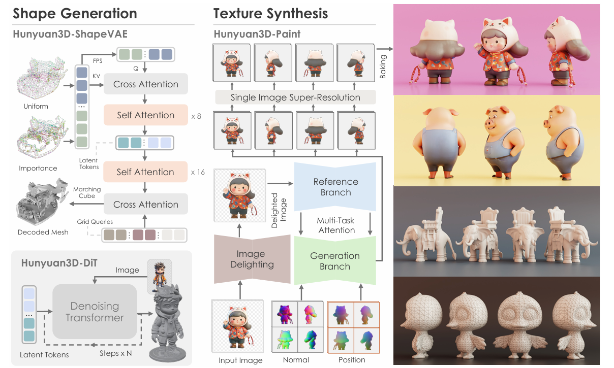

Figure 2: An overall of Hunyuan3D 2.0 architecture for 3D generation. It consists of two main components: Hunyuan3D-DiT for generating bare mesh from a given input image and Hunyuan3D Paint for generating a textured map for the generated bare mesh. Hunyuan3D-Paint takes geometry conditions– normal maps and position maps of generated mesh as inputs and generates multi-view images for texture baking.

## 3.3D Shape Generation

Specifically, our shape generation model consists of (1) an autoencoder Hunyuan3D-ShapeVAE (Sec. 3.1) that compresses the shape of a 3D asset represented by polygon mesh into a sequence of continuous tokens in the latent space; (2) a flow-based diffusion model Hunyuan3D-DiT (Sec. 3.2), trained on the latent space of ShapeVAE for predicting object token sequences from a user-provided image. The predicted tokens are further decoded into a polygon mesh with VAE decoder. 

也就是说，是使用Hunyuan3D-ShapeVAE把3D 资产（使用polygon mesh）压缩到latent space的sequence，然后有一个flow-based diffusion 模型（Hunyuan3D-DiT），在ShapeVAE的latent space上做训练，用于通过用户提供的图片来预测object token sequences。VAE decoder会负责将预测的tokens解码成多边形mesh。

### （1）Hunyuan3D——ShapeVAE

> 个人理解：这里的VAE应该指的是，我们比较需要这里的解码器decoder，这样后面拿到object token sequences（这个是网络predict的东西）。VAE decoder会负责将预测的tokens解码成多边形mesh。

Hunyuan3D-ShapeVAE采用了3DShape2VecSet[111]提出的新型3D形状神经表征——向量集（vector sets），该表征方式近期也被Dora[11]研究所采用。延续Michelangelo[118]的方案，我们使用变分编解码Transformer进行形状压缩与重建。具体实现中，编码器以从3D形状表面采样的点云三维坐标及法向量作为输入，解码器则被设计为预测3D形状的有向距离函数（Signed Distance Function, SDF），该函数可通过marching cube 算法进一步解码为三角网格。整体网络架构如图3所示。

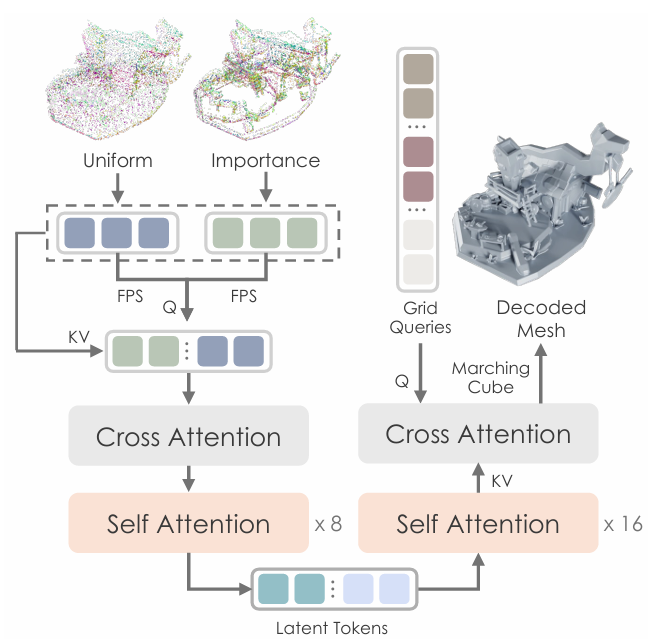

关于上图当中的latent tokens，论文是这么描述的：

> Pioneering methods such as 3DShape2VecSet [111], Michelangelo [118], CLAY [113], and Dora [11] represent 3D shapes using vector sets (one-dimensional latent token sequences proposed by 3DShape2VecSet [111]), significantly improving representation efficiency. Another approach involves structured representations (e.g., triplane [68, 7, 26] or sparse volume [63, 119, 72]) to encode 3D shapes, which better preserve spatial priors but are less efficient than vector sets. Inspired by recent advances in Latent Diffusion Models, Hunyuan3D 2.0 employs vector sets to represent 3D shapes’ implicit functions, alleviating the compression and fitting demands on neural networks and achieving a breakthrough in shape generation performance.

#### 前置知识——复习Attention&Cross Attention究竟是什么？

比较推荐阅读的文章：https://zhuanlan.zhihu.com/p/648248676

> ### 不同点：
>
> **Self Attention:** 查询、键和值都来自同一个输入序列。这使得模型能够关注输入序列中的其他部分以产生一个位置的输出。主要目的是捕捉输入序列内部的依赖关系。在Transformer的编码器（Encoder）和解码器（Decoder）的每一层都有自注意力。它允许输入序列的每个部分关注序列中的其他部分。
>
> **Cross Attention:** 查询来自一个输入序列，而键和值来自另一个输入序列。这在诸如序列到序列模型（如机器翻译）中很常见，其中一个序列需要“关注”另一个序列。目的是使一个序列能够关注另一个不同的序列。主要出现在Transformer的解码器。它允许解码器关注编码器的输出，这在机器翻译等任务中尤为重要。
>
> 总的来说，自注意力和交叉注意力都是基于相同的核心机制，但它们的应用和目的有所不同。自注意力旨在处理单一序列内部的关系，而交叉注意力则旨在处理两个不同序列之间的关系。

实际上Cross Attention是使用Encoder产生k和v向量，使用Decoder产生query（q）向量，来计算attention的操作，得到的结果会进一步输入后面的全连接神经网络中。

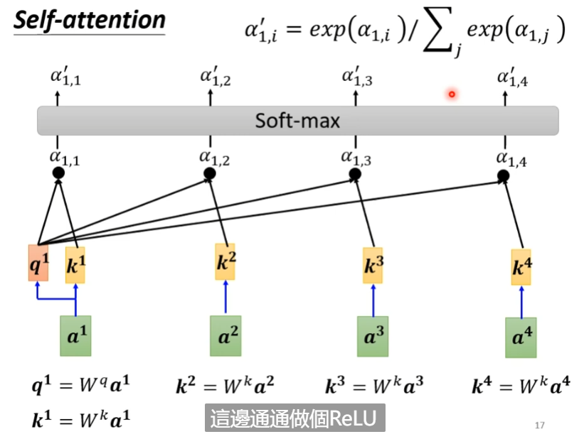

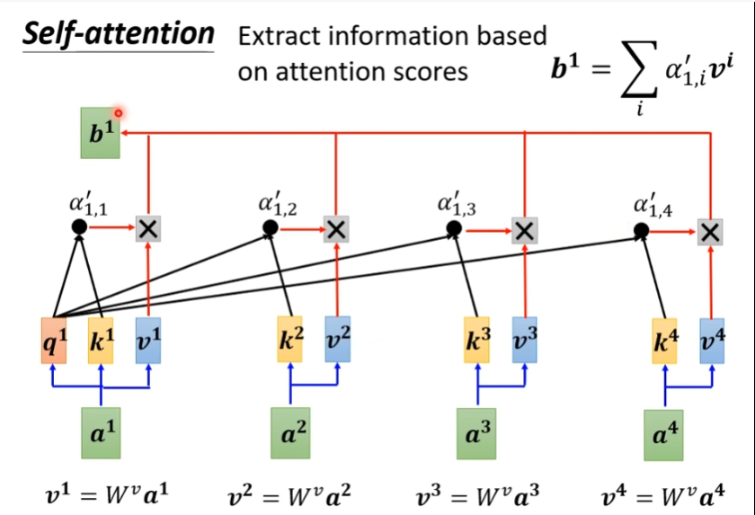

看上图，每个向量分量还要用$W_v$矩阵变成一个v向量，然后把每个v向量与attention score做加权求和，得到一个b向量，可以想到如果attention score越大（假设x向量的attention score非常大），那么b向量就会非常接近于x向量。

> 三种Attention的学习：https://www.53ai.com/news/qianyanjishu/1079.html

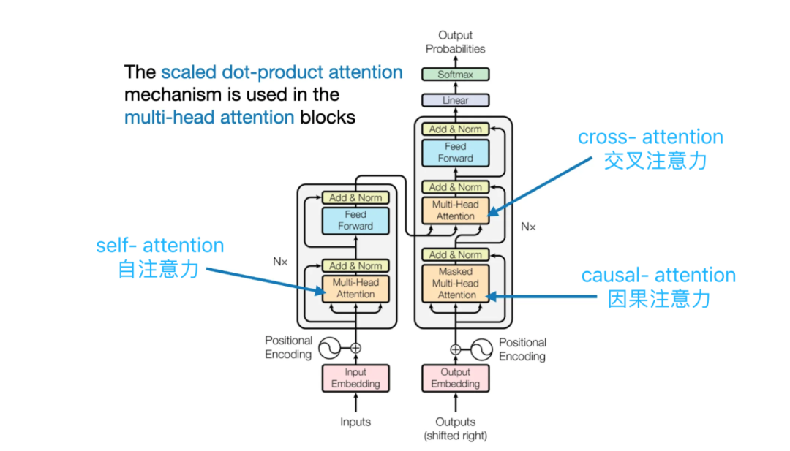

- Self Attention（自注意力）：对同一个序列，通过缩放点积注意力计算注意力分数，最终对值向量进行加权求和，从而得到输入序列中每个位置的加权表示。

  ==表达的是一种注意力机制，如何使用缩放点积注意力对同一个序列计算注意力分数，从而得到同一序列中每个位置的注意力权重。==

- Multi-Head Attention（多头注意力）：多个注意力头并行运行，每个头都会独立地计算注意力权重和输出，然后将所有头的输出拼接起来得到最终的输出。强调的是一种实操方法，实际操作中我们并不会使用单个维度来执行单一的注意力函数，而是通过h=8个头分别计算，然后加权平均。这样为了避免单个计算的误差。

- Cross Attention（交叉注意力）：==输入来自两个不同的序列，一个序列用作查询（Q），另一个序列提供键（K）和值（V），实现跨序列的交互。==

------

#### 前置知识——3DShape2VecSet[111]这篇文章的工作

看一下这个视频：[【SIGGRAPH 2023】3DShape2VecSet：面向神经场和生成扩散模型的 3D 形状表示_哔哩哔哩_bilibili](https://www.bilibili.com/video/BV1WP411d777/?spm_id_from=333.337.search-card.all.click&vd_source=f0e5ebbc6d14fe7f10f6a52debc41c99)

相关的解读可以看一下这篇：https://blog.csdn.net/skyxya/article/details/139419071

**对Cross Attention的理解：https://blog.csdn.net/MengYa_Dream/article/details/126688503**

> **3DShape2VecSet 是什么？**  
> 简单来说，这篇论文提出了一种新的3D形状表示方法（可以理解为“如何用计算机更高效地描述3D物体的几何结构”），专门为神经场（Neural Fields）和扩散模型（Diffusion Models）设计，目标是让AI生成3D模型更高效、更精准。
>
> ---
>
> ### **核心创新点**
> 1. **用“向量集”代替传统表示方法**  
>    - 传统方法常用体素（Voxel）、点云（Point Cloud）或多边形网格（Mesh）表示3D形状，但这些方式要么太占内存，要么难以处理细节。  
>    - 3DShape2VecSet提出用**一组紧凑的向量（Vector Set）**编码3D形状，就像用几个关键数学公式概括一个复杂物体，大大减少了数据量。
>
> 2. **为AI生成优化**  
>    - 这种表示法天生适合神经场（比如SDF、NeRF这类AI模型），能直接输入到扩散模型中生成3D形状，避免了传统方法中复杂的格式转换。
>
> 3. **细节保留能力强**  
>    - 实验显示，即使压缩成低维向量，也能还原出高精度的3D模型（比如复杂的家具、机械零件），而传统方法压缩后会丢失锐利边缘或细小结构。
>
> ---
>
> ### **突出优势**
> ✅ **高效**：向量集比网格或点云更轻量，训练和生成速度更快。  
> ✅ **质量高**：生成的3D模型细节更丰富（比如锐利的边角、光滑的曲面）。  
> ✅ **兼容性强**：直接适配扩散模型，简化了3D生成AI的流程。
>
> ---
>
> ### **对3D资产生成的指导意义**
> 1. **加速生成流程**  
>    - 游戏/影视中需要大量3D资产，这种表示法能让AI快速生成可用的基础模型，减少人工建模时间。
>
> 2. **提升生成质量**  
>    - 尤其适合需要精细结构的场景（比如工业设计、高精度角色模型），避免传统方法生成的“模糊”或“破碎”问题。
>
> 3. **推动开源生态**  
>    - 类似Stable Diffusion对2D图像的推动，这种表示法为开源3D生成模型（比如Hunyuan3D）提供了更优的基础架构。
>
> ---
>
> ### **举个实际例子**
> 假设你想用AI生成一把“赛博朋克风格椅子”：  
> - **传统方法**：AI生成的点云可能缺失椅背的镂空花纹，或者网格出现破洞。  
> - **用3DShape2VecSet**：AI通过向量集生成的结果会更完整，花纹和金属质感都能保留，后期人工调整更省力。
>
> 这篇工作可以说是“让AI生成3D模型更像专业设计师的手笔”，而不仅是粗糙的初稿。

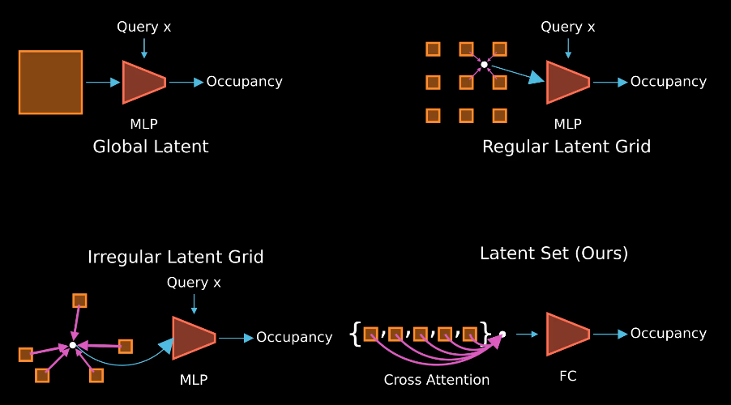

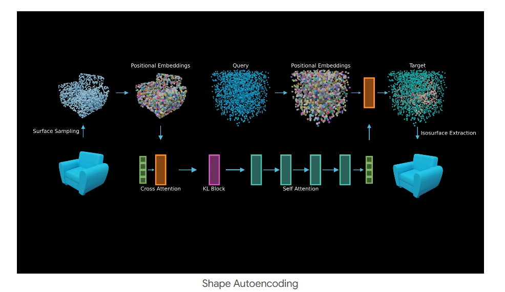

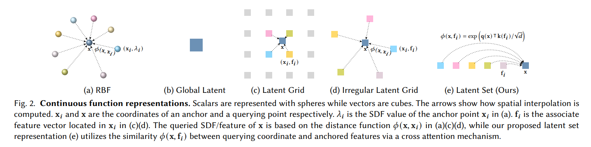

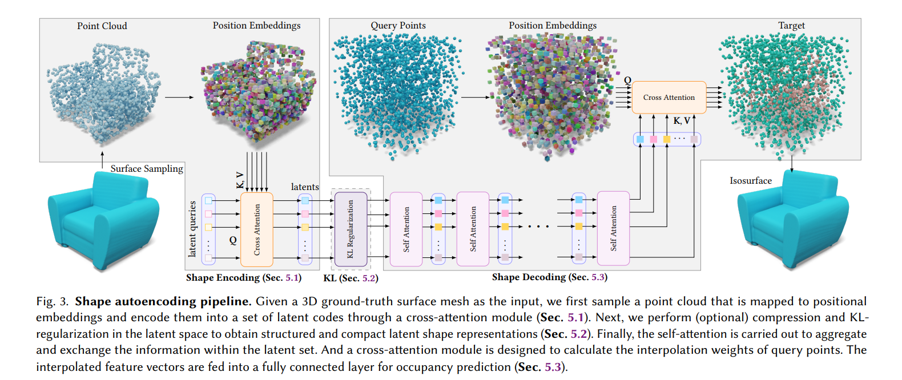

#### 前置知识——Michelangelo

#### 前置知识——FPS

可以阅读：https://zhuanlan.zhihu.com/p/556648481

> ### **1. FPS 的核心思想**
>
> FPS 是一种迭代采样算法，**目标是从点云中选取一组尽可能覆盖原始点云空间分布的“代表性”点**。其核心思想是：
> **每次选择当前已选点集中最远的点**，从而保证采样点均匀分布，避免局部聚集。
>
> #### **直观理解**
>
> 想象在沙漠中放置多个加油站，如何选址才能让所有车辆都能就近加油？
> FPS 的策略是：
>
> 1. 第一个加油站随机选（或选中心点）。
> 2. 下一个加油站选离已有加油站最远的位置。
> 3. 重复直到加油站数量达标。

==这个算法还是比较巧妙的，需要掌握一下。==

#### （a） Importance Sampled Point-Query Encoder. 

编码器$\xi_s$旨在提取表征3D形状的特征向量。为实现这一目标，我们**首先设计了基于注意力机制的编码器**，用于处理从3D形状表面均匀采样的点云数据。然而，该方案在复杂物体细节重建方面存在不足。我们认为这一困难源于形状表面不同区域的复杂度差异。因此，除均匀采样的点云外，我们额外设计了==重要性采样方法*==，==通过在网格边缘和角点区域进行密集采样，为描述复杂区域提供更完整的信息支撑。==

以下说明一下重要性采样的细节：

对于输入的mesh而言，大致的步骤如下：

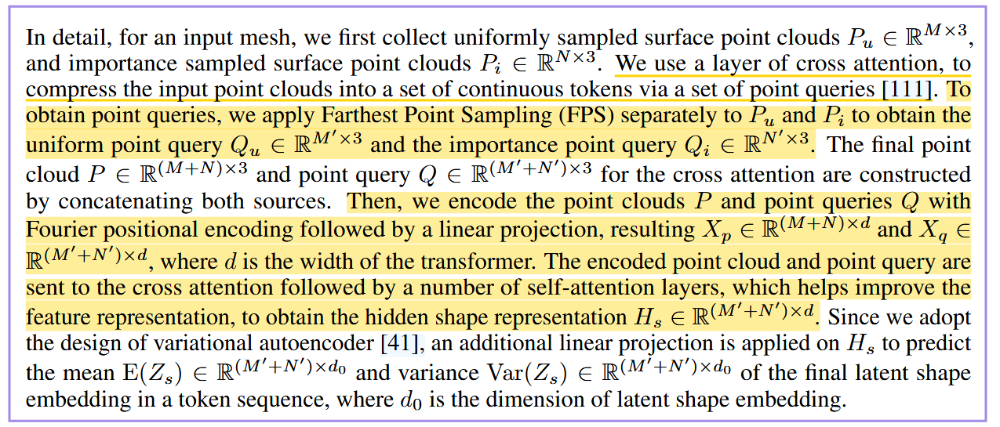

以下是具体一些的解释：

> 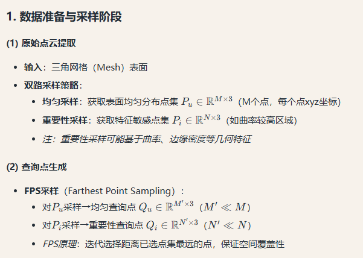
>
> 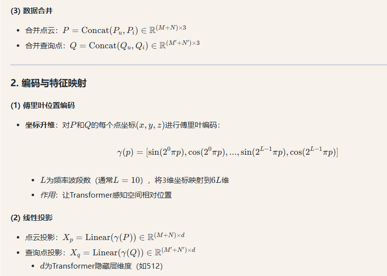
>
> 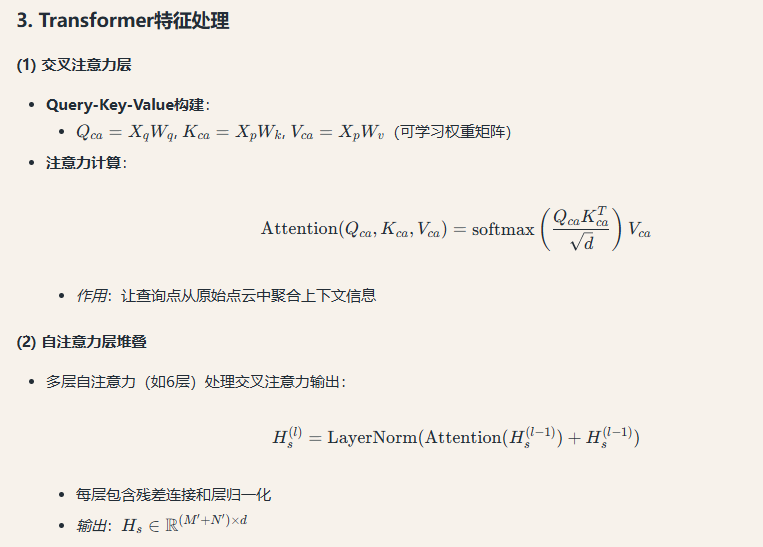

> ---
>
> ### **核心机制修正与补充说明**
> #### 1. **双路采样的真实作用**
> - **Uniform采样（\(P_u\)）**：保证对整体几何形状的基础覆盖，防止遗漏平坦区域。
> - **Importance采样（\(P_i\)）**：强化特征区域（如鼻尖、眼角）的表示，但**不是直接指导VAE关注重点**，而是通过后续的**查询点筛选机制**间接实现。
>
> #### 2. **FPS查询点的核心功能**
> - **压缩与聚焦**：FPS对\(P_u\)和\(P_i\)分别采样得到\(Q_u\)和\(Q_i\)，本质是：
>   - 从均匀点云中选取**空间代表性**的锚点（\(Q_u\)）
>   - 从重要性点云中锁定**特征密集区**的锚点（\(Q_i\)）
> - **关键点**：最终合并的查询点\(Q\)中，\(Q_i\)占比越高，模型对细节区域的关注度越高（需通过实验调整\(N'/M'\)比例）。
>
> #### 3. **Cross-Attention的动态权重分配**
> - **查询（\(Q\)）作为引导者**：每个查询点通过注意力机制从原始点云\(P\)中**自适应聚合信息**。
>   - 若某\(Q_i\)（来自重要性区域）与\(P_i\)中的点具有高注意力权重，则强化该区域特征。
>   - *注意*：这是数据驱动的过程，非人工预设重要性。
>
> #### 4. **VAE的潜在空间特性**
> - **潜变量\(Z_s\)的物理意义**：每个token对应一个查询点的**局部形状描述**：
>   - 高方差区域（\(Var(Z_s)\)大）→ 模型认为该位置形状可变性强（通常是细节区域）
>   - 低方差区域 → 形状稳定（如脸颊平坦处）
>
> ---
>
> ### **流程的数学本质（修正版）**
> 1. **特征筛选阶段**  
>    $$
>    \underbrace{P_u, P_i}_{\text{原始数据}} \xrightarrow{\text{FPS筛选}} \underbrace{Q_u, Q_i}_{\text{控制关注点}} \xrightarrow{\text{Cross-Attn}} \underbrace{H_s}_{\text{特征强化表示}}
>    $$
>    
>    - 通过\(Q_i\)的分布引导模型关注重要区域，但具体关注程度由注意力权重动态决定。
>    
> 2. **概率建模阶段**  
>    $$
>    H_s \xrightarrow{\text{VAE头}} \underbrace{Z_s}_{\text{概率化表示}} \sim \mathcal{N}(E(Z_s), Var(Z_s))
>    $$
>    
>    - 方差项\(Var(Z_s)\)会**自动学习**到细节区域需要更大的变化空间。
>
> ---
>
> ### **常见误解澄清**
> | 你的理解                  | 实际情况                                 | 说明                                   |
> | ------------------------- | ---------------------------------------- | -------------------------------------- |
> | "VAE直接关注重要部分"     | VAE通过查询点分布间接影响关注区域        | 重要性由FPS和注意力机制共同决定        |
> | "重要性采样点直接输入VAE" | 重要性点仅用于生成查询点                 | 原始点云\(P\)才是注意力Key/Value的来源 |
> | "傅里叶编码负责细节保留"  | 编码仅提供空间感知，细节保留靠注意力机制 | 高频编码≠细节保留                      |
>
> ---
>
> ### **技术动机总结**
> 1. **双路采样**：解决传统均匀采样对细节不敏感的问题（如Mesh R-CNN仅用均匀采样）。
> 2. **FPS查询点**：降低计算量同时保持空间覆盖性（对比PointNet++的ball query）。
> 3. **Cross-Attn设计**：让模型自行学习"哪些区域的细节需要重点保留"（可解释性强于纯卷积方法）。
> 4. **VAE输出**：为下游任务（如细节编辑）提供概率化操作空间。
>
> ---
>
> ### **实验设计建议**
> 若要验证"模型是否真的关注了细节"，可：
> 1. **可视化注意力权重**：检查\(Q_i\)对应的注意力是否集中在高曲率区域。
> 2. **消融实验**：
>    - 仅用\(P_u\)（无重要性采样）→ 观察细节生成质量下降程度
>    - 调整\(N'/M'\)比例 → 分析细节保留与计算效率的trade-off
>
> 这种设计本质上是通过**数据预处理（双路采样）**和**模型结构（查询点+注意力）**的协同，实现细节敏感的形状表示学习。你的研究方向（人脸细节生成）可直接借鉴该框架，只需将重要性采样标准改为面部关键点密度即可。

#### （b）Decoder、Training Strategy & Implementation

暂时先不整理了，==有点没看懂==，到时候跟代码阅读看看吧。

### （2）Hunyuan3D-DiT

Hunyuan3D-DiT is a flow-based diffusion model aimed at producing high-fidelity and high-resolution 3D shapes according to given image prompts.

#### 前置知识——DiT

这里参考的视频：

https://www.youtube.com/watch?v=aSLDXdc2hkk
