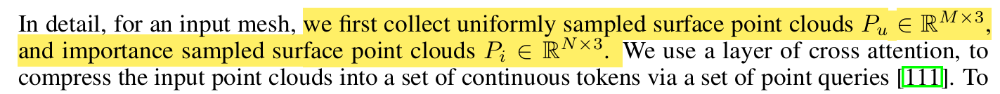

# 3DAIGC——3D Assets生成相关

# 论文：hunyuan 2.0

论文链接：[2501.12202](https://arxiv.org/pdf/2501.12202)

# 一、文章阅读

## 1.Abstract & Introduction

### （1）Abstract

我们推出Hunyuan3D 2.0——一个先进的大规模三维合成系统，能够生成高分辨率带纹理的3D资产。该系统包含两大核心组件：基于大规模形状生成模型Hunyuan3D-DiT，以及大规模纹理合成模型Hunyuan3D-Paint。其中，形状生成模型建立在scalable flow-based diffusion transformer架构上，专注于生成与给定条件图像精准对齐的几何结构，为下游应用奠定坚实基础；纹理合成模型则依托强大的几何先验与扩散先验（strong geometric and diffusion priors），能为生成模型输出或手工制作的网格模型生成高分辨率、色彩生动的纹理贴图。

此外，我们开发了多功能用户友好型生产平台Hunyuan3D-Studio，该平台显著简化了3D资产的重建流程，使专业用户与业余爱好者都能高效编辑网格模型甚至制作动画。通过系统化评估，我们证明Hunyuan3D 2.0在几何细节、条件对齐、纹理质量等维度均超越此前最先进的模型（包括开源与闭源方案）。为填补开源3D社区在大规模基础生成模型领域的空白，我们正式公开Hunyuan3D 2.0，相关代码与预训练权重已发布于：https://github.com/Tencent/Hunyuan3D-2

### （2）Introduction

尽管自动化3D生成至关重要，且扩散模型的兴起推动了图像与视频生成的快速发展[33,74,24,50,43]，但3D生成领域在大模型与大数据时代的发展却相对滞后，仅有`3DShape2Vectset[111]、Michelangelo[118]和CLAY[113]`等少数研究取得渐进式突破。其中`CLAY首次展现了扩散模型在3D资产生成中的革命性潜力`。但正如其他领域发展规律所示[114,4,3]，一个领域的繁荣通常依赖于强大的开源基础模型——如图像生成的Stable Diffusion[74,69,24]、语言模型的LLaMA[90,91,22]和视频生成的HunyuanVideo[43]。为此，我们推出搭载双开源基础模型的3D资产创作系统Hunyuan3D 2.0：`包含生成式形状建模器Hunyuan3D-DiT与生成式纹理合成器Hunyuan3D-Paint`。

Hunyuan3D 2.0采用两阶段生成架构：**首先生成基础网格模型，随后合成对应纹理贴图**。该策略有效解耦形状与纹理生成的难度[34,106,46,47]，并能灵活适配生成网格与手工建模网格的纹理贴图需求。在此架构下，我们的形状生成模型Hunyuan3D-DiT设计为基于流匹配的大规模扩散模型(scalable flow-based diffusion transformer)——**首先通过网格表面重要性采样和变长token等先进技术训练自编码器Hunyuan3D-ShapeVAE以捕捉网格细粒度特征，随后在VAE潜空间构建双单流Transformer[45]并采用流匹配目标函数[53,24]。纹理生成模型Hunyuan3D-Paint则创新性地采用网格条件多视角生成管线，结合多项预处理与多视角图像烘焙技术生成高分辨率纹理贴图。**

> 论文中的原文：
>
> As a prerequisite, we first train an autoencoder– Hunyuan3D-ShapeVAE using advanced techniques such as mesh surface importance sampling and variational token length to capture fine-grained details on the meshes. Then, we build up a dual-single stream transformer [45] on the latent space of our VAE with the flow-matching [53, 24] objective.
>
> Our texture generation model– Hunyuan3D-Paint is made of a novel mesh-conditioned multi-view generation pipeline and a number of sophisticated techniques for preprocessing and baking multi-view images into high-resolution texture maps.

我们对Hunyuan3D 2.0与全球领先的3D生成模型进行了系统对比，包括三款商业闭源端到端产品、开源端到端模型Trellis[100]以及多款独立形状/纹理生成模型[9,37,98,110,55,59]。评估涵盖带纹理网格、基础网格和纹理贴图三个维度，同时开展50名参与者对300个测试案例的用户调研。结果表明，Hunyuan3D 2.0在条件图像-网格对齐精度、细部特征生成质量以及人类偏好度等方面均展现出显著优势。

## 2. 2.0的Architecture

Figure 2: An overall of Hunyuan3D 2.0 architecture for 3D generation. It consists of two main components: Hunyuan3D-DiT for generating bare mesh from a given input image and Hunyuan3D Paint for generating a textured map for the generated bare mesh. Hunyuan3D-Paint takes geometry conditions– normal maps and position maps of generated mesh as inputs and generates multi-view images for texture baking.

## 3.3D Shape Generation

Specifically, our shape generation model consists of (1) an autoencoder Hunyuan3D-ShapeVAE (Sec. 3.1) that compresses the shape of a 3D asset represented by polygon mesh into a sequence of continuous tokens in the latent space; (2) a flow-based diffusion model Hunyuan3D-DiT (Sec. 3.2), trained on the latent space of ShapeVAE for predicting object token sequences from a user-provided image. The predicted tokens are further decoded into a polygon mesh with VAE decoder. 

也就是说，是使用Hunyuan3D-ShapeVAE把3D 资产（使用polygon mesh）压缩到latent space的sequence，然后有一个flow-based diffusion 模型（Hunyuan3D-DiT），在ShapeVAE的latent space上做训练，用于通过用户提供的图片来预测object token sequences。VAE decoder会负责将预测的tokens解码成多边形mesh。

### （1）Hunyuan3D——ShapeVAE

> 个人理解：这里的VAE应该指的是，我们比较需要这里的解码器decoder，这样后面拿到object token sequences（这个是网络predict的东西）。VAE decoder会负责将预测的tokens解码成多边形mesh。

Hunyuan3D-ShapeVAE采用了3DShape2VecSet[111]提出的新型3D形状神经表征——向量集（vector sets），该表征方式近期也被Dora[11]研究所采用。延续Michelangelo[118]的方案，我们使用变分编解码Transformer进行形状压缩与重建。具体实现中，编码器以从3D形状表面采样的点云三维坐标及法向量作为输入，解码器则被设计为预测3D形状的有向距离函数（Signed Distance Function, SDF），该函数可通过marching cube 算法进一步解码为三角网格。整体网络架构如图3所示。

#### 前置知识——3DShape2VecSet[111]这篇文章的工作

看一下这个视频：[【SIGGRAPH 2023】3DShape2VecSet：面向神经场和生成扩散模型的 3D 形状表示_哔哩哔哩_bilibili](https://www.bilibili.com/video/BV1WP411d777/?spm_id_from=333.337.search-card.all.click&vd_source=f0e5ebbc6d14fe7f10f6a52debc41c99)

> **3DShape2VecSet 是什么？**  
> 简单来说，这篇论文提出了一种新的3D形状表示方法（可以理解为“如何用计算机更高效地描述3D物体的几何结构”），专门为神经场（Neural Fields）和扩散模型（Diffusion Models）设计，目标是让AI生成3D模型更高效、更精准。
>
> ---
>
> ### **核心创新点**
> 1. **用“向量集”代替传统表示方法**  
>    - 传统方法常用体素（Voxel）、点云（Point Cloud）或多边形网格（Mesh）表示3D形状，但这些方式要么太占内存，要么难以处理细节。  
>    - 3DShape2VecSet提出用**一组紧凑的向量（Vector Set）**编码3D形状，就像用几个关键数学公式概括一个复杂物体，大大减少了数据量。
>
> 2. **为AI生成优化**  
>    - 这种表示法天生适合神经场（比如SDF、NeRF这类AI模型），能直接输入到扩散模型中生成3D形状，避免了传统方法中复杂的格式转换。
>
> 3. **细节保留能力强**  
>    - 实验显示，即使压缩成低维向量，也能还原出高精度的3D模型（比如复杂的家具、机械零件），而传统方法压缩后会丢失锐利边缘或细小结构。
>
> ---
>
> ### **突出优势**
> ✅ **高效**：向量集比网格或点云更轻量，训练和生成速度更快。  
> ✅ **质量高**：生成的3D模型细节更丰富（比如锐利的边角、光滑的曲面）。  
> ✅ **兼容性强**：直接适配扩散模型，简化了3D生成AI的流程。
>
> ---
>
> ### **对3D资产生成的指导意义**
> 1. **加速生成流程**  
>    - 游戏/影视中需要大量3D资产，这种表示法能让AI快速生成可用的基础模型，减少人工建模时间。
>
> 2. **提升生成质量**  
>    - 尤其适合需要精细结构的场景（比如工业设计、高精度角色模型），避免传统方法生成的“模糊”或“破碎”问题。
>
> 3. **推动开源生态**  
>    - 类似Stable Diffusion对2D图像的推动，这种表示法为开源3D生成模型（比如Hunyuan3D）提供了更优的基础架构。
>
> ---
>
> ### **举个实际例子**
> 假设你想用AI生成一把“赛博朋克风格椅子”：  
> - **传统方法**：AI生成的点云可能缺失椅背的镂空花纹，或者网格出现破洞。  
> - **用3DShape2VecSet**：AI通过向量集生成的结果会更完整，花纹和金属质感都能保留，后期人工调整更省力。
>
> 这篇工作可以说是“让AI生成3D模型更像专业设计师的手笔”，而不仅是粗糙的初稿。

#### （a） Importance Sampled Point-Query Encoder. 

编码器$\xi_s$旨在提取表征3D形状的特征向量。为实现这一目标，我们**首先设计了基于注意力机制的编码器**，用于处理从3D形状表面均匀采样的点云数据。然而，该方案在复杂物体细节重建方面存在不足。我们认为这一困难源于形状表面不同区域的复杂度差异。因此，除均匀采样的点云外，我们额外设计了==重要性采样方法*==，==通过在网格边缘和角点区域进行密集采样，为描述复杂区域提供更完整的信息支撑。==

以下说明一下重要性采样的细节：

对于输入的mesh而言，第一步如下：

