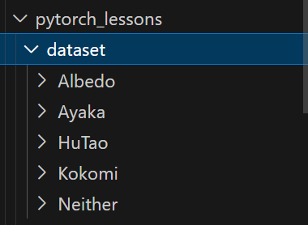

# Pytorch 数据集准备+CNN训练

这个笔记主要用来记录在Pytorch中如何处理自己的数据集，并且用一个简单的CNN网络做分类任务。使用的数据集是https://www.kaggle.com/datasets/just1ce5/genshin-impact-characters-dataset?resource=download，仅作测试使用。


# 一、准备数据集

这里的dataset的结构如下：



手动在dataset里面加一个train和test的路径，然后把这几个子文件夹先放到train里面。也就是说比如dataset/train/albedo这种。


## 1.一些准备的函数

### （1）walk_through_dir

```python
def walk_through_dir(dir_path):
    for dirpath, dirnames, filenames in os.walk(dir_path):
        print(f"There are {len(dirnames)} directories and {len(filenames)} images in '{dirpath}'.")

print(torch.__version__)
image_path = Path("dataset/")
device = torch.device('cuda' if torch.cuda.is_available() else 'cpu')
print(device)
walk_through_dir(image_path)

train_dir = image_path / "train"
test_dir = image_path / "test"
```


### （2）可视化一张图

```python
def visualize_image(image_path):
    image_path_list = list(image_path.glob("*/*/*.jpg"))  # 500
    print(f"Total images: {len(image_path_list)}")
    random_image_path = random.choice(image_path_list)
    image_class = random_image_path.parent.stem 
    img = Image.open(random_image_path)
    print(f"Image path: {random_image_path}")  # e.g.dataset/train/Neither/22.jpg
    print(f"Image class: {image_class}")
    print(f"Image shape: {img.size}")
    # img.show()

    # use matplotlib to show the image
    # img_as_array = np.asarray(img)
    # plt.figure(figsize=(10, 7))
    # plt.imshow(img_as_array)
    # plt.axis(False)
    # plt.show()
    # 保存图像到visualize_image文件夹
    img.save("visualize_image/random_image.jpg")  # 如果是linux，不好可视化，直接存起来看
```


### （3）Transforming data

```python
data_transform = transforms.Compose([
    transforms.Resize((64, 64)),
    transforms.RandomHorizontalFlip(p=0.5),
    transforms.ToTensor(),
])

def plot_transformed_images(image_path, transform, n=3, seed=32):
    random.seed(seed)
    random_image_paths = random.sample(list(image_path.glob("*/*/*.jpg")), k=n)
    # 写入visualize_image文件夹，原图命名为original_{n}.jpg, transform后的图像命名为transformed_{n}.jpg
    for i, image_path in enumerate(random_image_paths):
        img = Image.open(image_path)
        transformed_img = transform(img)  # torch.Size([3, 64, 64])
        print(transformed_img.shape)
        img.save(f"visualize_image/original_{i}.jpg")
        transformed_img = transforms.ToPILImage()(transformed_img)
        transformed_img.save(f"visualize_image/transformed_{i}.jpg")
```


## 2.ImageFolder

```python
def debug_train_data_and_test_data(train_data, test_data):
    print(f"Train data classes: {train_data.classes}")
    print(f"class to index mapping: {train_data.class_to_idx}")
    print(train_data)
    print(test_data)
    # Test data: 5
    # Train data classes: ['Albedo', 'Ayaka', 'HuTao', 'Kokomi', 'Neither']
    # class to index mapping: {'Albedo': 0, 'Ayaka': 1, 'HuTao': 2, 'Kokomi': 3, 'Neither': 4}
train_data = datasets.ImageFolder(root=train_dir, transform=data_transform, target_transform=None) # target_transform指的是对label的处理，这里不用处理
test_data = datasets.ImageFolder(root=test_dir, transform=data_transform)
print(f"Train data: {len(train_data)}")
print(f"Test data: {len(test_data)}")
debug_train_data_and_test_data(train_data, test_data)
```

此时就相当于我们已经拿到了所有的train和test的数据。其实也可以自定义CustomDataset，继承于Pytorch的Dataset类，具体的可以参考这个链接https://www.learnpytorch.io/04_pytorch_custom_datasets/的5.Option 2部分，不过这里我们的数据集已经做好了文件夹分类了，就先不尝试这种方法了，后面遇到问题会再来补充。两种方法的对比如下：

| **4. Loading data with `ImageFolder` (option 1)** | PyTorch has many in-built data loading functions for common types of data. `ImageFolder` is helpful if our images are in standard image classification format. |
| ------------------------------------------------- | ------------------------------------------------------------ |
| **5. Loading image data with a custom `Dataset`** | What if PyTorch didn't have an in-built function to load data with? This is where we can build our own custom subclass of `torch.utils.data.Dataset`. |


## 3.DataLoader

```python
train_loader = DataLoader(dataset=train_data, batch_size=1, shuffle=True)
test_loader = DataLoader(dataset=test_data, batch_size=1, shuffle=False)
img, label = next(iter(train_loader))
print(img.shape, label)  # torch.Size([1, 3, 64, 64]) tensor([2]), 2是因为我们做了shuffle
```


# 二、Model——TinyVGG

```python
class TinyVGG(nn.Module):
    def __init__(self, in_channels, num_classes, hidden_units):
        super().__init__()
        # [batch_size, 3, 64, 64]->[batch_size, hidden_units, 32, 32]
        self.conv_block_1 = nn.Sequential(
            nn.Conv2d(in_channels, hidden_units, kernel_size=3, stride=1, padding=1), 
            nn.ReLU(),
            nn.Conv2d(hidden_units, hidden_units, kernel_size=3, stride=1, padding=1),
            nn.ReLU(),
            nn.MaxPool2d(kernel_size=2, stride=2)
        )
        # [batch_size, hidden_units, 32, 32]->[batch_size, hidden_units, 16, 16]
        self.conv_block_2 = nn.Sequential(
            nn.Conv2d(hidden_units, hidden_units, kernel_size=3, padding=1),
            nn.ReLU(),
            nn.Conv2d(hidden_units, hidden_units, kernel_size=3, padding=1),
            nn.ReLU(),
            nn.MaxPool2d(kernel_size=2)
        )
        self.classifier = nn.Sequential(
            nn.Flatten(),
            nn.Linear(hidden_units*16*16, out_features=num_classes),
        )
    
    def forward(self, x):
        x = self.conv_block_1(x)
        x = self.conv_block_2(x)
        x = self.classifier(x)
        return x
    
torch.manual_seed(42)
model = TinyVGG(in_channels=3, num_classes=len(train_data.classes), hidden_units=32).to(device)
```

> TinyVGG(
>   (conv_block_1): Sequential(
>     (0): Conv2d(3, 32, kernel_size=(3, 3), stride=(1, 1), padding=(1, 1))
>     (1): ReLU()
>     (2): Conv2d(32, 32, kernel_size=(3, 3), stride=(1, 1), padding=(1, 1))
>     (3): ReLU()
>     (4): MaxPool2d(kernel_size=2, stride=2, padding=0, dilation=1, ceil_mode=False)
>   )
>   (conv_block_2): Sequential(
>     (0): Conv2d(32, 32, kernel_size=(3, 3), stride=(1, 1), padding=(1, 1))
>     (1): ReLU()
>     (2): Conv2d(32, 32, kernel_size=(3, 3), stride=(1, 1), padding=(1, 1))
>     (3): ReLU()
>     (4): MaxPool2d(kernel_size=2, stride=2, padding=0, dilation=1, ceil_mode=False)
>   )
>   (classifier): Sequential(
>     (0): Flatten(start_dim=1, end_dim=-1)
>     (1): Linear(in_features=8192, out_features=5, bias=True)
>   )
> )


## 1.torchInfo可以得到每一层之后的shape

```python
import torchinfo
from torchinfo import summary
summary(model, input_size=[1, 3, 64, 64])
```

输出的结果如下：

> ```
> ==========================================================================================
> Layer (type:depth-idx)                   Output Shape              Param #
> ==========================================================================================
> TinyVGG                                  [1, 5]                    --
> ├─Sequential: 1-1                        [1, 32, 32, 32]           --
> │    └─Conv2d: 2-1                       [1, 32, 64, 64]           896
> │    └─ReLU: 2-2                         [1, 32, 64, 64]           --
> │    └─Conv2d: 2-3                       [1, 32, 64, 64]           9,248
> │    └─ReLU: 2-4                         [1, 32, 64, 64]           --
> │    └─MaxPool2d: 2-5                    [1, 32, 32, 32]           --
> ├─Sequential: 1-2                        [1, 32, 16, 16]           --
> │    └─Conv2d: 2-6                       [1, 32, 32, 32]           9,248
> │    └─ReLU: 2-7                         [1, 32, 32, 32]           --
> │    └─Conv2d: 2-8                       [1, 32, 32, 32]           9,248
> │    └─ReLU: 2-9                         [1, 32, 32, 32]           --
> │    └─MaxPool2d: 2-10                   [1, 32, 16, 16]           --
> ├─Sequential: 1-3                        [1, 5]                    --
> │    └─Flatten: 2-11                     [1, 8192]                 --
> │    └─Linear: 2-12                      [1, 5]                    40,965
> ==========================================================================================
> Total params: 69,605
> Trainable params: 69,605
> Non-trainable params: 0
> Total mult-adds (M): 60.53
> ==========================================================================================
> Input size (MB): 0.05
> Forward/backward pass size (MB): 2.62
> Params size (MB): 0.28
> Estimated Total Size (MB): 2.95
> ==========================================================================================
> ```

这样确实会让整个网络直观很多。


## 2.train_step

