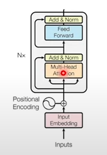

## Stable Diffusion Learn from Scratch

参考视频：[Coding Stable Diffusion from scratch in PyTorch - YouTube](https://www.youtube.com/watch?v=ZBKpAp_6TGI&t=2s)

对应的代码仓库：[pytorch-stable-diffusion/Stable_Diffusion_Diagrams_V2.pdf at main · hkproj/pytorch-stable-diffusion (github.com)](https://github.com/hkproj/pytorch-stable-diffusion/blob/main/Stable_Diffusion_Diagrams_V2.pdf)


首先，看一遍上述youtube视频作者提供的PPT，然后就可以开始书写Stable Diffusion的代码了。这里我们每次提到一个Stable Diffusion的核心框架之后就会标注在Stable Diffusion的官方仓库中的对应位置，方便复习的时候查找。

推荐阅读的Stable Diffusion的架构的入口函数：


## 一、VAE AutoEncoder


补充Convolution Visualizer：[Convolution Visualizer (ezyang.github.io)](https://ezyang.github.io/convolution-visualizer/)

VAE AutoEncoder负责预测出mean和variance，具体的结构可以看这篇加深理解：[【VAE学习笔记】全面通透地理解VAE(Variational Auto Encoder)_vae的作用-CSDN博客](https://blog.csdn.net/a312863063/article/details/87953517)

总的encoder的代码这样写：

### 1.Encoder.py

```python
import torch
from torch import nn
from torch.nn import functional as F
from decoder import VAE_AttentionBlock, VAE_ResidualBlock


class VAE_Encoder(nn.Sequential):
    def __init__(self):
        super().__init__(
            # (Batch_Size, Channel, Height, Width) -> (Batch_Size, 128, Height, Width)
            nn.Conv2d(3, 128, kernel_size=3, padding=1),

            # (Batch_Size, 128, Height, Width) -> (Batch_Size, 128, Height, Width)
            VAE_ResidualBlock(128, 128),

            # (Batch_Size, 128, Height, Width) -> (Batch_Size, 128, Height, Width)
            VAE_ResidualBlock(128, 128),

            # (Batch_Size, 128, Height, Width) -> (Batch_Size, 128, Height / 2, Width / 2)
            nn.Conv2d(128, 128, kernel_size=3, stride=2, padding=0),

            # (Batch_Size, 128, Height / 2, Width / 2) -> (Batch_Size, 256, Height / 2, Width / 2)
            VAE_ResidualBlock(128, 256),

            # (Batch_Size, 256, Height / 2, Width / 2) -> (Batch_Size, 256, Height / 2, Width / 2)
            VAE_ResidualBlock(256, 256),

            # (Batch_Size, 256, Height / 2, Width / 2) -> (Batch_Size, 256, Height / 4, Width / 4)
            nn.Conv2d(256, 256, kernel_size=3, stride=2, padding=0),

            # (Batch_Size, 256, Height / 4, Width / 4) -> (Batch_Size, 512, Height / 4, Width / 4)
            VAE_ResidualBlock(256, 512),

            # (Batch_Size, 512, Height / 4, Width / 4) -> (Batch_Size, 512, Height / 4, Width / 4)
            VAE_ResidualBlock(512, 512),

            # (Batch_Size, 512, Height / 4, Width / 4) -> (Batch_Size, 512, Height / 8, Width / 8)
            nn.Conv2d(512, 512, kernel_size=3, stride=2, padding=0),

            # (Batch_Size, 512, Height / 8, Width / 8) -> (Batch_Size, 512, Height / 8, Width / 8)
            VAE_ResidualBlock(512, 512),

            # (Batch_Size, 512, Height / 8, Width / 8) -> (Batch_Size, 512, Height / 8, Width / 8)
            VAE_ResidualBlock(512, 512),

            # (Batch_Size, 512, Height / 8, Width / 8) -> (Batch_Size, 512, Height / 8, Width / 8)
            VAE_ResidualBlock(512, 512),

            # (Batch_Size, 512, Height / 8, Width / 8) -> (Batch_Size, 512, Height / 8, Width / 8)
            VAE_AttentionBlock(512),  # 应该是全局做self-attention，具体代码见decoder.py

            # (Batch_Size, 512, Height / 8, Width / 8) -> (Batch_Size, 512, Height / 8, Width / 8)
            VAE_ResidualBlock(512, 512),

            # (Batch_Size, 512, Height / 8, Width / 8) -> (Batch_Size, 512, Height / 8, Width / 8)
            nn.GroupNorm(32, 512),

            # (Batch_Size, 512, Height / 8, Width / 8) -> (Batch_Size, 512, Height / 8, Width / 8)
            nn.SiLU(),

            # Because the padding=1, it means the width and height will increase by 2
            # Out_Height = In_Height + Padding_Top + Padding_Bottom
            # Out_Width = In_Width + Padding_Left + Padding_Right
            # Since padding = 1 means Padding_Top = Padding_Bottom = Padding_Left = Padding_Right = 1,
            # Since the Out_Width = In_Width + 2 (same for Out_Height), it will compensate for the Kernel size of 3
            # (Batch_Size, 512, Height / 8, Width / 8) -> (Batch_Size, 8, Height / 8, Width / 8).
            nn.Conv2d(512, 8, kernel_size=3, padding=1),

            # (Batch_Size, 8, Height / 8, Width / 8) -> (Batch_Size, 8, Height / 8, Width / 8)
            nn.Conv2d(8, 8, kernel_size=1, padding=0),
        )

        def forward(self, x, noise):
            # x: (Batch_Size, Channel, Height, Width)
            # noise: (Batch_Size, 4, Height / 8, Width / 8)

            for module in self:
                if getattr(module, 'stride', None) == (2, 2):  # Padding at downsampling should be asymmetric（不对称的） (see #8)
                    # 这里在上面的conv中我们指定padding=0，是为了在这里手动做padding，默认是上下左右对称做padding，这里我们只需要padding右侧和下侧，应该是SD的作者发现这样好用，就直接用了，无解释
                    # Pad: (Padding_Left, Padding_Right, Padding_Top, Padding_Bottom).
                    # Pad with zeros on the right and bottom.
                    # (Batch_Size, Channel, Height, Width) -> (Batch_Size, Channel, Height + Padding_Top + Padding_Bottom, Width + Padding_Left + Padding_Right) = (Batch_Size, Channel, Height + 1, Width + 1)
                    x = F.pad(x, (0, 1, 0, 1))

                x = module(x)

            # (Batch_Size, 8, Height / 8, Width / 8) -> two tensors of shape (Batch_Size, 4, Height / 8, Width / 8)
            mean, log_variance = torch.chunk(x, 2, dim=1)

            # Clamp the log variance between -30 and 20, so that the variance is between (circa) 1e-14 and 1e8.
            # (Batch_Size, 4, Height / 8, Width / 8) -> (Batch_Size, 4, Height / 8, Width / 8)
            log_variance = torch.clamp(log_variance, -30, 20)
            # (Batch_Size, 4, Height / 8, Width / 8) -> (Batch_Size, 4, Height / 8, Width / 8)
            variance = log_variance.exp()
            # (Batch_Size, 4, Height / 8, Width / 8) -> (Batch_Size, 4, Height / 8, Width / 8)
            stdev = variance.sqrt()

            # Transform N(0, 1) -> N(mean, stdev) ，这个是VAE当中提到的reparameterization trick，具体可以看VAE的论文
            # (Batch_Size, 4, Height / 8, Width / 8) -> (Batch_Size, 4, Height / 8, Width / 8)
            x = mean + stdev * noise

            # Scale by a constant， 原SD仓库也是这么做的，不知道为什么乘了这么个数，总之就是这样
            # Constant taken from: https://github.com/CompVis/stable-diffusion/blob/21f890f9da3cfbeaba8e2ac3c425ee9e998d5229/configs/stable-diffusion/v1-inference.yaml#L17C1-L17C1
            x *= 0.18215

            return x
```

现在还有两个网络的结构和代码没有解决，分别是VAE_ResidualBlock以及VAE_AttentionBlock，接下来书写这两个部分。

> VAE AutoEncoder的代码可以参考Stable Diffusion官方仓库中的stable_diffusion/ldm/modules/autoencoder.py


### 2.VAE_ResidualBlock

```python
class VAE_ResidualBlock(nn.Module):
    def __init__(self, in_channels, out_channels):
        super().__init__()
        self.groupnorm_1 = nn.GroupNorm(32, in_channels)
        self.conv_1 = nn.Conv2d(in_channels, out_channels, kernel_size=3, padding=1)

        self.groupnorm_2 = nn.GroupNorm(32, out_channels)
        self.conv_2 = nn.Conv2d(out_channels, out_channels, kernel_size=3, padding=1)

        if in_channels == out_channels:
            self.residual_layer = nn.Identity()
        else:
            self.residual_layer = nn.Conv2d(in_channels, out_channels, kernel_size=1, padding=0)

    def forward(self, x):
        # x: (Batch_Size, In_Channels, Height, Width)

        residue = x

        x = self.groupnorm_1(x)
        x = F.silu(x)
        x = self.conv_1(x)
        x = self.groupnorm_2(x)
        x = F.silu(x)
        x = self.conv_2(x)

        return x + self.residual_layer(residue) # 有可能input和output的channel不一样，所以要加上residue_layer，其实就是bottleneck
```


这里需要复习一下Batch Normalization， Layer Normalization和Group Normalization的区别：


### 3.VAE_AttentionBlock

```python
class VAE_AttentionBlock(nn.Module):
    def __init__(self, channels):
        super().__init__()
        self.groupnorm = nn.GroupNorm(32, channels)
        self.attention = SelfAttention(1, channels)  # 这里的1指的是num_heads，这里是1个head

    def forward(self, x):
        # x: (Batch_Size, Features, Height, Width)

        residue = x

        # (Batch_Size, Features, Height, Width) -> (Batch_Size, Features, Height, Width)
        x = self.groupnorm(x)

        n, c, h, w = x.shape

        # (Batch_Size, Features, Height, Width) -> (Batch_Size, Features, Height * Width)
        x = x.view((n, c, h * w))

        # (Batch_Size, Features, Height * Width) -> (Batch_Size, Height * Width, Features). Each pixel becomes a feature of size "Features", the sequence length is "Height * Width".
        x = x.transpose(-1, -2)

        # Perform self-attention WITHOUT mask
        # (Batch_Size, Height * Width, Features) -> (Batch_Size, Height * Width, Features)
        x = self.attention(x)  # (Batch_Size, Height * Width, Features)是self-attention的输入，其中height*width可以看作是“单词”的数量，而features可以看作是“单词”的维度，这样就跟NLP里的self-attention一样了

        # (Batch_Size, Height * Width, Features) -> (Batch_Size, Features, Height * Width)
        x = x.transpose(-1, -2)

        # (Batch_Size, Features, Height * Width) -> (Batch_Size, Features, Height, Width)
        x = x.view((n, c, h, w))

        # (Batch_Size, Features, Height, Width) + (Batch_Size, Features, Height, Width) -> (Batch_Size, Features, Height, Width)
        x += residue

        # (Batch_Size, Features, Height, Width)
        return x
```

关于SelfAttention的实现，如下（实现使用multi-head）：

```python
# attention.py
import torch
from torch import nn
from torch.nn import functional as F
import math
class SelfAttention(nn.Module):
    def __init__(self, n_heads, d_embed, in_proj_bias=True, out_proj_bias=True):
        super().__init__()
        # This combines the Wq, Wk and Wv matrices into one matrix
        self.in_proj = nn.Linear(d_embed, 3 * d_embed, bias=in_proj_bias) # https://pytorch.org/docs/stable/generated/torch.nn.Linear.html，bias是nn.Linear当中的一个参数，这里默认设置为True
        # This one represents the Wo matrix
        self.out_proj = nn.Linear(d_embed, d_embed, bias=out_proj_bias)
        self.n_heads = n_heads
        self.d_head = d_embed // n_heads

    def forward(self, x, causal_mask=False):
        # x: # (Batch_Size, Seq_Len, Dim)

        # (Batch_Size, Seq_Len, Dim)
        input_shape = x.shape

        # (Batch_Size, Seq_Len, Dim)
        batch_size, sequence_length, d_embed = input_shape

        # (Batch_Size, Seq_Len, H, Dim / H)
        interim_shape = (batch_size, sequence_length, self.n_heads, self.d_head)

        # (Batch_Size, Seq_Len, Dim) -> (Batch_Size, Seq_Len, Dim * 3) -> after chunk function: 3 tensor of shape (Batch_Size, Seq_Len, Dim)
        q, k, v = self.in_proj(x).chunk(3, dim=-1)

        # (Batch_Size, Seq_Len, Dim) -> (Batch_Size, Seq_Len, H, Dim / H) -> after transpose: (Batch_Size, H, Seq_Len, Dim / H)
        q = q.view(interim_shape).transpose(1, 2)
        k = k.view(interim_shape).transpose(1, 2)
        v = v.view(interim_shape).transpose(1, 2)

        # (Batch_Size, H, Seq_Len, Dim) @ (Batch_Size, H, Dim, Seq_Len) -> (Batch_Size, H, Seq_Len, Seq_Len)
        weight = q @ k.transpose(-1, -2)

        if causal_mask: # 在attention矩阵的右上角上-inf的mask，这样做了softmax之后那些部分就会是0了
            # Mask where the upper triangle (above the principal diagonal) is 1
            mask = torch.ones_like(weight, dtype=torch.bool).triu(1)
            # Fill the upper triangle with -inf
            weight.masked_fill_(mask, -torch.inf)

        # Divide by d_k (Dim / H).
        # (Batch_Size, H, Seq_Len, Seq_Len) -> (Batch_Size, H, Seq_Len, Seq_Len)
        weight /= math.sqrt(self.d_head)

        # (Batch_Size, H, Seq_Len, Seq_Len) -> (Batch_Size, H, Seq_Len, Seq_Len)
        weight = F.softmax(weight, dim=-1)

        # (Batch_Size, H, Seq_Len, Seq_Len) @ (Batch_Size, H, Seq_Len, Dim / H) -> (Batch_Size, H, Seq_Len, Dim / H)
        output = weight @ v

        # (Batch_Size, H, Seq_Len, Dim / H) -> (Batch_Size, Seq_Len, H, Dim / H)
        output = output.transpose(1, 2)

        # (Batch_Size, Seq_Len, H, Dim / H) -> (Batch_Size, Seq_Len, Dim)
        output = output.reshape(input_shape)

        # (Batch_Size, Seq_Len, Dim) -> (Batch_Size, Seq_Len, Dim)
        output = self.out_proj(output)

        # (Batch_Size, Seq_Len, Dim)
        return output
```


其中Mask的理解是Q不跟后面的词向量的K做attention，应该是为了防止“提前看到后面的句子”，具体attention矩阵和Mask可以参考这篇文章：[Transformer的矩阵维度分析和Mask详解_transformer mask-CSDN博客](https://blog.csdn.net/qq_35169059/article/details/101678207)


### 4.Decoder.py

Decoder做的事情与Encoder是正好相反的，它会减少channel的数量，但是逐步提高feature map的尺寸。

```python
# decoder.py
class VAE_Decoder(nn.Sequential):
    def __init__(self):
        super().__init__(
            # (Batch_Size, 4, Height / 8, Width / 8) -> (Batch_Size, 4, Height / 8, Width / 8)
            nn.Conv2d(4, 4, kernel_size=1, padding=0),

            # (Batch_Size, 4, Height / 8, Width / 8) -> (Batch_Size, 512, Height / 8, Width / 8)
            nn.Conv2d(4, 512, kernel_size=3, padding=1),
            
            # (Batch_Size, 512, Height / 8, Width / 8) -> (Batch_Size, 512, Height / 8, Width / 8)
            VAE_ResidualBlock(512, 512), 
            
            # (Batch_Size, 512, Height / 8, Width / 8) -> (Batch_Size, 512, Height / 8, Width / 8)
            VAE_AttentionBlock(512), 
            
            # (Batch_Size, 512, Height / 8, Width / 8) -> (Batch_Size, 512, Height / 8, Width / 8)
            VAE_ResidualBlock(512, 512), 
            
            # (Batch_Size, 512, Height / 8, Width / 8) -> (Batch_Size, 512, Height / 8, Width / 8)
            VAE_ResidualBlock(512, 512), 
            
            # (Batch_Size, 512, Height / 8, Width / 8) -> (Batch_Size, 512, Height / 8, Width / 8)
            VAE_ResidualBlock(512, 512), 
            
            # (Batch_Size, 512, Height / 8, Width / 8) -> (Batch_Size, 512, Height / 8, Width / 8)
            VAE_ResidualBlock(512, 512), 
            
            # Repeats the rows and columns of the data by scale_factor (like when you resize an image by doubling its size).
            # (Batch_Size, 512, Height / 8, Width / 8) -> (Batch_Size, 512, Height / 4, Width / 4)
            nn.Upsample(scale_factor=2),
            
            # (Batch_Size, 512, Height / 4, Width / 4) -> (Batch_Size, 512, Height / 4, Width / 4)
            nn.Conv2d(512, 512, kernel_size=3, padding=1), 
            
            # (Batch_Size, 512, Height / 4, Width / 4) -> (Batch_Size, 512, Height / 4, Width / 4)
            VAE_ResidualBlock(512, 512), 
            
            # (Batch_Size, 512, Height / 4, Width / 4) -> (Batch_Size, 512, Height / 4, Width / 4)
            VAE_ResidualBlock(512, 512), 
            
            # (Batch_Size, 512, Height / 4, Width / 4) -> (Batch_Size, 512, Height / 4, Width / 4)
            VAE_ResidualBlock(512, 512), 
            
            # (Batch_Size, 512, Height / 4, Width / 4) -> (Batch_Size, 512, Height / 2, Width / 2)
            nn.Upsample(scale_factor=2), 
            
            # (Batch_Size, 512, Height / 2, Width / 2) -> (Batch_Size, 512, Height / 2, Width / 2)
            nn.Conv2d(512, 512, kernel_size=3, padding=1), 
            
            # (Batch_Size, 512, Height / 2, Width / 2) -> (Batch_Size, 256, Height / 2, Width / 2)
            VAE_ResidualBlock(512, 256), 
            
            # (Batch_Size, 256, Height / 2, Width / 2) -> (Batch_Size, 256, Height / 2, Width / 2)
            VAE_ResidualBlock(256, 256), 
            
            # (Batch_Size, 256, Height / 2, Width / 2) -> (Batch_Size, 256, Height / 2, Width / 2)
            VAE_ResidualBlock(256, 256), 
            
            # (Batch_Size, 256, Height / 2, Width / 2) -> (Batch_Size, 256, Height, Width)
            nn.Upsample(scale_factor=2), 
            
            # (Batch_Size, 256, Height, Width) -> (Batch_Size, 256, Height, Width)
            nn.Conv2d(256, 256, kernel_size=3, padding=1), 
            
            # (Batch_Size, 256, Height, Width) -> (Batch_Size, 128, Height, Width)
            VAE_ResidualBlock(256, 128), 
            
            # (Batch_Size, 128, Height, Width) -> (Batch_Size, 128, Height, Width)
            VAE_ResidualBlock(128, 128), 
            
            # (Batch_Size, 128, Height, Width) -> (Batch_Size, 128, Height, Width)
            VAE_ResidualBlock(128, 128), 
            
            # (Batch_Size, 128, Height, Width) -> (Batch_Size, 128, Height, Width)
            nn.GroupNorm(32, 128), 
            
            # (Batch_Size, 128, Height, Width) -> (Batch_Size, 128, Height, Width)
            nn.SiLU(), 
            
            # (Batch_Size, 128, Height, Width) -> (Batch_Size, 3, Height, Width)
            nn.Conv2d(128, 3, kernel_size=3, padding=1), 
        )

    def forward(self, x):
        # x: (Batch_Size, 4, Height / 8, Width / 8)
        
        # Remove the scaling added by the Encoder.
        x /= 0.18215

        for module in self:
            x = module(x)

        # (Batch_Size, 3, Height, Width)
        return x
```

至此，我们完成了VAE的AutoEncoder-Decoder的部分，接下来书写的代码是从Text Prompt到Prompt Embeddings的CLIP Model。


## 二、CLIP Model


新建一个clip.py文件，用于搭建CLIP模型的架构。

CLIP的架构和transformer的encoder很相近，具体介绍可以看这篇：[[CLIP: Connecting text and images (openai.com)](https://openai.com/research/clip)](https://zhuanlan.zhihu.com/p/432590298)，这里还有论文精读：[CLIP 论文逐段精读【论文精读】_哔哩哔哩_bilibili](https://www.bilibili.com/video/BV1SL4y1s7LQ/?spm_id_from=333.999.0.0&vd_source=c89b32f668f1f107b8ba18054573973e)

```python
import torch
from torch import nn
from torch.nn import functional as F
from attention import SelfAttention

class CLIP(nn.Module):
    def __init__(self):
        super().__init__()
        self.embedding = CLIPEmbedding(49408, 768, 77)  # 词汇表数量，embedding的维度，max_seq_len
        self.layers = nn.ModuleList([
            CLIPLayer(12, 768) for i in range(12)  # 12:attention multi-head，768:embedding的维度，这种一共有12组
        ])
        self.layernorm = nn.LayerNorm(768)

    def forward(self, tokens: torch.LongTensor) -> torch.FloatTensor:
        tokens = tokens.type(torch.long)

        # (Batch_Size, Seq_Len) -> (Batch_Size, Seq_Len, Dim) # 这里的Dim值应该是768
        state = self.embedding(tokens)

        # Apply encoder layers similar to the Transformer's encoder.
        for layer in self.layers:
            # (Batch_Size, Seq_Len, Dim) -> (Batch_Size, Seq_Len, Dim)
            state = layer(state)
        # (Batch_Size, Seq_Len, Dim) -> (Batch_Size, Seq_Len, Dim)
        output = self.layernorm(state)

        return output
```

接下来要书写的就是CLIPEmbedding和CLIPLayer这两部分。


### 1.CLIPEmbedding

```python
class CLIPEmbedding(nn.Module):
    def __init__(self, n_vocab: int, n_embd: int, n_token: int):
        super().__init__()

        self.token_embedding = nn.Embedding(n_vocab, n_embd)
        # A learnable weight matrix encodes the position information for each token
        self.position_embedding = nn.Parameter(torch.zeros((n_token, n_embd))) # 在CLIP当中，位置编码的信息是可以学习的，n_token是max_seq_len，n_embd是embedding的维度

    def forward(self, tokens):
        # (Batch_Size, Seq_Len) -> (Batch_Size, Seq_Len, Dim)
        x = self.token_embedding(tokens)
        # (Batch_Size, Seq_Len) -> (Batch_Size, Seq_Len, Dim)
        x += self.position_embedding  # 这个position_embedding是可以学习的，后面会说

        return x
```


### 2.CLIPLayer

这个结构和Transformer是类似的，需要先复习一下Transformer的Encoder:



```python
class CLIPLayer(nn.Module):
    def __init__(self, n_head: int, n_embd: int):
        super().__init__()
        
        # Pre-attention norm
        self.layernorm_1 = nn.LayerNorm(n_embd)
        # Self attention
        self.attention = SelfAttention(n_head, n_embd)
        # Pre-FNN norm
        self.layernorm_2 = nn.LayerNorm(n_embd)
        # Feedforward layer
        self.linear_1 = nn.Linear(n_embd, 4 * n_embd)
        self.linear_2 = nn.Linear(4 * n_embd, n_embd)

    def forward(self, x): # 参考Transformer的Encoder结构即可
        # (Batch_Size, Seq_Len, Dim)
        residue = x
        
        ### SELF ATTENTION ###

        # (Batch_Size, Seq_Len, Dim) -> (Batch_Size, Seq_Len, Dim)
        x = self.layernorm_1(x)
        
        # (Batch_Size, Seq_Len, Dim) -> (Batch_Size, Seq_Len, Dim)
        x = self.attention(x, causal_mask=True)
        
        # (Batch_Size, Seq_Len, Dim) + (Batch_Size, Seq_Len, Dim) -> (Batch_Size, Seq_Len, Dim)
        x += residue

        ### FEEDFORWARD LAYER ###
        # Apply a feedforward layer where the hidden dimension is 4 times the embedding dimension. 

        residue = x
        # (Batch_Size, Seq_Len, Dim) -> (Batch_Size, Seq_Len, Dim)
        x = self.layernorm_2(x)
        
        # (Batch_Size, Seq_Len, Dim) -> (Batch_Size, Seq_Len, 4 * Dim)
        x = self.linear_1(x)
        
        # (Batch_Size, Seq_Len, 4 * Dim) -> (Batch_Size, Seq_Len, 4 * Dim)
        x = x * torch.sigmoid(1.702 * x)   # QuickGELU activation function，至于为什么是1.702，实践这样效果最好，也不知道为啥
        
        # (Batch_Size, Seq_Len, 4 * Dim) -> (Batch_Size, Seq_Len, Dim)
        x = self.linear_2(x)
        
        # (Batch_Size, Seq_Len, Dim) + (Batch_Size, Seq_Len, Dim) -> (Batch_Size, Seq_Len, Dim)
        x += residue

        return x
```


------

## 三、UNet

这部分的网络结构为：


实际上传入到UNet当中的数据有很多，如下图：


这里主要传入UNet的参数有：Random Noise经过VAE Encoder得到的latent space的Z，Text Prompt经过CLIP得到的embeddings，以及Timestep的相关信息。**想要把这些一起整合送进UNet，最好的方式就是利用Cross Attention机制**。

新建一个文件，叫`diffusion.py`。


### 1.总体结构

```python
import torch
from torch import nn
from torch.nn import functional as F
from attention import SelfAttention, CrossAttention

class Diffusion(nn.Module):
    def __init__(self):
        super().__init__()
        self.time_embedding = TimeEmbedding(320)  # 320是embedding的维度
        self.unet = UNET()
        self.final = UNET_OutputLayer(320, 4)  # 320是embedding的维度，4是channel的数量

    def forward(self, latent, context, time):  # latent指的是z，context指的是c，time指的是t
        # latent: (Batch_Size, 4, Height / 8, Width / 8)  # 4是因为VAE encoder的输出通道数是4
        # context: (Batch_Size, Seq_Len, Dim)  # Dim在SD官方实现中是768，见CLIP
        # time: (1, 320)

        # (1, 320) -> (1, 1280)
        time = self.time_embedding(time)
        # 在SD的实现当中，UNet经过了修改，不再是最后直接输出对应数量的通道，而是先经过一个UNet，再通过UNET_OutputLayer输出对应数量的通道（这里是4）
        # 之所以最后UNet+UNET_OutputLayer输出的通道数是4，是因为输出的是预测的噪声，要一步一步去噪，所以输出的尺寸应该与输入保持一致，
        # 而输入的是VAE Encoder编码得到的latent，共四个通道，所以UNet+UNET_OutputLayer输出的通道数应该也是4
        # (Batch, 4, Height / 8, Width / 8) -> (Batch, 320, Height / 8, Width / 8)
        output = self.unet(latent, context, time)

        # (Batch, 320, Height / 8, Width / 8) -> (Batch, 4, Height / 8, Width / 8)
        output = self.final(output)

        # (Batch, 4, Height / 8, Width / 8)
        return output
```


### 2.Time Embedding

这个没什么特殊的，通过两个全连接层将（1，320）维度的time张量转化为（1，1280）：

```python
class TimeEmbedding(nn.Module):
    def __init__(self, n_embd):
        super().__init__()
        self.linear_1 = nn.Linear(n_embd, 4 * n_embd)
        self.linear_2 = nn.Linear(4 * n_embd, 4 * n_embd)

    def forward(self, x):
        # x: (1, 320)

        # (1, 320) -> (1, 1280)
        x = self.linear_1(x)
        # (1, 1280) -> (1, 1280)
        x = F.silu(x)
        # (1, 1280) -> (1, 1280)
        x = self.linear_2(x)
        return x
```


### 3.UNet的核心结构——UNET

这里的UNet参考上面那张UNet的结构即可。总之就是在UNet的Encoder部分当中不断降低特征图的大小，但增加通道数；在Decoder部分不断增大特征图的大小，减少通道数，这里最后输出的通道数量是320。

```python
class Upsample(nn.Module):
    def __init__(self, channels):
        super().__init__()
        self.conv = nn.Conv2d(channels, channels, kernel_size=3, padding=1)  # 这步卷积操作并不会改变特征图的大小和channels的数量

    def forward(self, x):
        # (Batch_Size, Features, Height, Width) -> (Batch_Size, Features, Height * 2, Width * 2)
        x = F.interpolate(x, scale_factor=2, mode='nearest')
        return self.conv(x)

class SwitchSequential(nn.Sequential):
    def forward(self, x, context, time):
        for layer in self:
            if isinstance(layer, UNET_AttentionBlock):
                x = layer(x, context)  # 如果是attentionBlock，将prompt和噪声latent图像一起输入
            elif isinstance(layer, UNET_ResidualBlock):
                x = layer(x, time)  # 如果是ResidualBlock，将time embedding和噪声latent图像一起输入
            else:
                x = layer(x) # 否则比如是普通卷积层，直接卷积就行
        return x

class UNET(nn.Module):
    def __init__(self):
        super().__init__()
        # 以下对应UNet的Encoder部分，包括DownSampling的过程，只不过这里的DownSampling也是通过卷积操作来实现的
        # 这里UNet里面的AttentionBlock指的都是cross attention
        # 主要就是不断减少特征图的尺寸，但是增多特征图的通道数
        self.encoders = nn.ModuleList([
            # (Batch_Size, 4, Height / 8, Width / 8) -> (Batch_Size, 320, Height / 8, Width / 8)
            SwitchSequential(nn.Conv2d(4, 320, kernel_size=3, padding=1)), # 这个SwitchSequential指的是一摞的卷积操作，对应UNet图的一块
            # (Batch_Size, 320, Height / 8, Width / 8) -> # (Batch_Size, 320, Height / 8, Width / 8) -> (Batch_Size, 320, Height / 8, Width / 8)
            SwitchSequential(UNET_ResidualBlock(320, 320), UNET_AttentionBlock(8, 40)),  #这里的Residual和AttentionBlock都和VAE的类似，见实现部分，8是num_heads，40是embedding_size
            # (Batch_Size, 320, Height / 8, Width / 8) -> # (Batch_Size, 320, Height / 8, Width / 8) -> (Batch_Size, 320, Height / 8, Width / 8)
            SwitchSequential(UNET_ResidualBlock(320, 320), UNET_AttentionBlock(8, 40)),

            # (Batch_Size, 320, Height / 8, Width / 8) -> (Batch_Size, 320, Height / 16, Width / 16)
            SwitchSequential(nn.Conv2d(320, 320, kernel_size=3, stride=2, padding=1)),

            # (Batch_Size, 320, Height / 16, Width / 16) -> (Batch_Size, 640, Height / 16, Width / 16) -> (Batch_Size, 640, Height / 16, Width / 16)
            SwitchSequential(UNET_ResidualBlock(320, 640), UNET_AttentionBlock(8, 80)),

            # (Batch_Size, 640, Height / 16, Width / 16) -> (Batch_Size, 640, Height / 16, Width / 16) -> (Batch_Size, 640, Height / 16, Width / 16)
            SwitchSequential(UNET_ResidualBlock(640, 640), UNET_AttentionBlock(8, 80)),

            # (Batch_Size, 640, Height / 16, Width / 16) -> (Batch_Size, 640, Height / 32, Width / 32)
            SwitchSequential(nn.Conv2d(640, 640, kernel_size=3, stride=2, padding=1)),

            # (Batch_Size, 640, Height / 32, Width / 32) -> (Batch_Size, 1280, Height / 32, Width / 32) -> (Batch_Size, 1280, Height / 32, Width / 32)
            SwitchSequential(UNET_ResidualBlock(640, 1280), UNET_AttentionBlock(8, 160)),

            # (Batch_Size, 1280, Height / 32, Width / 32) -> (Batch_Size, 1280, Height / 32, Width / 32) -> (Batch_Size, 1280, Height / 32, Width / 32)
            SwitchSequential(UNET_ResidualBlock(1280, 1280), UNET_AttentionBlock(8, 160)),

            # (Batch_Size, 1280, Height / 32, Width / 32) -> (Batch_Size, 1280, Height / 64, Width / 64)
            SwitchSequential(nn.Conv2d(1280, 1280, kernel_size=3, stride=2, padding=1)),

            # (Batch_Size, 1280, Height / 64, Width / 64) -> (Batch_Size, 1280, Height / 64, Width / 64)
            SwitchSequential(UNET_ResidualBlock(1280, 1280)),

            # (Batch_Size, 1280, Height / 64, Width / 64) -> (Batch_Size, 1280, Height / 64, Width / 64)
            SwitchSequential(UNET_ResidualBlock(1280, 1280)),
        ])

        # 在SD当中的BottleNeck并没有改变通道数，使用的是下面的结构
        self.bottleneck = SwitchSequential(
            # (Batch_Size, 1280, Height / 64, Width / 64) -> (Batch_Size, 1280, Height / 64, Width / 64)
            UNET_ResidualBlock(1280, 1280),

            # (Batch_Size, 1280, Height / 64, Width / 64) -> (Batch_Size, 1280, Height / 64, Width / 64)
            UNET_AttentionBlock(8, 160),

            # (Batch_Size, 1280, Height / 64, Width / 64) -> (Batch_Size, 1280, Height / 64, Width / 64)
            UNET_ResidualBlock(1280, 1280),
        )

        self.decoders = nn.ModuleList([
            # (Batch_Size, 2560, Height / 64, Width / 64) -> (Batch_Size, 1280, Height / 64, Width / 64)
            SwitchSequential(UNET_ResidualBlock(2560, 1280)),  # 这里之所以是2560是因为UNet的skip-connection结构
            # (Batch_Size, 2560, Height / 64, Width / 64) -> (Batch_Size, 1280, Height / 64, Width / 64)
            SwitchSequential(UNET_ResidualBlock(2560, 1280)),

            # (Batch_Size, 2560, Height / 64, Width / 64) -> (Batch_Size, 1280, Height / 64, Width / 64) -> (Batch_Size, 1280, Height / 32, Width / 32)
            SwitchSequential(UNET_ResidualBlock(2560, 1280), Upsample(1280)), # 这里的Upsample与VAE Decoder的原理类似

            # (Batch_Size, 2560, Height / 32, Width / 32) -> (Batch_Size, 1280, Height / 32, Width / 32) -> (Batch_Size, 1280, Height / 32, Width / 32)
            SwitchSequential(UNET_ResidualBlock(2560, 1280), UNET_AttentionBlock(8, 160)),

            # (Batch_Size, 2560, Height / 32, Width / 32) -> (Batch_Size, 1280, Height / 32, Width / 32) -> (Batch_Size, 1280, Height / 32, Width / 32)
            SwitchSequential(UNET_ResidualBlock(2560, 1280), UNET_AttentionBlock(8, 160)),

            # (Batch_Size, 1920, Height / 32, Width / 32) -> (Batch_Size, 1280, Height / 32, Width / 32) -> (Batch_Size, 1280, Height / 32, Width / 32) -> (Batch_Size, 1280, Height / 16, Width / 16)
            SwitchSequential(UNET_ResidualBlock(1920, 1280), UNET_AttentionBlock(8, 160), Upsample(1280)),  # 1920 = 1280 + 640，对应UNet encoders里面的skip-connection

            # (Batch_Size, 1920, Height / 16, Width / 16) -> (Batch_Size, 640, Height / 16, Width / 16) -> (Batch_Size, 640, Height / 16, Width / 16)
            SwitchSequential(UNET_ResidualBlock(1920, 640), UNET_AttentionBlock(8, 80)),

            # (Batch_Size, 1280, Height / 16, Width / 16) -> (Batch_Size, 640, Height / 16, Width / 16) -> (Batch_Size, 640, Height / 16, Width / 16)
            SwitchSequential(UNET_ResidualBlock(1280, 640), UNET_AttentionBlock(8, 80)), # 1280 = 640+640

            # (Batch_Size, 960, Height / 16, Width / 16) -> (Batch_Size, 640, Height / 16, Width / 16) -> (Batch_Size, 640, Height / 16, Width / 16) -> (Batch_Size, 640, Height / 8, Width / 8)
            SwitchSequential(UNET_ResidualBlock(960, 640), UNET_AttentionBlock(8, 80), Upsample(640)),  # 960 = 640 + 320

            # (Batch_Size, 960, Height / 8, Width / 8) -> (Batch_Size, 320, Height / 8, Width / 8) -> (Batch_Size, 320, Height / 8, Width / 8)
            SwitchSequential(UNET_ResidualBlock(960, 320), UNET_AttentionBlock(8, 40)),

            # (Batch_Size, 640, Height / 8, Width / 8) -> (Batch_Size, 320, Height / 8, Width / 8) -> (Batch_Size, 320, Height / 8, Width / 8)
            SwitchSequential(UNET_ResidualBlock(640, 320), UNET_AttentionBlock(8, 40)),  # 同理，这里面UNET_ResidualBlock输入的通道数发生变化就是因为skip-connection

            # (Batch_Size, 640, Height / 8, Width / 8) -> (Batch_Size, 320, Height / 8, Width / 8) -> (Batch_Size, 320, Height / 8, Width / 8)
            SwitchSequential(UNET_ResidualBlock(640, 320), UNET_AttentionBlock(8, 40)),
        ])

    def forward(self, x, context, time):
        # x: (Batch_Size, 4, Height / 8, Width / 8)
        # context: (Batch_Size, Seq_Len, Dim)
        # time: (1, 1280)

        skip_connections = []
        for layers in self.encoders:
            x = layers(x, context, time)
            skip_connections.append(x)

        x = self.bottleneck(x, context, time)

        for layers in self.decoders:
            # Since we always concat with the skip connection of the encoder, the number of features increases before being sent to the decoder's layer
            x = torch.cat((x, skip_connections.pop()), dim=1)
            x = layers(x, context, time)

        return x
```


### 4.UNet_OutputLayer

作用是把UNet输出的320通道，Height/8，Width/8的特征图转化为4通道，Height/8，Width/8的图(即latent space的图大小)。具体网络结构如下：

```python
class UNET_OutputLayer(nn.Module):
    def __init__(self, in_channels, out_channels):
        super().__init__()
        self.groupnorm = nn.GroupNorm(32, in_channels)
        self.conv = nn.Conv2d(in_channels, out_channels, kernel_size=3, padding=1)

    def forward(self, x):
        # x: (Batch_Size, 320, Height / 8, Width / 8)

        # (Batch_Size, 320, Height / 8, Width / 8) -> (Batch_Size, 320, Height / 8, Width / 8)
        x = self.groupnorm(x)

        # (Batch_Size, 320, Height / 8, Width / 8) -> (Batch_Size, 320, Height / 8, Width / 8)
        x = F.silu(x)

        # (Batch_Size, 320, Height / 8, Width / 8) -> (Batch_Size, 4, Height / 8, Width / 8)
        x = self.conv(x)

        # (Batch_Size, 4, Height / 8, Width / 8) 
        return x
```


### 5.UNet_ResidualBlock

ResidualBlock使用latent space的噪声图和time-embedding作为输入，具体地代码如下:

```python
class UNET_ResidualBlock(nn.Module):
    def __init__(self, in_channels, out_channels, n_time=1280):
        super().__init__()
        self.groupnorm_feature = nn.GroupNorm(32, in_channels)
        self.conv_feature = nn.Conv2d(in_channels, out_channels, kernel_size=3, padding=1)
        self.linear_time = nn.Linear(n_time, out_channels)

        self.groupnorm_merged = nn.GroupNorm(32, out_channels)
        self.conv_merged = nn.Conv2d(out_channels, out_channels, kernel_size=3, padding=1)

        if in_channels == out_channels:
            self.residual_layer = nn.Identity()
        else:
            self.residual_layer = nn.Conv2d(in_channels, out_channels, kernel_size=1, padding=0)

    def forward(self, feature, time):
        # feature: (Batch_Size, In_Channels, Height, Width)
        # time: (1, 1280)

        residue = feature

        # (Batch_Size, In_Channels, Height, Width) -> (Batch_Size, In_Channels, Height, Width)
        feature = self.groupnorm_feature(feature) # GN

        # (Batch_Size, In_Channels, Height, Width) -> (Batch_Size, In_Channels, Height, Width)
        feature = F.silu(feature)

        # (Batch_Size, In_Channels, Height, Width) -> (Batch_Size, Out_Channels, Height, Width)
        feature = self.conv_feature(feature)

        # (1, 1280) -> (1, 1280)
        time = F.silu(time)

        # (1, 1280) -> (1, Out_Channels)
        time = self.linear_time(time)

        # Add width and height dimension to time.
        # (Batch_Size, Out_Channels, Height, Width) + (1, Out_Channels, 1, 1) -> (Batch_Size, Out_Channels, Height, Width)
        merged = feature + time.unsqueeze(-1).unsqueeze(-1)  # 因为time是(1, 1280)，而feature是(Batch_Size, Out_Channels, Height, Width)，所以要加上unsqueeze，也就是在最后加上两个维度

        # (Batch_Size, Out_Channels, Height, Width) -> (Batch_Size, Out_Channels, Height, Width)
        merged = self.groupnorm_merged(merged)  # GN层

        # (Batch_Size, Out_Channels, Height, Width) -> (Batch_Size, Out_Channels, Height, Width)
        merged = F.silu(merged)

        # (Batch_Size, Out_Channels, Height, Width) -> (Batch_Size, Out_Channels, Height, Width)
        merged = self.conv_merged(merged)  # 卷积层

        # (Batch_Size, Out_Channels, Height, Width) + (Batch_Size, Out_Channels, Height, Width) -> (Batch_Size, Out_Channels, Height, Width)
        return merged + self.residual_layer(residue)
```


### 6.UNet_AttentionBlock

```python
class UNET_AttentionBlock(nn.Module):
    def __init__(self, n_head: int, n_embd: int, d_context=768):  # attention Block主要是对latent space加了噪声的x和text prompt做cross-attention
        super().__init__()
        channels = n_head * n_embd

        self.groupnorm = nn.GroupNorm(32, channels, eps=1e-6)
        self.conv_input = nn.Conv2d(channels, channels, kernel_size=1, padding=0)

        self.layernorm_1 = nn.LayerNorm(channels)
        self.attention_1 = SelfAttention(n_head, channels, in_proj_bias=False)
        self.layernorm_2 = nn.LayerNorm(channels)
        self.attention_2 = CrossAttention(n_head, channels, d_context, in_proj_bias=False)
        self.layernorm_3 = nn.LayerNorm(channels)
        self.linear_geglu_1 = nn.Linear(channels, 4 * channels * 2)
        self.linear_geglu_2 = nn.Linear(4 * channels, channels)

        self.conv_output = nn.Conv2d(channels, channels, kernel_size=1, padding=0)

    def forward(self, x, context):
        # x: (Batch_Size, Features, Height, Width)
        # context: (Batch_Size, Seq_Len, Dim)

        residue_long = x

        # (Batch_Size, Features, Height, Width) -> (Batch_Size, Features, Height, Width)
        x = self.groupnorm(x)

        # (Batch_Size, Features, Height, Width) -> (Batch_Size, Features, Height, Width)
        x = self.conv_input(x)

        n, c, h, w = x.shape

        # (Batch_Size, Features, Height, Width) -> (Batch_Size, Features, Height * Width)
        x = x.view((n, c, h * w))

        # (Batch_Size, Features, Height * Width) -> (Batch_Size, Height * Width, Features)
        x = x.transpose(-1, -2)

        # Normalization + Self-Attention with skip connection

        # (Batch_Size, Height * Width, Features)
        residue_short = x

        # (Batch_Size, Height * Width, Features) -> (Batch_Size, Height * Width, Features)
        x = self.layernorm_1(x)

        # (Batch_Size, Height * Width, Features) -> (Batch_Size, Height * Width, Features)
        x = self.attention_1(x)  # 这一步做的是self-attention

        # (Batch_Size, Height * Width, Features) + (Batch_Size, Height * Width, Features) -> (Batch_Size, Height * Width, Features)
        x += residue_short

        # (Batch_Size, Height * Width, Features)
        residue_short = x

        # Normalization + Cross-Attention with skip connection

        # (Batch_Size, Height * Width, Features) -> (Batch_Size, Height * Width, Features)
        x = self.layernorm_2(x)

        # (Batch_Size, Height * Width, Features) -> (Batch_Size, Height * Width, Features)
        x = self.attention_2(x, context)  # 这一步做的是cross attention，将x和context做cross attention

        # (Batch_Size, Height * Width, Features) + (Batch_Size, Height * Width, Features) -> (Batch_Size, Height * Width, Features)
        x += residue_short

        # (Batch_Size, Height * Width, Features)
        residue_short = x

        # Normalization + FFN with GeGLU and skip connection
        # 这里不用过度理解，就是SD官方实践发现这样会更好用
        # (Batch_Size, Height * Width, Features) -> (Batch_Size, Height * Width, Features)
        x = self.layernorm_3(x)

        # GeGLU as implemented in the original code: https://github.com/CompVis/stable-diffusion/blob/21f890f9da3cfbeaba8e2ac3c425ee9e998d5229/ldm/modules/attention.py#L37C10-L37C10
        # (Batch_Size, Height * Width, Features) -> two tensors of shape (Batch_Size, Height * Width, Features * 4)
        x, gate = self.linear_geglu_1(x).chunk(2, dim=-1)  # linear_geglu_1：nn.Linear(channels, 4 * channels * 2)

        # Element-wise product: (Batch_Size, Height * Width, Features * 4) * (Batch_Size, Height * Width, Features * 4) -> (Batch_Size, Height * Width, Features * 4)
        x = x * F.gelu(gate)

        # (Batch_Size, Height * Width, Features * 4) -> (Batch_Size, Height * Width, Features)
        x = self.linear_geglu_2(x)  # nn.Linear(4 * channels, channels)

        # (Batch_Size, Height * Width, Features) + (Batch_Size, Height * Width, Features) -> (Batch_Size, Height * Width, Features)
        x += residue_short

        # (Batch_Size, Height * Width, Features) -> (Batch_Size, Features, Height * Width)
        x = x.transpose(-1, -2)

        # (Batch_Size, Features, Height * Width) -> (Batch_Size, Features, Height, Width)
        x = x.view((n, c, h, w))

        # Final skip connection between initial input and output of the block
        # (Batch_Size, Features, Height, Width) + (Batch_Size, Features, Height, Width) -> (Batch_Size, Features, Height, Width)
        return self.conv_output(x) + residue_long
```

接下来还有一个问题，就是cross attention结构的对应实现。


### 7.Cross Attention

在CrossAttention机制当中，Q是加了噪声的latent space， KV则是text prompt经过CLIP编码得到的结果。

```python
class CrossAttention(nn.Module):
    # d_embed是q的维度，d_cross是k和v的维度
    def __init__(self, n_heads, d_embed, d_cross, in_proj_bias=True, out_proj_bias=True):
        super().__init__()
        self.q_proj = nn.Linear(d_embed, d_embed, bias=in_proj_bias)
        self.k_proj = nn.Linear(d_cross, d_embed, bias=in_proj_bias)
        self.v_proj = nn.Linear(d_cross, d_embed, bias=in_proj_bias)
        self.out_proj = nn.Linear(d_embed, d_embed, bias=out_proj_bias)
        self.n_heads = n_heads
        self.d_head = d_embed // n_heads

    def forward(self, x, y):
        # x (latent): # (Batch_Size, Seq_Len_Q, Dim_Q)
        # y (context): # (Batch_Size, Seq_Len_KV, Dim_KV) = (Batch_Size, 77, 768) # 77指的是prompt的长度，max_seq_len
        input_shape = x.shape
        batch_size, sequence_length, d_embed = input_shape
        # Divide each embedding of Q into multiple heads such that d_heads * n_heads = Dim_Q
        interim_shape = (batch_size, -1, self.n_heads, self.d_head)

        # (Batch_Size, Seq_Len_Q, Dim_Q) -> (Batch_Size, Seq_Len_Q, Dim_Q)
        q = self.q_proj(x)
        # (Batch_Size, Seq_Len_KV, Dim_KV) -> (Batch_Size, Seq_Len_KV, Dim_Q)
        k = self.k_proj(y)
        # (Batch_Size, Seq_Len_KV, Dim_KV) -> (Batch_Size, Seq_Len_KV, Dim_Q)
        v = self.v_proj(y)

        # (Batch_Size, Seq_Len_Q, Dim_Q) -> (Batch_Size, Seq_Len_Q, H, Dim_Q / H) -> (Batch_Size, H, Seq_Len_Q, Dim_Q / H)
        q = q.view(interim_shape).transpose(1, 2)
        # (Batch_Size, Seq_Len_KV, Dim_Q) -> (Batch_Size, Seq_Len_KV, H, Dim_Q / H) -> (Batch_Size, H, Seq_Len_KV, Dim_Q / H)
        k = k.view(interim_shape).transpose(1, 2)
        # (Batch_Size, Seq_Len_KV, Dim_Q) -> (Batch_Size, Seq_Len_KV, H, Dim_Q / H) -> (Batch_Size, H, Seq_Len_KV, Dim_Q / H)
        v = v.view(interim_shape).transpose(1, 2)

        # (Batch_Size, H, Seq_Len_Q, Dim_Q / H) @ (Batch_Size, H, Dim_Q / H, Seq_Len_KV) -> (Batch_Size, H, Seq_Len_Q, Seq_Len_KV)
        weight = q @ k.transpose(-1, -2)

        # (Batch_Size, H, Seq_Len_Q, Seq_Len_KV)
        weight /= math.sqrt(self.d_head)

        # (Batch_Size, H, Seq_Len_Q, Seq_Len_KV)
        weight = F.softmax(weight, dim=-1)

        # (Batch_Size, H, Seq_Len_Q, Seq_Len_KV) @ (Batch_Size, H, Seq_Len_KV, Dim_Q / H) -> (Batch_Size, H, Seq_Len_Q, Dim_Q / H)
        output = weight @ v

        # (Batch_Size, H, Seq_Len_Q, Dim_Q / H) -> (Batch_Size, Seq_Len_Q, H, Dim_Q / H)
        output = output.transpose(1, 2).contiguous()

        # (Batch_Size, Seq_Len_Q, H, Dim_Q / H) -> (Batch_Size, Seq_Len_Q, Dim_Q)
        output = output.view(input_shape)

        # (Batch_Size, Seq_Len_Q, Dim_Q) -> (Batch_Size, Seq_Len_Q, Dim_Q)
        output = self.out_proj(output)

        # (Batch_Size, Seq_Len_Q, Dim_Q)
        return output
```

至此，我们已经搭建好了SD的所有模块，接下来就是创建对应的pipeline了。


## 四、pipeline的创建

### 1.需要准备的内容

（1）SD 1.5的预训练好的cpkt文件。

具体的下载地址为：[runwayml/stable-diffusion-v1-5 at main (huggingface.co)](https://huggingface.co/runwayml/stable-diffusion-v1-5/tree/main)


> 关于这些模型文件的补充说明：[stable diffusion 常用大模型解释和推荐（持续更新ing） - 知乎 (zhihu.com)](https://zhuanlan.zhihu.com/p/631941039)

（2）同样在上述链接中，还要下载这两个：


下载之后的文件这样放置在项目工程里：


### 2.pipeline的代码

接下来就是构建pipeline了，新建一个`pipeline.py`文件。书写代码如下：

```python
import torch
import numpy as np
from tqdm import tqdm
from ddpm import DDPMSampler

WIDTH = 512
HEIGHT = 512
LATENTS_WIDTH = WIDTH // 8
LATENTS_HEIGHT = HEIGHT // 8  # 这里指的是VAE Encoder，会输出/8的大小

def generate(
    prompt,
    uncond_prompt=None,  # 对应SD WebUI里的negative prompt，是指CFG里需要的（classifier-free guidance）
    input_image=None,
    strength=0.8,  # 对应图生图的，SD WebUI里面有
    do_cfg=True,
    cfg_scale=7.5,
    sampler_name="ddpm",
    n_inference_steps=50,
    models={},
    seed=None,
    device=None,
    idle_device=None,
    tokenizer=None,
):
    with torch.no_grad():  # we do inference，so no need to track gradients
        if not 0 < strength <= 1:
            raise ValueError("strength must be between 0 and 1")

        if idle_device:
            to_idle = lambda x: x.to(idle_device)  # 声明一个lambda函数，下同
        else:
            to_idle = lambda x: x

        # Initialize random number generator according to the seed specified
        generator = torch.Generator(device=device) # torch.Generator是一个随机数生成器，可以指定device
        if seed is None:
            generator.seed()
        else:
            generator.manual_seed(seed)

        clip = models["clip"]
        clip.to(device)

        if do_cfg:
            # Convert into a list of length Seq_Len=77
            cond_tokens = tokenizer.batch_encode_plus(
                [prompt], padding="max_length", max_length=77
            ).input_ids
            # (Batch_Size, Seq_Len)
            cond_tokens = torch.tensor(cond_tokens, dtype=torch.long, device=device)
            # (Batch_Size, Seq_Len) -> (Batch_Size, Seq_Len, Dim)  # seq_len是77，dim是768
            cond_context = clip(cond_tokens)
            # Convert into a list of length Seq_Len=77
            uncond_tokens = tokenizer.batch_encode_plus(
                [uncond_prompt], padding="max_length", max_length=77
            ).input_ids
            # (Batch_Size, Seq_Len)
            uncond_tokens = torch.tensor(uncond_tokens, dtype=torch.long, device=device)
            # (Batch_Size, Seq_Len) -> (Batch_Size, Seq_Len, Dim)
            uncond_context = clip(uncond_tokens)
            # (Batch_Size, Seq_Len, Dim) + (Batch_Size, Seq_Len, Dim) -> (2 * Batch_Size, Seq_Len, Dim)
            context = torch.cat([cond_context, uncond_context])
        else:
            # Convert into a list of length Seq_Len=77
            tokens = tokenizer.batch_encode_plus(
                [prompt], padding="max_length", max_length=77
            ).input_ids
            # (Batch_Size, Seq_Len)
            tokens = torch.tensor(tokens, dtype=torch.long, device=device)
            # (Batch_Size, Seq_Len) -> (Batch_Size, Seq_Len, Dim)
            context = clip(tokens)
        to_idle(clip)  # 不再需要clip了，就可以把clip放到idle_device上了，下面类似的语法也是一个意思

        if sampler_name == "ddpm":
            sampler = DDPMSampler(generator)
            sampler.set_inference_timesteps(n_inference_steps) # 在inference的时候实际并不需要1000步的denoise过程，这个由sampler来决定，后面会实现
        else:
            raise ValueError("Unknown sampler value %s. ")

        latents_shape = (1, 4, LATENTS_HEIGHT, LATENTS_WIDTH)

        # 下面这部分是针对图生图的逻辑
        if input_image:
            encoder = models["encoder"]
            encoder.to(device)
            input_image_tensor = input_image.resize((WIDTH, HEIGHT))
            # (Height, Width, Channel)
            input_image_tensor = np.array(input_image_tensor)
            # (Height, Width, Channel) -> (Height, Width, Channel)
            input_image_tensor = torch.tensor(input_image_tensor, dtype=torch.float32)
            # (Height, Width, Channel) -> (Height, Width, Channel)
            # UNet希望的输入范围是【-1，1】，所以需要从【0，255】缩放到【-1，1】
            input_image_tensor = rescale(input_image_tensor, (0, 255), (-1, 1))

            # (Height, Width, Channel) -> (Batch_Size, Height, Width, Channel)
            input_image_tensor = input_image_tensor.unsqueeze(0)
            # (Batch_Size, Height, Width, Channel) -> (Batch_Size, Channel, Height, Width)
            input_image_tensor = input_image_tensor.permute(0, 3, 1, 2)

            # (Batch_Size, 4, Latents_Height, Latents_Width)
            encoder_noise = torch.randn(latents_shape, generator=generator, device=device)
            # (Batch_Size, 4, Latents_Height, Latents_Width)
            latents = encoder(input_image_tensor, encoder_noise)  # 截止到这里是VAE Encoder输出的z

            # Add noise to the latents (the encoded input image)
            # (Batch_Size, 4, Latents_Height, Latents_Width)
            sampler.set_strength(strength=strength)
            latents = sampler.add_noise(latents, sampler.timesteps[0])

            to_idle(encoder)
        else:
            # (Batch_Size, 4, Latents_Height, Latents_Width)
            # 没有图生图的话这步就是纯噪声就行，start with N(0,I)
            latents = torch.randn(latents_shape, generator=generator, device=device)

        diffusion = models["diffusion"]
        diffusion.to(device)

        timesteps = tqdm(sampler.timesteps)
        for i, timestep in enumerate(timesteps):
            # (1, 320)
            time_embedding = get_time_embedding(timestep).to(device)  # timestep是一个数字，get_time_embedding会将其转为（1，320）维度
            # (Batch_Size, 4, Latents_Height, Latents_Width)
            model_input = latents

            if do_cfg:
                # (Batch_Size, 4, Latents_Height, Latents_Width) -> (2 * Batch_Size, 4, Latents_Height, Latents_Width)
                model_input = model_input.repeat(2, 1, 1, 1)

            # model_output is the predicted noise
            # (Batch_Size, 4, Latents_Height, Latents_Width) -> (Batch_Size, 4, Latents_Height, Latents_Width)
            model_output = diffusion(model_input, context, time_embedding)

            if do_cfg:
                output_cond, output_uncond = model_output.chunk(2)  # 默认chunk是第0维
                model_output = cfg_scale * (output_cond - output_uncond) + output_uncond

            # 移除对应的noise(由UNet预测)，其中移除的量是多少由sampler决定
            # (Batch_Size, 4, Latents_Height, Latents_Width) -> (Batch_Size, 4, Latents_Height, Latents_Width)
            latents = sampler.step(timestep, latents, model_output)

        to_idle(diffusion)
        # VAE Decoder Part
        decoder = models["decoder"]
        decoder.to(device)
        # (Batch_Size, 4, Latents_Height, Latents_Width) -> (Batch_Size, 3, Height, Width)
        images = decoder(latents)
        to_idle(decoder)

        images = rescale(images, (-1, 1), (0, 255), clamp=True)
        # (Batch_Size, Channel, Height, Width) -> (Batch_Size, Height, Width, Channel),这样是为了能将图像在CPU上显现出来
        images = images.permute(0, 2, 3, 1)
        images = images.to("cpu", torch.uint8).numpy()
        return images[0]


def rescale(x, old_range, new_range, clamp=False):
    old_min, old_max = old_range
    new_min, new_max = new_range
    x -= old_min
    x *= (new_max - new_min) / (old_max - old_min)
    x += new_min
    if clamp:
        x = x.clamp(new_min, new_max)
    return x


# 这个time_embedding是类似于Transformer的那一套，sin/cos之类的
def get_time_embedding(timestep):
    # Shape: (160,)
    freqs = torch.pow(10000, -torch.arange(start=0, end=160, dtype=torch.float32) / 160)
    # Shape: (1, 160)
    x = torch.tensor([timestep], dtype=torch.float32)[:, None] * freqs[None]
    # Shape: (1, 160 * 2)
    return torch.cat([torch.cos(x), torch.sin(x)], dim=-1)
```

在上述的代码中有很多和sampler有关的内容，因此接下来我们会构建这个sampler。


## 五、Sampler——ddpm.py

### 1.Add Noise

新建一个ddpm.py文件，用于构建Schedular。

这里复习一下DDPM的Training和Inference的过程：


其中，


根据以上的内容，我们先书写DDPMSampler当中的init函数和add_noise函数，即通过上图的公式（4）为图像添加噪声：

```python
import torch
import numpy as np

class DDPMSampler:
    def __init__(self, generator: torch.Generator, num_training_steps=1000, beta_start: float = 0.00085, beta_end: float = 0.0120):
        # Params "beta_start" and "beta_end" taken from: https://github.com/CompVis/stable-diffusion/blob/21f890f9da3cfbeaba8e2ac3c425ee9e998d5229/configs/stable-diffusion/v1-inference.yaml#L5C8-L5C8
        # For the naming conventions, refer to the DDPM paper (https://arxiv.org/pdf/2006.11239.pdf)
        self.betas = torch.linspace(beta_start ** 0.5, beta_end ** 0.5, num_training_steps, dtype=torch.float32) ** 2   # 用Scaled Linear的方式来构建，也有别的方式，SD仓库里是这样写的
        self.alphas = 1.0 - self.betas
        self.alphas_cumprod = torch.cumprod(self.alphas, dim=0)  # 这里是对alphas进行累乘，[alpha_0, alpha_0*alpha_1, alpha_0*alpha_1*alpha_2, ...]
        self.one = torch.tensor(1.0)

        self.generator = generator

        self.num_train_timesteps = num_training_steps
        self.timesteps = torch.from_numpy(np.arange(0, num_training_steps)[::-1].copy())  # 把[0, 1, 2, ..., num_training_steps-1]倒序，然后转为tensor，对应去噪的过程

    def set_inference_timesteps(self, num_inference_steps=50):
        self.num_inference_steps = num_inference_steps
        step_ratio = self.num_train_timesteps // self.num_inference_steps
        timesteps = (np.arange(0, num_inference_steps) * step_ratio).round()[::-1].copy().astype(np.int64)
        self.timesteps = torch.from_numpy(timesteps)

    # 根据输入的timestep，为original_samples添加对应的噪声
    def add_noise(
            self,
            original_samples: torch.FloatTensor,
            timesteps: torch.IntTensor,
    ) -> torch.FloatTensor:
        alphas_cumprod = self.alphas_cumprod.to(device=original_samples.device, dtype=original_samples.dtype)
        timesteps = timesteps.to(original_samples.device)
        sqrt_alpha_prod = alphas_cumprod[timesteps] ** 0.5
        sqrt_alpha_prod = sqrt_alpha_prod.flatten()  # https://pytorch.org/docs/stable/generated/torch.flatten.html，这里就是一个数
        while len(sqrt_alpha_prod.shape) < len(original_samples.shape): # 这里是为了让sqrt_alpha_prod的维度和original_samples的维度一致
            sqrt_alpha_prod = sqrt_alpha_prod.unsqueeze(-1)  # 不断unsqueeze，使得维度一致，这样就可以相加了

        sqrt_one_minus_alpha_prod = (1 - alphas_cumprod[timesteps]) ** 0.5
        sqrt_one_minus_alpha_prod = sqrt_one_minus_alpha_prod.flatten()
        while len(sqrt_one_minus_alpha_prod.shape) < len(original_samples.shape):
            sqrt_one_minus_alpha_prod = sqrt_one_minus_alpha_prod.unsqueeze(-1)

        # Sample from q(x_t | x_0) as in equation (4) of https://arxiv.org/pdf/2006.11239.pdf
        # Because N(mu, sigma) = X can be obtained by X = mu + sigma * N(0, 1)  # 重参化技巧
        # here mu = sqrt_alpha_prod * original_samples and sigma = sqrt_one_minus_alpha_prod
        noise = torch.randn(original_samples.shape, generator=self.generator, device=original_samples.device,
                                dtype=original_samples.dtype)
        noisy_samples = sqrt_alpha_prod * original_samples + sqrt_one_minus_alpha_prod * noise
        return noisy_samples
```


### 2.Remove Noise

对照着下图这个Sampling去噪的过程来看，会更加清晰。


在HuggingFace的仓库里，作者实现的下面这个计算方式，但本质上其实是等价的（**下面贴的代码也是实现的接下来写的公式**）：


其中x0的计算公式如下：


这里在DDPMSampler类当中补充一些函数，用来做去噪的过程，核心函数是step函数，实现上应该是参考了Diffusers这个仓库：

[diffusers/src/diffusers/schedulers/scheduling_ddpm.py at main · huggingface/diffusers (github.com)](https://github.com/huggingface/diffusers/blob/main/src/diffusers/schedulers/scheduling_ddpm.py)

```python
def _get_previous_timestep(self, timestep: int) -> int:
       prev_t = timestep - self.num_train_timesteps // self.num_inference_steps
       return prev_t
   
def _get_variance(self, timestep: int) -> torch.Tensor:
    prev_t = self._get_previous_timestep(timestep)

    alpha_prod_t = self.alphas_cumprod[timestep]
    alpha_prod_t_prev = self.alphas_cumprod[prev_t] if prev_t >= 0 else self.one
    current_beta_t = 1 - alpha_prod_t / alpha_prod_t_prev  # 其实就是1-alpha_t，这里的alpha_prod_t是累乘出来的东西，

    # For t > 0, compute predicted variance βt (see formula (6) and (7) from https://arxiv.org/pdf/2006.11239.pdf)
    # and sample from it to get previous sample
    # x_{t-1} ~ N(pred_prev_sample, variance) == add variance to pred_sample
    variance = (1 - alpha_prod_t_prev) / (1 - alpha_prod_t) * current_beta_t

    # we always take the log of variance, so clamp it to ensure it's not 0
    variance = torch.clamp(variance, min=1e-20)

    return variance

def step(self, timestep: int, latents: torch.Tensor, model_output: torch.Tensor):  # 这里传入的model_output是UNet预测出的噪声
    t = timestep
    prev_t = self._get_previous_timestep(t)

    # 1. compute alphas, betas
    alpha_prod_t = self.alphas_cumprod[t]
    alpha_prod_t_prev = self.alphas_cumprod[prev_t] if prev_t >= 0 else self.one
    beta_prod_t = 1 - alpha_prod_t
    beta_prod_t_prev = 1 - alpha_prod_t_prev
    current_alpha_t = alpha_prod_t / alpha_prod_t_prev
    current_beta_t = 1 - current_alpha_t

    # 2. compute predicted original sample from predicted noise also called
    # "predicted x_0" of formula (15) from https://arxiv.org/pdf/2006.11239.pdf
    pred_original_sample = (latents - beta_prod_t ** (0.5) * model_output) / alpha_prod_t ** (0.5)  # x_0

    # 4. Compute coefficients for pred_original_sample x_0 and current sample x_t
    # See formula (7) from https://arxiv.org/pdf/2006.11239.pdf
    pred_original_sample_coeff = (alpha_prod_t_prev ** (0.5) * current_beta_t) / beta_prod_t
    current_sample_coeff = current_alpha_t ** (0.5) * beta_prod_t_prev / beta_prod_t

    # 5. Compute predicted previous sample µ_t
    # See formula (7) from https://arxiv.org/pdf/2006.11239.pdf
    pred_prev_sample = pred_original_sample_coeff * pred_original_sample + current_sample_coeff * latents

    # 6. Add noise
    variance = 0
    if t > 0:
        device = model_output.device
        noise = torch.randn(model_output.shape, generator=self.generator, device=device, dtype=model_output.dtype)
        # Compute the variance as per formula (7) from https://arxiv.org/pdf/2006.11239.pdf
        variance = (self._get_variance(t) ** 0.5) * noise  # 这个_get_variance的方法是计算公式（7）里面的Variance项

    # sample from N(mu, sigma) = X can be obtained by X = mu + sigma * N(0, 1)
    # the variable "variance" is already multiplied by the noise N(0, 1)
    pred_prev_sample = pred_prev_sample + variance

    return pred_prev_sample
```

还有一个要实现的，就是做图生图的时候，需要在原图中添加一个噪声，接下来就要书写一下为图生图添加噪声的逻辑：

```python
```

