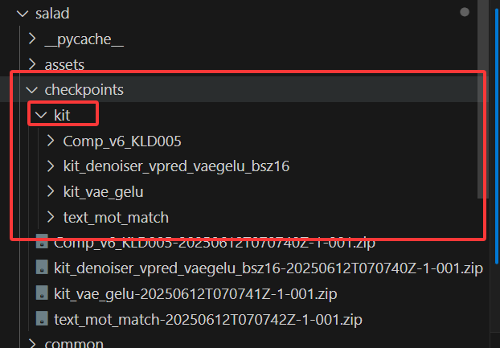
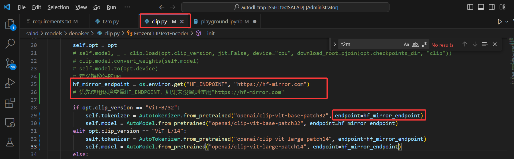

# Baseline——SALAD运行环境配置

对应的Github链接：https://github.com/seokhyeonhong/salad/tree/main?tab=readme-ov-file

We tested our code on `Python 3.9.19` and `PyTorch 1.13.1+cu117`.

因此，打开AutoDL，租一个比较符合上述标准的机器：


# 一、配环境

老老实实把对应的环境配好吧，需要在购买的机器上创建对应的conda环境。

```shell
conda create -n salad python=3.9 -y
conda activate salad
pip install torch==1.13.1+cu117 --extra-index-url https://download.pytorch.org/whl/cu117
pip install -r requirements.txt
```


## 2.百度网盘配置（用于下载权重等大数据）

由于我这边有百度网盘的会员，因此首先先在Windows上下载到本地，然后上传到网盘上，从网盘下载，这样对于几个G的权重数据也是能够成功上传上去的。以下介绍这部分的基本配置：

### （1）Linux上安装百度网盘和基本使用

> 好的，没有问题。在 Linux 系统上，尤其是服务器环境，使用命令行工具来操作百度网盘是最高效的方式。我将为你提供一份详细的、分步的教程，使用目前最流行和强大的开源工具 `BaiduPCS-Go` 来实现你的需求。
>
> ### 教程概述
>
> 本教程将分为四个主要部分：
>
> 1.  **安装 BaiduPCS-Go**: 下载并配置好这个强大的命令行工具。
> 2.  **获取浏览器 Cookie**: 安全地从你的浏览器中获取用于登录的 Cookie。
> 3.  **使用 Cookie 登录**: 在 `BaiduPCS-Go` 中完成登录认证。
> 4.  **浏览和下载文件**: 学习如何列出文件、切换目录和高速下载你需要的文件。
>
> ---
>
> ### Part 1: 安装 BaiduPCS-Go
>
> `BaiduPCS-Go` 是一个用 Go 语言编写的工具，安装非常简单，我们只需要下载编译好的二进制文件即可。
>
> #### 步骤 1.1: 确定你的系统架构并下载文件
>
> 首先，你需要知道你的 Linux 系统架构。在绝大多数情况下（包括几乎所有的云服务器和现代桌面版 Linux），它都是 `amd64` (也叫 `x86_64`)。你可以通过以下命令确认：
>
> ```bash
> uname -m
> ```
>
> 如果输出是 `x86_64`，那么你就需要下载 `amd64` 的版本。
>
> 现在，我们去 `BaiduPCS-Go` 的 [GitHub Releases 页面](https://github.com/qjfoidnh/BaiduPCS-Go/releases) 寻找最新的版本。
>
> **操作步骤**：
>
> 1. 打开终端。
>
> 2. 使用 `wget` 命令下载最新的、对应你系统架构的压缩包。下面以一个具体的版本为例（建议你去 Release 页面找最新的链接替换）。
>
>    ```bash
>    # 我自己下载的链接如下
>    # 可能需要再开一下学术加速：source /etc/network_turbo
>    wget https://github.com/qjfoidnh/BaiduPCS-Go/releases/download/v3.9.7/BaiduPCS-Go-v3.9.7-linux-amd64.zip
>    ```
>
> #### 步骤 1.2: 解压并安装
>
> 1. 下载完成后，使用 `tar` 命令解压文件：
>
>    ```bash
>    # 解压你刚刚下载的文件
>    unzip BaiduPCS-Go-v3.9.7-linux-amd64.zip 
>    ```
>
> 2. 解压后你会得到一个名为 `BaiduPCS-Go` 的文件夹。为了能在系统的任何路径下直接运行它，我们将其移动到 `/usr/local/bin` 目录下。
>
>    ```bash
>    # 进入解压后的目录
>    cd BaiduPCS-Go-v3.9.7-linux-amd64
>    
>    # 将主程序移动到系统路径中，这需要管理员权限
>    sudo mv BaiduPCS-Go /usr/local/bin/
>    ```
>
> 3. 为了确保程序有执行权限，我们给它添加可执行权限：
>
>    ```bash
>    sudo chmod +x /usr/local/bin/BaiduPCS-Go
>    ```
>
> #### 步骤 1.3: 验证安装
>
> 在终端输入以下命令：
>
> ```bash
> BaiduPCS-Go
> ```
>
> 如果你看到 `BaiduPCS-Go` 的欢迎信息和版本号，说明安装成功！程序会进入一个交互式命令行，你可以输入 `quit` 或按 `Ctrl+D` 退出。
>
> ---
>
> ### Part 2: 获取浏览器 Cookie
>
> 这是整个过程中最关键的一步。使用 Cookie 登录可以避免输入用户名密码，也能绕过复杂的验证码和两步验证（2FA）。
>
> 1.  **登录百度网盘**: 在你的电脑上，使用 Chrome 或 Firefox 浏览器，正常访问 `pan.baidu.com` 并登录你的账号。
>
> 2.  **打开开发者工具**: 登录成功后，在当前页面按 `F12` 键，打开浏览器的“开发者工具”。
>
> 3.  **找到网络请求**:
>     *   在开发者工具中，切换到 **"Network" (网络)** 标签页。
>     *   刷新一下网页（按 `F5`），或者点击网盘里的任意一个文件夹。
>     *   此时 Network 标签页会列出很多网络请求。
>
> 4.  **复制 Cookie**:
>     *   在请求列表中，找到任意一个向 `pan.baidu.com` 发出的请求，点击它。
>     *   在右侧出现的窗口中，找到 **"Request Headers" (请求标头)** 部分。
>     *   向下滚动，找到名为 **`Cookie:`** 的一行。
>     *   右键点击 `Cookie:` 旁边的**完整的值**，选择“复制值 (Copy value)”。这一长串字符串就是我们需要的 Cookie。
>
> 
>
> > **安全提示**: Cookie 包含了你的登录凭证，**绝对不要泄露给任何人！**
>
> ---
>
> ### Part 3: 使用 Cookie 登录
>
> 这里我们使用BDUSS登录，具体的指令如下：
>
> ```shell
> BaiduPCS-Go login -bduss=你的BDUSS值
> ```
>
> 
>
> ---
>
> ### Part 4: 浏览和下载文件
>
> 登录成功后，你就可以像在 Linux 终端里一样操作你的网盘文件了。比如有了上一步之后，可以输入BaiduPCS-Go进入交互式界面。
>
> #### 常用命令
>
> * **列出文件和文件夹**:
>
>   ```bash
>   # 类似 ls 命令
>   ls
>   
>   # 显示更详细的信息
>   ll
>   ```
>
> * **切换目录**:
>
>   ```bash
>   # 进入名为 "我的学习资料" 的文件夹 (如果文件夹名有空格，用引号括起来)
>   cd "我的学习资料"
>   
>   # 返回上一级目录
>   cd ..
>   ```
>
> * **下载文件或文件夹**:
>   这是最重要的功能。使用 `download` 或其缩写 `d`。
>
>   ```bash
>   # 下载名为 "毕业论文.docx" 的文件到当前工作目录
>   download "毕业论文.docx"
>   
>   # 下载整个名为 "项目代码" 的文件夹
>   d "项目代码"
>   ```
>
> #### 高级下载技巧 (推荐)
>
> * **指定保存路径**: 使用 `--saveto` 参数。
>
>   ```bash
>   # 将文件下载到你指定的 /root/downloads 目录
>   d "毕业论文.docx" --saveto /root/downloads
>   ```
>
> * **提升下载速度**: 使用 `-p` 参数增加并行连接数，可以显著提升大文件的下载速度。
>
>   ```bash
>   # 使用 32 个线程并行下载，速度飞快！
>   d "我的电影.mp4" -p 32
>   ```
>
> * **组合使用**:
>
>   ```bash
>   d "我的电影.mp4" -p 32 --saveto /root/autodl-tmp/movies
>   ```
>
> ### 总结
>
> 至此，你已经掌握了在 Linux 上通过 `BaiduPCS-Go` 工具，使用 Cookie 登录并高速下载百度网盘文件的全部流程。这是一个非常强大和稳定的解决方案，尤其适合在服务器上进行批量下载或自动化操作。


## 3.下载对应的数据集，checkpoints

> KIT的结果很奇怪，渲染出来是纯白色的，可能要试一下HumanML3D的数据集，但是用一下tiny版本测试一下。

下载的路径位置如下：
```python
salad
└─ dataset
    └─ humanml3d # 这个测试的时候可以用那个humanml3d_tiny来替代
    └─ kit-ml # 暂时用来测试的话，就只下载这个
```

权重下载的文件如下：

```shell
mkdir -p checkpoints
cd checkpoints

echo -e "Downloading pretrained models for SALAD on the KIT-ML dataset"
gdown --folder https://drive.google.com/drive/folders/1hph0cFCq4NDbPRiJ3oLzaoupNBF7sfI-?usp=drive_link

cd ..

echo -e "Downloading done!"
```

也就是说，我们只需要把这些文件放入到新建的`checkpoints`文件夹当中即可。注意需要解压，最终如下图所示：




# 二、运行demo遇到的坑

使用的ipynb文件是：`playground.ipynb`

以下介绍运行这部分代码的时候遇到的问题：

### （1）huggingface连接超时

这是老毛病了，两种解决方案：

- 1.https://www.autodl.com/docs/network_turbo/，参考这里，打开学术加速，注意如果是notebook的版本需要使用对应版本的指令；
- 2.修改一下源码（==先不要看这个，可能是错的，endpoint不认识，上面那个学术加速足以解决问题了==）：

> **找到文件：** 找到你的项目目录下的 `salad/models/denoiser/clip.py` 文件。
>
> **导入 `os` 模块：** 在文件的开头（通常在其他 `import` 语句下面）添加 `import os`。
>
> **定义镜像站 URL：** 在 `FrozenCLIPTextEncoder` 类的 `__init__` 方法中，在 `if opt.clip_version == "ViT-B/32":` 这一行之前，添加以下代码来获取或设置镜像站的 URL：
>
> Python
>
> ```
> hf_mirror_endpoint = os.environ.get("HF_ENDPOINT", "https://hf-mirror.com")
> ```
>
> 这行代码会首先尝试读取 `HF_ENDPOINT` 环境变量。如果环境变量存在，就使用环境变量的值；如果不存在，就使用 `https://hf-mirror.com` 作为默认值。这样，如果你之后解决了环境变量设置问题，它依然会优先使用环境变量。
>
> **在 `from_pretrained` 中添加 `endpoint` 参数：** 在调用 `AutoTokenizer.from_pretrained` 和 `AutoModel.from_pretrained` 时，添加 `endpoint=hf_mirror_endpoint` 参数。
>
> **保存文件：** 保存你对 `clip.py` 文件所做的更改。

对应如下：




### （2）需要额外安装的包

```shell
sudo apt update && sudo apt install ffmpeg
```


### （3）报错大集合

#### （a）报错【1】

```python
File ~/autodl-tmp/salad/utils/plot_script.py:381, in plot_3d_motion.<locals>.update(index)
    379 def update(index):
    380     #         print(index)
--> 381     ax.lines = []
    382     ax.collections = []
    383     ax.view_init(elev=120, azim=-90)

AttributeError: can't set attribute 'lines'"
}
```

解决方案是把

```python
--> 381     ax.lines = []
    382     ax.collections = []
```

注释掉，改成`ax.clear()`，其他的相关报错也是类似的处理。==注意修改完之后可能需要重启一下notebook和对应的kernel==。


#### （b）没有moviepy.editor

老毛病了，注释掉导入语句，换成下面这两句：

```python
from moviepy.video.io.VideoFileClip import VideoFileClip
from moviepy.video.compositing.CompositeVideoClip import clips_array
```


# 三、测试效果

以下是对playground的四种模式的说明：

> 根据你提供的代码片段，我来为你解读这四个 `generator.edit` 的不同 `edit_mode` 及其作用。这看起来是一个基于文本描述来编辑或生成动作（motion）的系统，类似于文本到视频或文本到动作生成中的编辑功能。
>
> 核心思想是，你有一个 **源文本（`src_text`）** 代表原始动作，以及一个 **编辑文本（`edit_text`）** 或其他参数来指导如何修改或生成新的动作。`edit_mode` 参数定义了具体的编辑策略。
>
> ------
>
> ### **公共参数解读**
>
> 在深入了解每个 `case` 之前，先理解一些公共参数：
>
> - **`init_noise`**: 这很可能是用于生成动作的初始随机噪声。在扩散模型中，通常从随机噪声开始，通过迭代去噪过程生成目标内容。
>
> - **`src_text`**: 原始的文本描述，代表了你希望作为起点或参考的动作。
>
> - **`edit_text`**: 用于指导编辑过程的文本描述。它定义了你想要在原始动作基础上进行的修改。
>
> - **`cfg_scale`**: 分类器自由引导（Classifier-Free Guidance）的比例。这是一个在扩散模型中常用的参数，用于控制生成结果与输入文本描述（prompt）的匹配程度。值越高，生成的动作越严格地遵循 `edit_text` 或 `src_text` 的指导，但可能牺牲多样性。
>
> - **`num_inference_timesteps`**: 推理步数。扩散模型通过多步迭代去噪来生成结果。步数越多，通常结果质量越高，但生成时间也越长。
>
> - `src_sa`, `src_ta`, `src_ca`
>
>   : 这些参数听起来像是某种注意力（attention）机制或特征表示。
>
>   - `sa` 可能代表 **Spatial Attention (空间注意力)**。
>   - `ta` 可能代表 **Temporal Attention (时间注意力)**。
>   - `ca` 可能代表 **Cross-Attention (交叉注意力)**。 它们可能是在编辑过程中用来保持 `src_text` 或 `src_motion` 的某些特征（空间结构、时间序列或与文本的对齐关系）。
>
> - **`src_proportion`**: 源比例。这可能是一个控制在编辑过程中保留多少原始动作信息（或其特征）的参数。例如，`0.2` 可能意味着在生成过程中，20% 的时间或步骤会偏向保留 `src_motion` 的信息，而其余 80% 则用于融入 `edit_text` 的修改。
>
> ------
>
> ### **四个编辑模式（`edit_mode`）的理解**
>
> #### **Case 1: `edit_mode="mirror"` (镜像编辑)**
>
> Python
>
> ```
> # case 1: mirror
> # edit_text = "a man is walking while waving his right hand"
> # edit_motion = generator.edit(init_noise,
> #                              src_text=src_text,
> #                              edit_text=edit_text, # 这里的edit_text可能是用来指导整体动作风格，或者作为目标文本
> #                              edit_mode="mirror",
> #                              mirror_mode="lower", # 核心参数：镜像模式，这里是“下半身”
> #                              cfg_scale=cfg_scale,
> #                              num_inference_timesteps=num_inference_timesteps,
> #                              src_sa=sa,
> #                              src_ta=ta,
> #                              src_ca=ca,
> #                              src_proportion=src_proportion)
> ```
>
> - **理解:** `mirror` 模式旨在创建一个动作的镜像版本。这个模式通常用于在人体动画中，例如将左侧的动作复制到右侧，或将上半身的动作复制到下半身。
>
> - `mirror_mode="lower"`
>
>   : 这是这个 
>
>   ```
>   case
>   ```
>
>    的关键参数。它指示系统对动作的
>
>   下半部分
>
>   进行镜像操作。
>
>   - 如果 `src_text` 描述了一个人挥舞**左手**，那么在 `mirror_mode="lower"` 的情况下，系统可能会尝试在保持上半身原有动作（或受 `edit_text` 影响）的同时，让下半身产生某种镜像效果。
>   - 然而，考虑到 `edit_text = "a man is walking while waving his right hand"`，如果 `src_text` 描述了上半身的动作，并且 `mirror_mode="lower"`，这可能意味着尝试将上半身动作（比如挥手）的某种“对称性”或“镜像”特性应用到下半身的行走动作上。
>   - 更常见的 `mirror_mode` 可能还有 `left_right` (左右镜像)，用于将左臂挥舞变成右臂挥舞等。`lower` 则暗示是对身体上下部分进行处理。这在生成走路等对称性动作时可能很有用。
>
> #### **Case 2: `edit_mode="reweight"` (重新加权编辑)**
>
> Python
>
> ```
> # # case 2: reweight
> # edit_text = "a man is walking while waving his right hand" # 注意这里edit_text被覆盖了
> # edit_motion = generator.edit(init_noise,
> #                              src_text=src_text,
> #                              edit_text=src_text, # 核心参数：编辑文本与源文本相同
> #                              edit_mode="reweight",
> #                              tgt_word="high", # 核心参数：目标词汇
> #                              reweight_scale=-1.0, # 核心参数：重新加权比例
> #                              cfg_scale=cfg_scale,
> #                              num_inference_timesteps=num_inference_timesteps,
> #                              src_sa=sa,
> #                              src_ta=ta,
> #                              src_ca=ca,
> #                              src_proportion=src_proportion)
> ```
>
> - **理解:** `reweight` 模式允许你调整模型对 `src_text` 中特定词汇的关注程度，从而影响生成的动作。这是一种微调现有动作的方式。
>
> - **`edit_text=src_text`**: 注意这里 `edit_text` 被设置为与 `src_text` 相同。这意味着我们不是引入一个全新的文本指令，而是在原始文本的语境下进行调整。
>
> - **`tgt_word="high"`**: 指定了要重新加权的关键词。
>
> - `reweight_scale=-1.0`
>
>   : 这是关键。
>
>   - 正值会**增强**模型对 `tgt_word` 的关注，使生成的动作更符合 `tgt_word` 的含义。
>   - 负值（例如 `-1.0`）会**抑制**模型对 `tgt_word` 的关注，甚至可能生成与 `tgt_word` 含义相反的动作。
>   - 例如，如果 `src_text` 是 "a man waving his **high** hand"，并且 `reweight_scale=-1.0`，系统可能会尝试生成一个“手挥得不高”或“手放低”的动作。
>
> #### **Case 3: `edit_mode="refine"` (细化/优化编辑)**
>
> Python
>
> ```
> # case 3: refine
> # edit_text = "a man is walking while waving his right hand" # 当前运行的case使用了这个edit_text
> edit_motion = generator.edit(init_noise,
>                              src_text=src_text,
>                              edit_text=edit_text, # 核心参数：新的编辑文本
>                              edit_mode="refine",
>                              cfg_scale=cfg_scale,
>                              num_inference_timesteps=num_inference_timesteps,
>                              src_sa=sa,
>                              src_ta=ta,
>                              src_ca=ca,
>                              src_proportion=src_proportion)
> ```
>
> - **理解:** `refine` 模式是最直观的编辑方式。它允许你通过提供一个新的 `edit_text` 来**修改或细化**原始 `src_text` 所描述的动作。系统会尝试在保留 `src_text` 的部分信息（由 `src_proportion` 控制）的同时，将 `edit_text` 中描述的新动作融入进去。
> - **`src_proportion=0.2`**: 这意味着在生成 `edit_motion` 的过程中，系统会保留大约 20% 的原始 `src_motion` 信息，而 80% 则会用于融入 `edit_text` 的新指令。
> - **例如:** 如果 `src_text` 是 "a man is walking"，而 `edit_text` 是 "a man is walking while waving his right hand"，那么 `refine` 模式将尝试在保持行走动作的基础上，添加一个挥舞右手的动作。
>
> #### **Case 4: `edit_mode="word_swap"` (词汇替换编辑)**
>
> Python
>
> ```
> # # case 4: word swap
> # edit_text = "a man is walking while waving his right hand" # 这里的edit_text可能是用来提供替换后的文本
> # edit_motion = generator.edit(init_noise,
> #                              src_text=src_text,
> #                              edit_text=edit_text, # 核心参数：新的编辑文本，用于词汇替换
> #                              edit_mode="word_swap",
> #                              cfg_scale=cfg_scale,
> #                              num_inference_timesteps=num_inference_timesteps,
> #                              src_sa=sa,
> #                              src_ta=None, # 注意这里 src_ta 为 None
> #                              src_ca=ca,
> #                              src_proportion=src_proportion,
> #                              swap_src_proportion=0.2) # 核心参数：替换的源比例
> ```
>
> - **理解:** `word_swap` 模式允许你用 `edit_text` 中的一个词汇或短语替换 `src_text` 中对应的词汇或短语，从而改变动作。它比 `refine` 模式更侧重于精确的文本替换，而不是整体性的语义修改。
> - **`src_ta=None`**: 值得注意的是，在这个模式下 `src_ta` 被设置为 `None`。这可能意味着在词汇替换时，模型对原始动作的**时间注意力**不再那么重要，因为它更专注于文本层面的精确替换。
> - **`swap_src_proportion=0.2`**: 这个参数可能控制了在替换过程中，原始动作的哪个部分（或多少信息）会受到替换词汇的影响。例如，如果 `src_text` 是 "a man is waving his **left** hand"，而 `edit_text` 是 "a man is waving his **right** hand"，`word_swap` 模式会尝试将“左手”的动作替换为“右手”的动作，并由 `swap_src_proportion` 决定这种替换的强度或范围。
>
> ------
>
> ### **总结**
>
> 这四个 `edit_mode` 代表了对生成动作进行不同粒度和不同策略的文本引导编辑：
>
> - **`mirror`**: 用于创建动作的对称或镜像版本，通常针对身体的特定部位。
> - **`reweight`**: 通过调整对文本中特定词汇的关注度，来微妙地改变动作的风格或强度。
> - **`refine`**: 最常用的模式，通过提供新的文本描述，对现有动作进行语义上的修改或添加新动作。
> - **`word_swap`**: 通过文本层面精确的词汇替换，来改变动作的特定细节。
>
> 你的代码目前正在运行 `case 3: refine`，这意味着它会尝试根据 `edit_text = "a man is walking while waving his right hand"` 来细化或修改 `src_text` 所描述的原始动作。理解这些模式有助于你更好地控制生成结果，并调试可能出现的非预期行为。

经过测试，case 3：refine的结果还是能看的，其他的其实都不太行。接下来我们来尝试用LLM+case 3的方式做动作的编辑，使得结果像是在大风中。（场景：狂风天，吹东方向来的风）

> Given your `src_text = "a man is walking"` and the scenario of strong winds blowing from the east, here are a few options for `edit_text` to describe the man's change in movement, incorporating words from your provided `VIP_dict`:
>
> ------
>
> ### **Edited Text Options**
>
> Here are some options for `edit_text` to reflect a man walking in strong, eastward winds:
>
> 1. **`edit_text = "a man is walking slowly against the wind"`** （==没有效果，可能word vectorizer不认识相关词==）
>    - **Explanation:** This option directly adds "slowly" from `Desc_list` to show the difficulty of walking against wind, and "against the wind" implies the wind's direction (since east wind would be "against" if walking west, or just generally hindering movement).
> 2. **`edit_text = "a man is stumbling while walking"`**（==还行，但是体现不出来风向，也看不太出来是狂风==）
>    - **Explanation:** "Stumbling" from `Act_list` vividly describes the instability caused by strong winds. This focuses on the immediate physical impact.
> 3. **`edit_text = "a man is walking slowly and carefully"`**（==基本没有效果==）
>    - **Explanation:** Combining "slowly" and "carefully" (both from `Desc_list`) suggests that the man is not just impeded but also actively trying to maintain balance and avoid falling due to the wind.
>
> These options focus on the most direct and impactful changes to the man's movement in a strong wind scenario, using the vocabulary provided.
>
> 好的，明白了。你觉得直接修改动作或描述词效果不佳，想尝试直接编辑身体部位来体现狂风中的行走。这个思路很好，因为狂风确实会对人的肢体姿态产生直接影响。
>
> ------
>
> ### **直接编辑身体部位的 `edit_text` 示例**
>
> 场景：`src_text = "a man is walking"`，狂风天，吹东方向来的风。
>
> 1. **`edit_text = "a man is walking with his body leaning forward"`**（==没有效果==）
>    - **解释：** 在强风中，人为了保持平衡，身体会不自觉地向前倾斜。这个描述直接改变了**身体**（`Body_list` 中虽无“body”但“lean”是动作），增加了“forward”（来自 `Loc_list`）来指示方向。
> 2. **`edit_text = "a man is walking with his head down and arms swinging less"`**（==能看到一些趋势，但是效果不正确，即使cfg_scale调整到17.5了还是看不出来==）
>    - **解释：** 狂风中，人们常会低头以避风，“head down”表达了头部姿态的改变。同时，手臂的摆动（`arm` 在 `Body_list` 中）也会受到限制，因此“arms swinging less”体现了动作幅度的减小。这里结合了身体部位和动作的细微变化。
> 3. **`edit_text = "a man is walking with his feet staggering"`**（==能看出一些步伐的不稳，但其实还是没办法直接看出是大风天，风向更是看不出来==）
>    - **解释：** “staggering”（摇晃不稳）虽然不在 `Act_list` 中，但它很能体现脚（`feet` 在 `Body_list` 中）在强风中难以稳固着地的状态。如果严格限于 `Act_list`，也可以考虑 `stumble`（绊倒，踉跄），但 `staggering` 更侧重于步伐的不稳。
>
> 这些 `edit_text` 都尝试从身体姿态和部位动作的角度来描述狂风中的行走，希望能更符合你的预期。

以下展示两个有一定编辑效果的例子：

<video src="./../../../../GraduateStudent/Research/2025_06/2025_06_13/final_1.mp4"></video>

<video src="./../../../../GraduateStudent/Research/2025_06/2025_06_13/final_2.mp4"></video>

接下来是一些更加细粒度的描述，让LLM描述关键身体部位的变化：

> 好的，了解你的需求。要模拟在狂风中**手举起来挡风**，并融入行走姿态，我们需要更细致地结合动作和身体部位。
>
> ------
>
> ### **狂风中“手举起挡风”的编辑文本**
>
> 以下是一些能够更细致地表达“手举起来挡风”并模拟狂风中行走姿态的 `edit_text` 选项：
>
> 1. **`edit_text = "a man is walking slowly with his hand raised to shield his face from the wind"`**（==结果：举起了手，但还是体现不出来风向，和风的大小，而且应该不是挡风的shield==）
>
>    - **解释：** 这个描述直接指明了“手”（`hand` 在 `Body_list` 中）的动作是“举起”（`raise` 在 `Act_list` 中）来“遮挡脸部”。“slowly”（`Desc_list`）保持了行走因风受阻的特点，整体更具体地描绘了挡风的姿态。
>
>    结果如下：
>
>    <video src="./../../../../GraduateStudent/Research/2025_06/2025_06_13/final_3.mp4"></video>
>
>    
>
> 2. **`edit_text = "a man is stumbling forward with his arm bent to block the wind"`**（==也是有效果，但是也不是狂风天，吹东方向来的风==）
>
>    - **解释：** 这里使用了“stumbling”（`Act_list`），表示步伐不稳；“forward”（`Loc_list`）则暗示了人为了抵抗风力可能向前倾斜的趋势。关键是“手臂弯曲”（`arm` 在 `Body_list` 中，`bend` 在 `Act_list` 中）来“阻挡风”，这比单纯的“举起”更具防御性。
>
>    <video src="./../../../../GraduateStudent/Research/2025_06/2025_06_13/final_4.mp4"></video>
>
>    
>
> 3. **`edit_text = "a man is carefully walking while his arms are flapping slightly against the strong wind"`**（==依旧是有效果，不过怎么说都可以，没办法很明显看出来是狂风天==）
>
>    - **解释：** 这个描述着重于“小心地行走”（`carefully` 在 `Desc_list`，`walk` 在 `Act_list`）。同时，用“手臂轻微地扇动”（`arms` 在 `Body_list`，`flap` 在 `Act_list`）来模拟风力对手臂的影响，以及“对抗强风”的语境，更强调了风力对姿态的持续作用。
>
>    <video src="./../../../../GraduateStudent/Research/2025_06/2025_06_13/final_5.mp4"></video>
>
> 这些 `edit_text` 选项试图在原先“行走”的基础上，通过增加**身体部位（手、手臂、脸）**的特定**动作（举起、弯曲、阻挡、扇动）**和**修饰词（缓慢、小心）**来更细粒度地模拟在狂风中行走的防御姿态。
>
> ------
>
> 希望这些选项能更符合你对细粒度动作编辑的需求。