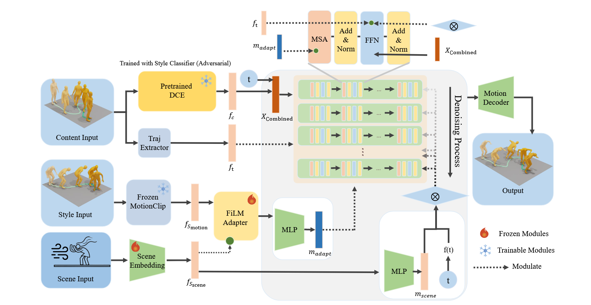

# Human Motion Style Transfer 任务

# 讨论的问题

- 1.已有的模块是否要保留？主要是DCE， FiLM，以及Time-weighted denoising process。
  - 讨论细节：Style Remover的结构创新（DCE结构的创新）；FiLM是否有必要留着，换成别的结构是否会更好？
- 2.比较麻烦的问题：==数据集==。做好了应该是比较大的一个贡献:
  - （1）目前的骨架提取管线效果并不是很好，能否有什么办法绕过提取骨架的过程，用视频资源和MotionCLIP的空间对齐呢？也需要认真讨论一下。
  - （2）找到一个视频提取骨架的工作，效果应该是比之前好非常多，正在测试能不能使用：https://github.com/zju3dv/GVHMR。

已有的代码会整理一下，上传到Github上，方便后面检查代码是否有问题。

# 一、已有进展

## 1.理论部分

这张图里面的内容目前在代码上是实现出来的，重点是以下几个模块：

- （1）Pretrained DCE 模块 ： 是否可以在这上面再做一些改进？目前的方案可以讨论一下，以及本来参考的MCM-LDM的启发式算法：https://github.com/XingliangJin/MCM-LDM/blob/main/mld/models/modeltype/mld.py#L475。这里换成DCE模块，或者说这里是否有其他的模块可以放进来？
- （2）关于Scene Embedding层，这是==重点要讨论的内容==，自然语言处理+体现风大风小/风向这样的效果，有什么可行的方案。
- （3）FiLM模块：这个结构可能需要换掉，如何更好地融合Scene的信息和Style本身的信息呢？这是要考虑的问题。

## 2.