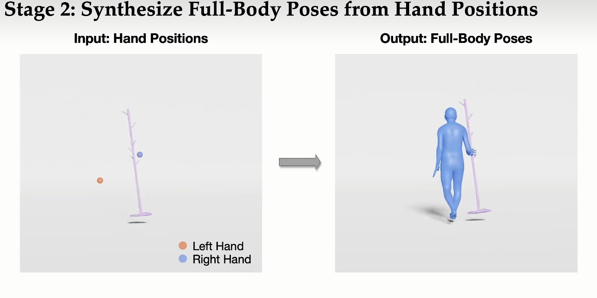

# 动作生成 运动生成

可以考虑的方向

更进一步优化或者综合化当前已有的多人运动+交互框架

希望最后是给一个剧本，多个人可以演绎，且场景中有物体

方向更新为 自然语言和任务驱动的动作生成（后面可以加上多人，环境等）

讨论

任务是输入一段文字：生成一段人物跑向椅子并坐下的动画。
场景中提供椅子和椅子坐标。
然后能生成动画

现在的方法可以做到文字生成人物动画，但是文字里没办法指定人物跟某个物体的交互
解决这个问题-怎么让生成的动画满足物体交互的描述

（过场动画，技能动画）

想法：可编辑，的动画

策划：要生成从站着到坐在椅子上，靠着躺下

编辑1：左脚往外伸直

编辑2：

或者说 用线稿+语言描述去生成一个动作

## 综述或总结

github总结text2motion网站

https://github.com/haofanwang/awesome-conditional-content-generation

https://github.com/layumi/Awesome-Text2Motion-Generation?tab=readme-ov-file

HumanML3D数据集上各个模型的效果

https://paperswithcode.com/sota/motion-synthesis-on-humanml3d?p=executing-your-commands-via-motion-diffusion

### 综述

https://blog.csdn.net/Arachis_X/article/details/136691012

==文件：**[动作生成综述 人体动作生成综述：方法、资源与挑战.md](.\动作生成综述 人体动作生成综述：方法、资源与挑战.md)**==

AI 动作生成的现状与畅想 - Reuben的文章 - 知乎
https://zhuanlan.zhihu.com/p/28333273901

### 论文

人体动作生成的需求通常包括一个条件信号，如**文本描述、背景音频或周围环境**，如图1所示。因此生成的动作不仅本身应该合理，还应与条件信号协调一致。

## 论文

非人形骨骼动画生成

https://animatabledreamer.github.io/

从单目视频中提取的骨架上生成各种类别的非刚性物体。

https://nju-3dv.github.io/projects/STAG4D/

感觉是生成视频那种，NERF形式

### 多人

##### Interactive Humanoid

Interactive Humanoid: Online Full-Body Motion Reaction Synthesis with Social Affordance Canonicalization and Forecasting

https://yunzeliu.github.io/iHuman/

专注于人与虚拟人的**互动**任务，特别是涉及物体的互动任务， NPC

https://mp.weixin.qq.com/s/d9c0YirPTxw9_SpmulvYrQ

##### InterGen

文本控制双人/多人互动

InterGen: Diffusion-based Multi-human Motion Generation under Complex Interactions

论文：https://arxiv.org/pdf/2304.05684

https://github.com/tr3e/InterGen?tab=readme-ov-file

##### ContactGen

**ContactGen****Contact-Guided Interactive 3D Human Generation for Partners**

https://dongjunku.github.io/contactgen/

**ContactGen****合作伙伴接触引导交互式3D人体生成** 好像没动作，只有一帧

##### ActFormer

ActFormer: A GAN-based Transformer towards General Action-Conditioned 3D Human Motion Generation

- 主页：https://liangxuy.github.io/actformer/
- 论文：https://arxiv.org/abs/2203.07706
- 代码：https://github.com/Szy-Young/actformer

https://blog.csdn.net/AITIME_HY/article/details/132074368

可多人

提供了GTA Combat Dataset

##### Neural Categorical Priors for Physics-Based Character Control

SIGGRAPH Asia 2023 最佳论文提名

Neural Categorical Priors for Physics-Based Character Control 让虚拟人动作更逼真，基于**物理**的角色控制

有code  https://github.com/Tencent-RoboticsX/NCP

https://arxiv.org/pdf/2308.07200

https://blog.csdn.net/y80gDg1/article/details/135233967

具体笔记：

**[基于物理的角色控制Neural Categorical Priors for Physics-Based Character Control.md](基于物理的角色控制Neural Categorical Priors for Physics-Based Character Control.md)**

### 单人

#### 文本->动作

##### MotionDiffuse: Text-Driven Human Motion Generation with Diffusion Model

22年比较早了 但是开源

论文链接：

github地址：https://github.com/mingyuan-zhang/MotionDiffuse?tab=readme-ov-file

demo：https://huggingface.co/spaces/mingyuan/MotionDiffuse

https://zhuanlan.zhihu.com/p/685288565

输入：文字

##### MotionGPT: Human Motion as Foreign Language

最后更新 2023/09/22 开源

项目地址：https://motion-gpt.github.io/

github地址：https://github.com/OpenMotionLab/MotionGPT	

有demo

[NeurIPS 2023](https://nips.cc/)

输入：文字

##### HumanTOMATO: Text-aligned Whole-body Motion Generation 文本对齐的全身人体动作生成

有手

https://github.com/IDEA-Research/HumanTOMATO	

 【摘要】：本研究旨在解决一项新颖任务：文本驱动的全身动作生成。该任务以文本描述作为输入，旨在同时生成高质量、多样化和连贯的面部表情、手势和身体动作。以往的文本驱动动作生成研究主要存在两个缺陷：它们忽视了在生动的全身动作生成中精细的手部和面部所扮演的关键角色，同时文本和动作之间缺乏良好的对齐。为了解决这些缺陷，我们提出了一种名为HumanTOMATO的文本对齐全身动作生成框架。据了解，这是第一个尝试在这一研究领域实现可行的全身动作生成的工作。为了应对这一具有挑战性的任务，我们的解决方案包括两个关键设计：

（1）一种用于精细重建、生成身体和手部动作的**全面层级VQ-VAE**（Holistic Hierarchical H²VQ）和Hierarchical-GPT分层GPT，具有两个结构化码本；

以及（2）一个预训练的文本-动作对齐模型，以帮助生成的动作明确地与输入的文本描述对齐。全面的实验证明，我们的模型在生成动作的质量和其与文本的对齐方面具有显著优势。

【

在VQ-VAE中，"codebook"（码本）指的是一种用于存储离散编码的集合，这些编码用来表示输入数据的离散化版本。具体来说，它是由一组向量组成的集合，每个向量对应着编码空间中的一个离散点。在训练过程中，VQ-VAE通过量化器（quantizer）将输入数据映射到最接近的码本向量，从而实现信息的离散化压缩。

这种码本的存在使得VQ-VAE能够有效地将连续的输入数据转换为离散的表示形式，从而在保留重要信息的同时，减少了存储和处理上的复杂性。在生成过程中，码本的向量被用来重构原始输入或生成类似输入的新样本，从而支持模型在高维空间中进行有效的表示和生成。

总结来说，码本在VQ-VAE中充当了存储和量化离散信息的重要角色，是模型能够实现高效数据压缩和生成的关键组成部分。

】

第一步，将motion压缩成离散代码

##### Taming Diffusion Probabilistic Models for Character Control 

windows可执行.exe demo下载地址：https://github.com/AIGAnimation/CAMDM 

论文：[SIGGRAPH 2024]Taming Diffusion Probabilistic Models for Character Control 

作者：Rui Chen, Mingyi Shi, Shaoli Huang, Ping Tan, Taku Komura, Xuelin Chen

项目地址：https://github.com/AIGAnimation/CAMDM

【[SIGGRAPH] 100种**运动风格**切换实机测试！**unity**中使用diffusion model实时生成动作并控制角色运动】 https://www.bilibili.com/video/BV1cs421K71o/?share_source=copy_web&vd_source=2c8847c41a6c97560a277330511f1edd

##### MoMask 文本一键转3D数字人骨骼动画

==[MoMask 文本一键转3D数字人骨骼动画.md](D:\YanYi1\xia\AI\MotionGenerate\MoMask\MoMask 文本一键转3D数字人骨骼动画.md)==

- 论文题目：MoMask: Generative Masked Modeling of 3D Human Motions
- 论文链接：https://arxiv.org/abs/2312.00063
- 代码链接：https://github.com/EricGuo5513/momask-codes
- Huggingface Space 链接：https://huggingface.co/spaces/MeYourHint/MoMask

讲解：**https://www.jiqizhixin.com/articles/2024-04-29-3**

没有手指，还是会有抖动

MoMask: 生成式遮蔽建模 3D 人体动作

https://arxiv.org/pdf/2312.00063

https://ericguo5513.github.io/momask/

##### Motion Generation from Fine-grained Textual Descriptions 细粒度文本

写了文章md

grained 高度详细的

- 简介

  本文的任务是从给定的文本描述生成人体运动序列，模型探索从自然语言指令到人体运动的多样映射。虽然大多数现有的工作都限于粗粒度的运动描述，例如“一个人蹲下”，但几乎没有探索指定相关身体部位运动的**细粒度描述**。使用粗粒度文本训练的模型可能无法学习从细粒度运动相关单词到运动基元的映射，导致无法从未见过的描述中生成运动。因此，本文通过向 **GPT-3.5-turbo** 提供具有伪代码强制检查的逐步说明来构建一个专门针对细粒度文本描述的大规模语言-运动数据集 FineHumanML3D。相应地，我们设计了一种新的文本到运动模型 **FineMotionDiffuse**，充分利用细粒度文本信息。我们的定量评估表明，FineMotionDiffuse 在 FineHumanML3D 上训练相比竞争基线大幅提高了 FID 0.38。根据定性评估和案例研究，我们的模型在生成空间或时间复合运动方面优于 MotionDiffuse，通过学习从细粒度描述到相应基本运动的隐式映射。我们在 https://github.com/KunhangL/finemotiondiffuse 上发布了我们的数据。

  收起 

- 解决问题

  该论文旨在解决text2motion中细粒度文本描述的问题，即如何从细粒度的文本描述中生成人体运动序列。

- 关键思路

  论文提出了一种新的text2motion模型FineMotionDiffuse，该模型利用细粒度文本信息进行训练，并学习从细粒度描述到相应基本动作的隐式映射，从而生成空间或时间上复合的动作。

- 其它亮点

  论文构建了一个大规模的FineHumanML3D数据集，使用GPT-3.5-turbo对其进行训练，并设计了FineMotionDiffuse模型，该模型在FineHumanML3D上训练，相对于竞争基线模型，FID提高了0.38。论文还开源了数据集和代码。

- 相关研究

  最近的相关研究包括：1. Learning to Generate 3D Human Pose and Shape via Multiview Pose Estimation and 3D Morphable Model. 2. Learning to Generate Human Motion with Adversarial Training. 3. Text2Action: Generative Adversarial Synthesis from Language to Action.

https://hub.baai.ac.cn/paper/8fcbf49d-695c-4184-b42d-8a5f02318a9c

##### TAAT: Think and Act from Arbitrary Texts in Text to Motion 任意文本

https://arxiv.org/pdf/2404.14745v3

#### 音频->动作：舞蹈 

##### Lodge 单人跳舞

论文标题：Lodge: A Coarse to Fine Diffusion Network for Long Dance Generation Guided by the Characteristic Dance Primitives

机构：清华大学，鹏城实验室，Meshcapade，北京师范大学

论文链接：https://arxiv.org/pdf/2403.10518.pdf

项目地址：https://li-ronghui.github.io/lodge

https://www.bilibili.com/read/cv33342660/

#### 音频->动作：演讲 

##### EMAGE  面部+肢体动画，一个框架搞定从音频生成数字人表情与动作

2401

- 论文地址：https://arxiv.org/abs/2401.00374
- 项目主页：https://pantomatrix.github.io/EMAGE/
- 视频结果：https://www.youtube.com/watch?v=T0OYPvViFGE
- hugging face space 链接：https://huggingface.co/spaces/H-Liu1997/EMAGE

**机器之心：https://www.jiqizhixin.com/articles/2024-04-01-3**

用了BEAT2数据集

##### 本科毕设研究过的beat

D:\YanYi1\xia\AI\MotionGenerate\本科毕设 手势生成\毕设论文 写在模板上0422T1930.docx

### 互动

##### 单人长文与物体交互 Hierarchical Generation of Human-Object Interactions with Diffusion Probabilistic Models

https://www.bilibili.com/video/BV1xH4y1973x/?vd_source=8365f01b9a38920137caac09dd55836f

基于扩散概率模型的人 - 物交互的分层生成

Hierarchical Generation of Human-Object Interactions with Diffusion Probabilistic Models

https://arxiv.org/pdf/2310.02242

https://zju3dv.github.io/hghoi/index.html

##### Controllable Human-Object Interaction Synthesis 可控人-物交互综合

https://arxiv.org/pdf/2312.03913

可以看的讲解等

GAMES Webinar 321-模拟与动画专题-李佳蔓-面向物理交互场景的人类运动建模与仿真

与场景交互的运动生成

https://www.bilibili.com/video/BV1SE421G7h7/?spm_id_from=333.788&vd_source=8365f01b9a38920137caac09dd55836f

先预测手的位置，然后再预测整个人体的位置

GAMES Webinar 321-模拟与动画专题-蒋一峰-面向物理交互场景的人类运动建模与仿真

https://www.bilibili.com/video/BV1Qb42187nd/?spm_id_from=333.788&vd_source=8365f01b9a38920137caac09dd55836f

##### Synthesizing Physically Plausible Human Motions in 3D Scenes 合成3D场景中物理上合理的人类动作

有论文笔记

[note在此](./Synthesizing Physically Plausible Human Motions in 3D Scenes 动作生成 人物与3D场景交互.md)

### 工业级

https://news.nweon.com/119109

### vlm

https://blog.csdn.net/shebao3333/article/details/139065434

https://www.jiqizhixin.com/articles/2024-06-11-15

### 草图生成

https://patentimages.storage.googleapis.com/2a/0d/57/600d5efe1f506a/CN110310351A.pdf