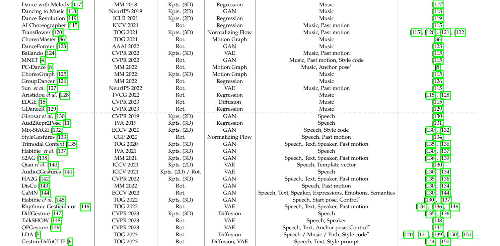
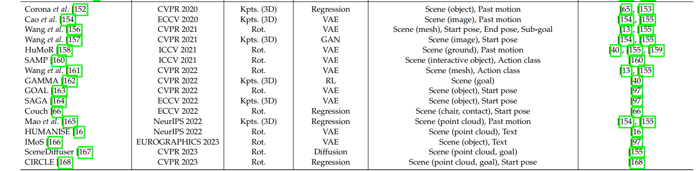

# 动作生成综述

https://github.com/haofanwang/awesome-conditional-content-generation

https://hub.baai.ac.cn/view/32620

https://blog.csdn.net/Arachis_X/article/details/136691012

### 论文

人体动作生成的需求通常包括一个条件信号，如**文本描述、背景音频或周围环境**，如图1所示。因此生成的动作不仅本身应该合理，还应与条件信号协调一致。

**文本驱动**

　　文本驱动人体动作生成任务旨在根据自然语言描述生成人体动作序列。这类方法可以分为两类：动作标签驱动和自然语言驱动。动作标签驱动利用有限的预定义标签生成动作，而自然语言驱动则可以基于多样化的文本描述生成更丰富的动作。

*我们想要的是**自然语言驱动**

**场景驱动**

　　场景驱动人体动作生成任务旨在根据场景环境生成合理的人体动作。这类方法通常采用多阶段管线，首先预测目标位置或目标交互锚点，然后规划路径或轨迹，最后沿轨迹生成动作

**05 未来展望** 

　　尽管这个领域取得了迅速的进展，但仍存在一些重大挑战需要未来的探索。有鉴于此，我们从不同角度展望了几个富有前景的未来研究方向，以期能激发人体动作生成研究的新突破。未来的工作可以从数据、语义、评价、可控性和互动性等方面进行深入研究，以实现更自然、真实、多样化的人体动作生成。

　　**数据**：收集高质量的人体动作数据具有挑战性，未来研究可以探讨使用异构数据源，通过弱监督学习方法或多模态基础模型整合数据优势。

　　**语义**：人体动作不仅仅是身体部位的运动，还具有丰富的非言语沟通功能。未来研究可以深入探讨从数据、方法和评价等方面捕捉人体动作与条件信号之间的高层语义关系。

　　**评价**：合适的动作评价指标至关重要，但具有挑战性。未来工作可以关注设计更符合人类感知且具有可解释性的客观评价指标。

　　**可控性**：生成内容的可控性在实际应用中非常重要。未来研究可以进一步探索可控性，以创造更用户友好的体验，例如交互式和细粒度编辑。

　　**互动性**：人体动作的互动性尚未得到充分探讨。未来研究可以关注人体动作生成在人际互动和人与环境互动背景下的应用，例如社交群体中的互动动作和动态可操作场景中的动作生成。

