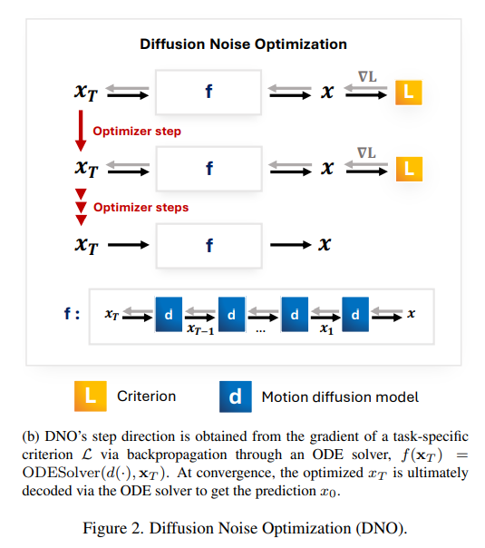
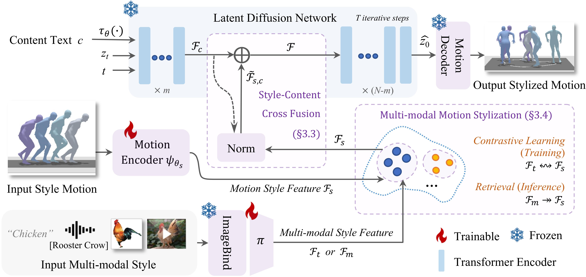

# Motion Generation 工作相关

[GitHub - Foruck/Awesome-Human-Motion: An aggregation of human motion understanding research.](https://github.com/Foruck/Awesome-Human-Motion?tab=readme-ov-file#humanoid-simulated-or-real)


# Motion Editing

| 序号 | 文章题目+中稿会议                                            | 摘要翻译                                                     | 核心突出点                                                   | Method部分截图                                               | 是否开源                             | 相关链接                                                     |
| ---- | ------------------------------------------------------------ | ------------------------------------------------------------ | ------------------------------------------------------------ | ------------------------------------------------------------ | ------------------------------------ | ------------------------------------------------------------ |
| 1    | 《SALAD: Skeleton-aware Latent Diffusion for Text-driven Motion Generation and Editing》：**CVPR 2025** | 随着去噪扩散模型的兴起，文本驱动动作生成技术取得了显著进展。然而，==现有方法往往对骨骼关节、时间帧和文本词汇的表示进行了过度简化，导致其难以充分捕捉各模态内部信息及其交互关系。==此外，当将预训练模型应用于动作编辑等下游任务时，==通常需要额外的人工干预、优化或微调等操作。==本文提出的骨骼感知潜在扩散模型（SALAD）通过==显式建模关节、时间帧与文本词汇之间的复杂关联关系，实现了更精准的跨模态表征。==该模型的创新性在于：==利用生成过程中产生的交叉注意力图，仅需文本提示即可实现基于注意力机制的零样本动作编辑，无需任何额外用户输入或模型调整。==实验表明，我们的方法在保持生成质量的同时，文本-动作对齐性能显著优于现有方案，并通过提供多样化的编辑功能展现了超越生成任务的实际应用价值。项目代码详见项目主页。 | 1.显式建模多模态之间的关系，实现更精准的跨模态表征。<br>2.零样本动作编辑，仅需要文本提示； |  | :white_check_mark:                   | [SALAD](https://seokhyeonhong.github.io/projects/salad/)     |
| 2    | 《 MixerMDM: Learnable Composition of Human Motion Diffusion Models》：**CVPR 2025** | 在文本描述等条件引导下生成人体运动极具挑战性，这主要源于需要具备高质量运动及其对应条件配对的数据集。当追求更精细的生成控制时，这一难度进一步加大。为此，==先前的研究提出将多个在不同类型条件数据集上预训练的运动扩散模型相结合，从而实现多条件控制==。然而，==这些提出的融合策略忽视了结合生成过程的最佳方式可能依赖于每个预训练生成模型的特性以及具体的文本描述。==在此背景下，我们引入了MixerMDM，这是首个可学习的模型组合技术，用于结合预训练的文本条件人体运动扩散模型。与以往方法不同，==MixerMDM提供了一种动态混合策略，通过对抗训练学习如何根据驱动生成的条件集合来结合每个模型的去噪过程。通过使用MixerMDM结合单人和多人运动扩散模型，我们实现了对每个人动态的精细控制，以及对整体互动的调控。==此外，我们==提出了一种新的评估技术==，首次在该任务中通过计算混合生成运动与其条件之间的对齐度，以及MixerMDM根据待混合运动调整整个去噪过程中混合方式的能力，来衡量互动质量和个体质量。 | 1.提供动态混合策略（ dynamic mixing strategy）<br>2.提出了一种新的评估技术 |  | :no_entry:                           | https://github.com/pabloruizponce/MixerMDM                   |
| 3    | 《AnyMoLe: Any Character Motion In-betweening Leveraging Video Diffusion Models》：**CVPR 2025** | 尽管基于学习的运动中间帧生成技术近期取得了进展，==但一个关键限制却被忽视了：对角色特定数据集的依赖。==本文提出AnyMoLe方法，通过==利用视频扩散模型为任意角色生成运动中间帧，无需外部数据即可突破这一限制。==我们的方法采用两阶段帧生成流程以增强上下文理解。为了弥合真实世界与渲染角色动画之间的领域差距，我们提出ICAdapt技术——一种针对视频扩散模型的微调方法。此外，我们开发了"运动-视频模拟"优化技术，通过结合2D与3D感知特征，可为任意关节结构的角色实现无缝运动生成。**AnyMoLe在显著降低数据依赖性的同时，能生成流畅逼真的过渡动作，适用于广泛的运动==中间帧生成任务==。** | 1.两阶段帧生成流程，在网络结构上做创新（比如针对video diffusion的finetune方法）<br>2.实现广泛的（比如各种生物的）运动中间帧生成 |  | :white_check_mark:                   | [AnyMoLe: Any Character Motion In-betweening Leveraging Video Diffusion Models](https://kwanyun.github.io/AnyMoLe_page/) |
| 4    | 《SimMotionEdit: Text-Based Human Motion Editing with Motion Similarity Prediction》**CVPR 2025** | 基于文本的3D人体运动编辑是计算机视觉与图形学领域关键而富有挑战性的任务。尽管已有研究探索了免训练方法，但近期发布的MotionFix数据集（包含源文本-运动三元组）为训练范式开辟了新途径，并展现出良好效果。==然而现有方法在精确控制方面存在不足，常导致运动语义与语言指令的错位。本文提出关联任务"**运动相似性预测**"，并设计多任务训练范式，通过联合训练运动编辑与运动相似性预测任务来促进语义表征学习。==为此我们进一步构建了先进的Diffusion-Transformer混合架构，分别处理运动相似性预测与运动编辑任务。大量实验表明，该方法在编辑对齐度与保真度方面均达到最先进水平。 | 1.网络结构上的创新，提出多任务训练框架以提升模型的运动编辑能力<br>2.遵循以下核心思想：要实现运动编辑，模型必须首先识别需要修改的部分。换言之，**给定源运动与编辑后运动，模型应能量化二者间的相似程度。** |  | :white_check_mark:                   | https://ideas.cs.purdue.edu/research/projects/sim-motion-edit/ |
| 5    | 《Dynamic Motion Blending for Versatile Motion Editing》**CVPR 2025** | 文本引导的运动编辑技术实现了超越传统关键帧动画的高层语义控制与迭代修改能力。==现有方法依赖有限的预收集训练三元组（原始动作、编辑后动作及指令），这严重限制了其在多样化编辑场景中的适用性。==我们提出MotionCutMix——一种==通过基于输入文本混合身体部位动作来动态生成训练三元组的在线数据增强技术。==尽管MotionCutMix能有效扩展训练数据分布，但其组合特性会引入更强的随机性及潜在的身体部位不协调问题。为建模此类复杂分布，我们开发了MotionReFit：==一种配备动作协调器的自回归扩散模型。==该自回归架构通过分解长序列来降低学习难度，而动作协调器则能有效缓解动作组合产生的伪影。我们的方法可直接根据高层人类指令处理时空维度的运动编辑，==无需依赖额外规范或大型语言模型（LLMs）==。大量实验表明，MotionReFit在文本引导运动编辑任务中达到最先进性能。消融研究进一步证实，MotionCutMix在保持训练收敛性的同时显著提升了模型的泛化能力。 | 1.提出了一种数据增强技术（**通过混合身体部位动态生成训练三元组**），解决了原来的数据集限制造成的多样化编辑能力；<br>2.提出了**MotionReFit**：动作协调器，缓解动作组合造成的伪影；<br>3.无需依赖额外规范或者LLM |  | :white_check_mark:                   | [Dynamic Motion Blending for Versatile Motion Editing](https://awfuact.github.io/motionrefit/) |
| 6    | [MotionFix](https://motionfix.is.tue.mpg.de/): Text-Driven 3D Human Motion Editing **Siggraph Asia 2024** | The **MotionFix dataset** **is the first benchmark for 3D human motion editing from text**.<br/>It contains triplets of **source** and **target** motions, and **edit texts** that describe the desired modification.本文聚焦于三维运动编辑任务，其核心目标是：给定一个三维人体运动序列及描述修改需求的文本，生成符合文本要求的编辑后运动。该任务面临两大挑战：==训练数据匮乏问题以及如何设计能忠实编辑源运动的模型。==针对这两个挑战，我们提出了一套==半自动化收集三元组数据集的方法（包含源运动、目标运动和编辑文本），并构建了新的MotionFix数据集。==基于该数据集，我们训练了==条件扩散模型TMED，该模型以源运动和编辑文本作为联合输入。==此外，我们构建了仅使用文本-运动配对数据集训练的多种基线模型，实验表明==基于三元组训练的模型性能更优。==我们提出了==基于检索的新型运动编辑评估指标==，并在MotionFix评估集上建立了新基准。实验结果展现出良好前景，为细粒度运动生成研究开辟了新方向。代码、模型及数据详见项目网站。 | 1.提供了一个关于编辑的数据集，提出了一套半自动化收集三元组数据集的方法；<br>2.训练了条件扩散模型TMED，且提出了新的动作编辑评估指标，且在自己的数据集上建立了新的baseline。 |  | :white_check_mark:                   | https://motionfix.is.tue.mpg.de/<br />demo：https://huggingface.co/spaces/atnikos/motionfix-demo 【但是应该要升级到付费GPU才能看到这个demo效果】 |
| 7    | [CigTime](https://btekin.github.io/): Corrective Instruction Generation Through Inverse Motion Editing **NeurlPS 2024** | 在将自然语言与人体运动联系起来的模型中，最近的进展在基于指导文本的运动生成和编辑方面显示出了巨大的前景。受到运动指导和运动技能学习中的应用的推动，==我们研究了逆问题：利用运动编辑和生成模型，生成纠正性指导文本。==我们引入了一种新颖的方法，该方法在给定用户的当前运动（源）和期望的运动（目标）的情况下，生成文本指令以指导用户实现目标运动。==我们利用大型语言模型生成纠正性文本，并利用现有的运动生成和编辑框架来编译三元组数据集（源运动、目标运动和纠正性文本）。==利用这些数据，我们提出了一种新的运动-语言模型，用于生成纠正性指令。我们展示了各种应用中的定性和定量结果，这些结果在很大程度上改进了基线。我们的方法证明了其在教学场景中的有效性，提供了基于文本的指导来纠正和提高用户的表现。 | 1.反其道而行之，使用现有的运动编辑模型生成编辑后的结果，然后再结合原动作生成**纠正性指导文本。** |  | :accept:(开了一部分，但估计跑不起来) | 【1】https://btekin.github.io<br>【2】https://github.com/qhFang/CigTime |
| 8    | [Iterative Motion Editing](https://purvigoel.github.io/iterative-motion-editing/): Iterative Motion Editing with Natural Language **Siggraph 2024** | 文本到动作的扩散模型能够根据文本提示生成逼真动画，但==缺乏细粒度的动作编辑控制功能==。本文提出一种创新方法，通过自然语言交互对现有角色动画进行局部迭代编辑——这一任务在计算机动画工作流程中极为常见。我们的==核心思想是采用一组运动学动作编辑算子（MEOs）来构建编辑空间，这些算子对源动作的修改效果能精准符合用户预期。==我们开发了一种算法，==利用预训练语言模型将动作编辑的文本描述转化为程序源代码==，这些程序负责定义并执行MEOs序列对源动画的编辑操作。==在执行MEOs时，系统首先将其转换为关键帧约束条件，随后运用基于扩散的动作模型生成符合这些约束的输出动作。==通过用户研究和量化评估，我们证实本系统能够实现以下目标：忠实还原动画师的编辑意图、保持对原始动画的高度遵循（仅作适度修改而非彻底改变），并最终输出具有真实感的角色动画效果。 | **1.提出运动学动作编辑算子（MEOs）**：该算子集能够实现类似关键帧的细粒度控制，提供了更高层次的编辑抽象。MEOs 作为一种有效的中间表示，可在迭代编辑过程中，弥合高层动作编辑意图与底层动作编辑操作之间的鸿沟。<br>2.LLM将自然语言描述的动作编辑指令转换为由 MEOs 构成的 Python 程序<br>3.**提出 MEOs 驱动的动作编辑执行算法**，将 MEOs 转换为约束输出动作的关键帧，随后利用基于扩散的生成式动作模型，在确保动作真实性的前提下，对源动作进行调整以符合这些约束条件。 |  | :white_check_mark:                   | https://purvigoel.github.io/iterative-motion-editing/        |
| 9    | DNO: Optimizing Diffusion Noise Can Serve As Universal Motion Priors | 我们提出**扩散噪声优化（Diffusion Noise Optimization, DNO）**——一种创新方法，能够高效利用现有动作扩散模型作为先验知识，广泛适用于各类动作相关任务。  <br/><br/>DNO的核心思想是：==无需为每个新任务训练专用扩散模型，而是通过优化预训练文本到动作模型的扩散潜在噪声来实现目标。==给定人体动作对应的潜在噪声，==DNO将动作空间定义的目标准则梯度反向传播至整个去噪过程，从而更新扩散潜在噪声。==这使得DNO可支持任何能将目标准则定义为动作函数的应用场景。  <br/><br/>实验表明，在动作编辑与控制任务中，DNO在实现编辑目标和保持动作内容完整性方面均优于现有方法。该方法==兼容多种编辑模式，包括修改运动轨迹、调整姿势、改变关节位置或规避新增障碍物等。==  <br/><br/>此外，DNO在动作去噪与补全任务中同样表现优异，能够从含噪或残缺的输入中生成流畅逼真的动作。这些效果均在推理阶段实现，==无需重新训练模型==，且对动作表征的任何奖励或损失函数都具有极强适应性。<br />不支持自然语言） | **核心思想**<br/>可以通过在运动空间（x₀）上定义的准则函数来优化扩散模型的潜在噪声（x_T），从而将其作为通用运动先验，适用于广泛的运动相关任务。<br/><br/>**如何实现？**<br/>我们展开ODE链以生成输出运动，计算损失，**并通过完整的去噪链将梯度反向传播到潜在噪声x_T。**实验证明这一过程是可行的。此外，在运动领域的优化过程中，我们不需要过多的ODE步骤，因此仍可将其保留在GPU内存中。 |  | :white_check_mark:                   | https://korrawe.github.io/dno-project/                       |
| 10   | PRIMAL:Physically Reactive and Interactive Motor Model for Avatar Learning **(ArXiv 2025)** | “活生生”的、能够与环境和用户指令进行实时、逼真交互的3D虚拟角色（Avatar）。<br />无物理，数据驱动。 | AMASS中切分海量0.5秒的动作，让它预测后0.5秒，为了让它学到**物理惯性，物理规律** |  | :no_entry:                           | https://yz-cnsdqz.github.io/eigenmotion/PRIMAL/              |

其他的挂在ArXiv上的文章，没开源：

- **(ArXiv 2025)** [StableMotion](https://arxiv.org/pdf/2505.03154): Training Motion Cleanup Models with Unpaired Corrupted Data, Mu et al.
- **(ArXiv 2025)** [PRIMAL](https://yz-cnsdqz.github.io/eigenmotion/PRIMAL/): Physically Reactive and Interactive Motor Model for Avatar Learning, Zhang et al.
- **(ArXiv 2025)** [Dai et al](https://arxiv.org/pdf/2503.08180): Towards Synthesized and Editable Motion In-Betweening Through Part-Wise Phase Representation, Dai et al.


# Motion Stylization

> 可以考虑的方向：
>
> - （1）【评估难度：:star::star::star::star:】风格化，包括==场景的限定==：比如说走路，在一个...的场景下走路，喝醉酒走路，心情不好地走路（这个有人做，但没人做xxx场景的，比如编辑：给一个场景+动作+风格。）
>
>   - 有一个可以做的方向：
>
> - （2）【评估难度：:star::star::star::star::star:】夸张化动作：比如这个视频里的：https://www.bilibili.com/video/BV1fQ4y1Z7b6/?spm_id_from=333.337.search-card.all.click&vd_source=f0e5ebbc6d14fe7f10f6a52debc41c99，做这个相关的生成，也没人做。再比如https://www.bilibili.com/video/BV1r6ayeKE94/?spm_id_from=333.337.search-card.all.click&vd_source=f0e5ebbc6d14fe7f10f6a52debc41c99，这个视频也是。==但这个方向非常缺数据集，同时物理的约束比较难做，但感觉很创新。==
>
> - 
>
> - （3）【评估难度：:star::star::star:(:star:)​】个性化人体运动生成
>
>   针对特定人物（如虚拟偶像、虚拟形象）实现个人独特风格迁移/保持（如走法、手势、速度节奏等，可以比如提供一段视频进行学习），可用于虚拟人、虚拟试衣、游戏个性化定制等领域。

关于方向（3）的补充说明：

> 你提出的方向非常关键——**即插即用的通用化风格迁移**确实比“一人一码”更具实用价值。这一方向不仅可行，还能通过**多模态条件融合**实现更高创新性。以下是具体技术方案和创新点设计：
>
> ---
>
> ### **1. 核心思路：多模态条件驱动的动作风格化**
> **输入组合**：  
> - **内容输入**：需要风格化的基础动作（文本Prompt/动作序列）  
> - **风格输入**：视频/图片/文本描述的参考风格（如"视频中人物慵懒的走路姿态"）  
> **输出**：保留基础动作内容，但融合参考风格特征的新动作  
>
> **关键优势**：  
> ✅ **零样本泛化**：无需针对特定人物训练，直接适配新风格  
> ✅ **多模态兼容**：支持视频、文本、图片等多种风格输入  
> ✅ **细粒度控制**：可分离风格的不同维度（如幅度/频率/情绪）
>
> ---
>
> ### **2. 技术实现方案**
> #### **方案一：基于Diffusion Model的多模态条件注入**
> **网络结构**：  
> ```python
> # 伪代码示意多模态条件融合
> class MultiModalMotionDiffusion(nn.Module):
>     def __init__(self):
>         # 预训练文本编码器（CLIP text encoder）
>         self.text_encoder = CLIPTextModel 
>         # 视频风格编码器（3D CNN + Temporal Attention）
>         self.video_encoder = VideoStyleEncoder()  
>         # 动作扩散模型主干
>         self.diffusion = MotionDiffuse()  
> 
>     def forward(self, base_motion, style_video=None, style_text=None):
>         # 提取多模态风格特征
>         style_features = []
>         if style_video:
>             style_features.append(self.video_encoder(style_video))
>         if style_text:
>             style_features.append(self.text_encoder(style_text))
>         style_embed = torch.cat(style_features)  # 多模态特征融合
>         
>         # 条件扩散生成
>         output = self.diffusion(base_motion, style_embed)
>         return output
> ```
>
> **关键模块设计**：  
> 1. **视频风格编码器**：  
>    - 使用**3D CNN + Temporal Transformer**提取视频中的风格特征  
>    - 显式建模风格维度（通过辅助损失函数监督）：  
>      - 运动幅度（关节位移方差）  
>      - 节奏（傅里叶变换分析主频）  
>      - 情绪（通过姿态-情绪关联数据集标注）  
>
> 2. **文本-视频特征对齐**：  
>    - 采用**CLIP-style对比学习**，使文本描述（如"慵懒"）和视频风格特征在潜空间对齐  
>    - 创新点：引入**风格解耦损失**，强制文本描述与视频特征解耦到不同子空间  
>
> 3. **分层风格注入**：  
>    - 在Diffusion Model的UNet中：  
>      - 低级特征（关节旋转）受运动幅度/速度控制  
>      - 高级特征（全身协调）受情绪/节奏控制  
>
> #### **方案二：基于StyleGAN的潜在空间操作**
> 更适合需要**实时生成**的场景：  
> 1. 训练一个**动作StyleGAN**，其潜空间可分解为：  
>    - $w_{content}$：控制动作类型（如走路/跑步）  
>    - $w_{style}$：控制风格特征  
> 2. 通过**预训练编码器**将参考视频/图片映射到$w_{style}$空间  
> 3. 测试时直接交换$w_{style}$实现风格迁移  
>
> ---
>
> ### **3. 创新点设计（超越现有方法）**
> | 现有方法问题     | 你的解决方案       | 技术实现                          |
> | ---------------- | ------------------ | --------------------------------- |
> | 风格与内容耦合   | **动态风格门控**   | 在Diffusion每一步预测风格影响权重 |
> | 仅支持单模态输入 | **多模态特征蒸馏** | 用CLIP约束文本/视频特征一致性     |
> | 风格维度模糊     | **可解释风格分解** | 显式建模幅度/频率/情绪等子空间    |
>
> **具体创新方向**：  
> 1. **动态风格适配**：  
>    - 根据基础动作内容**动态调整风格强度**（例如跑步时自动减弱手势幅度的影响）  
>    - 实现方式：在Diffusion的每个step预测**风格掩码**  
>
> 2. **跨模态风格检索**：  
>    - 用户输入文本（如"愤怒"）时，自动检索数据库中相似情绪的视频风格特征  
>    - 构建**风格记忆库**（Memory Bank）提升泛化能力  
>
> 3. **物理合理性约束**：  
>    - 在风格化过程中通过**物理仿真层**过滤不合理动作（如过度扭曲的关节）  
>
> ---
>
> ### **4. 可行性验证路线**
> 1. **数据准备**：  
>    - 基础数据集：AMASS + 自制风格标注（给动作打上幅度/节奏/情绪标签）  
>    - 测试数据：从抖音/B站收集不同风格的走路/跳舞视频  
>
> 2. **基线模型对比**：  
>    - 对比MotionCLIP（仅文本条件）、VideoDMP（仅视频条件）等现有方法  
>
> 3. **评估指标**：  
>    - **风格保真度**：用户研究（让观众判断生成动作是否匹配参考风格）  
>    - **内容保持度**：关节位置误差（MPJPE）衡量基础动作的保留程度  
>    - **物理合理性**：通过Biomechanics仿真检测关节力矩是否合理  
>
> ---
>
> ### **5. 潜在问题与解决方案**
> **问题**：视频风格编码器可能过拟合表面特征（如服装而非动作）  
> **解决方案**：  
> - 数据层面：用SMPL参数化视频数据，剥离外观信息  
> - 模型层面：添加**对抗损失**，强制编码器关注运动特征  
>
> **问题**：多模态条件冲突（如文本说"快乐"但视频显示悲伤）  
> **解决方案**：  
> - 设计**条件优先级机制**，允许用户指定主导模态  
>
> ---
>
> ### **总结建议**
> 1. **优先实现方案一**（多模态Diffusion），这是当前最前沿的方向  
> 2. **创新点聚焦**：  
>    - 多模态条件融合的细粒度控制  
>    - 可解释的风格维度分解  
> 3. **快速验证**：  
>    - 先用CLIP现成模型处理文本/图片条件  
>    - 用现成视频姿态估计工具（如VIBE）提取动作特征  
>
> 如果需要具体代码框架（如如何修改MotionDiffuse的UNet接入多模态条件），可以进一步讨论！

| 序号 | 文章题目+中稿会议                                            | 摘要翻译                                                     | 核心突出点                                                   | Method部分截图                                               | 是否开源           | 相关链接                                          |
| ---- | ------------------------------------------------------------ | ------------------------------------------------------------ | ------------------------------------------------------------ | ------------------------------------------------------------ | ------------------ | ------------------------------------------------- |
| 1    | [StyleMotif](https://stylemotif.github.io/): Multi-Modal Motion Stylization using Style-Content Cross Fusion（ArXiv2025） | 我们提出**StyleMotif**——一种新颖的**风格化运动潜在扩散模型**，能够根据多模态输入的内容和风格条件生成运动。与现有方法仅关注生成多样化运动内容或从序列中迁移风格不同，==StyleMotif无缝融合了广泛的内容范围，同时整合来自运动、文本、图像、视频和音频等多模态输入的风格特征。== | 风格特征支持多种输入，比如运动、文本、图像、视频等           |                                   | :no_entry:         | https://stylemotif.github.io/                     |
| 2    | [Dance Like a Chicken](https://haimsaw.github.io/LoRA-MDM/): Low-Rank Stylization for Human Motion Diffusion | 我们提出**LoRA-MDM**——一种轻量级运动风格化框架，能够泛化至复杂动作并保持可编辑性。现有文本生成动作模型虽能覆盖广泛的3D人体动作，却难以捕捉**"Chicken Dance"**等细腻风格特征。由于风格特定数据稀缺，==当前方法通常将生成先验向参考风格靠拢，但这常导致分布外低质量生成结果。==<br>**本文的核心思想**：相较于在生成时逐个修改动作，通过调整生成先验来纳入风格（同时保持整体分布）更为有效。基于此，LoRA-MDM仅需少量样本即可学习适应新风格，并能在不同文本提示下复用该风格。低秩适应（LoRA）以语义化方式偏移动作流形，即使参考样本中未出现的动作也能实现逼真风格融合。==此外，保留分布结构支持高级操作（如风格混合与动作编辑）==。 | 1.塞了个LoRA进去，通过调整先验来直接纳入风格（同时保持整体分布）。<br>2.同时，结合sota的模型，可以做motion editing和motion style mixing的操作。 |  | :white_check_mark: | https://haimsaw.github.io/LoRA-MDM/               |
| 3    | [MulSMo](https://arxiv.org/pdf/2412.09901): Multimodal Stylized Motion Generation by Bidirectional Control Flow（ArXiv2025） | 要生成既符合目标风格又遵循给定内容提示的运动序列，需要兼顾内容与风格的双重要求。==现有方法通常仅让信息从风格单向流向内容，这可能导致风格与内容之间的冲突，损害两者的融合效果。==与此不同，本研究构建了风格与内容之间的双向控制流，同时使==风格向内容方向调整，从而缓解风格-内容碰撞问题，并在融合过程中更好地保留风格动态特征。==此外，我们通过==对比学习将风格化运动生成的输入模态从单一（风格运动）扩展到文本、图像等多模态==，实现了对运动生成更灵活的风格控制。为提升性能，我们开发了==新型运动变分自编码器（VAE），将运动扩散模型升级为运动对齐的时序潜在扩散模型。==大量实验表明，本方法在不同数据集上均显著优于现有方法，同时支持多模态信号控制。我们的代码将开源发布。 | 1.传统都是直接风格指导动作生成，这篇是**双向控制流。**<br>2.对比学习可以支持多模态的输入；<br>3.为提升性能，将motion diffusion模型扩展到运行对齐的时序latent diffusion model |  | :no_entry:         | ArXiv：https://arxiv.org/pdf/2412.09901           |
| 4    | HUMOS: Human Motion Model Conditioned on Body Shape **[ECCV 2024]** | 生成逼真的人体运动对计算机视觉与图形学应用至关重要。==人体形态与尺寸的丰富多样性会显著影响运动方式，但现有运动模型通常忽视这些差异，仅采用标准化平均体型进行建模。这导致不同人体的运动呈现同质化特征，动作与物理属性不匹配，从而限制了运动多样性。==为此，我们提出一种创新方法，通过学习==基于体型的条件生成运动模型来解决该问题。==我们证明：通过循环一致性约束、直觉物理规则以及建模身份与运动相关性的稳定性约束，能够从非配对训练数据中学习此类模型。 | 1.支持多体型的动作生成，使得不同体型的动作生成结果都保持稳定 |  | :white_check_mark: | https://otaheri.github.io/publication/2024_humos/ |
| 5    | [SMEAR](https://dl.acm.org/doi/10.1145/3641519.3657457): Stylized Motion Exaggeration with ARt-direction**[Siggraph 2024]** | 在动画创作中，==**动态模糊帧**（smear frames）是艺术家惯用的运动表现手法。本文提出一种**自动化但支持艺术调控**的3D模糊帧生成方法，重点解决物体沿运动轨迹拉伸形成的**延长中间帧**（elongated in-betweens）问题。==该方法以关键帧动画的3D网格作为输入，为动画的每一帧输出变形后的网格模型，并允许艺术家在动画流程最终阶段、渲染开始前进行艺术化调整。我们的技术方案分两步实现：<br>1.**运动偏移量计算**：首先生成具有时空一致性的运动偏移量，量化输入网格各部分应产生的前导（leading）或拖尾（trailing）变形程度<br>2.**风格化处理框架**：通过设计的框架对这些运动偏移量进行风格化处理，以交互速率生成延长中间帧，并将该技术扩展至另外两种常见模糊帧效果——多重中间帧（multiple in-betweens）与运动轨迹线（motion lines）<br>新手用户可直接调用预设风格化函数实现快速原型设计，而资深艺术家则能通过我们在Blender中实现的**几何节点系统**（geometry node），设计更复杂的自定义风格化函数。 | 用图形学+数学（未使用神经网络)来建模出中间的插值姿态 | 纯数学方法                                                   | :white_check_mark: | https://github.com/MoStyle/SMEAR                  |

[Motion Style Transfer](https://deepmotionediting.github.io/style_transfer) Siggraph 2020年的工作，但模型比较老，而且只有走路。

以下是这篇改造成Diffusion-based model的策略：

> 若要将该基于GAN的动作风格迁移架构改造为**Diffusion-based**方案，同时保留**content/style分离**的核心思想，但摒弃判别器（D）和对抗训练，可按以下框架设计：
>
> ---
>
> ### **1. 整体架构设计思路**
> #### **(1) 核心改造原则**
> - **保留双编码器结构**：延续`Es`（风格编码器）和`Ec`（内容编码器）分离的设计，确保风格与内容解耦。
> - **替换生成方式**：将GAN的生成器`F`替换为**Diffusion模型**，通过逐步去噪实现风格迁移。
> - **损失函数调整**：去除对抗损失，改用**扩散损失+对比学习+物理约束**。
>
> #### **(2) 关键改进点**
> - **时序感知扩散**：设计扩散模型处理运动序列的时序依赖性（如使用DiffWave或MotionDiffusion的时序模块）。
> - **动态条件注入**：将`Zs`和`Zc`作为扩散过程的动态条件，替代AdaIN的统计调制。
>
> ---
>
> ### **2. 网络模块详细设计**
> #### **(1) 编码器部分（与原文一致）**
> | 模块                     | 功能                                                         |
> | ------------------------ | ------------------------------------------------------------ |
> | **Es (Style Encoder)**   | 输入`nt`（风格运动），输出`Zs`（风格代码），支持3D/E2D双路径。 |
> | **Ec (Content Encoder)** | 输入`ms`（内容运动），通过IN层剥离风格，输出纯净的`Zc`（内容代码）。 |
>
> #### **(2) Diffusion-based 生成器**
> ```python
> class MotionDiffusion(nn.Module):
>     def __init__(self):
>         super().__init__()
>         # 1. 噪声预测网络（类似UNet+Cross-Attention）
>         self.noise_predictor = TemporalUNet(
>             input_dim=3,  # 3D关节坐标或旋转角
>             cond_dim=Zs_dim + Zc_dim,
>             layers=[64, 128, 256]
>         )
>         
>         # 2. 条件融合模块
>         self.style_proj = nn.Linear(Zs_dim, 256)  # 风格条件投影
>         self.content_proj = nn.Linear(Zc_dim, 256) # 内容条件投影
> 
>     def forward(self, noisy_motion, t, Zs, Zc):
>         # 融合条件
>         h_style = self.style_proj(Zs)  # [B, 256]
>         h_content = self.content_proj(Zc) # [B, 256]
>         cond = torch.cat([h_style, h_content], dim=1)  # [B, 512]
>         
>         # 预测噪声
>         pred_noise = self.noise_predictor(noisy_motion, t, cond)
>         return pred_noise
> ```
>
> #### **(3) 条件注入机制（替代AdaIN）**
> - **Cross-Attention注入**：在Diffusion的UNet中插入交叉注意力层，将`Zs`和`Zc`作为Key/Value：
>   ```python
>   # 在UNet的每个下采样块后添加：
>   self.attn = CrossAttention(
>       query_dim=block_output_dim,
>       context_dim=Zs_dim + Zc_dim
>   )
>   ```
> - **时间步相关调制**：根据扩散时间步`t`动态调整风格权重（类似Classifier-Free Guidance）：
>   ```python
>   w = sigmoid(t / T_max)  # 随时间步增加风格影响力
>   h = w * h_style + (1-w) * h_content
>   ```
>
> ---
>
> ### **3. 训练策略与损失函数**
> #### **(1) 扩散训练目标**
> - **基础损失**：对噪声预测的MSE损失（同DDPM）：
>   ```math
>   \mathcal{L}_{\text{diff}} = \mathbb{E}_{t,\epsilon}[\|\epsilon - \epsilon_\theta(\sqrt{\bar{\alpha}_t}m_s + \sqrt{1-\bar{\alpha}_t}\epsilon, t, Z_s, Z_c)\|^2]
>   ```
>
> #### **(2) 风格-内容解耦约束**
> - **对比学习损失**（替代Triplet Loss）：
>   
>   ```math
>   \mathcal{L}_{\text{cont}} = -\log \frac{\exp(\text{sim}(Z_c, Z_c^+)/\tau)}{\sum_{Z_c^-} \exp(\text{sim}(Z_c, Z_c^-)/\tau)}
>   ```
>   - 正样本`Z_c^+`：同一内容运动的不同片段。
>   - 负样本`Z_c^-`：其他内容或扰动版本。
>   
> - **风格一致性损失**（ # 频域风格匹配）：
>   
>   ```math
>   \mathcal{L}_{\text{style}} = \| \text{FFT}(m_t) - \text{FFT}(n_t) \|_{1} 
>   ```
>
> #### **(3) 运动物理约束**
> - **关节角度限制**：通过可微分运动学层约束生成动作：
>   ```python
>   joint_angles = inverse_kinematics(m_t)
>   L_phys = relu(joint_angles - max_angles).mean()  # 惩罚超出生理范围的角度
>   ```
>
> ---
>
> ### **4. 推理流程**
> 1. **编码阶段**：
>    - 提取`Zs = Es(n_t)`（风格代码）
>    - 提取`Zc = Ec(m_s)`（纯净内容代码）
> 2. **扩散生成**：
>    - 从纯噪声`m_T ~ N(0,I)`开始，逐步去噪：
>      ```math
>      m_{t-1} = \frac{1}{\sqrt{\alpha_t}}(m_t - \frac{1-\alpha_t}{\sqrt{1-\bar{\alpha}_t}}\epsilon_\theta(m_t, t, Z_s, Z_c)) + \sigma_t z
>      ```
>    - 在每步去噪时，用`Zs`和`Zc`条件化UNet。
> 3. **后处理**：
>    - 运动平滑化（如Savitzky-Golay滤波）
>    - 物理修正（如Foot Skate Cleanup）
>
> ---
>
> ### **5. 与原GAN方案的对比优势**
> | 维度           | GAN方案                | Diffusion方案                  |
> | -------------- | ---------------------- | ------------------------------ |
> | **训练稳定性** | 需对抗平衡，易模式崩溃 | 单一噪声预测目标，更稳定       |
> | **生成多样性** | 受限于判别器约束       | 可通过调节温度参数控制多样性   |
> | **物理合理性** | 依赖额外判别器约束     | 可直接嵌入运动学约束到损失函数 |
> | **长序列生成** | 易出现时序断裂         | 时序UNet天然适合长序列建模     |
>
> ---
>
> ### **6. 实现建议**
> 1. **基础模型**：基于`MDM` (Motion Diffusion Model) 或`MotionDiffuse`的代码框架改造。
> 2. **加速技巧**：
>    - 使用`DDIM`加速采样
>    - 对`Zs/Zc`做低秩近似（如PCA）减少计算量
> 3. **可视化调试**：
>    - 用`Blender`或`Unity`实时渲染生成动作，验证风格迁移效果。
>
> 这种设计既保留了原文内容-风格分离的哲学，又利用Diffusion模型改善了训练稳定性和生成质量，尤其适合小数据集场景（无需对抗训练）。若需处理复杂风格癖好，可在`Es`中加入**Non-local Attention**捕捉长程运动模式。

[GitHub - XingliangJin/MCM-LDM: [CVPR 2024\] Arbitrary Motion Style Transfer with Multi-condition Motion Latent Diffusion Model](https://github.com/xingliangjin/mcm-ldm)，这个也是类似工作，也是用Diffusion模型做的。

# Motivation

- 1.聚焦于Motion Stylization(动作风格化)领域,这个领域比较新,做的人也很少(有几篇近两年的工作，但不是很多)。现有的工作基本都是给一个文本（比如“chicken” style），把输入的动作转换成对应风格的动作。今年年初有工作支持输入为多模态（语音/文本/视频）等，实际上还是分析出图片的风格从而转换动作（比如还是得到chicken style的信息）。
  
  - 我们的Motivation：==**即插即用的通用化风格迁移**==，比如输入一个source motion和一个包含某个人物风格的动作视频，模型可以学习到==这个人物的动作有什么特点==（情绪，整体风格，性格/运动幅度/频率/癖好），我们的模型输出target motion（风格化之后的结果）。同时这个输入也可以是多模态的（支持视频风格迁移的工作几乎没有，比较创新）。
    - 贡献/创新点：
    - （1）现有的工作大多是显式地文本指导动作风格的变换，一般都是显式地对风格进行编辑指导，缺乏“间接性”的指导，使得生成的动作能够学习到另一个人的行为习惯等；而我们的工作是要做这件事。
    - （2）构建了一个视频风格的编码器/解码器，可以使得我们的模型学习到视频中人物的风格/姿态特点，从而指导风格化的动作生成；
    - （3）模型支持多模态的输入，同时也支持mix style操作，即混合不同的风格；
  
  可以的话，接下来就是设计网络结构，损失函数，以及实验部分了。
  
  
  
  - ==另一个可以考虑的方向==：输入可以是文本：【场景】【动作】，比如输入【沙漠】【走路】，【雨天】【跳舞】。
    - 【沙漠】【走路】：生成蹒跚行走，一步一陷地走路
    - 【雨天】【跳舞】：可能会打滑/摔倒。
    - ==也就是让模型理解场景对动作生成造成的影响==，从而针对不同的输入场景对生成的动作进行调整，也可以认为是风格化的一种。


