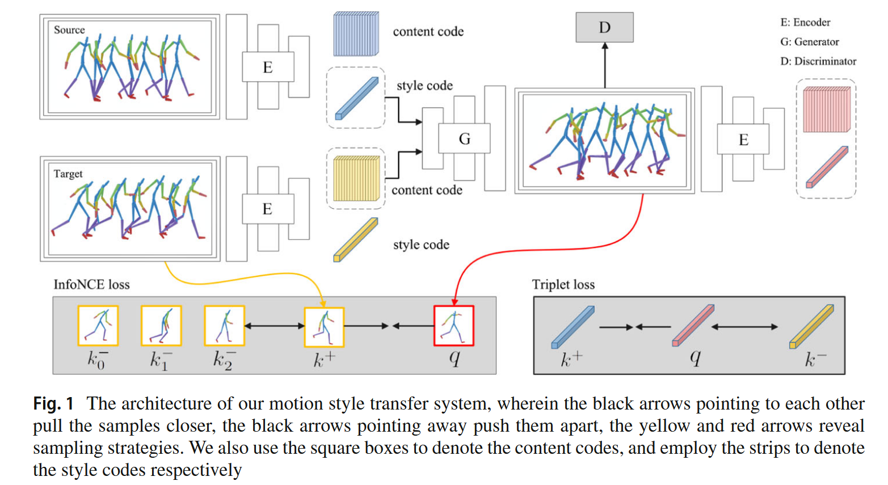
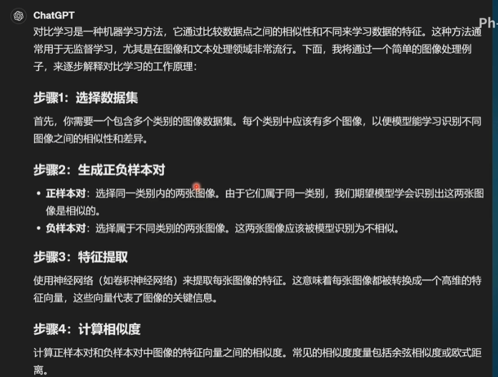
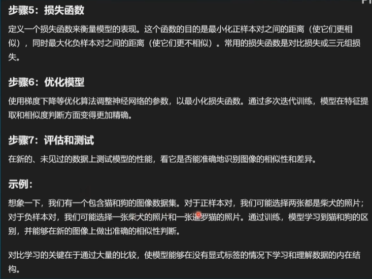
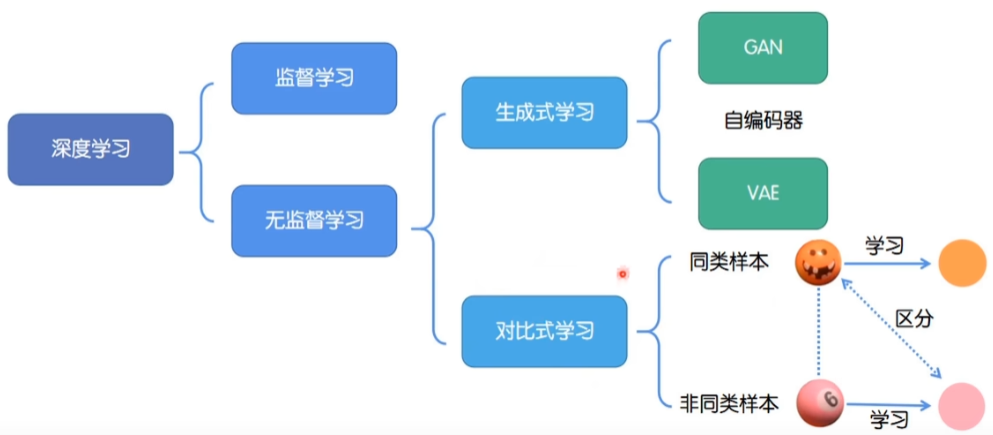
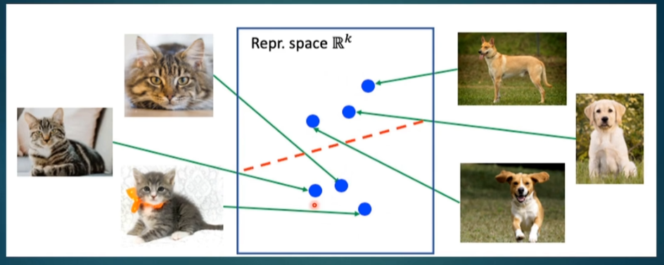
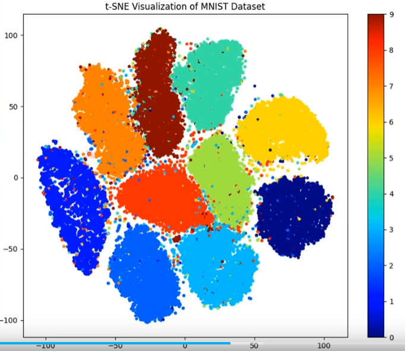
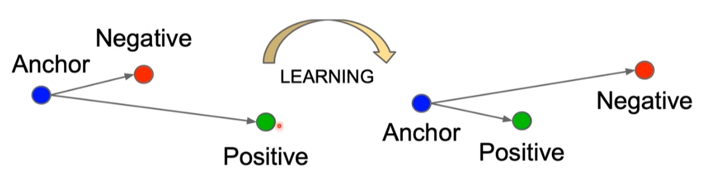
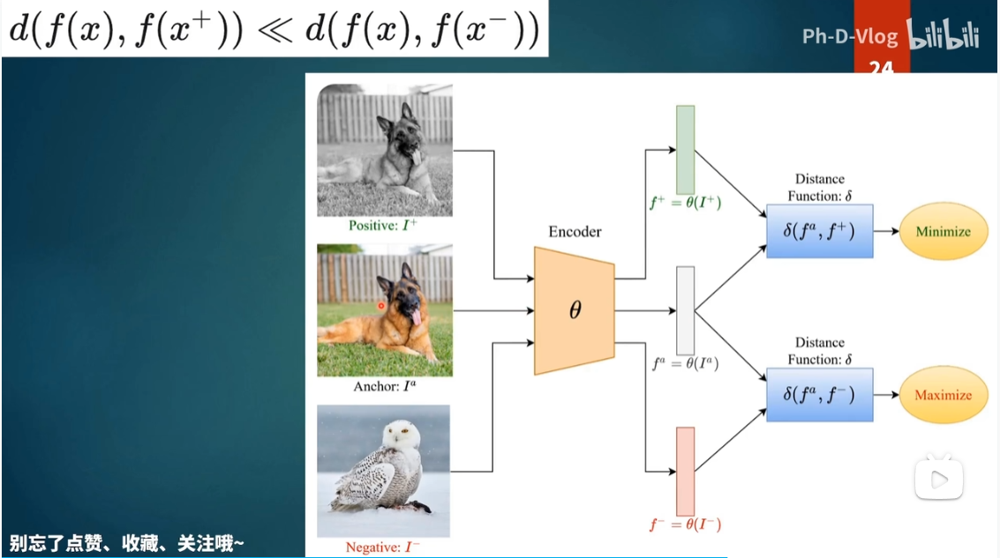
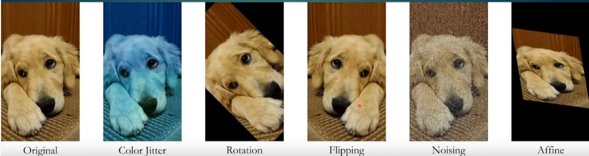

# 《Contrastive disentanglement for self-supervised motion style transfer》论文阅读

具体的Method相关内容会在后面进行更为详细的介绍。

**方法：对比学习。**

# 一、前置知识

## 1.对比学习

可以先看这个视频回顾一下：https://www.bilibili.com/video/BV1gb421p7jn/?spm_id_from=333.337.search-card.all.click

以下进行相关内容的介绍。

- 其实生成式学习很多就是**无监督学习的一种**，比如VAE，GAN这种。

假如以CV任务为例，互联网上有非常大量的未标注的图片或者是标注错误的图片，这在有监督学习中会造成问题，因此需要**无监督学习。**大概的思路如下：

这个思想其实有点像机器学习中的支持向量机SVM，让同类型的尽量靠近，不同类型的尽量远离。有一个东西叫做t-SNE，有做类似的事情。

> t-SNE 通过**概率建模**在高维和低维空间中分别计算数据点之间的相似度，并优化低维表示，使得两个空间中的概率分布尽可能一致。
>
> 
>
> 使用**高斯核**，相似度随距离增加而指数衰减。不过只是使用“距离”作为评判标准其实是不准的，比如“1”和“7”可能会发生混淆。而且肯定不能逐pixel来做，那一个常见的做法就是提取feature来做（比如卷积神经网络）。

对比学习的过程是怎么样的？

看Learning的左侧部分，首先我们设置一个锚点anchor，初始化的时候可能会得出错误的结果，比如离negative更近，而离positive更远。==通过不断的learning学习==，就可以离正样本更近，而离负样本更远。

> 从思想上来看，相当于直接让模型预测物体是什么可能不太容易，但让模型把类型分出来是相对容易的，同时对比学习更多的数据量会让效果也会比较好。

实际上的对比学习可能会产生问题：

> 每个图片都没有进行标注，这就意味着每个图片都是一张单独的图片（图片是孤立的）。

针对上面的问题，有两种常见的解决方案：

- （1）做一个半监督学习，人为的标注一些数据（小数量），可以有效进行学习；
- （2）进行data augumentation，比如上图，把狗的图片变成黑白的，这样虽然图片不一样，提取出来的feature不一样，但是同一个动物，这样原来的狗就可以作为anchor，数据增强的狗就可以作为正样本，而其他所有的样本都初始化为负样本。（这种叫做==代理任务，比如可以通过Mask做代理任务==）
  - 数据增强可以有很多种，比如：
  - 

> 代理任务的介绍：
>
> 在对比学习中，**代理任务（Pretext Task）** 是一种为模型设计的人为监督信号（自监督形式），用于从无标签数据中自动生成训练目标，从而学习有意义的特征表示。其核心思想是通过构造可自动生成标签的辅助任务，迫使模型捕捉数据的内在结构（如相似性、不变性等），而无需人工标注。
>
> ---
>
> ### **代理任务的核心作用**
> 1. **自动生成正负样本**：通过数据变换或关系建模，定义哪些样本应相似（正对）或不相似（负对）。
> 2. **引导特征学习**：通过优化代理任务的目标函数（如对比损失），模型学习区分不同样本的判别性特征。
>
> ---
>
> ### **代表性的代理任务及工作**
> 以下是几种经典的代理任务设计：
>
> #### 1. **实例判别（Instance Discrimination）**
> - **思想**：将每个样本及其数据增强版本视为正对，其他样本为负对。
> - **代表工作**：
>   - **MoCo（Momentum Contrast, CVPR 2020）**：通过队列存储负样本，结合动量编码器提升特征一致性。
>   - **SimCLR（ICML 2020）**：简单但高效，强调数据增强组合和更大的批尺寸以包含更多负样本。
>
> #### 2. **拼图重建（Jigsaw Puzzle）**
> - **思想**：对图像块进行随机排列，预测其原始位置或排列顺序。（==像这种工作就不是对比学习，但是引导特征学习可以使用代理任务来完成，拼图重建就是代理任务。==）
> - **代表工作**：  
>   - **Unsupervised Learning of Visual Representations by Solving Jigsaw Puzzles（ECCV 2016）**：通过解决拼图问题学习空间语义特征。
>
> #### 3. **掩码预测（Masked Prediction）**
> - **思想**：遮盖部分输入（如图像区域或文本词），预测被遮盖内容。
> - **代表工作**：
>   - **BEiT（ICLR 2022）**：对图像块进行掩码，预测离散视觉标记（类似BERT的文本掩码任务）。
>
> #### 4. **跨模态对齐（Cross-Modal Alignment）**
> - **思想**：利用不同模态（如图像-文本）的天然对应关系构建正负对。
> - **代表工作**：
>   - **CLIP（ICML 2021）**：对比学习对齐图像和文本的嵌入空间。
>
> #### 5. **时序一致性（Temporal Consistency）**
> - **思想**：视频中相邻帧或同一序列的不同片段应具有相似特征。
> - **代表工作**：
>   - **CPC（Contrastive Predictive Coding, NeurIPS 2018）**：通过预测未来时间步的潜在表示学习时序特征。
>
> ---
>
> ### **代理任务的设计原则**
> - **不变性假设**：代理任务需编码数据的关键不变性（如视角、光照等变化下的语义不变性）。
> - **难易平衡**：任务需足够复杂以迫使模型学习有用特征，但不可过于困难导致训练不稳定。
> - **计算效率**：避免生成正负对时引入过高开销（如MoCo的队列设计）。
>
> 代理任务是自监督学习的核心创新点，直接影响模型学到的特征质量。后续研究（如BYOL、SwAV等）进一步探索了无需显式负样本或更复杂的代理任务设计。

比较经典的对比学习的模型就是OpenAI提出来的CLIP模型，直接把多模态结合过来了。

### （1）CLIP工作的介绍

> **CLIP（Contrastive Language–Image Pre-training）** 是 OpenAI 在 2021 年提出的多模态预训练模型，其核心思想是通过**对比学习**对齐**图像**和**文本**的表示空间，从而实现强大的跨模态理解和迁移能力。以下是其核心要点：
>
> ---
>
> ### **1. 核心思想**
> - **目标**：让图像和文本的嵌入（embedding）在共享的向量空间中匹配——即相似的图像和文本应靠近，不相似的应远离。
> - **方法**：
>   - 使用**对比学习**（Contrastive Learning）训练一个**图像编码器**（如 ViT/ResNet）和**文本编码器**（如 Transformer）。
>   - 对一批图像-文本对，计算所有可能的图像和文本的相似度矩阵，通过**InfoNCE损失**最大化匹配对的相似度，最小化不匹配对的相似度。
>
> ---
>
> ### **2. 关键创新**
> - **数据规模**：  
>   利用互联网上**4亿对**（image, text）数据（如网页中的图片及其描述）进行训练，覆盖开放域场景。
> - **代理任务设计**：  
>   将图像-文本对视为天然的正样本，同一批次中的其他随机配对作为负样本，无需人工标注。
> - **零样本迁移**：  
>   训练完成后，可直接将文本编码器生成的类别标签（如“狗”、“飞机”）与图像编码器的特征匹配，实现**无需微调**的分类（如 ImageNet 零样本准确率达 76.2%）。
>
> ---
>
> ### **3. 训练流程**
> 1. **编码**：  
>    - 图像编码器提取图像特征向量$I_i$。  
>    - 文本编码器提取文本特征向量$T_j$。  
> 2. **对比学习**：  
>    - 计算所有$I_i$ 和$T_j$的余弦相似度矩阵。  
>    - 优化目标：让正样本对 $(I_i, T_i)$ 的相似度远高于负样本对 $(I_i, T_j)_{i \neq j}$和$(I_j, T_i)_{i \neq j}$。  
> 3. **损失函数**：  
>    对称的 InfoNCE 损失（图像到文本和文本到图像两个方向）。
>
> ---
>
> ### **4. 代表性结果**
> - **零样本分类**：  
>   在 ImageNet 上无需训练即可达到与全监督 ResNet-50 相当的性能（76.2% top-1）。  
> - **跨模态检索**：  
>   支持“以图搜文”或“以文搜图”，如输入“一只戴墨镜的狗”检索匹配图像。  
> - **鲁棒性**：  
>   对分布偏移（如艺术风格、抽象图像）表现优异，因训练数据覆盖广泛。
>
> ---
>
> ### **5. 影响与局限**
> - **优势**：  
>   - 打破传统视觉模型依赖固定类别标签的局限，支持开放词汇（open-vocabulary）任务。  
>   - 为多模态研究（如 DALL·E、Stable Diffusion）奠定基础。  
> - **局限**：  
>   - 对细粒度语义（如物体数量、空间关系）理解较弱。  
>   - 依赖大规模数据，计算成本高。
>
> ---
>
> ### **一句话总结**  
> CLIP 通过对比学习对齐图像和文本的表示空间，利用海量互联网数据实现强大的零样本跨模态迁移能力，推动了多模态领域的发展。

### （2）InfoNCE loss

# 二、论文本身

## 1.Related Work

### （1）human motion synthesis

论文里面提到的是GAN网络和一些以前的技术，现在应该都是Diffusion的天下了。

### （2）Motion Style Transfer

> ### **简要概括**  
> 该段落主要讨论了**运动风格迁移（Motion Style Transfer）**领域的研究进展，重点包括：  
> 1. **运动风格的定义**：通过情感、个性感知、社会特征等高层抽象概念描述运动风格。  
> 2. **传统方法**：使用线性时不变模型、高斯过程等工具进行风格迁移。  
> 3. **深度学习方法**：基于卷积自编码器、Gram矩阵、可控网络模块等实现风格迁移，但存在监督学习依赖、风格-内容耦合等问题。  
> 4. **最新进展**：无监督方法（如元网络、生成流模型）、时空图卷积网络（ST-GCN）的应用，以及对比学习框架的提出。  
>
> ---
>
> ### **Motion Style Transfer领域变革过程**  
> | **阶段**         | **代表性工作/技术**                | **贡献/局限**                                                |
> | ---------------- | ---------------------------------- | ------------------------------------------------------------ |
> | **早期探索**     | 线性时不变模型 [39]、高斯过程 [40] | 基于传统统计模型，迁移效果有限。                             |
> | **深度学习初期** | Holden等 [42, 2]                   | 首次将图像风格迁移技术（Gram矩阵）引入运动领域，但风格与内容强耦合。 |
> | **改进方法**     | Smith等 [44]                       | 提出可控网络模块和辅助风格标签，支持风格插值和混合。         |
> | **无监督迁移**   | Aberman等 [4]、Pan等 [5]           | 视频到运动的无监督迁移，但存在闪烁伪影（flickering artifacts）和风格-内容未解耦问题。 |
> | **时空建模**     | Park等 [7]、Jang等 [8]             | 基于ST-GCN的时空关系建模，但池化层导致关键关节信息丢失。     |
> | **最新方向**     | 对比学习框架（本文方法）           | 通过显式解耦风格编码和对比学习，提升生成运动的保真度和质量。 |
>
> ---
>
> ### **比较新的工作（2020年后）**  
> | **方法**                   | **核心创新**                                  | **问题**                              |
> | -------------------------- | --------------------------------------------- | ------------------------------------- |
> | **Aberman等 [4]**          | 视频到运动的无监督迁移，非对称网络设计。      | 风格与内容未完全解耦，依赖配对数据。  |
> | **Pan等 [5]**              | 元网络生成迁移网络，无监督学习。              | 均值-方差统计导致闪烁伪影，泛化性差。 |
> | **Wen等 [47]**             | 生成流模型直接处理内容/风格编码，无需预处理。 | 风格与内容仍耦合。                    |
> | **Park等 [7]、Jang等 [8]** | 基于ST-GCN的时空关节关系建模。                | 池化层导致关键信息丢失。              |
> | **本文方法**               | 对比学习框架 + 显式风格编码器。               | 无显著缺陷（需实验验证）。            |
>
> **趋势总结**：  
> 1. **无监督/自监督学习**：减少对标注数据的依赖（如[5,7]）。  
> 2. **时空建模**：利用图卷积（ST-GCN）捕捉关节关系。  
> 3. **解耦与可控性**：显式分离风格与内容（如本文的对比学习框架）。

### （3）Disentangled representation learning

**解耦表示学习（Disentangled Representation Learning）** 是一种机器学习方法，旨在将数据中的潜在生成因素（如形状、颜色、纹理等）分离成独立的、可解释的维度。其核心思想是让模型学到的表征中，每个维度仅对应一个独立的语义特征，且这些维度之间尽可能互不相关。这种表示有助于提高模型的可解释性、鲁棒性和迁移能力。

**核心目标**

1. **独立性**：表征的不同维度应对应数据中独立的生成因素（例如，在人脸数据中，身份和表情应分开编码）。
2. **可解释性**：每个维度应对应人类可理解的语义特征（如光照、旋转角度等）。
3. **泛化性**：解耦的表征应能迁移到新任务或数据分布中。

------

**与变分自编码器（VAE）的联系**

VAE 是解耦表示学习的经典框架之一。其通过以下机制促进解耦：

1. **隐变量先验**：VAE 假设隐变量 z 服从独立高斯分布（即 $p(z)=N(0,I)$），鼓励隐变量之间独立。
2. **正则化项**：VAE 的损失函数包含 KL 散度项 $D_{KL}(q(z∣x)∥p(z))$，迫使编码后的分布接近独立高斯分布，间接推动解耦。

**局限性**：标准 VAE 的解耦效果有限，因为 KL 散度项可能过于宽松，无法强制完全解耦。过度解耦可能导致信息丢失或生成质量下降。==有一些改进方案有遇到再说吧。==

### （4）对比学习

==todo：有时间看一下相关的工作，B站上有介绍：==

> ### **翻译：**  
> **对比学习（Contrastive Learning）** 近年来被广泛用于学习输入数据的丰富表征。其核心思想是学习一个表征函数，将语义相似的数据在嵌入空间中映射得更接近。例如：  
> - **对比预测编码（CPC）**[56] 开创了学习长期关系并预测未来部分潜在表征的方法。  
> - **动量对比（MoCo）**[57] 构建了动态字典用于对比学习，并利用实例判别任务进行无监督图像特征学习。  
>
> 目前，**负样本的选择**是对比学习范式中的关键挑战之一，它决定了所学表征的质量以及所使用的损失函数。根据不同的策略，经典方法包括 **InfoNCE**[56]、**Triplet**[58]、**Siamese**[59] 等。  
>
> ---
>
> ### **详细介绍对比学习及相关工作**  
>
> #### **1. 核心思想**  
> 对比学习通过拉近相似样本（正样本对）的嵌入距离，同时推开不相似样本（负样本对）的嵌入距离，从而学习有判别性的表征。其关键组件包括：  
> - **正样本对**：同一数据的不同增强视图（如裁剪、旋转后的同一图像）或语义相似的样本。  
> - **负样本对**：随机选择的不同数据样本（如不同图像的嵌入）。  
> - **损失函数**：衡量正负样本对的相似性（如InfoNCE、Triplet Loss）。  
>
> ---
>
> #### **2. 经典方法**  
>
> ##### **(1) InfoNCE（Noise-Contrastive Estimation）**  
> - **提出工作**：CPC（Contrastive Predictive Coding, [Oord et al., 2018]）[56]  
> - **原理**：  
>   - 通过预测未来时间步的潜在表征（如音频或文本序列）学习长期依赖关系。  
>   - 使用**InfoNCE损失**，将正样本（真实未来序列）与负样本（随机采样的其他序列）对比：  
>     $$
>     
>     $$
>     $$
>     \mathcal{L} = -\log \frac{\exp(s_q \cdot k_+ / \tau)}{\sum_{i=1}^N \exp(s_q \cdot k_i / \tau)}
>     $$
>     
>     其中 $ s_q $ 是查询向量（当前表征），$k_+ $ 是正样本键，$k_i $ 是负样本键，$ \tau $ 是温度系数。  
> - **特点**：  
>   
>   - 通过噪声对比估计最大化互信息（Mutual Information）。  
>   - 广泛应用于自监督学习（如MoCo、SimCLR）。  
>
> ##### **(2) Triplet Loss**  
> - **提出工作**：FaceNet（Schroff et al., 2015）[58]  
> - **原理**：  
>   - 每个样本由**锚点（Anchor）**、**正样本（Positive）**和**负样本（Negative）**组成，损失函数强制正样本比负样本更接近锚点：  
>     $$
>     \mathcal{L} = \max(d(a, p) - d(a, n) + \alpha, 0)
>     $$
>     其中 $d(\cdot) $ 是距离度量（如欧氏距离），$\alpha $ 是边界超参数。  
> - **特点**：  
>   
>   - 适用于细粒度相似性学习（如人脸识别、推荐系统）。  
>   - 对负样本质量敏感，需精心设计采样策略（如难样本挖掘）。  
>
> ##### **(3) Siamese Networks（孪生网络）**  
> - **经典工作**：早期用于签名验证（Chopra et al., 2005）[59]  
>
> - **原理**：  
>   - 共享权重的双分支网络，输入一对样本，输出相似度得分。  
>   - 损失函数可以是**对比损失（Contrastive Loss）**：  
>     $$
>     \mathcal{L} = y \cdot d(x_1, x_2)^2 + (1-y) \cdot \max(\alpha - d(x_1, x_2), 0)^2
>     $$
>   
>   其中 \( y=1 \) 表示正样本对，\( y=0 \) 表示负样本对。
>   
> - **特点**：  
>   
>   - 简单高效，但依赖显式的正负样本对构造。  
>   - 后续改进包括**Triplet Network**（扩展为三元组输入）。  
>
> ---
>
> #### **3. 其他关键工作**  
>
> ##### **(4) MoCo（Momentum Contrast, He et al., 2020）[57]**  
> - **核心思想**：  
>   - 构建动态字典（Dynamic Dictionary）存储负样本，通过动量更新编码器（Key Encoder）保持字典一致性。  
>   - 使用InfoNCE损失进行对比学习。  
> - **贡献**：  
>   - 解决端到端对比学习中负样本数量受限的问题。  
>   - 在无监督图像分类（ImageNet）上接近监督学习性能。  
>
> ##### **(5) SimCLR（Chen et al., 2020）**  
> - **核心思想**：  
>   - 简单但强大的框架：对同一图像做两次随机增强，通过对比损失最大化一致性。  
>   - 引入**非线性投影头（Projection Head）**提升表征质量。  
> - **贡献**：  
>   - 证明数据增强和大批量训练对对比学习至关重要。  
>
> ---
>
> #### **4. 负样本选择的挑战**  
> - **数量与质量**：  
>   - 更多负样本能提升表征判别性（如MoCo的字典机制），但可能引入无关噪声。  
>   - 难负样本（Hard Negatives）对性能至关重要（如Triplet Loss中的难样本挖掘）。  
> - **最新进展**：  
>   - **Debiased Contrastive Learning**：解决负样本中的假阴性问题（如相同类别的样本被误判为负样本）。  
>   - **Cluster-based Methods**：通过聚类生成伪标签替代显式负样本（如SwAV）。  
>
> ---
>
> ### **总结**  
> 对比学习通过显式构造正负样本对学习表征，其中：  
> - **InfoNCE**（CPC、MoCo）适合大规模无监督学习。  
> - **Triplet Loss** 适用于细粒度相似性任务。  
> - **Siamese Networks** 是早期对比学习的基石。  
> 未来方向包括更高效的负样本策略、与生成模型（如扩散模型）的结合等。
