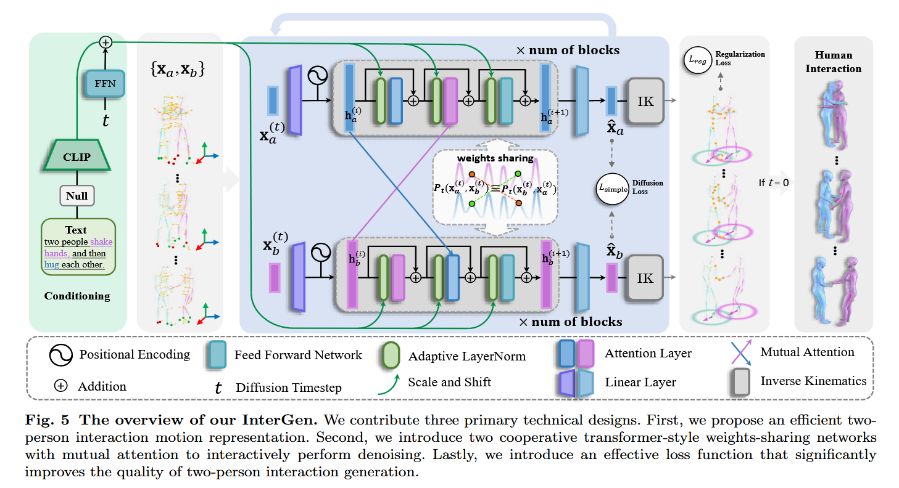
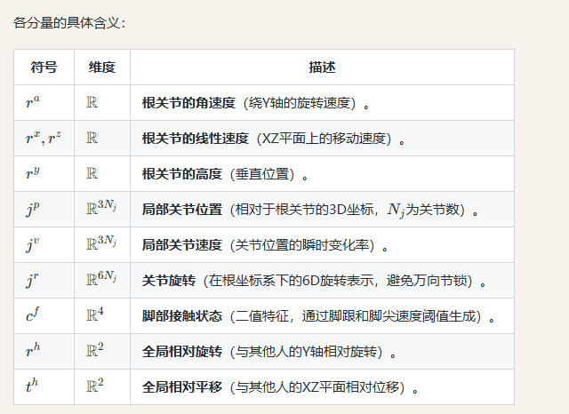
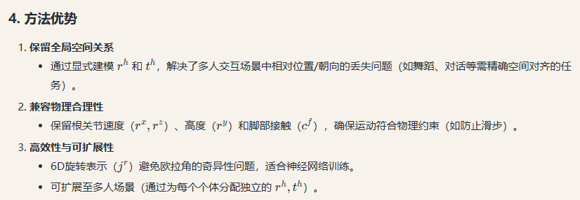
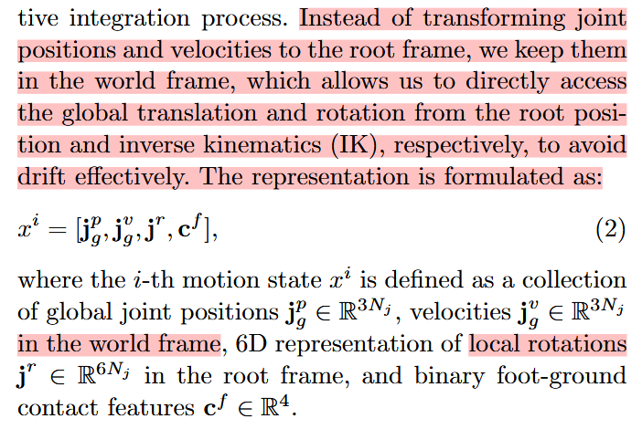
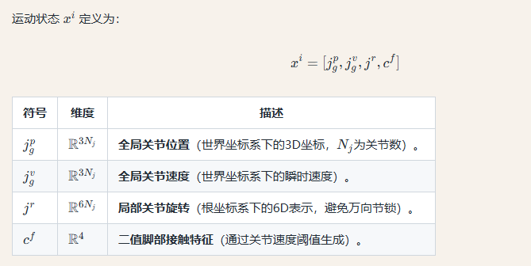
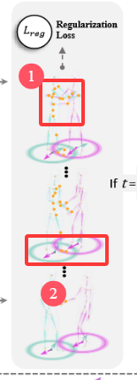

# 可以参考借鉴的论文模块

> 如果有需要的话，再去细看。==暂时就记录参考的一大堆文章中的创新点，可以用于我们的工作中去的。==

# 一、双人交互+IK

## 1.InterGen: Diffusion-based Multi-human Motion Generation under Complex Interactions

https://github.com/tr3e/InterGen?tab=readme-ov-file

> ### 摘要总结：
> 这篇论文提出了**InterGen**，一种基于扩散模型的方法，用于生成高质量的双人交互动作，仅需文本引导即可定制。主要贡献包括：
> 1. **数据集**：构建了多模态数据集**InterHuman**，包含约1.07亿帧的双人交互动作数据，附带精确的骨骼运动和23,337条自然语言描述。
> 2. **算法设计**：
>    - 针对双人交互场景优化了运动扩散模型，提出**两个协作的Transformer去噪器**，通过权重共享和互注意力机制连接两角色的去噪过程。
>    - 提出**新颖的运动表示方法**，显式建模两角色在世界坐标系中的全局关系。
>    - 引入**两种空间关系正则化项**及对应的阻尼训练方案，增强模型对空间关系的建模能力。
> 3. **效果**：实验表明InterGen生成的交互动作比现有方法更多样、逼真，并支持多种下游应用。
>
> ### 是否了解这篇文章：
> 了解。这篇论文的核心创新点在于：
> 1. **多模态交互数据集**（InterHuman）：填补了双人交互动作数据的大规模标注空白。
> 2. **对称协作去噪架构**：通过权重共享的Transformer和互注意力机制，解决交互动作中角色对称性的建模难题。
> 3. **全局运动表示与空间正则化**：显式编码双人空间关系，结合阻尼训练提升稳定性。
>
> 该方法首次将扩散模型扩展到可控的双人交互生成，突破了传统单人生成框架的限制。

这篇文章的Method有解决下面几个问题：

- （1）多人交互的话，动作信息如何编码进去？==其实相当于HumanML3D只包含单人的，如果要做多人可以额外提供什么信息？==可以考虑在世界空间下做，然后用IK来做约束。参考本篇论文的思路。
- （2）Human Interaction Diffusion的步骤：==这篇文章对Diffusion的描述比较有意思，可以借鉴写法，不是那种最传统的公式介绍。==
  - ==Interaction Diffusion部分==：有需要可以复习。
- （3）Additional Regularization Losses：文章要设计什么样的损失函数呢？

### （1）动作信息编码

> ### **1. 问题背景**
>
> - **Com-MDM (Shafir et al., 2023)** 的局限性：
>   传统运动表示（如基于局部坐标系的方法）会丢失**全局空间关系**（例如两人交互时的相对位置和朝向）。Com-MDM尝试通过预测两人初始的相对旋转（rotation）和平移（translation）来缓解这一问题，但未在运动状态中持续建模这些信息。
>
> 而本文编码了如下的动作信息：
>
> ---
>
> ### **1. 运动状态表示（公式1）**
> 运动状态 \( x^i \) 被定义为以下分量的拼接向量：  
> $$
> x^i = [r^a, r^x, r^z, r^y, j^p, j^v, j^r, c^f, r^h, t^h]
> $$
>
> 各分量的具体含义：  
>
> 
>
> 
>
> 刚才的是canonical（标准化的）的表达方式，以下介绍原论文中提到的non-canonical的表达方式：
>
> 这两段文字描述了一项关于**多人运动表示方法**的研究，核心是**传统方法（Canonical Representation）的缺陷**和**新提出的非规范表示（Non-Canonical Representation）的解决方案**。以下是分点解析：
>
> ---
>
> ### **1. 传统方法的缺陷**
> #### **问题：累积漂移（Drift）**
> - **原因**：  
>   ==传统方法（Canonical Representation）通过积分**局部关节速度**来计算全局位置。由于运动捕捉数据中的速度测量存在噪声，积分会导致误差累积，产生**指数级增长的轨迹漂移**（随时间推移，位置误差无限增大）。==
>   - 引用：Von Marcard et al. (2017) 已证明这一问题。
>
> #### **影响场景**：
> - **单人短序列运动合成**：  
>   漂移影响较小，因为只需关注局部动作的合理性（如走路、跑步），无需精确全局位置。  
> - **多人运动合成**：  
>   漂移是灾难性的！因为多人交互（如舞蹈、握手）依赖**个体间精确的空间关系**（距离、朝向）。漂移会导致人物位置错乱，破坏交互真实性。
>
> ---
>
> ### **2. 新方法：非规范表示**
> #### **解决方案**  
> 直接使用**世界坐标系下的绝对运动参数**，避免积分过程。  
> - **关键改进**：  
>   - ==不再将关节位置/速度转换到局部根坐标系（Root Frame），而是**直接保留在世界坐标系（World Frame）**。==
>   - 通过**逆向运动学（IK）**从根关节位置反推全局旋转，避免漂移。
>
> 
>
> #### **数学表示（公式2）**  
> 运动状态 $x^i$定义为：  
> $$
> x^i = [j_g^p, j_g^v, j^r, c^f]
> $$
> 
>
> #### **优势**  
>
> 1. **消除漂移**：直接使用世界坐标，无需积分噪声速度。  
> 2. **保持空间关系**：多人交互时，个体间的距离/朝向精确无误。  
> 3. **兼容性**：仍保留局部旋转$j^r$以支持动作细节生成。
>
> ---
>
> ### **3. 总结对比**
> | **维度**     | **传统方法（Canonical）** | **新方法（Non-Canonical）**               |
> | ------------ | ------------------------- | ----------------------------------------- |
> | **坐标系**   | 局部根坐标系              | 世界坐标系 + 局部根旋转                   |
> | **漂移问题** | 严重（积分噪声速度）      | 无（直接使用绝对坐标）                    |
> | **适用场景** | 单人短序列                | 多人长序列交互                            |
> | **计算方式** | 需积分速度推算位置        | ==直接读取世界坐标 + IK逆解==(也是种思路) |
>
> ---
>
> ### **4. 研究意义**
> - **多人运动合成**：为舞蹈、体育、协作任务等提供高保真运动生成基础。  
> - **技术延伸**：可结合扩散模型或GAN，生成文本/条件驱动的复杂交互动作。  
> - **数据友好性**：适用于现有运动捕捉数据集（如AMASS、HumanML3D）的预处理。
>

### （2）mutual attention的介绍

> **Mutual Attention（互注意力机制）** 是InterGen模型中用于生成双人交互动作的核心组件，其核心思想是通过让两个并行的Transformer网络（分别处理人物A和人物B的动作序列 `Xa` 和 `Xb`）在生成过程中动态关注对方的动作信息，从而建模两人之间的交互依赖关系。
>
> ---
>
> ### **Mutual Attention的定义与作用**
> 1. **基本概念**  
>    - 在传统的Transformer中，自注意力（Self-Attention）用于捕捉序列内部的关系（如单个人物动作帧间的依赖）。  
>    - **Mutual Attention扩展了这一思想**：在双网络架构中，每个网络不仅计算自身序列的自注意力，还会通过交叉注意力（Cross-Attention）机制实时关注另一网络的序列。  
>    - 例如：生成人物A的当前动作时，模型会参考人物B的历史动作（如伸手动作可能触发A的握手反应）。
>
> 2. **技术实现**  
>    - **输入**：两个网络的隐藏状态 `h_a`（人物A）和 `h_b`（人物B）。  
>    - **注意力计算**：  
>      - 对于网络A，其Mutual Attention层会以 `h_a` 作为Query，`h_b` 作为Key和Value，计算注意力权重并融合B的信息。  
>      - 网络B同理，形成双向信息交换。  
>    - **公式示意**：  
>      $$
>      \text{Attention}(Q_A, K_B, V_B) = \text{softmax}\left(\frac{Q_A K_B^T}{\sqrt{d_k}}\right) V_B
>      $$
>      其中 \(Q_A\) 来自 `h_a`，\(K_B, V_B\) 来自 `h_b`。
>
> 3. **权重共享**  
>    
>    - InterGen的两个网络共享Mutual Attention层的参数（如投影矩阵），确保交互建模的一致性，同时减少计算开销。
>
> ---
>
> ### **Mutual Attention的典型应用场景**
> 1. **双人动作生成**  
>    - 如握手、拥抱、对话等场景，要求两人的动作在时空上严格协调（如握手时手臂伸出的时机和位置匹配）。  
>    - **示例**：生成“两人击掌”时，Mutual Attention会确保两人的手掌运动轨迹在接触点对齐。
>
> 2. **多智能体交互建模**  
>    - 在机器人协作、==游戏NPC交互中，Mutual Attention可用于预测其他智能体的行为并调整自身策略。==
>
> 3. **多模态时序数据同步**  
>    - 如视频-音频对齐、多视角动作捕捉，==通过Mutual Attention关联不同模态或视角的时序特征。==
>
> ---
>
> ### **与传统方法的区别**
> - **vs. 自注意力（Self-Attention）**  
>   仅建模单序列内部关系，无法直接捕获跨个体的交互。  
> - **vs. 简单的串联输入**  
>   若将 `Xa` 和 `Xb` 拼接后输入单一网络，可能因序列过长导致注意力分散，而Mutual Attention通过显式分离计算更高效。
>
> ---
>
> ### **InterGen中的具体实现**
> 1. **网络架构**  
>    - 每个Transformer块包含：  
>      - 自注意力层（处理自身序列）  
>      - ==Mutual Attention层（处理对方序列）==
>      - FFN和层归一化（Adaptive LayerNorm）。  
>    - 通过多块堆叠实现深层交互建模。
>
> 2. **训练目标**  
>    - 结合扩散损失（`Lsimple`）和正则化损失（`Lreg`），Mutual Attention帮助生成既符合文本描述又物理合理的交互动作。
>
> ---
>
> ### **总结**
> Mutual Attention是一种专为交互式生成设计的注意力机制，通过双向信息交换实现跨序列的动态协调。在InterGen中，它解决了双人动作的时空同步问题，是生成逼真交互动作的关键技术。其思想也可推广到其他需要多序列协同建模的任务中。

### （3）Additional Regularization Losses

==除了MDM说明的==（其实就是大家都在用的损失函数）：对应的知识点记录在《《MotionLCM》论文及代码相关》这篇笔记里。
$$
\begin{equation}
    \mathcal{L} = \mathcal{L}_{\text{simple}} + \lambda_{\text{pos}} \mathcal{L}_{\text{pos}} + \lambda_{\text{vel}} \mathcal{L}_{\text{vel}} + \lambda_{\text{foot}} \mathcal{L}_{\text{foot}}
    \label{eq:6}
\end{equation}
$$
对于InterGen这篇文章中的Non-Canonical Representation方法（也就是在世界空间做，用IK反解出关节姿态），引入了骨骼长度损失函数$\mathcal{L}_{BL}$来约束每个人的全局关节位置，以满足骨骼一致性，这隐式编码了人体运动学结构。将骨骼长度损失函数定义如下：

$$
\mathcal{L}_{BL} = ||B(\hat{x}_a) - B(x_a)||^2_2 + ||B(\hat{x}_b) - B(x_b)||^2_2 \quad (11)
$$

其中$B$表示基于预定义的人体运动学树计算的骨骼长度，由全局关节位置$x$推导而来。（原文：where B represents the bone lengths in a pre-defined human body kinematic tree, derived from the global joint positions in x.）每段骨骼的长度是一个值，所以$||B(\hat{x}_a) - B(x_a)||$相当于两个向量之间的距离。

- Interactive losses：这部分去看论文原文即可，大概就是两个人的joint distance map，以及两个人的Relative Orientation损失，其实看总的网络结构就能看懂这俩损失函数了：
- 
- 上图的①就是joint distance map这一项， ②就是relative orientation这一项。