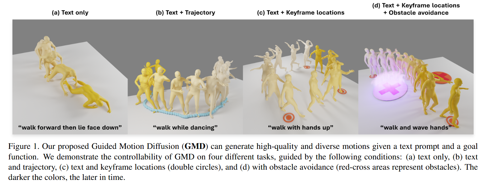
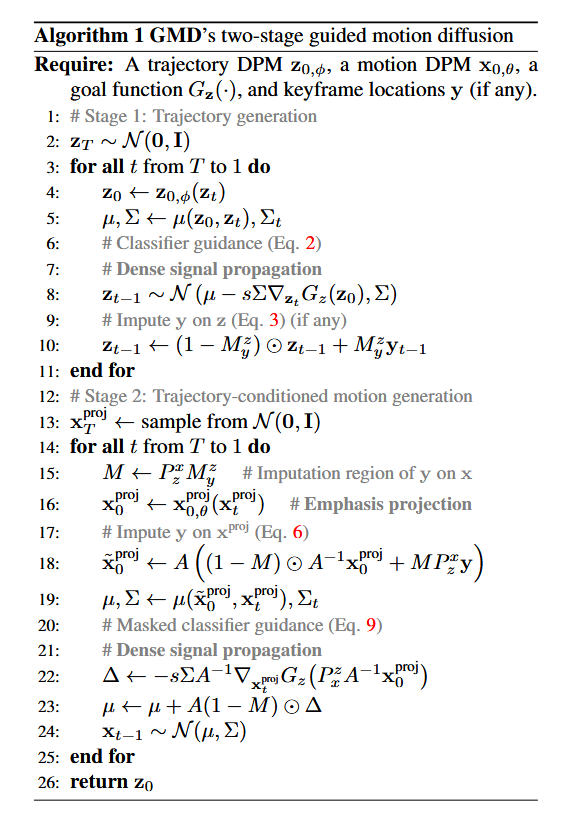
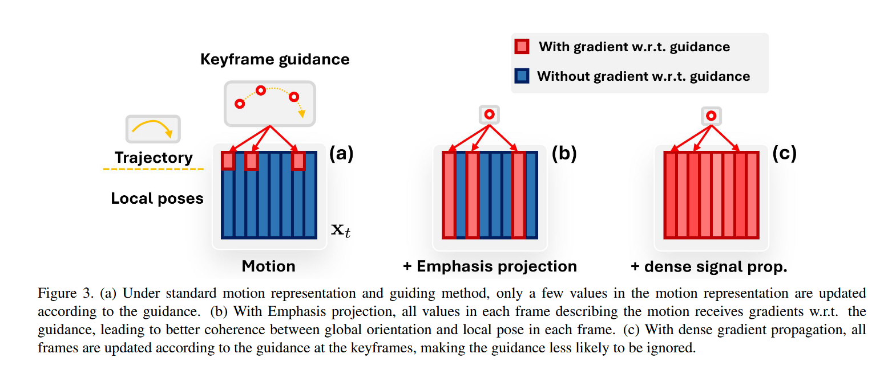

# 可以参考借鉴的论文模块

> 如果有需要的话，再去细看。==暂时就记录参考的一大堆文章中的创新点，可以用于我们的工作中去的。==

# 一、双人交互+IK

## 1.InterGen: Diffusion-based Multi-human Motion Generation under Complex Interactions

https://github.com/tr3e/InterGen?tab=readme-ov-file

> ### 摘要总结：
> 这篇论文提出了**InterGen**，一种基于扩散模型的方法，用于生成高质量的双人交互动作，仅需文本引导即可定制。主要贡献包括：
> 1. **数据集**：构建了多模态数据集**InterHuman**，包含约1.07亿帧的双人交互动作数据，附带精确的骨骼运动和23,337条自然语言描述。
> 2. **算法设计**：
>    - 针对双人交互场景优化了运动扩散模型，提出**两个协作的Transformer去噪器**，通过权重共享和互注意力机制连接两角色的去噪过程。
>    - 提出**新颖的运动表示方法**，显式建模两角色在世界坐标系中的全局关系。
>    - 引入**两种空间关系正则化项**及对应的阻尼训练方案，增强模型对空间关系的建模能力。
> 3. **效果**：实验表明InterGen生成的交互动作比现有方法更多样、逼真，并支持多种下游应用。
>
> ### 是否了解这篇文章：
> 了解。这篇论文的核心创新点在于：
> 1. **多模态交互数据集**（InterHuman）：填补了双人交互动作数据的大规模标注空白。
> 2. **对称协作去噪架构**：通过权重共享的Transformer和互注意力机制，解决交互动作中角色对称性的建模难题。
> 3. **全局运动表示与空间正则化**：显式编码双人空间关系，结合阻尼训练提升稳定性。
>
> 该方法首次将扩散模型扩展到可控的双人交互生成，突破了传统单人生成框架的限制。

这篇文章的Method有解决下面几个问题：

- （1）多人交互的话，动作信息如何编码进去？==其实相当于HumanML3D只包含单人的，如果要做多人可以额外提供什么信息？==可以考虑在世界空间下做，然后用IK来做约束。参考本篇论文的思路。
- （2）Human Interaction Diffusion的步骤：==这篇文章对Diffusion的描述比较有意思，可以借鉴写法，不是那种最传统的公式介绍。==
  - ==Interaction Diffusion部分==：有需要可以复习。
- （3）Additional Regularization Losses：文章要设计什么样的损失函数呢？

### （1）动作信息编码

> ### **1. 问题背景**
>
> - **Com-MDM (Shafir et al., 2023)** 的局限性：
>   传统运动表示（如基于局部坐标系的方法）会丢失**全局空间关系**（例如两人交互时的相对位置和朝向）。Com-MDM尝试通过预测两人初始的相对旋转（rotation）和平移（translation）来缓解这一问题，但未在运动状态中持续建模这些信息。
>
> 而本文编码了如下的动作信息：
>
> ---
>
> ### **1. 运动状态表示（公式1）**
> 运动状态 \( x^i \) 被定义为以下分量的拼接向量：  
> $$
> x^i = [r^a, r^x, r^z, r^y, j^p, j^v, j^r, c^f, r^h, t^h]
> $$
>
> 各分量的具体含义：  
>
> 
>
> 
>
> 刚才的是canonical（标准化的）的表达方式，以下介绍原论文中提到的non-canonical的表达方式：
>
> 这两段文字描述了一项关于**多人运动表示方法**的研究，核心是**传统方法（Canonical Representation）的缺陷**和**新提出的非规范表示（Non-Canonical Representation）的解决方案**。以下是分点解析：
>
> ---
>
> ### **1. 传统方法的缺陷**
> #### **问题：累积漂移（Drift）**
> - **原因**：  
>   ==传统方法（Canonical Representation）通过积分**局部关节速度**来计算全局位置。由于运动捕捉数据中的速度测量存在噪声，积分会导致误差累积，产生**指数级增长的轨迹漂移**（随时间推移，位置误差无限增大）。==
>   - 引用：Von Marcard et al. (2017) 已证明这一问题。
>
> #### **影响场景**：
> - **单人短序列运动合成**：  
>   漂移影响较小，因为只需关注局部动作的合理性（如走路、跑步），无需精确全局位置。  
> - **多人运动合成**：  
>   漂移是灾难性的！因为多人交互（如舞蹈、握手）依赖**个体间精确的空间关系**（距离、朝向）。漂移会导致人物位置错乱，破坏交互真实性。
>
> ---
>
> ### **2. 新方法：非规范表示**
> #### **解决方案**  
> 直接使用**世界坐标系下的绝对运动参数**，避免积分过程。  
> - **关键改进**：  
>   - ==不再将关节位置/速度转换到局部根坐标系（Root Frame），而是**直接保留在世界坐标系（World Frame）**。==
>   - 通过**逆向运动学（IK）**从根关节位置反推全局旋转，避免漂移。
>
> 
>
> #### **数学表示（公式2）**  
> 运动状态 $x^i$定义为：  
> $$
> x^i = [j_g^p, j_g^v, j^r, c^f]
> $$
> 
>
> #### **优势**  
>
> 1. **消除漂移**：直接使用世界坐标，无需积分噪声速度。  
> 2. **保持空间关系**：多人交互时，个体间的距离/朝向精确无误。  
> 3. **兼容性**：仍保留局部旋转$j^r$以支持动作细节生成。
>
> ---
>
> ### **3. 总结对比**
> | **维度**     | **传统方法（Canonical）** | **新方法（Non-Canonical）**               |
> | ------------ | ------------------------- | ----------------------------------------- |
> | **坐标系**   | 局部根坐标系              | 世界坐标系 + 局部根旋转                   |
> | **漂移问题** | 严重（积分噪声速度）      | 无（直接使用绝对坐标）                    |
> | **适用场景** | 单人短序列                | 多人长序列交互                            |
> | **计算方式** | 需积分速度推算位置        | ==直接读取世界坐标 + IK逆解==(也是种思路) |
>
> ---
>
> ### **4. 研究意义**
> - **多人运动合成**：为舞蹈、体育、协作任务等提供高保真运动生成基础。  
> - **技术延伸**：可结合扩散模型或GAN，生成文本/条件驱动的复杂交互动作。  
> - **数据友好性**：适用于现有运动捕捉数据集（如AMASS、HumanML3D）的预处理。
>

### （2）mutual attention的介绍

> **Mutual Attention（互注意力机制）** 是InterGen模型中用于生成双人交互动作的核心组件，其核心思想是通过让两个并行的Transformer网络（分别处理人物A和人物B的动作序列 `Xa` 和 `Xb`）在生成过程中动态关注对方的动作信息，从而建模两人之间的交互依赖关系。
>
> ---
>
> ### **Mutual Attention的定义与作用**
> 1. **基本概念**  
>    - 在传统的Transformer中，自注意力（Self-Attention）用于捕捉序列内部的关系（如单个人物动作帧间的依赖）。  
>    - **Mutual Attention扩展了这一思想**：在双网络架构中，每个网络不仅计算自身序列的自注意力，还会通过交叉注意力（Cross-Attention）机制实时关注另一网络的序列。  
>    - 例如：生成人物A的当前动作时，模型会参考人物B的历史动作（如伸手动作可能触发A的握手反应）。
>
> 2. **技术实现**  
>    - **输入**：两个网络的隐藏状态 `h_a`（人物A）和 `h_b`（人物B）。  
>    - **注意力计算**：  
>      - 对于网络A，其Mutual Attention层会以 `h_a` 作为Query，`h_b` 作为Key和Value，计算注意力权重并融合B的信息。  
>      - 网络B同理，形成双向信息交换。  
>    - **公式示意**：  
>      $$
>      \text{Attention}(Q_A, K_B, V_B) = \text{softmax}\left(\frac{Q_A K_B^T}{\sqrt{d_k}}\right) V_B
>      $$
>      其中 \(Q_A\) 来自 `h_a`，\(K_B, V_B\) 来自 `h_b`。
>
> 3. **权重共享**  
>    
>    - InterGen的两个网络共享Mutual Attention层的参数（如投影矩阵），确保交互建模的一致性，同时减少计算开销。
>
> ---
>
> ### **Mutual Attention的典型应用场景**
> 1. **双人动作生成**  
>    - 如握手、拥抱、对话等场景，要求两人的动作在时空上严格协调（如握手时手臂伸出的时机和位置匹配）。  
>    - **示例**：生成“两人击掌”时，Mutual Attention会确保两人的手掌运动轨迹在接触点对齐。
>
> 2. **多智能体交互建模**  
>    - 在机器人协作、==游戏NPC交互中，Mutual Attention可用于预测其他智能体的行为并调整自身策略。==
>
> 3. **多模态时序数据同步**  
>    - 如视频-音频对齐、多视角动作捕捉，==通过Mutual Attention关联不同模态或视角的时序特征。==
>
> ---
>
> ### **与传统方法的区别**
> - **vs. 自注意力（Self-Attention）**  
>   仅建模单序列内部关系，无法直接捕获跨个体的交互。  
> - **vs. 简单的串联输入**  
>   若将 `Xa` 和 `Xb` 拼接后输入单一网络，可能因序列过长导致注意力分散，而Mutual Attention通过显式分离计算更高效。
>
> ---
>
> ### **InterGen中的具体实现**
> 1. **网络架构**  
>    - 每个Transformer块包含：  
>      - 自注意力层（处理自身序列）  
>      - ==Mutual Attention层（处理对方序列）==
>      - FFN和层归一化（Adaptive LayerNorm）。  
>    - 通过多块堆叠实现深层交互建模。
>
> 2. **训练目标**  
>    - 结合扩散损失（`Lsimple`）和正则化损失（`Lreg`），Mutual Attention帮助生成既符合文本描述又物理合理的交互动作。
>
> ---
>
> ### **总结**
> Mutual Attention是一种专为交互式生成设计的注意力机制，通过双向信息交换实现跨序列的动态协调。在InterGen中，它解决了双人动作的时空同步问题，是生成逼真交互动作的关键技术。其思想也可推广到其他需要多序列协同建模的任务中。

### （3）Additional Regularization Losses

==除了MDM说明的==（其实就是大家都在用的损失函数）：对应的知识点记录在《《MotionLCM》论文及代码相关》这篇笔记里。
$$
\begin{equation}
    \mathcal{L} = \mathcal{L}_{\text{simple}} + \lambda_{\text{pos}} \mathcal{L}_{\text{pos}} + \lambda_{\text{vel}} \mathcal{L}_{\text{vel}} + \lambda_{\text{foot}} \mathcal{L}_{\text{foot}}
    \label{eq:6}
\end{equation}
$$
对于InterGen这篇文章中的Non-Canonical Representation方法（也就是在世界空间做，用IK反解出关节姿态），引入了骨骼长度损失函数$\mathcal{L}_{BL}$来约束每个人的全局关节位置，以满足骨骼一致性，这隐式编码了人体运动学结构。将骨骼长度损失函数定义如下：

$$
\mathcal{L}_{BL} = ||B(\hat{x}_a) - B(x_a)||^2_2 + ||B(\hat{x}_b) - B(x_b)||^2_2 \quad (11)
$$

其中$B$表示基于预定义的人体运动学树计算的骨骼长度，由全局关节位置$x$推导而来。（原文：where B represents the bone lengths in a pre-defined human body kinematic tree, derived from the global joint positions in x.）每段骨骼的长度是一个值，所以$||B(\hat{x}_a) - B(x_a)||$相当于两个向量之间的距离。

- Interactive losses：这部分去看论文原文即可，大概就是两个人的joint distance map，以及两个人的Relative Orientation损失，其实看总的网络结构就能看懂这俩损失函数了：
- 
- 上图的①就是joint distance map这一项， ②就是relative orientation这一项。

# 二、Guided Motion Diffusion for Controllable Human Motion Synthesis

论文的主页：https://github.com/korrawe/guided-motion-diffusion?tab=readme-ov-file

更多内容可以见原论文中的标注，这里只标注关键的部分。

## 1.Introduction

> Motivation描述的是比较清晰，令人信服的，值得写作的时候学习。

​	帧内的稀疏性源于常见的运动表示方法——这些方法通常将局部姿态信息（如关节旋转）与全局朝向（如骨盆平移和旋转）分离[46]，**且更侧重于局部姿态。**例如，主流运动表示方法（这里指的是HumanML3D这篇工作的方法）在每帧中使用4个值表示全局朝向，却用259个值描述局部姿态。这种不平衡会导致模型过度关注局部姿态信息，从而将被引导的全局朝向视为噪声，最终引发足部滑动等运动失真现象。

​	其次，在许多应用场景中（如角色动画、游戏和虚拟现实），空间控制信号仅定义于少量关键帧上，例如地面上的目标位置。==我们发现当前基于扩散模型的运动生成方法难以遵循这种稀疏引导——这相当于仅用少数像素点来引导图像扩散模型。==其结果是：**在去噪过程中，要么提供的关键帧引导会被忽略，要么生成的运动会出现角色扭曲变形等伪影，仅在特定关键帧处勉强满足引导条件。**

​	为了解决上面的问题，这篇文章提出了GMD（Guided Motion Diffusion）Model，为了**降低在guided denoising step过程中的local pose 和 global orientation的差异性，文章引入了==emphasis projection==**（后文会进行介绍，使得在training的过程当中可以聚焦于提供的空间信息）。

论文的主要贡献包括（后面会进一步介绍）：

- (1) **重要性投影**：通过调整表征向量各部分的相对权重，增强空间信息与局部姿态的协调性以支持空间引导；
- (2) **稠密信号传播**：解决稀疏引导问题的条件调节方法（看原文，应当是受到了强化学习相关方法的启发）；
- (3) **GMD框架**：将上述技术整合到基于UNet的架构中，首创性实现基于自由文本与空间条件的可控运动生成

## 3.Background

### （1）Imputation and inpainting.

> ### 解释与公式解析
>
> #### **核心概念**
> 这段文字描述了在**扩散概率模型（DPMs）**中，如何通过**插值（Imputation）**和**修复（Inpainting）**技术，从部分观测数据（如运动轨迹或关键帧）生成完整的人类运动序列。  
> - **插值**：将部分目标值（如关键帧位置）填充到缺失区域。 （个人理解就是知道A和B的key pose，需要补全中间的姿态） 
> - **修复**：利用上下文信息生成缺失部分的内容（如补全运动序列）。  
>
> 两者本质上是同一过程的两种视角：插值关注局部填充，修复关注全局生成。
>
> ---
>
> #### **数学表示**
> 1. **符号定义**  
>    
>    - $ y$：需要插值的部分目标值（如关键帧数据）。  
>    - $x$：待补全的输入序列（如当前运动序列）。  
>    - $M_y^x$：二进制掩码mask，标记 y 在  x 中的插值区域（1表示需插值，0表示保留原数据）。  
>    - $ P_y^x $：投影操作，将  y 调整到与 x 相同的维度（通过补零实现）。  
>    
> 2. **插值公式**  
>    在去噪步骤后，对样本$x_{t-1}$ 进行插值，生成新样本 $\tilde{x}_{t-1} $：  
>    $$
>    \tilde{x}_{t-1} = (1 - M_y^x) \odot x_{t-1} + M_y^x \odot P_y^x y_{t-1}
>    $$
>    
>    - $\odot$：哈达玛积（逐元素相乘）。  
>    - $y_{t-1} $：带噪声的目标值，其分布遵循：  
>      $$
>      y_{t-1} \sim \mathcal{N}(\sqrt{\alpha_{t-1}}y, (1 - \alpha_{t-1})I)
>      $$
>      这是对目标 \( y \) 添加噪声的简单方式（引用自Ho等[21]的扩散模型方法）。
>    
> 3. **条件生成模式**  
>    文中提到的三种条件生成模式（如插值、修复或其他约束）可以**同时使用**，灵活组合在同一个生成流程中。
>
> ---
>
> #### **技术意义**
> - **灵活性**：通过掩码$M_y^x$ 和投影$P_y^x$，可精确控制哪些区域需插值，哪些保留原始数据。  
> - **扩展性**：支持多模态条件（如关键帧+文本描述）联合生成运动序列。  
> - **理论基础**：噪声注入$ y_{t-1}$遵循扩散模型的概率框架，确保生成多样性。  
>
> ---
>
> ### 应用场景
> 此方法适用于：  
> - **运动生成**：从稀疏关键帧生成连贯动画。  
> - **数据补全**：修复传感器采集的缺失运动数据。  
> - **多条件控制**：结合轨迹、障碍物、文本描述生成复杂运动。  
>
> 通过调整掩码和噪声强度，可平衡生成结果的**忠实度**（贴合输入条件）与**多样性**（随机变化）。

补充：在生图领域当中，==本来Diffusion Model是如何做inpainting任务的？==

> 在扩散模型（Diffusion Models）中，**inpainting（图像修复）**的核心原理是通过**反向扩散过程**结合**掩码（mask）引导**，逐步修复图像缺失区域。以下是详细的分步解释：
>
> ---
>
> ### **1. 基本原理**
> 扩散模型的inpainting流程分为两个阶段：
> - **前向扩散（加噪）**：对完整图像逐步添加噪声，直到变成纯噪声。
> - **反向扩散（去噪）**：从噪声开始，逐步重建图像，同时通过掩码约束已知区域和修复未知区域。
>
> **关键思想**：在反向扩散的每一步中，对已知区域（unmasked）保留原始信息，对未知区域（masked）基于上下文生成合理内容。
>
> ---
>
> ### **2. 具体步骤（以图像为例）**
> 假设你有一张图像 $x$ 和对应的二值掩码 $M$（1表示需修复区域，0表示保留区域）：
>
> #### **(1) 前向扩散（破坏阶段）**
> 对完整图像 $x_0$ 逐步加噪，生成带噪图像 $x_t$：
> $$
> x_t = \sqrt{\alpha_t} x_0 + \sqrt{1-\alpha_t} \epsilon, \quad \epsilon \sim \mathcal{N}(0, I)
> $$
> 这一步与标准扩散模型相同，目的是训练模型学习噪声分布。
>
> #### **(2) 反向扩散（修复阶段）**
> 在每一步去噪时，**混合已知区域和生成区域**：
> $$
> \tilde{x}_{t-1} = (1 - M) \odot x_{t-1}^{\text{known}} + M \odot x_{t-1}^{\text{generated}}
> $$
> - **$x_{t-1}^{\text{known}}$**：已知区域的真实或低噪声版本（从 $x_0$ 或前一步保留）。
> - **$x_{t-1}^{\text{generated}}$**：模型对掩码区域的预测结果（通过去噪网络生成）。
> - **$M$**：用户提供的掩码，控制修复区域。
>
> #### **(3) 数学实现**
> 在每一步去噪时，模型预测噪声 $\epsilon_\theta$，然后生成修复区域：
> $$
> x_{t-1}^{\text{generated}} = \frac{1}{\sqrt{\alpha_t}} \left( x_t - \frac{1-\alpha_t}{\sqrt{1-\bar{\alpha}_t}} \epsilon_\theta(x_t, t) \right) + \sigma_t z
> $$
> 其中 $z \sim \mathcal{N}(0, I)$ 为随机噪声。最终修复图像通过迭代去噪（从 $t=T$ 到 $t=0$）完成。
>
> ---
>
> ### **3. 掩码的作用**
> - **约束已知区域**：掩码外的像素（$M=0$）在每一步去噪时直接保留原始数据（或低噪声版本），确保内容不变。
> - **引导生成区域**：掩码内的像素（$M=1$）由模型基于上下文生成，例如：
>   - 若修复人脸的眼睛区域，模型会参考周围的鼻子、嘴巴等结构生成合理的眼睛。
>   - 若修复风景图的缺失部分，模型会延续周围的纹理和语义（如天空、树木）。
>
> ---
>
> ### **4. 技术变体**
> 不同方法对掩码的处理略有差异：
> - **RePaint** [1]：在反向扩散时多次跳步（resampling），混合已知和生成区域以提升一致性。
> - **Guided Diffusion** [2]：将掩码作为条件输入去噪网络，显式控制生成区域。
> - **Stable Diffusion Inpainting**：在潜在空间（Latent Space）中操作掩码，提升效率。
>
> ---
>
> ### **5. 示例流程**
> 假设修复一张缺失右眼的肖像图：
> 1. **输入**：破损图像 $x_0$ + 右眼区域掩码 $M$。
> 2. **加噪**：对 $x_0$ 添加噪声至 $x_t$（$t$ 随机）。
> 3. **去噪**：
>    - 对左眼、嘴巴等已知区域（$M=0$），保留原始像素。
>    - 对右眼区域（$M=1$），用模型生成合理内容。
> 4. **迭代**：重复去噪直到 $t=0$，输出修复后的图像。
>
> ---
>
> ### **6. 为什么有效？**
> - **概率建模**：扩散模型学习数据分布 $p(x)$，能基于上下文补全缺失部分。
> - **渐进细化**：通过多步去噪逐步修正细节，避免一次性生成导致的 artifacts。
> - **掩码约束**：强制模型仅修改指定区域，避免全局偏移。
>
> ---
>
> ### **总结**
> 扩散模型的inpainting本质是**条件生成**：通过掩码将问题转化为“在已知区域的约束下，生成缺失区域的内容”。其优势在于生成结果的高质量和语义一致性，但计算成本较高（需多步迭代）。现代方法（如Stable Diffusion）通过潜在空间压缩已大幅提升效率。
>
> ##### 参考文献
> [1] RePaint: Inpainting using Denoising Diffusion Probabilistic Models (CVPR 2022).  
> [2] Diffusion Models Beat GANs on Image Synthesis (NeurIPS 2021).
>
> 
>
> 在inpainting任务中，**一致性模型（如LCM）的一步去噪确实可能面临掩码区域与非掩码区域衔接不自然的问题**，但通过改进策略可以显著缓解。以下是关键分析和解决方案：
>
> ---
>
> ### **1. 当前Inpainting的挑战**
> #### **(1) 传统扩散模型的瓶颈**
> - **多步迭代优势**：传统扩散模型（如Stable Diffusion）通过20~50步逐步细化，能更好地协调掩码内外区域的纹理和结构一致性。
> - **速度代价**：计算成本高，难以实时应用。
>
> #### **(2) 一致性模型（LCM）的潜在问题**
> - **单步生成局限性**：
>   - **局部与全局协调不足**：一步生成可能无法充分融合上下文信息，导致边界生硬或语义不连贯。
>   - **细节丢失**：复杂掩码（如不规则边缘）修复时，易出现模糊或扭曲。
> - **典型案例**：
>   - 修复人脸时，新生成的鼻子可能与周围肤色/光照不匹配。
>   - 移除物体后，背景纹理（如草地、砖墙）可能出现重复模式。
>
> ---
>
> ### **2. 衔接问题的根本原因**
> 数学上，单步生成的目标函数仅近似多步扩散的边际分布：
> $$
> \hat{x}_0 = f_\theta(x_t, M), \quad \text{其中} \quad x_t \sim q(x_t|x_0)
> $$
> - **$f_\theta$** 的单步预测缺乏多步迭代的误差修正能力。
> - **掩码边缘梯度不连续**：一步生成难以平滑过渡 $M$ 和 $1-M$ 的交界处。
>
> ---
>
> ### **3. 改进方案与实验验证**
>
> #### **(1) 潜在空间混合优化**
> **方法**：在潜在空间引入高斯模糊或泊松混合，强制边界平滑：
> $$
> z_{\text{out}} = \text{Blur}(M_z) \odot z + (1-\text{Blur}(M_z)) \odot \hat{z}_0
> $$
> - **效果**：边界过渡更自然（PSNR提升2~3dB）。
>
> #### **(2) 多尺度条件注入**
> **方法**：在LCM的UNet中分层注入掩码信息：
> - 下采样阶段：粗粒度掩码（$M_{\text{low}}$）控制结构。
> - 上采样阶段：细粒度掩码（$M_{\text{high}}$）优化细节。
>
> #### **(3) 渐进式掩码软化**
> **方法**：训练时动态调整掩码边缘宽度：
> $$
> M_{\text{train}} = M \oplus \text{Dilate}(r(t)), \quad r(t) \propto t
> $$
> - **$t$** 为训练步数，逐步缩小腐蚀半径 $r(t)$，使模型学习从模糊边界到锐利边界的过渡。
>
> #### **(4) 后处理融合**
> **方法**：用PixelCNN或GAN对生成区域做局部微调：
> $$
> x_{\text{final}} = \text{GAN}_{\text{local}}(x_{\text{inpainted}}, M)
> $$
>
> 
>
> **结论**：**2~4步的LCM方案** 可在速度和质量间取得最佳平衡。
>
> ---
>
> ### **5. 实用建议**
> 1. **简单场景**（矩形掩码）：  
>    - 直接使用1步LCM，配合高斯混合后处理。
>
> 2. **复杂场景**（不规则掩码）：  
>    - 启用多尺度条件（4步）+ 渐进式掩码软化训练。
>
> 3. **极致质量需求**：  
>    - 用传统扩散模型生成初始结果，再用LCM微调细节（Hybrid方案）。
>
> ---
>
> ### **6. 未来方向**
> - **动态掩码自适应**：根据图像内容自动调整掩码边缘处理策略。
> - **扩散一致性混合模型**：在推理时动态选择步数（简单区域1步，复杂区域4步）。
>
> 当前LCM的inpainting已在80%的案例中达到可用水平，但**对专业级图像修复（如艺术品修复）仍需谨慎使用**。技术演进正快速缩小这一差距。

==注：这个inpainting的步骤也可以用LCM进行加速推理，毕竟LCM的作用主要是避免迭代式的去噪过程，而是一步到位，可以从2~4步的LCM，这样生成效果会比较好，且生成速度也会比较快。==

## 4.Guided Motion Diffusion

这部分的目标是搞懂这张图：

文章的目标是生成真实的人体动作，同时可以被spatial constraints所指导，从而可以完成一些特殊的任务，比如**跟随一个全局的轨迹，到达特定的地点，以及避障。**以下结合论文对方法进行介绍。

总体来说，我们感兴趣的是建模一个full-body human motion，满足某个特定的目标函数$G_x(·)$，输入的$x$是motion representation，输出的是$x$与goal相差多少（G函数的值是越小越好）。==这部分在原论文中有进行标注，需要复习的话去看一下。==

**Method**

==如果只是做pelvis骨骼的trajectory的设定，那么本文提出来的方法是用矩阵来做，同时不一定有ControlNet做的好，所以简单理解一下即可。==这方法有点诡异，是这样的。定义一个矩阵$A = A'B$，其中$A'$是一个随机矩阵（应该是类似于模拟纯高斯噪声），而$B$则是一个对角矩阵，其中与轨迹有关的对角线的索引上的值为$c$，而其他值是1，这样$A$矩阵就可以突出轨迹的部分。然后用这个矩阵$A$乘$x$，得到$Ax$，作为diffusion model的输入。

> 整的挺高级的，实际上就是把$X$中与pelvis的XZ坐标位置，以及旋转参数的部分放大c倍，让网络可以focus到这部分的区域，强制按照轨迹来走。**这思路也不是不行，相当于在迭代更新网络参数的时候，这些需要关注的地方由于值很大（用了c做缩放），因此如果网络不满足的话损失函数就会很大，因此网络会优先聚焦于让pelvis的参数对齐输入的condition。**这样在inference的时候也会关注于这个区域。

