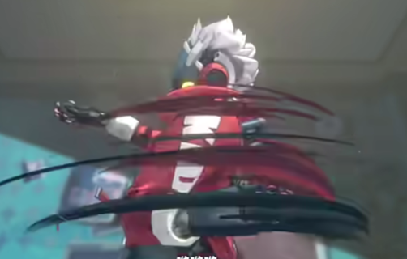

可以考虑的方向：

【评估难度：:star::star::star::star::star:】夸张化动作：比如这个视频里的：https://www.bilibili.com/video/BV1fQ4y1Z7b6/?spm_id_from=333.337.search-card.all.click&vd_source=f0e5ebbc6d14fe7f10f6a52debc41c99，做这个相关的生成，也没人做。再比如https://www.bilibili.com/video/BV1r6ayeKE94/?spm_id_from=333.337.search-card.all.click&vd_source=f0e5ebbc6d14fe7f10f6a52debc41c99，这个视频也是。==但这个方向非常缺数据集，同时物理的约束比较难做，但感觉很创新。==

- 

- 

- 

- 

- 

- （3）【评估难度：:star::star::star:(:star:)​】个性化人体运动生成

  针对特定人物（如虚拟偶像、虚拟形象）实现个人独特风格迁移/保持（如走法、手势、速度节奏等，可以比如提供一段视频进行学习），可用于虚拟人、虚拟试衣、游戏个性化定制等领域。