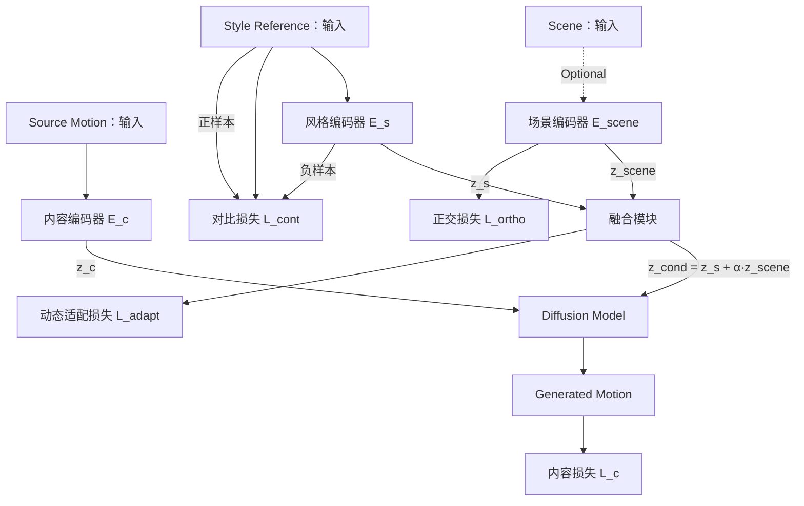

# 论文结构

# 一 基础版（无场景）

- step 1：dataset准备：Youtube/Tiktok等视频网站：找Style对应的视频（小样本验证：10种style，每种100个视频）,或者已有的数据集也可以：例如style100数据集

  - 搜索关键词：【情绪表演】，【情绪动作】等，这样就有了标签（可以用作对比学习的anchor，没有也没事）。
  - 已有的数据集也可以，带有动作序列和风格标签的。

- step 2：对比学习

  - 设计两个编码器Encoder（可以train，$\Epsilon_s$和$\Epsilon_c$，本质上可以是train一个网络）：输入的是从数据集视频提取出来的动作序列$M_i$（有现有模型），输出的是两个向量：$z_c$和$z_s$，分别表示content（动作本身）和style（动作风格）（可以通过最后用两个投影头）。对比学习的目标是style，同类别style会相近，不同类别style会远离。

    - 由于style来源是视频提取的动作序列，可以做一些机制使得模型更多关注主要的身体部位，以及动作序列可以显式包含关键部位的运动频率和幅度。

    - 数据预处理：正样本：把每种style的每个原始视频切成等份，每一份都是同样的style，经过数据增强（比如加轻微噪声或旋转）后为正样本，其他为负样本。可以使用K-means先做粗分类，或是分层的结构(粗到细之类的)

    - 损失函数的设计：

      - （1）对比损失：InfoNCE
      - （2）解耦约束（解决风格和内容的模糊性）：正交损失，目的是让$z_c$和$z_s$不相关，强制让内容和风格特征独立，不互相污染。
        - ==创新点1：==多粒度对比，不仅对比全局风格，还对比局部片段（手部动作 vs 腿部动作），比如说手的幅度和脚的幅度在不同风格中差异会更明显。举个例子：现有模型无法在风格化的时候做出不同部位的不同风格（比如拳击：下半身非常稳定，上半身非常激进），这个在demo阶段可以设置为参数。

    - （可选）潜在问题与解决方案：

      - 1、统一风格内动作差异太大，比如说跳舞，街舞比较有节奏，古典舞比较优雅
- 解决方案：
        
  - 1） 分层对比学习。

可能需要再认真设计一下，如何更精准地把content和style解耦开。这部分也可以设计对应的消融实验，来验证模块的可行性。

- step 3：finetune一个motion diffusion模型（对比学习完毕，模型Frozen掉）
  - 网络设计上，可以嫁接一个ControlNet/LoRA（可能LoRA更合适，更接近风格化的需求），也可以用一个cross attention之类的模块（adaptor都可以）。
  - 训练过程：喂给motion diffusion模型的是style视频编码出来的$z_s$和提供的source motion->$z_c$：
    - 损失函数：
      - （1）diffusion loss；
      - （2）identity loss：把生成的动作用$\Epsilon_s$编码器得到style，这个style要和喂进去的style尽可能接近（style loss）；以及可以把source motion和生成的motion再通过$\Epsilon_c$编码后看损失（content loss）。
      - （3）（可选）做一个判别器，判别生成的动作是否比较真实，会有判别器损失；
      - （4）骨骼姿态的loss，比如脚在地上，防止关节不自然扭曲等；
      - （5）和原动作关键关节的损失：目的是不让风格化后的动作偏差太多
      - （6）生成过程中$z_c$和$z_s$也要有正交约束，确保无交互。
- step 4：
- contribution：可以生成数据集里没有的风格（Application部分），可以通过视频生成->动作提取->正常生成

可以补充一个整体套在外面的VAE，在latent space下做，可以降低运算量。	
=======
可以补充一个整体套在外面的VAE，在latent space下做，可以降低运算量。

# 二、对场景的引入，使得风格化模型支持场景

- 现有的数据集几乎都不包含场景，但我们希望我们的模型可以依据场景变换实现风格化。
- 核心：==构建一个场景的编码器==（$E_{sc}$）
- 1.数据集构建：
  - 通过关键词搜索在视频网站中提取人物的动作，同一动作关键词+不同场景，构建数据集（比如每个动作20个不同场景，各爬取10个，20*10=200个动作，找20种不同的动作）。如果不好构建数据集的话，也可以喂大量的视频，由大模型来输出视频的场景信息，用于后续辅助训练。
- 2.训练过程：将不同场景的同一动作（其实场景隐含了风格）扔进前面的风格编码器，利用Frozen的风格编码器输出的风格，来训练场景编码器理解场景对风格的影响。这部分具体的思路是：
  - $E_{sc},E_{c},E_{S}$在场景理解阶段是共享权重的，用三个投影头进行输出。
  - 在上面的阶段一，场景编码器是不起作用的，我们希望模型可以聚焦于已有数据集中场景以外的部分。在场景编码器训练的过程中，最终输出的$z_s$会结合场景编码器输出的$z_{sc}$（两者做混合权重的插值，或者连接起来（**独立开也可以，需要做实验验证**），在训练阶段可以每次随机一个插值的系数（如果独立开就用别的方式），使得模型学会联合本来风格+场景信息），
    - ==消融实验：==去掉场景编码器，直接把对应的场景给LLM，让其输出style，喂进没有场景编码器的模型当中，看看结果的对比。
  - 损失函数设计：
    - （1）对比损失：结合了场景+视频的style  **场景-风格对比损失（Scene-Style Contrastive Loss）**
    - （2）场景分类损失：确保场景编码可被解码为人类可理解的类别，可以直接用分类任务对应的损失函数，比如交叉熵。在实际inference或demo阶段的时候，是可以不需要分类头的；
    - （3）内容正交损失：和前面类似，要尽量保证场景融合style的向量，不会影响到本来的content向量
- 训练之后，可能不需要对diffusion的过程进行finetune，因为输出的$z_s$基本格式不变，当然应该也可以适当finetune一下。

