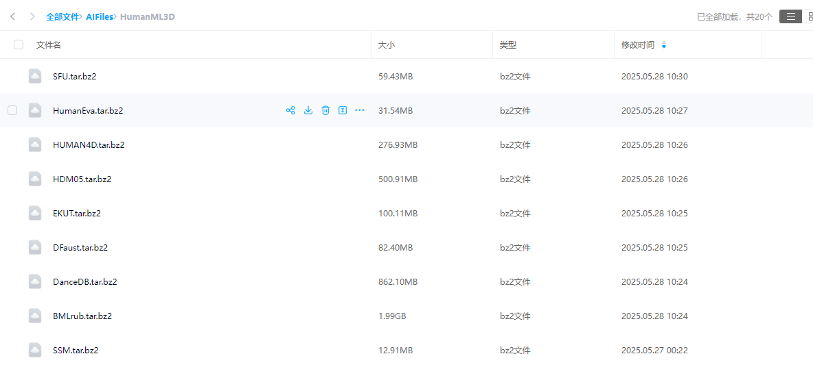
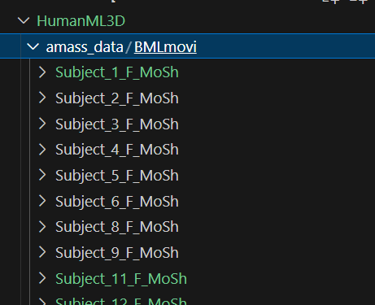

# HumanML3D 数据集的配置文档

去这里下载：https://amass.is.tue.mpg.de/download.php

首先进入这个网站：https://amass.is.tue.mpg.de/download.php，这里有很多数据集，==Note only download the SMPL+H G data.==

全部下载到百度网盘上，如下图：




# 一、在远程AutoDL服务器上从百度网盘上下载数据集并解压

这里提供了一个bash脚本来做这件事，在百度网盘中下载，并下载到指定的文件夹下面。脚本的路径如下：
```bash
/root/autodl-tmp/download_HumanML3D.bash
```

这里包含下载，解压两步操作，完成之后，AutoDL的目录结构应该类似于下图：


# 二、批处理脚本：AMASS->HumanML3D

这一步要跑三个ipynb文件。

You need to run the following scripts in order to obtain HumanML3D dataset:

1. raw_pose_processing.ipynb
2. motion_representation.ipynb：这个跑完似乎数值有一些误差，但应该问题不大，==暂时记录一下，差0.0033731135和0.018185599==
3. cal_mean_variance.ipynb


先阅读一下https://github.com/EricGuo5513/HumanML3D/blob/main/raw_pose_processing.ipynb，这个文件，看看我们都要做些什么。

首先进入这个网站：https://amass.is.tue.mpg.de/download.php，这里有很多数据集，==Note only download the SMPL+H G data.==。暂时只是尝试的话，都下载不太现实，我们下一个动作稍微多一些的，选这个：[BMLmovi](http://www.biomotionlab.ca/movi/)

然后上传到服务器上，在仓库根目录下创建一个文件夹：amass_data，然后把下载后的没有解压的文件放进去，然后进入到对应的文件目录中，解压：

```shell
tar -xvjf BMLmovi.tar.bz2
```

接下来就可以跑上面的三个ipynb文件了，记得要安装比如jupyter notebook相关的运行环境（VS Code会直接给出提示，按照提示来即可。）

==注意，解压之后要把tar.bz2本来的压缩文件和license.txt文件都删掉，只留下面的文件夹：==



所以其实需要我们做一步move的操作，把对应的解压后的文件都放到HumanML3D/amass_data路径下面。

move的批处理脚本如下：（直接在autodl-tmp路径下面）

```bash
#!/bin/bash

# 当前操作目录 (脚本将在此目录内执行清理和移动)
SOURCE_DIR="/root/autodl-tmp/HumanML3D/HumanML3D_amass_data"

# 目标父目录 (解压后的文件夹将被移动到此目录下)
# *** 重要：请确认这个目标路径是正确的，并且不同于 SOURCE_DIR ***
# 如果目标路径与 SOURCE_DIR 相同，移动操作将没有意义或可能出错。
# 我假设一个示例目标路径，请修改为你实际的、不同的目标路径。
DESTINATION_PARENT_DIR="/root/autodl-tmp/HumanML3D/HumanML3D/HumanML3D/amass_data/" 
# 或者，如果你是想把 SOURCE_DIR 自身重命名/移动，比如：
# DESTINATION_PARENT_DIR="/root/autodl-tmp/HumanML3D/"
# 然后移动 SOURCE_DIR 到 DESTINATION_PARENT_DIR 下并改名为 amass_data_final

# 定义日志文件路径
LOG_FILE="$(dirname "$0")/cleanup_amass_data.log" # 日志文件与脚本放在同目录

# 函数：记录日志并输出到终端
log() {
    local message="$1"
    echo "$(date '+%Y-%m-%d %H:%M:%S') - ${message}" | tee -a "$LOG_FILE"
}

# 主执行逻辑
main() {
    # 初始化日志文件
    mkdir -p "$(dirname "$LOG_FILE")"
    >"$LOG_FILE"
    log "脚本 cleanup_and_move_amass_data.bash 开始执行"
    log "当前操作目录 (SOURCE_DIR): ${SOURCE_DIR}"
    log "目标父目录 (DESTINATION_PARENT_DIR): ${DESTINATION_PARENT_DIR}"

    # 检查源目录是否存在
    if [ ! -d "${SOURCE_DIR}" ]; then
        log "错误：源目录 ${SOURCE_DIR} 不存在！脚本终止。"
        exit 1
    fi

    # 进入源目录
    cd "${SOURCE_DIR}" || {
        log "错误：无法进入源目录 ${SOURCE_DIR}！脚本终止。"
        exit 1
    }
    log "已进入目录: $(pwd)"

    # --- 1. 删除指定文件 ---
    log "开始删除 .tar.bz2 文件和 LICENSE.txt 文件..."

    # 删除所有 .tar.bz2 文件
    # 使用 find 更安全，特别是如果文件名可能包含特殊字符
    # -maxdepth 1 确保只删除当前目录下的，不删除子目录内的
    local files_to_delete_count=0
    find . -maxdepth 1 -type f -name "*.tar.bz2" -print0 | while IFS= read -d $'\0' -r file_to_delete; do
        log "准备删除文件: ${file_to_delete}"
        if rm -f "${file_to_delete}"; then
            log "文件 ${file_to_delete} 已成功删除。"
            files_to_delete_count=$((files_to_delete_count + 1))
        else
            log "错误：删除文件 ${file_to_delete} 失败。"
        fi
    done

    # 删除 LICENSE.txt (如果存在)
    if [ -f "LICENSE.txt" ]; then
        log "准备删除文件: LICENSE.txt"
        if rm -f "LICENSE.txt"; then
            log "文件 LICENSE.txt 已成功删除。"
            files_to_delete_count=$((files_to_delete_count + 1))
        else
            log "错误：删除文件 LICENSE.txt 失败。"
        fi
    else
        log "文件 LICENSE.txt 未找到，无需删除。"
    fi
    log "文件删除阶段完成。共尝试删除 ${files_to_delete_count} 个匹配项（包括LICENSE.txt）。"
    log "-----------------------------------------------------"

    # --- 2. 移动剩余的目录 ---
    log "开始移动剩余的目录到 ${DESTINATION_PARENT_DIR}..."

    # 创建目标父目录（如果它不存在）
    mkdir -p "${DESTINATION_PARENT_DIR}"
    if [ $? -ne 0 ]; then
        log "错误：无法创建目标父目录 ${DESTINATION_PARENT_DIR}！移动操作中止。"
        # 返回到原始目录，以防后续操作在错误的位置
        cd - > /dev/null
        exit 1
    fi

    local moved_dirs_count=0
    # 查找当前目录下的所有目录 (不包括 '.' 和 '..')
    # -maxdepth 1 确保只移动当前目录下的顶层目录
    find . -maxdepth 1 -type d -not -name '.' -print0 | while IFS= read -d $'\0' -r dir_to_move; do
        # dir_to_move 会是 ./dirname，我们需要去掉 ./
        local clean_dir_name="${dir_to_move#./}"
        
        # 确保不是空的（find有时会返回'.'，虽然我们用 -not -name '.' 排除了）
        if [ -z "${clean_dir_name}" ]; then
            continue
        fi

        log "准备移动目录: ${clean_dir_name} 到 ${DESTINATION_PARENT_DIR}/"
        
        # 目标路径
        local target_path="${DESTINATION_PARENT_DIR}/${clean_dir_name}"

        # 如果目标已存在，mv 的行为取决于目标是文件还是目录
        # 如果目标是目录，源目录会被移动到目标目录下。
        # 如果目标是文件，会报错。
        # 为了避免歧义，我们可以先检查目标路径是否已作为目录存在
        if [ -d "${target_path}" ]; then
            log "警告：目标目录 ${target_path} 已存在。移动操作可能会合并内容或根据mv行为处理。"
            # 你可以在这里决定是否先删除目标目录，或者让 mv 处理（通常是合并）
            # 例如，要强制覆盖（先删除目标），可以取消注释下一行：
            # log "将先删除已存在的目标目录: ${target_path}"
            # rm -rf "${target_path}"
        fi

        if mv "${clean_dir_name}" "${DESTINATION_PARENT_DIR}/"; then
            log "目录 ${clean_dir_name} 已成功移动到 ${DESTINATION_PARENT_DIR}/"
            moved_dirs_count=$((moved_dirs_count + 1))
        else
            log "错误：移动目录 ${clean_dir_name} 失败。"
        fi
        log "---" # 目录移动分隔符
    done

    if [ ${moved_dirs_count} -eq 0 ]; then
        log "在 ${SOURCE_DIR} (清理后) 没有找到任何目录需要移动。"
    else
        log "共 ${moved_dirs_count} 个目录已成功尝试移动。"
    fi
    log "目录移动阶段完成。"
    log "-----------------------------------------------------"

    # 返回到脚本开始时的目录（或者一个安全的位置）
    cd - > /dev/null 
    log "已返回到之前的目录。"

    log "脚本 cleanup_and_move_amass_data.bash 执行完毕"
}

# 执行主函数
main
```


## 1.三个批处理脚本的解读

### （1）raw_pose_processing.ipynb

