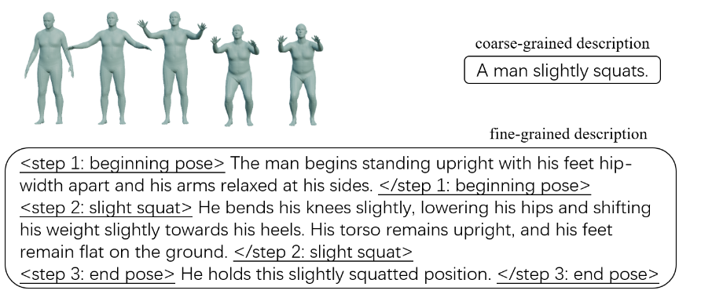
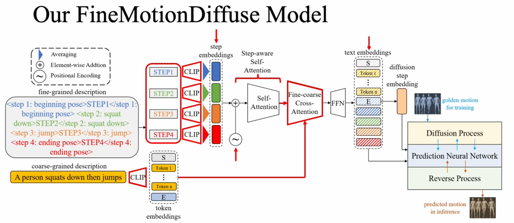

# 动作生成 motion generate Motion Generation from Fine-grained Textual Descriptions

任务是输入一段文字：生成一段人物跑向椅子并坐下的动画。
场景中提供椅子和椅子坐标。
然后能生成动画

看看一下这两篇文章能不能结合

 [Synthesizing Physically Plausible Human Motions in 3D Scenes.pdf](C:\Users\Administrator\Documents\WeChat Files\wxid_v20xt3ie6b7522\FileStorage\File\2024-08\Synthesizing Physically Plausible Human Motions in 3D Scenes.pdf) 

 [Motion Generation from Fine-grained Textual Descriptions.pdf](C:\Users\Administrator\Documents\WeChat Files\wxid_v20xt3ie6b7522\FileStorage\File\2024-08\Motion Generation from Fine-grained Textual Descriptions.pdf) 

任务是输入一段文字：生成一段人物跑向椅子并坐下的动画。
场景中提供椅子和椅子坐标。
然后能生成动画

现在的方法可以做到文字生成人物动画，但是文字里没办法指定人物跟某个物体的交互

我们就解决这个问题

怎么让生成的动画满足物体交互的描述

或者说 用线稿+语言描述去生成一个动作

今日任务 看完看懂这两篇文章

或者跑出其中一篇

看完其中一篇可以 加速+1 or+30的某游

### Motion Generation from Fine-grained Textual Descriptions

主页：https://kunhangl.github.io/finemotiondiffuse/

grained 高度详细的

- 简介

  本文的任务是从给定的文本描述生成人体运动序列，模型探索从自然语言指令到人体运动的多样映射。虽然大多数现有的工作都限于粗粒度的运动描述，例如“一个人蹲下”，但几乎没有探索指定相关身体部位运动的细粒度描述。使用粗粒度文本训练的模型可能无法学习从细粒度运动相关单词到运动基元的映射，导致无法从未见过的描述中生成运动。因此，本文通过向 GPT-3.5-turbo 提供具有伪代码强制检查的逐步说明来构建一个专门针对细粒度文本描述的大规模语言-运动数据集 FineHumanML3D。相应地，我们设计了一种新的文本到运动模型 FineMotionDiffuse，充分利用细粒度文本信息。我们的定量评估表明，FineMotionDiffuse 在 FineHumanML3D 上训练相比竞争基线大幅提高了 FID 0.38。根据定性评估和案例研究，我们的模型在生成空间或时间复合运动方面优于 MotionDiffuse，通过学习从细粒度描述到相应基本运动的隐式映射。我们在 https://github.com/KunhangL/finemotiondiffuse 上发布了我们的数据。

  收起 

- 解决问题

  该论文旨在解决text2motion中细粒度文本描述的问题，即如何从细粒度的文本描述中生成人体运动序列。

- 关键思路

  论文提出了一种新的text2motion模型FineMotionDiffuse，该模型利用细粒度文本信息进行训练，并学习从细粒度描述到相应基本动作的隐式映射，从而生成空间或时间上复合的动作。

- 其它亮点

  论文构建了一个大规模的FineHumanML3D数据集，使用GPT-3.5-turbo对其进行训练，并设计了FineMotionDiffuse模型，该模型在FineHumanML3D上训练，相对于竞争基线模型，FID提高了0.38。论文还开源了数据集和代码。

- 相关研究

  最近的相关研究包括：1. Learning to Generate 3D Human Pose and Shape via Multiview Pose Estimation and 3D Morphable Model. 2. Learning to Generate Human Motion with Adversarial Training. 3. Text2Action: Generative Adversarial Synthesis from Language to Action.

https://hub.baai.ac.cn/paper/8fcbf49d-695c-4184-b42d-8a5f02318a9c

#### Fine-Grained 高度详细的描述

~：位置embedding

早上任务 把这篇看完 全部 不然不能吃午饭

提出数据集：FineHumanML3D 第一个专门针对细粒度文本描述的大规模语言-运动数据集

提出模型：FineMotionDiffuse 同时接受我们的细粒度描述和原始粗粒度描述，以利用两者的优势

#### **摘要**

文本到运动（text2motion）的任务是从给定的文本描述中生成人体运动序列，模型在自然语言指令与人体运动之间探索多样的映射。虽然大多数现有工作局限于粗粒度的运动描述，例如“一个人蹲下”，但针对相关身体部分运动的**细粒度描述**几乎没有受到探索。用粗粒度文本训练的模型可能无法学习从细粒度与运动相关的词汇到运动基本元素的映射，从而导致无法从未见过的描述中生成动作。在本文中，我们**构建了一个专注于细粒度文本描述的大规模语言-运动数据集** **FineHumanML3D**，通过将逐步指令和伪代码强制检查输入给 GPT-3.5-turbo。因此，我们设计了一种新的文本到运动模型 FineMotionDiffuse，充分利用细粒度的文本信息。我们的定量评估表明，在 FineHumanML3D 上训练的 **FineMotionDiffuse** 相比竞争基线在 FID 上提高了 0.38 的显著幅度。根据定性评估和案例研究，我们的模型在生成空间上或时间上复合的运动方面优于 MotionDiffuse，通过学习从细粒度描述到相应基本动作的隐式映射。我们在 https://github.com/KunhangL/finemotiondiffuse 发布我们的数据。

#### 1 引言

虽然大多数关于从文本描述生成人体运动（text2motion）的研究工作致力于设计各种预测模型（Ahuja 和 Morency, 2019；Guo 等, 2022b；Ghosh 等, 2021；Guo 等, 2022a；Athanasiou 等, 2022；Petrovich 等, 2022；Zhang 等, 2022；Tevet 等, 2022；Kim 等, 2022；Zhang 等, 2023），但它们所使用的数据集仅涉及粗略的表达，例如图1中的短4个单词的句子。然而，在实际应用中，我们不仅用高层次的粗略语言来描述动作，还需要细粒度的指令。例如，一个类人机器人需要有关相关身体部位运动的详细信息，以便准确执行目标动作。我们发现，基于粗粒度描述训练的模型无法处理细粒度描述。从这个角度来看，现有数据集在提升text2motion性能方面存在瓶颈。

至少，我们期望细粒度描述能够：

1) 按时间顺序排列；
2) 明确相关身体部位的空间变化；
3) 舍弃与肌肉紧张和人类情感无关的冗余细节；
4) 符合人体约束。对于最后一个期望，一个糟糕的例子是前面的句子提到手臂被抬起，但下一个句子假设手臂放松地垂在身体两侧。

为了解决数据问题，一个简单的想法是将现有的粗粒度描述扩展为细粒度描述。然而，让人类重写符合我们期望的全面描述以覆盖各种动作成本较高。一些研究尝试利用GPT-3（Brown et al., 2020）自动生成细粒度描述（Kalakonda et al., 2022；Athanasiou et al., 2023）。受到这些工作的启发，我们假设大型语言模型（LLMs）学习了与人体和物理动作相关的知识，我们旨在通过适当设计的提示进行利用。

对于用于查询大型语言模型（LLM）以获得细粒度描述的提示选择，我们手动设计了一组**提示模板**，并对它们在多个测试文本上的表现进行了评估。最终的提示指示LLM生成细粒度描述，同时将其总结为伪代码。我们发现，这种伪代码强制检查大大增强了LLM生成新描述的稳定性。通过这种方法，我们利用GPT-3.5-turbo重新制作了HumanML3D（Guo et al., 2022b），将其转变为一个新的语言-运动数据集，FineHumanML3D。据我们所知，这是第一个专门针对细粒度文本描述的大规模语言-运动数据集。

在图1中，我们展示了一个动作示例及其原始粗粒度描述和新生成的细粒度版本。我们的细粒度文本明确分割为步骤，但目前的text2motion模型并未设计特定机制来匹配这一特性。其中表现最好的模型之一，MotionDiffuse（Zhang et al., 2022），使用**CLIP（Radford et al., 2021），其输入长度限制仅为77个标记**，这对于我们大多数新描述来说显得过短。受到此启发，我们提出了FineMotionDiffuse，它可以接受各种长度的细粒度描述作为输入，而不会因输入截断而丢失任何文本信息。我们还将粗粒度描述纳入FineMotionDiffuse，以利用其高层次的指令类信息。

我们的贡献总结如下：

- 通过应用伪代码强制检查，我们的最终提示引导生成基于步骤的细粒度运动描述，这些描述严格按时间顺序排列，同时以适当的粒度指定相关身体部位的运动。
- 通过将我们的提示输入到GPT-3.5-turbo中，我们构建了FineHumanML3D，这是第一个专门针对细粒度文本描述的大规模语言-运动数据集。
- 我们提出了FineMotionDiffuse，一个新的text2motion模型，它同时接受我们的细粒度描述和原始粗粒度描述，以利用两者的优势：细粒度文本特征编码严格的步骤顺序，以及粗粒度文本特征编码高层次的指令类信息。定量评估表明，基于FineHumanML3D训练的FineMotionDiffuse在FID上相比基线大幅提升了0.38。此外，人类评估显示，FineMotionDiffuse在已见基础动作与未见复合动作之间的差距最小（0.52，相比之下，使用粗粒度描述的MotionDiffuse为0.56，使用细粒度描述的MotionDiffuse为0.80）。

#### 2 相关工作

由于同一个动作可以用多种方式描述，因此具有高质量注释的大规模语言-运动**数据集**在解决text2motion任务中扮演着至关重要的角色。第一个相关的数据集是KIT-ML（Plappert等，2016），但它的规模较小，语言描述粗糙，运动类型有限。相比之下，**HumanML3D**（Guo等，2022b）更大，提供了多种运动类型和每个动作的多个描述。然而，HumanML3D的语言描述仍然倾向于粗粒度。虽然存在多种复合动作，但它们的描述大多是短动词短语的串联，这些短语总结了每个基本动作，例如，图中的人物向右倾斜，伸直，然后向左倾斜。

Action-GPT（Kalakonda等，2022）使用GPT-3（Brown等，2020）扩展原始粗粒度文本，但他们只使用粗略的零样本提示来引导生成带有大量不必要细节的细粒度文本。SINC（Athanasiou等，2023）利用GPT-3挖掘多个运动描述中涉及的身体部位，并将这些信息与其运动序列融合。为了生成新的训练数据，他们进一步合成相应的复合描述，并使用连词。他们发现新训练的模型获得了空间组合性，即根据涉及不同身体部位的多个动作的描述，模型能够同时生成执行这些动作的相应运动序列。

然而，这两项工作并未充分探索大型语言模型（LLM）在理解从粗粒度运动描述中获取时间、空间和人体细节方面的能力。换句话说，LLM将运动描述从粗粒度扩展到细粒度的能力仍然未知。此外，我们缺乏一个具有高质量细粒度描述的大规模语言-运动数据集。尽管我们希望LLM能将人类从繁琐的注释写作中解放出来，但不可避免地会得到不完美对齐的细粒度描述和黄金动作。因此，我们好奇LLM是否能够补充足够的描述性细节，以便在此类噪声数据上训练的text2motion模型仍然能够适当地学习从细粒度运动相关描述到运动原语的映射。

对于text2motion模型，目前的主流方法是**将自然语言表达和动作映射到同一嵌入空间**。一方面，诸如TM2T（Guo et al., 2022a）、TEACH（Athanasiou et al., 2022）、TEMOS（Petrovich et al., 2022）和T2M-GPT（Zhang et al., 2023）等研究使用基于变分自编码器（VAE）的架构。另一方面，得益于扩散模型在生成任务中的最新进展，像MotionDiffuse（Zhang et al., 2022）、MDM（Tevet et al., 2022）和FLAME（Kim et al., 2022）等模型成功应用了这种模型架构。

在所有这些模型中，**MotionDiffuse**与之前的工作相比取得了显著的改进。它使用多模态模型CLIP（Radford et al., 2021），通过大规模对比预训练融合语言和图像的信息，以初始化其文本嵌入。然而，CLIP仅允许输入文本最多77个标记，因此MotionDiffuse的原始文本编码器无法充分编码细粒度描述。我们旨在克服这个问题。此外，目前尚不清楚同时结合粗粒度和细粒度文本是否有助于提升text2motion模型的性能，这也是我们在本文中探讨的目标。

### 3 细粒度语言-运动数据集构建

我们期望大型语言模型（LLM）能够妥善地将运动描述从粗粒度扩展到细粒度。理想的细粒度描述应按时间顺序陈述，明确相关身体部位的空间变化，避免不必要的细节，并符合人体约束。我们精心设计了8个提示，并保留表现最好的一个用于最终数据集的构建。有关这些提示和我们的初步研究的更多细节，请参见附录A。

#### 3.1 提示工程

**初步提示。** 最简单的提示P1是一个零样本提示，要求LLM按时间顺序扩展给定的粗粒度描述，并指定相关身体部位的空间位置变化（包括角度变化）。第二个提示P2不要求LLM指定与肌肉相关的任何内容，并提供一个实例，该实例包括一个粗粒度描述及其细粒度版本。P3要求模型在生成扩展描述之前给出思考过程。在P4中，LLM则被要求明确标记步骤的数量，即<step n>...</step n>。P4进一步明确要求LLM不要提及与肌肉相关的任何内容。

最后一个提示在四个提示中表现最好。它引出的描述简洁，没有诸如肌肉紧张、指尖动作、主体感受等不必要的细节。得益于步骤标记，这些描述严格按照时间顺序排列。惊人的是，我们发现涉及的动作高度符合身体约束。然而，这个提示在分配步骤标记方面并不够稳定。

**有前景的提示**.基于最佳试点提示P4，我们扩展了P5的步骤标记，以在尖括号中指定步骤名称，例如，<step 1:beginning pose>...</step 1:beginning pose>。由于大型语言模型（LLM）是在大量代码上训练的，这被认为提高了其推理能力（Chen et al., 2023），我们进一步设计了P6，要求LLM将每个步骤总结为伪代码序列。提示P7和P8是P6的双实例版本。它们共享P6的实例，区别在于P7的第二个实例与P6的实例相似，而P8的第二个实例则包含更多伪代码变体。

我们选择了30个粗粒度文本来测试这4个有前景的提示。主要发现是，在保持P4优点的同时，它们更准确地拆分步骤并分配步骤标记。此外，我们对返回的细粒度描述和伪代码的质量进行了人工评估（见附录A中的表8）。结果显示，伪代码的引入意外地提高了返回文本描述的质量。两个双实例提示P7和P8的表现被证明是最好的。但对它们较差案例的进一步比较显示，P7倾向于产生与实例格式不符的伪代码，这是一种不受控制的迹象。因此，我们选择P8作为最终提示。通过P8引发的示例输入和响应如图2所示。

总结我们的关键发现：

1. LLM倾向于提及肌肉紧张，即使我们没有明确这一要求，但肌肉不能在动作序列中反映出来。因此，我们应该明确要求LLM不要提及与肌肉相关的任何内容；
2. 我们可以要求LLM逐步描述动作，并为实例添加命名步骤标记，这被证明比在扩展之前添加一般思考过程更有效；
3. 我们可以要求LLM进一步将细粒度描述总结为伪代码，从而提高文本描述的质量；
4. 我们应添加两个不同的实例，而不是一个或没有实例。

### 3.2 我们的FineHumanML3D数据集

原始的HumanML3D数据集包含44,970个粗粒度文本描述，涵盖14,616个3D人类动作。通过运动成像和**词语替换（例如，将“左”替换为“右”）**，我们将**数据增强**至89,940个描述，涉及29,232个动作。

使用所选的提示模板，我们将所有来自HumanML3D的粗粒度运动描述扩展为细粒度描述。我们删除无效的响应。对于每个响应，我们剔除伪代码，只保留带有命名步骤标记的细粒度描述。

我们遵循Guo等人（2022b）的做法，对返回的详细描述进行预处理，并将每个运动序列与其对应的原始粗粒度描述的细粒度文本配对。最终的FineHumanML3D数据集包含85,646个细粒度文本描述，针对29,228个动作。如表1所示，我们的FineHumanML3D数据集在词汇上非常丰富，平均描述长度几乎是HumanML3D的10倍。有显著更多的动词、名词和代词，表明出现了更多的动作和身体部位。此外，大量的介词反映了身体部位之间更频繁的互动。

### 3.3 FineHumanML3D的人类评估

尽管P8显示出强大的能力，可以从LLM中引出按严格时间顺序排列的具有适当空间细节的细粒度描述，但自动扩展的文本并不能保证与真实运动完美对齐。为了评估和揭示这种潜在的差异，我们对FineHumanML3D的一个样本进行了人类评估，即随机抽取100个真实运动及其细粒度描述。

我们将所有文本-运动对分类为三类——零对齐、部分对齐和完美对齐，计数结果为2:68:30。部分对齐的细节如表2所示。部分对齐中的错误被分类为颠倒（例如，文本中的左腿与运动中的右腿）、不匹配（部分文本与运动片段不符）、冗余（描述超过运动所执行的内容）和不足（缺少对运动片段的描述）。我们还展示了冗余和不足中显著的错误类型。起始姿势类型表示运动未遵循起始姿势描述，而结束姿势错误类型则相应而来。重复不足类型表示文本描述未能重复运动所示的单个动作片段，例如，当运动执行多个下蹲时，文本仅描述一次。

虽然只有100个动作中的30个与细粒度描述完美对齐，但完美对齐是一个极高的标准。在大多数情况下，部分对齐确实捕捉到了正确的时间顺序和核心动作之间的关系。冗余或不足等问题往往是微不足道的。实质性错误很少发生在非常复杂的动作之外，例如，在做月球漫步时玩杂耍。因此，尽管细粒度描述与真实运动之间存在部分不一致，我们仍然旨在通过下游text2motion任务的表现来验证我们的数据生成方法的有效性和实用性。

### 4 我们的模型

我们设计了一个新的文本到动作模型FineMotionDiffuse，它由一个**细粒度文本编码器**、一个**步态感知自注意力模块**、一个**粗粒度文本编码器**、一个**细粗交叉注意力模块**和一个**扩散模块**组成，以便在FineHumanML3D上进行训练和推理。我们的FineMotionDiffuse模型的概述如图3所示。

细粒度文本编码器接受带有命名步骤标记的**细粒度动作描述作为输入**，并输出编码每个步骤全部特征的步骤嵌入。为了更好地捕捉步骤之间的顺序，我们提出了一种新的步态感知自注意力机制，它将硬位置嵌入添加到步骤嵌入中，然后通过一个自注意力模块进行处理。粗粒度文本编码器解析粗粒度描述并输出相应的令牌嵌入。来自细粒度和粗粒度文本编码器的输出然后被送入细粗交叉注意力模块。对于扩散模块，我们利用Zhang等人（2022）提出的扩散模型架构来融合文本和动作特征，并进行训练和推理。

#### 细粒度文本编码器

我们设法通过分别对每个步骤进行编码，克服了CLIP的输入长度限制。在细粒度文本编码器中，我们首先从细粒度描述中提取**每个步骤的文本（STEPk）**，通过CLIP进行处理，并通过对所有令牌表示的平均值获得**步骤嵌入（step_embs[k]）**。
$$
\text{step\_embs}[k] = \text{Ave}(\text{CLIP}(\text{STEP}_k))                ----------------------(1)
$$

#### 步态感知自注意力

给定步骤嵌入，我们的步态感知自注意力机制通过Vaswani等人（2017）提出的**正弦和余弦函数向其添加硬位置嵌入（PE）**，并将这些位置编码的步骤嵌入输入到自注意力Transformer模块（SelfAtt）中，以获取细粒度文本特征（f_feas）。该机制有助于**更好地捕捉步骤之间的时间关系**，并通过步骤嵌入之间的交互提高细粒度文本特征的质量。
$$
f_{feas} = \text{SelfAtt}(\text{PE}(\text{step\_embs}))----------------------(2)
$$

#### 粗粒度文本编码器

粗粒度描述总结了整个动作的关键点，因此我们也打算使用这种高级指令类信息。我们将其通过CLIP处理，以获得带有起始和结束令牌嵌入的粗粒度文本特征。

#### 细粗交叉注意力

现在我们获得了细粒度和粗粒度文本特征。粗粒度特征编码了总结整个动作序列关键点的简短指令，而细粒度特征则编码了详细的基于步骤的描述以及每个步骤的显式时间信息。然后，我们将这两种类型的特征输入到我们的细粗交叉注意力Transformer模块中，以对齐并结合它们的信息，接着通过一个前馈网络（FFN）获得**最终的文本嵌入**。

#### 扩散模块

扩散过程由一系列扩散步骤组成，每个步骤都需要一个扩散步骤嵌入与扩散序列号t结合。因此，我们直接使用与粗文本中的令牌[E]对应的嵌入，作为文本嵌入的一部分，如图3所示。配备文本嵌入和扩散步骤嵌入后，我们将它们简单地输入扩散模型模块，并进行类似于MotionDiffuse（Zhang et al., 2022）的训练和推理。

### 5 实验

我们设计实验以回答以下问题：1) FineMotionDiffuse中的不同模块和机制有哪些好处？2) FineMotionDiffuse（在FineHumanML3D上训练）相较于MotionDiffuse（在HumanML3D上训练）有哪些优势？3) FineMotionDiffuse能否处理空间或时间复合动作？

#### 5.1 设置

**数据集。**

我们使用85,646个细粒度运动描述和29,228个来自FineHumanML3D数据集的动作。对于粗粒度运动描述，我们使用原始HumanML3D数据集中对应的细粒度描述，总计85,646个。训练数据集包含23,966个动作和70,222个描述，而测试数据集则包含5,262个动作和15,424个描述。

**评估指标。**

根据Guo等人（2022b）的研究，我们在FineHumanML3D的训练集上**预训练了一个文本-运动对比模型用于评估目的**。利用该模型的文本编码器和运动编码器，我们应用了三个评估指标。

1 ) Fréchet Inception Distance **(FID)：将生成的运动及其真实运动通过运动编码器计算**，FID是两个编码运动序列之间的距离。

2 ) R-精确度：对于一段文本及其生成的运动序列，从测试集中随机抽取31个不匹配的文本。运动序列由运动编码器编码，32个文本由文本编码器编码。通过检查真实文本是否落入运动序列的前k个最近文本中来计算前k（k=1,2）准确率。
3 ) 多样性：将测试集中生成的所有运动序列随机分成对，并计算平均联合差异作为多样性指标。

**基线。**

我们基于MotionDiffuse（Zhang et al., 2022）提出MotionDiffuse_AddFC作为我们的基线模型，遵循直观的思路，通过简单地将每个步骤嵌入的张量相加来融合细粒度文本特征。它首先分别使用CLIP编码粗粒度描述和细粒度描述中的每个步骤，结果得到1 + n个大小为(context_length, token_embedding_dim)的张量。然后我们直接在每个标记位置相加这些张量，从而得到一个细粒-粗粒特征张量。

**实现细节。**

在我们的文本编码器中，应用了CLIP ViT-B/32（Radford et al., 2021）来编码细粒度和粗粒度描述。自注意力块和细粗交叉注意力块均由四个Transformer编码器层组成，潜在维度保持为256。我们在8台A100-PCIE-40GB上运行主要实验，总批次大小为2048。Zhang等（2022）在MotionDiffuse上运行100K次迭代，这在我们的情况下成本较高。因此，我们的总迭代次数为5.2K，其余参数设置与MotionDiffuse保持一致。

#### 5.2 主要结果

如表3所示，虽然这两种模型在R-精确度上相当，但FineMotionDiffuse在FID上显著提高了0.38。这表明层次注意力架构帮助FineMotionDiffuse生成更准确的运动序列，更精确地与真实运动对齐。此外，FineMotionDiffuse在多样性上的提升显示出其从细粒度描述中识别细节的更强能力。

#### 5.3 消融研究

在消融研究中，我们探讨了我们方法的以下变体：1) 解冻CLIP参数；2) 不同的步骤表示选择；3) 细粗交叉注意力的效果；4) 截断输入步骤文本。

由于训练和评估整个数据集时GPU消耗较高，我们从整个训练集中选取2,046个动作用于训练，从整个测试集中选取878个动作用于评估。表4报告了这些消融变体的定量评估结果，其中FID用于比较。

#### 模型消融

在我们解冻CLIP中的参数后（+ CLIP_unfrozen），FID增加了0.13。我们推测，冻结这些参数可以保持模型的泛化能力。

接下来，我们对每个步骤的[E]标记进行嵌入（ave → [E]），而不是沿所有标记嵌入取平均。FID增加了0.5，显示出通过取平均获得步骤嵌入的优势。此外，我们移除了与粗粒度描述的交叉注意力（- cross-attention），发现FID大幅增加了1.2。这证明了细粒度和粗粒度描述之间的交叉注意力极大地帮助模型生成更精确的动作。

#### 输入消融

为了明确每个步骤的细粒度描述的作用，我们进行了两组消融实验。第一组实验：1) 我们通过删除第一和最后一步来训练和测试截断数据（称为delFirstLast）；2) 我们仅使用第一和最后一步进行训练和测试（称为delInner）。它们在FID上的性能下降表明，训练数据中细粒度描述的完整性对于模型性能的重要性。

第二组实验中，我们直接使用最初训练的FineMotionDiffuse，但在测试时进行了一些修改：1) 我们去掉第一和最后一步（称为delFirstLast input），令人惊讶的是发现FID提高了0.13；2) 测试时仅保留第一和最后一步（称为delInner input），结果发现性能严重下降。仔细调查细粒度描述发现，第一和最后一步通常描述开始和结束姿势，相较于内部步骤中的动作，它们多数是静止状态，并且不同动作之间变化不大。因此，我们认为在FineHumanML3D上训练的FineMotionDiffuse对内部步骤中的丰富动作更敏感，其泛化能力往往会受到相对不具信息性的第一和最后一步的干扰。

#### 5.4 定性分析

我们的目的是通过研究以下两个方面比较FineMotionDiffuse和MotionDiffuse生成的动作：

1. 它们与输入描述的一致性如何；
2. 动作细节的表现如何，例如脚是否滑动在地面上，身体部位是否频繁抖动等。因此，我们收集了30个粗粒度运动描述（9个已见基本动作和21个未见复合动作），并利用我们的提示模板将其扩展为细粒度描述。

对于每种运动类型，我们使用三种方法生成三条运动序列：1) 将细粒度描述与粗粒度描述一起输入到FineMotionDiffuse中；2) 将粗粒度描述输入到MotionDiffuse中（MotionDiffuse_coarse）；3) 将细粒度描述（称为去除步骤标记）输入到MotionDiffuse中（MotionDiffuse_detailed），由于CLIP的77-token输入长度限制，文本被截断。

我们对所有生成的序列进行了人工评估。每个序列的评分范围为1到5，以0.5为单位。我们分别计算了每种方法下所有运动序列、基本运动序列和复合运动序列的平均分。此外，我们还报告了从基本到复合动作的分数下降（∆）。结果如表5所示。

根据评分分析，我们发现MotionDiffuse_detailed的表现最差，显示出其在适应细粒度描述方面的失败。具体来说，当输入细粒度描述时，MotionDiffuse在识别适当的身体部位和动作方面表现不佳。

与此同时，FineMotionDiffuse的表现优于MotionDiffuse_coarse，这证明在训练过程中对运动细节的学习更加有效。此外，FineMotionDiffuse在基本到复合动作的分数下降幅度最小，显示出其处理未见复合动作描述的更强泛化能力。

#### 5.5 案例研究

在这里，我们从空间和时间两个维度调查模型在复合动作上的表现。**空间组合性指模型同时执行两个基本动作的能力**，而**时间组合性则指以顺序方式执行两个基本动作的能力**。我们选择了两组案例进行定性分析，输入描述的完整细节见附录B。

**空间组合性。** FineMotionDiffuse分别学习如何稍微下蹲（图4(a)）和将双臂抬至头顶上方（图4(b)），并能够组合出相应的复合动作，同时执行这两个基本动作（图4(c)）。相比之下，MotionDiffuse在处理细粒度文本时无法正确处理手臂的动作（图4(d)）。当输入粗粒度文本时，MotionDiffuse在开始时没有展示下蹲的过程（图4(e)）。

**时间组合性。** FineMotionDiffuse分别学习如何走路（图5(a)）和用一条腿踢（图5(b)），并成功组合出相应的复合动作，以时间顺序连接这两个基本动作（图5(c)）。相比之下，MotionDiffuse在处理细粒度文本时无法进行踢腿动作（图5(d)）。当输入粗粒度文本时，MotionDiffuse未能使代理执行走路（图5(e)）。

**分析。** 在这两组案例中，FineMotionDiffuse成功展示了处理空间和时间组合性的能力，而MotionDiffuse则未能做到。一方面，基于大量粗粒度文本训练的MotionDiffuse没有学习细粒度动作相关描述与运动原语之间的映射，这解释了它在处理细粒度文本时在空间和时间组合方面的失败。另一方面，当输入为粗粒度复合描述时，MotionDiffuse无法展示完整的动作。它可能只学习如何将已见的粗粒度文本映射到单一动作，但未能获得从已见粗粒度文本组合生成未见复合动作的能力。

### 6 结论

在本文中，我们引导LLM构建FineHumanML3D，这是第一个专门针对细粒度文本描述的大规模语言-运动数据集，为研究细粒度文本到运动（text2motion）铺平了道路。我们发现，逐步指令结合伪代码强制检查可以显著提高生成描述的质量。我们提出FineMotionDiffuse，以充分利用细粒度和粗粒度描述。定量和定性评估表明，基于FineHumanML3D训练的FineMotionDiffuse能够更好地学习细粒度描述之间的映射，并表现出比以前的最先进模型更强的泛化能力，尤其是在处理空间和时间复合动作时。未来，我们希望在此方法基础上，扩展到越来越复杂的人类行为。

### 限制

**数据集。** FineHumanML3D中的细粒度描述来源于在大量文本和代码上预训练的LLM。尽管该LLM学习了关于人体和物理动作的丰富知识，但从粗粒度动作描述直接扩展不可避免地偏离了标准动作序列，这在一定程度上导致新训练的FineMotionDiffuse出现错误行为。我们期待未来的工作能够自动检查和修正生成的描述，使其符合真实动作。此外，可以使用像GPT-4（OpenAI, 2023）这样的预训练大型多模态模型进行数据集构建。甚至可以将标准动作转换为某种LLM友好的输入，从而使LLM直接接收准确的动作信息，帮助生成更高质量的细粒度描述。

**模型。** 当前的基于扩散的模型架构在训练和推理方面非常缓慢，这限制了其在现实场景中的应用。因此，可以采用几种加速方法（Yang et al., 2022; Ulhaq et al., 2022）来缓解这个问题。此外，一些基于变分自编码器（VAE）的模型（Zhang et al., 2023）被报告具有与基于扩散的模型相当的性能，我们的方法也显示出在这些架构中应用的潜力。

### 伦理声明

我们使用的原始数据集HumanML3D并未直接发布，这是由于其来源之一AMASS数据集的分发政策。因此，我们遵循HumanML3D构建者的官方说明（https://github.com/EricGuo5513/HumanML3D）来重现该数据集。在整个工作中，我们仅调用了OpenAI的公开API GPT-3.5-turbo-0301。所有实验及数据集构建的费用不到350美元。我们使用的文本标记器和词性标注器来自开源Python包spaCy 3.5（https://spacy.io/usage/v3-5）。我们招聘同事进行人工评分，并公平支付他们每小时超过10美元的报酬。

### 致谢

本工作得到了NSFC（62161160339）的支持。我们感谢匿名审稿人提供的有用意见和建议。同时，我们还要感谢Jason Narowdowsky在反驳和校对方面的帮助，感谢Yusuke Miyao对反驳的协助。

