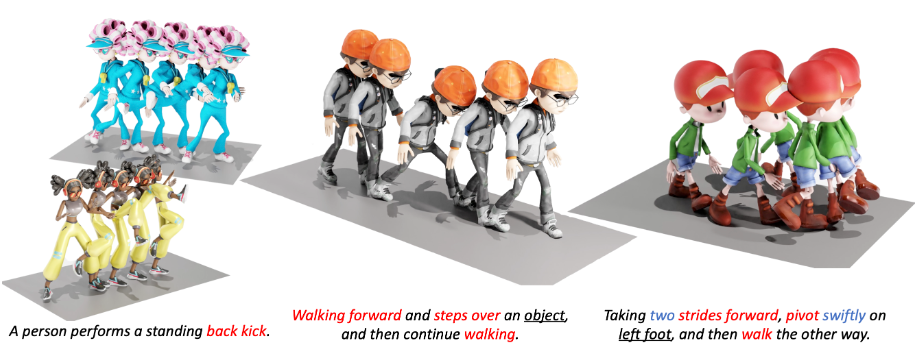
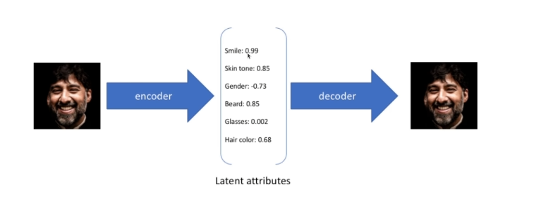
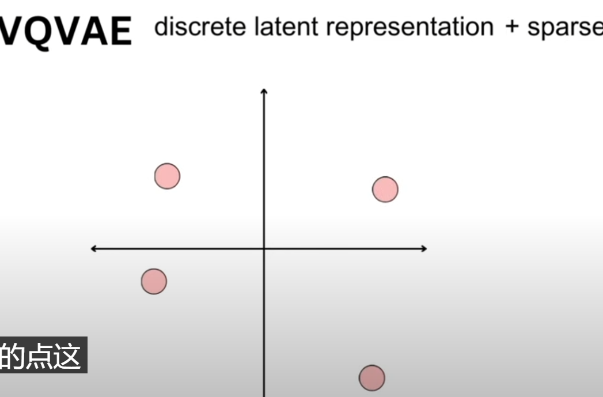
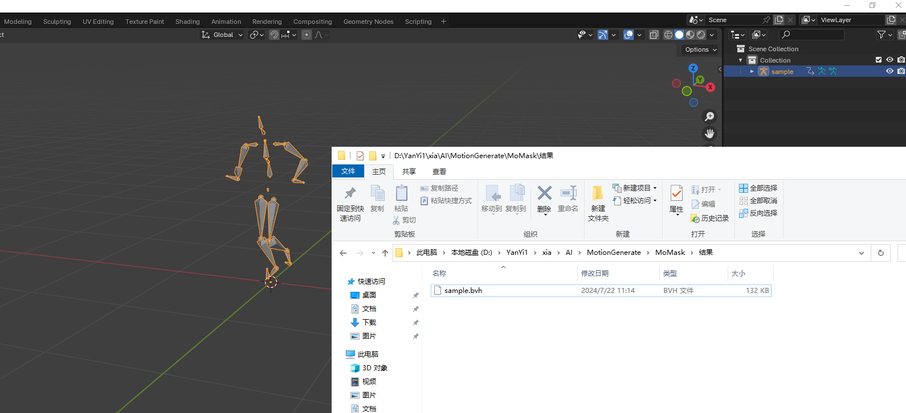
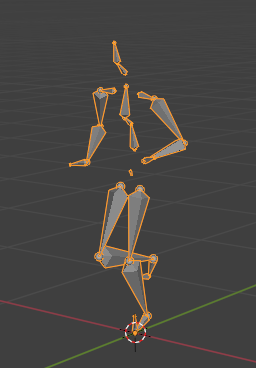
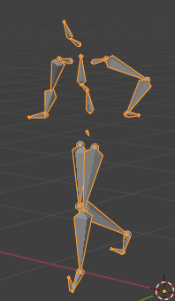
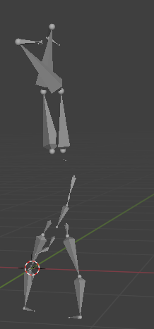
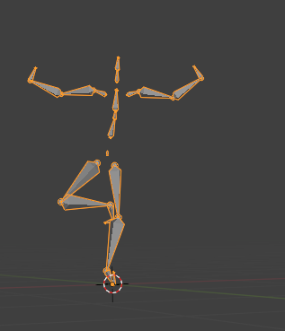
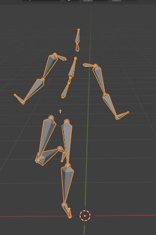

# MoMask 文本一键转3D数字人骨骼动画

- 论文题目：MoMask: Generative Masked Modeling of 3D Human Motions
- 论文链接：https://arxiv.org/abs/2312.00063
- 代码链接：https://github.com/EricGuo5513/momask-codes
- Huggingface Space 链接：https://huggingface.co/spaces/MeYourHint/MoMask
- 主页：https://ericguo5513.github.io/momask/

讲解：**https://www.jiqizhixin.com/articles/2024-04-29-3**

没有手指，还是会有抖动

### 前置知识

#### VQ-VAE

https://blog.csdn.net/DeepViewInsight/article/details/133103810

VQ-VAE:Neural discrete representation learning[1711.00937]

【[论文简析]VQ-VAE:Neural discrete representation learning[1711.00937]】 https://www.bilibili.com/video/BV1bb4y1i7j6/?share_source=copy_web&vd_source=2c8847c41a6c97560a277330511f1edd

https://sunlin-ai.github.io/2022/06/02/VQ-VAE.html

在机器学习和深度学习领域，自动编码器（Autoencoder）是一种常见的神经网络架构，用于降维、特征学习和生成数据等任务。Variational Quantized Variational Autoencoder（VQ-VAE）是自动编码器的一种扩展，它结合了变分自动编码器（Variational Autoencoder）和量化方法（Quantization），并在图像和音频生成等领域取得了显著的成功。本文将深入探讨VQ-VAE的工作原理，解释它的应用和优势，并提供代码示例来帮助您更好地理解。

**什么是 VQ-VAE？**
VQ-VAE代表"Variational Quantized Variational Autoencoder"，是一种生成模型，通常用于处理高维数据，如图像和音频。它的设计灵感来自于变分自动编码器（VAE）和量化方法，结合了它们的优点，使得 VQ-VAE 能够生成高质量的数据，并在数据表示上引入离散性。

**变分自动编码器（Variational Autoencoder）**
变分自动编码器（Variational Autoencoder，简称 VAE）是一种生成模型，它通过学习数据的潜在分布来生成新的数据样本。VAE的核心思想是将数据编码成潜在空间中的分布，并从该分布中采样以生成新的样本。这使得 VAE 能够在生成新数据时具有一定的随机性，因此非常适合生成任务。

**量化方法（Quantization）**
量化方法是一种将连续数据映射到离散数据的技术。在深度学习中，通常使用 K-means 等聚类算法来执行量化。通过引入离散性，我们可以减少数据表示的复杂性，从而降低模型的计算和存储成本。

**VQ-VAE 的工作原理**
为了更好地理解 VQ-VAE，让我们来看看它的工作原理。

**编码器（Encoder）**
VQ-VAE 的编码器部分将输入数据编码成潜在表示。这与标准的自动编码器类似，但编码器的输出不是直接的潜在向量，而是一个**表示符号（codebook index）**。编码器的任务是找到**最接近输入的表示符号**，即最接近的聚类中心。

**量化器（Quantizer）**
量化器接受编码器的输出，将其**映射到离散**表示。这是通过**查找最接近的聚类中心**来完成的，然后**输出该聚类中心的索引**。这个步骤引入了离散性，减小了表示的维度，降低了复杂性。

**解码器（Decoder）**
解码器部分接受来自量化器的离散表示，并尝试生成与原始输入相匹配的数据。这一过程与标准自动编码器的解码器类似，但在 VQ-VAE 中，解码器的任务更加困难，因为它必须**将离散表示映射回连续数据**。

**损失函数**
VQ-VAE 使用了多个损失函数来训练模型，其中包括重建损失（reconstruction loss）和潜在损失（codebook loss）。重建损失用于确保解码器能够生成接近原始输入的数据，而潜在损失则用于推动编码器生成有效的潜在表示。

**VQ-VAE 的应用**

VQ-VAE 在图像和音频生成、数据压缩和生成性对抗网络（GANs）等领域具有广泛的应用。以下是一些示例：

**图像生成**
VQ-VAE 可以用于生成高质量的图像，包括人脸图像、自然场景和艺术作品。由于其离散表示的特性，它可以生成清晰和多样的图像。

**音频生成**
VQ-VAE 也可以用于生成音频，例如语音合成或音乐生成。它可以捕捉音频的时间结构和频谱特征，生成逼真的声音。

**数据压缩**
由于 VQ-VAE 引入了离散性，它可以用于数据压缩。这意味着可以使用更少的位数来表示数据，从而减少存储和传输成本。

**生成性对抗网络（GANs）**
VQ-VAE 可以与生成性对抗网络（GANs）结合使用，以生成更逼真的图像和音频。通过将 VQ-VAE 作为 GANs 的生成器，可以获得更好的生成效果。
————————————————

原文链接：https://blog.csdn.net/DeepViewInsight/article/details/133103810

VQ-VAE 通过向网络添加离散的 **codebook** 组件来扩展标准自编码器。codebook 是与相应索引关联的向量列表。它用于量化自编码器的瓶颈；将编码器网络的输出与 codebook 的所有向量进行比较，并将欧氏距离最接近的 codebook 向量喂给解码器。

数学上可以写成$𝑧_𝑞(𝑥)=argmin_𝑖‖𝑧_𝑒(𝑥)−𝑒_𝑖‖^2$ ，其中 $𝑧_𝑒(𝑥)$ 是原始输入的 encoder 向量，比如 𝑖 表示第 𝑖 个 codebook 向量，$𝑧_𝑞(𝑥)$ 表示生成的量化矢量，作为输入传递给解码器。

这个 argminargmin 操作有点令人担忧，因为它相对于编码器是不可微分的。但在实践中，可以通过这样的方式将 decoder 的梯度直接传递给 encoder （encoder 和 codebook 向量的梯度设置为1，其他 codebook 向量梯度设置为0）。

然后，解码器的任务是重构来自该量化矢量的输入，就像在标准自编码器公式中那样。

### 模型介绍

MoMask: 生成式遮蔽建模 3D 人体动作

https://arxiv.org/pdf/2312.00063

https://ericguo5513.github.io/momask/

**MoMask 模型介绍**

​                *图 2：MoMask 框架结构与训练流程*

*
*

MoMask 框架主要包含三个关键的神经网络模块：

- **残差量化模型 (Residual VQ-VAE)**，将人体动作转换为多层离散的动作标记（Token）。基层（即第一层）的动作标记包含了动作的基本信息，而残差层则对应更细粒度的动作信息。
- **Masked Transformer**：对基层的动作标记进行建模，采用随机比例的随机掩码，并根据文本信息预测被掩码的动作标记，用于生成基层动作标记。
- **Residual Transformer**：对残差层的动作标记进行建模，根据前 j 层的动作标记预测第 j 层的动作标记，以此来建模残差层的动作序列。

​               *图 3: T2M-GPT 的动作离散化模型 (VQ-VAE)*

**动作序列离散化。**MoMask 采用基于离散表达的生成式框架，首先将连续的动作表达进行离散化。如图 3，传统的 VQ-VAE 在量化（Quantization）过程中存在信息损失问题，因为它将每个隐向量替换为码书（Codebook）中最相近的码向量，这两个向量之间的差异导致了信息的丢失。为了解决这个问题，MoMask 采用了多层量化的方法（图 2.a），逐层对隐向量和码向量之间的残差进一步量化，从而提高了隐向量的估计精度。随着层数加深，每一层所建模的信息量（即残差）也逐步减少。训练时，为了尽可能增加每一个量化层的容量，我们随机丢弃掉末尾的若干个残差层。最终，动作序列被转化为多层的离散动作标记，其中基层标记包含了动作的主要内容，而残差层则用于填补动作的细节。接下来，MoMask 使用 Masked Transformer 生成基层动作标记，并使用 Residual Transformer 逐层预测残差层的动作标记。

**生成式掩码建模。**如图 2.b，文本描述首先通过 CLIP 编码成语义向量，同时基层的动作标记序列被随机掩码。然后，这些掩码的动作标记序列和 CLIP 文本向量一起输入到 Transformer 中进行训练，其目标是准确预测被掩码掉的动作标记。与以往基于掩码的预训练模型不同的是，这里掩码标记的比例是随机的，并且可以在 0 到 1 的区间取值，这意味着掩码的程度也是随机的。最坏情况下，所有标记都被掩码，而最好情况下，所有标记都被保留。

**残差层标记预测。**由于残差层包含了更细粒度的动作信息，因此根据前面 j > 1 层的动作标记内容，可以基本确定第 j 层的动作标记。在训练时，随机选择一个残差层 j 进行预测，将已知的前 j 层的动作标记、CLIP 文本向量以及第 j 层的编码输入到 Transformer 中，使用交叉熵损失函数来优化模型。

​                *图 4: MoMask 推断流程*

*
*

**生成过程。**图 4 描述了 MoMask 框架中的生成过程。从基层的动作标记序列开始，所有的动作标记都被掩码，然后通过 Masked Transformer 进行预测，得到完整的标记序列。接着，仅置信度最高的一部分标记被保留，剩下的标记将被重新掩码（Remask），并重新预测。通过一个预设的调度函数 (Schedule function)，在经过一定次数的掩码与预测后，得到最终的基层动作标记序列。然后，Residual Transformer 根据基层的标记序列，逐层地预测残差层的标记序列。最终，所有标记序列被输入到 RVQ-VAE 的解码器中，并解码获得对应的动作序列。因此，无论动作序列的长度为多少，MoMask 只需要固定步数去生成该序列。通常情况下，MoMask 仅需要进行不超过 20 步的迭代，包括基础与残差层的生成。

**实验结果**

​             *视频 2：MoMask 与基线方法的对比*

*
*

在视频 2 中，MoMask 与其他三个基线方法进行了对比，包括主流的扩散模型（MDM、MLD）和 GPT 模型（T2M-GPT）。MoMask 在应对挑战性动作（如绊脚和抱脚）以及更精细的文本控制方面表现更出色。

在下表中，我们对 MoMask 在 HumanML3D 和 KIT-ML 数据集上的性能进行了更全面的分析。可以看出，MoMask 框架在 R-Precision 和 FID 等指标上始终表现最优，在 HumanML3D 数据集上，生成质量达到了 FID 为 0.045。

图 5 展示了 Masked Transformer 推断步数对生成动作的整体质量影响，其中 FID 和 MM-Dist 分别指示了动作生成质量以及动作与文本内容的匹配程度，值越低代表性能越好。从图中可以看出，仅需要进行 10 步推断，生成质量就可以收敛到最优水平。

​               *图 5: 推断步数对生成质量影响*

*
*

**应用：动作时序补齐**

MoMask 还可用于动作序列的时序补齐，即根据文本对动作序列指定的区间进行编辑或修改。在视频 3 中，展示了基于 MoMask 对动作序列的前缀、中间部分和后缀，根据给定的文本进行内容补齐。              *视频 3: 基于 MoMask 的动作时序补齐* 

###  跑代码

#### 报错与更改记录

##### 1

###### 问题

###### 解释

###### 解决

##### 1

###### 问题

colab 报错ERROR: pip's dependency resolver does not currently take into account all the packages that are installed. This behaviour is the source of the following dependency conflicts. bigframes 1.11.1 requires matplotlib>=3.7.1, but you have matplotlib 3.3.4 which is incompatible. mizani 0.9.3 requires matplotlib>=3.5.0, but you have matplotlib 3.3.4 which is incompatible. plotnine 0.12.4 requires matplotlib>=3.6.0, but you have matplotlib 3.3.4 which is incompatible. seaborn 0.13.1 requires matplotlib!=3.6.1,>=3.4, but you have matplotlib 3.3.4 which is incompatible

###### 解释

这个报错是由于你的软件包之间存在依赖冲突导致的。具体来说，你安装的某些软件包需要使用不同版本的 matplotlib，而当前已安装的 matplotlib 版本与其要求的版本不兼容。

这种情况可能会发生在使用不同软件包时，它们各自指定了对特定软件包的版本要求，但这些版本要求之间存在冲突。解决这种问题的一种方法是尝试升级或降级软件包以满足所有软件包的需求。

你可以尝试通过更新或降级 matplotlib 软件包，并确保其他软件包也能满足新的依赖关系来解决这个问题。另外，你也可以考虑使用虚拟环境管理工具，如 conda 或 venv，来隔离不同项目的依赖关系，避免出现冲突。

###### 解决

**!pip install matplotlib==3.7.1**

##### 2

###### 问题

AttributeError: module 'numpy' has no attribute 'float'. `np.float` was a deprecated alias for the builtin `float`. To avoid this error in existing code, use `float` by itself. Doing this will not modify any behavior and is safe. If you specifically wanted the numpy scalar type, use `np.float64` here. The aliases was originally deprecated in NumPy 1.20; for more details and guidance see the original release note at:

###### 解释

这个报错是因为在较新版本的 NumPy 中，`np.float` 这个别名已经被弃用，并且不再可用。相反，你应该直接使用内置的 `float` 类型来表示浮点数。通过使用 `float` 类型而不是 `np.float`，可以避免这个错误。

如果你确实想要使用 NumPy 提供的特定浮点数类型，那么建议使用 `np.float64` 来代替 `np.float`。这样可以明确地指定所需的类型，同时也避免了报错。

总之，针对这个报错，你只需要将代码中所有的 `np.float` 替换为 `float` 即可。这种修改不会改变任何行为，也是安全的。这个别名最初是在 NumPy 1.20 版本中被弃用的，你可以参考相应的发布说明以获取更多详细信息和指导。

###### 解决

将所有的 `np.float` 替换为 `float`

##### 3

###### 问题

 ax.lines = [] AttributeError: can't set attribute 'lines'

###### 解释

这个错误是由于在调用 `ax.lines = []` 时发生的。根据报错信息，`lines` 属性不允许直接设置为一个空列表。

解决这个问题的一种方法是使用 `ax.clear()` 方法代替 `ax.lines = []`。这样可以清除所有绘图元素，包括线条和集合，从而达到相同的效果。

###### 解决

**ax.clear()**   # ax.lines = []

   ax.clear() # ax.lines = []

​    \# ax.collections = []

#### 结果

A person is running on a treadmill.

效果不错

A person is vertically suspended in mid-air with their feet hovering.

悬浮在空中的人物的动作，人物垂直，但是脚是浮空的形态

变成翻跟斗了

我要给一个动作生成一段提示词，让他生成类似有魔法的人物在空中从原地腾空的动作，悬浮在空中的人物的动作，人物垂直，但是脚是浮空的形态，怎么输入提示语句，用英文。：“A person is ”

A person is magically levitating in mid-air, suspended vertically with feet gracefully floating.

float2.bvh

A person is magically levitating in mid-air, with both feet suspended and floating.

会出现一个人站不稳的情况，而不是一个人魔法般的腾空

A person is gracefully soaring through the air, defying gravity as they float effortlessly above the ground.

一个人优雅地在空中翱翔，不顾地心引力，毫不费力地漂浮在地面上。

A person is gracefully soaring through the air, defying gravity as they float effortlessly above the ground,

#### 思考

可能是其无法理解或者怎么回事，给一个草图/类似骨架的东西，或者视频等辅助文本，更好

能否能结合sd

sd给出一个符合描述的动作/骨架

然后人们根据这个骨架去做动作的调整，然后最终生成近似这个骨架的动作

a skeleton

#### 生成速度

一般是20-40s
