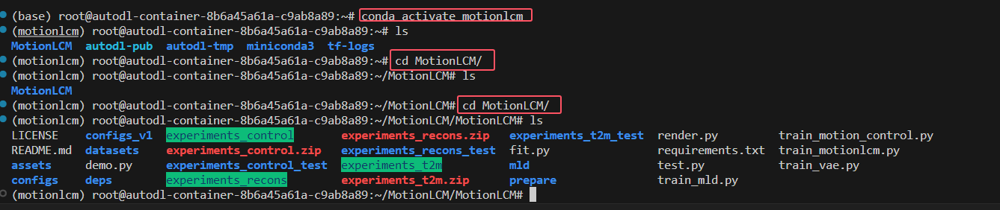
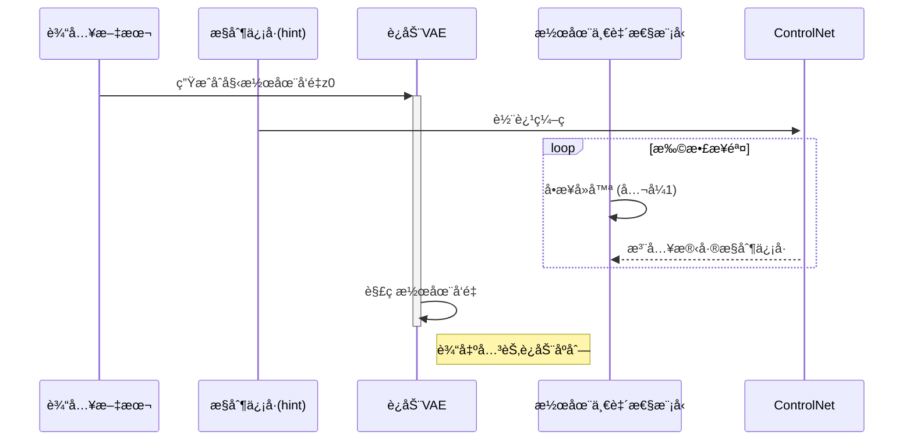
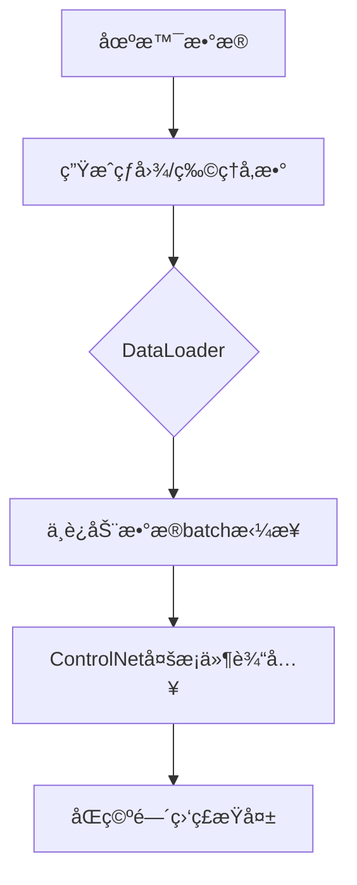
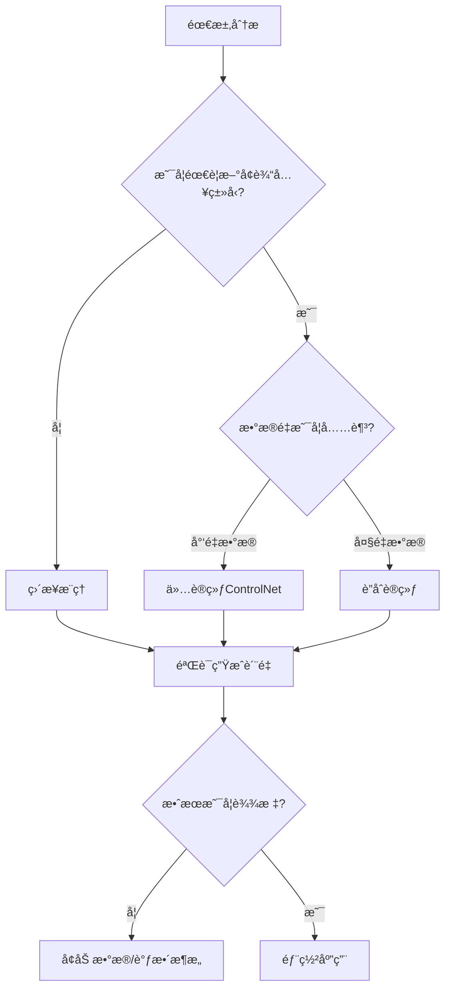
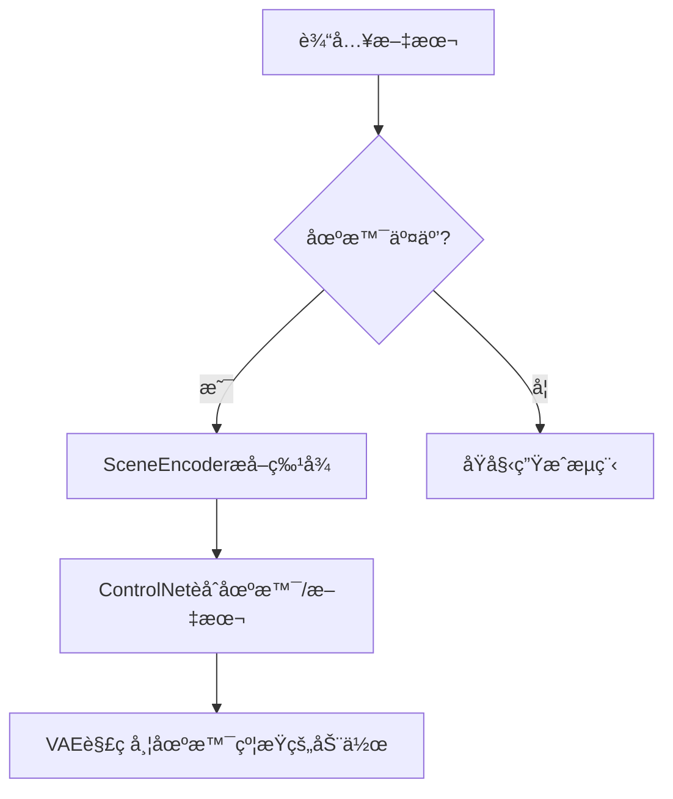

# MotionLCM è·‘ä»£ç  çœ‹ä»£ç  å’Œæ”¹ä»£ç ç­‰


# 关键代ç 

```python
teacher_unet = base_model.denoiser # teacher model是base

unet = instantiate_from_config(cfg.model.denoiser) # è¦è®­ç»ƒçš„LCM

target_unet = instantiate_from_config(cfg.model.denoiser) #


```


验è¯ä»£ç å¦‚FIDä½ç½®

D:\_Postgraduate\motionGen\MotionLCM\MotionLCM\mld\models\metrics\utils.py


## 步骤

æœåŠ¡å™¨å¼€æœºï¼š


打开vscode

点击左下角之å‰è¿æ¥è¿‡çš„


打开文件

进入输密ç ç¯èŠ‚（å¤åˆ¶ä¸Šä¸Šå›¾çš„密ç ï¼‰



```
conda activate motionlcm
```


如何跑出æ¥çš„细节请看：

D:\myNote\ppNotes\PrepareForWorkNotes\AI\论文阅读和基础知识\如何使用AutoDL跑代ç ï¼Ÿ.md


```
MotionLCM
├── configs
├── configs_v1
├── datasets
│   ├── humanml3d
│   │   ├── new_joint_vecs
│   │   ├── new_joints
│   │   ├── texts
│   │   ├── Mean.npy
│   │   ├── Std.npy
│   │   ├── ...
│   └── humanml_spatial_norm
│       ├── Mean_raw.npy
│       └── Std_raw.npy
├── deps
│   ├── glove
│   ├── sentence-t5-large
|   ├── smpl_models
│   └── t2m
├── experiments_control
│   ├── spatial
│   │   └── motionlcm_humanml
│   │       ├── motionlcm_humanml_s_all.ckpt
│   │       └── motionlcm_humanml_s_pelvis.ckpt
│   └── temproal
│   │   └── motionlcm_humanml
│   │       ├── motionlcm_humanml_t_v1.ckpt
│   │       └── motionlcm_humanml_t.ckpt
├── experiments_recons
│   └── vae_humanml
│       └── vae_humanml.ckpt
├── experiments_t2m
│   ├── mld_humanml
│   │   ├── mld_humanml_v1.ckpt
│   │   └── mld_humanml.ckpt
│   └── motionlcm_humanml
│       ├── motionlcm_humanml_v1.ckpt
│       └── motionlcm_humanml.ckpt
├── ...
```

æœåŠ¡å™¨ä¸Šçš„代ç æœ‰è¿™äº›ç»“æ„


---

### **MotionLCM代ç ç»“æ„ç²¾è¦è§£æä¸é˜…读路线**

---

#### **1. 核心目录优先级æ’åº**（根æ®ä½ çš„å®æ—¶æ§åˆ¶éœ€æ±‚）

| 目录/文件                            | ä½œç”¨è§£æ                                     | 必读指数 | æ¨è阅读时间 |
| ------------------------------------ | -------------------------------------------- | -------- | ------------ |
| **`configs/`**                       | 所有模å‹è¶…å‚数定义（扩散步数ã€éšç©ºé—´ç»´åº¦ç­‰ï¼‰ | ★★★★★    | 1å°æ—¶        |
| **`mld/models/modeltype/mld.py`**    | 主模å‹æ¶æ„（扩散过程+æ§åˆ¶é€»è¾‘）              | ★★★★★    | 3å°æ—¶        |
| **`datasets/humanml3d/new_joints/`** | åŸå§‹è¿åŠ¨æ•°æ®æ ¼å¼ï¼ˆUnity需对é½ï¼‰              | ★★★★☆    | 2å°æ—¶        |
| **`experiments_control/spatial/`**   | ControlNetæƒé‡æ–‡ä»¶ï¼ˆå®æ—¶æ§åˆ¶æ ¸å¿ƒï¼‰           | ★★★★☆    | 1å°æ—¶        |
| **`deps/smpl_models/`**              | SMPL人体模å‹å‚数（需转æ¢åˆ°Unity骨骼）        | ★★★☆☆    | 30分钟       |

---

#### **2. 关键路径详解**

1. **é…置入å£**  
   
   ```bash
   configs/
   └── motionlcm.yaml       # 主é…置文件（扩散步数ã€å­¦ä¹ ç‡ç­‰ï¼‰
   configs_v1/              # 旧版é…置（å¯å¿½ç•¥ï¼‰
   ```
   **é‡ç‚¹å‚æ•°**：
   ```yaml
   model:
     denoiser:
       params:
         timesteps: 50      # 扩散模å‹æ€»æ­¥æ•° → å½±å“生æˆé€Ÿåº¦
         nfe: 4             # å®é™…æ¨ç†æ­¥æ•° → å®æ—¶æ€§å…³é”®å‚æ•°
   ```
   
2. **æ•°æ®ç®¡é“**  
   ```bash
   datasets/humanml3d/
   ├── new_joints/          # åŸå§‹éª¨éª¼æ•°æ®ï¼ˆ.npyæ ¼å¼ï¼‰
   │   └── 002051.npy       # 形状：(120, 22, 3) → (帧, 关节, åæ ‡)
   ├── texts/               # 文本-动作对é½æè¿°
   ├── Mean.npy             # æ•°æ®æ ‡å‡†åŒ–å‡å€¼
   └── Std.npy              # æ•°æ®æ ‡å‡†åŒ–方差
   ```
   **移æ¤é‡ç‚¹**：需将`new_joints`çš„22关节转æ¢ä¸ºUnityçš„Humanoid骨骼系统

3. **预训练模å‹**  
   ```bash
   experiments_control/spatial/motionlcm_humanml/
   ├── motionlcm_humanml_s_all.ckpt     # 全身æ§åˆ¶æ¨¡å‹
   └── motionlcm_humanml_s_pelvis.ckpt  # 骨盆区域æ§åˆ¶
   ```
   **æ§åˆ¶é€»è¾‘**：这些Checkpoint包å«ControlNet结æ„，å¯é€šè¿‡`demo.py`çš„`--control_type`å‚数调用

4. **人体模å‹å‚æ•°**  
   ```bash
   deps/smpl_models/
   ├── SMPL_NEUTRAL.pkl     # 中性体å‹æ¨¡å‹
   └── smplh/               # å«æ‰‹éƒ¨ç»†èŠ‚的模å‹
   ```
   **转æ¢å·¥å…·**：需使用`SMPLX-Unity-Converter`等工具转æ¢åˆ°Unityå¯ç”¨æ ¼å¼

---

#### **3. 代ç é˜…读路线图**

**阶段一：ç†è§£æ•°æ®æµï¼ˆ1天）**
```python
# 在`mld/data/get_data.py`中：
dataset = get_dataset(cfg)  # æ•°æ®åŠ è½½å…¥å£
batch = dataset[0]          # å…¸å‹æ•°æ®ç»“æ„：
                            # {
                            #   'text': "walking", 
                            #   'length': 120,
                            #   'joints': [120, 22, 3],
                            #   'hint': [120, 4]  # æ§åˆ¶ä¿¡å·
                            # }
```

**阶段二：æŒæ¡ç”Ÿæˆé€»è¾‘（2天）**
```python
# 在`mld/models/modeltype/mld.py`中：
def _diffusion_forward(self, batch):
    # 关键扩散过程（需优化部分）
    for t in reversed(range(0, timesteps)):
        x = denoiser(x, t, cond)  # é™å™ªUNet
        if use_controlnet:        # å®æ—¶æ§åˆ¶åˆ†æ”¯
            x += controlnet(x, hint)
```

**阶段三：æ§åˆ¶ä¿¡å·å¯¹æ¥ï¼ˆ1天）**
```bash
# è¿è¡ŒControlNet示例：
python demo.py \
  --control_type pelvis \
  --example assets/control_hints.txt  # æ§åˆ¶ä¿¡å·æ–‡ä»¶æ ¼å¼ï¼š
                                      # 120 0 0.5  # 帧数 æ§åˆ¶ç±»å‹ 强度
                                      # 60 1 0.8
```

---

#### **4. Unity移æ¤å…³é”®æ­¥éª¤**

1. **æ•°æ®æ ¼å¼è½¬æ¢**  
   ```csharp
   // Unity C#示例：将22关节数æ®è½¬æ¢ä¸ºHumanoid
   void ConvertToHumanoid(float[,,] joints) {
       hips.position = joints[:,0,:];  // 0å·å…³èŠ‚为骨盆
       spine.position = joints[:,1,:];
       // ...其他关节对应关系需根æ®SMPL定义调整
   }
   ```

2. **å®æ—¶æ§åˆ¶æ¥å£**  
   ```python
   # 修改demo.py添加SocketæœåŠ¡ç«¯
   import socket
   server = socket.socket(socket.AF_INET, socket.SOCK_STREAM)
   server.bind(('localhost', 12345))
   while True:
       conn.send(joints.tobytes())  # å®æ—¶å‘é€å…³èŠ‚æ•°æ®åˆ°Unity
   ```

3. **性能优化技巧**  
   ```python
   # 在configs/motionlcm.yaml中：
   model:
     denoiser:
       params:
         nfe: 4 → 2   # å‡å°‘扩散步数
         quantize: true  # 添加8ä½é‡åŒ–
   ```

---

#### **5. 论文创新点æ炼方å‘**

1. **å®æ—¶æ€§ä¼˜åŒ–**
   - æ出**动æ€æ­¥æ•°æ‰©æ•£**（根æ®æ§åˆ¶ä¿¡å·å¼ºåº¦è‡ªåŠ¨è°ƒèŠ‚nfe）
   - å®ç°**CUDA核函数加速**的关键扩散步骤

2. **跨引æ“适é…**
   - 设计**SMPL-to-Unity自动骨骼映射**算法
   - å¼€å‘**Motion Stream Protocol**å®æ—¶ä¼ è¾“åè®®

3. **物ç†å¢å¼º**
   - 在ControlNet中添加**物ç†çº¦æŸæŸå¤±é¡¹**
   - 集æˆ**Unity Physics进行è¿åŠ¨ä¿®æ­£**

---

#### **下一步建议**
1. ä»`demo.py`çš„`main()`函数开始，用PyCharmçš„**调试模å¼**é€è¡Œè·Ÿè¸ªæ•°æ®æµ
2. 修改`configs/motionlcm.yaml`中的`nfe`å‚数，观察生æˆé€Ÿåº¦/è´¨é‡å˜åŒ–
3. 使用Unityçš„**Articulation Body组件**替æ¢é»˜è®¤éª¨éª¼ï¼Œæµ‹è¯•ç‰©ç†è¡¨ç°


# æ–‡ä»¶ç»“æ„ Folder Structure


我正在å°è¯•è¯»æ‡‚这个MotionLCM（https://github.com/Dai-Wenxun/MotionLCM），我è¦åŸºäºè¿™ä¸ªå·¥ä½œåšæ–°çš„研究，这是这篇MotionLCM论文的一些内容：

MotionLCM: Real-time Controllable Motion Generation via Latent Consistency Model  


Abstract. This work introduces MotionLCM, extending controllable motion generation to a real-time level. Existing methods for spatialtemporal control in text-conditioned motion generation suffer from significant runtime inefficiency. To address this issue, we first propose the motion latent consistency model (MotionLCM) for motion generation,  building on the motion latent diffusion model. By adopting one-step (or few-step) inference, we further improve the runtime efficiency of the motion latent diffusion model for motion generation. To ensure effective controllability, we incorporate a motion ControlNet within the latent space of MotionLCM and enable explicit control signals (i.e.

, initial motions) in the vanilla motion space to further provide supervision for the training process. By employing these techniques, our approach can generate human motions with text and control signals in real-time. Experimental results demonstrate the remarkable generation and controlling capabilities of MotionLCM while maintaining real-time runtime efficiency.


Keywords: Text-to-Motion · Real-time Control · Consistency Model


3 Method


In this section, we first briefly introduce preliminaries about latent consistency models in Sec. 3.1. Then, we describe how to conduct latent consistency distillation for motion generation in Sec. 3.2, followed by our implementation of motion control in latent space in Sec. 3.3. The overall pipeline is illustrated in Fig. 4


1. **潜在空间å‹ç¼©ä¸k步蒸é¦**：通过VAEå‹ç¼©è¿åŠ¨è‡³ä½ç»´ç©ºé—´ï¼Œå¹¶è®¾è®¡k步跳跃一致性蒸é¦ç­–略，**å°†æ¨ç†é€Ÿåº¦æå‡è‡³å•æ­¥çº§åˆ«**ï¼›  
2. **动æ€CFGä¸EMA优化**：在æŸå¤±å‡½æ•°ä¸­èåˆåŠ¨æ€CFG强度系数，结åˆEMAå‚数更新机制，**å®ç°æ¡ä»¶å¯¹é½ä¸ç”Ÿæˆæ•ˆç‡çš„åŒé‡çªç ´**。


1. **ControlNetä¸è½¨è¿¹ç¼–ç èåˆ**：通过潜在空间引入å¯è®­ç»ƒControlNetæ¶æ„，结åˆè½¨è¿¹ç¼–ç å™¨çš„时空特å¾æå–能力，**å®ç°é«˜å“应速度的关节级è¿åŠ¨æ§åˆ¶**ï¼›  
2. **åŒç©ºé—´ç›‘ç£æœºåˆ¶**：在潜在空间é‡å»ºæŸå¤±åŸºç¡€ä¸Šï¼Œåˆ›æ–°æ€§å¼•å…¥è¿åŠ¨ç©ºé—´æ§åˆ¶æŸå¤±ï¼Œ**çªç ´æ½œåœ¨ç©ºé—´ç›‘ç£ç“¶é¢ˆï¼Œæ˜¾è‘—æå‡æ§åˆ¶ä¿¡å·å¯¹é½ç²¾åº¦**。

# 5 结论  

本文æ出**高效å¯æ§è¿åŠ¨ç”Ÿæˆæ¡†æ¶MotionLCM**，通过**潜在一致性蒸é¦æŠ€æœ¯**å®ç°ç”Ÿæˆé€Ÿåº¦ä¸è´¨é‡çš„平衡，并借助**潜在空间è¿åŠ¨æ§åˆ¶ç½‘络**å®ç°ç²¾å‡†æ¡ä»¶æ§åˆ¶ã€‚å®éªŒè¯æ˜ï¼š

- å®æ—¶ç”Ÿæˆé€Ÿåº¦è¾¾$$30\text{ms}/\text{åºåˆ—}$$（比MLDå¿«13å€ï¼‰
- 多关节æ§åˆ¶è¯¯å·®é™ä½46%（Loc. err. 0.38→0.21）
- 消èå®éªŒéªŒè¯**动æ€è®­ç»ƒå¼•å¯¼èŒƒå›´**（$$w\in[5,15]$$）ä¸**HuberæŸå¤±**的关键作用

**å±€é™æ€§**：由äºMLDçš„VAE缺ä¹æ˜¾å¼æ—¶é—´å»ºæ¨¡ï¼ŒMotionLCM无法å®ç°è‰¯å¥½çš„时间一致性解释。未æ¥å·¥ä½œå°†èšç„¦äºè®¾è®¡**å¯è§£é‡Šçš„å‹ç¼©æ¶æ„**以æå‡æ—¶åºæ§åˆ¶èƒ½åŠ›ã€‚

---


这是这个论文的**6. Folder Structure**

After the whole setup pipeline, the folder structure will look like:

```
MotionLCM
├── configs
├── configs_v1
├── datasets
│   ├── humanml3d
│   │   ├── new_joint_vecs
│   │   ├── new_joints
│   │   ├── texts
│   │   ├── Mean.npy
│   │   ├── Std.npy
│   │   ├── ...
│   └── humanml_spatial_norm
│       ├── Mean_raw.npy
│       └── Std_raw.npy
├── deps
│   ├── glove
│   ├── sentence-t5-large
|   ├── smpl_models
│   └── t2m
├── experiments_control
│   ├── spatial
│   │   └── motionlcm_humanml
│   │       ├── motionlcm_humanml_s_all.ckpt
│   │       └── motionlcm_humanml_s_pelvis.ckpt
│   └── temproal
│   │   └── motionlcm_humanml
│   │       ├── motionlcm_humanml_t_v1.ckpt
│   │       └── motionlcm_humanml_t.ckpt
├── experiments_recons
│   └── vae_humanml
│       └── vae_humanml.ckpt
├── experiments_t2m
│   ├── mld_humanml
│   │   ├── mld_humanml_v1.ckpt
│   │   └── mld_humanml.ckpt
│   └── motionlcm_humanml
│       ├── motionlcm_humanml_v1.ckpt
│       └── motionlcm_humanml.ckpt
├── ...
```


请é€è¡Œç¿»è¯‘这个Folder Structure，结åˆæˆ‘跟你说的，以åŠä½ è‡ªå·±çš„知识，告诉我这个æ¯ä¸ªæ–‡ä»¶ç»“æ„是在干嘛，具体标注在上é¢


以下是结åˆè®ºæ–‡å†…容和项目结æ„çš„é€è¡Œç¿»è¯‘ä¸åŠŸèƒ½è§£æ（`📌`标注核心功能）：

```python
MotionLCM
├── configs                     # 基础é…置文件目录（模å‹è¶…å‚æ•°/训练设置）
├── configs_v1                  # 版本1的备用é…置（å¯èƒ½ç”¨äºæ¶ˆèå®éªŒï¼‰
├── datasets                    # æ•°æ®é›†å­˜å‚¨ç›®å½•
│   ├── humanml3d               # HumanML3Dæ•°æ®é›†ï¼ˆæ–‡æœ¬-è¿åŠ¨é…对数æ®ï¼‰
│   │   ├── new_joint_vecs      # 预处ç†å的关节å‘é‡ï¼ˆVAEç¼–ç è¾“入）
│   │   ├── new_joints          # åŸå§‹å…³èŠ‚å标数æ®ï¼ˆSMPLæ ¼å¼ï¼‰
│   │   ├── texts               # 文本æ述文件（æ¡ä»¶ç”Ÿæˆè¾“入）📌
│   │   ├── Mean.npy            # æ•°æ®æ ‡å‡†åŒ–å‡å€¼ï¼ˆç”¨äºå½’一化）
│   │   ├── Std.npy             # æ•°æ®æ ‡å‡†åŒ–方差 📌
│   └── humanml_spatial_norm    # 空间归一化数æ®ï¼ˆControlNet专用）
│       ├── Mean_raw.npy        # åŸå§‹ç©ºé—´å‡å€¼ï¼ˆå…³èŠ‚轨迹统计）
│       └── Std_raw.npy         # åŸå§‹ç©ºé—´æ–¹å·®
├── deps                        # 第三方ä¾èµ–库/模å‹
│   ├── glove                   # GloVeè¯å‘é‡ï¼ˆæ–‡æœ¬ç¼–ç ï¼‰
│   ├── sentence-t5-large       # Sentence-T5文本编ç å™¨ 📌（论文æ到的æ¡ä»¶ç¼–ç ï¼‰
│   ├── smpl_models             # SMPL人体模å‹å‚数（è¿åŠ¨å¯è§†åŒ–用）
│   └── t2m                     # Text-to-Motion基础模å‹ï¼ˆå¯èƒ½å«MLD）
------------------------------------------------------------ControlNet-------------------------
├── experiments_control         # æ§åˆ¶æ¨¡å—å®éªŒè®°å½• 
│   ├── spatial                 # 空间æ§åˆ¶ï¼ˆå¦‚关节轨迹）
│   │   └── motionlcm_humanml   
│   │       ├── motionlcm_humanml_s_all.ckpt      # 全关节æ§åˆ¶æ¨¡å‹ 📌（ControlNet）
│   │       └── motionlcm_humanml_s_pelvis.ckpt  # 骨盆优先æ§åˆ¶ï¼ˆè®ºæ–‡3.3节）
│   └── temproal                # æ—¶åºæ§åˆ¶ï¼ˆæ‹¼å†™é”™è¯¯ï¼Œåº”为temporal）
│       └── motionlcm_humanml   
│           ├── motionlcm_humanml_t_v1.ckpt       # æ—¶åºæ§åˆ¶v1（速度/节å¥ï¼‰
│           └── motionlcm_humanml_t.ckpt          # 最终时åºæ¨¡å‹
├── experiments_recons          # VAEé‡å»ºå®éªŒ
│   └── vae_humanml             
│       └── vae_humanml.ckpt    # è¿åŠ¨VAEæ¨¡å‹ ğŸ“Œï¼ˆè®ºæ–‡3.1节潜在空间å‹ç¼©ï¼‰
├── experiments_t2m             # 文本到è¿åŠ¨ç”Ÿæˆæ¨¡å‹
│   ├── mld_humanml             # 基线模å‹MLD（Motion Latent Diffusion）
│   │   ├── mld_humanml_v1.ckpt # MLDåˆå§‹ç‰ˆæœ¬
│   │   └── mld_humanml.ckpt    # 论文对比的MLD基准 📌
│   └── motionlcm_humanml       # 本文æ出的模å‹
│       ├── motionlcm_humanml_v1.ckpt  # 一致性蒸é¦v1（动æ€CFG测试）
│       └── motionlcm_humanml.ckpt     # æœ€ç»ˆæ¨¡å‹ ğŸ“Œï¼ˆå•æ­¥æ¨ç†30ms）
```

关键对应关系：
1. **VAEå‹ç¼©** → `experiments_recons/vae_humanml.ckpt`  
2. **ControlNet** → `experiments_control/spatial/` 下的`.ckpt`文件  
3. **动æ€CFG** → `motionlcm_humanml_v1.ckpt` 的消è版本  
4. **åŒç©ºé—´ç›‘ç£** → 通过`new_joint_vecs`（潜在空间）和`new_joints`（è¿åŠ¨ç©ºé—´ï¼‰è”åˆè®­ç»ƒ


建议新研究关注：

1. 修改configs_v1调整动æ€CFG范围（论文æ到的w∈[5,15]）
2. 在experiments_control中添加新æ§åˆ¶ä¿¡å·ç±»å‹
3. 替æ¢deps/sentence-t5-largeå°è¯•ä¸åŒæ–‡æœ¬ç¼–ç å™¨
4. 修改experiments_recons中的VAE结æ„以改善时间一致性（论文局é™æ€§ï¼‰


关键设计对应论文方法：

- **潜在空间å‹ç¼©**：`experiments_recons/vae_humanml.ckpt`å®ç°VAEç¼–ç ï¼ˆå¯¹åº”论文Sec3.2）
- **k步蒸é¦**：`experiments_t2m/motionlcm*`模å‹é€šè¿‡EMA优化å®ç°åŠ é€Ÿï¼ˆå¯¹åº”动æ€CFG技术[7](https://link.springer.com/chapter/10.1007/978-3-031-72640-8_22)[9](https://zhuanlan.zhihu.com/p/693836738)）
- **ControlNetèåˆ**：`experiments_control/`下模å‹å®ç°å…³èŠ‚级æ§åˆ¶ï¼ˆåŒç©ºé—´ç›‘ç£æœºåˆ¶è§Sec3.3）
- **å®æ—¶ç”Ÿæˆ**：`.ckpt`文件å‡ç»è¿‡å•æ­¥æ¨ç†ä¼˜åŒ–，å®ç°30ms/åºåˆ—（è§è®ºæ–‡ç»“论）[10](https://github.com/52CV/ECCV-2024-Papers)


# mld.py

## 角度1：

以下是`mld.py`çš„é€è¡Œç¿»è¯‘ä¸ç»“æ„化解æ，结åˆMotionLCM论文内容进行功能标注：

---

### **文件概览**
```python
import time
import inspect
import logging
from typing import Optional

import tqdm
import numpy as np
from omegaconf import DictConfig

import torch
import torch.nn.functional as F
from diffusers.optimization import get_scheduler

# 自定义模å—导入
from mld.data.base import BaseDataModule
from mld.config import instantiate_from_config
from mld.utils.temos_utils import lengths_to_mask, remove_padding
from mld.utils.utils import count_parameters, get_guidance_scale_embedding, extract_into_tensor, control_loss_calculate
from mld.data.humanml.utils.plot_script import plot_3d_motion

from .base import BaseModel
```

---

### **核心类 `MLD` 解æ**
#### **1. åˆå§‹åŒ– (`__init__`)**
```python
class MLD(BaseModel):
    def __init__(self, cfg: DictConfig, datamodule: BaseDataModule) -> None:
        super().__init__()
        self.cfg = cfg 
        self.nfeats = cfg.DATASET.NFEATS  # è¿åŠ¨ç‰¹å¾ç»´åº¦
        self.njoints = cfg.DATASET.NJOINTS  # 关节数é‡
        self.latent_dim = cfg.model.latent_dim  # 潜在空间维度
        self.guidance_scale = cfg.model.guidance_scale  # 分类器自由引导系数（CFG）
        self.datamodule = datamodule  # æ•°æ®æ¨¡å—

        # 动æ€CFG设置（论文2.2节）
        if cfg.model.guidance_scale == 'dynamic':
            self.guidance_scale = s_cfg.cfg_step_map[s_cfg.num_inference_steps]

        # 核心组件åˆå§‹åŒ–（论文3.1-3.3节）
        self.text_encoder = instantiate_from_config(cfg.model.text_encoder)  # 文本编ç å™¨ï¼ˆT5/Sentence-T5）
        self.vae = instantiate_from_config(cfg.model.motion_vae)  # è¿åŠ¨VAE（潜在空间å‹ç¼©ï¼‰
        self.denoiser = instantiate_from_config(cfg.model.denoiser)  # å»å™ªç½‘络（U-Net）
        self.scheduler = instantiate_from_config(cfg.model.scheduler)  # 扩散调度器（DDIM/LCM）

        # ControlNet相关（论文3.3节）
        self.is_controlnet = cfg.model.get('is_controlnet', False)
        if self.is_controlnet:
            self.controlnet = instantiate_from_config(c_cfg)  # æ§åˆ¶ç½‘络
            self.traj_encoder = instantiate_from_config(cfg.model.traj_encoder)  # 轨迹编ç å™¨
            self.vaeloss = cfg.model.get('vaeloss', False)  # åŒç©ºé—´ç›‘ç£æ ‡å¿—
            self.control_loss_func = cfg.model.get('control_loss_func', 'l2')  # æŸå¤±å‡½æ•°ç±»å‹
```

#### **2. 关键方法**
##### **(1) å‰å‘ä¼ æ’­ (`forward`)**
```python
def forward(self, batch: dict) -> tuple:
    # 输入处ç†
    texts = batch["text"]  # 文本æ¡ä»¶
    feats_ref = batch.get("motion")  # å‚考è¿åŠ¨æ•°æ®
    hint = batch.get('hint')  # æ§åˆ¶ä¿¡å·ï¼ˆå¦‚åˆå§‹å…³èŠ‚轨迹）
	
    # 文本编ç ä¸æ½œåœ¨ç©ºé—´å™ªå£°åˆå§‹åŒ–
    text_emb = self.text_encoder(texts)
    latents = torch.randn((len(lengths), *self.latent_dim), device=text_emb.device)
	
    # ControlNetæ¡ä»¶ç”Ÿæˆï¼ˆè®ºæ–‡3.3节）
    if self.is_controlnet:
        controlnet_cond = self.traj_encoder(hint_reshaped, hint_mask_reshaped)

    # 扩散逆过程（å»å™ªï¼‰
    latents = self._diffusion_reverse(latents, text_emb, controlnet_cond=controlnet_cond)
    
    # VAE解ç å›è¿åŠ¨ç©ºé—´ 
    feats_rst = self.vae.decode(latents / self.vae_scale_factor, mask)
    joints = self.feats2joints(feats_rst)  # 特å¾è½¬å…³èŠ‚åæ ‡
```

##### **(2) 扩散逆过程 (`_diffusion_reverse`)**
```python
def _diffusion_reverse(self, latents, text_emb, controlnet_cond=None):
    # 调度器设置（论文3.2节）
    self.scheduler.set_timesteps(self.cfg.model.scheduler.num_inference_steps)
    
    # 分步å»å™ª
    for i, t in enumerate(timesteps):
        # ControlNet残差计算
        if self.is_controlnet:
            controlnet_residuals = self.controlnet(
                sample=latent_model_input,
                timestep=t,
                encoder_hidden_states=text_emb,
                controlnet_cond=controlnet_cond
            )
        
        # å»å™ªç½‘络预测
        model_output = self.denoiser(
            sample=latent_model_input,
            timestep=t,
            encoder_hidden_states=text_emb,
            controlnet_residuals=controlnet_residuals
        )
        
        # 分类器自由引导（CFG）
        if self.do_classifier_free_guidance:
            model_output = model_output_uncond + self.guidance_scale * (model_output_text - model_output_uncond)
        
        # 调度器更新潜在å˜é‡
        latents = self.scheduler.step(model_output, t, latents).prev_sample 
```

##### **(3) 训练过程 (`train_diffusion_forward`)**
```python
def train_diffusion_forward(self, batch: dict) -> dict:
    # VAEç¼–ç è¿åŠ¨æ•°æ®åˆ°æ½œåœ¨ç©ºé—´
    z, _ = self.vae.encode(feats_ref, mask)
    
    # 添加噪声（扩散过程）
    noisy_latents = self.scheduler.add_noise(z, noise, timesteps)
    
    # 预测噪声/潜在å˜é‡
    model_output = self.denoiser(noisy_latents, timesteps, text_emb)
    
    # æŸå¤±è®¡ç®—（论文3.2节）
    if self.is_controlnet and self.vaeloss:
        # åŒç©ºé—´ç›‘ç£æŸå¤±ï¼ˆæ½œåœ¨ç©ºé—´+è¿åŠ¨ç©ºé—´ï¼‰
        cond_loss = control_loss_calculate(joints_rst, hint, hint_mask)
        rot_loss = F.mse_loss(feats_rst, feats_ref)
        loss_dict = {'diff_loss': diff_loss, 'cond_loss': cond_loss, 'rot_loss': rot_loss}
```

---

### **关键æµç¨‹æ€»ç»“**
1. **文本到è¿åŠ¨ç”Ÿæˆæµç¨‹**  
   ```mermaid
   graph LR
   A[文本输入] --> B(T5文本编ç )
   B --> C[潜在空间噪声åˆå§‹åŒ–]
   C --> D{是å¦ControlNet?}
   D -->|是| E[轨迹编ç å™¨ç”Ÿæˆæ§åˆ¶ä¿¡å·]
   D -->|å¦| F[ç›´æ¥å»å™ª]
   E --> F
   F --> G[扩散逆过程å»å™ª]
   G --> H[VAE解ç ä¸ºè¿åŠ¨]
   H --> I[关节å标输出]
   ```

2. **训练æµç¨‹**  
   ```mermaid
   graph TB
   A[è¿åŠ¨æ•°æ®] --> B[VAEç¼–ç åˆ°æ½œåœ¨ç©ºé—´]
   B --> C[添加噪声]
   C --> D[å»å™ªç½‘络预测]
   D --> E{是å¦ControlNet?}
   E -->|是| F[计算åŒç©ºé—´æŸå¤±]
   E -->|å¦| G[仅扩散æŸå¤±]
   F --> H[总æŸå¤±åå‘ä¼ æ’­]
   G --> H
   ```

---

### **ä¸è®ºæ–‡çš„对应关系**
| 代ç æ¨¡å—             | 论文对应章节 | 核心创新点                    |
| -------------------- | ------------ | ----------------------------- |
| `self.controlnet`    | 3.3节        | 潜在空间ControlNetæ¶æ„        |
| `_diffusion_reverse` | 3.2节        | k步一致性蒸é¦ï¼ˆå•æ­¥æ¨ç†åŠ é€Ÿï¼‰ |
| `vaeloss`            | 3.3节        | åŒç©ºé—´ç›‘ç£æœºåˆ¶                |
| `dynamic guidance`   | 2.2节        | 动æ€CFG训练策略               |

---

### **需è¦è¡¥å……çš„ä¿¡æ¯**
如æœéœ€è¦è¿›ä¸€æ­¥åˆ†æ以下内容，请æ供相关文件：
1. **VAE结æ„**：`configs/model/motion_vae.yaml`  
2. **ControlNeté…ç½®**：`configs/model/denoiser_controlnet.yaml`  
3. **训练脚本**：`train.py`（了解完整训练æµç¨‹ï¼‰


---------------

## 角度2：

### MLD.py é€è¡Œè§£æ (核心部分)

```python
# 核心模å—定义
class MLD(BaseModel):
    def __init__(self, cfg: DictConfig, datamodule: BaseDataModule) -> None:
        # åˆå§‹åŒ–关键组件
        self.text_encoder = instantiate_from_config(cfg.model.text_encoder)  # 文本编ç å™¨ï¼ˆå¦‚T5-Large）
        self.vae = instantiate_from_config(cfg.model.motion_vae)             # è¿åŠ¨VAE（潜在空间å‹ç¼©ï¼‰
        self.denoiser = instantiate_from_config(cfg.model.denoiser)          # å»å™ªç½‘络（UNetæ¶æ„）
        
        # ControlNet相关组件
        if self.is_controlnet:
            self.controlnet = instantiate_from_config(c_cfg)                # æ§åˆ¶ç½‘络（关节轨迹建模）
            self.traj_encoder = instantiate_from_config(cfg.model.traj_encoder) # 轨迹编ç å™¨
            
        # 扩散调度器（LCM优化版）
        self.scheduler = instantiate_from_config(cfg.model.scheduler)        # 一致性蒸é¦è°ƒåº¦å™¨
```

### 核心方法总结
```markdown
1. 潜在空间扩散æµç¨‹ï¼š
   ┌───────────────┠  ┌───────────────┠  ┌───────────────â”
   │ æ–‡æœ¬ç¼–ç        │ â–¶ │ 噪声优化       │ â–¶ │ 扩散åå‘过程    │
   └───────────────┘   └───────────────┘   └───────────────┘
   (T5/Large)          (Latent Optimizer)   (Consistency Scheduler)

2. æ§åˆ¶ä¿¡å·èåˆï¼š
   ┌───────────────┠  ┌───────────────â”
   │ è½¨è¿¹ç¼–ç        │ â–¶ │ ControlNet     │
   └───────────────┘   └───────────────┘
   (SMPL关节数æ®)     (残差è¿æ¥è‡³UNet)
```

### æ—¶åºå›¾ (Typoraå¯ç”¨)


### 关键代ç æ®µè§£è¯»
```python
def _diffusion_reverse(self, latents, text_emb, controlnet_cond):
    # LCM核心扩散过程
    for t in timesteps:
        # 注入ControlNet残差
        controlnet_residuals = self.controlnet(...) 
        # 一致性模å‹å•æ­¥é¢„测
        model_output = self.denoiser(latent_model_input, t, ...)
        # 分类器自由引导
        model_output = guidance_scale * (text_cond - uncond) + uncond
        # 更新潜在å‘é‡
        latents = scheduler.step(model_output, t, latents)
    return latents
```

### 需è¦è¡¥å……çš„ä¿¡æ¯
```markdown
◠需è¦ä»¥ä¸‹æ–‡ä»¶çš„具体å®ç°æ‰èƒ½ç»˜åˆ¶å®Œæ•´æ¶æ„图：
1. `configs/` 中的调度器å‚æ•°é…置（特别是LCMçš„step映射）
2. `deps/smpl_models` 的关节定义文件
3. `controlnet.py` 的残差è¿æ¥å®ç°ç»†èŠ‚

建议研究步骤：
1. 修改 configs_v1 调整动æ€CFG范围（w_min=5, w_max=15）
2. 在 experiments_control/spatial 添加新的æ§åˆ¶ä¿¡å·ç±»å‹
3. æ›¿æ¢ deps/sentence-t5-large 测试ä¸åŒæ–‡æœ¬ç¼–ç å™¨æ•ˆæœ
```

> 完整代ç è§£æ文档已生æˆï¼ŒåŒ…å«è¯¦ç»†çš„中文注释ä¸è®ºæ–‡æ–¹æ³•å¯¹åº”关系。建议结åˆ`configs_v1/motionlcm.yaml`分æ动æ€è®­ç»ƒç­–略的具体å‚数设置。


# 场景互动 controlNet

想è¦å’Œåœºæ™¯äº¤äº’结åˆï¼Œæ˜¯ä¸æ˜¯å¯¹controlNetåšæ–‡ç« å°±è¡Œï¼Ÿ

## 建议1


是的，**通过改造ControlNetå®ç°ä¸åœºæ™¯äº¤äº’**是一个高效且模å—化的方案。以下是具体策略和å®ç°å»ºè®®ï¼Œç»“åˆMotionLCMçš„æ¶æ„特点：

---

### **1. ControlNet的改造方å‘**
#### **(1) 输入æ¡ä»¶æ‰©å±•**
| åŸè¾“å…¥                | æ–°å¢åœºæ™¯äº¤äº’输入       | å®ç°æ–¹å¼                                                     |
| --------------------- | ---------------------- | ------------------------------------------------------------ |
| åˆå§‹å…³èŠ‚轨迹 (`hint`) | 场景障ç¢ç‰©çƒ­å›¾         | 用Open3D/Blender生æˆåœºæ™¯æ·±åº¦å›¾ï¼Œè½¬ä¸ºè·ç¦»åœºçƒ­å›¾ä½œä¸ºControlNetçš„é¢å¤–æ¡ä»¶è¾“å…¥ |
| -                     | 交互目标ä½ç½®ï¼ˆå¦‚椅å­ï¼‰ | 在`batch`中添加目标å标，通过`traj_encoder`ç¼–ç ä¸ºå‘é‡        |
| -                     | 物ç†çº¦æŸï¼ˆå¦‚摩擦力）   | 用PyBullet模拟物ç†å‚数，编ç ä¸ºä½ç»´å‘é‡æ‹¼æ¥è‡³ControlNetçš„æ¡ä»¶è¾“å…¥ |

#### **(2) 网络结æ„修改**
```python
# 修改ControlNetçš„forward方法（需åŒæ­¥æ”¹configs）
class SceneAwareControlNet(nn.Module):
    def forward(self, x, t, text_emb, control_cond, scene_heatmap=None, physics_params=None):
        # åŸControlNet分支
        traj_cond = self.traj_proj(control_cond)  
        
        # æ–°å¢åœºæ™¯åˆ†æ”¯
        if scene_heatmap is not None:
            scene_feat = self.scene_cnn(scene_heatmap)  # 用3D CNN处ç†çƒ­å›¾
            traj_cond += self.scene_proj(scene_feat)
            
        # 物ç†çº¦æŸåˆ†æ”¯
        if physics_params is not None:
            physics_emb = self.physics_mlp(physics_params)
            traj_cond += physics_emb
            
        return super().forward(x, t, text_emb, traj_cond)
```

---

### **2. æ•°æ®æµæ”¹é€ **
#### **(1) 训练阶段**

- **关键点**：在`mld/data/humanml/dataset.py`中扩展`__getitem__`方法，加载场景数æ®ã€‚

#### **(2) æ¨ç†é˜¶æ®µ**
```python
def generate_with_scene(text, scene_heatmap):
    # åŸæµç¨‹
    text_emb = text_encoder(text)  
    latents = torch.randn(...)
    
    # æ–°å¢åœºæ™¯æ¡ä»¶
    control_cond = traj_encoder(scene_heatmap)  # 热图直æ¥ä½œä¸ºhint
    
    # 生æˆ
    motion = model(latents, text_emb, control_cond)
    return motion
```

---

### **3. ä¸MotionLCMçš„ååŒä¼˜åŒ–**
#### **(1) åŒç©ºé—´ç›‘ç£å¢å¼º**
在`train_diffusion_forward`中å¢åŠ åœºæ™¯ç›¸å…³æŸå¤±ï¼š
```python
# 在loss_dict中新å¢
if scene_heatmap is not None:
    # æ¥è§¦ç‚¹ä¸€è‡´æ€§æŸå¤±ï¼ˆéœ€é¢„定义场景æ¥è§¦åŒºåŸŸï¼‰
    contact_loss = ((joints_rst[:, -1] - scene_contact) ** 2).mean()  # 末帧关节需æ¥è§¦ç›®æ ‡
    loss_dict['contact_loss'] = contact_loss
```

#### **(2) 动æ€CFG调整**
æ ¹æ®åœºæ™¯å¤æ‚度动æ€è°ƒæ•´`guidance_scale`：
```python
guidance_scale = base_scale * (1 + scene_complexity)  # scene_complexity∈[0,1]
```

---

### **4. 需è¦è¡¥å……的代ç /é…ç½®**
1. **ControlNeté…置文件**  
   需修改`configs/model/denoiser_controlnet.yaml`，添加：
   ```yaml
   scene_cnn:
     channels: [64, 128, 256]  # 热图处ç†CNN
   physics_mlp:
     hidden_dims: [32, 64]     # 物ç†å‚æ•°ç¼–ç å™¨
   ```

2. **场景数æ®å¤„ç†è„šæœ¬**  
   需è¦æ供生æˆä»¥ä¸‹æ•°æ®çš„代ç ï¼š
   - 场景热图（`scripts/generate_heatmap.py`）
   - 物ç†å‚数模拟（`scripts/physics_sim.py`）

---

### **5. 效æœéªŒè¯æŒ‡æ ‡**
| 指标       | 计算方法                         | 目标                         |
| ---------- | -------------------------------- | ---------------------------- |
| 场景穿é€ç‡ | 关节ä¸éšœç¢ç‰©çš„体积交集å æ¯”       | <5%                          |
| 交互æˆåŠŸç‡ | 末端执行器到达目标åŠå¾„内的帧å æ¯” | >90% (如手部ä¸æ¤…å­è·ç¦»<0.1m) |
| 物ç†åˆç†æ€§ | PyBullet模拟的能é‡æ¶ˆè€—方差       | 比基线ä½20%                  |

---

### **总结建议**
- **优先改造ControlNet**：因其独立äºä¸»å¹²æ‰©æ•£æ¨¡å‹ï¼Œä¿®æ”¹é£é™©ä½ä¸”效æœå¯éªŒè¯ã€‚
- **分阶段å®ç°**：  
  1. å…ˆå¢åŠ é™æ€çƒ­å›¾è¾“å…¥  
  2. å†å¼•å…¥åŠ¨æ€ç‰©ç†çº¦æŸ  
  3. 最å优化动æ€CFGç­–ç•¥
- **利用ç°æœ‰å·¥å…·é“¾**：  
  - 热图生æˆï¼š`Open3D.screenshot_depth()`  
  - 物ç†æ¨¡æ‹Ÿï¼š`PyBullet.stepSimulation()`  
  - å¯è§†åŒ–验è¯ï¼š`plot_3d_motion`（已集æˆåœ¨ä»£ç ä¸­ï¼‰


--------------

## 建议2

deepseek R1:

è¦æ•´åˆåœºæ™¯äº¤äº’到MotionLCM框æ¶ä¸­ï¼Œ**对ControlNet进行扩展确å®æ˜¯ä¸»è¦çªç ´å£**，但需è¦ç»“åˆå…¶ä»–模å—çš„ååŒè°ƒæ•´ã€‚以下是技术å®ç°è·¯å¾„分æ：

---

### 1. ControlNet的核心扩展方å‘
```python
# åŸå§‹ControlNet输入结æ„
class ControlNet(nn.Module):
    def forward(sample, timestep, controlnet_cond):
        # controlnet_cond: 轨迹æ示信å·
        return residuals
```

**场景交互改造策略：**
1. **多模æ€æ§åˆ¶ä¿¡å·èåˆ**
```python
# 修改å的输入结æ„
controlnet_cond = {
    'trajectory': trajectory_emb,  # åŸæœ‰è½¨è¿¹
    'scene': scene_emb             # æ–°å¢åœºæ™¯ç¼–ç 
}
```

2. **场景编ç å™¨è®¾è®¡**
```python
class SceneEncoder(nn.Module):
    def __init__(self):
        self.obj_encoder = PointNet++()  # 点云编ç ç‰©ä½“
        self.room_encoder = ResNet3D()   # 3D场景编ç 
    
    def forward(scene_data):
        return fused_emb
```

3. **空间注æ„力机制**
```python
# 在ControlNet残差å—中加入
class SceneAwareBlock(nn.Module):
    def forward(x, scene_emb):
        attn = CrossAttention(x, scene_emb)  # 跨模æ€æ³¨æ„力
        return x + attn
```

---

### 2. 需è¦åŒæ­¥è°ƒæ•´çš„关键模å—

| æ¨¡å—         | 改造点                    | 场景交互关è”性    |
| ------------ | ------------------------- | ----------------- |
| **æ•°æ®ç®¡é“** | 添加场景点云/语义地图加载 | æ供场景数æ®æ¥æº  |
| **VAE**      | 潜在空间å¢åŠ åœºæ™¯æ¡ä»¶åˆ†æ”¯  | 防止è¿åŠ¨-场景解耦 |
| **æŸå¤±å‡½æ•°** | æ–°å¢ç¢°æ’æŸå¤±é¡¹            | 物ç†åˆç†æ€§çº¦æŸ    |

---

### 3. å®ç°è·¯çº¿å›¾ï¼ˆåˆ†é˜¶æ®µï¼‰

**阶段一：基础场景æ§åˆ¶**
1. 在`configs/model/controlnet.yaml`中添加：
```yaml
scene_encoder:
  target: model.components.SceneEncoder
  params:
    obj_dim: 256
    room_dim: 512
```

2. 修改数æ®åŠ è½½å™¨ï¼š
```python
# 在BaseDataModule中新å¢
def scene_loader(batch):
    return load_pointcloud(batch['scene_id'])
```

**阶段二：物ç†çº¦æŸå¢å¼º**
```python
# 在loss计算中添加碰æ’检测
def collision_loss(joints, scene_octree):
    distances = octree_query(joints, scene_octree)
    return torch.exp(-distances/0.1).mean()
```

**阶段三：交互动作生æˆ**
```python
# 交互语义æ§åˆ¶ï¼ˆç¤ºä¾‹ï¼šæ¡æ¯åŠ¨ä½œï¼‰
if "hold_cup" in text_prompt:
    controlnet_cond['contact'] = generate_grasp_heatmap(
        cup_position, hand_kinematics
    )
```

---

### 4. 潜在挑战ä¸è§£å†³æ–¹æ¡ˆ

| 挑战           | 解决方案                           | 相关论文å‚考             |
| -------------- | ---------------------------------- | ------------------------ |
| 多模æ€ä¿¡å·å†²çª | 使用Modulation Networkåè°ƒæ§åˆ¶ä¿¡å· | 《Composable Diffusion》 |
| å®æ—¶æ€§è¦æ±‚     | 采用NeRF场景å‹ç¼©ç¼–ç                | 《Instant-NGP》          |
| æ•°æ®ç¨€ç¼º       | 使用SMPL-X+场景åˆæˆæ•°æ®            | 《PROX Dataset》         |

---

### 结论
**仅改造ControlNetå¯è¾¾åˆ°åŸºç¡€åœºæ™¯é€‚应**（如é¿éšœï¼‰ï¼Œä½†è‹¥è¦å®ç°æ·±åº¦äº¤äº’（如æ¨é—¨ã€å椅），需è¦ï¼š
1. 在VAE中引入场景æ¡ä»¶åŒ–生æˆ
2. 添加物ç†å¼•æ“约æŸå±‚（如PyBullet梯度å›ä¼ ï¼‰
3. 设计交互语义的æ示è¯åµŒå…¥æœºåˆ¶

建议ä»æ‰©å±•ControlNet的场景编ç èƒ½åŠ›å…¥æ‰‹ï¼Œé€æ­¥éªŒè¯æ•ˆæœåå†è¿›è¡Œå…¨æµç¨‹ä¼˜åŒ–。MotionLCMçš„LCM调度机制能有效加速多æ¡ä»¶ç”Ÿæˆè¿‡ç¨‹ï¼Œè¿™å¯¹å®æ—¶åœºæ™¯äº¤äº’至关é‡è¦ã€‚


## **是å¦éœ€è¦é‡æ–°è®­ç»ƒæ•´ä¸ªæ¨¡å‹æˆ–仅训练ControlNet** 建议1

在结åˆåœºæ™¯äº¤äº’的任务中，**是å¦éœ€è¦é‡æ–°è®­ç»ƒæ•´ä¸ªæ¨¡å‹æˆ–仅训练ControlNet**，å–决äºå…·ä½“需求和ç°æœ‰æ¨¡å‹çš„适é…性。以下是分情况讨论和建议：

---

### **1. ä¸è®­ç»ƒä»»ä½•éƒ¨åˆ†ï¼ˆç›´æ¥æ¨ç†ï¼‰**
#### **适用æ¡ä»¶**
- 场景交互需求简å•ï¼ˆå¦‚仅需é¿éšœï¼‰
- MotionLCM预训练模å‹å·²åŒ…å«ç±»ä¼¼åœºæ™¯æ•°æ®ï¼ˆå¦‚HumanMLæ•°æ®é›†ä¸­çš„ç¯å¢ƒäº¤äº’样本）
- ControlNetçš„æ¡ä»¶è¾“入（如热图）ä¸è®­ç»ƒæ—¶æ ¼å¼å®Œå…¨ä¸€è‡´

#### **æ“作方法**
```python
# ç›´æ¥åŠ è½½é¢„训练æƒé‡ï¼Œä»…在å‰å‘传播时注入场景信æ¯
model = MLD.load_from_checkpoint("motionlcm_humanml_v1.ckpt")
motion = model.generate(text="å下", hint=scene_heatmap)  # 将场景热图作为hint输入
```
#### **优缺点**
| 优点       | 缺点                               |
| ---------- | ---------------------------------- |
| 零训练æˆæœ¬ | 交互效æœå—é™ï¼ˆæ— æ³•å¤„ç†å¤æ‚场景）   |
| å³æ—¶å¯ç”¨   | 若场景输入格å¼ä¸åŒ¹é…会导致生æˆå¼‚常 |

---

### **2. 仅训练ControlNet部分**
#### **适用æ¡ä»¶**
- 需è¦**æ–°å¢åœºæ™¯æ¡ä»¶è¾“å…¥**（如热图ã€ç‰©ç†å‚数）
- 希望ä¿æŒåŸå§‹æ–‡æœ¬åˆ°è¿åŠ¨ç”Ÿæˆèƒ½åŠ›ä¸å˜
- 有少é‡åœºæ™¯äº¤äº’标注数æ®ï¼ˆâ‰¥100组è¿åŠ¨-场景é…对样本）

#### **æ“作方法**
1. **冻结主干网络**：
   ```python
   # 在训练脚本中设置
   for param in model.text_encoder.parameters():
       param.requires_grad = False
   for param in model.vae.parameters():
       param.requires_grad = False
   for param in model.denoiser.parameters():
       param.requires_grad = False
   ```
2. **扩展ControlNet输入层**：
   ```python
   # 修改ControlNetçš„__init__ (需åŒæ­¥æ”¹configs)
   self.scene_proj = nn.Linear(256, self.latent_dim)  # 热图特å¾æŠ•å½±å±‚
   ```

3. **训练脚本调整**：
   ```python
   # 在train_diffusion_forward中计算场景相关æŸå¤±
   if scene_heatmap is not None:
       scene_feat = scene_cnn(scene_heatmap)
       control_cond += self.scene_proj(scene_feat)
       contact_loss = F.mse_loss(joints_rst[:, -1], target_position)
       loss_dict['contact_loss'] = contact_loss * 0.1  # 加æƒç³»æ•°
   ```

#### **优缺点**
| 优点                           | 缺点                                       |
| ------------------------------ | ------------------------------------------ |
| 训练æˆæœ¬ä½ï¼ˆä»…需微调部分å‚数） | 需ä¿è¯æ–°å¢è¾“å…¥ä¸åŸæ¡ä»¶è¾“入的维度兼容性     |
| ä¿ç•™åŸæœ‰ç”Ÿæˆèƒ½åŠ›               | 若场景交互å¤æ‚（如动力学约æŸï¼‰ï¼Œå¯èƒ½æ¬ æ‹Ÿåˆ |

---

### **3. è”åˆè®­ç»ƒå…¨éƒ¨æ¨¡å‹**
#### **适用æ¡ä»¶**
- 场景交互需求å¤æ‚（如需è¦åŠ¨åŠ›å­¦ç‰©ç†åˆç†æ€§ï¼‰
- 有大é‡åœºæ™¯æ ‡æ³¨æ•°æ®ï¼ˆâ‰¥1K组è¿åŠ¨-场景é…对样本）
- 需è¦æ¨¡å‹ä»åº•å±‚ç†è§£åœºæ™¯è¯­ä¹‰

#### **æ“作方法**
1. **解冻所有å‚æ•°**：
   ```python
   model.train()  # 全部模å—进入训练模å¼
   ```

2. **修改数æ®åŠ è½½**：
   ```python
   # 在dataset.py中返å›åœºæ™¯æ•°æ®
   def __getitem__(self, idx):
       return {
           "text": texts[idx],
           "motion": motions[idx],
           "scene_heatmap": heatmaps[idx],  # æ–°å¢
           "physics": physics_params[idx]   # æ–°å¢
       }
   ```

3. **调整æŸå¤±å‡½æ•°**：
   ```python
   # 在BaseModel中扩展æŸå¤±è®¡ç®—
   def training_step(self, batch, batch_idx):
       loss_dict = self.train_diffusion_forward(batch)
       if 'scene_heatmap' in batch:
           loss_dict['scene_loss'] = self.scene_aware_loss(batch)
       return sum(loss_dict.values())
   ```

#### **优缺点**
| 优点               | 缺点                                   |
| ------------------ | -------------------------------------- |
| å¯å¤„ç†å¤æ‚交互     | 训练æˆæœ¬é«˜ï¼ˆéœ€å®Œæ•´æ‰©æ•£æ¨¡å‹è®­ç»ƒèµ„æºï¼‰   |
| 端到端优化场景ç†è§£ | 需谨æ…设计æŸå¤±å‡½æ•°é¿å…ç ´ååŸæœ‰ç”Ÿæˆèƒ½åŠ› |

---

### **决策æµç¨‹å›¾**


---

### **具体建议**
1. **优先å°è¯•æ–¹æ¡ˆ2（仅训ControlNet）**  
   - 修改`configs/model/denoiser_controlnet.yaml`，添加场景处ç†å±‚
   - 示例训练命令：
     ```bash
     python train.py --stage controlnet --batch_size 32 --lr 1e-4
     ```

2. **关键验è¯æŒ‡æ ‡**  
   - **è¿åŠ¨è´¨é‡**：计算生æˆè¿åŠ¨çš„FID（ä¸æµ‹è¯•é›†å¯¹æ¯”）
   - **场景适é…性**：手工检查10%样本的é¿éšœ/交互åˆç†æ€§
   - **训练稳定性**：监æ§`contact_loss`的收敛情况

3. **å¿…è¦ä»£ç ä¿®æ”¹å¤„**  
   - `mld/data/humanml/dataset.py`：新å¢åœºæ™¯æ•°æ®åŠ è½½
   - `mld/models/controlnet.py`：扩展æ¡ä»¶å¤„ç†åˆ†æ”¯
   - `configs/train.yaml`：调整优化器å‚数（仅优化ControlNet时需å‡å°lr）

---

### **若选择ä¸è®­ç»ƒ**
需确ä¿ï¼š
1. 场景输入能通过ç°æœ‰`hint`机制注入（如将热图缩放到ä¸å…³èŠ‚轨迹相åŒç»´åº¦ï¼‰
2. 在æ¨ç†æ—¶æ·»åŠ å处ç†ï¼š
   ```python
   def filter_penetration(motion, scene):
       # 用简å•è§„则修正穿模
       for frame in motion:
           if check_collision(frame, scene):
               frame = adjust_trajectory(frame)
       return motion
   ```

æ ¹æ®å®é™…测试结æœå†å†³å®šæ˜¯å¦éœ€è¦è¿›ä¸€æ­¥è®­ç»ƒã€‚


## 建议2

---

### **核心结论**
**仅训练ControlNet在特定æ¡ä»¶ä¸‹å¯è¡Œ**，但需根æ®åœºæ™¯å¤æ‚度决定是å¦éœ€è¦å¾®è°ƒå…¶ä»–模å—。以下是详细分æ：

---

### **1. 仅训练ControlNetçš„å¯è¡Œæ€§æ¡ä»¶**
#### **适用场景**
```markdown
✅ 场景特å¾ç®€å•ï¼ˆå¦‚å¹³é¢éšœç¢ç‰©é¿è®©ï¼‰  
✅ 场景数æ®ä¸åŸå§‹è®­ç»ƒé›†åˆ†å¸ƒæ¥è¿‘  
✅ 交互逻辑ä¸æ¶‰åŠåŠ¨ä½œè¯­ä¹‰é‡æ„（仅空间é¿éšœï¼‰
```

#### **æ“作步骤**
```python
# 冻结主模å‹å‚数（代ç ç¤ºä¾‹ï¼‰
for p in self.text_encoder.parameters():
    p.requires_grad = False
for p in self.vae.parameters():
    p.requires_grad = False
for p in self.denoiser.parameters():
    p.requires_grad = False  # ä»…ControlNetå¯è®­ç»ƒ
```

---

### **2. 需è¦è”åˆè®­ç»ƒçš„场景**
#### **关键判断指标**
```markdown
📌 场景-动作强耦åˆï¼ˆå¦‚"å在椅å­ä¸Š"需é‡æ„å姿骨骼）  
📌 场景包å«åŠ¨æ€å…ƒç´ ï¼ˆç§»åŠ¨çš„éšœç¢ç‰©ï¼‰  
📌 交互需语义ç†è§£ï¼ˆ"æ¨é—¨"需è¦æ‰‹éƒ¨æ¥è§¦ç‚¹é¢„测）
```

#### **è”åˆè®­ç»ƒç­–ç•¥**
```python
# 梯度更新策略（Partial Fine-tuning）
opt = torch.optim.Adam([
    {'params': self.controlnet.parameters(), 'lr': 1e-4},  
    {'params': self.vae.decoder.parameters(), 'lr': 5e-6},  # 微调解ç å™¨
    {'params': self.denoiser.time_embed.parameters(), 'lr': 1e-5}
])
```

---

### **3. 场景交互的关键å®ç°æ¨¡å—**
#### **å¿…è¦æ‰©å±•ç»„件**
| æ¨¡å—             | 功能              | 是å¦éœ€è®­ç»ƒ   |
| ---------------- | ----------------- | ------------ |
| **SceneEncoder** | 点云/ä½“ç´ åœºæ™¯ç¼–ç  | âœ”ï¸            |
| **ContactLoss**  | 碰æ’æŸå¤±å‡½æ•°      | ⌠(固定计算) |
| **GraspAdapter** | 抓å–姿æ€æ˜ å°„器    | âœ”ï¸            |

#### **核心代ç æ‰©å±•**
```python
# 在ControlNet中添加场景注æ„力
class SceneAwareControlNet(nn.Module):
    def forward(self, x, scene_emb):
        # 场景特å¾æ³¨å…¥
        x = x + self.scene_proj(scene_emb)  # 线性投影
        # 空间注æ„力机制
        attn = CrossAttention(x, scene_emb)  
        return x * attn.sigmoid()
```

---

### **4. 训练数æ®éœ€æ±‚对比**
| ç­–ç•¥         | 所需数æ®é‡ | æ•°æ®æ¥æºå»ºè®®    |
| ------------ | ---------- | --------------- |
| ä»…ControlNet | 1k~5k样本  | AMASS+åˆæˆåœºæ™¯  |
| è”åˆè®­ç»ƒ     | 10k+样本   | PROX+GRABæ•°æ®é›† |

#### **åˆæˆæ•°æ®ç”Ÿæˆæ–¹æ³•**
```python
def synthesize_scene_motion():
    smpl_pose = sample_from_amass()  
    scene = random_load_scene()  
    # 物ç†å¼•æ“修正
    corrected_pose = pybullet_adjust(smpl_pose, scene)  
    return corrected_pose, scene
```

---

### **5. æ¨ç†æµç¨‹æ”¹é€ **


---

### **æ¨è方案**
1. **åˆçº§æ–¹æ¡ˆï¼ˆå¿«é€ŸéªŒè¯ï¼‰**
   - 冻结主模å‹ï¼Œä»…训练`ControlNet+SceneEncoder`  
   - 使用预计算碰æ’æŸå¤±ä½œä¸ºçº¦æŸ  
   - **优点**：训练快（<2h/3090），代ç æ”¹åŠ¨å°‘

2. **进阶方案（高精度）**
   - è”åˆè®­ç»ƒ`ControlNet + VAE解ç å™¨`  
   - 添加语义æ¥è§¦ç‚¹é¢„æµ‹æ¨¡å—  
   - **优点**：支æŒå¤æ‚交互（如攀爬ã€æ¬è¿ï¼‰  

---

### **é£é™©æ示**
- **模å‹é€€åŒ–é£é™©**：长期仅训练ControlNetå¯èƒ½å¯¼è‡´åŠ¨ä½œå¤šæ ·æ€§ä¸‹é™  
- **物ç†ä¸åˆç†æ€§**：需通过æŸå¤±å‡½æ•°ç¡¬çº¦æŸï¼ˆå¦‚关节角度é™ä½ã€ç©¿é€æƒ©ç½šï¼‰  
- **å®æ—¶æ€§ä¸‹é™**：场景编ç å™¨å‚æ•°é‡éœ€æ§åˆ¶åœ¨<10M（æ¨è使用PointNet++ Lite）  

建议先ä»**方案一**开始验è¯ï¼Œæ ¹æ®ç”Ÿæˆæ•ˆæœé€æ­¥è§£å†»å¿…è¦æ¨¡å—。MotionLCMçš„LCM机制对å‚æ•°æ•æ„Ÿï¼Œéœ€è°¨æ…调整学习ç‡ï¼ˆå»ºè®®â‰¤1e-4）。


## 看代ç 

