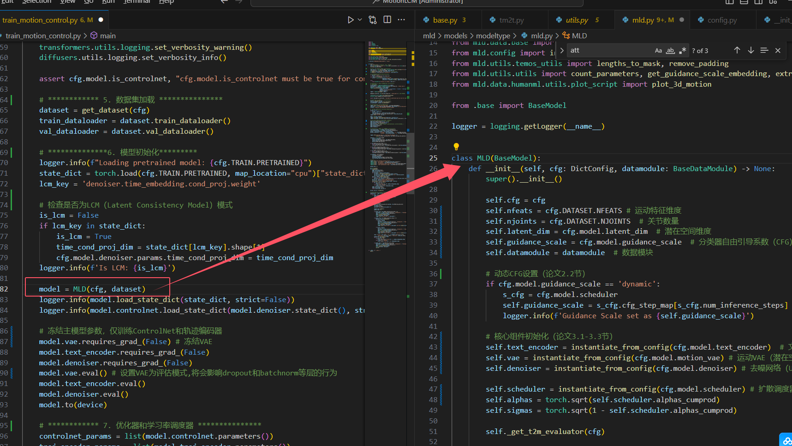

# motionLCM 动作生成controlNet 部分 

# mld.py

MLD(BaseModel)

mld继承BaseModel


这段代码实现了一个基于 **ControlNet** 和 **潜在扩散模型（Latent Diffusion Model, LDM）** 的可控动作生成系统，对应论文中的核心方法部分。以下是代码与论文理论（公式/章节）的对应关系详解：

---

### **1. 核心组件与论文对应**
#### **(1) 模型架构（论文3.1-3.3节）**
- **`self.vae` (运动VAE)**  
  - 对应论文 **3.1节** 的潜在空间压缩模块，将动作数据编码到低维潜在空间（公式1-2）。  
  - 代码中通过 `vae.encode()` 和 `vae.decode()` 实现压缩与重建。

- **`self.denoiser` (去噪网络)**  
  - 对应论文 **3.2节** 的扩散模型主干（U-Net），负责在潜在空间中迭代去噪（公式3-5）。  
  - 核心逻辑在 `_diffusion_reverse()` 方法中实现。

- **`self.controlnet` 和 `self.traj_encoder` (ControlNet模块)**  
  - 对应论文 **3.3节** 的运动控制网络，通过用户输入的控制信号（如初始姿态轨迹）引导生成过程。  
  - 代码中通过 `controlnet_residuals` 计算控制残差（公式6-7）。

---

### **2. 关键公式与代码实现**


#### **双阶段监督机制**：  
在$\Theta^a$引导下，MotionLCM通过一致性函数$f_{\boldsymbol{\Theta}^*}$（$\Theta^* = \Theta^a + \Theta^b + \Theta$）预测去噪后的潜在$\hat{\mathbf{z}}_0$，并通过以下重建损失优化参数：  
$$
\mathcal{L}_{\mathrm{recon}}(\Theta^{a},\Theta^{b})=\mathbb{E}\left[d\left(f_{\Theta^{*}}\left(\mathbf{z}_{n},t_{n},w,\mathbf{c}^{*}\right),\mathbf{z}_{0}\right)\right], \tag{8}
$$
其中$\mathbf{c}^*$包含文本条件及轨迹编码器与ControlNet的联合控制信号。  （预测去噪后的潜在$\hat{\mathbf{z}}_0$和真实$\mathbf{z}_{0}$的 loss）

**关键符号说明**

- **$\mathbf{z}_0$**：**真实的潜在动作表示**（去噪目标），由VAE编码器 $\mathcal{E}$ 从原始动作 $\mathbf{x}_0$ 压缩得到（$\mathbf{z}_0 = \mathcal{E}(\mathbf{x}_0)$）。
- **$\mathbf{z}_n$**：第 $n$ 步的带噪声潜在动作（输入模型）。
- **$\hat{\mathbf{z}}_0$**：模型预测的 **去噪后的潜在动作**（即 $f_{\Theta^*}(\mathbf{z}_n, t_n, w, \mathbf{c}^*)$ 的输出）。
- **$\mathbf{c}^*$**：控制条件，包括文本描述和轨迹编码器 $\Theta^b$ 输出的CLS token。

具体解释：

$$ \mathcal{L}_{\mathrm{recon}}(\Theta^{a},\Theta^{b})=\mathbb{E}\left[d\left(f_{\Theta^{*}}\left(\mathbf{z}_{n},t_{n},w,\mathbf{c}^{*}\right),\mathbf{z}_{0}\right)\right] $$

在这个重建损失 $\mathcal{L}_{\mathrm{recon}}$ 的公式中：

1.  **`f(...)`**：
    *   这代表模型（由参数 $\Theta^*$ 定义）的**预测函数**或**去噪函数**。
    *   它的输入包括：
        *   $\mathbf{z}_{n}$: 带噪声的潜空间表示。
        *   $t_{n}$: 当前的扩散时间步。
        *   $w$: 可能是一个权重或其他扩散相关的参数。
        *   $\mathbf{c}^{*}$: 结合了文本描述和初始轨迹控制信号的条件信息。
    *   `f` 的输出是模型根据这些输入预测得到的**去噪后的潜空间表示**（即期望的 $\hat{\mathbf{z}}_0$）。

2.  **`d(...)`**：
    *   这代表一个**距离函数**或**差异度量函数**。
    *   它接受两个输入：
        *   $f_{\Theta^{*}}(\mathbf{z}_{n},t_{n},w,\mathbf{c}^{*})$: 模型预测的去噪后潜空间表示。
        *   $\mathbf{z}_{0}$: 真实的、原始的（未加噪的）潜空间表示。
    *   `d` 的作用是计算模型预测结果与真实目标 ($\mathbf{z}_0$) 之间的“距离”或“差异”。在机器学习损失函数中，通常是均方误差 (L2 loss) 或平均绝对误差 (L1 loss) 等。

3.  **$\mathbb{E}[\cdot]$**：
    *   这代表**期望值 (Expected Value)**。
    *   在训练过程中，模型会处理大量不同的数据样本、不同的加噪程度（对应不同的 $t_n$ 和 $\mathbf{z}_n$）以及不同的条件 $\mathbf{c}^{*}$。期望值意味着对这些所有可能的随机情况下的损失值求平均。
    *   损失函数 $\mathcal{L}_{\mathrm{recon}}$ 是这个距离 $d$ 的**期望**，表示在整个数据集和所有可能的扩散过程下，模型预测与真实值之间的平均差异。训练优化的目标就是最小化这个平均差异。

总而言之，这个公式表达的重建损失是模型预测的去噪潜空间表示与真实的去噪潜空间表示之间距离的期望值。模型通过最小化这个损失来学习准确地从带噪声的潜空间和条件信息中恢复原始的潜空间表示。


代码中的 `n_set['sample_pred']` 和 `n_set['sample_gt']` 可能对应原文的 $\hat{\mathbf{z}}_0$ 和 $\mathbf{z}_0$

```python
# 论文公式8：z₀的重构误差（对应diff_loss）
if self.scheduler.config.prediction_type == "epsilon":
    model_pred, target = n_set['noise_pred'], n_set['noise'] 
else:
    model_pred, target = n_set['sample_pred'], n_set['sample_gt']
diff_loss = F.mse_loss(model_pred, target)  # 潜在空间L2损失
```


```python
text_emb = self.text_encoder(text)
n_set = self._diffusion_process(z, text_emb, hint=hint, hint_mask=hint_mask)
loss_dict = dict()

if self.denoiser.time_cond_proj_dim is not None:
    # LCM (only used in motion ControlNet)   //controlNet 这里是直接预测样本吧 latents_pred
    model_pred, target = n_set['sample_pred'], n_set['sample_gt']
    # Performance comparison: l2 loss > huber loss when training controlnet for LCM
    diff_loss = F.mse_loss(model_pred, target, reduction="mean")
else:
    # DM
    if self.scheduler.config.prediction_type == "epsilon":
        model_pred, target = n_set['noise_pred'], n_set['noise']
    elif self.scheduler.config.prediction_type == "sample": 
        model_pred, target = n_set['sample_pred'], n_set['sample_gt']
    else:
        raise ValueError(f"Invalid prediction_type {self.scheduler.config.prediction_type}.")
    diff_loss = F.mse_loss(model_pred, target, reduction="mean")

loss_dict['diff_loss'] = diff_loss

# Router loss
loss_dict['router_loss'] = n_set['router_loss'] if n_set['router_loss'] is not None \
    else torch.tensor(0., device=diff_loss.device)
```


```python
n_set = {
            "noise": noise,
            "noise_pred": noise_pred,
            "sample_pred": latents_pred,
            "sample_gt": latents,
            "router_loss": router_loss_controlnet if self.is_controlnet else router_loss
        }
```


>这段代码是一个 **扩散模型（Diffusion Model）的训练损失计算部分**，支持 **传统扩散模型（DM）** 和 **Latent Consistency Model（LCM）** 两种模式。我来详细解释它的逻辑：
>
>---
>
>### **1. 输入处理**
>- `text_emb = self.text_encoder(text)`  
>  - 使用 `text_encoder`（如 CLIP 文本编码器）将输入文本 `text` 编码成嵌入向量 `text_emb`。
>- `n_set = self._diffusion_process(z, text_emb, hint=hint, hint_mask=hint_mask)`  
>  - 调用 `_diffusion_process` 方法，传入：
>    - `z`：噪声或潜在变量（通常是加噪后的输入）。
>    - `text_emb`：文本嵌入，用于条件生成。
>    - `hint` 和 `hint_mask`（可选）：控制信号（如 ControlNet 的额外条件输入，如边缘图、深度图等）。
>  - 返回 `n_set`，一个包含预测结果的字典，可能包括：
>    - `noise_pred`（噪声预测，用于 DM 的 `epsilon` 模式）。
>    - `sample_pred`（样本预测，用于 DM 的 `sample` 模式或 LCM）。
>    - `sample_gt`（目标样本，用于计算损失）。
>    - `noise`（目标噪声，用于 DM 的 `epsilon` 模式）。
>
>---
>
>### **2. 损失计算**
>根据模型类型（DM 或 LCM）和预测目标类型（`epsilon` 或 `sample`），计算 MSE 损失：
>
>#### **(1) LCM 模式（Latent Consistency Model）**
>- **条件**：`self.denoiser.time_cond_proj_dim is not None`  
>  - 检查是否使用了 LCM（通常 LCM 的 `time_cond_proj_dim` 不为 `None`）。
>- **预测目标**：直接预测样本（`sample_pred` vs `sample_gt`）。
>  ```python
>  model_pred, target = n_set['sample_pred'], n_set['sample_gt']
>  diff_loss = F.mse_loss(model_pred, target, reduction="mean")
>  ```
>  - 注释提到 LCM 模式下，L2 损失（MSE）比 Huber 损失效果更好。
>
>#### **(2) DM 模式（传统扩散模型）**
>- **条件**：`else` 分支，即非 LCM 模式。
>- **根据 `prediction_type` 选择预测目标**：
>  - `"epsilon"`（默认）：预测噪声。
>    ```python
>    model_pred, target = n_set['noise_pred'], n_set['noise']
>    ```
>  - `"sample"`：预测去噪后的样本。
>    ```python
>    model_pred, target = n_set['sample_pred'], n_set['sample_gt']
>    ```
>  - 其他情况报错（如 `v_prediction` 等未实现）。
>- **计算 MSE 损失**：
>  ```python
>  diff_loss = F.mse_loss(model_pred, target, reduction="mean")
>  ```
>
>---
>
>### **3. 输出损失**
>- 将损失存入 `loss_dict` 并返回：
>  ```python
>  loss_dict['diff_loss'] = diff_loss
>  ```
>  - 后续可能还会添加其他损失（如 KL 散度、感知损失等）。
>
>---
>
>### **关键点总结**
>1. **支持两种模式**：
>   - **LCM**：直接预测样本，适用于快速生成（如 Motion ControlNet）。
>   - **DM**：传统扩散模型，支持 `epsilon`（预测噪声）或 `sample`（预测样本）两种目标。
>2. **损失函数**：均使用 MSE（L2 损失），但 LCM 模式下明确提到 MSE 优于 Huber 损失。
>3. **条件控制**：通过 `hint` 和 `hint_mask` 支持 ControlNet 类型的条件生成。
>
>---
>
>### **补充说明**
>- 如果是 **Stable Diffusion** 或类似模型：
>  - `z` 可能是 VAE 编码后的潜在变量。
>  - `prediction_type="epsilon"` 是常见配置（预测噪声）。
>- 如果是 **LCM** 相关工作：
>  - 可能使用了 `sample` 预测，因为 LCM 的目标是加速采样过程。
>
>这样应该能清晰理解代码的逻辑了！如果有具体应用场景（如 Stable Diffusion + ControlNet），可以进一步讨论细节。

#### **(1) 控制损失函数（论文公式9）**
- **公式**：  
  $$
  \mathcal{L}_{\text{control}} = \mathbb{E}\left[\frac{\sum_{i,j} m_{ij} \|R(\hat{\mathbf{x}}_0)_{ij} - R(\mathbf{x}_0)_{ij}\|_2^2}{\sum_{i,j} m_{ij}}\right]
  $$
- **代码实现**：  
  
  - 在 `train_diffusion_forward()` 中通过 `control_loss_calculate()` 计算（调用位置见下方代码段）：
    ```python
    cond_loss = control_loss_calculate(
        self.vaeloss_type, 
        self.control_loss_func, 
        joints_rst, # ^x0
        hint,	    # x0
        hint_mask   # mij
    )
    ```
  - 具体计算逻辑：
    - `joints_rst`：模型生成的动作关节坐标（$\hat{\mathbf{x}}_0$）。
    - `hint`：用户指定的目标关节坐标（$\mathbf{x}_0$）。
    - `hint_mask`：二进制掩码（$m_{ij}$），选择需要控制的关节。
    - $R(\cdot)$：通过 `self.datamodule.denorm_spatial()` 或 `norm_spatial()` 实现坐标转换。（==应该是转到世界空间。==）
    
    > $R(\cdot)$函数的实现，可以看这个函数：`def feats2joints(self, features: torch.Tensor) -> torch.Tensor:`，这里面调用了`recover_from_ric(features, self.njoints)`，里面涉及了从关节空间转到世界空间的代码。


>D:\_Postgraduate\motionGen\MotionLCM\MotionLCM\mld\utils\utils.py
>
>```PYTHON
>def sum_flat(tensor: torch.Tensor) -> torch.Tensor:
>return tensor.sum(dim=list(range(1, len(tensor.shape))))
>    
>
>def control_loss_calculate(
>   vaeloss_type: str, loss_func: str, src: torch.Tensor,
>        tgt: torch.Tensor, mask: torch.Tensor
>     ) -> torch.Tensor:
>
>if loss_func == 'l1':
>       loss = F.l1_loss(src, tgt, reduction='none')
>     elif loss_func == 'l1_smooth':
>       loss = F.smooth_l1_loss(src, tgt, reduction='none')
>     elif loss_func == 'l2':
>       loss = F.mse_loss(src, tgt, reduction='none')
>     else:
>       raise ValueError(f'Unknown loss func: {loss_func}')
>     
>if vaeloss_type == 'sum':
>       loss = loss.sum(-1, keepdims=True) * mask
>        loss = loss.sum() / mask.sum()
>     elif vaeloss_type == 'sum_mask':
>       loss = loss.sum(-1, keepdims=True) * mask
>        loss = sum_flat(loss) / sum_flat(mask)
>        loss = loss.mean()
>     elif vaeloss_type == 'mask':
>       loss = sum_flat(loss * mask)
>        n_entries = src.shape[-1]
>        non_zero_elements = sum_flat(mask) * n_entries
>        loss = loss / non_zero_elements
>        loss = loss.mean()
>     else:
>       raise ValueError(f'Unsupported vaeloss_type: {vaeloss_type}')
>     
>return loss
>    
>```
>
>
>
>这段代码实现的 `control_loss_calculate` 函数与论文中的 **控制损失公式（公式9）** 直接对应，但根据不同的 `vaeloss_type` 参数，实现了对原始公式的三种变体计算方式。以下是逐行解析与公式的对应关系：
>
>---
>
>### **1. 论文中的原始公式（公式9）**
>$$\mathcal{L}_{\text{control}} = \mathbb{E}\left[\frac{\sum_{i,j} m_{ij} \|R(\hat{\mathbf{x}}_0)_{ij} - R(\mathbf{x}_0)_{ij}\|_2^2}{\sum_{i,j} m_{ij}}\right]$$
>
>- **符号说明**：
> - $\hat{\mathbf{x}}_0$：模型生成的动作（代码中的 `src`）。
>  - $\mathbf{x}_0$：目标动作（代码中的 `tgt`）。
>  - $m_{ij}$：二进制掩码（代码中的 `mask`），控制哪些关节参与损失计算。
>  - $R(\cdot)$：坐标变换（对应去噪网络生成的结果会直接转换到世界空间去做损失，参考`mld.py`的第453行左右，`joints_rst = self.feats2joints(feats_rst)`）。
>  - $\|\cdot\|_2^2$：L2损失（对应代码中的 `loss_func='l2'`）。
> 
>---
>
>### **2. 代码与公式的对应关系**
>#### **(1) 基础损失计算（前4行）**
>```python
>if loss_func == 'l1':
>   loss = F.l1_loss(src, tgt, reduction='none')  # L1损失
> elif loss_func == 'l1_smooth':
>   loss = F.smooth_l1_loss(src, tgt, reduction='none')  # Smooth L1
> elif loss_func == 'l2':
>   loss = F.mse_loss(src, tgt, reduction='none')  # L2损失（对应公式9）
> ```
>- 这部分选择具体的损失函数，**`loss_func='l2'` 时完全对应公式9的L2范数**。  
>- 其他选项（L1/Smooth L1）是论文未提及的扩展实现。
>
>#### **(2) 掩码加权与归一化（后12行）**
>根据 `vaeloss_type` 参数，代码实现了三种归一化方式：
>
>| **`vaeloss_type`** | **计算逻辑**                                                 | **对应公式9的变体**                     |
>| ------------------ | ------------------------------------------------------------ | --------------------------------------- |
>| `'sum'`            | 对关节维度求和后掩码加权，再全局平均（`loss.sum() / mask.sum()`） | **严格对应公式9**                       |
>| `'sum_mask'`       | 对关节维度求和后掩码加权，按样本独立归一化（`sum_flat(loss) / sum_flat(mask)`） | 公式9的分母改为逐样本计算               |
>| `'mask'`           | 直接掩码加权后按总有效元素归一化（`sum_flat(loss * mask) / non_zero_elements`） | 公式9的分母改为总有效关节数（非掩码和） |
>
>##### **关键代码片段解析**：
>- **`sum_flat` 函数**：将除batch维度外的所有维度求和（对应公式中的 $\sum_{i,j}$）。
>- **掩码应用**：`loss * mask` 或 `loss.sum(-1) * mask` 对应公式中的 $m_{ij} \|\cdot\|$。
>- **归一化**：分母 `mask.sum()` 或 `sum_flat(mask)` 对应公式中的 $\sum_{i,j} m_{ij}$。
>
>---
>
>### **3. 具体示例与公式验证**
>假设输入张量形状为 `(batch=2, joints=3, coords=3)`：
>- `src`（预测值）：形状 `(2,3,3)`  
>- `tgt`（目标值）：形状 `(2,3,3)`  
>- `mask`：形状 `(2,3,1)`，值为 `[[1,0,1], [1,1,0]]`（第一个样本忽略第2关节）
>
>##### **当 `vaeloss_type='sum'` 时**：
>1. 计算L2损失：`loss = (src - tgt)^2` → 形状 `(2,3,3)`  
>2. 对关节和坐标求和：`loss.sum(-1)` → 形状 `(2,3)`  
>3. 掩码加权：`loss.sum(-1) * mask.squeeze(-1)` → 形状 `(2,3)`  
>  - 第一个样本：第2关节的损失被掩码置0  
> 4. 全局平均：`loss.sum() / mask.sum()`  
>  - 分母是总有效关节数（此处为 `1+1 +1+1=4`）
> 
>**与公式9完全一致**：$$\frac{\sum_{\text{batch}}\sum_{\text{joints}} m_{ij} \cdot \text{L2}}{\sum m_{ij}}$$
>
>---
>
>### **4. 总结**
>- **直接对应**：`vaeloss_type='sum'` 是公式9的精确实现。  
>- **扩展变体**：`sum_mask` 和 `mask` 是工程优化（如逐样本归一化、避免掩码和为零）。  
>- **灵活性**：支持L1/L2/Smooth L1损失，但论文中仅提到L2（MSE）。  
>
>若论文未明确说明归一化方式，默认 `vaeloss_type='sum'` 是最接近原文的实现。


#### **(2) 双空间监督（论文3.3节）**
- **潜在空间损失**：扩散模型的噪声预测损失（`diff_loss`），对应公式4。
- **动作空间损失**：通过VAE解码后的 `cond_loss` 和 `rot_loss`，对应公式9。
- 代码中通过 `vaeloss` 标志控制是否启用双监督：
  ```python
  if self.is_controlnet and self.vaeloss:
      feats_rst = self.vae.decode(n_set['sample_pred'], mask)
      joints_rst = self.feats2joints(feats_rst)
      cond_loss = ...  # 动作空间控制损失
      rot_loss = ...   # 潜在空间重建损失
  ```

#### **(3) 分类器自由引导（CFG, 论文2.2节）**
- 公式：$$\epsilon_\theta = \epsilon_\text{uncond} + w \cdot (\epsilon_\text{cond} - \epsilon_\text{uncond})$$
- 代码实现（`_diffusion_reverse()` 方法）：
  ```python
  if self.do_classifier_free_guidance:
      model_output_text, model_output_uncond = model_output.chunk(2)
      model_output = model_output_uncond + self.guidance_scale * (model_output_text - model_output_uncond)
  ```

---

### **3. 训练流程与论文对应**
#### **(1) 扩散过程（论文算法1）**
- **噪声添加**：对应 `_diffusion_process()` 中的 `scheduler.add_noise()`。
- **噪声预测**：去噪网络 `denoiser` 预测噪声（`model_output`）。

#### **(2) 控制信号融合**
- ControlNet的残差输出与去噪网络特征融合：
  ```python
  controlnet_residuals = self.controlnet(...)
  model_output = self.denoiser(..., controlnet_residuals=controlnet_residuals)
  ```

---

### **4. 代码中其他关键点**
- **潜在空间优化**：`_optimize_latents()` 方法通过梯度下降微调初始噪声，提升控制精度（论文未明确提及，属于实现细节）。
- **动态CFG**：根据调度器步数动态调整 `guidance_scale`（对应论文2.2节动态权重策略）。
- **LCM加速**：若 `denoiser.time_cond_proj_dim` 非空，启用Latent Consistency Model（论文3.2节提及的快速采样）。

---

### **总结：代码与论文的映射表**
| **代码组件/方法**        | **论文对应部分**            | **核心公式**     |
| ------------------------ | --------------------------- | ---------------- |
| `self.vae`               | 3.1节（潜在空间压缩）       | 公式1-2          |
| `self.denoiser`          | 3.2节（扩散模型）           | 公式3-5          |
| `self.controlnet`        | 3.3节（运动控制）           | 公式6-7          |
| `control_loss_calculate` | 3.3节（控制损失）           | 公式9            |
| CFG引导逻辑              | 2.2节（动态分类器自由引导） | 论文式(8)        |
| 双空间监督 (`vaeloss`)   | 3.3节（多空间训练）         | 公式9 + 潜在损失 |

通过这段代码，论文中的理论被完整实现为一个端到端的可控动作生成系统，其中ControlNet的引入是关键创新点，使得用户可以通过轨迹或姿态信号精确控制生成结果。


### 5.详细解读MLD模型的forward函数

#### （1）基本量的准备工作

```python
def forward(self, batch: dict) -> tuple:
    texts = batch["text"] # len = 32,是一个batch的大小
    feats_ref = batch.get("motion") # torch.Size([32, 52, 263])，52是帧数，263是特征数
    lengths = batch["length"]  # [32]，每个batch中每个sample的长度
    hint = batch.get('hint')  # torch.Size([32, 52, 22, 3])， 22是关节数，3是xyz坐标
    hint_mask = batch.get('hint_mask')  # torch.Size([32, 52, 22, 3])，mask，一般只有pelvis这根骨骼对应的区域是1

    if self.do_classifier_free_guidance:
        texts = texts + [""] * len(texts)

    text_emb = self.text_encoder(texts) # torch.Size([32, 1, 768])

    controlnet_cond = None
    if self.is_controlnet:
        assert hint is not None
        hint_reshaped = hint.view(hint.shape[0], hint.shape[1], -1)  # torch.Size([32, 52, 66])，也就是把关节数和xyz坐标进行合并维度
        hint_mask_reshaped = hint_mask.view(hint_mask.shape[0], hint_mask.shape[1], -1).sum(dim=-1) != 0  # torch.Size([32, 52])，由True和False组成，见注解【1】
        controlnet_cond = self.traj_encoder(hint_reshaped, hint_mask_reshaped) # 接下来详细介绍
```

以下为注解部分：

- 【注解1】：`hint_mask_reshaped = hint_mask.view(hint_mask.shape[0], hint_mask.shape[1], -1).sum(dim=-1) != 0  # torch.Size([32, 52])`

> 这段代码的作用是处理一个名为 `hint_mask` 的多维张量，目的是生成一个**布尔掩码**，用于标记哪些样本或帧是被mask住的。输出的结果为`torch.Size([32, 52])`，某个值为True表示这一帧的所有关节姿势有原本`hint_mask==1`的位置，否则表示所有关节姿势的`hint_mask==0`。
>
> ---
>
> ### **输入 `hint_mask` 的结构**
> - **形状**: `[32, 52, 22, 3]`  
>   - `32`: Batch size（批量大小）。  
>   - `52`: 序列长度（如时间步或帧数）。  
>   - `22`: 关节数量（如人体骨骼的22个关节）。  
>   - `3`: 每个关节的掩码维度（可能是XYZ坐标或旋转分量的掩码）。
>
> - **掩码含义**:  
>   通常只有 `pelvis`（根关节）对应的区域为 `1`，其他关节为 `0`，表示仅对根关节的某些操作（如位置约束或旋转约束）有效。
>
> ---
>
> ### **代码解析**
> #### 1. **重塑张量形状**
>    ```python
>    hint_mask_reshaped = hint_mask.view(hint_mask.shape[0], hint_mask.shape[1], -1)
>    ```
>    - 将 `hint_mask` 从 `[32, 52, 22, 3]` 重塑为 `[32, 52, 22*3]`（即合并最后两个维度）。  
>    - 例如，每个关节的3个掩码维度被展平为1个长度为 `66`（22×3）的向量。
>
> #### 2. **求和并判断非零**
>    ```python
>    hint_mask_reshaped.sum(dim=-1) != 0
>    ```
>    - **`sum(dim=-1)`**: 对展平后的最后一维（`22*3`）求和，得到形状 `[32, 52]`。  
>      - 每个值表示对应样本和帧中所有关节掩码的总和。  
>      - 如果 `pelvis` 的掩码为 `1`，其他关节为 `0`，则求和结果为 `3`（因为 `pelvis` 的3个维度均为 `1`）。  
>    - **`!= 0`**: 将求和结果转换为布尔值，标记哪些位置（样本和帧）的掩码至少有一个非零值。  
>      - 最终输出形状为 `[32, 52]` 的布尔张量，`True` 表示对应帧的 `pelvis` 有有效掩码。
>
> ---
>
> ### **输出结果的意义**
> - **布尔掩码**:  
>   例如，若 `hint_mask_reshaped[0, 10]` 是 `True`，表示第0个样本的第10帧中，至少有一个关节（通常是 `pelvis`）的掩码被激活（非零）。  
> - **用途**:  
>   该掩码通常用于后续操作（如损失计算或数据筛选），例如：  
>   - 仅在掩码为 `True` 的帧上计算损失（如根关节的位置约束）。  
>   - 过滤掉无约束的帧（掩码为 `False` 的帧）。
>
> ---
>
> ### **具体例子**
> 假设 `hint_mask` 的某个样本和帧如下（简化版）：
> ```python
> hint_mask[0, 10] = [
>     [1, 1, 1],  # pelvis（根关节）
>     [0, 0, 0],  # 其他关节...
>     ...
> ]
> ```
> - **展平后**: `[1, 1, 1, 0, 0, 0, ...]`（共66维）。  
> - **求和**: `1 + 1 + 1 + 0 + ... = 3`。  
> - **判断非零**: `3 != 0` → `True`。  
>
> 最终掩码中 `hint_mask_reshaped[0, 10] = True`。
>
> ---
>
> ### **总结**
> 这段代码的核心是**检测哪些帧的根关节（或其他指定关节）被掩码标记为有效**，生成一个布尔掩码供后续操作使用。这种技术常见于动作生成或姿态估计任务中，用于处理部分关节的约束或注意力机制。


#### （4）traj_encoder部分

在下面的笔记中已经有了一部分的解释，这里结合debug再过一遍。

##### （a）原文提到的【CLS】标记是什么？


> 在动作生成或轨迹生成任务中，**`[CLS]`标记**（全局标记）的核心作用是**捕获序列的全局运动语义**，并作为控制信号指导生成过程。以下是它在实际任务中的典型用途和原理：
>
> ---
>
> ### **1. 全局运动表征聚合**
> - **功能**：  
>   `[CLS]`标记通过Transformer的自注意力机制，聚合整个轨迹序列的全局信息（如运动风格、速度分布、运动相位等）。  
> - **为什么需要？**  
>   动作生成需要理解长程依赖（如“走路”时手臂摆动与腿部步伐的协调），而普通RNN/CNN难以直接建模全局关系。`[CLS]`标记提供了一种显式的全局上下文压缩表示。
>
> ---
>
> ### **2. 具体应用场景**
> #### **(1) 运动风格控制**
> - **示例任务**：生成“悠闲散步”或“快速奔跑”的轨迹。  
> - **实现方式**：  
>   - `[CLS]`标记的嵌入向量会编码风格特征（如步幅、节奏）。  
>   - 在生成时，可通过调整`[CLS]`的输入值（或条件注入）控制输出动作的风格。
>
> #### **(2) 运动阶段识别**
> - **示例任务**：判断当前动作是“起步”“持续”还是“停止”阶段。  
> - **实现方式**：  
>   `[CLS]`标记的输出特征可用于分类运动阶段，辅助生成连贯的过渡动作（如从走到跑）。
>
> #### **(3) 多关节协同控制**
> - **示例任务**：生成全身运动时，确保手臂和腿部运动协调。  
> - **实现方式**：  
>   `[CLS]`标记隐式学习关节间的协同规则（如“跑步时手臂前后摆动”），避免生成不合理的局部动作。
>
> ---
>
> ### **3. 技术实现细节**
> #### **(1) 标记的初始化与训练**
> - **初始化**：`[CLS]`是一个可学习的参数向量（随机初始化），附加在输入序列开头：  
>   ```python
>   # 伪代码：输入轨迹序列 (B: batch, T: 时间步, D: 关节维度)
>   input_sequence = torch.cat([cls_token.expand(B, 1, D), trajectory], dim=1)  # 形状 [B, T+1, D]
>   ```
> - **训练**：通过反向传播更新`[CLS]`的参数，使其逐渐捕获有意义的全局特征。
>
> #### **(2) 与生成模型的交互**
> - **条件输入**：生成模型（如ControlNet、Diffusion）以`[CLS]`特征为条件：  
>   ```python
>   # 伪代码：扩散模型中的条件注入
>   denoised_output = model(noisy_data, global_condition=cls_feature)
>   ```
> - **注意力机制**：生成器的交叉注意力层会显式关注`[CLS]`标记，确保输出与全局语义一致。
>
> #### **(3) 输出端的使用**
> - **直接预测**：某些模型直接用`[CLS]`标记的输出预测动作类别或物理参数（如速度）。  
> - **特征融合**：将`[CLS]`特征与局部关节特征拼接，增强生成细节。
>
> ---
>
> ### **4. 对比其他全局表征方法**
> | 方法                | 优点                         | 缺点                         |
> | ------------------- | ---------------------------- | ---------------------------- |
> | **`[CLS]`标记**     | 显式建模全局关系；可解释性强 | 依赖Transformer计算开销      |
> | **池化（Pooling）** | 计算简单                     | 丢失时序信息，难以处理长序列 |
> | **RNN最后隐藏状态** | 天然时序建模                 | 长程依赖捕捉能力弱           |
>
> ---
>
> ### **5. 经典论文案例**
> - **Motion Transformer**（[Guo et al., CVPR 2022](https://arxiv.org/abs/2204.08010)）  
>   使用`[CLS]`标记编码运动风格，并作为扩散模型的条件信号生成多样化动作。  
> - **Action-Conditioned Generation**（[Petrovich et al., SIGGRAPH 2023](https://arxiv.org/abs/2304.08839)）  
>   将`[CLS]`标记与动作类别嵌入结合，控制生成动作的语义（如“挥手”或“跳跃”）。
>
> ---
>
> ### **总结**
> 在动作生成中，`[CLS]`标记的核心价值是：  
> 1. **提供紧凑的全局运动表示**，解决长序列建模问题；  
> 2. **作为条件信号**，控制生成动作的风格、阶段或语义；  
> 3. **增强多关节协同**，避免局部生成矛盾。  
>
> 它是连接轨迹编码（理解）与生成（控制）的关键桥梁，尤其在基于Transformer的Pipeline中不可或缺。


# train_motion_control.py

#### **1. 功能定位**

- **train_motion_control.py**：训练流程控制脚本，负责数据加载、模型训练、验证和保存。
- **mld.py**：模型定义文件，包含MLD模型的核心逻辑（如ControlNet结构、扩散过程、损失计算）。


```python
# 冻结主模型参数，仅训练ControlNet和轨迹编码器
model.vae.requires_grad_(False) # 冻结VAE
model.text_encoder.requires_grad_(False)
model.denoiser.requires_grad_(False)
model.vae.eval() # 设置VAE为评估模式,将会影响dropout和batchnorm等层的行为
model.text_encoder.eval()
model.denoiser.eval()
model.to(device)
```

 **可视化理解**

```
复制代码训练前的模型：
[VAE] → [Text Encoder] → [Denoiser] → [ControlNet] → [Traj Encoder]
  │          │               │              │               │
  ✗梯度       ✗梯度            ✗梯度           ✓梯度           ✓梯度
  ✗Dropout   ✗Dropout        ✗Dropout       ✓Dropout        ✓Dropout
```


以下是`train_motion_control.py`代码的逐行解析，以及与`mld.py`中ControlNet相关代码的对比分析：

---

### **train_motion_control.py 逐行解析**

#### **1. 初始化与配置**
```python
import os
import sys
import logging
import datetime
import os.path as osp
from tqdm.auto import tqdm
from omegaconf import OmegaConf
import torch
import swanlab
import diffusers
import transformers
from torch.utils.tensorboard import SummaryWriter
from diffusers.optimization import get_scheduler
from mld.config import parse_args
from mld.data.get_data import get_dataset
from mld.models.modeltype.mld import MLD
from mld.utils.utils import print_table, set_seed, move_batch_to_device
```
- **功能**：导入必要的库，包括日志、配置管理（OmegaConf）、深度学习框架（PyTorch）、扩散模型库（diffusers）、可视化工具（TensorBoard/SwanLab）等。

#### **2. 主函数入口**
```python
def main():
    cfg = parse_args()  # 解析命令行参数和配置文件
    device = torch.device('cuda') if torch.cuda.is_available() else torch.device('cpu')
    set_seed(cfg.SEED_VALUE)  # 设置随机种子
```
- **关键点**：初始化配置、设备选择和随机种子。

#### **3. 输出目录与日志设置**
```python
    name_time_str = osp.join(cfg.NAME, datetime.datetime.now().strftime("%Y-%m-%dT%H-%M-%S"))
    cfg.output_dir = osp.join(cfg.FOLDER, name_time_str)  # 创建带时间戳的输出目录
    os.makedirs(cfg.output_dir, exist_ok=False)
    os.makedirs(f"{cfg.output_dir}/checkpoints", exist_ok=False)  # 保存模型的子目录

    # 可视化工具初始化（TensorBoard或SwanLab）
    if cfg.vis == "tb":
        writer = SummaryWriter(cfg.output_dir)
    elif cfg.vis == "swanlab":
        writer = swanlab.init(...)
    else:
        raise ValueError(f"Invalid vis method: {cfg.vis}")

    # 日志配置（同时输出到文件和终端）
    logging.basicConfig(level=logging.INFO, handlers=[file_handler, stream_handler])
    logger = logging.getLogger(__name__)
    OmegaConf.save(cfg, osp.join(cfg.output_dir, 'config.yaml'))  # 保存配置文件
```
- **关键点**：实验结果的存储和可视化初始化。

#### **4. 模型加载与ControlNet验证**
```python
    assert cfg.model.is_controlnet, "cfg.model.is_controlnet must be true for controlling!"
    dataset = get_dataset(cfg)  # 获取数据集
    train_dataloader = dataset.train_dataloader()
    val_dataloader = dataset.val_dataloader()

    # 加载预训练模型
    state_dict = torch.load(cfg.TRAIN.PRETRAINED, map_location="cpu")["state_dict"]
    is_lcm = 'denoiser.time_embedding.cond_proj.weight' in state_dict  # 检查是否为LCM（潜在一致性模型）
    
    model = MLD(cfg, dataset)  # 初始化模型
    model.load_state_dict(state_dict, strict=False)
    model.controlnet.load_state_dict(model.denoiser.state_dict(), strict=False)  # ControlNet权重初始化
```
- **关键点**：
  - 强制要求启用ControlNet（`is_controlnet=True`）。
  - ControlNet的权重从主去噪模型（`denoiser`）复制而来，这是ControlNet的标准初始化方式。

#### **5. 冻结非ControlNet参数**
```python
    model.vae.requires_grad_(False)
    model.text_encoder.requires_grad_(False)
    model.denoiser.requires_grad_(False)  # 冻结VAE、文本编码器和去噪器
    model.controlnet.requires_grad_(True)  # 仅训练ControlNet和轨迹编码器
    model.traj_encoder.requires_grad_(True)
```
- **目的**：仅训练ControlNet相关模块，其他部分保持冻结以节省计算资源。

#### **6. 优化器与学习率调度**
```python
    optimizer = torch.optim.AdamW(
        params_to_optimize,  # 仅包含ControlNet和轨迹编码器的参数
        lr=cfg.TRAIN.learning_rate,
        betas=(cfg.TRAIN.adam_beta1, cfg.TRAIN.adam_beta2)
    )
    lr_scheduler = get_scheduler(
        cfg.TRAIN.lr_scheduler,
        optimizer=optimizer,
        num_warmup_steps=cfg.TRAIN.lr_warmup_steps,
        num_training_steps=cfg.TRAIN.max_train_steps
    )
```
- **特点**：支持动态学习率调度（如余弦退火）。

#### **7. 训练循环**
```python
    while True:
        for batch in train_dataloader:
            loss_dict = model.allsplit_step('train', batch)  # 前向计算损失
            loss_dict['loss'].backward()  # 反向传播
            torch.nn.utils.clip_grad_norm_(params, cfg.TRAIN.max_grad_norm)  # 梯度裁剪
            optimizer.step()
            lr_scheduler.step()
            optimizer.zero_grad()

            # 定期验证和保存模型
            if global_step % cfg.TRAIN.validation_steps == 0:
                cur_km, cur_tj = validation()  # 验证集评估
                if cur_km < min_km:  # 保存最佳模型（基于关键点误差）
                    torch.save(...)
```
- **关键操作**：
  - 调用`model.allsplit_step`计算损失（包括扩散损失、条件损失、旋转损失）。
  - 验证时通过`validation()`函数评估模型性能。

---

### **与 mld.py 中ControlNet的关系**

**Q**: 如果我想修改模型结构，应该改哪个文件？
**A**: 直接修改`mld.py`中的类定义（如添加新层），`train_motion_control.py`通常无需改动。

**Q**: 训练超参数（如学习率）在哪里设置？
**A**: 在`train_motion_control.py`的优化器配置部分（与`mld.py`无关）。

**Q**: 如何知道`mld.py`中的哪些方法会被调用？
**A**: 搜索`train_motion_control.py`中所有`model.xxx()`的调用（如`model(batch)`会触发`forward()`）。



train_motion_control.py是会调用mld中定义的模型来进行训练

#### **1. 角色分工**
- **train_motion_control.py**：
  - **训练脚本**：负责控制训练流程（数据加载、优化、验证、保存模型）。
  - **仅训练ControlNet**：冻结其他模块，仅更新ControlNet和轨迹编码器。
- **mld.py**：
  - **模型定义**：实现ControlNet的核心逻辑（条件控制、损失计算、双空间监督）。
  - **完整功能**：包含ControlNet的前向传播、损失计算（如`control_loss_calculate`）和条件处理。

#### **2. 关键差异**
| **功能**             | **train_motion_control.py**         | **mld.py**                                      |
| -------------------- | ----------------------------------- | ----------------------------------------------- |
| **ControlNet初始化** | 从预训练模型加载，复制denoiser权重  | 定义ControlNet结构（`instantiate_from_config`） |
| **训练目标**         | 最小化扩散损失+条件损失             | 实现损失计算（如L2/Huber损失）                  |
| **条件处理**         | 通过`hint`和`hint_mask`传递控制信号 | 编码控制信号（`traj_encoder`）                  |
| **双空间监督**       | 不直接处理                          | 实现潜在空间和运动空间的联合监督（`vaeloss`）   |

#### **3. 核心代码联动**
1. **条件控制**：
   - `train_motion_control.py`将`hint`（如初始轨迹）传递给`model.allsplit_step`。
   - `mld.py`的`_diffusion_process`通过`traj_encoder`编码条件信号，生成`controlnet_cond`。

2. **损失计算**：
   
   - `mld.py`的`train_diffusion_forward`计算三部分损失：
     ```python
     loss_dict = {
         'diff_loss': 扩散损失,
         'cond_loss': 轨迹条件损失,
         'rot_loss': 关节旋转损失
     }
     ```
   - ==`train_motion_control.py`汇总这些损失并反向传播==。
   
3. **双空间监督**：
   - `mld.py`中若`vaeloss=True`，则在潜在空间和运动空间（关节坐标）同时计算损失：
     ```python
     feats_rst = self.vae.decode(...)  # 潜在空间→运动空间
     joints_rst = self.feats2joints(feats_rst)  # 运动特征→关节坐标
     cond_loss = control_loss_calculate(joints_rst, hint)  # 运动空间监督
     ```

---

### **总结**
- **train_motion_control.py**是训练流程的“控制器”，专注于训练策略（如学习率调度、模型保存）。
- **mld.py**是模型的“大脑”，实现了ControlNet的核心算法（条件编码、多任务损失）。两者通过`hint`条件和损失函数紧密协作，共同完成可控运动生成任务。


# demo.py

以下是关于轨迹编码器（Trajectory Encoder）的详细解析，结合论文与代码逻辑的完整说明：

---

### **1. 轨迹编码器（Trajectory Encoder）设计原理**
#### **输入数据格式**
- **原始控制信号**：初始τ帧的K个控制关节的全局绝对位置  
  $$\mathbf{g}^{1:\tau} = \{\mathbf{g}^i\}_{i=1}^{\tau}, \quad \mathbf{g}^i \in \mathbb{R}^{K \times 3}$$  
  - 每个$\mathbf{g}^i$表示第i帧时K个关节的3D坐标（X/Y/Z）
- **代码中的预处理**（对应论文图3(b)）：  
  ```python
  # 实际代码中的hint处理（假设batch['hint']形状为[B, T, K*3]）
  hint = batch['hint'].reshape(batch_size, -1, K, 3)  # 分解为关节维度
  hint = dataset.denorm_spatial(hint)  # 反归一化到原始坐标空间
  ```

#### **编码器架构**
- **核心组件**：堆叠的Transformer层（论文中标记为$\boxed{67}$）  
  ```python
  # 伪代码示意（实际实现可能使用PyTorch TransformerEncoder）
  class TrajectoryEncoder(nn.Module):
      def __init__(self):
          self.cls_token = nn.Parameter(torch.zeros(1, 1, d_model))  # [CLS]全局令牌
          self.embed = nn.Linear(K*3, d_model)  # 将3D坐标映射到隐空间
          self.transformer = TransformerEncoder(num_layers=6, d_model=d_model)
          
      def forward(self, g):
          B, T, K, _ = g.shape
          g = g.reshape(B, T, -1)  # 展平关节维度 [B,T,K*3]
          x = self.embed(g)  # 线性投影 [B,T,d_model]
          cls_tokens = self.cls_token.expand(B, -1, -1)  # 扩展[B,1,d_model]
          x = torch.cat([cls_tokens, x], dim=1)  # 添加[CLS] [B,T+1,d_model]
          return self.transformer(x)[:, 0]  # 返回[CLS]特征 [B,d_model]
  ```

#### **关键设计**
1. **[CLS]全局令牌**  
   - 作为整个轨迹序列的聚合表征，直接与潜在变量$\mathbf{z}_n$相加（公式8中的$\mathbf{c}^*$组成部分）
2. **零初始化技巧**  
   - ControlNet的附加线性层初始化为零，避免训练初期噪声干扰（论文3.3节第二段）

---

### **2. 控制信号与扩散过程的融合**
#### **联合训练目标**
- **双重损失函数**（公式10）：  
  $$\mathcal{L} = \mathcal{L}_{\text{recon}} + \lambda \mathcal{L}_{\text{control}}$$  
  - **潜在空间重建损失**（公式8）：  
    $$\mathcal{L}_{\text{recon}} = \mathbb{E}\left[d\left(f_{\Theta^*}(\mathbf{z}_n, t_n, w, \mathbf{c}^*), \mathbf{z}_0\right)\right]$$  
  - **运动空间控制损失**（公式9）：  
    $$\mathcal{L}_{\text{control}} = \mathbb{E}\left[\frac{\sum_{i,j} m_{ij} \|R(\hat{\mathbf{x}}_0)_{ij} - R(\mathbf{x}_0)_{ij}\|_2^2}{\sum_{i,j} m_{ij}}\right]$$  

#### **代码实现逻辑**
```python
# 训练循环伪代码（关键步骤）
z_noisy = q_sample(z_start, noise, t)  # 前向扩散加噪
c_text = text_encoder(prompts)  # 文本编码
c_traj = trajectory_encoder(hint)  # 轨迹编码

# ControlNet引导的降噪
z_pred = model(z_noisy, t, c_text, c_traj)  

# 损失计算
loss_recon = F.mse_loss(z_pred, z_start)  
x_pred = vae_decoder(z_pred)  # 解码到运动空间
loss_control = masked_mse(global_pos(x_pred), global_pos(x_gt), mask)
loss = loss_recon + lambda * loss_control
```

---

### **3. 与ControlNet的协同工作流程**
1. **初始化阶段**  
   - MotionLCM的权重克隆到ControlNet $\Theta^a$，新增层零初始化
2. **推理阶段**  
   ```python
   # 实际推理代码逻辑（对应论文图3）
   def generate_motion(text, hint_trajectory):
       c_text = encode_text(text)  # 文本编码
       c_traj = trajectory_encoder(hint_trajectory)  # 轨迹编码
       z_T = torch.randn_like(z_init)  # 随机噪声
       z_0 = consistency_sampling(model, z_T, c_text, c_traj)  # 一致性采样
       return vae_decoder(z_0)  # 最终运动输出
   ```

---

### **4. 两句话核心总结**
1. **轨迹编码本质**：通过Transformer将关节轨迹$\mathbf{g}^{1:\tau}$编码为[CLS]令牌特征，**与文本条件拼接后引导潜在空间降噪**（公式8的$\mathbf{c}^*$）。  
2. **创新监督机制**：通过VAE解码器将$\hat{\mathbf{z}}_0$映射到运动空间计算$\mathcal{L}_{\text{control}}$，**实现潜在空间与原始运动空间的双重约束**（公式10）。  

---

### **附：关键公式对照表**
| 论文符号              | 含义               | 代码对应              |
| --------------------- | ------------------ | --------------------- |
| $\mathbf{g}^{1:\tau}$ | 控制关节轨迹输入   | `batch['hint']`       |
| $\Theta^b$            | Trajectory Encoder | `trajectory_encoder`  |
| $R(\cdot)$            | 局部→全局坐标转换  | `global_pos()`        |
| $\lambda$             | 控制损失权重       | `args.lambda_control` |


# mld_traj_encoder.py

```python
from typing import Optional

import torch
import torch.nn as nn

from mld.models.operator.attention import SkipTransformerEncoder, TransformerEncoderLayer
from mld.models.operator.position_encoding import build_position_encoding


class MldTrajEncoder(nn.Module):

    def __init__(self,
                 nfeats: int, # 22 3D骨架特征的维度 
                 latent_dim: list = [1, 256], # latent_dim: [16, 32] # 潜在空间的大小
                 hidden_dim: Optional[int] = None, # hidden_dim: 256 # 潜在空间的维度
                 force_post_proj: bool = False, # force_post_proj: True # 是否强制添加后续投影层
                 ff_size: int = 1024, # ff_size: 1024 # 前馈网络的大小
                 num_layers: int = 9, # num_layers: 9 # 编码器的层数
                 num_heads: int = 4, # num_heads: 4 # 注意力头的数量
                 dropout: float = 0.1, # dropout: 0.1 # dropout比率
                 normalize_before: bool = False, # normalize_before: False # 是否在前面进行归一化
                 norm_eps: float = 1e-5, # norm_eps: 1e-5 # 归一化的epsilon值 epsilon中文意思是“误差”，在这里指的是归一化操作中的一个小常数，用于防止除以零的情况
                 activation: str = "gelu", # activation: "gelu" # 激活函数
                 norm_post: bool = True, # norm_post: True # 是否在后面进行归一化
                 activation_post: Optional[str] = None, # activation_post: None # 后续激活函数
                 position_embedding: str = "learned") -> None: # position_embedding: "learned" # 位置编码的方式
        super(MldTrajEncoder, self).__init__()

        self.latent_size = latent_dim[0] # latent_dim:[16,32] # 潜在空间的大小
        self.latent_dim = latent_dim[-1] if hidden_dim is None else hidden_dim # 256 潜在空间的维度 如果hidden_dim为None,则取latent_dim的最后一个元素,否则取hidden_dim
        add_post_proj = force_post_proj or (hidden_dim is not None and hidden_dim != latent_dim[-1]) # True 是否添加后续投影层
        self.latent_proj = nn.Linear(self.latent_dim, latent_dim[-1]) if add_post_proj else nn.Identity() # 添加后续投影层 作用是将潜在空间的维度转换为latent_dim[-1]的大小
        # skel_embedding 是一个线性层,将输入的特征维度(nfeats * 3)转换为潜在空间的维度(latent_dim[-1])
        self.skel_embedding = nn.Linear(nfeats * 3, self.latent_dim)

        self.query_pos_encoder = build_position_encoding(
            self.latent_dim, position_embedding=position_embedding)

        encoder_layer = TransformerEncoderLayer(
            self.latent_dim, # 256
            num_heads, # 4
            ff_size, # 1024 前馈网络的大小
            dropout, # 0.1 
            activation, # "gelu" 激活函数
            normalize_before, # False 是否在前面进行归一化
            norm_eps # 1e-5 归一化的epsilon值
        )
        encoder_norm = nn.LayerNorm(self.latent_dim, eps=norm_eps) if norm_post else None # 归一化层
        self.encoder = SkipTransformerEncoder(encoder_layer, num_layers, encoder_norm, activation_post) # 编码器
        self.global_motion_token = nn.Parameter(torch.randn(self.latent_size, self.latent_dim))

    def forward(self, features: torch.Tensor, mask: torch.Tensor = None) -> torch.Tensor:
        bs, nframes, nfeats = features.shape # bs, nframes, nfeats # 批大小5,帧数196,特征数66
        x = self.skel_embedding(features) # 将输入的特征转换为潜在空间的维度
        x = x.permute(1, 0, 2) # 将x的维度转换为(seq_len, batch_size, hidden_dim)的形式
        dist = torch.tile(self.global_motion_token[:, None, :], (1, bs, 1)) # 将全局运动token复制bs次
        dist_masks = torch.ones((bs, dist.shape[0]), dtype=torch.bool, device=x.device) # 创建一个全为True的mask,大小为(bs, dist.shape[0])
        aug_mask = torch.cat((dist_masks, mask), 1) # 将dist_masks和mask拼接在一起,形成一个新的mask
        xseq = torch.cat((dist, x), 0) # 将dist和x拼接在一起,形成一个新的序列
        xseq = self.query_pos_encoder(xseq) # 对新的序列进行位置编码
        global_token = self.encoder(xseq, src_key_padding_mask=~aug_mask)[0][:dist.shape[0]] # 对新的序列进行编码,并取出全局运动token
        global_token = self.latent_proj(global_token) # 对全局运动token进行后续投影
        global_token = global_token.permute(1, 0, 2) # 将全局运动token的维度转换为(batch_size, seq_len, hidden_dim)的形式
        return global_token

```


# 轨迹编码的过程：

### 轨迹编码流程
1. **输入表示**：
   
   - 轨迹数据表示为控制关节的全局绝对位置序列 `g^{1:τ} ∈ R^{τ×K×3}`（K个控制关节的3D坐标，τ帧）

     - **输入数据**：每个动作样本的**完整时长**（从第1帧到最后一帧）中**K个控制关节的全局3D位置序列**
   
       - 论文3.3节提到轨迹是 “initial τ frames”，但实际代码显示输入是 完整动作序列
   
         （见下方代码片段）：
   
         ```
         python复制代码# 数据加载部分（dataloader.py）
         hint = sample["hint"]  # [batch, max_frames, n_joints*3]
         ```
   - 在代码中对应 `hint` 张量（形状为 `[batch_size, n_frames, n_joints*3]`），通过 `hint.view(...)` 重塑为 `[batch_size, n_frames, n_joints, 3]`
   
2. **特征投影**：
   
   - 通过线性层 `skel_embedding` 将输入特征（`n_joints*3` 维）投影到潜在空间维度（`latent_dim=256`）：
     ```python
     self.skel_embedding = nn.Linear(nfeats * 3, self.latent_dim)  # nfeats=n_joints
     ```
   
3. **位置编码**：
   - 使用可学习的位置编码（`build_position_encoding`）增强时序信息：
     ```python
     self.query_pos_encoder = build_position_encoding(self.latent_dim, "learned")
     ```

4. **全局运动Token**：
   - 在序列前添加可学习的全局Token `[CLS]`（`global_motion_token`），用于聚合轨迹信息：
     ```python
     self.global_motion_token = nn.Parameter(torch.randn(self.latent_size, self.latent_dim))
     ```

5. **Transformer编码**：
   - 通过9层SkipTransformerEncoder处理序列，输出全局Token的特征：
     ```python
     self.encoder = SkipTransformerEncoder(...)
     global_token = encoder_output[:dist.shape[0]]  # 提取[CLS]特征
     ```

### 数据表示形式
| 阶段   | 数据形状           | 说明                                  |
| ------ | ------------------ | ------------------------------------- |
| 输入   | `[batch, τ, K*3]`  | 控制关节的扁平化3D坐标（K关节×3维）   |
| 投影后 | `[batch, τ, 256]`  | 经线性层映射到潜在空间                |
| 编码后 | `[batch, 16, 256]` | 输出16个全局Token（`latent_size=16`） |

### 关键设计（论文对应）
1. **控制信号定义**（3.3节）：
   - 轨迹为初始τ帧的K个控制关节全局位置 `g^i ∈ R^{K×3}`，与代码中 `hint` 对应。

2. **双空间监督**：
   - 潜在空间重建损失（`L_recon`） + 运动空间控制损失（`L_control`），通过VAE解码实现跨空间监督：
     ```python
     feats_rst = self.vae.decode(latents)  # 解码回运动空间计算L_control
     ```

3. **零初始化控制**：
   - ControlNet的残差层初始化为零（论文3.3节），代码中通过 `controlnet_residuals` 实现。

### 注释修正
- `latent_dim: [16, 32]` 应为 `[16, 256]`（代码中 `latent_dim[-1]` 实际取 `hidden_dim=256`）
- `nfeats=22` 对应关节数（`n_joints`），非特征维度（实际特征维度是 `22*3=66`）


# 其他

### 涉及到的基础知识

#### **梯度裁剪 是"刹车"**

你提到的 `torch.nn.utils.clip_grad_norm_()` 是 **梯度裁剪（Gradient Clipping）** 的核心操作，这是训练深度模型时常用的稳定训练技巧。

想象你在山区开车下坡：
- **没有刹车（无裁剪）**：车速（梯度）越来越快 → 可能冲出悬崖（模型参数爆炸）
- **踩刹车（裁剪）**：车速超过限值（`max_grad_norm`）时强制减速 → 安全行驶

在深度学习中，它直接**限制所有梯度向量的最大长度**，防止参数更新步伐过大。

---


#### .pkl

>`.pkl` 文件是 **Python Pickle 格式**的序列化文件，用于将Python对象（如列表、字典、模型等）以二进制形式保存到磁盘。以下是详细解析：
>
>------
>
>### **1. 文件本质**
>
>- **扩展名**：`.pkl` 或 `.pickle`（两者等价）
>
>- **作用**：通过Python的`pickle`模块将内存中的对象转换为字节流，实现持久化存储。
>
>- 特点：
>
>  - 二进制格式，不可直接阅读（需反序列化）。
> - 可保存几乎所有Python对象（包括自定义类实例、函数等）。
>  - **不安全警告**：反序列化时可能执行恶意代码，仅加载可信来源的文件！
> 
> ------
>
>### **2. 常见用途**
>
>#### **(1) 机器学习/深度学习**
>
>- 保存模型权重
>
> （如Scikit-learn、PyTorch的
>
>  ```
> state_dict
>  ```
> 
>  ）
>
>  ```python
> import pickle
>  # 保存PyTorch模型
>  torch.save(model.state_dict(), 'model_weights.pkl')
>  # 保存Scikit-learn模型
>  pickle.dump(clf, open('sklearn_model.pkl', 'wb'))
>  ```
> 
> - **存储预处理数据**（如特征工程后的数据集、词汇表等）
>
>#### **(2) 数据科学**
>
>- 缓存中间计算结果（如Pandas DataFrame）
>
> ```python
> df.to_pickle('cached_data.pkl')  # 比CSV读写更快
>  ```
> 
> #### **(3) 论文代码/项目**
>
>- 示例数据
>
> （如
>
>  ```python
> example.pkl
>  ```
> 
>  可能是预处理的运动数据、控制信号）
>
>  ```python
> # 可能是MotionLCM中的控制提示（hint）或动作序列
>  with open('example.pkl', 'rb') as f:
>      data = pickle.load(f)  # 加载后可能是字典，包含关节位置、文本描述等
>  ```
> 
> ------
>
>### **3. 如何操作`.pkl`文件**
>
>#### **(1) 写入（序列化）**
>
>```python
>import pickle
>
>data = {"joints": [...], "text": "walking", "fps": 30}
>with open('example.pkl', 'wb') as f:  # 必须二进制写入
>   pickle.dump(data, f)
>```
> 
>#### **(2) 读取（反序列化）**
>
>```python
>with open('example.pkl', 'rb') as f:  # 必须二进制读取
>   loaded_data = pickle.load(f)
>print(loaded_data["joints"])  # 访问数据
> ```
>
>#### **(3) 替代方案（更安全/高效）**
>
>- `joblib`
>
> ：更适合大型NumPy数组（如sklearn推荐）
>
>  ```python
> from joblib import dump, load
>  dump(model, 'model.joblib')
>  model = load('model.joblib')
>  ```
> 
> - **`torch.save()`**：PyTorch专用格式（支持元数据）
>
>- **HDF5**：结构化大数据（如`.h5`文件）
>
>------
>
>### **4. 在MotionLCM中的可能用途**
>
>结合代码上下文，`example.pkl`可能是：
>
>- **控制信号（hint）**：如初始关节位置、轨迹关键点。
>- **预处理的运动数据**：标准化后的动作序列（用于训练ControlNet）。
>- **数据集样本**：包含文本描述、动作长度、关节旋转等字段的字典。
>
>------
>
>### **5. 安全注意事项**
>
>- **绝不加载不可信来源的`.pkl`文件**！可能包含恶意代码。
>- 优先使用更安全的格式（如JSON、NumPy的`.npy`）存储简单数据。
>
>如果需要进一步分析具体文件内容，可使用以下代码检查结构：
>
>```python
>import pickle
>with open('example.pkl', 'rb') as f:
>   data = pickle.load(f)
>print(type(data))  # 查看对象类型（如dict/list）
> if isinstance(data, dict):
>   print(data.keys())  # 如果是字典，打印键名
>```


https://github.com/Dai-Wenxun/MotionLCM 我正在基于这个研究做新的研究,我是新手,我看到说它的主页上写的是:"....
"我想知道的是, 因为我的算力挺少的, 我能不能在他已经训练好的基础上, 用它的参数开始梯度下降, 来靠近我的结果, 就是这样的话是不是就不需要训练这么久了呢,我不是很了解呢,我是新手, 还是说他没提供模型参数,我必须自己从头训练呢, 我不是很懂,还是说他既然有推理,就说明他公开了训练完的参数呢,请告诉我

作为新手，您完全可以利用项目提供的预训练模型参数来加速您的研究！以下是针对您问题的分步解答：

---

### **1. 预训练模型是否可用？**
✅ **项目已提供训练好的参数**（无需从头训练）  
从代码库的README和推理命令可知：
```bash
# 所有demo.py命令都依赖预训练参数
python demo.py --cfg configs/motionlcm_t2m.yaml  # 使用预训练文本到运动模型
python demo.py --cfg configs/motionlcm_control_s.yaml  # 使用预训练控制模型
```
- **预训练参数位置**：  
  - 默认路径在`experiments_control/spatial/motionlcm_humanml/`下（如`motionlcm_humanml_s_all.ckpt`）
  - 配置文件（如`motionlcm_control_s.yaml`）中的`CHECKPOINTS`字段指定了参数路径

---

### **2. 如何基于预训练模型微调？**
#### **方法一：直接加载参数后微调（推荐）**
```python
# 示例代码（修改自train_motion_control.py）
from models import MotionControlNet
model = MotionControlNet(cfg)
model.load_state_dict(torch.load("pretrained.ckpt"))  # 加载官方参数

# 冻结部分层（可选）
for name, param in model.named_parameters():
    if "trajectory_encoder" in name:  # 只训练轨迹编码器
        param.requires_grad = True
    else:
        param.requires_grad = False

# 继续训练（大幅减少计算量）
optimizer = torch.optim.Adam(model.parameters(), lr=1e-5)
```
- **优势**：利用已有知识，只需少量迭代即可适配新任务
- **注意**：修改配置文件中的`TRAIN.JOINTS`等参数以匹配您的需求

#### **方法二：作为初始化起点**
```yaml
# 修改configs/motionlcm_control_s.yaml
TRAIN:
  PRETRAINED_PATH: "experiments_control/spatial/motionlcm_humanml/motionlcm_humanml_s_all.ckpt"
  FINETUNE: True  # 从该参数继续训练
```

---

### **3. 算力不足时的实操建议**
1. **缩小输入规模**  
   ```yaml
   # 修改configs/motionlcm_control_s.yaml
   DATASET:
     HUMANML3D:
       MAX_MOTION_LENGTH: 60  # 减少最大帧数（默认120）
       BATCH_SIZE: 16  # 降低batch size
   ```
2. **简化控制任务**  
   - 仅使用`Pelvis`关节（单关节训练比6关节快3倍+）
   ```yaml
   TRAIN_JOINTS: [0]  # 只训练骨盆关节
   ```
3. **梯度累积技巧**  
   ```python
   # 模拟大batch（需修改训练循环）
   optimizer.zero_grad()
   for i in range(4):  # 累积4个batch
       loss = model(batch[i])
       loss.backward()  # 不立即更新，梯度累积
   optimizer.step()
   ```

---

### **4. 重要注意事项**
1. **参数兼容性**  
   - 如果修改了模型结构（如新增层），需部分加载参数：
   ```python
   pretrained_dict = torch.load("pretrained.ckpt")
   model_dict = model.state_dict()
   pretrained_dict = {k: v for k, v in pretrained_dict.items() if k in model_dict}
   model_dict.update(pretrained_dict)
   ```
2. **学习率调整**  
   - 微调时建议使用更小的学习率（如原LR的1/10）
3. **验证官方模型**  
   - 先运行推理命令确认预训练模型正常工作：
   ```bash
   python demo.py --cfg configs/motionlcm_control_s.yaml --example assets/example.txt
   ```

---

### **5. 总结回答您的问题**
- **您不需要从头训练**：项目已提供训练好的ControlNet和MotionLCM参数  
- **推荐做法**：加载官方参数后，通过**微调（fine-tuning）**适配您的任务，可节省90%+训练时间  
- **新手友好技巧**：  
  - 从单关节控制开始（如`Pelvis`）  
  - 使用`TEST_DENSITY=100`降低测试复杂度  
  - 监控GPU内存（`nvidia-smi`）调整batch size  

遇到具体问题时，建议先检查`issues`板块或提交新issue（作者通常会在48小时内回复）。
