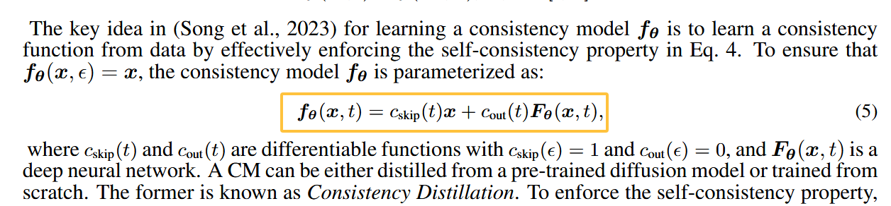

#  《Consistency Models》论文及相关阅读

> 推荐从头开始看的细节文章：
>
> 【1】概率生成模型总览：https://zhuanlan.zhihu.com/p/611466195（很多都看不懂，可以先放放）
>
> 【2】Score Matching、 Langevin Equation 和 Diffusion的联系：https://zhuanlan.zhihu.com/p/618685170
>
> 

# 前置知识

Score-based Model, DDPM(两个工作,有共同点) ->SDE/ODE(做了一个统一,离散->连续) ->Consistency Model(单步去噪)

## 1.Score-based Model

论文：《Generative Modeling by Estimating Gradients of the Data Distribution》

### （1）摘要


### （2）Related Work


- Score-based model相比于上图中的两种模型，优点在于网络结构的设计比较简单：即输入和输出的尺寸是一样的（这也是扩散模型用UNet的一个原因，毕竟UNet网络输入输出尺寸一样，所以普遍用UNet比较多）。另外，Score-based model只有一个loss，不像GAN那么难以训练。==也就是说，这个方法解决了上面两种方法可能会遇到的问题。==


### （3）Method


可以看右边的那张图，梯度整体指向概率密度比较高的位置，而“对数概率的梯度”就是本文提出的**Score**。简单理解，每次沿着Score走一步，走着走着就会走到数据密度高的位置。

接下来继续看方法部分：


具体解释一下（假设我们已经有了一个估计score的模型$s_\theta(x)$）：

- $x_i$表示随机的一个位置；
- $\epsilon$项是步长，即沿着梯度的方向往前走$\epsilon$长的一步；
- $z_i$是随机采样的一个噪声，也就是说在采样的时候会加入一些随机性（这是基于Langevin动力学，即热力学的一些定理的）

上述一切成立的前提是我们能够准确地求解出Score，但实际上这是不好求的：


看上图，红框内的区域是数据密度比较高的，这些区域的score估计会相对准确，但数据密度比较低的地方（这些地方占比其实很大）score的估计并不准确，而随机采样一个点基本上会落在这些score估计不准确的位置。==问题就转换为了，如何让模型在推理的早期就估计出准确的score呢？解决方案是给数据分布加噪声。==如下图，加了噪声扰动后的数据范围就会扩大了：


上图还是比较容易理解的。但这样又会带来新的问题，==加了噪声之后，即使用准确的Score一步一步生成，最终也只能走到噪声的位置上去，没办法走到干净的目标位置，所以这里有一个权衡：==


上图伪代码中：

- `for(i=1;i<=L;i++)`这层循环指的是不同的级别，在不同的级别中加的噪声强度，移动的步长都是不一样的，可以看到不同的级别下的$\alpha_i$的值并不一样。$\sigma_i$是噪声强度。
- `for(t=1;t<=T;t++)`这层循环一共采样T步，相当于从$x_0$位置走T步。
  - 思考一下，如果L * T =1000，且L=1000，T=1，相当于有1000个不同的level，即1000个不同的步长（从大到小），且每个level只采样一步。那么其实这就是==DDPM==的思路。


#### 问题：如何求解Score？

$$
s_{0}(x) \approx \nabla_{x} \log p(x)
$$

一种简单的思路是使用==去噪==的方式来求解出score。具体看下图：


正因为待估计的score分数与添加的噪声只差一个系数的关系，因此估计噪声本身其实就能估计出score了，这就与`DDPM`的工作联系到一起了。==本质上还是估计噪声然后去噪。==


### （4）补充：用预训练好的随机生成的Score-based model可以直接做inpainting的任务


画一个示意图来理解上面的过程：


==其实就是强制让已知的部分不变，令扩散模型生成未知的部分。==这样即使在inpainting任务上完全没有训练过或者finetune过，也可以直接做这个任务，这个观察还是很不错的。

==具体的实验结果部分看原始论文即可。==其实基本上所有的生成模型中只有扩散模型能很好地做inpainting的工作，这可能得益于扩散模型本身迭代式的生成流程。


### （5）总结与收获

核心就是对于两件事的理解：1.为什么要加噪声？ 2.为什么要去噪？

- 加噪声是为了扩展数据密度高的范围，从而更准确地估计score；
- 去噪声则是估计score的必要过程，因为根据公式推导，score的公式是与噪声密切相关的，所以自然需要一个预测噪声的神经网络。


## 2.SDE

### （1）SDE方法的简要介绍：Score-based Generative Modeling through Stochastic Differential Equations

 这篇工作很可能是扩散模型发展历程中最重要的一篇工作。这篇工作的贡献在于将DDPM和Score-based相关的模型做了理论上的统一（通过SDE，随机微分方程）。这部分将会介绍SDE方法是如何统一两个模型的，以及公式的推导，和一些分析。

SDE本质上还是在估计Score。


先看上图，以DDPM为例，在加噪声的过程中，假设t固定，那么某一个step的$x_t$应当是一个固定的随机变量，公式符合高斯分布。==实际上这也就相当于给定一个固定的X，其去噪轨迹（采样轨迹）是可以用随机过程来模拟的，这就可以用到SDE作为工具。==

------


对于连续的过程来说，加噪声本质上就是$x_t->x_{t+\Delta_t}$的过程，这里的$\Delta_t->0$，而去噪的过程也是类似的。

------


我们先来看Forward SDE的过程：

- $x$是之前讲的$x_t$，即研究的对象，是一张图片（或者说噪声图）。
- $f(x, t)$,原文中叫drift coefficient
- $g(t)$在原文中叫diffusion coefficient
- $w$是布朗运动（Brownian motion）

看起来非常抽象，接下来进行一定拆解。前半部分$f(x,t)dt$其实表示的是一个`确定性的过程`，而后面的部分是一个`不确定性的过程`（根据scored-based这篇工作的介绍，源头应该是来自于热力学的现象）。$dw$表示对布朗运动的微分，也就是一个扰动，代表不确定性扰动，而$g(t)$则表示这个扰动的强度。


### （2）推导基于SDE扩散模型的重建公式

现在我们已经知道了扩散公式：$dx=f(x, t)d_t + g(t)dw$,如何==以此为基础，推导出重建的公式呢？==(太难了。。。暂时没必要看懂了)

> 以下是整理后的LaTeX公式（用`$$...$$`包围）和分步推导说明，适用于直接粘贴到Typora中。我将结合扩散模型（SDE）的推导逻辑，逐步解释每个公式的物理意义和数学变换。
>
> ---
>
> ### **第1张图：前向SDE的离散化形式**
>
> $$ dx = f(x,t)dt + g(t)dw \quad \text{(连续时间SDE)} $$
> $$ x_{t+\Delta t} - x_t = f(x_t,t)\Delta t + g(t)\sqrt{\Delta t}\,\epsilon \quad \epsilon \sim \mathcal{N}(0,I) $$
> $$ x_{t+\Delta t} = x_t + f(x_t,t)\Delta t + g(t)\sqrt{\Delta t}\,\epsilon $$
> $$ p(x_{t+\Delta t}|x_t) \sim \mathcal{N}\big(x_t + f(x_t,t)\Delta t,\, g^2(t)\Delta t I\big) $$
>
> **推导说明：**
>
> 1. **连续时间SDE**：描述扩散过程，其中：
>    - $f(x,t)$ 是漂移项（drift），决定确定性演化；
>    - $g(t)dw$是扩散项（diffusion），引入随机噪声（$dw$ 是维纳过程增量）。
> 2. **离散化**：将连续SDE欧拉离散化（Euler-Maruyama方法）：
>    - 时间步长$ \Delta t$，噪声项$ \epsilon \sim \mathcal{N}(0,I)$；
>    - 离散后$x_{t+\Delta t} $的条件分布是高斯分布，均值为 $ x_t + f(x_t,t)\Delta t$，方差为$g^2(t)\Delta $。
>
> ---
>
> ### **第2张图：反向条件概率的贝叶斯展开**
> $$\large x_{t+\Delta t} \to x_t \quad \text{(反向过程)} $$
> $$ \large p(x_t|x_{t+\Delta t}) = \frac{p(x_{t+\Delta t}|x_t)p(x_t)}{p(x_{t+\Delta t})} $$
> $$ \large = p(x_{t+\Delta t}|x_t) \exp\left\{\log p(x_t) - \log p(x_{t+\Delta t})\right\} $$
> $$ \large = p(x_{t+\Delta t}|x_t) \exp\left\{-(x_{t+\Delta t}-x_t)\nabla_{x_t}\log p(x_t) - \Delta t \frac{\partial}{\partial t}\log p(x_t)\right\} $$(因为有两项，所以泰勒展开需要求偏导)
>
> **推导说明：**
>
> 1. **贝叶斯定理**：反向过程的条件概率 $ p(x_t|x_{t+\Delta t}) $ 通过前向转移$p(x_{t+\Delta t}|x_t)$和边缘分布$p(x_t)$表示。
> 2. **对数概率展开**：对 $\log p(x_{t+\Delta t})$做泰勒展开（假设$\Delta t$很小）：
>    - $\log p(x_{t+\Delta t}) \approx \log p(x_t) + (x_{t+\Delta t}-x_t)\nabla_{x_t}\log p(x_t) + \Delta t \partial_t \log p(x_t)$；
>    - 忽略高阶项后，得到指数部分的线性近似。
>
> ---
>
> ### **第3张图：反向概率的显式形式**
> $$\large p(x_t|x_{t+\Delta t}) \propto(正比于) \exp\left\{ -\frac{\|x_{t+\Delta t} - x_t - f(x_t,t)\Delta t\|^2}{2g^2(t)\Delta t} - (x_{t+\Delta t}-x_t)\nabla_{x_t}\log p(x_t) - \Delta t \frac{\partial}{\partial t}\log p(x_t) \right\} $$
> $$\large = \exp\left\{ -\frac{1}{2g^2(t)\Delta t} (x_{t+\Delta t}-x_t) \cdot \left[x_{t+\Delta t}-x_t - 2f(x_t,t)\Delta t - 2g^2(t)\Delta t \nabla_{x_t}\log p(x_t)\right] - \Delta t \partial_t \log p(x_t) - \frac{f^2(x_t,t)\Delta t}{2g^2(t)} \right\} $$
>
> **推导说明：**
> 1. **合并高斯项和得分项**：将前向转移的高斯密度 $p(x_{t+\Delta t}|x_t)$和得分函数 $ \nabla_{x_t}\log p(x_t) $ 结合。
> 2. **配方法**：通过展开平方项和重新组合，显式地构造关于$x_t$ 的二次型，最终目标是表示为一个新的高斯分布。
>
> ---
>
> ### **第4张图：反向SDE的漂移项**
> $$ p(x_t|x_{t+\Delta t}) \propto \exp\left\{ -\frac{1}{2g^2(t)\Delta t} \left\| (x_{t+\Delta t}-x_t) - \left(f(x_t,t) - g^2(t)\nabla_{x_t}\log p(x_t)\right)\Delta t \right\|_2^2 \right\} $$
> $$ \Delta t \to 0 \quad \text{(连续时间极限)} $$
> $$ \approx \exp\left\{ -\frac{1}{2g^2(t+\Delta t)\Delta t} \left\| (x_{t+\Delta t}-x_t) - \left(f(x_{t+\Delta t},t+\Delta t) - g^2(t+\Delta t)\nabla_{x_{t+\Delta t}}\log p(x_{t+\Delta t})\right)\Delta t \right\|_2^2 \right\} $$
> $$ x_{t+\Delta t} \approx x_t \quad \text{(一阶近似)} $$
>
> **推导说明：**
>
> 1. **反向漂移项**：识别出均值部分$ f(x_t,t) - g^2(t)\nabla_{x_t}\log p(x_t)$，即前向漂移减去得分函数的修正。
> 2. **时间反转**：在 $\Delta t \to 0$时，将 \( t \) 替换为$t+\Delta t$以适应反向过程。
> 3. **一阶近似**：假设$x_{t+\Delta t} \approx x_t$，简化表达式。
>
> ---
>
> ### **第5张图：反向SDE的离散化**
> $$ p(x_t|x_{t+\Delta t}) \text{ 的均值： } x_{t+\Delta t} - \left(f(x_{t+\Delta t}, t+\Delta t) - g^2(t+\Delta t)\nabla_{x_{t+\Delta t}}\log p(x_{t+\Delta t})\right)\Delta t $$
> $$ \text{方差： } g^2(t+\Delta t)\Delta t $$
> $$ dx = \left[f(x,t) - g^2(t)\nabla_x \log p(x)\right]dt + g(t)dw \quad \text{(反向SDE)} $$
> $$ x_{t+\Delta t} - x_t = \left[f(x_{t+\Delta t}, t+\Delta t) - g^2(t+\Delta t)\nabla_{x_{t+\Delta t}}\log p(x_{t+\Delta t})\right]\Delta t + g(t+\Delta t)\sqrt{\Delta t}\,\epsilon $$
>
> **推导说明：**
> 1. **反向SDE**：连续形式与正向SDE类似，但漂移项多了一个得分函数的修正项$-g^2(t)\nabla_x \log p(x)$。
> 2. **离散化**：反向过程的离散化均值和方差直接由前几步推导得到。
>
> ---
>
> ### **第6张图：采样步骤与得分匹配**
> $$ x_{t-1} = x_t - \left[f(x_t,t) - g^2(t)\nabla_{x_t}\log p(x_t)\right] + g(t)\epsilon $$
> $$ \text{Score: } \nabla_x \log p(x) $$
> $$ \begin{cases}
> dx = f(x,t)dt + g(t)dw & \text{(正向SDE)} \\
> dx = \left[f(x,t) - g^2(t)\nabla_x \log p(x)\right]dt + g(t)dw & \text{(反向SDE)}
> \end{cases} $$
>
> **推导说明：**
>
> 1. **采样步骤**：反向过程的迭代更新公式，每一步减去漂移项并添加噪声。
> 2. **得分函数**：核心是估计 $ \nabla_x \log p(x) $，通常通过训练神经网络（如Score Matching或Diffusion Models）近似。
> 3. **正反向SDE对比**：反向SDE的漂移项多了一个score-based的修正，确保从噪声中逐步生成数据。
>
> ---
>
> ### **关键点总结**
> 1. **正向过程**：数据逐渐加噪，离散化为高斯转移。
> 2. **反向过程**：依赖得分函数 $\nabla_x \log p(x) $修正漂移项，逐步去噪。
> 3. **得分匹配**：通过神经网络学习得分函数，是扩散模型的核心。
>


### （3）SDE是如何统一DDPM和Score-based model的？

太难了。。。全是公式推导，先不看了，直接问一下DeepSeek怎么用SDE吧。

我的理解是核心贡献为下面这张图：


> 你提到的 **随机微分方程（SDE）** 确实是数学上比较复杂的工具，但它的核心思想和贡献其实可以用更直观的方式理解。下面我会用通俗的语言总结SDE的贡献、使用方法，以及它和 **一致性模型（Consistency Model）** 的关系。
>
> ---
>
> ## **1. SDE 的核心贡献是什么？**
> SDE 在生成模型（如扩散模型）中的主要贡献是 **统一了扩散过程的数学框架**，并提供了 **连续时间视角下的噪声扰动和生成**。具体来说：
>
> ### **(1) 统一了离散和连续的扩散过程**
> - 之前的扩散模型（如DDPM）是离散时间步的，而SDE将其推广到连续时间，使得理论更通用。
> - 例如，DDPM可以看作SDE的一个特例（离散时间步的欧拉近似）。
>
> ### **(2) 提供了反向过程的严格数学推导**
> - SDE 不仅描述了数据如何被噪声破坏（前向过程），还严格推导了如何从噪声中生成数据（反向过程）。
> - 反向过程的关键是 **得分匹配（Score Matching）**，即学习一个神经网络来估计 $\nabla_x \log p(x)$（数据的梯度场）。
>
> ### **(3) 启发了更高效的生成方法**
> - SDE 的理论表明，生成过程可以通过调整噪声调度$g(t)$来优化，从而加速采样（如 **Probability Flow ODE** 方法）。
> - 这直接影响了后来的 **一致性模型（Consistency Model）** 和 **扩散模型的加速采样技术**。
>
> ---
>
> ## **2. 如何使用 SDE？**
> 虽然SDE的数学推导复杂，但实际使用时可以依赖现成的代码库（如 `score-sde` 或 `diffusers`）。以下是典型的使用流程：
>
> ### **(1) 训练阶段**
> 1. **定义前向SDE**（加噪过程）：
>    - 例如：`dx = f(x,t)dt + g(t)dw`，其中 `f(x,t)` 是漂移项，`g(t)` 控制噪声强度。
> 2. **训练一个神经网络（Score Network）** 来估计得分函数 $\nabla_x \log p(x)$。
>
> ### **(2) 生成阶段**
> 1. **反向SDE采样**：
>    - 从随机噪声$ x_T \sim \mathcal{N}(0,I) $ 开始，用训练好的Score Network 逐步去噪。
>    - 例如：
>      ```python
>      for t in reversed(range(T)):
>          x = x - (f(x,t) - g(t)^2 * score_network(x,t)) * dt + g(t) * noise
>      ```
> 2. **可选：用ODE加速采样**（Probability Flow ODE）：（==下面的部分会对其进行介绍==）
>    
>    - 如果 \( g(t) \) 很小，可以忽略随机项，变成确定性ODE，大幅加速生成。
>
> ---
>
> ## **3. SDE 对 Consistency Model 的启发**
> **一致性模型（Consistency Model）** 是扩散模型的一种加速变体，它的核心思想直接受到SDE的启发：
>
> ### **(1) 核心思想**
> - **一致性模型的目标**：让模型在任意时间步 \( t \) 都能直接从噪声 \( x_t \) 映射到干净数据 \( x_0 \)（即“一致性”）。
> - 这相当于 **跳过了SDE的逐步去噪过程**，直接学习一个“一步生成”的映射。
>
> ### **(2) SDE 如何启发 Consistency Model？**
> 1. **SDE 揭示了扩散模型的本质**：
>    - SDE 表明，扩散模型的核心是学习数据的 **得分函数 $ \nabla_x \log p(x) $**。
>    - Consistency Model 直接利用这一点，训练一个网络 $f_\theta(x_t, t) \to x_0$，而不是逐步去噪。
>
> 2. **从SDE的Probability Flow ODE得到灵感**：
>    - SDE 的确定性版本（ODE）表明，生成过程可以不用随机噪声，而是直接解一个ODE。
>    - Consistency Model 类似，但进一步简化，直接学习“单步映射”。
>
> 3. **训练方法借鉴了SDE的得分匹配**：
>    - Consistency Model 的训练仍然依赖于类似Score Matching的技术，但优化目标是“一致性”而非逐步去噪。
>
> ### **(3) Consistency Model 的优势**
> - **极快生成**：传统扩散模型需要100+步，Consistency Model 只需1步（或几步）。
> - **质量接近扩散模型**：虽然是一步生成，但质量仍然很高，接近SDE-based方法。
>
> ---
>
> ## **4. 总结：SDE vs. Consistency Model**
> | 特性         | SDE（扩散模型）                  | Consistency Model                  |
> | ------------ | -------------------------------- | ---------------------------------- |
> | **生成方式** | 逐步去噪（多步）                 | 直接映射（单步或几步）             |
> | **数学基础** | 随机微分方程（SDE）              | 受SDE启发，但简化为一致性映射      |
> | **训练目标** | 学习得分函数$\nabla_x \log p(x)$ | 学习$ x_t \to x_0$ 的直接映射      |
> | **速度**     | 慢（需要几十到几百步）           | 快（1步或少量步）                  |
> | **适用场景** | 高保真生成（如图像超分）         | 实时应用（如视频生成、交互式编辑） |
>
> ---
>
> ## **5. 如何选择？**
> - **如果你需要最高质量**（比如艺术生成、超分辨率），**SDE-based扩散模型** 仍然是首选。
> - **如果你需要快速生成**（比如实时视频、交互式应用），**Consistency Model** 是更好的选择。
>
> ---
>
> ### **最终建议**
> 如果你觉得SDE的数学太难，**不必纠结推导细节**，可以直接：
> 1. **使用现成的SDE代码**（如 `score-sde` 或 `diffusers` 库）。
> 2. **尝试Consistency Model**（如OpenAI的论文 [Consistency Models](https://arxiv.org/abs/2301.01442)），它更简单且高效。
>
> 希望这能帮你理清思路！如果还有具体问题，欢迎继续讨论 😊


### （4）ODE的介绍

> 好的！你提到的 **Probability Flow ODE** 是SDE框架下一种非常重要的加速采样技术，它的核心思想是 **将随机扩散过程（SDE）转化为确定性过程（ODE）**，从而大幅提升生成速度。下面我会用直观的方式解释它的原理和实现细节。
>
> ---
>
> ## **1. 回顾SDE和它的反向过程**
> 首先，扩散模型的前向SDE通常写成：
> $$
> dx = f(x,t)dt + g(t)dw
> $$
> 其中：
> - \( f(x,t) \) 是**漂移项**（控制数据的确定性演化），
> - \( g(t) \) 是**扩散系数**（控制噪声强度），
> - \( dw \) 是布朗运动的随机噪声。
>
> **反向SDE**（用于生成数据）的形式为：
> $$
> dx = [f(x,t) - g(t)^2 \nabla_x \log p_t(x)]dt + g(t)dw
> $$
> 其中 $ \nabla_x \log p_t(x)$ 是得分函数（Score Function），通常用神经网络近似（如Score-Based Model）。
>
> ---
>
> ## **2. 关键问题：为什么可以去掉随机项？**
> 反向SDE中的随机项 \( g(t)dw \) 会导致采样过程的**不确定性**（每次生成结果略有不同），同时需要更多步数才能收敛。但如果我们能**去掉随机性**，就可以：
> 1. **大幅减少采样步数**（因为ODE的解更稳定），
> 2. **保证生成质量**（理论上ODE和SDE生成的样本分布相同）。
>
> ### **数学直觉**
> 当$ g(t) \to 0$时，SDE的随机项消失，退化为普通的ODE：
> $$
> dx = [f(x,t) - g(t)^2 \nabla_x \log p_t(x)]dt
> $$
> 但即使 $ g(t)$不严格为零，只要它足够小，就可以近似用ODE描述系统的演化。
>
> ---
>
> ## **3. Probability Flow ODE的推导**
> ### **核心定理**
> 在SDE框架下，存在一个**确定性ODE**，其解与原始SDE生成的边缘分布 \( p_t(x) \) 完全相同：
> $$
> dx = \left[ f(x,t) - \frac{1}{2}g(t)^2 \nabla_x \log p_t(x) \right]dt
> $$
> 这个ODE称为 **Probability Flow ODE**。
>
> ### **为什么能成立？**
> 1. **Fokker-Planck方程的链接**：
>    - SDE对应的Fokker-Planck方程描述了概率密度的演化：
>      $$
>      \frac{\partial p_t(x)}{\partial t} = -\nabla \cdot [f(x,t)p_t(x)] + \frac{1}{2}g(t)^2 \Delta p_t(x)
>      $$
>    - 而Probability Flow ODE的解恰好满足相同的 $p_t(x)$。
>
> 2. **随机项的“平均效应”**：
>    - ODE的确定性漂移项已经隐含了随机噪声的统计特性（通过得分函数$ \nabla_x \log p_t(x)$），因此无需显式添加噪声。
>
> ---
>
> ## **4. 为什么ODE能加速生成？**
> ### **(1) 更少的采样步数**
> - SDE采样需要模拟随机游走（类似布朗运动），需要小步长和大量迭代才能收敛。
> - ODE是确定性的，可以用**高阶数值方法**（如Runge-Kutta）或**自适应步长**加速。
>
> ### **(2) 允许更大的步长**
> - 随机SDE中，步长太大可能导致不稳定（因为噪声项 \( dw \) 的方差随$\sqrt{dt}$增长）。
> - ODE没有随机项，步长可以更大（甚至可以用**隐式方法**稳定求解）。
>
> ### **(3) 实际案例**
> - 在DDPM中，传统采样可能需要1000步，但Probability Flow ODE只需20~50步就能达到相似质量（如OpenAI的 [DDIM](https://arxiv.org/abs/2010.02502) 就是ODE的特例）。
>
> ---
>
> ## **5. 实现示例**
> 假设我们已经训练好了一个得分模型$s_\theta(x,t) \approx \nabla_x \log p_t(x$，Probability Flow ODE的采样步骤如下：
>
> ```python
> def probability_flow_ode(x, t):
>     # 定义ODE的漂移项: dx/dt = f(x,t) - 0.5*g(t)^2 * score
>     drift = f(x,t) - 0.5 * (g(t)**2) * s_theta(x,t)
>     return drift
> 
> # 用ODE求解器（如scipy.integrate.solve_ivp）生成样本
> from scipy.integrate import solve_ivp
> 
> def generate_sample():
>     x_T = torch.randn(shape)  # 初始噪声
>     t_span = (T, 0)           # 从t=T到t=0反向求解
>     sol = solve_ivp(probability_flow_ode, t_span, x_T, method='RK45')
>     return sol.y[:,-1]        # 返回最终样本x_0
> ```
>
> ---
>
> ## **6. 与Consistency Model的联系**
> Probability Flow ODE的确定性思想直接影响了Consistency Model的设计：
> 1. **一致性模型**进一步简化了ODE，直接学习从$ x_t$ 到 $x_0$的**单步映射**，完全跳迭代过程。
> 2. 它的训练目标本质上是让模型在ODE轨迹上保持“一致性”（即同一轨迹上的点映射到相同的$ x_0$）。
>
> ---
>
> ## **7. 总结**
> - **Probability Flow ODE** 是SDE的确定性版本，通过去掉随机项加速采样。
> - **核心条件**：当 \( g(t) \) 较小或得分函数估计准确时，ODE和SDE的生成分布一致。
> - **优势**：更快、更稳定、允许高阶数值方法。
> - **应用**：DDIM、Consistency Model等加速方法均基于此思想。
>
> 如果还有不清楚的地方，欢迎继续提问！ 😊


## 3.PF-ODE的介绍

可以看这篇：https://zhuanlan.zhihu.com/p/622771940


# 一、论文原文阅读

## 1.Abstract

扩散模型在图像、音频和视频生成领域取得了重大进展，==但其依赖迭代采样过程导致生成速度缓慢。==为突破这一限制，==我们提出了一致性模型（Consistency Models）——这类新型模型通过直接将噪声映射到数据来实现高质量样本生成==。==其设计天然支持快速单步生成，同时仍允许通过多步采样来权衡计算量与样本质量。==该模型还能实现零样本数据编辑（如图像修复、着色和超分辨率），而无需针对这些任务进行显式训练。==一致性模型既可通过蒸馏预训练扩散模型获得，也能作为独立生成模型从头训练。==大量实验表明，该模型在一步和少步采样中超越了现有扩散模型蒸馏技术，在CIFAR-10上以单步生成达到3.55的FID新纪录，在64×64 ImageNet上达到6.20。当作为独立模型训练时，一致性模型形成了全新的生成模型家族，在CIFAR-10、64×64 ImageNet和256×256 LSUN等基准测试中，其性能优于现有的一步式非对抗生成模型。


## 2.Introduction

以下简要介绍核心内容。

A key feature of diffusion models is the iterative sampling process which progressively removes noise from random initial vectors. This iterative process provides a ==flexible trade-off of compute and sample quality, as using extra compute for more iterations usually yields samples of better quality==.  ==causing slow inference and limited real-time applications.==

本文的目标：create generative models that facilitate efficient, single-step generation without sacrificing important advantages of iterative sampling, such as trading compute for sample quality when necessary, as well as performing zero-shot data editing tasks.


**翻译：**  

我们的目标是构建既能实现高效单步生成，又无需牺牲迭代采样重要优势的生成模型——例如在必要时通过增加计算量提升样本质量，以及执行零样本数据编辑任务。如图1所示，我们的方法基于连续时间扩散模型中的概率流常微分方程（Probability Flow Ordinary Differential Equation, PF ODE，Song等人2021年提出），其轨迹能够将数据分布平滑地转化为易处理的噪声分布。我们提出学习一个模型，该模型可将轨迹上任意时间步的点映射至轨迹起点。这一模型的关键特性是**自一致性**（self-consistency）：同一轨迹上的所有点都会被映射到相同的初始点，因此我们将其命名为**一致性模型**（consistency models）。  

一致性模型通过单次网络评估即可将随机噪声向量（ODE轨迹的终点，如图1中的x_T）转换为数据样本（ODE轨迹的起点，如图1中的x_0）。更重要的是，通过链式调用多个时间步的一致性模型输出，我们可以像扩散模型的迭代采样那样，以更高计算成本为代价提升样本质量或执行零样本数据编辑。  

训练一致性模型时，我们基于自一致性特性提出两种方法：  

1. **蒸馏法**：利用数值ODE求解器和预训练扩散模型生成PF ODE轨迹上的相邻点对，通过最小化模型对这些点对的输出差异，将扩散模型蒸馏为一致性模型，从而实现单步高质量生成。  
2. **独立训练法**：完全无需预训练扩散模型，将一致性模型作为独立生成模型家族进行训练。两种方法均无需对抗训练，且对网络架构约束极少，可使用灵活的神经网络参数化一致性模型。  

我们在CIFAR-10、64×64 ImageNet和256×256 LSUN等数据集上验证了有效性：  

- **作为蒸馏方法**：在少步生成中超越渐进式蒸馏（progressive distillation）等现有技术。例如在CIFAR-10上，单步和两步生成的FID分别达到3.55和2.93的新纪录；在64×64 ImageNet上，单次和两次网络评估的FID分别为6.20和4.70。  
- **作为独立模型**：即便不依赖预训练扩散模型，其单步生成质量仍可匹配或超越渐进式蒸馏的结果，且优于许多GANs和现有非对抗单步生成模型。  
  此外，一致性模型能执行零样本数据编辑任务（如图像去噪、插值、修复、着色、超分辨率及笔画引导编辑SDEdit），展现出广泛适用性。  


> ### 术语与策略解释：  
> 1. **ODE（常微分方程）与概率流（PF ODE）**  
>    - 在扩散模型中，PF ODE描述了数据分布到噪声分布的连续转化轨迹。其解轨迹上的每个点对应不同噪声水平的数据状态，通过数值求解（如欧拉法）可逐步从噪声生成数据。  
>    - **一致性模型的创新**：直接学习“轨迹任意点→起点”的映射，绕过迭代求解，实现单步生成。  
>
> 2. **自一致性（Self-consistency）**  
>    - 核心约束：同一ODE轨迹上的所有点必须映射到相同的起点。这一性质确保模型在单步或多步调用时保持输出一致性。  
>
> 3. **训练策略**  
>    - **蒸馏法**：利用预训练扩散模型生成的轨迹点对作为监督信号，通过约束相邻点的输出一致性实现知识迁移。  
>    - **独立训练法**：通过设计损失函数直接优化自一致性（如对比同一轨迹不同点的输出），无需依赖扩散模型。  
>
> 4. **零样本编辑**  
>    - 关键机制：通过向输入噪声添加特定条件（如掩码图像、低分辨率图像等），利用模型对轨迹起点的映射能力直接生成编辑结果，无需额外训练。

对ODE和PF ODE的更详细的解释：

> 好的！让我们更系统地拆解 **PF ODE（概率流常微分方程）** 在扩散模型中的作用，以及它如何与一致性模型结合。我会从背景知识开始，逐步深入。
>
> ---
>
> ### 1. **扩散模型的基础：噪声化与反向过程**
> 扩散模型的核心思想是通过**逐步添加噪声**将数据（如图像）转化为随机噪声（前向过程），再学习**逆向去噪过程**以生成数据。  
> - **前向过程**：对数据 \( x_0 \) 逐步添加高斯噪声，经过 \( T \) 步后得到纯噪声 \( x_T \)。  
> - **反向过程**：训练神经网络从 \( x_t \) 预测 \( x_{t-1} \)，最终从噪声 \( x_T \) 重构数据 \( x_0 \)。  
>
> 传统扩散模型需要**迭代执行反向过程**（如1000步），导致生成速度慢。
>
> ---
>
> ### 2. **连续时间视角：将扩散过程视为微分方程**
> Song et al. (2021) 提出将离散的扩散步骤推广到**连续时间**，用微分方程描述数据演化：  
> - 定义时间变量 \( t \in [0,T] \)，其中 \( t=0 \) 对应数据分布 \( x_0 \)，\( t=T \) 对应噪声分布 \( x_T \)。  
> - 扩散过程可以表示为**随机微分方程（SDE）**，描述数据如何随时间随机变化。  
> - **概率流ODE（PF ODE）** 是SDE的一个确定性版本，其解轨迹 \( \{x_t\}_{t \in [0,T]} \) 满足：  
> - $$
>   \frac{dx_t}{dt} = f(x_t, t)
>   $$
>   其中 \( f(x_t, t) \) 是漂移项，由扩散模型参数化。
>
> ---
>
> ### 3. **PF ODE 的关键特性**
> - **确定性轨迹**：给定初始点 \( x_0 \，PF ODE 生成一条唯一的轨迹 \( x_t \)，最终到达噪声 \( x_T \)。  
> - **可逆性**：通过反向求解ODE，可以从噪声 \( x_T \) 恢复数据 \( x_0 \)。  
> - **数值求解**：  
>   实际求解时，使用数值方法（如欧拉法、Runge-Kutta）离散化ODE。例如： 
> - $$
>   x_{t-\Delta t} = x_t - f(x_t, t) \cdot \Delta t
>   $$
>   需要**多步迭代**才能从 \( x_T \) 生成 \( x_0 \)，这正是扩散模型慢的原因。
>
> ---
>
> ### 4. **一致性模型的突破：绕过迭代求解**
> 一致性模型的目标是**直接学习PF ODE轨迹的起点映射**：  
> - **输入**：轨迹上任意点 \( x_t \) 和时间 \( t \)。  
> - **输出**：轨迹起点 \( x_0 \)。  
> - **自一致性约束**：同一轨迹上的所有点 \( x_t \) 必须映射到相同的 \( x_0 \)。  
>
> **为什么有效？**  
> - PF ODE的轨迹是唯一的，因此从任意 \( x_t \) 出发都应指向同一个 \( x_0 \)。  
> - 模型通过单次前向传播即可预测 \( x_0 \)，**无需迭代**。  
>
> ---
>
> ### 5. **具体例子：从噪声生成图像**
> 假设我们有一张图像 \( x_0 \) 和对应的噪声 \( x_T \)：  
> 1. **传统扩散模型**：  
>    - 从 \( x_T \) 出发，逐步求解ODE（如100步），每步调用神经网络预测 \( x_{t-1} \)。  
>    - 计算成本高。  
>
> 2. **一致性模型**：  
>    - 直接输入 \( x_T \) 和时间 \( T \)，模型输出 \( x_0 \)。  
>    - **仅需1步**！  
>
> ---
>
> ### 6. **与数值ODE求解器的关系**
> 一致性模型的训练依赖PF ODE的轨迹数据：  
> - **蒸馏法**：用预训练扩散模型生成轨迹点对 \( ($ x_t, x_{t+\Delta t}$) \)，监督模型使它们的输出 \( x_0 \) 一致。  
> - **独立训练法**：通过扰动真实数据 \( x_0 \) 生成 \( x_t \)，直接学习 \( x_t \to x_0 \) 的映射。  
>
> ---
>
> ### 总结
> - **PF ODE** 是扩散模型中数据→噪声转化的连续轨迹描述。  
> - **一致性模型** 通过直接学习“轨迹点→起点”的映射，**将ODE的迭代求解压缩为单步预测**，实现快速生成。  
> - 其核心是**自一致性**：同一ODE轨迹上的所有点必须映射到相同的初始数据。  
>
> 这种设计在保持生成质量的同时，**将计算复杂度从 \( O(T) \) 降为 \( O(1) \)**，是扩散模型加速的重要突破。


## 3.比较推荐阅读的文章

- https://zhuanlan.zhihu.com/p/13844709012

### （1）一致性模型的定义


# 二、LATENT CONSISTENCY MODELS（LCM）

## LCM仓库代码阅读（==还差一点，但不影响整体过程的理解了==）

我们阅读的代码是这份文件：https://github1s.com/luosiallen/latent-consistency-model/blob/main/LCM_Training_Script/consistency_distillation/train_lcm_distill_sd_wds.py#L770-L771

对照着这篇博客来看：[定制适合自己的 Diffusers 扩散模型训练脚本 | 周弈帆的博客 (zhouyifan.net)](https://zhouyifan.net/2024/07/27/20240605-diffusers-training/)，基本的流程是差不多的。

### （1）main函数整体解读

#### （a）diffusion基础组件的加载

```python
# 1. Create the noise scheduler and the desired noise schedule.
noise_scheduler = DDPMScheduler.from_pretrained(
    args.pretrained_teacher_model, subfolder="scheduler", revision=args.teacher_revision # revision参数：The specific model version to use. It can be a branch name, a tag name, a commit id, or any identifier allowed by Git.
)

# The scheduler calculates the alpha and sigma schedule for us
alpha_schedule = torch.sqrt(noise_scheduler.alphas_cumprod)
sigma_schedule = torch.sqrt(1 - noise_scheduler.alphas_cumprod)
solver = DDIMSolver(
    noise_scheduler.alphas_cumprod.numpy(),
    timesteps=noise_scheduler.config.num_train_timesteps,
    ddim_timesteps=args.num_ddim_timesteps,
)

# 2. Load tokenizers from SD-XL checkpoint.
tokenizer = AutoTokenizer.from_pretrained(
    args.pretrained_teacher_model, subfolder="tokenizer", revision=args.teacher_revision, use_fast=False
)

# 3. Load text encoders from SD-1.5 checkpoint.
# import correct text encoder classes
text_encoder = CLIPTextModel.from_pretrained(
    args.pretrained_teacher_model, subfolder="text_encoder", revision=args.teacher_revision
)

# 4. Load VAE from SD-XL checkpoint (or more stable VAE)
vae = AutoencoderKL.from_pretrained(
    args.pretrained_teacher_model,
    subfolder="vae",
    revision=args.teacher_revision,
)
```

> 在Diffusion模型中，这些组件各自承担不同的角色，以下是详细解释：
>
> ---
>
> ### 1. **Noise Scheduler（噪声调度器）**
> - **作用**：控制扩散过程中噪声的添加和去除节奏，定义从数据到噪声的逐步转换（前向过程）以及反向去噪过程的时间步安排。
> - **示例**：`DDPMScheduler`（Denoising Diffusion Probabilistic Models）是扩散模型的标准调度器。
> - **关键参数**：
>   - `alphas_cumprod`：累积乘积的α系数（αₜ = 1 - βₜ，βₜ是噪声方差），用于控制每一步的噪声强度。
>   - `num_train_timesteps`：总训练时间步数（如1000步）。
>
> ---
>
> ### 2. **Alpha Schedule 和 Sigma Schedule**
> - **Alpha Schedule** (`alpha_schedule = sqrt(alphas_cumprod)`)：
>   - 表示数据保留的权重，随着时间步增加逐渐减小（更多噪声）。
> - **Sigma Schedule** (`sigma_schedule = sqrt(1 - alphas_cumprod)`)：
>   - 表示噪声的权重，随着时间步增加逐渐增大。
> - **关系**：两者满足 `alpha_schedule² + sigma_schedule² = 1`，确保噪声和数据混合的稳定性。
>
> ---
>
> ### 3. **Solver（求解器）**
> - **作用**：在推理时加速去噪过程（如DDIM的确定性采样）。
> - **示例**：`DDIMSolver`（Denoising Diffusion Implicit Models）：
>   - **输入参数**：
>     - `alphas_cumprod`：与噪声调度器相同的α schedule。
>     - `timesteps`：原始训练时间步数。
>     - `ddim_timesteps`：推理时缩减的时间步数（加速生成）。
> - **功能**：通过跳步计算减少采样步骤，牺牲部分多样性换取速度。
>
> ---
>
> ### 4. **Tokenizer（分词器）**
> - **作用**：将文本输入（如提示词）转换为模型可理解的词元（Token）。
> - **示例**：`AutoTokenizer`（如CLIP的分词器）：
>   - 将句子拆分为子词（subword），并映射为词表ID。
>   - **关键参数**：
>     - `use_fast=False`：禁用快速分词（某些模型需要精确模式）。
>
> ---
>
> ### 5. **Text Encoder（文本编码器）**
> - **作用**：将词元转换为文本嵌入（Text Embeddings），作为条件输入引导图像生成。
> - **示例**：`CLIPTextModel`（如Stable Diffusion中的文本编码器）：
>   - 输出一个高维向量（如768维），捕获语义信息。
>   - **注意**：通常需要冻结权重（在微调时不更新）。
>
> ---
>
> ### 6. **VAE（变分自编码器）**
> - **作用**：
>   - **编码器**：将图像压缩到潜在空间（Latent Space，如4x64x64张量），降低计算量。
>   - **解码器**：将去噪后的潜在表示重建为图像。
> - **示例**：`AutoencoderKL`（KL-正则化的VAE）：
>   - **关键参数**：
>     - `subfolder="vae"`：从预训练模型中加载VAE部分。
>   - **注意**：VAE的稳定性直接影响生成质量（如SD-XL改用更稳定的VAE）。
>
> ---
>
> ### 总结流程：
> 1. **文本输入** → Tokenizer → Text Encoder → 文本嵌入。
> 2. **噪声调度器** → 定义α/σ计划 → 控制扩散过程。
> 3. **VAE** → 图像编码为潜在表示 → 扩散模型在潜在空间去噪 → VAE解码生成图像。
> 4. **Solver** → 可选地加速推理（如DDIM）。
>
> 这些组件共同构成了Stable Diffusion等模型的完整Pipeline。


#### （b）teacher_unet和online student unet的处理

接下来是加载`teacher_unet`，冻结VAE, text-encoder，和teacher_unet，以及创建online student unet：

```python
# 5. Load teacher U-Net from SD-XL checkpoint
teacher_unet = UNet2DConditionModel.from_pretrained(
    args.pretrained_teacher_model, subfolder="unet", revision=args.teacher_revision
)

# 6. Freeze teacher vae, text_encoder, and teacher_unet
vae.requires_grad_(False)
text_encoder.requires_grad_(False)
teacher_unet.requires_grad_(False)

# 8. Create online (`unet`) student U-Nets. This will be updated by the optimizer (e.g. via backpropagation.)
# Add `time_cond_proj_dim` to the student U-Net if `teacher_unet.config.time_cond_proj_dim` is None
if teacher_unet.config.time_cond_proj_dim is None: # The dimension of `cond_proj` layer in the timestep embedding.
    teacher_unet.config["time_cond_proj_dim"] = args.unet_time_cond_proj_dim
unet = UNet2DConditionModel(**teacher_unet.config)
# load teacher_unet weights into unet
unet.load_state_dict(teacher_unet.state_dict(), strict=False)
unet.train()

```

> # 解释Latent Consistency Model中的teacher_unet和相关代码
>
> ## teacher_unet的作用
>
> `teacher_unet`在这里确实是用于知识蒸馏(Knowledge Distillation)的教师模型(teacher model)。在知识蒸馏框架中：
>
> 1. **教师模型**：通常是一个更大、更复杂的预训练模型(在这里是SD-XL中的UNet)，它已经学习到了强大的特征表示能力。
> 2. **学生模型**：是我们要训练的新模型(这里的`unet`)，它试图模仿教师模型的行为，但通常结构更简单或效率更高。
>
> 在一致性模型(LCM)的上下文中，教师模型用于提供"正确"的预测，学生模型则学习快速生成与教师模型一致的结果。
>
> ## 代码步骤解析
>
> ### 步骤5：加载教师UNet
>
> ```python
> teacher_unet = UNet2DConditionModel.from_pretrained(
>     args.pretrained_teacher_model, subfolder="unet", revision=args.teacher_revision
> )
> ```
>
> 这行代码从预训练的Stable Diffusion XL(SD-XL)检查点加载UNet模型作为教师模型。
>
> ### 步骤6：冻结参数
>
> ```python
> vae.requires_grad_(False)
> text_encoder.requires_grad_(False)
> teacher_unet.requires_grad_(False)
> ```
>
> 这部分冻结了三个组件的梯度计算：
> - VAE(变分自编码器)
> - 文本编码器
> - 教师UNet
>
> 冻结意味着在训练过程中这些模型的参数不会被更新，只作为固定的特征提取器或预测器使用。
>
> ### 步骤8：创建学生UNet
>
> ```python
> # 检查并设置time_cond_proj_dim配置
> if teacher_unet.config.time_cond_proj_dim is None:
>     teacher_unet.config["time_cond_proj_dim"] = args.unet_time_cond_proj_dim
> 
> # 使用教师模型的配置创建学生UNet
> unet = UNet2DConditionModel(**teacher_unet.config)
> 
> # 将教师模型的权重加载到学生模型
> unet.load_state_dict(teacher_unet.state_dict(), strict=False)
> 
> # 设置学生模型为训练模式
> unet.train()
> ```
>
> 详细解释：
>
> 1. **条件投影维度检查**：首先检查教师模型的配置中是否有`time_cond_proj_dim`(时间条件投影维度)，如果没有则设置为参数中指定的值。
>
> 2. **创建学生模型**：使用教师模型的配置(`teacher_unet.config`)初始化一个新的UNet模型。这意味着学生模型与教师模型有相同的架构。
>
> 3. **权重初始化**：将教师模型的权重加载到学生模型中，`strict=False`表示不严格要求完全匹配，允许部分权重不加载。
>
> 4. **设置训练模式**：`unet.train()`将学生UNet设置为训练模式，这会：
>    - 启用dropout层(如果模型中有的话)
>    - 启用batch normalization层的训练行为(会计算并更新running mean/var)
>    - 确保梯度计算被启用(虽然这主要由`requires_grad`控制)
>
> ## 知识蒸馏流程
>
> 整个流程体现了典型的知识蒸馏过程：
> 1. 固定教师模型(不更新其参数)
> 2. 初始化学生模型(通常与教师模型结构相同或相似)
> 3. 让学生模型在训练过程中学习模仿教师模型的输出行为
>
> 在一致性模型的上下文中，学生模型将学习更快地生成与教师模型一致的结果，从而实现快速推理。

以下是对于`time_cond_proj_dim`的详细介绍：

> 在Diffusion模型（如Stable Diffusion）的UNet架构中，**`time_cond_proj_dim`** 是一个与**时间步（timestep）条件嵌入**相关的超参数，它决定了时间信息如何被投影并注入到UNet的各个层中。以下是详细解释：
>
> ---
>
> ### 1. **时间步（timestep）在Diffusion模型中的作用**
> Diffusion模型在生成过程中需要知道当前处于去噪的哪个阶段（即第几个timestep），因为：
> - **早期timestep**（噪声较多时）：UNet需要更关注全局结构。
> - **后期timestep**（接近干净图像时）：UNet需要更关注细节修复。
>
> 因此，模型需要将**timestep信息**（一个标量值）编码成高维向量，并输入到UNet的各个残差块中，指导生成过程。
>
> ---
>
> ### 2. **`time_cond_proj_dim`的具体作用**
> `time_cond_proj_dim` 定义了时间步嵌入向量的**投影维度**，具体流程如下：
> 1. **原始timestep输入**：一个整数（如`t=500`）。
> 2. **正弦位置编码（Sinusoidal Embedding）**：  
>    通过正弦/余弦函数将标量`t`映射到一个高维向量（例如维度为`256`）。
> 3. **投影层（Projection Layer）**：  
>    通过一个全连接层（Linear Layer）将正弦编码进一步投影到`time_cond_proj_dim`维度（例如`128`）。  
>    - 这一步的目的是将时间信息压缩或扩展到一个更适合UNet内部使用的维度。
>    - 投影后的向量会通过**加法**或**通道拼接**的方式注入到UNet的残差块中。
>
> ---
>
> ### 3. **为什么需要检查`time_cond_proj_dim`是否为`None`？**
> 在代码中：
> ```python
> if teacher_unet.config.time_cond_proj_dim is None:
>     teacher_unet.config["time_cond_proj_dim"] = args.unet_time_cond_proj_dim
> ```
> - **背景**：某些旧版Stable Diffusion模型（如SD 1.x）的UNet配置中可能没有显式定义`time_cond_proj_dim`（即为`None`），而是使用默认的投影方式。
> - **解决方案**：如果教师模型的配置中缺少这一项，则手动设置为用户指定的值（`args.unet_time_cond_proj_dim`），确保学生模型能正确处理时间条件。
>
> ---
>
> ### 4. **对模型架构的影响**
> - **投影层的位置**：  
>   通常在UNet的每个残差块（`ResBlock`）或注意力层（`AttentionBlock`）中，时间条件向量会与空间特征相加或拼接。
> - **维度一致性**：  
>   如果`time_cond_proj_dim`与UNet隐藏层维度不匹配，可能导致特征融合失败（例如加法操作要求两者维度相同）。
>
> ---
>
> ### 5. **实际案例（Stable Diffusion XL）**
> 在SD-XL的UNet中：
> - `time_cond_proj_dim`通常设置为**`128`或`256`**。
> - 时间嵌入会先通过正弦编码（如`dim=256`），再投影到`time_cond_proj_dim`，最后与图像特征相加。
>
> ---
>
> ### 总结
> `time_cond_proj_dim`是控制Diffusion模型中**时间条件嵌入维度**的关键参数，直接影响UNet如何利用timestep信息指导去噪过程。代码中的检查逻辑是为了兼容不同版本的模型配置，确保学生模型能正确继承教师模型的时间处理方式。


#### （c）target_unet是什么？EMA又是什么？蒸馏的大致过程是什么？混合精度训练是在做什么？

继续往后看：

```python
# 9. Create target (`ema_unet`) student U-Net parameters. This will be updated via EMA updates (polyak averaging).
# Initialize from unet
target_unet = UNet2DConditionModel(**teacher_unet.config)
target_unet.load_state_dict(unet.state_dict())
target_unet.train()
target_unet.requires_grad_(False)

# Check that all trainable models are in full precision
low_precision_error_string = (
    " Please make sure to always have all model weights in full float32 precision when starting training - even if"
    " doing mixed precision training, copy of the weights should still be float32."
)

if accelerator.unwrap_model(unet).dtype != torch.float32:
    raise ValueError(
        f"Controlnet loaded as datatype {accelerator.unwrap_model(unet).dtype}. {low_precision_error_string}"
    )

# 10. Handle mixed precision and device placement
# For mixed precision training we cast all non-trainable weigths to half-precision
# as these weights are only used for inference, keeping weights in full precision is not required.
weight_dtype = torch.float32
if accelerator.mixed_precision == "fp16":
    weight_dtype = torch.float16
elif accelerator.mixed_precision == "bf16":
    weight_dtype = torch.bfloat16

# Move unet, vae and text_encoder to device and cast to weight_dtype
# The VAE is in float32 to avoid NaN losses.
vae.to(accelerator.device)
if args.pretrained_vae_model_name_or_path is not None:
    vae.to(dtype=weight_dtype)
text_encoder.to(accelerator.device, dtype=weight_dtype)

# Move teacher_unet to device, optionally cast to weight_dtype
target_unet.to(accelerator.device)
teacher_unet.to(accelerator.device)
if args.cast_teacher_unet:
    teacher_unet.to(dtype=weight_dtype)

# Also move the alpha and sigma noise schedules to accelerator.device.
alpha_schedule = alpha_schedule.to(accelerator.device)
sigma_schedule = sigma_schedule.to(accelerator.device)
solver = solver.to(accelerator.device) # 这里的solver指的是前面的DDIMSolver
```

以下是对应的解释：

> 我来逐步解析这段代码，并回答你的两个关键问题。
>
> ### 1. 关于`target_unet`的作用与知识蒸馏流程
>
> #### 代码解析：
> ```python
> # 9. Create target (`ema_unet`) student U-Net parameters
> target_unet = UNet2DConditionModel(**teacher_unet.config)
> target_unet.load_state_dict(unet.state_dict())
> target_unet.train()
> target_unet.requires_grad_(False)
> ```
>
> #### 三个UNet的分工：
> 1. **`teacher_unet`**：
>    - 冻结的预训练模型（SD-XL的UNet）
>    - 仅用于提供"真实"的噪声预测（作为蒸馏目标）
>    - 不参与梯度更新
>
> 2. **`unet`**（在线学生网络）：
>    - 可训练的学生模型
>    - 通过梯度下降直接优化
>    - 实时响应输入数据
>
> 3. **`target_unet`**（EMA学生网络）：
>    - 通过EMA（指数移动平均）更新
>    - 提供更稳定的目标预测（比在线学生网络更平滑）
>    - 相当于学生模型的"缓释版本"
>
> #### 为什么需要target_unet？
> 在LCM的蒸馏框架中：
> - **双学生设计**：在线学生（`unet`）快速学习，EMA学生（`target_unet`）稳定训练
> - **EMA逻辑**：通过`target_unet = τ * target_unet + (1-τ) * unet`逐步更新（τ≈0.95-0.99）：==其实就是插值，EMA这个词搞得很高大上==
> - **训练稳定性**：避免在线学生的快速变化导致训练震荡
>
> #### 处理流程：
> ```mermaid
> graph TD
>     A[输入数据] --> B(teacher_unet)
>     A --> C(unet)
>     A --> D(target_unet)
>     B -->|冻结的预测| E[计算蒸馏损失]
>     C -->|在线预测| E
>     D -->|EMA预测| F[辅助稳定训练]
>     E --> G[更新unet]
>     G --> H[EMA更新target_unet]
> ```
>
> ---
>
> ### 2. 关于混合精度训练（Mixed Precision）的解析
>
> #### 代码关键段：
> ```python
> # 检查全精度（float32）
> if accelerator.unwrap_model(unet).dtype != torch.float32:
>     raise ValueError(...)
> 
> # 混合精度配置
> weight_dtype = torch.float32
> if accelerator.mixed_precision == "fp16":
>     weight_dtype = torch.float16
> elif accelerator.mixed_precision == "bf16":
>     weight_dtype = torch.bfloat16
> 
> # 设备与类型转换
> vae.to(accelerator.device)  # VAE强制保持float32
> text_encoder.to(dtype=weight_dtype)  # 其他模块用混合精度
> ```
>
> #### 核心概念：
> | 精度类型           | 位数 | 优点               | 缺点               | 使用场景              |
> | ------------------ | ---- | ------------------ | ------------------ | --------------------- |
> | **Full (float32)** | 32位 | 高精度，训练稳定   | 显存占用大，速度慢 | 初始权重/VAE/关键计算 |
> | **FP16**           | 16位 | 显存减半，速度提升 | 容易数值溢出/下溢  | 适合NVIDIA显卡        |
> | **BF16**           | 16位 | 动态范围大，更稳定 | 精度略低于FP16     | 适合AMD/TPU等硬件     |
>
> #### 代码逻辑解析：
> 1. **强制初始全精度**：
>    - 所有模型权重初始化时必须为float32
>    - 避免混合精度训练从低精度开始（会导致不可逆的信息损失）
>
> 2. **智能转换策略**：
>    ```python
>    if args.pretrained_vae_model_name_or_path is not None:
>        vae.to(dtype=weight_dtype)  # 非原始VAE可转换
>    text_encoder.to(dtype=weight_dtype)  # 文本编码器用混合精度
>    teacher_unet.to(dtype=weight_dtype)  # 条件转换教师模型
>    ```
>
> 3. **VAE的特殊处理**：
>    - VAE的解码器必须保持float32，因为：
>      - 图像像素值对精度敏感
>      - 低精度会导致NaN或artifacts
>    - 但如果是外部加载的VAE（非原始SD-VAE），允许尝试混合精度
>
> 4. **硬件适配**：
>    - `bf16`优先用于AMD/TPU（因其更大的动态范围）
>    - `fp16`用于NVIDIA显卡（需要Tensor Cores支持）
>
> #### 混合精度训练流程：
> ```python
> with autocast():  # 自动精度转换上下文
>     # 前向计算使用混合精度
>     pred = model(input)
>     # 损失计算自动转回float32
>     loss = criterion(pred, target)
> 
> # 梯度缩放（防止FP16下溢）
> scaler.scale(loss).backward()
> scaler.step(optimizer)
> scaler.update()
> ```
>
> 这种设计在LCM中尤其重要，因为：
> 1. 需要保持教师模型的预测精度（float32）
> 2. 学生模型训练可以享受混合精度加速
> 3. VAE的解码阶段必须保持高精度


#### （d）一些优化/模型存储相关的逻辑

继续往后看：

```python
# 11. Handle saving and loading of checkpoints
# `accelerate` 0.16.0 will have better support for customized saving
if version.parse(accelerate.__version__) >= version.parse("0.16.0"):
    # create custom saving & loading hooks so that `accelerator.save_state(...)` serializes in a nice format
    def save_model_hook(models, weights, output_dir):
        if accelerator.is_main_process:
            target_unet.save_pretrained(os.path.join(output_dir, "unet_target"))

            for i, model in enumerate(models):
                model.save_pretrained(os.path.join(output_dir, "unet"))

                # make sure to pop weight so that corresponding model is not saved again
                weights.pop()

    def load_model_hook(models, input_dir):
        load_model = UNet2DConditionModel.from_pretrained(os.path.join(input_dir, "unet_target"))
        target_unet.load_state_dict(load_model.state_dict())
        target_unet.to(accelerator.device)
        del load_model

        for i in range(len(models)):
            # pop models so that they are not loaded again
            model = models.pop()

            # load diffusers style into model
            load_model = UNet2DConditionModel.from_pretrained(input_dir, subfolder="unet")
            model.register_to_config(**load_model.config)

            model.load_state_dict(load_model.state_dict())
            del load_model

    accelerator.register_save_state_pre_hook(save_model_hook)
    accelerator.register_load_state_pre_hook(load_model_hook)

# 12. Enable optimizations
if args.enable_xformers_memory_efficient_attention:
    if is_xformers_available():
        import xformers

        xformers_version = version.parse(xformers.__version__)
        if xformers_version == version.parse("0.0.16"):
            logger.warn(
                "xFormers 0.0.16 cannot be used for training in some GPUs. If you observe problems during training, please update xFormers to at least 0.0.17. See https://huggingface.co/docs/diffusers/main/en/optimization/xformers for more details."
            )
        unet.enable_xformers_memory_efficient_attention()
        teacher_unet.enable_xformers_memory_efficient_attention()
        target_unet.enable_xformers_memory_efficient_attention()
    else:
        raise ValueError("xformers is not available. Make sure it is installed correctly")

# Enable TF32 for faster training on Ampere GPUs,
# cf https://pytorch.org/docs/stable/notes/cuda.html#tensorfloat-32-tf32-on-ampere-devices
if args.allow_tf32:
    torch.backends.cuda.matmul.allow_tf32 = True

if args.gradient_checkpointing:
    unet.enable_gradient_checkpointing()

# Use 8-bit Adam for lower memory usage or to fine-tune the model in 16GB GPUs
if args.use_8bit_adam:
    try:
        import bitsandbytes as bnb
    except ImportError:
        raise ImportError(
            "To use 8-bit Adam, please install the bitsandbytes library: `pip install bitsandbytes`."
        )

    optimizer_class = bnb.optim.AdamW8bit
else:
    optimizer_class = torch.optim.AdamW
```

以下是关键内容的解释：

这段代码还出现了一行比较重要的判断语句：`if accelerator.is_main_process:`。在多卡训练时，只有主进程会执行这个条件语句块里的内容。该判断在并行编程中十分重要。很多时候，比如在输出、存取模型时，我们只需要让一个进程执行操作就行了。这个时候就要用到这行判断语句。

> 我将分模块解析这段代码，并回答你的问题：
>
> ### 一、`accelerate`库的精要解释
> ```python
> # accelerate是HuggingFace开发的分布式训练统一接口
> # 核心功能：
> # 1. 自动处理多GPU/TPU的分布式训练
> # 2. 统一混合精度训练逻辑
> # 3. 简化checkpoint保存/加载流程
> # 4. 跨设备（CPU/GPU/TPU）代码兼容性
> ```
>
> ---
>
> ### 二、Hook机制详解
>
> #### 1. **Hook在LCM中的作用**：==Hook就是特定事件发生时的回调函数。==
>
> 基本都是这么写的，==个人理解就是通过hook来手动指定序列化和反序列化模型权重的逻辑，毕竟unet和target_unet中，我们需要的是target_unet，但unet才是会梯度下降回传更新的，所以要手动指定好保存的策略。==
>
> ```python
> # 自定义保存/加载钩子的原因：
> # 1. LCM需要特殊处理target_unet的保存（EMA模型）
> # 2. 避免accelerator默认保存逻辑重复存储模型
> 
> def save_model_hook(models, weights, output_dir):
>     if accelerator.is_main_process:  # 只在主进程执行
>         target_unet.save_pretrained(os.path.join(output_dir, "unet_target"))  # 单独保存EMA模型
>         
>         for i, model in enumerate(models):
>             model.save_pretrained(os.path.join(output_dir, "unet"))  # 保存在线模型
>             weights.pop()  # 防止默认保存逻辑重复保存
> 
> def load_model_hook(models, input_dir):
>     # 先加载EMA模型
>     load_model = UNet2DConditionModel.from_pretrained(os.path.join(input_dir, "unet_target")) 
>     target_unet.load_state_dict(load_model.state_dict())
>     target_unet.to(accelerator.device)
>     
>     # 再加载在线模型
>     for i in range(len(models)):
>         model = models.pop()  # 获取并移除待加载模型
>         load_model = UNet2DConditionModel.from_pretrained(input_dir, subfolder="unet")
>         model.register_to_config(**load_model.config)  # 同步配置
>         model.load_state_dict(load_model.state_dict())
> 
> # 调用的基本逻辑
> accelerator.register_save_state_pre_hook(save_model_hook)
> accelerator.register_load_state_pre_hook(load_model_hook)
> ```
>
> #### 2. **Hook通用原理**
> ```python
> # Hook的本质是回调函数，在特定事件发生时被触发
> # 典型应用场景：
> # - 游戏开发：Unity的Awake/Update事件
> # - 操作系统：键盘/鼠标事件监听
> # - 数据库：触发器(Triggers)
> ```
>
> #### 3. **游戏开发中的Hook示例（C#）**
> ```csharp
> // Unity中的鼠标点击Hook
> public class ClickHook : MonoBehaviour {
>     void OnMouseDown() { // 内置Hook点
>         Debug.Log("Object clicked!");
>     }
> }
> 
> // 自定义事件系统
> public class AchievementSystem {
>     public delegate void AchievementUnlockedHandler(string achievement);
>     public static event AchievementUnlockedHandler OnAchievementUnlocked; // Hook点
> 
>     public static void Unlock(string achievement) {
>         OnAchievementUnlocked?.Invoke(achievement); // 触发Hook
>     }
> }
> ```
>
> ---
>
> ### 三、`xformers`库解析
>
> 函数还会尝试启用 `xformers` 来提升 Attention 的效率。PyTorch 在 2.0 版本也加入了类似的 Attention 优化技术。如果你的显卡性能有限，且 PyTorch 版本小于 2.0，可以考虑使用 `xformers`。
>
> ```python
> # xformers是Meta开源的Transformer优化库
> # 核心功能：
> # 1. 内存高效的注意力机制实现
> # 2. 支持稀疏注意力/块稀疏注意力
> # 3. 自动选择最优的注意力计算内核
> 
> if args.enable_xformers_memory_efficient_attention:
>     if is_xformers_available():
>         import xformers
>         
>         # 版本兼容性检查
>         if version.parse(xformers.__version__) == version.parse("0.0.16"):
>             logger.warn("xFormers 0.0.16可能有兼容性问题...")
>             
>         # 启用内存优化注意力
>         unet.enable_xformers_memory_efficient_attention()  # 学生模型
>         teacher_unet.enable_xformers_memory_efficient_attention()  # 教师模型
>         target_unet.enable_xformers_memory_efficient_attention()  # EMA模型
> ```
>
> #### xformers工作原理：
> ```python
> # 传统注意力计算          # xformers优化后
> [B, N, C] × [B, C, N] → [B, N, N]  # 显式计算N×N矩阵
> [B, N, C] → [B, N, C/k] → 近似计算  # 内存占用减少50-90%
> ```
>
> ---
>
> ### 四、其他优化技术注释
>
> > 来自这篇的补充：[定制适合自己的 Diffusers 扩散模型训练脚本 | 周弈帆的博客 (zhouyifan.net)](https://zhouyifan.net/2024/07/27/20240605-diffusers-training/)。准备完所有扩散模型组件后，函数开始准备其他和训练相关的模块。其他版本的训练脚本会在这个地方加一段缓存梯度和自动放缩学习率的代码，我们给这份脚本补上。
> >
> > ```python
> > if args.gradient_checkpointing:
> > 	unet.enable_gradient_checkpointing()
> > 
> > if args.scale_lr:
> > 	args.learning_rate = (
> >     	args.learning_rate * args.gradient_accumulation_steps * args.train_batch_size * accelerator.num_processes
> > 	)
> > ```
>
> 
>
> ```python
> # TF32加速（Ampere GPU专用）
> if args.allow_tf32:  # 介于FP16和FP32之间的精度
>     torch.backends.cuda.matmul.allow_tf32 = True  # 矩阵乘法使用TF32
> 
> # 梯度检查点（用时间换显存）
> if args.gradient_checkpointing:
>     unet.enable_gradient_checkpointing()  # 只保留部分激活值
> 
> # 8-bit Adam优化器
> if args.use_8bit_adam:
>     import bitsandbytes as bnb
>     optimizer_class = bnb.optim.AdamW8bit  # 用量化压缩技术
> ```
>
> ### 关键总结表
> | 技术           | 作用           | 典型收益          |
> | -------------- | -------------- | ----------------- |
> | **accelerate** | 统一训练接口   | 减少50%分布式代码 |
> | **Hook**       | 自定义保存逻辑 | 精确控制模型存储  |
> | **xformers**   | 注意力优化     | 显存减少2-5倍     |
> | **TF32**       | 加速矩阵运算   | 训练速度提升30%   |
> | **8-bit Adam** | 优化器量化     | 显存占用减少50%   |


#### （e）优化器和数据集准备、train之前的最后准备

```python
# 12. Optimizer creation
optimizer = optimizer_class(
    unet.parameters(),
    lr=args.learning_rate,
    betas=(args.adam_beta1, args.adam_beta2),
    weight_decay=args.adam_weight_decay,
    eps=args.adam_epsilon,
)

class Text2ImageDataset:
    def __init__(
        self,
        train_shards_path_or_url: Union[str, List[str]],
        num_train_examples: int,
        per_gpu_batch_size: int,
        global_batch_size: int,
        num_workers: int,
        resolution: int = 512,
        shuffle_buffer_size: int = 1000,
        pin_memory: bool = False,
        persistent_workers: bool = False,
    ):
        if not isinstance(train_shards_path_or_url, str):
            train_shards_path_or_url = [list(braceexpand(urls)) for urls in train_shards_path_or_url]
            # flatten list using itertools
            train_shards_path_or_url = list(itertools.chain.from_iterable(train_shards_path_or_url))

        def transform(example):
            # resize image
            image = example["image"]
            image = TF.resize(image, resolution, interpolation=transforms.InterpolationMode.BILINEAR)

            # get crop coordinates and crop image
            c_top, c_left, _, _ = transforms.RandomCrop.get_params(image, output_size=(resolution, resolution))
            image = TF.crop(image, c_top, c_left, resolution, resolution)
            image = TF.to_tensor(image)
            image = TF.normalize(image, [0.5], [0.5])

            example["image"] = image
            return example

        processing_pipeline = [
            wds.decode("pil", handler=wds.ignore_and_continue),
            wds.rename(image="jpg;png;jpeg;webp", text="text;txt;caption", handler=wds.warn_and_continue),
            wds.map(filter_keys({"image", "text"})),
            wds.map(transform),
            wds.to_tuple("image", "text"),
        ]

        # Create train dataset and loader
        pipeline = [
            wds.ResampledShards(train_shards_path_or_url),
            tarfile_to_samples_nothrow,
            wds.shuffle(shuffle_buffer_size),
            *processing_pipeline,
            wds.batched(per_gpu_batch_size, partial=False, collation_fn=default_collate),
        ]

        num_worker_batches = math.ceil(num_train_examples / (global_batch_size * num_workers))  # per dataloader worker
        num_batches = num_worker_batches * num_workers
        num_samples = num_batches * global_batch_size

        # each worker is iterating over this
        self._train_dataset = wds.DataPipeline(*pipeline).with_epoch(num_worker_batches)
        self._train_dataloader = wds.WebLoader(
            self._train_dataset,
            batch_size=None,
            shuffle=False,
            num_workers=num_workers,
            pin_memory=pin_memory,
            persistent_workers=persistent_workers,
        )
        # add meta-data to dataloader instance for convenience
        self._train_dataloader.num_batches = num_batches
        self._train_dataloader.num_samples = num_samples

    @property
    def train_dataset(self):
        return self._train_dataset

    @property
    def train_dataloader(self):
        return self._train_dataloader

# 这个函数是仓库代码中会调用的函数
# Adapted from pipelines.StableDiffusionPipeline.encode_prompt
def encode_prompt(prompt_batch, text_encoder, tokenizer, proportion_empty_prompts, is_train=True):
    captions = []
    for caption in prompt_batch:
        if random.random() < proportion_empty_prompts:
            captions.append("")
        elif isinstance(caption, str):
            captions.append(caption)
        elif isinstance(caption, (list, np.ndarray)):
            # take a random caption if there are multiple
            captions.append(random.choice(caption) if is_train else caption[0])

    with torch.no_grad():
        text_inputs = tokenizer(
            captions,
            padding="max_length",
            max_length=tokenizer.model_max_length,
            truncation=True,
            return_tensors="pt",
        )
        text_input_ids = text_inputs.input_ids
        prompt_embeds = text_encoder(text_input_ids.to(text_encoder.device))[0]

    return prompt_embeds

# Here, we compute not just the text embeddings but also the additional embeddings
# needed for the SD XL UNet to operate.
def compute_embeddings(prompt_batch, proportion_empty_prompts, text_encoder, tokenizer, is_train=True):
    prompt_embeds = encode_prompt(prompt_batch, text_encoder, tokenizer, proportion_empty_prompts, is_train)
    return {"prompt_embeds": prompt_embeds}

dataset = Text2ImageDataset(
    train_shards_path_or_url=args.train_shards_path_or_url,
    num_train_examples=args.max_train_samples,
    per_gpu_batch_size=args.train_batch_size,
    global_batch_size=args.train_batch_size * accelerator.num_processes,
    num_workers=args.dataloader_num_workers,
    resolution=args.resolution,
    shuffle_buffer_size=1000,
    pin_memory=True,
    persistent_workers=True,
)
train_dataloader = dataset.train_dataloader

compute_embeddings_fn = functools.partial(  # note：！！！！！！！！！！这个函数的使用看这里：https://blog.csdn.net/leo0308/article/details/125277212
    compute_embeddings,
    proportion_empty_prompts=0,
    text_encoder=text_encoder,
    tokenizer=tokenizer,
)

# Scheduler and math around the number of training steps.
overrode_max_train_steps = False
num_update_steps_per_epoch = math.ceil(train_dataloader.num_batches / args.gradient_accumulation_steps)
if args.max_train_steps is None:
    args.max_train_steps = args.num_train_epochs * num_update_steps_per_epoch
    overrode_max_train_steps = True

lr_scheduler = get_scheduler(
    args.lr_scheduler,
    optimizer=optimizer,
    num_warmup_steps=args.lr_warmup_steps,
    num_training_steps=args.max_train_steps,
)

# Prepare everything with our `accelerator`.
unet, optimizer, lr_scheduler = accelerator.prepare(unet, optimizer, lr_scheduler)

# We need to recalculate our total training steps as the size of the training dataloader may have changed.
num_update_steps_per_epoch = math.ceil(train_dataloader.num_batches / args.gradient_accumulation_steps)
if overrode_max_train_steps:
    args.max_train_steps = args.num_train_epochs * num_update_steps_per_epoch
# Afterwards we recalculate our number of training epochs
args.num_train_epochs = math.ceil(args.max_train_steps / num_update_steps_per_epoch)

# We need to initialize the trackers we use, and also store our configuration.
# The trackers initializes automatically on the main process.
if accelerator.is_main_process:
    tracker_config = dict(vars(args))
    accelerator.init_trackers(args.tracker_project_name, config=tracker_config)

uncond_input_ids = tokenizer(
    [""] * args.train_batch_size, return_tensors="pt", padding="max_length", max_length=77
).input_ids.to(accelerator.device)
uncond_prompt_embeds = text_encoder(uncond_input_ids)[0]
```

> 我将逐模块解析这段代码，并详细说明所有参数含义：
>
> ---
>
> ### 一、优化器创建部分
> ```python
> optimizer = optimizer_class(  # 可能是AdamW或8-bit Adam
>     unet.parameters(),        # 要优化的UNet参数
>     lr=args.learning_rate,    # 基础学习率 (如1e-4)
>     betas=(args.adam_beta1,   # 动量参数1 (默认0.9)
>            args.adam_beta2),  # 动量参数2 (默认0.999)
>     weight_decay=args.adam_weight_decay,  # L2正则化系数 (如0.01)
>     eps=args.adam_epsilon,    # 数值稳定项 (默认1e-8)
> )
> ```
>
> #### 关键参数说明：
> | 参数           | 典型值      | 作用             |
> | -------------- | ----------- | ---------------- |
> | `lr`           | 1e-4 ~ 1e-5 | 控制参数更新步长 |
> | `beta1`        | 0.9         | 一阶矩衰减率     |
> | `beta2`        | 0.999       | 二阶矩衰减率     |
> | `weight_decay` | 0.01        | 防止过拟合       |
> | `eps`          | 1e-8        | 避免除以零       |
>
> ---
>
> ### 二、文本嵌入计算函数
> ```python
> def compute_embeddings(
>     prompt_batch,              # 文本输入列表 (["a dog", ...])
>     proportion_empty_prompts,   # 空提示比例 (0=禁用)
>     text_encoder,              # CLIP文本编码器
>     tokenizer,                 # CLIP分词器
>     is_train=True              # 是否训练模式
> ):
>     prompt_embeds = encode_prompt(  # 实际编码函数
>         prompt_batch, text_encoder, tokenizer, 
>         proportion_empty_prompts, is_train
>     )
>     return {"prompt_embeds": prompt_embeds}  # 返回字典格式
> ```
>
> #### 参数作用：
> - `proportion_empty_prompts=0`：0表示不生成空提示，若设为0.1则10%的提示会是空字符串
> - `is_train`：决定是否启用dropout等训练专用逻辑
>
> ---
>
> ### 三、数据集初始化
> ```python
> dataset = Text2ImageDataset(
>     train_shards_path_or_url=args.train_shards_path_or_url,  # 训练数据路径/URL
>     num_train_examples=args.max_train_samples,       # 最大训练样本数
>     per_gpu_batch_size=args.train_batch_size,       # 单GPU批大小 (如16)
>     global_batch_size=args.train_batch_size * accelerator.num_processes,  # 总批大小
>     num_workers=args.dataloader_num_workers,        # 数据加载线程数 (如4)
>     resolution=args.resolution,                     # 图像分辨率 (如512)
>     shuffle_buffer_size=1000,       # 内存洗牌缓冲区大小
>     pin_memory=True,                # 锁页内存加速传输
>     persistent_workers=True,        # 保持worker进程存活
> )
> ```
>
> #### 数据集关键参数：
> | 参数                  | 示例值 | 作用                 |
> | --------------------- | ------ | -------------------- |
> | `resolution`          | 512    | 统一缩放到512x512    |
> | `shuffle_buffer_size` | 1000   | 内存中预洗牌样本数   |
> | `pin_memory`          | True   | 减少CPU-GPU传输延迟  |
> | `num_workers`         | 4      | 并行加载数据的进程数 |
>
> ---
>
> ### 四、学习率调度器
> ```python
> lr_scheduler = get_scheduler(
>     args.lr_scheduler,             # 调度器类型 (如"cosine")
>     optimizer=optimizer,           # 要调度的优化器
>     num_warmup_steps=args.lr_warmup_steps,  # 预热步数 (如500)
>     num_training_steps=args.max_train_steps, # 总训练步数
> )
> ```
>
> #### 常见调度器类型：
> - `linear`：线性衰减
> - `cosine`：余弦退火
> - `constant`：固定学习率
>
> ---
>
> ### 五、加速器准备与训练配置
> ```python
> # 分布式训练包装
> unet, optimizer, lr_scheduler = accelerator.prepare(unet, optimizer, lr_scheduler)
> 
> # 重新计算总步数（考虑分布式情况）
> num_update_steps_per_epoch = math.ceil(
>     train_dataloader.num_batches / args.gradient_accumulation_steps
> )
> 
> # 初始化训练监控（如TensorBoard）
> if accelerator.is_main_process:
>     accelerator.init_trackers(
>         args.tracker_project_name,  # 项目名称
>         config=dict(vars(args))     # 记录所有超参数
>     )
> ```
>
> ---
>
> ### 六、无条件文本嵌入生成
> ```python
> uncond_input_ids = tokenizer(
>     [""] * args.train_batch_size,   # 生成空字符串batch
>     return_tensors="pt",            # 返回PyTorch张量
>     padding="max_length",           # 填充到最大长度
>     max_length=77                   # CLIP文本最大长度
> ).input_ids.to(accelerator.device)  # 转移到对应设备
> 
> uncond_prompt_embeds = text_encoder(uncond_input_ids)[0]  # 编码空提示
> ```
>
> #### 作用说明：
> - 用于Classifier-Free Guidance (CFG)中的无条件引导
> - 固定空提示嵌入可减少重复计算
>
> ---
>
> ### 关键计算流程图
> ```mermaid
> graph TD
>     A[原始文本] --> B(Tokenizer)
>     B --> C[Text Encoder]
>     C --> D[条件嵌入]
>     E[空字符串] --> F(Tokenizer)
>     F --> G[Text Encoder]
>     G --> H[无条件嵌入]
>     D & H --> I[UNet前向传播]
> ```


#### （f）训练过程

> 根据这篇文章：[定制适合自己的 Diffusers 扩散模型训练脚本 | 周弈帆的博客 (zhouyifan.net)](https://zhouyifan.net/2024/07/27/20240605-diffusers-training/)，先补充一下train的基本流程。后面会和LCM的仓库代码对比一下，会发现是基本一样的。

预备：

> 以下这些代码都没什么要改的地方，暂时无需关心具体的细节，基本上都是从官方的diffusion训练代码中拷贝下来的。

```python
total_batch_size = args.train_batch_size * accelerator.num_processes * args.gradient_accumulation_steps

logger.info("***** Running training *****")
logger.info(f"  Num batches each epoch = {train_dataloader.num_batches}")
logger.info(f"  Num Epochs = {args.num_train_epochs}")
logger.info(f"  Instantaneous batch size per device = {args.train_batch_size}")
logger.info(f"  Total train batch size (w. parallel, distributed & accumulation) = {total_batch_size}")
logger.info(f"  Gradient Accumulation steps = {args.gradient_accumulation_steps}")
logger.info(f"  Total optimization steps = {args.max_train_steps}")
global_step = 0
first_epoch = 0

# Potentially load in the weights and states from a previous save
if args.resume_from_checkpoint:
    if args.resume_from_checkpoint != "latest":
        path = os.path.basename(args.resume_from_checkpoint)
    else:
        # Get the most recent checkpoint
        dirs = os.listdir(args.output_dir)
        dirs = [d for d in dirs if d.startswith("checkpoint")]
        dirs = sorted(dirs, key=lambda x: int(x.split("-")[1]))
        path = dirs[-1] if len(dirs) > 0 else None

    if path is None:
        accelerator.print(
            f"Checkpoint '{args.resume_from_checkpoint}' does not exist. Starting a new training run."
        )
        args.resume_from_checkpoint = None
        initial_global_step = 0
    else:
        accelerator.print(f"Resuming from checkpoint {path}")
        accelerator.load_state(os.path.join(args.output_dir, path))
        global_step = int(path.split("-")[1])

        initial_global_step = global_step
        first_epoch = global_step // num_update_steps_per_epoch
else:
    initial_global_step = 0

progress_bar = tqdm(
    range(0, args.max_train_steps),
    initial=initial_global_step,
    desc="Steps",
    # Only show the progress bar once on each machine.
    disable=not accelerator.is_local_main_process,
)
```


##### ==most important！！ LCM的真正训练过程==

```python
for epoch in range(first_epoch, args.num_train_epochs):
    for step, batch in enumerate(train_dataloader):
        with accelerator.accumulate(unet):
            image, text, _, _ = batch

            image = image.to(accelerator.device, non_blocking=True)
            encoded_text = compute_embeddings_fn(text)

            pixel_values = image.to(dtype=weight_dtype)
            if vae.dtype != weight_dtype:
                vae.to(dtype=weight_dtype)

            # encode pixel values with batch size of at most 32
            latents = []
            for i in range(0, pixel_values.shape[0], 32):
                latents.append(vae.encode(pixel_values[i : i + 32]).latent_dist.sample())
            latents = torch.cat(latents, dim=0)

            latents = latents * vae.config.scaling_factor
            latents = latents.to(weight_dtype)

            # Sample noise that we'll add to the latents
            noise = torch.randn_like(latents)
            bsz = latents.shape[0]

            # Sample a random timestep for each image t_n ~ U[0, N - k - 1] without bias.
            topk = noise_scheduler.config.num_train_timesteps // args.num_ddim_timesteps
            index = torch.randint(0, args.num_ddim_timesteps, (bsz,), device=latents.device).long()
            start_timesteps = solver.ddim_timesteps[index]
            timesteps = start_timesteps - topk
            timesteps = torch.where(timesteps < 0, torch.zeros_like(timesteps), timesteps)

            # 20.4.4. Get boundary scalings for start_timesteps and (end) timesteps.
            c_skip_start, c_out_start = scalings_for_boundary_conditions(start_timesteps)
            c_skip_start, c_out_start = [append_dims(x, latents.ndim) for x in [c_skip_start, c_out_start]]
            c_skip, c_out = scalings_for_boundary_conditions(timesteps)
            c_skip, c_out = [append_dims(x, latents.ndim) for x in [c_skip, c_out]]

            # 20.4.5. Add noise to the latents according to the noise magnitude at each timestep
            # (this is the forward diffusion process) [z_{t_{n + k}} in Algorithm 1]
            noisy_model_input = noise_scheduler.add_noise(latents, noise, start_timesteps)

            # 20.4.6. Sample a random guidance scale w from U[w_min, w_max] and embed it
            w = (args.w_max - args.w_min) * torch.rand((bsz,)) + args.w_min
            w_embedding = guidance_scale_embedding(w, embedding_dim=args.unet_time_cond_proj_dim)
            w = w.reshape(bsz, 1, 1, 1)
            # Move to U-Net device and dtype
            w = w.to(device=latents.device, dtype=latents.dtype)
            w_embedding = w_embedding.to(device=latents.device, dtype=latents.dtype)

            # 20.4.8. Prepare prompt embeds and unet_added_conditions
            prompt_embeds = encoded_text.pop("prompt_embeds")

            # 20.4.9. Get online LCM prediction on z_{t_{n + k}}, w, c, t_{n + k}
            noise_pred = unet(
                noisy_model_input,
                start_timesteps,
                timestep_cond=w_embedding,
                encoder_hidden_states=prompt_embeds.float(),
                added_cond_kwargs=encoded_text,
            ).sample

            pred_x_0 = predicted_origin(
                noise_pred,
                start_timesteps,
                noisy_model_input,
                noise_scheduler.config.prediction_type,
                alpha_schedule,
                sigma_schedule,
            )

            model_pred = c_skip_start * noisy_model_input + c_out_start * pred_x_0

            # 20.4.10. Use the ODE solver to predict the kth step in the augmented PF-ODE trajectory after
            # noisy_latents with both the conditioning embedding c and unconditional embedding 0
            # Get teacher model prediction on noisy_latents and conditional embedding
            with torch.no_grad():
                with torch.autocast("cuda"):
                    cond_teacher_output = teacher_unet(
                        noisy_model_input.to(weight_dtype),
                        start_timesteps,
                        encoder_hidden_states=prompt_embeds.to(weight_dtype),
                    ).sample
                    cond_pred_x0 = predicted_origin(
                        cond_teacher_output,
                        start_timesteps,
                        noisy_model_input,
                        noise_scheduler.config.prediction_type,
                        alpha_schedule,
                        sigma_schedule,
                    )

                    # Get teacher model prediction on noisy_latents and unconditional embedding
                    uncond_teacher_output = teacher_unet(
                        noisy_model_input.to(weight_dtype),
                        start_timesteps,
                        encoder_hidden_states=uncond_prompt_embeds.to(weight_dtype),
                    ).sample
                    uncond_pred_x0 = predicted_origin(
                        uncond_teacher_output,
                        start_timesteps,
                        noisy_model_input,
                        noise_scheduler.config.prediction_type,
                        alpha_schedule,
                        sigma_schedule,
                    )

                    # 20.4.11. Perform "CFG" to get x_prev estimate (using the LCM paper's CFG formulation)
                    pred_x0 = cond_pred_x0 + w * (cond_pred_x0 - uncond_pred_x0)
                    pred_noise = cond_teacher_output + w * (cond_teacher_output - uncond_teacher_output)
                    x_prev = solver.ddim_step(pred_x0, pred_noise, index)

            # 20.4.12. Get target LCM prediction on x_prev, w, c, t_n
            with torch.no_grad():
                with torch.autocast("cuda", dtype=weight_dtype):
                    target_noise_pred = target_unet(
                        x_prev.float(),
                        timesteps,
                        timestep_cond=w_embedding,
                        encoder_hidden_states=prompt_embeds.float(),
                    ).sample
                pred_x_0 = predicted_origin(
                    target_noise_pred,
                    timesteps,
                    x_prev,
                    noise_scheduler.config.prediction_type,
                    alpha_schedule,
                    sigma_schedule,
                )
                target = c_skip * x_prev + c_out * pred_x_0

            # 20.4.13. Calculate loss
            if args.loss_type == "l2":
                loss = F.mse_loss(model_pred.float(), target.float(), reduction="mean")
            elif args.loss_type == "huber":
                loss = torch.mean(
                    torch.sqrt((model_pred.float() - target.float()) ** 2 + args.huber_c**2) - args.huber_c
                )

            # 20.4.14. Backpropagate on the online student model (`unet`)
            accelerator.backward(loss)
            if accelerator.sync_gradients:
                accelerator.clip_grad_norm_(unet.parameters(), args.max_grad_norm)
            optimizer.step()
            lr_scheduler.step()
            optimizer.zero_grad(set_to_none=True)

        # Checks if the accelerator has performed an optimization step behind the scenes
        if accelerator.sync_gradients:
            # 20.4.15. Make EMA update to target student model parameters
            update_ema(target_unet.parameters(), unet.parameters(), args.ema_decay)
            progress_bar.update(1)
            global_step += 1

            if accelerator.is_main_process:
                if global_step % args.checkpointing_steps == 0:
                    # _before_ saving state, check if this save would set us over the `checkpoints_total_limit`
                    if args.checkpoints_total_limit is not None:
                        checkpoints = os.listdir(args.output_dir)
                        checkpoints = [d for d in checkpoints if d.startswith("checkpoint")]
                        checkpoints = sorted(checkpoints, key=lambda x: int(x.split("-")[1]))

                        # before we save the new checkpoint, we need to have at _most_ `checkpoints_total_limit - 1` checkpoints
                        if len(checkpoints) >= args.checkpoints_total_limit:
                            num_to_remove = len(checkpoints) - args.checkpoints_total_limit + 1
                            removing_checkpoints = checkpoints[0:num_to_remove]

                            logger.info(
                                f"{len(checkpoints)} checkpoints already exist, removing {len(removing_checkpoints)} checkpoints"
                            )
                            logger.info(f"removing checkpoints: {', '.join(removing_checkpoints)}")

                            for removing_checkpoint in removing_checkpoints:
                                removing_checkpoint = os.path.join(args.output_dir, removing_checkpoint)
                                shutil.rmtree(removing_checkpoint)

                    save_path = os.path.join(args.output_dir, f"checkpoint-{global_step}")
                    accelerator.save_state(save_path)
                    logger.info(f"Saved state to {save_path}")

                if global_step % args.validation_steps == 0:
                    log_validation(vae, target_unet, args, accelerator, weight_dtype, global_step, "target")
                    log_validation(vae, unet, args, accelerator, weight_dtype, global_step, "online")

        logs = {"loss": loss.detach().item(), "lr": lr_scheduler.get_last_lr()[0]}
        progress_bar.set_postfix(**logs)
        accelerator.log(logs, step=global_step)

        if global_step >= args.max_train_steps:
            break

# Create the pipeline using using the trained modules and save it.
accelerator.wait_for_everyone()
if accelerator.is_main_process:
    unet = accelerator.unwrap_model(unet)
    unet.save_pretrained(os.path.join(args.output_dir, "unet"))

    target_unet = accelerator.unwrap_model(target_unet)
    target_unet.save_pretrained(os.path.join(args.output_dir, "unet_target"))

accelerator.end_training()
```

以下是对这部分最重要地代码的非常详细的解释：

> ### 1. 训练循环初始化
>
> ```python
> for epoch in range(first_epoch, args.num_train_epochs):
>     for step, batch in enumerate(train_dataloader):
> ```
>
> - 外层循环控制训练轮次(epoch)，从`first_epoch`开始到`num_train_epochs`结束
> - 内层循环遍历训练数据加载器(train_dataloader)中的每个批次(batch)
>
> ### 2. 梯度累积和数据处理
>
> ```python
> with accelerator.accumulate(unet):
>     image, text, _, _ = batch
>     image = image.to(accelerator.device, non_blocking=True)
>     encoded_text = compute_embeddings_fn(text)
> ```
>
> - `accelerator.accumulate(unet)`实现梯度累积，允许在有限显存下模拟更大的batch size
> - 解构batch数据，获取图像(image)和文本(text)
> - 将图像移动到加速器设备(如GPU)，`non_blocking=True`实现异步传输
> - `compute_embeddings_fn`计算文本嵌入(embeddings)，这个函数前面有进行定义，可以去确认一下
>
> ### 3. VAE编码处理
>
> ```python
> pixel_values = image.to(dtype=weight_dtype)
> if vae.dtype != weight_dtype:
>     vae.to(dtype=weight_dtype)
> 
> latents = []
> for i in range(0, pixel_values.shape[0], 32):
>     latents.append(vae.encode(pixel_values[i : i + 32]).latent_dist.sample())
> latents = torch.cat(latents, dim=0)
> 
> latents = latents * vae.config.scaling_factor
> latents = latents.to(weight_dtype)
> ```
>
> - 转换图像数据类型为指定精度(weight_dtype)
> - 确保VAE模型使用相同精度
> - 分批次(最多32)通过VAE编码器将图像编码为潜在表示(latents)
> - 合并所有批次的潜在表示
> - 应用VAE的缩放因子并确保数据类型一致
>
> **主要是将输入的数据通过VAE编码到latent space**。
>
> 
>
> ### 4. 噪声和时间步采样
>
> ```python
> # Sample noise that we'll add to the latents
> noise = torch.randn_like(latents)
> bsz = latents.shape[0]
> 
> # Sample a random timestep for each image t_n ~ U[0, N - k - 1] without bias.
> topk = noise_scheduler.config.num_train_timesteps // args.num_ddim_timesteps
> index = torch.randint(0, args.num_ddim_timesteps, (bsz,), device=latents.device).long()
> start_timesteps = solver.ddim_timesteps[index]
> timesteps = start_timesteps - topk
> timesteps = torch.where(timesteps < 0, torch.zeros_like(timesteps), timesteps)
> ```
>
> #### 为什么使用topK？
>
> 在LCM中，`topk = noise_scheduler.config.num_train_timesteps // args.num_ddim_timesteps` 这个计算有特殊意义：
>
> 1. **时间步压缩**：
>    - `num_train_timesteps`是原始扩散模型的完整时间步数（如1000）
>    - `num_ddim_timesteps`是LCM实际使用的缩减时间步数（如10-50步）
>    - `topk`表示将原始时间步区间划分为若干等长子区间（如1000/50=20）
> 2. **物理意义**：
>    每个`topk`区间对应DDIM求解时的一个"跳跃步长"，这是LCM实现快速采样的关键。通过将连续时间离散化为大间隔的"时间桶"，模型可以学习跨多个传统扩散步的更新。
>
> #### start_timesteps和timesteps的含义
>
> ```python
> index = torch.randint(0, args.num_ddim_timesteps, (bsz,))  # 随机选择时间桶索引
> start_timesteps = solver.ddim_timesteps[index]  # 起始时间步（每个样本不同）
> timesteps = start_timesteps - topk  # 结束时间步
> ```
>
> - **start_timesteps**：
>   当前采样的起始时间点，对应DDIM的`t_n`。例如若`num_ddim_timesteps=50`，则可能取值如[980, 960, …, 20, 0]
> - **timesteps**：
>   目标时间点，对应DDIM的`t_{n-1}`。通过`start_timesteps - topk`计算得到，确保两个时间点间隔正好是`topk`
>
> #### 为什么这样设计？
>
> 1. **一致性训练目标**：
>    ==LCM的核心思想是让模型预测在任意时间点`t`到`t-topk`的更新是一致的。这与传统扩散模型逐步预测不同，直接学习跨步一致性映射。（见下方的注解1）==
> 2. **课程学习**：
>    随机采样`start_timesteps`实现了从易到难的训练：
>    - 高时间步（大噪声）时任务简单（主要去噪）
>    - 低时间步（小噪声）时任务困难（精细结构调整）
> 3. **DDIM对齐**：
>    这种设计直接对应DDIM的确定性采样轨迹，使得蒸馏后的模型可以完美复现DDIM的多步行为。
>
> 
>
> ### 5. 边界条件缩放
>
> ```python
> c_skip_start, c_out_start = scalings_for_boundary_conditions(start_timesteps)
> c_skip_start, c_out_start = [append_dims(x, latents.ndim) for x in [c_skip_start, c_out_start]]
> c_skip, c_out = scalings_for_boundary_conditions(timesteps)
> c_skip, c_out = [append_dims(x, latents.ndim) for x in [c_skip, c_out]]
> ```
>
> #### 理论基础
>
> 边界条件缩放直接来源于Consistency Models（CM）的推导，LCM对其进行了适配。核心公式来自CM的边界条件约束：
>
> ```python
> f(x, ε) = x  （当t→0时输出应与输入相同）
> f(x, T) = f_θ(x, T)  （当t→T时应与初始条件一致）
> ```
>
> 其中ε→0，T是最大噪声尺度。
>
> #### LCM中的具体实现
>
> 代码中的`scalings_for_boundary_conditions()`函数实现了以下变换：
>
> 对于任意时间步`t`，计算：
>
> ```python
> c_skip(t) = σ_data^2 / (t^2 + σ_data^2)  # 保留输入的比例
> c_out(t) = t * σ_data / sqrt(t^2 + σ_data^2)  # 预测输出的比例
> ```
>
> 其中`σ_data`是数据分布的标准差（超参数，通常设为0.5）。
>
> #### 物理意义
>
> 1. ==**时间步自适应混合**：==
>
>    - 当`t`较大时：c_skip≈0, c_out≈1 → 主要依赖模型预测，==因为t比较大，噪声比较多，此时更新方向明确（容易学习）==
>    - 当`t`较小时：c_skip≈1, c_out≈0 → 主要保留输入信息，==后期训练，需要精细调整（模型逐步适应）==
>    - 当`t→0`时，`c_skip→1`，`c_out→0`，强制模型输出`x_t ≈ x_0`，避免发散。
>
> 2. **数值稳定性**：
>    这种设计保证了在t→0时不会出现预测发散，符合CM的理论要求：
>
>    ```python
>    lim_{t→0} f_θ(x,t) = x
>    ```
>
> 3. **与教师模型的关系**：
>    教师模型的预测会被同样的系数缩放后作为训练目标，形成自洽的蒸馏体系。
>
> #### 与DDIM的联系
>
> 这些系数实际上是DDIM更新规则的参数化形式。将DDIM的：
>
> ```python
> x_{t-1} = √α_{t-1} (x_t - √(1-α_t)ε_θ)/√α_t + √(1-α_{t-1}-σ_t^2)ε_θ
> ```
>
> 重新参数化为：
>
> ```python
> x_{t-1} = c_skip(t)x_t + c_out(t)ε_θ
> ```
>
> 这种形式更利于模型学习跨步一致性。
>
> 论文中的原文：
>
> 
>
> #### 代码实现细节
>
> 实际代码中（如`scalings.py`）：
>
> ```python
> def scalings_for_boundary_conditions(timesteps):
>     sigma_data = 0.5  # MNIST为0.5，其他数据集可能不同
>     c_skip = sigma_data**2 / (timesteps**2 + sigma_data**2)
>     c_out = timesteps * sigma_data / (timesteps**2 + sigma_data**2)**0.5
>     return c_skip, c_out
> ```
>
> 通过这种设计，LCM实现了：
>
> 1. 单模型同时支持1-step和multi-step生成
> 2. 避免传统蒸馏中的累积误差
> 3. 保持与完整DDIM采样的轨迹一致性
>
> 
>
> ### 6. 加噪处理
>
> ```python
> noisy_model_input = noise_scheduler.add_noise(latents, noise, start_timesteps)
> ```
>
> - 根据起始时间步向潜在表示添加噪声，得到加噪后的输入
>
> 
>
> ### 7. 引导尺度处理
>
> ```python
> # From LatentConsistencyModel.get_guidance_scale_embedding
> def guidance_scale_embedding(w, embedding_dim=512, dtype=torch.float32):
>     """
>     See https://github.com/google-research/vdm/blob/dc27b98a554f65cdc654b800da5aa1846545d41b/model_vdm.py#L298
> 
>     Args:
>         timesteps (`torch.Tensor`):
>             generate embedding vectors at these timesteps
>         embedding_dim (`int`, *optional*, defaults to 512):
>             dimension of the embeddings to generate
>         dtype:
>             data type of the generated embeddings
> 
>     Returns:
>         `torch.FloatTensor`: Embedding vectors with shape `(len(timesteps), embedding_dim)`
>     """
>     assert len(w.shape) == 1
>     w = w * 1000.0
> 
>     half_dim = embedding_dim // 2
>     emb = torch.log(torch.tensor(10000.0)) / (half_dim - 1)
>     emb = torch.exp(torch.arange(half_dim, dtype=dtype) * -emb)
>     emb = w.to(dtype)[:, None] * emb[None, :]
>     emb = torch.cat([torch.sin(emb), torch.cos(emb)], dim=1)
>     if embedding_dim % 2 == 1:  # zero pad
>         emb = torch.nn.functional.pad(emb, (0, 1))
>     assert emb.shape == (w.shape[0], embedding_dim)
>     return emb
> 
> w = (args.w_max - args.w_min) * torch.rand((bsz,)) + args.w_min
> w_embedding = guidance_scale_embedding(w, embedding_dim=args.unet_time_cond_proj_dim)
> w = w.reshape(bsz, 1, 1, 1)
> w = w.to(device=latents.device, dtype=latents.dtype)
> w_embedding = w_embedding.to(device=latents.device, dtype=latents.dtype)
> ```
>
> - 在[w_min, w_max]范围内随机采样引导尺度(w)
> - 生成引导尺度的嵌入表示(w_embedding)
> - 调整w的形状并移动到正确设备和数据类型
>
> 
>
> ### 8. 学生模型预测
>
> ```python
> prompt_embeds = encoded_text.pop("prompt_embeds")
> 
> # Compare LCMScheduler.step, Step 4
> def predicted_origin(model_output, timesteps, sample, prediction_type, alphas, sigmas):
>     if prediction_type == "epsilon":
>         sigmas = extract_into_tensor(sigmas, timesteps, sample.shape)
>         alphas = extract_into_tensor(alphas, timesteps, sample.shape)
>         pred_x_0 = (sample - sigmas * model_output) / alphas
>     elif prediction_type == "v_prediction":
>         sigmas = extract_into_tensor(sigmas, timesteps, sample.shape)
>         alphas = extract_into_tensor(alphas, timesteps, sample.shape)
>         pred_x_0 = alphas * sample - sigmas * model_output
>     else:
>         raise ValueError(f"Prediction type {prediction_type} currently not supported.")
> 
>     return pred_x_0
> 
> noise_pred = unet(
>     noisy_model_input,
>     start_timesteps,
>     timestep_cond=w_embedding, # 这应该是其他工作中的，不用太管，其实LCM和MotionLCM都基本上是这么写的
>     encoder_hidden_states=prompt_embeds.float(),
>     added_cond_kwargs=encoded_text,
> ).sample
> 
> pred_x_0 = predicted_origin(
>     noise_pred,
>     start_timesteps,
>     noisy_model_input,
>     noise_scheduler.config.prediction_type,
>     alpha_schedule,
>     sigma_schedule,
> )
> 
> model_pred = c_skip_start * noisy_model_input + c_out_start * pred_x_0
> ```
>
> - 提取提示嵌入(prompt_embeds)
> - 学生模型(unet)预测噪声(noise_pred)
> - 计算预测的原始样本(pred_x_0)
> - 应用边界条件缩放得到最终模型预测(model_pred)
>
> 
>
> ### 9. 教师模型预测
>
> ```python
> with torch.no_grad():
>     with torch.autocast("cuda"):
>         cond_teacher_output = teacher_unet(
>             noisy_model_input.to(weight_dtype),
>             start_timesteps,
>             encoder_hidden_states=prompt_embeds.to(weight_dtype),
>         ).sample
>         cond_pred_x0 = predicted_origin(
>             cond_teacher_output,
>             start_timesteps,
>             noisy_model_input,
>             noise_scheduler.config.prediction_type,
>             alpha_schedule,
>             sigma_schedule,
>         )
> 
>         uncond_teacher_output = teacher_unet(
>             noisy_model_input.to(weight_dtype),
>             start_timesteps,
>             encoder_hidden_states=uncond_prompt_embeds.to(weight_dtype),
>         ).sample
>         uncond_pred_x0 = predicted_origin(
>             uncond_teacher_output,
>             start_timesteps,
>             noisy_model_input,
>             noise_scheduler.config.prediction_type,
>             alpha_schedule,
>             sigma_schedule,
>         )
> 
>         pred_x0 = cond_pred_x0 + w * (cond_pred_x0 - uncond_pred_x0)
>         pred_noise = cond_teacher_output + w * (cond_teacher_output - uncond_teacher_output)
>         x_prev = solver.ddim_step(pred_x0, pred_noise, index)
> ```
>
> - 禁用梯度计算以节省内存
> - 教师模型预测有条件输出(cond_teacher_output)和无条件输出(uncond_teacher_output)
> - 计算对应的原始样本预测(cond_pred_x0和uncond_pred_x0)
> - 应用分类器自由引导(CFG)融合条件和无条件预测
> - 使用DDIM求解器计算前一步预测(x_prev)


##### 注解部分

###### 蒸馏学习的具体过程是什么？

> 好的！让我们彻底拆解LCM的蒸馏过程，明确每个组件的输入/输出、时间步处理和损失计算。我会用**伪代码+流程图**的方式帮你理清思路。
>
> ---
>
> ### 一、三大核心网络及其角色
> | 网络类型       | 别名          | 作用                                                         | 是否训练 |
> | -------------- | ------------- | ------------------------------------------------------------ | -------- |
> | `unet`         | Student Model | 学习直接预测大跨度时间步的更新                               | ✅ 更新   |
> | `target_unet`  | EMA Student   | 提供稳定的蒸馏目标（`unet`的指数移动平均）                   | ❌ 冻结   |
> | `teacher_unet` | Teacher Model | 预训练好的扩散模型（如Stable Diffusion），提供"真实"的多步更新轨迹 | ❌ 冻结   |
>
> ---
>
> ### 二、输入/输出与时间步详解
> #### 1. 输入数据流
> ```python
> # 假设batch_size=2, latent_size=64
> noisy_latents = torch.randn(2, 4, 64, 64)  # 带噪声的潜变量
> timesteps = torch.tensor([500, 200])       # 随机采样的起始时间步（大值）
> ```
>
> #### 2. 时间步关键概念
> - **`timesteps`**：每个样本的**起始时间步**（如500, 200），对应扩散过程的高噪声阶段
> - **`target_timesteps`**：通过`timesteps - topk`计算得到的目标时间步（如500→450, 200→150）
> - **`topk`**：时间跨度（如`num_train_timesteps=1000`, `num_ddim_timesteps=20` → `topk=50`）
>
> ---
>
> ### 三、三大网络的前向过程
> #### 1. Teacher UNet（传统扩散）
> ```python
> # 输入：当前噪声潜变量 + 起始时间步
> teacher_noise_pred = teacher_unet(noisy_latents, timesteps).sample
> 
> # 教师模型的预测目标：噪声残差（与传统扩散相同）
> target = teacher_noise_pred  # ε_θ(x_t, t)
> ```
>
> #### 2. Student UNet（LCM）
> ```python
> # 输入：相同的noisy_latents + 起始时间步
> student_pred = unet(noisy_latents, timesteps).sample
> 
> # 特殊处理：应用边界条件缩放
> c_skip, c_out = scalings_for_boundary_conditions(timesteps)
> scaled_student_pred = c_skip * noisy_latents + c_out * student_pred
> ```
>
> #### 3. Target UNet（EMA Student）
> ```python
> # 输入：目标时间步的潜变量（通过DDIM从noisy_latents生成）
> with torch.no_grad():
>     target_latents = ddim_step(noisy_latents, teacher_noise_pred, timesteps, target_timesteps)
>     target_pred = target_unet(target_latents, target_timesteps).sample
> 
> # 同样应用边界缩放
> scaled_target_pred = c_skip * target_latents + c_out * target_pred
> ```
>
> ---
>
> ### 四、边界条件缩放公式
> ```python
> def scalings_for_boundary_conditions(t):
>     sigma_data = 0.5  # 数据集依赖的常数
>     c_skip = sigma_data**2 / (t**2 + sigma_data**2)      # → 保留输入的比例
>     c_out = t * sigma_data / (t**2 + sigma_data**2)**0.5 # → 缩放预测的比例
>     return c_skip, c_out
> ```
> **作用时机**：所有网络的输出在计算损失前都会经过此缩放！
>
> ---
>
> ### 五、损失函数计算
> 损失函数包含两部分：
> #### 1. 一致性蒸馏损失（核心）
> ```python
> # 要求Student的输出与Target的输出一致
> loss_lcm = F.mse_loss(scaled_student_pred, scaled_target_pred)
> ```
>
> #### 2. 教师模型引导损失（可选）
> ```python
> # 同时要求Student的输出接近Teacher的多步结果
> ddim_trajectory = ddim_multistep(noisy_latents, teacher_unet, timesteps, target_timesteps)
> loss_teacher = F.mse_loss(scaled_student_pred, ddim_trajectory)
> ```
>
> #### 总损失
> ```python
> total_loss = loss_lcm + 0.1 * loss_teacher  # 加权求和
> ```
>
> ---
>
> ### 六、完整流程图解
> ```mermaid
> graph TD
>     A[noisy_latents] --> B(Teacher UNet)
>     A --> C(Student UNet)
>     B --> D[teacher_noise_pred]
>     D --> E[DDIM单步生成]
>     E --> F[target_latents]
>     F --> G(Target UNet)
>     C --> H[scaled_student_pred]
>     G --> I[scaled_target_pred]
>     H --> J{MSE Loss}
>     I --> J
>     E --> K[DDIM多步生成]
>     K --> L[ddim_trajectory]
>     H --> M{MSE Loss}
>     L --> M
> ```
>
> ---
>
> ### 七、关键总结
> 1. **时间步意义**：
>    - `timesteps`：噪声强度（大值=高噪声）
>    - `target_timesteps`：目标噪声强度（总是`timesteps - topk`）
>
> 2. **预测目标**：
>    - Teacher：预测噪声残差ε
>    - Student/Target：预测**缩放后的潜变量更新**（`c_skip*x + c_out*ε`）
>
> 3. **边界缩放**：
>    - 所有网络输出都经过`(c_skip, c_out)`缩放，确保`t→0`时输出收敛到干净数据
>
> 4. **损失设计**：
>    - 核心是让Student匹配Target（EMA Student）的输出
>    - 辅助损失对齐教师模型的多步轨迹
>
> 现在应该清晰多了！这种设计让Student能直接学习大跨度更新，同时保持与传统扩散的兼容性。

###### 注解1：关于LCM的核心思想

> ## 一、传统扩散模型 vs LCM 的根本区别
>
> #### 传统扩散模型（如DDPM）：
> 1. **逐步预测**：  
>    模型学习从`t`时刻到`t-1`时刻的微小更新（相邻时间步）。  
>    - 例如：从`t=100`预测`t=99`，再从`t=99`预测`t=98`...  
>    - 像爬楼梯，必须一步步走完所有台阶。
>
> 2. **问题**：  
>    生成一张图需要迭代100~1000次，速度慢。
>
> #### LCM（一致性模型）：
> 1. **跨步预测**：  
>    模型直接学习从任意`t`时刻到`t-k`时刻的大跨度更新（`k`可以是10,50,100...）。  
>    - 例如：直接从`t=100`预测`t=50`，再从`t=50`预测`t=0`。  
>    - 像坐电梯，可以跳过中间楼层。
>
> 2. **关键创新**：  
>    ==无论`k`取多大，模型预测的更新方向必须与多步小更新的**累积效果一致**。==
>
> ---
>
> ### 二、为什么能实现"跨步一致性"？
> #### 1. 时间步离散化设计
> - **传统扩散**：  
>   时间步是连续的（如`t=100,99,98,...`），每个步长`Δt=1`。
>   
> - **LCM的`topk`设计**：  
>   将时间轴划分为大间隔的"时间桶"（如`t=100,50,10,0`），每个桶跨度`topk=50`。  
>   - 通过`num_ddim_timesteps`控制桶的数量（如4个桶对应`topk=100/4=25`）。
>
> #### 2. 一致性映射的数学本质
> 假设：
> - 传统扩散的完整轨迹是：`x_100 → x_99 → ... → x_0`（100步）
> - LCM的轨迹是：`x_100 → x_50 → x_0`（2步）
>
> **一致性要求**：  
> LCM的`x_100 → x_0`的更新方向，应该等于传统扩散100步更新的**合成结果**。  
> - 相当于用1个大步代替100个小步，但最终效果相同。
>
> #### 3. 如何实现？
> 通过**蒸馏(Distillation)**：  
> 1. 用预训练好的传统扩散模型（教师模型）生成多步轨迹。
> 2. 让LCM（学生模型）直接学习从`x_t`到`x_{t-k}`的映射，目标是匹配教师模型的多步结果。
>
> ---
>
> ### 三、具体例子说明
> 假设：
> - 原始扩散有`T=100`步，LCM设置`num_ddim_timesteps=4` → `topk=25`
> - 时间桶划分为`[t=75, t=50, t=25, t=0]`
>
> #### 训练时：
> 1. 随机选一个起始点（如`t=75`）
> 2. 用教师模型完整计算从`t=75`到`t=50`的25小步更新，得到`x_50_true`
> 3. 让LCM直接从`x_75`预测`x_50_pred`，要求`x_50_pred ≈ x_50_true`
>
> #### 生成时：
> - 传统扩散：需要75步（`100→99→...→25→0`）
> - LCM：只需3步（`100→75→25→0`）
>
> ---
>
> ### 四、为什么这样设计有效？
> 1. **轨迹保持**：  
>    大跨度更新必须与多步更新的**整体方向**一致，避免误差累积。
>
> 2. **隐式课程学习**：  
>    - 早期训练（高`t`值）：噪声大，更新方向明确（容易学习）
>    - 后期训练（低`t`值）：需要精细调整（模型逐步适应）
>
> 3. **边界条件保障**：  
>    当`t→0`时，`c_skip→1`，`c_out→0`，强制模型输出`x_t ≈ x_0`，避免发散。
>
> ---
>
> ### 五、类比理解
> 想象你要从北京到上海：
> - **传统扩散**：必须每站都停（北京→天津→济南→南京→上海）
> - **LCM**：可以直接选几个关键站（北京→济南→上海），但要求：
>   - "北京→上海"的总体方向与完整路线一致
>   - 中途站的位置必须能覆盖所有小站的综合效果
>
> 这种设计在保持结果质量的同时，大幅减少了"停站次数"（生成步骤）。
