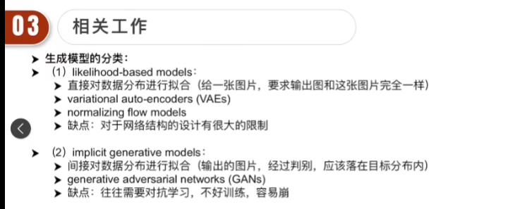

#  《Consistency Models》论文及相关阅读

# 前置知识

Score-based Model, DDPM(两个工作,有共同点) ->SDE/ODE(做了一个统一,离散->连续) ->Consistency Model(单步去噪)

## 1.Score-based Model

论文：《Generative Modeling by Estimating Gradients of the Data Distribution》

### （1）摘要


### （2）Related Work



- Score-based model相比于上图中的两种模型，优点在于网络结构的设计比较简单：即输入和输出的尺寸是一样的（这也是扩散模型用UNet的一个原因，毕竟UNet网络输入输出尺寸一样，所以普遍用UNet比较多）。另外，Score-based model只有一个loss，不像GAN那么难以训练。==也就是说，这个方法解决了上面两种方法可能会遇到的问题。==


### （3）Method


可以看右边的那张图，梯度整体指向概率密度比较高的位置，而“对数概率的梯度”就是本文提出的**Score**。简单理解，每次沿着Score走一步，走着走着就会走到数据密度高的位置。

接下来继续看方法部分：


具体解释一下（假设我们已经有了一个估计score的模型$s_\theta(x)$）：

- $x_i$表示随机的一个位置；
- $\epsilon$项是步长，即沿着梯度的方向往前走$\epsilon$长的一步；
- $z_i$是随机采样的一个噪声，也就是说在采样的时候会加入一些随机性（这是基于Langevin动力学，即热力学的一些定理的）

上述一切成立的前提是我们能够准确地求解出Score，但实际上这是不好求的：


看上图，红框内的区域是数据密度比较高的，这些区域的score估计会相对准确，但数据密度比较低的地方（这些地方占比其实很大）score的估计并不准确，而随机采样一个点基本上会落在这些score估计不准确的位置。==问题就转换为了，如何让模型在推理的早期就估计出准确的score呢？解决方案是给数据分布加噪声。==如下图，加了噪声扰动后的数据范围就会扩大了：


上图还是比较容易理解的。但这样又会带来新的问题，==加了噪声之后，即使用准确的Score一步一步生成，最终也只能走到噪声的位置上去，没办法走到干净的目标位置，所以这里有一个权衡：==


上图伪代码中：

- `for(i=1;i<=L;i++)`这层循环指的是不同的级别，在不同的级别中加的噪声强度，移动的步长都是不一样的，可以看到不同的级别下的$\alpha_i$的值并不一样。$\sigma_i$是噪声强度。
- `for(t=1;t<=T;t++)`这层循环一共采样T步，相当于从$x_0$位置走T步。
  - 思考一下，如果L * T =1000，且L=1000，T=1，相当于有1000个不同的level，即1000个不同的步长（从大到小），且每个level只采样一步。那么其实这就是==DDPM==的思路。


#### 问题：如何求解Score？

$$
s_{0}(x) \approx \nabla_{x} \log p(x)
$$

一种简单的思路是使用==去噪==的方式来求解出score。具体看下图：


正因为待估计的score分数与添加的噪声只差一个系数的关系，因此估计噪声本身其实就能估计出score了，这就与`DDPM`的工作联系到一起了。==本质上还是估计噪声然后去噪。==


### （4）补充：用预训练好的随机生成的Score-based model可以直接做inpainting的任务


画一个示意图来理解上面的过程：


==其实就是强制让已知的部分不变，令扩散模型生成未知的部分。==这样即使在inpainting任务上完全没有训练过或者finetune过，也可以直接做这个任务，这个观察还是很不错的。

==具体的实验结果部分看原始论文即可。==其实基本上所有的生成模型中只有扩散模型能很好地做inpainting的工作，这可能得益于扩散模型本身迭代式的生成流程。


### （5）总结与收获

核心就是对于两件事的理解：1.为什么要加噪声？ 2.为什么要去噪？

- 加噪声是为了扩展数据密度高的范围，从而更准确地估计score；
- 去噪声则是估计score的必要过程，因为根据公式推导，score的公式是与噪声密切相关的，所以自然需要一个预测噪声的神经网络。


## 2.SDE

### （1）SDE方法的简要介绍：Score-based Generative Modeling through Stochastic Differential Equations

 这篇工作很可能是扩散模型发展历程中最重要的一篇工作。这篇工作的贡献在于将DDPM和Score-based相关的模型做了理论上的统一（通过SDE，随机微分方程）。这部分将会介绍SDE方法是如何统一两个模型的，以及公式的推导，和一些分析。

SDE本质上还是在估计Score。


先看上图，以DDPM为例，在加噪声的过程中，假设t固定，那么某一个step的$x_t$应当是一个固定的随机变量，公式符合高斯分布。==实际上这也就相当于给定一个固定的X，其去噪轨迹（采样轨迹）是可以用随机过程来模拟的，这就可以用到SDE作为工具。==

------


对于连续的过程来说，加噪声本质上就是$x_t->x_{t+\Delta_t}$的过程，这里的$\Delta_t->0$，而去噪的过程也是类似的。

------


我们先来看Forward SDE的过程：

- $x$是之前讲的$x_t$，即研究的对象，是一张图片（或者说噪声图）。
- $f(x, t)$,原文中叫drift coefficient
- $g(t)$在原文中叫diffusion coefficient
- $w$是布朗运动（Brownian motion）

看起来非常抽象，接下来进行一定拆解。前半部分$f(x,t)dt$其实表示的是一个`确定性的过程`，而后面的部分是一个`不确定性的过程`（根据scored-based这篇工作的介绍，源头应该是来自于热力学的现象）。$dw$表示对布朗运动的微分，也就是一个扰动，代表不确定性扰动，而$g(t)$则表示这个扰动的强度。


### （2）推导基于SDE扩散模型的重建公式

现在我们已经知道了扩散公式：$dx=f(x, t)d_t + g(t)dw$,如何==以此为基础，推导出重建的公式呢？==(太难了。。。暂时没必要看懂了)

> 以下是整理后的LaTeX公式（用`$$...$$`包围）和分步推导说明，适用于直接粘贴到Typora中。我将结合扩散模型（SDE）的推导逻辑，逐步解释每个公式的物理意义和数学变换。
>
> ---
>
> ### **第1张图：前向SDE的离散化形式**
>
> $$ dx = f(x,t)dt + g(t)dw \quad \text{(连续时间SDE)} $$
> $$ x_{t+\Delta t} - x_t = f(x_t,t)\Delta t + g(t)\sqrt{\Delta t}\,\epsilon \quad \epsilon \sim \mathcal{N}(0,I) $$
> $$ x_{t+\Delta t} = x_t + f(x_t,t)\Delta t + g(t)\sqrt{\Delta t}\,\epsilon $$
> $$ p(x_{t+\Delta t}|x_t) \sim \mathcal{N}\big(x_t + f(x_t,t)\Delta t,\, g^2(t)\Delta t I\big) $$
>
> **推导说明：**
>
> 1. **连续时间SDE**：描述扩散过程，其中：
>    - $f(x,t)$ 是漂移项（drift），决定确定性演化；
>    - $g(t)dw$是扩散项（diffusion），引入随机噪声（$dw$ 是维纳过程增量）。
> 2. **离散化**：将连续SDE欧拉离散化（Euler-Maruyama方法）：
>    - 时间步长$ \Delta t$，噪声项$ \epsilon \sim \mathcal{N}(0,I)$；
>    - 离散后$x_{t+\Delta t} $的条件分布是高斯分布，均值为 $ x_t + f(x_t,t)\Delta t$，方差为$g^2(t)\Delta $。
>
> ---
>
> ### **第2张图：反向条件概率的贝叶斯展开**
> $$\large x_{t+\Delta t} \to x_t \quad \text{(反向过程)} $$
> $$ \large p(x_t|x_{t+\Delta t}) = \frac{p(x_{t+\Delta t}|x_t)p(x_t)}{p(x_{t+\Delta t})} $$
> $$ \large = p(x_{t+\Delta t}|x_t) \exp\left\{\log p(x_t) - \log p(x_{t+\Delta t})\right\} $$
> $$ \large = p(x_{t+\Delta t}|x_t) \exp\left\{-(x_{t+\Delta t}-x_t)\nabla_{x_t}\log p(x_t) - \Delta t \frac{\partial}{\partial t}\log p(x_t)\right\} $$(因为有两项，所以泰勒展开需要求偏导)
>
> **推导说明：**
>
> 1. **贝叶斯定理**：反向过程的条件概率 $ p(x_t|x_{t+\Delta t}) $ 通过前向转移$p(x_{t+\Delta t}|x_t)$和边缘分布$p(x_t)$表示。
> 2. **对数概率展开**：对 $\log p(x_{t+\Delta t})$做泰勒展开（假设$\Delta t$很小）：
>    - $\log p(x_{t+\Delta t}) \approx \log p(x_t) + (x_{t+\Delta t}-x_t)\nabla_{x_t}\log p(x_t) + \Delta t \partial_t \log p(x_t)$；
>    - 忽略高阶项后，得到指数部分的线性近似。
>
> ---
>
> ### **第3张图：反向概率的显式形式**
> $$\large p(x_t|x_{t+\Delta t}) \propto(正比于) \exp\left\{ -\frac{\|x_{t+\Delta t} - x_t - f(x_t,t)\Delta t\|^2}{2g^2(t)\Delta t} - (x_{t+\Delta t}-x_t)\nabla_{x_t}\log p(x_t) - \Delta t \frac{\partial}{\partial t}\log p(x_t) \right\} $$
> $$\large = \exp\left\{ -\frac{1}{2g^2(t)\Delta t} (x_{t+\Delta t}-x_t) \cdot \left[x_{t+\Delta t}-x_t - 2f(x_t,t)\Delta t - 2g^2(t)\Delta t \nabla_{x_t}\log p(x_t)\right] - \Delta t \partial_t \log p(x_t) - \frac{f^2(x_t,t)\Delta t}{2g^2(t)} \right\} $$
>
> **推导说明：**
> 1. **合并高斯项和得分项**：将前向转移的高斯密度 $p(x_{t+\Delta t}|x_t)$和得分函数 $ \nabla_{x_t}\log p(x_t) $ 结合。
> 2. **配方法**：通过展开平方项和重新组合，显式地构造关于$x_t$ 的二次型，最终目标是表示为一个新的高斯分布。
>
> ---
>
> ### **第4张图：反向SDE的漂移项**
> $$ p(x_t|x_{t+\Delta t}) \propto \exp\left\{ -\frac{1}{2g^2(t)\Delta t} \left\| (x_{t+\Delta t}-x_t) - \left(f(x_t,t) - g^2(t)\nabla_{x_t}\log p(x_t)\right)\Delta t \right\|_2^2 \right\} $$
> $$ \Delta t \to 0 \quad \text{(连续时间极限)} $$
> $$ \approx \exp\left\{ -\frac{1}{2g^2(t+\Delta t)\Delta t} \left\| (x_{t+\Delta t}-x_t) - \left(f(x_{t+\Delta t},t+\Delta t) - g^2(t+\Delta t)\nabla_{x_{t+\Delta t}}\log p(x_{t+\Delta t})\right)\Delta t \right\|_2^2 \right\} $$
> $$ x_{t+\Delta t} \approx x_t \quad \text{(一阶近似)} $$
>
> **推导说明：**
>
> 1. **反向漂移项**：识别出均值部分$ f(x_t,t) - g^2(t)\nabla_{x_t}\log p(x_t)$，即前向漂移减去得分函数的修正。
> 2. **时间反转**：在 $\Delta t \to 0$时，将 \( t \) 替换为$t+\Delta t$以适应反向过程。
> 3. **一阶近似**：假设$x_{t+\Delta t} \approx x_t$，简化表达式。
>
> ---
>
> ### **第5张图：反向SDE的离散化**
> $$ p(x_t|x_{t+\Delta t}) \text{ 的均值： } x_{t+\Delta t} - \left(f(x_{t+\Delta t}, t+\Delta t) - g^2(t+\Delta t)\nabla_{x_{t+\Delta t}}\log p(x_{t+\Delta t})\right)\Delta t $$
> $$ \text{方差： } g^2(t+\Delta t)\Delta t $$
> $$ dx = \left[f(x,t) - g^2(t)\nabla_x \log p(x)\right]dt + g(t)dw \quad \text{(反向SDE)} $$
> $$ x_{t+\Delta t} - x_t = \left[f(x_{t+\Delta t}, t+\Delta t) - g^2(t+\Delta t)\nabla_{x_{t+\Delta t}}\log p(x_{t+\Delta t})\right]\Delta t + g(t+\Delta t)\sqrt{\Delta t}\,\epsilon $$
>
> **推导说明：**
> 1. **反向SDE**：连续形式与正向SDE类似，但漂移项多了一个得分函数的修正项$-g^2(t)\nabla_x \log p(x)$。
> 2. **离散化**：反向过程的离散化均值和方差直接由前几步推导得到。
>
> ---
>
> ### **第6张图：采样步骤与得分匹配**
> $$ x_{t-1} = x_t - \left[f(x_t,t) - g^2(t)\nabla_{x_t}\log p(x_t)\right] + g(t)\epsilon $$
> $$ \text{Score: } \nabla_x \log p(x) $$
> $$ \begin{cases}
> dx = f(x,t)dt + g(t)dw & \text{(正向SDE)} \\
> dx = \left[f(x,t) - g^2(t)\nabla_x \log p(x)\right]dt + g(t)dw & \text{(反向SDE)}
> \end{cases} $$
>
> **推导说明：**
>
> 1. **采样步骤**：反向过程的迭代更新公式，每一步减去漂移项并添加噪声。
> 2. **得分函数**：核心是估计 $ \nabla_x \log p(x) $，通常通过训练神经网络（如Score Matching或Diffusion Models）近似。
> 3. **正反向SDE对比**：反向SDE的漂移项多了一个score-based的修正，确保从噪声中逐步生成数据。
>
> ---
>
> ### **关键点总结**
> 1. **正向过程**：数据逐渐加噪，离散化为高斯转移。
> 2. **反向过程**：依赖得分函数 $\nabla_x \log p(x) $修正漂移项，逐步去噪。
> 3. **得分匹配**：通过神经网络学习得分函数，是扩散模型的核心。
>


### （3）SDE是如何统一DDPM和Score-based model的？

太难了。。。全是公式推导，先不看了，直接问一下DeepSeek怎么用SDE吧。

我的理解是核心贡献为下面这张图：


> 你提到的 **随机微分方程（SDE）** 确实是数学上比较复杂的工具，但它的核心思想和贡献其实可以用更直观的方式理解。下面我会用通俗的语言总结SDE的贡献、使用方法，以及它和 **一致性模型（Consistency Model）** 的关系。
>
> ---
>
> ## **1. SDE 的核心贡献是什么？**
> SDE 在生成模型（如扩散模型）中的主要贡献是 **统一了扩散过程的数学框架**，并提供了 **连续时间视角下的噪声扰动和生成**。具体来说：
>
> ### **(1) 统一了离散和连续的扩散过程**
> - 之前的扩散模型（如DDPM）是离散时间步的，而SDE将其推广到连续时间，使得理论更通用。
> - 例如，DDPM可以看作SDE的一个特例（离散时间步的欧拉近似）。
>
> ### **(2) 提供了反向过程的严格数学推导**
> - SDE 不仅描述了数据如何被噪声破坏（前向过程），还严格推导了如何从噪声中生成数据（反向过程）。
> - 反向过程的关键是 **得分匹配（Score Matching）**，即学习一个神经网络来估计 $\nabla_x \log p(x)$（数据的梯度场）。
>
> ### **(3) 启发了更高效的生成方法**
> - SDE 的理论表明，生成过程可以通过调整噪声调度$g(t)$来优化，从而加速采样（如 **Probability Flow ODE** 方法）。
> - 这直接影响了后来的 **一致性模型（Consistency Model）** 和 **扩散模型的加速采样技术**。
>
> ---
>
> ## **2. 如何使用 SDE？**
> 虽然SDE的数学推导复杂，但实际使用时可以依赖现成的代码库（如 `score-sde` 或 `diffusers`）。以下是典型的使用流程：
>
> ### **(1) 训练阶段**
> 1. **定义前向SDE**（加噪过程）：
>    - 例如：`dx = f(x,t)dt + g(t)dw`，其中 `f(x,t)` 是漂移项，`g(t)` 控制噪声强度。
> 2. **训练一个神经网络（Score Network）** 来估计得分函数 $\nabla_x \log p(x)$。
>
> ### **(2) 生成阶段**
> 1. **反向SDE采样**：
>    - 从随机噪声$ x_T \sim \mathcal{N}(0,I) $ 开始，用训练好的Score Network 逐步去噪。
>    - 例如：
>      ```python
>      for t in reversed(range(T)):
>          x = x - (f(x,t) - g(t)^2 * score_network(x,t)) * dt + g(t) * noise
>      ```
> 2. **可选：用ODE加速采样**（Probability Flow ODE）：（==下面的部分会对其进行介绍==）
>    
>    - 如果 \( g(t) \) 很小，可以忽略随机项，变成确定性ODE，大幅加速生成。
>
> ---
>
> ## **3. SDE 对 Consistency Model 的启发**
> **一致性模型（Consistency Model）** 是扩散模型的一种加速变体，它的核心思想直接受到SDE的启发：
>
> ### **(1) 核心思想**
> - **一致性模型的目标**：让模型在任意时间步 \( t \) 都能直接从噪声 \( x_t \) 映射到干净数据 \( x_0 \)（即“一致性”）。
> - 这相当于 **跳过了SDE的逐步去噪过程**，直接学习一个“一步生成”的映射。
>
> ### **(2) SDE 如何启发 Consistency Model？**
> 1. **SDE 揭示了扩散模型的本质**：
>    - SDE 表明，扩散模型的核心是学习数据的 **得分函数 $ \nabla_x \log p(x) $**。
>    - Consistency Model 直接利用这一点，训练一个网络 $f_\theta(x_t, t) \to x_0$，而不是逐步去噪。
>
> 2. **从SDE的Probability Flow ODE得到灵感**：
>    - SDE 的确定性版本（ODE）表明，生成过程可以不用随机噪声，而是直接解一个ODE。
>    - Consistency Model 类似，但进一步简化，直接学习“单步映射”。
>
> 3. **训练方法借鉴了SDE的得分匹配**：
>    - Consistency Model 的训练仍然依赖于类似Score Matching的技术，但优化目标是“一致性”而非逐步去噪。
>
> ### **(3) Consistency Model 的优势**
> - **极快生成**：传统扩散模型需要100+步，Consistency Model 只需1步（或几步）。
> - **质量接近扩散模型**：虽然是一步生成，但质量仍然很高，接近SDE-based方法。
>
> ---
>
> ## **4. 总结：SDE vs. Consistency Model**
> | 特性         | SDE（扩散模型）                  | Consistency Model                  |
> | ------------ | -------------------------------- | ---------------------------------- |
> | **生成方式** | 逐步去噪（多步）                 | 直接映射（单步或几步）             |
> | **数学基础** | 随机微分方程（SDE）              | 受SDE启发，但简化为一致性映射      |
> | **训练目标** | 学习得分函数$\nabla_x \log p(x)$ | 学习$ x_t \to x_0$ 的直接映射      |
> | **速度**     | 慢（需要几十到几百步）           | 快（1步或少量步）                  |
> | **适用场景** | 高保真生成（如图像超分）         | 实时应用（如视频生成、交互式编辑） |
>
> ---
>
> ## **5. 如何选择？**
> - **如果你需要最高质量**（比如艺术生成、超分辨率），**SDE-based扩散模型** 仍然是首选。
> - **如果你需要快速生成**（比如实时视频、交互式应用），**Consistency Model** 是更好的选择。
>
> ---
>
> ### **最终建议**
> 如果你觉得SDE的数学太难，**不必纠结推导细节**，可以直接：
> 1. **使用现成的SDE代码**（如 `score-sde` 或 `diffusers` 库）。
> 2. **尝试Consistency Model**（如OpenAI的论文 [Consistency Models](https://arxiv.org/abs/2301.01442)），它更简单且高效。
>
> 希望这能帮你理清思路！如果还有具体问题，欢迎继续讨论 😊


### （4）ODE的介绍

> 好的！你提到的 **Probability Flow ODE** 是SDE框架下一种非常重要的加速采样技术，它的核心思想是 **将随机扩散过程（SDE）转化为确定性过程（ODE）**，从而大幅提升生成速度。下面我会用直观的方式解释它的原理和实现细节。
>
> ---
>
> ## **1. 回顾SDE和它的反向过程**
> 首先，扩散模型的前向SDE通常写成：
> $$
> dx = f(x,t)dt + g(t)dw
> $$
> 其中：
> - \( f(x,t) \) 是**漂移项**（控制数据的确定性演化），
> - \( g(t) \) 是**扩散系数**（控制噪声强度），
> - \( dw \) 是布朗运动的随机噪声。
>
> **反向SDE**（用于生成数据）的形式为：
> $$
> dx = [f(x,t) - g(t)^2 \nabla_x \log p_t(x)]dt + g(t)dw
> $$
> 其中 $ \nabla_x \log p_t(x)$ 是得分函数（Score Function），通常用神经网络近似（如Score-Based Model）。
>
> ---
>
> ## **2. 关键问题：为什么可以去掉随机项？**
> 反向SDE中的随机项 \( g(t)dw \) 会导致采样过程的**不确定性**（每次生成结果略有不同），同时需要更多步数才能收敛。但如果我们能**去掉随机性**，就可以：
> 1. **大幅减少采样步数**（因为ODE的解更稳定），
> 2. **保证生成质量**（理论上ODE和SDE生成的样本分布相同）。
>
> ### **数学直觉**
> 当$ g(t) \to 0$时，SDE的随机项消失，退化为普通的ODE：
> $$
> dx = [f(x,t) - g(t)^2 \nabla_x \log p_t(x)]dt
> $$
> 但即使 $ g(t)$不严格为零，只要它足够小，就可以近似用ODE描述系统的演化。
>
> ---
>
> ## **3. Probability Flow ODE的推导**
> ### **核心定理**
> 在SDE框架下，存在一个**确定性ODE**，其解与原始SDE生成的边缘分布 \( p_t(x) \) 完全相同：
> $$
> dx = \left[ f(x,t) - \frac{1}{2}g(t)^2 \nabla_x \log p_t(x) \right]dt
> $$
> 这个ODE称为 **Probability Flow ODE**。
>
> ### **为什么能成立？**
> 1. **Fokker-Planck方程的链接**：
>    - SDE对应的Fokker-Planck方程描述了概率密度的演化：
>      $$
>      \frac{\partial p_t(x)}{\partial t} = -\nabla \cdot [f(x,t)p_t(x)] + \frac{1}{2}g(t)^2 \Delta p_t(x)
>      $$
>    - 而Probability Flow ODE的解恰好满足相同的 $p_t(x)$。
>
> 2. **随机项的“平均效应”**：
>    - ODE的确定性漂移项已经隐含了随机噪声的统计特性（通过得分函数$ \nabla_x \log p_t(x)$），因此无需显式添加噪声。
>
> ---
>
> ## **4. 为什么ODE能加速生成？**
> ### **(1) 更少的采样步数**
> - SDE采样需要模拟随机游走（类似布朗运动），需要小步长和大量迭代才能收敛。
> - ODE是确定性的，可以用**高阶数值方法**（如Runge-Kutta）或**自适应步长**加速。
>
> ### **(2) 允许更大的步长**
> - 随机SDE中，步长太大可能导致不稳定（因为噪声项 \( dw \) 的方差随$\sqrt{dt}$增长）。
> - ODE没有随机项，步长可以更大（甚至可以用**隐式方法**稳定求解）。
>
> ### **(3) 实际案例**
> - 在DDPM中，传统采样可能需要1000步，但Probability Flow ODE只需20~50步就能达到相似质量（如OpenAI的 [DDIM](https://arxiv.org/abs/2010.02502) 就是ODE的特例）。
>
> ---
>
> ## **5. 实现示例**
> 假设我们已经训练好了一个得分模型$s_\theta(x,t) \approx \nabla_x \log p_t(x$，Probability Flow ODE的采样步骤如下：
>
> ```python
> def probability_flow_ode(x, t):
>     # 定义ODE的漂移项: dx/dt = f(x,t) - 0.5*g(t)^2 * score
>     drift = f(x,t) - 0.5 * (g(t)**2) * s_theta(x,t)
>     return drift
> 
> # 用ODE求解器（如scipy.integrate.solve_ivp）生成样本
> from scipy.integrate import solve_ivp
> 
> def generate_sample():
>     x_T = torch.randn(shape)  # 初始噪声
>     t_span = (T, 0)           # 从t=T到t=0反向求解
>     sol = solve_ivp(probability_flow_ode, t_span, x_T, method='RK45')
>     return sol.y[:,-1]        # 返回最终样本x_0
> ```
>
> ---
>
> ## **6. 与Consistency Model的联系**
> Probability Flow ODE的确定性思想直接影响了Consistency Model的设计：
> 1. **一致性模型**进一步简化了ODE，直接学习从$ x_t$ 到 $x_0$的**单步映射**，完全跳迭代过程。
> 2. 它的训练目标本质上是让模型在ODE轨迹上保持“一致性”（即同一轨迹上的点映射到相同的$ x_0$）。
>
> ---
>
> ## **7. 总结**
> - **Probability Flow ODE** 是SDE的确定性版本，通过去掉随机项加速采样。
> - **核心条件**：当 \( g(t) \) 较小或得分函数估计准确时，ODE和SDE的生成分布一致。
> - **优势**：更快、更稳定、允许高阶数值方法。
> - **应用**：DDIM、Consistency Model等加速方法均基于此思想。
>
> 如果还有不清楚的地方，欢迎继续提问！ 😊


# 一、论文原文阅读

## 1.Abstract

扩散模型在图像、音频和视频生成领域取得了重大进展，==但其依赖迭代采样过程导致生成速度缓慢。==为突破这一限制，==我们提出了一致性模型（Consistency Models）——这类新型模型通过直接将噪声映射到数据来实现高质量样本生成==。==其设计天然支持快速单步生成，同时仍允许通过多步采样来权衡计算量与样本质量。==该模型还能实现零样本数据编辑（如图像修复、着色和超分辨率），而无需针对这些任务进行显式训练。==一致性模型既可通过蒸馏预训练扩散模型获得，也能作为独立生成模型从头训练。==大量实验表明，该模型在一步和少步采样中超越了现有扩散模型蒸馏技术，在CIFAR-10上以单步生成达到3.55的FID新纪录，在64×64 ImageNet上达到6.20。当作为独立模型训练时，一致性模型形成了全新的生成模型家族，在CIFAR-10、64×64 ImageNet和256×256 LSUN等基准测试中，其性能优于现有的一步式非对抗生成模型。


## 2.Introduction

以下简要介绍核心内容。

A key feature of diffusion models is the iterative sampling process which progressively removes noise from random initial vectors. This iterative process provides a ==flexible trade-off of compute and sample quality, as using extra compute for more iterations usually yields samples of better quality==.  ==causing slow inference and limited real-time applications.==

本文的目标：create generative models that facilitate efficient, single-step generation without sacrificing important advantages of iterative sampling, such as trading compute for sample quality when necessary, as well as performing zero-shot data editing tasks.


**翻译：**  

我们的目标是构建既能实现高效单步生成，又无需牺牲迭代采样重要优势的生成模型——例如在必要时通过增加计算量提升样本质量，以及执行零样本数据编辑任务。如图1所示，我们的方法基于连续时间扩散模型中的概率流常微分方程（Probability Flow Ordinary Differential Equation, PF ODE，Song等人2021年提出），其轨迹能够将数据分布平滑地转化为易处理的噪声分布。我们提出学习一个模型，该模型可将轨迹上任意时间步的点映射至轨迹起点。这一模型的关键特性是**自一致性**（self-consistency）：同一轨迹上的所有点都会被映射到相同的初始点，因此我们将其命名为**一致性模型**（consistency models）。  

一致性模型通过单次网络评估即可将随机噪声向量（ODE轨迹的终点，如图1中的x_T）转换为数据样本（ODE轨迹的起点，如图1中的x_0）。更重要的是，通过链式调用多个时间步的一致性模型输出，我们可以像扩散模型的迭代采样那样，以更高计算成本为代价提升样本质量或执行零样本数据编辑。  

训练一致性模型时，我们基于自一致性特性提出两种方法：  

1. **蒸馏法**：利用数值ODE求解器和预训练扩散模型生成PF ODE轨迹上的相邻点对，通过最小化模型对这些点对的输出差异，将扩散模型蒸馏为一致性模型，从而实现单步高质量生成。  
2. **独立训练法**：完全无需预训练扩散模型，将一致性模型作为独立生成模型家族进行训练。两种方法均无需对抗训练，且对网络架构约束极少，可使用灵活的神经网络参数化一致性模型。  

我们在CIFAR-10、64×64 ImageNet和256×256 LSUN等数据集上验证了有效性：  

- **作为蒸馏方法**：在少步生成中超越渐进式蒸馏（progressive distillation）等现有技术。例如在CIFAR-10上，单步和两步生成的FID分别达到3.55和2.93的新纪录；在64×64 ImageNet上，单次和两次网络评估的FID分别为6.20和4.70。  
- **作为独立模型**：即便不依赖预训练扩散模型，其单步生成质量仍可匹配或超越渐进式蒸馏的结果，且优于许多GANs和现有非对抗单步生成模型。  
  此外，一致性模型能执行零样本数据编辑任务（如图像去噪、插值、修复、着色、超分辨率及笔画引导编辑SDEdit），展现出广泛适用性。  


> ### 术语与策略解释：  
> 1. **ODE（常微分方程）与概率流（PF ODE）**  
>    - 在扩散模型中，PF ODE描述了数据分布到噪声分布的连续转化轨迹。其解轨迹上的每个点对应不同噪声水平的数据状态，通过数值求解（如欧拉法）可逐步从噪声生成数据。  
>    - **一致性模型的创新**：直接学习“轨迹任意点→起点”的映射，绕过迭代求解，实现单步生成。  
>
> 2. **自一致性（Self-consistency）**  
>    - 核心约束：同一ODE轨迹上的所有点必须映射到相同的起点。这一性质确保模型在单步或多步调用时保持输出一致性。  
>
> 3. **训练策略**  
>    - **蒸馏法**：利用预训练扩散模型生成的轨迹点对作为监督信号，通过约束相邻点的输出一致性实现知识迁移。  
>    - **独立训练法**：通过设计损失函数直接优化自一致性（如对比同一轨迹不同点的输出），无需依赖扩散模型。  
>
> 4. **零样本编辑**  
>    - 关键机制：通过向输入噪声添加特定条件（如掩码图像、低分辨率图像等），利用模型对轨迹起点的映射能力直接生成编辑结果，无需额外训练。

对ODE和PF ODE的更详细的解释：

> 好的！让我们更系统地拆解 **PF ODE（概率流常微分方程）** 在扩散模型中的作用，以及它如何与一致性模型结合。我会从背景知识开始，逐步深入。
>
> ---
>
> ### 1. **扩散模型的基础：噪声化与反向过程**
> 扩散模型的核心思想是通过**逐步添加噪声**将数据（如图像）转化为随机噪声（前向过程），再学习**逆向去噪过程**以生成数据。  
> - **前向过程**：对数据 \( x_0 \) 逐步添加高斯噪声，经过 \( T \) 步后得到纯噪声 \( x_T \)。  
> - **反向过程**：训练神经网络从 \( x_t \) 预测 \( x_{t-1} \)，最终从噪声 \( x_T \) 重构数据 \( x_0 \)。  
>
> 传统扩散模型需要**迭代执行反向过程**（如1000步），导致生成速度慢。
>
> ---
>
> ### 2. **连续时间视角：将扩散过程视为微分方程**
> Song et al. (2021) 提出将离散的扩散步骤推广到**连续时间**，用微分方程描述数据演化：  
> - 定义时间变量 \( t \in [0,T] \)，其中 \( t=0 \) 对应数据分布 \( x_0 \)，\( t=T \) 对应噪声分布 \( x_T \)。  
> - 扩散过程可以表示为**随机微分方程（SDE）**，描述数据如何随时间随机变化。  
> - **概率流ODE（PF ODE）** 是SDE的一个确定性版本，其解轨迹 \( \{x_t\}_{t \in [0,T]} \) 满足：  
> - $$
>   \frac{dx_t}{dt} = f(x_t, t)
>   $$
>   其中 \( f(x_t, t) \) 是漂移项，由扩散模型参数化。
>
> ---
>
> ### 3. **PF ODE 的关键特性**
> - **确定性轨迹**：给定初始点 \( x_0 \，PF ODE 生成一条唯一的轨迹 \( x_t \)，最终到达噪声 \( x_T \)。  
> - **可逆性**：通过反向求解ODE，可以从噪声 \( x_T \) 恢复数据 \( x_0 \)。  
> - **数值求解**：  
>   实际求解时，使用数值方法（如欧拉法、Runge-Kutta）离散化ODE。例如： 
> - $$
>   x_{t-\Delta t} = x_t - f(x_t, t) \cdot \Delta t
>   $$
>   需要**多步迭代**才能从 \( x_T \) 生成 \( x_0 \)，这正是扩散模型慢的原因。
>
> ---
>
> ### 4. **一致性模型的突破：绕过迭代求解**
> 一致性模型的目标是**直接学习PF ODE轨迹的起点映射**：  
> - **输入**：轨迹上任意点 \( x_t \) 和时间 \( t \)。  
> - **输出**：轨迹起点 \( x_0 \)。  
> - **自一致性约束**：同一轨迹上的所有点 \( x_t \) 必须映射到相同的 \( x_0 \)。  
>
> **为什么有效？**  
> - PF ODE的轨迹是唯一的，因此从任意 \( x_t \) 出发都应指向同一个 \( x_0 \)。  
> - 模型通过单次前向传播即可预测 \( x_0 \)，**无需迭代**。  
>
> ---
>
> ### 5. **具体例子：从噪声生成图像**
> 假设我们有一张图像 \( x_0 \) 和对应的噪声 \( x_T \)：  
> 1. **传统扩散模型**：  
>    - 从 \( x_T \) 出发，逐步求解ODE（如100步），每步调用神经网络预测 \( x_{t-1} \)。  
>    - 计算成本高。  
>
> 2. **一致性模型**：  
>    - 直接输入 \( x_T \) 和时间 \( T \)，模型输出 \( x_0 \)。  
>    - **仅需1步**！  
>
> ---
>
> ### 6. **与数值ODE求解器的关系**
> 一致性模型的训练依赖PF ODE的轨迹数据：  
> - **蒸馏法**：用预训练扩散模型生成轨迹点对 \( (x_t, x_{t+\Delta t}) \)，监督模型使它们的输出 \( x_0 \) 一致。  
> - **独立训练法**：通过扰动真实数据 \( x_0 \) 生成 \( x_t \)，直接学习 \( x_t \to x_0 \) 的映射。  
>
> ---
>
> ### 总结
> - **PF ODE** 是扩散模型中数据→噪声转化的连续轨迹描述。  
> - **一致性模型** 通过直接学习“轨迹点→起点”的映射，**将ODE的迭代求解压缩为单步预测**，实现快速生成。  
> - 其核心是**自一致性**：同一ODE轨迹上的所有点必须映射到相同的初始数据。  
>
> 这种设计在保持生成质量的同时，**将计算复杂度从 \( O(T) \) 降为 \( O(1) \)**，是扩散模型加速的重要突破。

