# 《MotionLCM》论文及代码相关

# 一、前置知识

## （1）Consistency Model的解读

- 一致性模型CM的相关解读：https://neurips.cc/virtual/2023/75013

  

  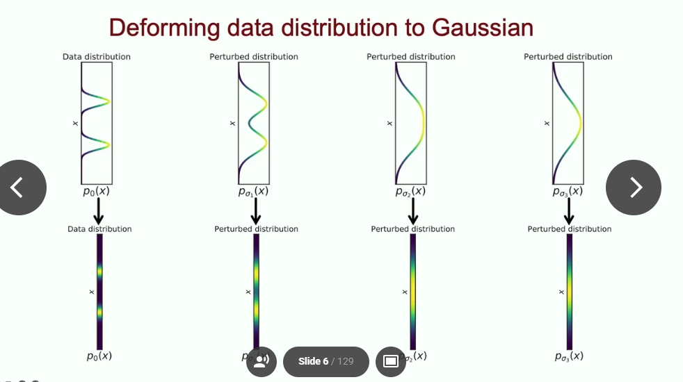

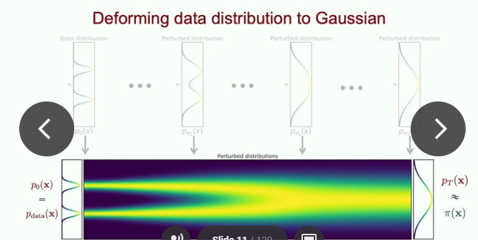

剩下的图不截了，去上面的链接里面找吧。


### 具体的理解（有所理解）

#### （a）一致性模型是什么？

先来看下面这张经典的SDE的图：

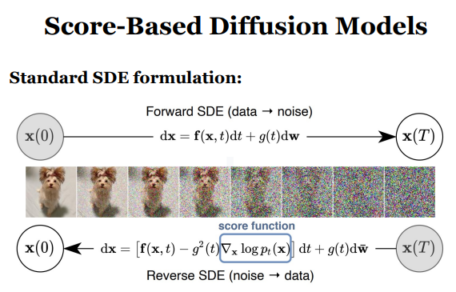

这个在其他的笔记中已经有所记录了，相当于是将Scored-based Model与DDPM做了统一，不妨来看下图：

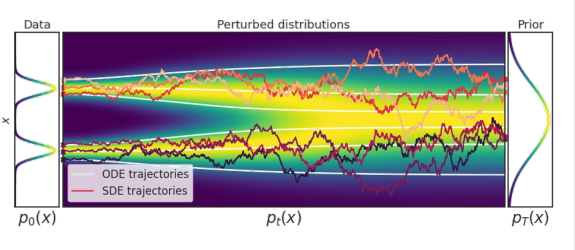

简单来看，我们假设数据的真实分布符合左侧Data表示的两个gaussian分布，而forward SDE则是通过那些红色扰动的线（毕竟有朗之万动力学带来的随机性），将输入的pdata扰动最终成为纯gaussian noise（看上图最右，变成纯高斯噪声），而去噪的过程就是上面的Reverse SDE的过程，可以理解为走回来（**个人理解：所以生成的图跟原图会有不同，毕竟具备一定的随机性**）。这就是SDE的具体过程。

那么Probability flow ODE这篇文章的贡献在于什么呢？**注意看上图白色的线，PF ODE做的贡献相当于把随机性去掉了，变为常微分方程求解，可以看到白色的线是十分光滑的。**但显然这会造成生成质量的下降，不过会让生成的速度非常快，使用ODE 求解器可以直接解决step-by-step的生成过程。比如DDIMSolver（在LCM和MotionLCM中均有这个Solver）就是一个比较常见的ODE求解器。PF ODE的公式如下：

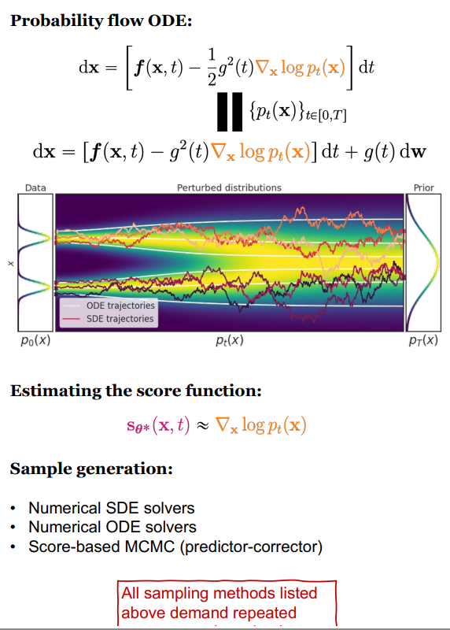

==务必需要注意的一点==：看起来PF ODE已经是用常微分方程去做模拟了，那难道PF ODE不能一步推理到位么？一致性模型是不是就是用来解决PF ODE没法一步推理到位的问题？

- 答案：**是的，PF ODE没有办法一步推理到位。PF ODE 是扩散模型（如DDPM）的确定性采样路径，它将扩散过程的随机轨迹转化为确定性轨迹（通过逆转SDE对应的ODE）。**PF ODE 的求解通常需要分步进行**，例如使用数值方法（如欧拉法、Runge-Kutta）逐步从噪声分布$x_T$ 迭代到目标数据 $x_0$。**
  - 关键点：
    - 每一步求解对应扩散过程的一个时间步，最终通过多步迭代逐步去噪。
    - 即使PF ODE是确定性的，仍需逐步逼近解，无法一步到位。

那么既然这样，一致性模型就可以诞生出来了，其作用就是**一步到位**，来看下面这张图：

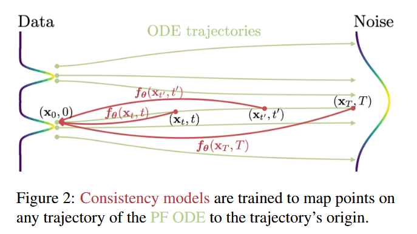

==一致性模型的思路是这样的：==

- 我训练一个$f_\theta$函数（也就是一个神经网络），使得ODE所在曲线上的任意点都可以一步到位到$x_0$的位置，也就是data的数据（注意，**不是噪声，是数据分布，抑或是编码到latent space中的数据分布**）

也就是说，有如下的目标：
$$
f_\theta(x_t, t)=x_0
$$
同时，我们可以为这个一致性模型添加两个条件：

- 第一个条件：至少$x_0$经过一致性模型解算后得完整输出$x_0$吧，即$f_\theta(x_0, 0) = x_0$.
- 第二个条件：由于我们想用一致性模型去拟合整个ODE Trajectories，因此还得保证曲线上任意两点的$f_\theta$结果是一样的，都是来到曲线的起点，即：

$$
\forall t,t' \in [0, T]: f_\theta(x_t, t) = f_\theta(x_t', t') = x_0
$$

> 再确认一下：一致性模型输出的是原始图像，也就是$x_0$，下图来自原作者的slides：
>
> 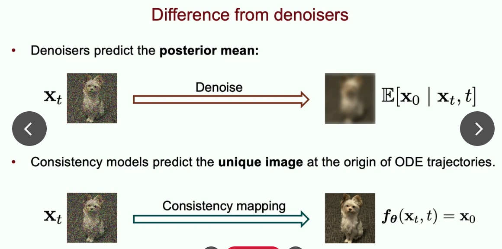

一致性模型既支持单步生成，也支持多步生成，区别如下：
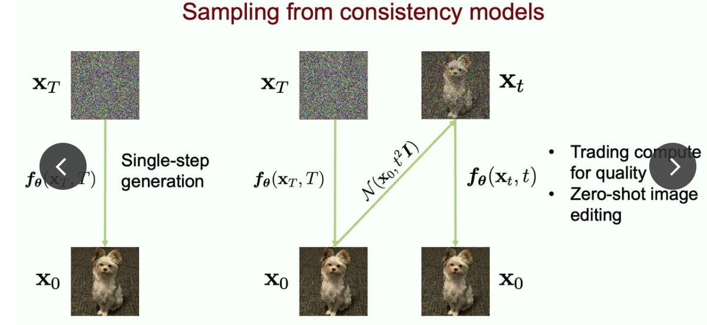

对于单步生成来说，直接对于某一个timestep的$X_T$求解即可拿到生成的结果:$f_\theta(x_T, T) = x_0$.对于多步生成来说，看上图，可以不断给一致性模型预测的$x_0$加噪声，然后再进行预测，以促使迭代式的生成，让结果更好。==一致性模型是同时支持单步生成与多步生成的。== 


#### （b）一致性模型如何控制边界条件？

直接看下图：

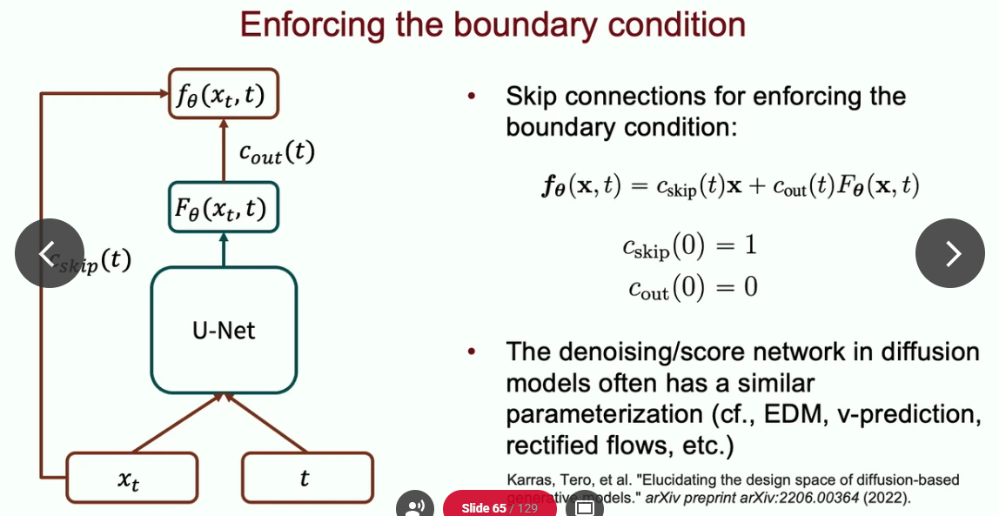

这个公式乍一看有一些迷茫，但我们可以这样想，根据前面的介绍，在t=0的时候，我们希望$f_\theta(x_t, t)=x_0$。那么此时$c_{skip}$应该尽可能的大，甚至一开始为1，而此时的$c_{cout}=0$，意味着最终采用的结果完全是x，即原图。而如果采样的随机的T非常大，那么就会倾向于更使用模型（UNet）预测的结果$F_\theta(x_t, t)$的结果。

上图的公式中的$x$指的是某一个时刻的$x_t$，这一点**不要搞错。**再看上图左侧，是不是觉得很像ResNet的感觉？==所以这种策略也即Skip connection的策略。==同时上图也说明了在一些其他的diffusion model中也有类似地思路，比如EDM， v-prediction等。


#### （c）训练的过程到底是怎么回事？

这里我们就来彻底剖析一下训练的过程是什么。目标是搞懂下面这张图：

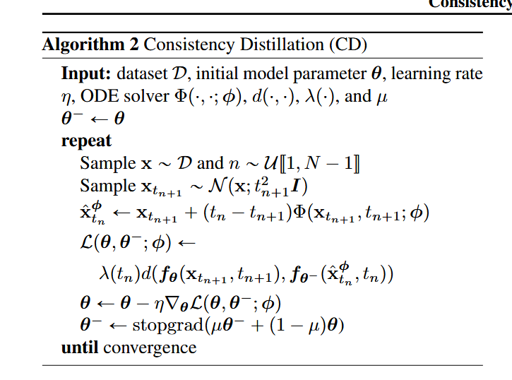

- （1）首先，我们有一个预训练好的score model：$s_\phi(x, t)$,这里的x应该指的是某个时刻的$x_t$。

- （2）接着，我们选择一个随机的时刻$t_{n+1}$，然后扰动data生成$X_{t_{n+1}}$.

- （3）执行一步的ODE step：将time step $t_{n+1}$更新到$t_n$，回忆前面有介绍PF ODE也是需要迭代求解的。这一步就是下面这句：
- 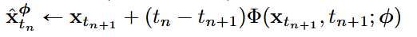

上式结果应该$\approx x_{t_n}$。根据Algorithm的介绍，$\Phi$是ODE Solver，在后面的代码中就是比如DDIM Solver。而使用ODE求解器更新的逻辑就是上面这个公式。

> 证据见原文：
>
> 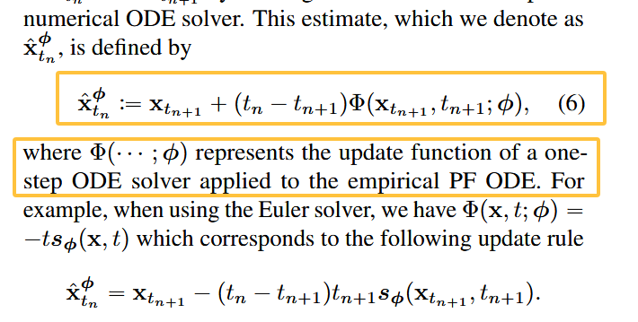
>
> $\phi$应该指的是ODE Solver中的一些参数。

- （4）接下来就是下面这个公式了：
- 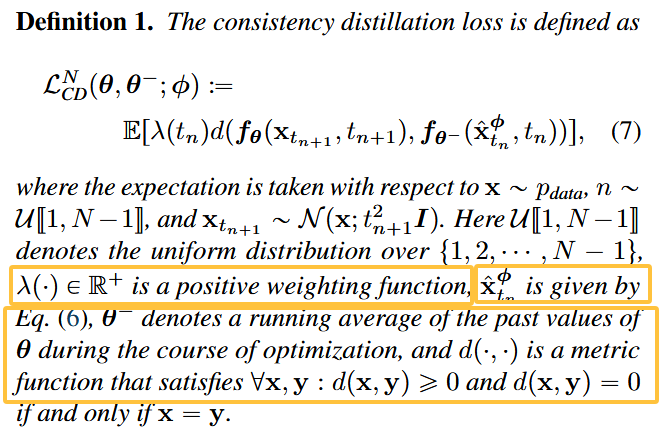

d（·,·）指的是损失函数，一般来说比如用L2损失或者其他的损失函数（比如LPIPS），而$\lambda(t_n)$则是一个权重函数，重要的是**$f_\theta$和$f_\theta^-$**分别指的是什么？根据论文的原文，$\theta^-$指的是过去的$\theta$的running average，这就要引出EMA来了。再来回顾一下：

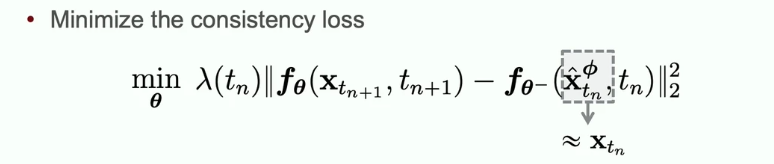

灰色框框出来的东西是ODE 求解器对teacher network求解一步得到的结果。而$f_{\theta^-}$（带减号！）这一项则是==target network==，作者的介绍：


而前面的$f_\theta$项则是student network。


### 趁热打铁，来看训练代码

这部分中，我们会把训练代码和上面的理论部分完全对应起来，以此论证确实有理解CM的这套理论。具体的代码在这里，可以结合整体进行阅读：

https://github1s.com/luosiallen/latent-consistency-model/blob/main/LCM_Training_Script/consistency_distillation/train_lcm_distill_sd_wds.py#L1099-L1100

一开始，先是把image通过VAE编码到latent space中，这里没什么可说的，然后是这一段：

```python
# Sample a random timestep for each image t_n ~ U[0, N - k - 1] without bias.
topk = noise_scheduler.config.num_train_timesteps // args.num_ddim_timesteps
index = torch.randint(0, args.num_ddim_timesteps, (bsz,), device=latents.device).long()
start_timesteps = solver.ddim_timesteps[index] # t_{n+1}
timesteps = start_timesteps - topk # t_{n}
timesteps = torch.where(timesteps < 0, torch.zeros_like(timesteps), timesteps)
```

这里的`start_timesteps`应当对应前面的$t_{n+1}$,而`timesteps`则是`start_timesteps - topk`,意味着应该指的是$t_n$时刻，topk是一个时间桶的时间，取决于每一步去噪要走多大的步长（看代码，这与`num_ddim_timesteps`有关，毕竟DDIM本身就是ODE Solver，要按照ODE Solver的迭代式求解结果来对齐）。==后面的分析需要牢牢对应上面的公式，笔记中也会给出。==

python接下来是$c_{skip}$和$c_{out}$这两个变量的设置：
```python
# 20.4.4. Get boundary scalings for start_timesteps and (end) timesteps.
c_skip_start, c_out_start = scalings_for_boundary_conditions(start_timesteps)
c_skip_start, c_out_start = [append_dims(x, latents.ndim) for x in [c_skip_start, c_out_start]]
c_skip, c_out = scalings_for_boundary_conditions(timesteps)
c_skip, c_out = [append_dims(x, latents.ndim) for x in [c_skip, c_out]]
```

不用管具体的逻辑是什么，==所有使用CM/LCM的工程反正都没改过这段。==


接下来我们先来看看student network会输出什么：


```python
# 20.4.5. Add noise to the latents according to the noise magnitude at each timestep
# (this is the forward diffusion process) [z_{t_{n + k}} in Algorithm 1]
noisy_model_input = noise_scheduler.add_noise(latents, noise, start_timesteps) # x_{t_{n+1}}

# 20.4.6. Sample a random guidance scale w from U[w_min, w_max] and embed it
w = (args.w_max - args.w_min) * torch.rand((bsz,)) + args.w_min
w_embedding = guidance_scale_embedding(w, embedding_dim=args.unet_time_cond_proj_dim)
w = w.reshape(bsz, 1, 1, 1)
# Move to U-Net device and dtype
w = w.to(device=latents.device, dtype=latents.dtype)
w_embedding = w_embedding.to(device=latents.device, dtype=latents.dtype)

# 20.4.8. Prepare prompt embeds and unet_added_conditions
prompt_embeds = encoded_text.pop("prompt_embeds")

# 20.4.9. Get online LCM prediction on z_{t_{n + k}}, w, c, t_{n + k}
noise_pred = unet( # F_theta网络
    noisy_model_input,
    start_timesteps,
    timestep_cond=w_embedding,
    encoder_hidden_states=prompt_embeds.float(),
    added_cond_kwargs=encoded_text,
).sample

pred_x_0 = predicted_origin(
    noise_pred,
    start_timesteps,
    noisy_model_input,
    noise_scheduler.config.prediction_type,
    alpha_schedule,
    sigma_schedule,
)

model_pred = c_skip_start * noisy_model_input + c_out_start * pred_x_0 
```

注意，这里的`noisy_model_input`即上面公式中的$x$，其实就是$x_t$，一张有噪声的图，而`pred_x_0`其实就是$F_\theta(x,t)$，也没有问题，喂进去的时间戳是`start_timesteps`，跟上面的公式也是完美匹配的。


来看看教师网络做了什么吧：


应该是用ODE求解器求解一步，那么是不是这样呢？

```python
# 20.4.10. Use the ODE solver to predict the kth step in the augmented PF-ODE trajectory after
# noisy_latents with both the conditioning embedding c and unconditional embedding 0
# Get teacher model prediction on noisy_latents and conditional embedding
with torch.no_grad():
    with torch.autocast("cuda"):
        cond_teacher_output = teacher_unet(
            noisy_model_input.to(weight_dtype),
            start_timesteps,
            encoder_hidden_states=prompt_embeds.to(weight_dtype),
        ).sample
        cond_pred_x0 = predicted_origin(
            cond_teacher_output,
            start_timesteps,
            noisy_model_input,
            noise_scheduler.config.prediction_type,
            alpha_schedule,
            sigma_schedule,
        )

        # Get teacher model prediction on noisy_latents and unconditional embedding
        uncond_teacher_output = teacher_unet(
            noisy_model_input.to(weight_dtype),
            start_timesteps,
            encoder_hidden_states=uncond_prompt_embeds.to(weight_dtype),
        ).sample
        uncond_pred_x0 = predicted_origin(
            uncond_teacher_output,
            start_timesteps,
            noisy_model_input,
            noise_scheduler.config.prediction_type,
            alpha_schedule,
            sigma_schedule,
        )

        # 20.4.11. Perform "CFG" to get x_prev estimate (using the LCM paper's CFG formulation)
        pred_x0 = cond_pred_x0 + w * (cond_pred_x0 - uncond_pred_x0)
        pred_noise = cond_teacher_output + w * (cond_teacher_output - uncond_teacher_output)
        x_prev = solver.ddim_step(pred_x0, pred_noise, index)
```

一看，喂进去的时间戳都是`start_timesteps`，好的不得了，输出的`x_prev`应该就是公式当中的

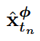


接下来就是target network了：


```python
# 20.4.12. Get target LCM prediction on x_prev, w, c, t_n
with torch.no_grad():
    with torch.autocast("cuda", dtype=weight_dtype):
        target_noise_pred = target_unet(
            x_prev.float(), # 吃x_prev，一模一样
            timesteps, # 吃timesteps，一模一样
            timestep_cond=w_embedding,
            encoder_hidden_states=prompt_embeds.float(),
        ).sample
        pred_x_0 = predicted_origin(  # 这个predicted_origin其实就是我们的f_theta^-()函数
            target_noise_pred,
            timesteps,
            x_prev,
            noise_scheduler.config.prediction_type,
            alpha_schedule,
            sigma_schedule,
        )
        target = c_skip * x_prev + c_out * pred_x_0  # 一样走skip connection的逻辑
```


损失函数？正确！

```python
# 20.4.13. Calculate loss
if args.loss_type == "l2":
    loss = F.mse_loss(model_pred.float(), target.float(), reduction="mean")
elif args.loss_type == "huber":
    loss = torch.mean(
        torch.sqrt((model_pred.float() - target.float()) ** 2 + args.huber_c**2) - args.huber_c
    )
```

至此，我们已经完成了Consistency Model一致性模型的贡献、理论部分，并且和代码直接结合起来了，你看这个一致性模型像不像悖理？


