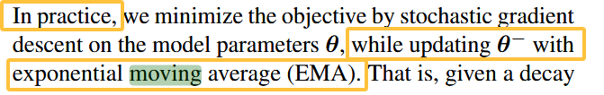
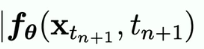

# 《MotionLCM》论文及代码相关

# 一、前置知识

## （1）Consistency Model的解读==（已完结，理解清楚）==

- 一致性模型CM的相关解读：https://neurips.cc/virtual/2023/75013

  

  


剩下的图不截了，去上面的链接里面找吧。


### 具体的理解（有所理解）

#### （a）一致性模型是什么？

先来看下面这张经典的SDE的图：


这个在其他的笔记中已经有所记录了，相当于是将Scored-based Model与DDPM做了统一，不妨来看下图：


简单来看，我们假设数据的真实分布符合左侧Data表示的两个gaussian分布，而forward SDE则是通过那些红色扰动的线（毕竟有朗之万动力学带来的随机性），将输入的pdata扰动最终成为纯gaussian noise（看上图最右，变成纯高斯噪声），而去噪的过程就是上面的Reverse SDE的过程，可以理解为走回来（**个人理解：所以生成的图跟原图会有不同，毕竟具备一定的随机性**）。这就是SDE的具体过程。

那么Probability flow ODE这篇文章的贡献在于什么呢？**注意看上图白色的线，PF ODE做的贡献相当于把随机性去掉了，变为常微分方程求解，可以看到白色的线是十分光滑的。**但显然这会造成生成质量的下降，不过会让生成的速度非常快，使用ODE 求解器可以直接解决step-by-step的生成过程。比如DDIMSolver（在LCM和MotionLCM中均有这个Solver）就是一个比较常见的ODE求解器。PF ODE的公式如下：


==务必需要注意的一点==：看起来PF ODE已经是用常微分方程去做模拟了，那难道PF ODE不能一步推理到位么？一致性模型是不是就是用来解决PF ODE没法一步推理到位的问题？

- 答案：**是的，PF ODE没有办法一步推理到位。PF ODE 是扩散模型（如DDPM）的确定性采样路径，它将扩散过程的随机轨迹转化为确定性轨迹（通过逆转SDE对应的ODE）。**PF ODE 的求解通常需要分步进行**，例如使用数值方法（如欧拉法、Runge-Kutta）逐步从噪声分布$x_T$ 迭代到目标数据 $x_0$。**
  - 关键点：
    - 每一步求解对应扩散过程的一个时间步，最终通过多步迭代逐步去噪。
    - 即使PF ODE是确定性的，仍需逐步逼近解，无法一步到位。

那么既然这样，一致性模型就可以诞生出来了，其作用就是**一步到位**，来看下面这张图：


==一致性模型的思路是这样的：==

- 我训练一个$f_\theta$函数（也就是一个神经网络），使得ODE所在曲线上的任意点都可以一步到位到$x_0$的位置，也就是data的数据（注意，**不是噪声，是数据分布，抑或是编码到latent space中的数据分布**）

也就是说，有如下的目标：
$$
f_\theta(x_t, t)=x_0
$$
同时，我们可以为这个一致性模型添加两个条件：

- 第一个条件：至少$x_0$经过一致性模型解算后得完整输出$x_0$吧，即$f_\theta(x_0, 0) = x_0$.
- 第二个条件：由于我们想用一致性模型去拟合整个ODE Trajectories，因此还得保证曲线上任意两点的$f_\theta$结果是一样的，都是来到曲线的起点，即：

$$
\forall t,t' \in [0, T]: f_\theta(x_t, t) = f_\theta(x_t', t') = x_0
$$

> 再确认一下：一致性模型输出的是原始图像，也就是$x_0$，下图来自原作者的slides：
>
> 

一致性模型既支持单步生成，也支持多步生成，区别如下：


对于单步生成来说，直接对于某一个timestep的$X_T$求解即可拿到生成的结果:$f_\theta(x_T, T) = x_0$.对于多步生成来说，看上图，可以不断给一致性模型预测的$x_0$加噪声，然后再进行预测，以促使迭代式的生成，让结果更好。==一致性模型是同时支持单步生成与多步生成的。== 


#### （b）一致性模型如何控制边界条件？

直接看下图：


这个公式乍一看有一些迷茫，但我们可以这样想，根据前面的介绍，在t=0的时候，我们希望$f_\theta(x_t, t)=x_0$。那么此时$c_{skip}$应该尽可能的大，甚至一开始为1，而此时的$c_{cout}=0$，意味着最终采用的结果完全是x，即原图。而如果采样的随机的T非常大，那么就会倾向于更使用模型（UNet）预测的结果$F_\theta(x_t, t)$的结果。

上图的公式中的$x$指的是某一个时刻的$x_t$，这一点**不要搞错。**再看上图左侧，是不是觉得很像ResNet的感觉？==所以这种策略也即Skip connection的策略。==同时上图也说明了在一些其他的diffusion model中也有类似地思路，比如EDM， v-prediction等。


#### （c）训练的过程到底是怎么回事？

这里我们就来彻底剖析一下训练的过程是什么。目标是搞懂下面这张图：


- （1）首先，我们有一个预训练好的score model：$s_\phi(x, t)$,这里的x应该指的是某个时刻的$x_t$。

- （2）接着，我们选择一个随机的时刻$t_{n+1}$，然后扰动data生成$X_{t_{n+1}}$.

- （3）执行一步的ODE step：将time step $t_{n+1}$更新到$t_n$，回忆前面有介绍PF ODE也是需要迭代求解的。这一步就是下面这句：
- 

上式结果应该$\approx x_{t_n}$。根据Algorithm的介绍，$\Phi$是ODE Solver，在后面的代码中就是比如DDIM Solver。而使用ODE求解器更新的逻辑就是上面这个公式。

> 证据见原文：
>
> 
>
> $\phi$应该指的是ODE Solver中的一些参数。

- （4）接下来就是下面这个公式了：
- 

d（·,·）指的是损失函数，一般来说比如用L2损失或者其他的损失函数（比如LPIPS），而$\lambda(t_n)$则是一个权重函数，重要的是**$f_\theta$和$f_\theta^-$**分别指的是什么？根据论文的原文，$\theta^-$指的是过去的$\theta$的running average，这就要引出EMA来了。再来回顾一下：


灰色框框出来的东西是ODE 求解器对teacher network求解一步得到的结果。而$f_{\theta^-}$（带减号！）这一项则是==target network==，作者的介绍：



而前面的$f_\theta$项则是student network。


### 趁热打铁，来看训练代码

这部分中，我们会把训练代码和上面的理论部分完全对应起来，以此论证确实有理解CM的这套理论。具体的代码在这里，可以结合整体进行阅读：

https://github1s.com/luosiallen/latent-consistency-model/blob/main/LCM_Training_Script/consistency_distillation/train_lcm_distill_sd_wds.py#L1099-L1100

一开始，先是把image通过VAE编码到latent space中，这里没什么可说的，然后是这一段：

```python
# Sample a random timestep for each image t_n ~ U[0, N - k - 1] without bias.
topk = noise_scheduler.config.num_train_timesteps // args.num_ddim_timesteps
index = torch.randint(0, args.num_ddim_timesteps, (bsz,), device=latents.device).long()
start_timesteps = solver.ddim_timesteps[index] # t_{n+1}
timesteps = start_timesteps - topk # t_{n}
timesteps = torch.where(timesteps < 0, torch.zeros_like(timesteps), timesteps)
```

这里的`start_timesteps`应当对应前面的$t_{n+1}$,而`timesteps`则是`start_timesteps - topk`,意味着应该指的是$t_n$时刻，topk是一个时间桶的时间，取决于每一步去噪要走多大的步长（看代码，这与`num_ddim_timesteps`有关，毕竟DDIM本身就是ODE Solver，要按照ODE Solver的迭代式求解结果来对齐）。==后面的分析需要牢牢对应上面的公式，笔记中也会给出。==

python接下来是$c_{skip}$和$c_{out}$这两个变量的设置：
```python
# 20.4.4. Get boundary scalings for start_timesteps and (end) timesteps.
c_skip_start, c_out_start = scalings_for_boundary_conditions(start_timesteps)
c_skip_start, c_out_start = [append_dims(x, latents.ndim) for x in [c_skip_start, c_out_start]]
c_skip, c_out = scalings_for_boundary_conditions(timesteps)
c_skip, c_out = [append_dims(x, latents.ndim) for x in [c_skip, c_out]]
```

不用管具体的逻辑是什么，==所有使用CM/LCM的工程反正都没改过这段。==


接下来我们先来看看student network会输出什么：




```python
# 20.4.5. Add noise to the latents according to the noise magnitude at each timestep
# (this is the forward diffusion process) [z_{t_{n + k}} in Algorithm 1]
noisy_model_input = noise_scheduler.add_noise(latents, noise, start_timesteps) # x_{t_{n+1}}

# 20.4.6. Sample a random guidance scale w from U[w_min, w_max] and embed it
w = (args.w_max - args.w_min) * torch.rand((bsz,)) + args.w_min
w_embedding = guidance_scale_embedding(w, embedding_dim=args.unet_time_cond_proj_dim)
w = w.reshape(bsz, 1, 1, 1)
# Move to U-Net device and dtype
w = w.to(device=latents.device, dtype=latents.dtype)
w_embedding = w_embedding.to(device=latents.device, dtype=latents.dtype)

# 20.4.8. Prepare prompt embeds and unet_added_conditions
prompt_embeds = encoded_text.pop("prompt_embeds")

# 20.4.9. Get online LCM prediction on z_{t_{n + k}}, w, c, t_{n + k}
noise_pred = unet( # F_theta网络
    noisy_model_input,
    start_timesteps,
    timestep_cond=w_embedding,
    encoder_hidden_states=prompt_embeds.float(),
    added_cond_kwargs=encoded_text,
).sample

pred_x_0 = predicted_origin(
    noise_pred,
    start_timesteps,
    noisy_model_input,
    noise_scheduler.config.prediction_type,
    alpha_schedule,
    sigma_schedule,
)

model_pred = c_skip_start * noisy_model_input + c_out_start * pred_x_0 
```

注意，这里的`noisy_model_input`即上面公式中的$x$，其实就是$x_t$，一张有噪声的图，而`pred_x_0`其实就是$F_\theta(x,t)$，也没有问题，喂进去的时间戳是`start_timesteps`，跟上面的公式也是完美匹配的。


来看看教师网络做了什么吧：


应该是用ODE求解器求解一步，那么是不是这样呢？

```python
# 20.4.10. Use the ODE solver to predict the kth step in the augmented PF-ODE trajectory after
# noisy_latents with both the conditioning embedding c and unconditional embedding 0
# Get teacher model prediction on noisy_latents and conditional embedding
with torch.no_grad():
    with torch.autocast("cuda"):
        cond_teacher_output = teacher_unet(
            noisy_model_input.to(weight_dtype),
            start_timesteps,
            encoder_hidden_states=prompt_embeds.to(weight_dtype),
        ).sample
        cond_pred_x0 = predicted_origin(
            cond_teacher_output,
            start_timesteps,
            noisy_model_input,
            noise_scheduler.config.prediction_type,
            alpha_schedule,
            sigma_schedule,
        )

        # Get teacher model prediction on noisy_latents and unconditional embedding
        uncond_teacher_output = teacher_unet(
            noisy_model_input.to(weight_dtype),
            start_timesteps,
            encoder_hidden_states=uncond_prompt_embeds.to(weight_dtype),
        ).sample
        uncond_pred_x0 = predicted_origin(
            uncond_teacher_output,
            start_timesteps,
            noisy_model_input,
            noise_scheduler.config.prediction_type,
            alpha_schedule,
            sigma_schedule,
        )

        # 20.4.11. Perform "CFG" to get x_prev estimate (using the LCM paper's CFG formulation)
        pred_x0 = cond_pred_x0 + w * (cond_pred_x0 - uncond_pred_x0)
        pred_noise = cond_teacher_output + w * (cond_teacher_output - uncond_teacher_output)
        x_prev = solver.ddim_step(pred_x0, pred_noise, index)
```

一看，喂进去的时间戳都是`start_timesteps`，好的不得了，输出的`x_prev`应该就是公式当中的


接下来就是target network了：


```python
# 20.4.12. Get target LCM prediction on x_prev, w, c, t_n
with torch.no_grad():
    with torch.autocast("cuda", dtype=weight_dtype):
        target_noise_pred = target_unet(
            x_prev.float(), # 吃x_prev，一模一样
            timesteps, # 吃timesteps，一模一样
            timestep_cond=w_embedding,
            encoder_hidden_states=prompt_embeds.float(),
        ).sample
        pred_x_0 = predicted_origin(  # 这个predicted_origin其实就是我们的f_theta^-()函数
            target_noise_pred,
            timesteps,
            x_prev,
            noise_scheduler.config.prediction_type,
            alpha_schedule,
            sigma_schedule,
        )
        target = c_skip * x_prev + c_out * pred_x_0  # 一样走skip connection的逻辑
```


损失函数？正确！

```python
# 20.4.13. Calculate loss
if args.loss_type == "l2":
    loss = F.mse_loss(model_pred.float(), target.float(), reduction="mean")
elif args.loss_type == "huber":
    loss = torch.mean(
        torch.sqrt((model_pred.float() - target.float()) ** 2 + args.huber_c**2) - args.huber_c
    )
```

至此，我们已经完成了Consistency Model一致性模型的贡献、理论部分，并且和代码直接结合起来了，你看这个一致性模型像不像悖理？


## （2）HumanML3D数据集的介绍

主要来自于Deepseek生成的结果，但有根据论文的原文进行验证：《Generating Diverse and Natural 3D Human Motions from Text》。==回顾论文的时候重点阅读第四部分：Our HumanML3D dataset。==

> ### **HumanML3D 数据集详细介绍**  
>
> **HumanML3D** 是由 **Guo et al. (2022a)** 提出的一个 **单人人运动-文本对齐数据集**，旨在为 **文本驱动的运动生成（Text-to-Motion）** 任务提供高质量的数据支持。该数据集不仅包含丰富的运动序列，还提供了详细的自然语言描述，并引入了一种 **高效的运动表示方法**，使其适用于基于神经网络的运动生成任务。  
>
> ---
>
> ## **1. 数据集概述**  
> ### **（1）数据来源**  
> HumanML3D 整合了多个现有的运动捕捉数据集，包括：  
> - **AMASS**（大规模人体运动数据集）  
> - **HumanAct12**（动作分类数据集）  
> - **UESTC**（带文本标注的运动数据集）  
> - **其他公开可用的运动数据**  
>
> 通过筛选和重新标注，HumanML3D 最终包含 **14,616 条运动序列**，涵盖 **广泛的日常动作类别**（如行走、跑步、跳舞、跳跃等）。  
>
> HumanML3D的制作过程：
>
> 
>
> ### **（2）文本标注**  
> - **每条运动序列** 都配有 **1~5 条自然语言描述**，总计 **44,970 条文本标注**。  
> - 标注内容涵盖 **动作类型、==速度、方向、情感风格==** 等细节，例如：  （==有情感风格，感觉这里面可以有说法。==）
>   - *"A person walks forward slowly with arms swinging."*  
>   - *"Someone jumps up energetically and lands softly."*  
>
> ---
>
> ## **2. 运动表示方法（Key Contribution）**  
> HumanML3D 提出了一种 **高效的运动表示（Motion Representation）**，具有以下特点：  
>
> 
>
> ==务必注意是在哪个空间当中的。例如joints都是在root space当中的。==


# 二、论文全文精髓提炼

近期，**==一致性模型==**[44,62]在图像生成领域取得重大突破，仅需**4步采样**（传统扩散模型需50步）即可实现高效高保真生成。这一特性与我们的目标高度契合——**在不损失质量的前提下加速运动生成**。因此，我们提出==基于运动潜在扩散模型MLD[9]蒸馏得到的**MotionLCM（运动潜在一致性模型）**==，首次将一致性蒸馏技术引入运动生成领域，通过**潜在一致性蒸馏**[44]实现实时级生成速度。  

**核心挑战与创新**  
在MotionLCM中，我们面临**潜在空间时空信号控制**的新挑战：  

1. **控制信号融合难题**：传统方法[56,73]在原始运动空间直接操作去噪过程，但MotionLCM的潜在空间缺乏明确运动语义，无法直接响应控制信号（如初始动作）。  
2. **双重监督方案**：  
   - 引入**运动ControlNet**实现潜在空间控制（受控图像生成[55,82]启发）  
   - 通过冻结VAE解码器[30]将预测潜在变量还原至原始运动空间，提供**显式运动监督**  
3. **效率优势转化**：MotionLCM的**单步推理能力**显著提升了ControlNet训练时潜在空间与运动空间的监督效率，较MLD[9]有质的飞跃。  

**技术贡献**  

1. **实时生成突破**：通过运动潜在扩散模型的一致性蒸馏，首次实现**实时级可控运动生成**  
2. **控制能力创新**：提出**运动ControlNet架构**，支持潜在空间高质量可控生成  
3. **全面性能平衡**：实验证明MotionLCM在生成质量、控制能力和实时效率上达到最佳平衡  


==相关研究部分可以参考《MotionLCM：实时动作生成与控制模型.md》这篇笔记。==


## 1.Method

### （1）一致性蒸馏


本节我们重点关注上图左上角的蓝框中的部分，这根上一节的知识是可以串起来的。这里的一个问题是动作序列是怎么编码的？（==LCM这篇工作是做在图像域上的，那么动作序列肯定也要编码成为类似图像的tensor，然后通过VAE编码到latent space，这就是本节的重点内容。==）

这部分对应论文的3.2节，以下是3.2节的重点说明。


### （2）论文3.2节：

**运动压缩至潜在空间**  
受[44,62]启发，我们提出**MotionLCM（运动潜在一致性模型）**，旨在==解决运动扩散模型[65,83]的低效问题==，释放LCM在运动生成任务中的潜力。与MLD[9]类似，MotionLCM在运动潜在空间中构建一致性模型，==并选择MLD[9]作为待蒸馏的底层扩散模型。==**核心目标是在不损失运动质量的前提下实现少步（2∼4步）甚至单步推理**。==在MLD中，首先训练自编码器（$\xi$, D）将高维运动压缩为低维潜在向量**z = E(x)**，再通过解码器重建运动**x̂ = D(z)**。==**潜在空间训练扩散模型相比原始运动空间训练，显著降低计算资源消耗并加速推理**，因此我们将其作为一致性蒸馏的基础框架。


#### 怎么编码动作的？怎么train VAE的？

在MotionLCM的原文中是这么说的：


也就是说，想要知道VAE是如何编码高维的动作数据到latent space中的，就需要看MLD的原文：《Executing your Commands via Motion Diffusion in Latent Space》。这个在MLD论文的==3.Method部分当中。==

首先我们来翻译一下MLD的VAE相关部分：

> 为了高效生成符合期望条件输入的高质量和多样化的人类运动序列，并减少计算开销，我们提出在一个代表性且低维的运动潜在空间上进行扩散过程，从而得到基于运动潜在的扩散模型（MLD）用于条件人类运动合成。==该模型包含一个运动变分自编码器（VAE），用于学习多样化人类运动序列的代表性和低维潜在空间（具体细节见第3.1节）==，以及在此潜在空间中的条件扩散模型（具体细节见第3.2节和第3.3节）。
>
> conditions包括如下的内容：==action labels, textual descriptions, or even empty conditions.==
>
> - 输入条件包括动作标签、文本描述，甚至可以是空条件。具体而言，给定输入条件$c$（例如描述动作的句子$w^{1:N} = \{w^{i}\}_{i=1}^{N}$ [47]、预定义动作类别集合中的标签$a \in A$ [46]，或空条件$c = \emptyset $ [43, 77]），我们的MLD模型旨在以非确定性方式生成人体运动序列$\hat{x}^{1:L} = \{\hat{x}^{i}\}_{i=1}^{L}$，其中$L$表示运动长度（帧数）。==此处采用文献[17]的运动表示方法：结合3D关节旋转、位置、速度和足部接触状态。==
>
>   此外，我们提出运动编码器$\mathcal{E}$将运动序列$x^{1:L} = \{x^{i}\}_{i=1}^{L}$编码为潜在表示$z = \mathcal{E}(x^{1:L})$，并通过运动解码器$\mathcal{D}$将$z$解码回运动序列：
>   $$
>   \hat{x}^{1:L} = \mathcal{D}(z) = \mathcal{D}(\mathcal{E}(x^{1:L}))
>   $$
>
>   
>
>   
>
>   
>
>   我们基于Transformer架构[46]构建运动变分自编码器$\mathcal{V}$，它由Transformer编码器$\mathcal{E}$和解码器$\mathcal{D}$组成。==运动VAE $\mathcal{V} = \{\mathcal{E}, \mathcal{D}\}$的训练仅通过**均方误差损失（MSE）**和**KL散度损失**对运动序列$x^{1:L}$进行重建。==我们进一步通过long-skip connections[59]增强$\mathcal{E}$和$\mathcal{D}$的Transformer结构[70]，并移除了[46]中使用的动作偏差。编码器能够生成具有高信息密度的低维潜在空间，解码器则可有效将潜在表示重建为运动序列。
>
>   具体而言，==运动编码器$\mathcal{E}$的输入包括：==
>   - 可学习的分布标记（distribution tokens）
>   - 任意长度$L$的帧级运动特征$x^{1:L}$
>
>   这些分布标记被用作潜在空间$Z$的高斯分布参数$\mu$和$\sigma$，通过重参数化技术[30]生成潜在向量$z \in \mathbb{R}^{n \times d}$（其维度与[46]类似）。==运动解码器$\mathcal{D}$采用带交叉注意力机制的Transformer解码器架构：==
>
>   - 输入：$L$个零运动标记（queries）  
>   - 潜在向量$z \in \mathbb{R}^{n \times d}$（memory）  
>   - 输出：$L$帧的人体运动序列$\hat{x}^{1:L}$  
>
>   根据[47]，潜在空间$Z$和可变时长共同提升了运动多样性。(==both the latent space Z and variable durations help the model to produce more diverse motions.)==为进一步增强潜在表示，==我们在$\mathcal{E}$和$\mathcal{D}$中引入了长跳跃连接结构。==我们还通过**表4**分析了潜在维度对运动序列表示的影响。实验表明，我们的VAE模型具有更强的运动重建能力和更丰富的多样性（参见**表5**和**表6**）。更多架构和训练细节见补充材料。
>

看起来像是那么回事，我们来结合代码看一下train VAE的过程以及VAE的结构：

```bash
python -m train_vae --cfg configs/vae.yaml
```

上面论文部分比较常用的几篇工作：

- 【17】：《Generating Diverse and Natural 3D Human Motions from Text》，本篇论文中提及的运动表示方法包括3D关节旋转，位置，速度和足部接触状态。


train VAE中用到的VAE的架构：


这个架构介绍如下：

> 这个`MldVae`是一个基于Transformer架构的变分自编码器（VAE），用于动作生成任务（如HumanML3D数据集）。以下是其核心组件的详细解析：
>
> ---
>
> ### **1. 网络结构概览**
> - **输入**：动作序列（`[batch_size, nframes, nfeats]`，如`nfeats=263`）
> - **输出**：重建的动作序列 + 潜在空间分布
> - **核心流程**：
>   ```python
>   features → 编码器 → 潜在分布 → 采样 → 解码器 → 重建特征
>   ```
>
> ---
>
> ### **2. 关键组件分解**
>
> #### **(1) 潜在空间处理**
> ```python
> self.latent_size = latent_dim[0]  # 潜在变量数量（如16）
> self.latent_dim = latent_dim[-1]   # 每个潜在变量的维度（如256）
> ```
> - **潜在变量**：生成`latent_size`个256维向量，通过`mu/logvar`参数化正态分布。
> - **投影层**（可选）：
>   - `latent_pre/post`：调整潜在空间维度（当`hidden_dim != latent_dim[-1]`时启用）。
>
> #### **(2) 位置编码**
> ```python
> self.query_pos_encoder = build_position_encoding(...)  # 编码器/解码器的位置嵌入
> ```
> - 使用可学习的（`"learned"`）或正弦位置编码，增强时序信息。
>
> #### **(3) Transformer编码器**
> ```python
> encoder_layer = TransformerEncoderLayer(...)  # 标准Transformer层
> self.encoder = SkipTransformerEncoder(...)    # 带残差连接的堆叠编码器
> ```
> - **SkipTransformerEncoder**：每层添加残差连接，避免梯度消失。
> - **输入处理**：
>   - 动作特征通过`skel_embedding`线性投影到`latent_dim`维度。
>   - 拼接全局运动token（`global_motion_token`）作为条件信号。
>
> #### **(4) 潜在分布生成**
> ```python
> mu = dist[0:latent_size, ...]      # 均值
> logvar = dist[latent_size:, ...]   # 对数方差
> dist = Normal(mu, logvar.exp().pow(0.5))
> latent = dist.rsample()            # 重参数化采样
> ```
> - 从编码器输出中分离`mu/logvar`，构建高斯分布并采样。
>
> #### **(5) Transformer解码器**
> ```python
> self.decoder = SkipTransformerDecoder(...)  # 默认使用encoder-decoder架构
> ```
> - **两种模式**：
>   - `encoder_decoder`（默认）：解码器以潜在变量为`memory`，逐步生成动作序列。
>   - `all_encoder`：将潜在变量与空白查询拼接，统一用编码器结构处理。
>
> #### **(6) 输出层**
> ```python
> self.final_layer = nn.Linear(latent_dim, nfeats)  # 将输出投影回原始特征维度
> ```
> - 最终通过线性层重建`nfeats`维动作数据。
>
> ---
>
> ### **3. 前向传播流程**
>
> #### **编码阶段（`encode`）**
> 1. **特征嵌入**：`skel_embedding`将输入动作映射到隐藏维度。
> 2. **位置编码**：添加时序位置信息。
> 3. **Transformer编码**：通过编码器提取全局特征。
> 4. **潜在分布**：生成`mu/logvar`并采样潜在变量`z`。
>
> #### **解码阶段（`decode`）**
> 1. **潜在变量投影**：通过`latent_post`调整维度（若需要）。
> 2. **查询初始化**：创建全零查询序列（长度=`nframes`）。
> 3. **Transformer解码**：
>    - **encoder_decoder模式**：以潜在变量为`memory`，自回归生成动作。
>    - **all_encoder模式**：拼接潜在变量与查询，统一编码。
> 4. **重建动作**：`final_layer`输出重建特征，并掩码无效帧。
>
> ---
>
> ### **4. 关键设计亮点**
> - **全局运动token**：`global_motion_token`作为可学习的条件信号，引导生成全局一致的动作。
> - **残差连接**：`SkipTransformer`增强深层网络训练稳定性。
> - **灵活的架构**：支持纯编码器或编码器-解码器两种模式。
> - **掩码处理**：在输出层显式置零无效帧（`output[~mask.T] = 0`），确保生成质量。
>
> ---
>
> ### **5. 与动作生成的关联**
> - **输入/输出**：处理`nfeats=263`维的SMPL骨架动作数据（坐标+旋转+物理特征）。
> - **潜在空间**：通过VAE约束潜在变量，实现动作插值和可控生成。
> - **位置编码**：保留动作序列的时序关系，适合长序列生成。
>
> 如果需要更具体的某部分（如Transformer层的细节或训练逻辑），可以进一步深入探讨！


#### feats_to_joints函数的介绍

> ### **HumanML3D 数据集简介**
> HumanML3D 是一个用于 **文本到动作生成（Text-to-Motion）** 的大规模数据集，主要包含：
> 1. **动作数据**：基于 SMPL 人体模型的 3D 关节运动序列（22 个关节，`njoints=22`）。
> 2. **文本描述**：每个动作对应多个自然语言描述（如 "a person walks forward"）。
> 3. **特征表示**：
>    - **旋转 + 根位置（RIC）**：动作通常用 **旋转（Quaternion/6D）** + **根关节位置（Root Joint Position）** 表示。
>    - **标准化**：数据经过均值 (`mean`) 和标准差 (`std`) 归一化，便于训练。
>
> ---
>
> ### **`feats2joints` 函数的作用**
> 这个函数的核心目的是 **将标准化后的动作特征（`features`）还原为 3D 关节坐标（Joint Positions）**，具体步骤如下：
>
> #### **1. 反标准化（Denormalize）**
> ```python
> mean = torch.tensor(self.hparams['mean']).to(features)
> std = torch.tensor(self.hparams['std']).to(features)
> features = features * std + mean  # 恢复原始数值范围
> ```
> - **输入**：标准化后的动作特征（形状如 `[batch, seq_len, nfeats]`，`nfeats=263`）。
> - **操作**：通过数据集的均值 (`mean`) 和标准差 (`std`) 还原原始特征值。
>
> #### **2. 从 RIC 数据恢复关节坐标**
> 调用 `recover_from_ric(features, self.njoints)`，具体流程：
> 1. **提取根关节旋转和位置**：
>    ```python
>    r_rot_quat, r_pos = recover_root_rot_pos(data)  # 根关节的旋转（四元数）和位置（XZ平面）
>    ```
>    - 根关节（Root Joint，通常是盆骨）的旋转和位置是动作的全局参考系。
>
> 2. **提取局部关节位置**：
>    ```python
>    positions = data[..., 4:(joints_num - 1) * 3 + 4]  # 跳过前4维（根旋转+位置），取剩余关节的局部坐标
>    positions = positions.view(..., -1, 3)            # 重塑为 [..., joint_num-1, 3]（每个关节3D坐标）
>    ```
>    - 假设 `joints_num=22`，则提取 `21` 个非根关节的局部坐标。
>
> 3. **应用根旋转到局部关节**：
>    ```python
>    positions = qrot(qinv(r_rot_quat[..., None, :]), positions)  # 用根旋转的逆变换局部关节
>    ```
>    - `qrot` 是四元数旋转函数，将局部关节旋转到全局坐标系。
>
> 4. **添加根关节的 XZ 位移**：
>    ```python
>    positions[..., 0] += r_pos[..., 0:1]  # X轴位移
>    positions[..., 2] += r_pos[..., 2:3]  # Z轴位移
>    ```
>    - 根关节的 XZ 位置影响整体动作的全局平移（Y 轴通常固定）。
>
> 5. **合并根关节和局部关节**：
>    ```python
>    positions = torch.cat([r_pos.unsqueeze(-2), positions], dim=-2)  # 最终形状 [..., 22, 3]
>    ```
>    - 输出完整的 22 个关节的 3D 坐标。
>
> ---
>
> ### **为什么需要 `feats2joints`？**
> 1. **数据预处理逆操作**：  
>    - 训练时动作数据通常被标准化为均值为 0、方差为 1，生成后需还原为原始尺度。
> 2. **RIC → 3D Joints 的转换**：  
>    - 动作生成模型（如 VAE/Transformer）通常输出 RIC 格式的特征，但实际应用需要 3D 关节坐标。
> 3. **可视化与评估**：  
>    - 3D 关节坐标可直接用于渲染动作序列（如用 Blender 或 PyBullet）。
>
> ---
>
> ### **示例输入输出**
> - **输入** `features`：`[batch, seq_len, 263]`（标准化后的 RIC 特征）。
> - **输出**：`[batch, seq_len, 22, 3]`（22 个关节的 3D 坐标）。
>
> ---
>
> ### **补充说明**
> - **SMPL 骨架结构**：HumanML3D 使用 SMPL 的 22 关节拓扑，根关节（0号）控制全局平移和朝向。
> - **Y 轴处理**：代码中忽略 Y 轴位移（`r_pos[..., 1]`），因为多数动作数据集中高度变化较少。
>
> 如果需要进一步解释 RIC 格式或 SMPL 模型细节，可以继续探讨！


#### VAE的init函数介绍

> ```python
> logger.info(f"latent_dim: {cfg.model.latent_dim}") # 【16， 32】：定义VAE潜在空间（Latent Space）的维度，通常是多层结构。潜在空间越小，压缩率越高，但可能丢失细节；越大则生成多样性更强，但训练难度增加。
> logger.info(f"rec_feats_ratio: {self.rec_feats_ratio}, " # 特征重建权重
>             f"rec_joints_ratio: {self.rec_joints_ratio}, " # 关节坐标重建权重
>             f"rec_velocity_ratio: {self.rec_velocity_ratio}, " # 关节速度重建权重（未启用）
>             f"kl_ratio: {self.kl_ratio}") # KL散度权重
> logger.info(f"rec_feats_loss: {self.rec_feats_loss}, "
>             f"rec_joints_loss: {self.rec_joints_loss}, "
>             f"rec_velocity_loss: {self.rec_velocity_loss}")
> logger.info(f"mask_loss: {cfg.model.mask_loss}")
> ```
>
> 这些日志信息展示了动作生成任务中 **变分自编码器（VAE）** 的关键配置参数和损失函数设计。以下是逐项解析：
>
> ---
>
> ### **1. 潜在空间维度 (`latent_dim`)**
> ```python
> latent_dim: [16, 32]
> ```
> - **作用**：定义VAE潜在空间（Latent Space）的维度，通常是多层结构。  
> - **解读**：  
>   - 第一层潜在维度为16，第二层为32（可能是分层VAE或渐进式编码）。  
>   - 潜在空间越小，压缩率越高，但可能丢失细节；越大则生成多样性更强，但训练难度增加。
>
> ---
>
> ### **2. 损失函数权重比率**
> ```python
> rec_feats_ratio: 1.0,     # 特征重建权重
> rec_joints_ratio: 1.0,    # 关节坐标重建权重
> rec_velocity_ratio: 0.0,  # 关节速度重建权重（未启用）
> kl_ratio: 0.0001         # KL散度权重
> ```
> - **作用**：平衡不同损失项的重要性，防止某一项主导训练。  
> - **关键点**：  
>   - **KL散度权重极低（0.0001）**：  
>     这是VAE中控制潜在分布与标准正态分布（N(0,1)）对齐的项。极小的值意味着模型更偏向于**确定性自编码器（AE）**，弱化随机性生成，可能用于提升生成动作的稳定性。  
>   - **速度重建未启用（0.0）**：  
>     若需生成更平滑的动作，可启用速度损失（如设为0.1-0.5）。
>
> ---
>
> ### **3. 重建损失类型**
> ```python
> rec_feats_loss: l1_smooth,    # 特征重建损失
> rec_joints_loss: l1_smooth,   # 关节坐标重建损失
> rec_velocity_loss: l1_smooth  # 速度重建损失（未启用）
> ```
> - **`l1_smooth`（Smooth L1 Loss）**：  
>   结合L1和L2损失的优点，对异常值更鲁棒，公式为：
>   $$
>   \text{loss}(x, y) = \begin{cases} 
>   0.5 (x - y)^2 & \text{if } |x - y| < 1 \\
>   |x - y| - 0.5 & \text{otherwise}
>   \end{cases}
>   $$
>   
>   - **优势**：在动作生成中，能平衡关节位置误差和运动连续性。
>
> ---
>
> ### **4. 掩码损失 (`mask_loss`)**
> ```python
> mask_loss: True
> ```
> - **作用**：处理变长动作序列时，对无效时间步（Padding部分）的损失进行掩码。  
> - **意义**：  
>   - 避免填充部分干扰模型训练，仅计算有效动作帧的重建误差。  
>   - 典型场景：批处理时序列长度不一致，需填充至相同长度。
>
> ---
>
> ### **总结：该VAE的设计特点**
> 1. **偏向确定性生成**：极低的KL散度权重让模型更接近AE，生成动作更稳定但多样性可能受限。  
> 2. **多粒度重建监督**：同时优化特征（如旋转、速度）和关节坐标，提升生成质量。  
> 3. **工业界常见配置**：  
>    - `l1_smooth`损失和掩码处理是动作生成的经典选择。  
>    - 潜在空间分层设计（16→32）适合复杂动作建模。
>
> ---
>
> ### **与动作生成任务的关联**
> - **特征重建 (`rec_feats`)**：确保生成动作的旋转/速度等参数符合物理规律。  
> - **关节重建 (`rec_joints`)**：直接约束3D关节位置，避免骨骼变形。  
> - **KL散度**：若需增加多样性，可适当提高`kl_ratio`（如0.001-0.01）。
>
> 如果需要具体损失函数的实现代码或训练策略细节，可以进一步探讨！


#### 评估指标都需要哪些变量？

> ```python
> rs_set = {
>     "m_ref": feats_ref,
>     "m_rst": feats_rst,
>     "m_ref_ori": feats_ref_ori,
>     "m_rst_ori": feats_rst_ori,
>     "lat_t": text_emb,
>     "lat_m": gt_emb,
>     "lat_rm": recons_emb,
>     "joints_ref": joints_ref,
>     "joints_rst": joints_rst
> }
> ```
>
> 在给定的代码中，`rs_set` 是一个字典，用于存储评估过程中生成的各种中间结果和最终输出。以下是 `rs_set` 中各个键的详细解释：
>
> ---
>
> ### **1. `m_ref` 和 `m_rst`**
> - **含义**：经过归一化（`renorm4t2m`）后的参考运动特征（真实数据）和重建运动特征（模型生成）。
> - **用途**：用于与文本嵌入计算相似度（如 Text-to-Motion 评估中的 R-Precision 指标）。
> - **形状**：`(batch_size, motion_length, feature_dim)`，其中 `feature_dim` 是运动特征的维度（可能包含位置、速度等信息）。
>
> ---
>
> ### **2. `m_ref_ori` 和 `m_rst_ori`**
> - **含义**：原始参考运动特征和重建运动特征（未经过归一化）。
> - **用途**：用于计算运动重建的损失（如关节位置误差），或可视化原始运动。
> - **区别**：与 `m_ref`/`m_rst` 的区别在于是否经过归一化（`renorm4t2m`）。
>
> ---
>
> ### **3. `lat_t` (Text Embedding)**
> - **含义**：通过文本编码器（`t2m_textencoder`）生成的文本嵌入。
> - **来源**：输入文本的词嵌入（`word_embs`）和位置编码（`pos_ohot`）。
> - **用途**：用于计算文本与运动之间的跨模态相似度（如 Text-to-Motion 的匹配分数）。
>
> ---
>
> ### **4. `lat_m` (Ground Truth Motion Embedding)**
> - **含义**：真实运动通过 T2M 运动编码器（`t2m_motionencoder`）生成的嵌入。
> - **来源**：对真实运动特征（`feats_ref`）先经过 `t2m_moveencoder` 提取运动特征，再通过 `t2m_motionencoder` 编码。
> - **用途**：作为真实运动的隐空间表示，用于计算重建质量（如 FID 或 Diversity）。
>
> ---
>
> ### **5. `lat_rm` (Reconstructed Motion Embedding)**
> - **含义**：重建运动通过相同 T2M 运动编码器生成的嵌入。
> - **来源**：对模型生成的 `feats_rst` 进行与 `lat_m` 相同的编码流程。
> - **用途**：与 `lat_m` 比较以评估重建质量（如相似度误差）。
>
> ---
>
> ### **6. `joints_ref` 和 `joints_rst`**
> - **含义**：从运动特征（`feats_ref_ori` 和 `feats_rst_ori`）还原的关节位置。
> - **生成方式**：通过 `feats2joints` 方法将运动特征转换为关节坐标。
> - **用途**：用于计算关节级别的误差（如 MPJPE），或可视化运动。
>
> ---
>
> ### **总结**
> `rs_set` 是一个包含以下内容的字典：
> 1. **运动特征**：归一化后的（`m_ref`, `m_rst`）和原始的（`m_ref_ori`, `m_rst_ori`）。
> 2. **嵌入表示**：文本嵌入（`lat_t`）、真实运动嵌入（`lat_m`）、重建运动嵌入（`lat_rm`）。
> 3. **关节数据**：真实和重建的关节位置（`joints_ref`, `joints_rst`）。
>
> 这些数据用于后续的评估指标计算，例如：
> - **重建质量**：通过 `lat_m` 和 `lat_rm` 的相似度。
> - **跨模态匹配**：通过 `lat_t` 和 `lat_rm` 的相似度（R-Precision）。
> - **运动误差**：通过 `joints_ref` 和 `joints_rst` 的差异。
>
> 通过返回这些中间结果，代码可以灵活支持多种评估任务（如 Text-to-Motion 生成、运动重建等）。


#### 评估指标都有哪些？class TM2TMetrics(Metric):

> 这段代码定义了一个名为 `TM2TMetrics` 的评估类，用于计算 **Text-to-Motion（文本到动作生成）** 任务中的多个关键指标。以下是这些评估指标的详细解释：
>
> ---
>
> ## **1. Matching Scores（匹配分数）**
> ### **(1) R-Precision (Top-K)**
> - **作用**：衡量生成的 motion 与输入文本的匹配程度。  
> - **计算方法**：  
>   1. 将文本嵌入（`text_embeddings`）和动作嵌入（`motion_embeddings`）计算欧氏距离矩阵。  
>   2. 对每个文本，选择距离最近的 `top_k` 个动作，计算命中率（即真实匹配是否在前 `k` 个结果中）。  
>   3. 最终计算所有样本的平均命中率。  
> - **指标名称**：  
>   - `R_precision_top_1`、`R_precision_top_2`、`R_precision_top_3`（默认 `top_k=3`）  
>   - `gt_R_precision_top_k`（真实 motion 与文本的匹配分数，作为基准）  
>
> ### **(2) Matching Score**
> - **作用**：衡量生成 motion 与文本的平均匹配距离（越小越好）。  
> - **计算方法**：  
>   - 计算所有 `(text, motion)` 对的欧氏距离，并取平均。  
> - **指标名称**：  
>   - `Matching_score`（生成 motion 的匹配分数）  
>   - `gt_Matching_score`（真实 motion 的匹配分数，作为基准）  
>
> ---
>
> ## **2. FID (Frechet Inception Distance)**
> - **作用**：衡量生成 motion 与真实 motion 在特征空间中的分布相似度（越小越好）。  
> - **计算方法**：  
>   1. 计算生成 motion 和真实 motion 的嵌入（`recmotion_embeddings` 和 `gtmotion_embeddings`）的均值（`mu`）和协方差（`cov`）。  
>   2. 使用 Frechet 距离公式计算两个分布的距离。  
> - **指标名称**：`FID`  
>
> ---
>
> ## **3. Diversity（多样性）**
> - **作用**：衡量生成 motion 的多样性（越高越好）。  
> - **计算方法**：  
>   1. 随机采样 `diversity_times`（默认 300）对 motion 嵌入。  
>   2. 计算它们之间的平均欧氏距离。  
> - **指标名称**：  
>   - `Diversity`（生成 motion 的多样性）  
>   - `gt_Diversity`（真实 motion 的多样性，作为基准）  
>
> ---
>
> ## **总结**
> | 指标类别      | 具体指标            | 作用                         | 理想情况 |
> | ------------- | ------------------- | ---------------------------- | -------- |
> | **Matching**  | `R_precision_top_k` | 文本与动作的匹配精度         | 越高越好 |
> |               | `Matching_score`    | 文本与动作的平均距离         | 越小越好 |
> | **FID**       | `FID`               | 生成动作与真实动作的分布差距 | 越小越好 |
> | **Diversity** | `Diversity`         | 生成动作的多样性             | 越高越好 |
>
> 这些指标共同评估 **生成动作的质量**（FID）、**与文本的匹配度**（R-Precision）、**动作的丰富性**（Diversity），是 Text-to-Motion 任务的核心评估标准。


## 2.评估指标详细介绍==（还没完结，后面需要整理）==

这里将会认真理解一下以下的这部分内容，并结合代码来看：


比较好结合阅读的代码是作者提供的`test.py`这个文件夹，里面就涉及到了各个不同种情况的评估指标，那么在train模型的各个模块的时候应当也是使用这些评估指标。==这部分我们就以test为例，看看具体的每个评估指标，并且分别介绍评估每个模块需要哪些指标。==


### （1）Time cost：

这个是比较简单的，也就是AITS，根据上图原文即可理解意思。


