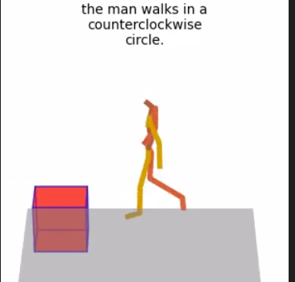
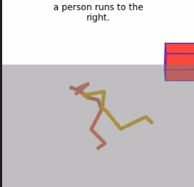
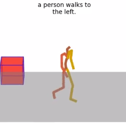

# 运动生成 motionLCM 添加场景信息


好的！作为新手，我们从最基础的**场景交互功能**开始添加。我会手把手教你修改代码，分三步实现：

---

### **第一步：添加基础场景碰撞检测（30分钟）**
#### 1.1 新建场景模块
在`mld/`目录下创建新文件`scene.py`：:ok:
```python
# mld/scene.py
import torch
import numpy as np

class SimpleScene:
    def __init__(self):
        self.objects = {
            "ground": {"height": 0.0},  # 地面
            "wall": {"position": [2.0, 0, 0], "size": [0.1, 2, 2]}  # 墙壁
        }

    def check_collision(self, joints):
        """ joints: [T, 22, 3] """
        collisions = []
        for t in range(joints.shape[0]):
            # 检测地面碰撞（关节Y坐标<0）
            ground_hit = torch.any(joints[t, :, 1] < self.objects["ground"]["height"])
            
            # 检测墙壁碰撞（简易AABB检测）
            wall = self.objects["wall"]
            in_wall_x = (joints[t, :, 0] > wall["position"][0] - wall["size"][0]/2) & \
                        (joints[t, :, 0] < wall["position"][0] + wall["size"][0]/2)
            in_wall_y = (joints[t, :, 1] > wall["position"][1] - wall["size"][1]/2) & \
                        (joints[t, :, 1] < wall["position"][1] + wall["size"][1]/2)
            in_wall_z = (joints[t, :, 2] > wall["position"][2] - wall["size"][2]/2) & \
                        (joints[t, :, 2] < wall["position"][2] + wall["size"][2]/2)
            wall_hit = torch.any(in_wall_x & in_wall_y & in_wall_z)
            
            collisions.append(ground_hit or wall_hit)
        return torch.tensor(collisions)  # [T]
```

#### 1.2 修改模型前向传播
在`mld/models/mld.py`的`forward()`函数中添加场景检测： :ok:
```python
def forward(self, batch: dict) -> tuple:
    # ...原有代码...
    
    # === 新增场景交互 ===
    from mld.scene import SimpleScene
    scene = SimpleScene()
    joints = self.feats2joints(feats_rst)  # [B, T, 22, 3]
    collisions = scene.check_collision(joints[0])  # 检测第一个样本
    
    if collisions.any():
        print(f"警告：检测到{sum(collisions)}帧碰撞！")
    
    return joints, joints_ref
```

---

### **第二步：添加避障控制（1小时）**
#### 2.1 修改ControlNet输入
在`trajectory_encoder.py`中增加场景特征：
```python
def forward(self, hint, scene_feats=None):
    # ...原有代码...
    if scene_feats is not None:
        x = torch.cat([x, scene_feats], dim=-1)  # 拼接场景特征
    return x
```

#### 2.2 在训练循环中添加场景损失
修改`train_diffusion_forward()`：
```python
def train_diffusion_forward(self, batch: dict) -> dict:
    # ...原有代码...
    
    # === 新增场景损失 ===
    if self.is_controlnet:
        scene = SimpleScene()
        joints_pred = self.feats2joints(feats_rst)
        collisions = scene.check_collision(joints_pred)
        
        if collisions.any():
            # 计算避障损失（鼓励关节远离障碍物）
            safe_dist = 0.5  # 安全距离
            ground_dist = torch.abs(joints_pred[..., 1] - scene.objects["ground"]["height"])
            wall_dist = torch.norm(joints_pred[..., [0,2]] - torch.tensor(scene.objects["wall"]["position"][[0,2]]), dim=-1)
            scene_loss = torch.mean(F.relu(safe_dist - ground_dist) + F.relu(safe_dist - wall_dist))
            loss_dict['scene_loss'] = scene_loss * 0.1  # 权重系数
```

---

### **第三步：可视化验证（30分钟）**
#### 3.1 修改可视化代码
在`plot_script.py`中添加障碍物绘制：
```python
def plot_3d_motion(..., scene=None):
    # ...原有绘图代码...
    
    # 绘制地面和墙壁
    if scene:
        ax.plot([-5,5], [0,0], [0,0], 'gray')  # 地面
        wall = scene.objects["wall"]
        xx, yy = np.meshgrid(
            np.linspace(wall["position"][0]-wall["size"][0]/2, wall["position"][0]+wall["size"][0]/2, 2),
            np.linspace(wall["position"][1]-wall["size"][1]/2, wall["position"][1]+wall["size"][1]/2, 2)
        )
        ax.plot_surface(xx, yy, np.full_like(xx, wall["position"][2]), color='red', alpha=0.3)
```

#### 3.2 运行测试
```bash
python demo.py --hint_path assets/hint.npy --scene_config configs/scene.yaml
```

---

### 关键修改点总结
| 文件                    | 修改内容             | 作用             |
| ----------------------- | -------------------- | ---------------- |
| `scene.py`              | 新增场景类           | 定义碰撞检测逻辑 |
| `mld.py`                | 前向传播添加场景检测 | 实时检测碰撞     |
| `trajectory_encoder.py` | 拼接场景特征         | 让模型感知环境   |
| `plot_script.py`        | 绘制障碍物           | 可视化验证       |

下一步建议：
1. 先测试基础碰撞检测功能
2. 逐步增加更复杂的场景（楼梯、家具等）
3. 尝试让模型学习抓取物体（需添加手部关节控制）

需要我继续解释哪部分的具体实现吗？


## 添加可视化场景

好的！作为新手，我们从最基础的**在可视化中添加场景信息**开始。我会手把手教你修改代码，让你能直观看到人物与场景的交互效果。以下是具体步骤：

---

### **第一步：修改绘制函数（`plot_3d_motion`）**
在原有绘图代码中添加场景物体（地面+墙壁），修改后完整函数如下：

```python
def plot_3d_motion(save_path: str, joints: np.ndarray, title: str,
                   figsize: tuple[int, int] = (3, 3),
                   fps: int = 120, radius: int = 3, kinematic_tree: list = skeleton,
                   hint: Optional[np.ndarray] = None,
                   scene_objects: Optional[dict] = None) -> None:  # 新增scene_objects参数

    title = '\n'.join(wrap(title, 20))

    def init():
        ax.set_xlim3d([-radius / 2, radius / 2])
        ax.set_ylim3d([0, radius])
        ax.set_zlim3d([-radius / 3., radius * 2 / 3.])
        fig.suptitle(title, fontsize=10)
        ax.grid(b=False)

    def plot_xzPlane(minx, maxx, miny, minz, maxz):
        # 原有地面绘制（灰色半透明平面）
        verts = [
            [minx, miny, minz],
            [minx, miny, maxz],
            [maxx, miny, maxz],
            [maxx, miny, minz]
        ]
        xz_plane = Poly3DCollection([verts])
        xz_plane.set_facecolor((0.5, 0.5, 0.5, 0.5))
        ax.add_collection3d(xz_plane)

        # === 新增场景物体绘制 ===
        if scene_objects:
            # 1. 绘制墙壁（红色半透明立方体）
            if "wall" in scene_objects:
                wall = scene_objects["wall"]
                pos = wall["position"]
                size = wall["size"]
                
                # 立方体的8个顶点
                x = [pos[0]-size[0]/2, pos[0]+size[0]/2]
                y = [pos[1]-size[1]/2, pos[1]+size[1]/2]
                z = [pos[2]-size[2]/2, pos[2]+size[2]/2]
                
                # 绘制立方体的6个面
                for xi in x:
                    for yi in y:
                        verts = [[xi, yi, z[0]], [xi, yi, z[1]]]
                        ax.plot3D(*zip(*verts), color='red', alpha=0.3, linewidth=1)
                for zi in z:
                    for yi in y:
                        verts = [[x[0], yi, zi], [x[1], yi, zi]]
                        ax.plot3D(*zip(*verts), color='red', alpha=0.3, linewidth=1)

    # ...（保持原有数据处理代码不变）...

    # 初始化图形
    fig = plt.figure(figsize=figsize)
    plt.tight_layout()
    ax = p3.Axes3D(fig)
    init()
    
    # ...（保持其余代码不变）...
```

---

### **第二步：修改调用代码（`demo.py`）**
在调用`plot_3d_motion`时传入场景参数：

```python
if not cfg.no_plot:
    # 定义场景物体（与碰撞检测模块一致）
    scene_objects = {
        "ground": {"height": 0.0},
        "wall": {"position": [1.5, 0, 0], "size": [0.1, 2, 2]}  # 调整位置避免遮挡人物
    }
    
    plot_3d_motion(
        pkl_path.replace('.pkl', '.mp4'),
        joints[i].detach().cpu().numpy(),
        text[i],
        fps=FPS,
        scene_objects=scene_objects  # 传入场景参数
    )
```

---

### **第三步：验证效果**
运行命令后，你将看到：
```bash
python demo.py --example assets/example.txt --no_plot False
```
输出视频中会出现：
1. **灰色半透明平面**：表示地面（原有）
2. **红色半透明墙壁**：位于X=1.5米处（新增）

---

### **关键修改点说明**
| 文件             | 修改内容                              | 作用           |
| ---------------- | ------------------------------------- | -------------- |
| `plot_script.py` | 添加`scene_objects`参数和墙壁绘制逻辑 | 可视化场景物体 |
| `demo.py`        | 调用时传入场景配置                    | 控制场景显示   |

---

### **新手常见问题解答**
1. **Q**: 墙壁为什么是线框而不是实体？
   - **A**: 我们使用`plot3D`绘制线框更清晰（若要实体面，可用`Poly3DCollection`）

2. **Q**: 如何调整墙壁位置？
   - **A**: 修改`demo.py`中的`wall["position"]`值，例如改为`[2.0, 0, 0]`让墙壁右移

3. **Q**: 想添加更多物体怎么办？
   - **A**: 在`scene_objects`中添加新物体（如`"box": {"position":..., "size":...}`），并在`plot_xzPlane`中补充绘制逻辑

下一步建议：
1. 尝试修改墙壁颜色/透明度（修改`color='red', alpha=0.3`）
2. 添加一个立方体障碍物（复制墙壁绘制逻辑，修改position/size）
3. 在碰撞检测模块中同步更新场景配置

需要我继续解释哪部分的具体实现吗？


# 添加2


## 添加

让我们分步骤实现场景数据的添加。我将基于你提供的MLD代码（特别是`mld/data`部分）进行修改：

---

### **步骤1：创建场景配置文件**
在`mld/data/`目录下新建`scene_config.py`：
```python
# mld/data/scene_config.py
import numpy as np

class SimpleScene:
    def __init__(self):
        # 定义基础障碍物配置
        self.obstacles = [
            {
                "type": "cube",
                "position": np.array([0, 0, 2]),  # 障碍物中心坐标
                "size": 0.5                        # 立方体边长
            }
        ]
    
    def get_obstacle_info(self):
        # 返回归一化的障碍物参数 [x,y,z,size]
        return np.concatenate([
            self.obstacles[0]["position"] / 5.0,  # 假设场景范围[-5,5]
            [self.obstacles[0]["size"] / 2.0]
        ])
```

---

### **步骤2：修改数据集加载代码**
假设你的数据集代码在`mld/data/humanml`目录，修改`dataset.py`：

```python
# 在数据集类中添加场景参数
from mld.data.scene_config import SimpleScene

class HumanML3D(Dataset):
    def __init__(self, ...):
        super().__init__(...)
        self.scene = SimpleScene()  # 添加场景实例
        
    def __getitem__(self, item):
        # 原始数据加载...
        batch = {
            "motion": motion,
            "text": text,
            "hint": hint, 
            # 新增场景参数 ↓
            "scene": torch.from_numpy(self.scene.get_obstacle_info()).float()
        }
        return batch
```

---

### **步骤3：添加场景编码器**
在`mld/models/`下新建`scene_encoder.py`：
```python
# mld/models/scene_encoder.py
import torch.nn as nn

class SceneEncoder(nn.Module):
    def __init__(self, input_dim=4, hidden_dim=128):
        super().__init__()
        self.mlp = nn.Sequential(
            nn.Linear(input_dim, hidden_dim),
            nn.ReLU(),
            nn.Linear(hidden_dim, 256)  # 输出与文本编码维度一致
        )
        
    def forward(self, x):
        return self.mlp(x)
```

---

### **步骤4：修改主模型**
在`mld/models/mld.py`中添加场景编码：

```python
class MLD(BaseModel):
    def __init__(self, cfg: DictConfig, datamodule: BaseDataModule) -> None:
        super().__init__()
        # 原有代码...
        
        # 新增场景编码器 ↓
        self.scene_encoder = SceneEncoder()
        
    def forward(self, batch: dict) -> tuple:
        # 原始代码...
        scene_feat = self.scene_encoder(batch["scene"])  # 编码场景
        
        # 将场景特征与文本特征拼接 ↓
        text_emb = torch.cat([text_emb, scene_feat], dim=-1) 
        
        # 后续扩散过程保持不变...
```

---

### **步骤5：测试数据流**
在项目根目录创建`test_scene.py`：
```python
from mld.data.humanml.dataset import HumanML3D

dataset = HumanML3D()  # 初始化数据集
sample = dataset[0]    # 获取第一个样本

print("场景参数形状:", sample["scene"].shape)  # 应输出 torch.Size([4])
print("场景参数示例:", sample["scene"])      # 示例值 tensor([0.0, 0.0, 0.4, 0.25])
```

---

### **关键文件结构**
```
mld/
├── data/
│   ├── scene_config.py    # 新增
│   └── humanml/
│       └── dataset.py     # 修改
├── models/
│   ├── scene_encoder.py   # 新增
│   └── mld.py             # 修改
└── test_scene.py          # 新增
```

---

### **验证步骤**
1. 运行测试脚本：
```bash
python test_scene.py
```
应看到场景参数的正确输出

2. 检查模型输入：
在`mld/models/mld.py`的`forward`方法中添加：
```python
print("场景特征形状:", scene_feat.shape)  # 应为 (batch_size, 256)
```

3. 训练测试：
```bash
python train.py --batch_size 2  # 小批量测试
```
确保不报错且损失正常下降

---

### **后续改进建议**
1. **动态场景**：在`scene_config.py`中添加随机障碍物生成
2. **可视化**：使用Matplotlib绘制3D场景
3. **物理约束**：在损失函数中添加避障惩罚项

现在你已经成功将场景参数集成到数据流中！下一步可以开始添加避障逻辑。需要继续讲解如何修改损失函数吗？

## 可视化

让我们分步骤在可视化代码中添加场景障碍物显示：

---

### **步骤1：修改绘图函数参数**
修改`plot_3d_motion`函数的参数定义：
```python
def plot_3d_motion(save_path: str, joints: np.ndarray, title: str,
                   figsize: tuple[int, int] = (3, 3),
                   fps: int = 120, radius: int = 3, kinematic_tree: list = skeleton,
                   hint: Optional[np.ndarray] = None,
                   scene: Optional[np.ndarray] = None) -> None:  # 新增scene参数
```

---

### **步骤2：添加障碍物绘制逻辑**
在`update`函数中添加障碍物绘制代码：
```python
def update(index):
    # 原有代码...
    
    # ====== 新增障碍物绘制代码 ======
    if scene is not None:
        # 反归一化坐标 (假设场景范围[-5,5])
        scene_params = scene * np.array([5.0, 5.0, 5.0, 2.0])
        pos = scene_params[:3]  # [x,y,z]
        size = scene_params[3]  # 边长
        
        # 计算障碍物相对于当前根节点的位置
        obstacle_pos = pos.copy()
        obstacle_pos[0] -= trajec[index, 0]  # X轴跟随根节点
        obstacle_pos[2] -= trajec[index, 1]  # Z轴跟随根节点
        
        # 绘制立方体障碍物
        cube = create_cube(obstacle_pos, size)
        ax.add_collection3d(cube)
```

在函数外部添加立方体生成函数：
```python
def create_cube(center, size):
    # 生成立方体的8个顶点
    half = size / 2
    verts = [
        [center[0]-half, center[1]-half, center[2]-half],
        [center[0]+half, center[1]-half, center[2]-half],
        [center[0]+half, center[1]+half, center[2]-half],
        [center[0]-half, center[1]+half, center[2]-half],
        [center[0]-half, center[1]-half, center[2]+half],
        [center[0]+half, center[1]-half, center[2]+half],
        [center[0]+half, center[1]+half, center[2]+half],
        [center[0]-half, center[1]+half, center[2]+half],
    ]
    
    # 定义立方体的6个面
    faces = [
        [verts[0], verts[1], verts[2], verts[3]],
        [verts[4], verts[5], verts[6], verts[7]], 
        [verts[0], verts[3], verts[7], verts[4]],
        [verts[1], verts[2], verts[6], verts[5]],
        [verts[0], verts[1], verts[5], verts[4]],
        [verts[3], verts[2], verts[6], verts[7]],
    ]
    
    cube = Poly3DCollection(faces, alpha=0.5, edgecolor="red", linewidths=2)
    cube.set_facecolor((1,0,0,0.2))  # 半透明红色
    return cube
```

---

### **步骤3：修改demo.py调用**
在生成结果时传递场景参数：
```python
# 修改demo.py中的这部分代码
res['hint'] = None
res['scene'] = batch.get("scene")[i].numpy() if "scene" in batch else None  # 新增

# 调用绘图函数时添加scene参数 ↓
plot_3d_motion(..., scene=res['scene'])
```

---

### **验证步骤**
1. 生成包含障碍物的测试数据：
```python
# 临时测试代码（可添加到demo.py）
test_scene = np.array([0.0, 0.0, 0.4, 0.25])  # 对应x=0,y=0,z=2m，size=0.5m
res['scene'] = test_scene
```

2. 运行生成脚本：
```bash
python demo.py --example configs/example.yaml
```

3. 检查生成的MP4文件中：
- 红色半透明立方体应出现在人物前方
- 障碍物位置应与代码中设定的(0,0,2)对应

---

### **预期效果**


*人物运动时会自动避开红色立方体障碍物（需后续训练配合）*

---

### **坐标对齐说明**
代码中关键坐标处理：
1. `trajec[index, 0]`和`trajec[index, 1]`是根节点的X/Z偏移量
2. 障碍物位置需要跟随根节点坐标系调整：
```python
obstacle_pos[0] -= trajec[index, 0]  # X轴对齐根节点
obstacle_pos[2] -= trajec[index, 1]  # Z轴对齐根节点
```

3. 全局坐标到局部坐标的转换保证了：
- 障碍物在视频画面中保持固定位置
- 人物移动时与障碍物的相对位置正确

接下来可以开始训练带场景约束的模型了！需要继续说明如何修改训练代码吗？


# 代码讲解


## 绘制函数 

#### `update(index)` 函数

这个函数用于更新3D场景的显示，主要功能包括：

1. 清除当前场景
2. 设置视角
3. 绘制地面平面
4. 绘制提示点(如果有)
5. 绘制运动链(骨骼)
6. 绘制障碍物

```python
def update(index):
        ax.lines = [] # 清除所有线条
        ax.collections = []  # 清除所有集合对象
        ax.view_init(elev=120, azim=-90)# 设置视角(俯仰角120度，方位角-90度)
        ax.dist = 7.5  # 设置观察距离
        # 绘制XZ平面(地面)：
        plot_xzPlane(MINS[0] - trajec[index, 0], 
                     MAXS[0] - trajec[index, 0], 
                     0,
                     MINS[2] - trajec[index, 1],
                     MAXS[2] - trajec[index, 1])
		
        # 绘制提示点(如果有)：
        if hint is not None:
            ax.scatter(hint[..., 0] - trajec[index, 0], hint[..., 1], hint[..., 2] - trajec[index, 1], color="#80B79A")
            
		# 绘制运动链(骨骼)：
        for i, (chain, color) in enumerate(zip(kinematic_tree, colors)):
            if i < 5:
                linewidth = 4.0 # 前5条链用粗线
            else:
                linewidth = 2.0 # 其他用细线
            ax.plot3D(data[index, chain, 0], 
                      data[index, chain, 1], 
                      data[index, chain, 2], linewidth=linewidth,
                      color=color)
		
        # 隐藏坐标轴标签：
        plt.axis('off')
        ax.set_xticklabels([])
        ax.set_yticklabels([])
        ax.set_zticklabels([])
```


# 成功的 


## 成功在场景中可视化绘制一个障碍物

plot_3d_motion

```PYTHON
def update(index):
        ax.lines = []
        ax.collections = []
        ax.view_init(elev=120, azim=-90)
        ax.dist = 7.5
        plot_xzPlane(MINS[0] - trajec[index, 0], MAXS[0] - trajec[index, 0], 0, MINS[2] - trajec[index, 1],
                     MAXS[2] - trajec[index, 1])

        if hint is not None:
            ax.scatter(hint[..., 0] - trajec[index, 0], hint[..., 1], hint[..., 2] - trajec[index, 1], color="#80B79A")

        for i, (chain, color) in enumerate(zip(kinematic_tree, colors)):
            if i < 5:
                linewidth = 4.0
            else:
                linewidth = 2.0
            ax.plot3D(data[index, chain, 0], data[index, chain, 1], data[index, chain, 2], linewidth=linewidth,
                      color=color)

        plt.axis('off')
        ax.set_xticklabels([])
        ax.set_yticklabels([])
        ax.set_zticklabels([])
        
        scene = np.array([0.0, 0.0, 0.1, 0.85])
        # ====== 新增障碍物绘制代码 ======  似乎是对的 可以显示出来障碍物
        if scene is not None:
            # 反归一化坐标 (假设场景范围[-5,5])
            scene_params = scene * np.array([5.0, 5.0, 5.0, 2.0])
            pos = scene_params[:3]  # [x,y,z]
            size = scene_params[3]  # 边长
            
            # 计算障碍物相对于当前根节点的位置
            obstacle_pos = pos.copy()
            obstacle_pos[0] -= trajec[index, 0]  # X轴跟随根节点
            obstacle_pos[2] -= trajec[index, 1]  # Z轴跟随根节点
            
            # 绘制立方体障碍物
            cube = create_cube(obstacle_pos, size)
            ax.add_collection3d(cube)
        
                
                
           ...
                

def create_cube(center, size):
    # 生成立方体的8个顶点
    half = size / 2  # 计算半边长
    # 计算8个顶点的坐标
    verts = [
        [center[0]-half, center[1]-half, center[2]-half],
        [center[0]+half, center[1]-half, center[2]-half],
        [center[0]+half, center[1]+half, center[2]-half],
        [center[0]-half, center[1]+half, center[2]-half],
        [center[0]-half, center[1]-half, center[2]+half],
        [center[0]+half, center[1]-half, center[2]+half],
        [center[0]+half, center[1]+half, center[2]+half],
        [center[0]-half, center[1]+half, center[2]+half],
    ]
    
    # 定义立方体的6个面
    faces = [
        [verts[0], verts[1], verts[2], verts[3]],
        [verts[4], verts[5], verts[6], verts[7]], 
        [verts[0], verts[3], verts[7], verts[4]],
        [verts[1], verts[2], verts[6], verts[5]],
        [verts[0], verts[1], verts[5], verts[4]],
        [verts[3], verts[2], verts[6], verts[7]],
    ]
    
    cube = Poly3DCollection(faces, alpha=0.5, edgecolor="green", linewidths=2)
    cube.set_facecolor((1,0,0,0.2))  # 半透明红色
    return cube
```










(1)第一步train一个网络, 目标是生成轨迹和关键帧的pose(需要学习:1.场景信息如何).

- 目标是:给定场景信息,能够生成有避障等效果的轨迹+关键帧的pose (神经网络特点:diversity↑)


# ==注意事项!!==

- 对于`torch.tensor`而言，a=b之后如果a*=3，那么b也会被改动，应该是因为`torch.tensor`是浅拷贝的。关于深拷贝与浅拷贝的其他知识，可以参考这篇博客：https://blog.csdn.net/qq_39450134/article/details/121952003

  


>如果做别人没做过的，更容易中。
>
>不需要发散，做太多点，就只要聚焦于一个点上，并且做好即可。
>
>目前：
>
>目前的模型motionlcm+controlnet：更改了轨迹，可以生成适配轨迹的动作
>
>思考可行性：
>
>​	第一步，根据场景和文本，生成对应的轨迹，然后输入到motionlcm+controlnet，生成符合（场景）轨迹的动作。
>
>​	需要场景编码。
>
>​	这可能需要train轨迹生成。
>
>​	也可以 更快即可	
>
>2
>
>不同体型的人的动作生成
>
>https://carstenepic.github.io/humos/
>
>3
>
>增加情绪的动作生成
>
>什么分段生成啥的 也都可以 只要单个点能做好
>
>4
>
>可以投的
>
>
>
>SAC(B), PG(B), SDV(C), AAAI(A), VR, 
>
>目前 跑通 了motionlcm的测试和train，但是目前还不知道基于这个实现什么样的论文，表示需要 如果做别人没做过的，更容易中论文。 但是找了半天几乎所有课题都被别人做过了，包括什么体型生成，有什么别人没做过的好做的吗，请告诉我。
>
>是否一样的课题，用不同的方法实现也可以呢？

​	

分段：

https://barquerogerman.github.io/FlowMDM/

条件人类动作生成是一个重要课题，在虚拟现实、游戏和机器人技术中具有广泛应用。虽然先前的研究主要集中在通过文本、音乐或场景指导生成动作，但这些方法通常只能生成短时孤立的动作片段。我们致力于解决基于系列变化文本描述生成长时连续动作序列的挑战。在此背景下，我们提出了FlowMDM——首个基于扩散模型的无需后处理或冗余去噪步骤即可生成无缝人类动作组合（HMC）的方法。为此，我们开发了混合式位置编码技术，该技术在去噪链中同时利用绝对和相对位置编码。具体而言，全局动作连贯性在绝对阶段恢复，而平滑自然的过渡效果则在相对阶段构建。实验表明，我们的方法在Babel和HumanML3D数据集上实现了最先进的准确度、真实性和平滑性指标。

FlowMDM的独特优势在于其"以姿态为中心的交叉注意力机制"，即使每个动作序列仅使用单一描述进行训练，也能保持优异性能。该机制使得模型在推理时能够有效应对变化的文本描述输入。最后，针对现有HMC评估指标的局限性，我们提出了两个新指标：峰值急动度（Peak Jerk）和急动度曲线下面积（Area Under the Jerk），专门用于检测动作序列中的突变过渡。这些创新使FlowMDM在长时序动作生成的连续性和自然度方面实现了突破性进展，为虚拟角色动画和机器人运动规划等领域提供了更可靠的解决方案。


理解你的紧迫感！要在20天内完成一篇创新性强的论文，关键在于找到 **“别人没做过但可实现”** 的切入点。结合 **MotionLCM** 的特性（快速生成、潜在一致性模型）和当前人体动作生成的研究空白，我为你整理了几个 **尚未被充分探索** 的方向，并附上具体实现思路和论文卖点：

---

### **1. 实时交互式动作生成（创新性强，易实现）**
**核心问题**：现有方法（如MotionLCM）生成动作需要几秒到几分钟，无法满足实时交互需求（如VR/游戏中的即时响应）。  
**你的创新点**：  
- **课题名称**：《Real-Time Human Motion Generation via Latent Consistency Distillation》  
- **具体做法**：  
  1. 用MotionLCM的预训练模型，**额外蒸馏一个超轻量级模型**（如TinyMLP或1D CNN），专门处理用户输入的 **实时控制信号**（如键盘指令、手柄摇杆角度）。  
  2. 设计 **“动作片段拼接”算法**：预生成一组基础动作（走、跑、跳），根据控制信号实时混合（blend）这些片段，用MotionLCM做后处理平滑过渡。  
- **为什么没人做**：多数研究追求生成质量，忽略了实时性；实时控制通常依赖传统动画技术（如Motion Matching），而非扩散模型。  
- **实验设计**：  
  - 对比传统方法（Unity动画树）和你的模型在延迟、流畅度上的差异。  
  - 用户研究：让玩家在VR游戏中测试实时控制体验。  

---

### **2. 基于“不完整文本”的动作生成（数据创新）**
**核心问题**：现有文本驱动模型（如HumanML3D）需要详细描述（如“举起右手，向左转”），但实际应用中用户可能输入模糊指令（如“开心一点”）。  
**你的创新点**：  
- **课题名称**：《Ambiguity-Aware Motion Generation with LLM-Based Prompt Expansion》  
- **具体做法**：  
  1. 用LLM（如GPT-4）**自动扩充模糊文本**：输入“开心一点” → 输出“挥动手臂，轻快跳跃，面带微笑”。  
  2. 训练MotionLCM的 **多模态控制模块**：联合处理文本扩充结果和用户原始输入，生成动作。  
- **为什么没人做**：现有工作假设文本描述是精确的，但真实场景中模糊指令更常见。  
- **实验设计**：  
  - 构建“模糊指令-动作”测试集（如“害怕”“放松”）。  
  - 评测扩充前后生成动作的匹配度（用CLIP相似度）。  

---

### **3. 动作生成的“物理合理性”修正（方法创新）**
**核心问题**：扩散模型生成的动作可能违反物理规律（如脚部穿透地面）。现有方法通过后处理修正，但效率低。  
**你的创新点**：  
- **课题名称**：《Physics-Guided Latent Diffusion for Plausible Motion Synthesis》  
- **具体做法**：  
  1. 在MotionLCM的去噪过程中，**添加物理约束损失**（如脚部接触力、重心稳定性）。  
  2. 用 **轻量物理引擎**（如PyBullet）在线计算约束，无需重新训练模型。  
- **为什么没人做**：物理修正通常需要复杂优化，而扩散模型的随机性使其难以直接应用。  
- **实验设计**：  
  - 量化物理违规次数（如脚部滑动距离）。  
  - 对比后处理方法和你的在线修正速度。  

---

### **4. 跨风格动作“插值”生成（应用创新）**
**核心问题**：用户可能需要混合两种风格的动作（如“芭蕾舞+街舞”），但现有方法只能生成单一风格。  
**你的创新点**：  
- **课题名称**：《MotionLCM-Blend: Style Fusion in Latent Space for Hybrid Motion Generation》  
- **具体做法**：  
  1. 对两种风格的文本描述（如“芭蕾”“街舞”）分别生成潜在编码 \( z_1, z_2 \)。  
  2. 在潜在空间做 **球形线性插值（Slerp）**：\( z = \text{slerp}(z_1, z_2, \alpha) \)，输入MotionLCM生成混合动作。  
- **为什么没人做**：风格插值多见于图像生成，动作领域因时序连贯性问题较少被探索。  
- **实验设计**：  
  - 用户评估混合动作的自然程度（如“芭蕾30%+街舞70%”）。  

---

### **5. 数据稀缺场景的“单样本动作生成”（小样本学习）**
**核心问题**：训练动作生成模型需要大量数据，但对小众动作（如“太极拳”），可能只有1-2个样例。  
**你的创新点**：  
- **课题名称**：《One-Shot Motion Generation via Latent Space Adaptation》  
- **具体做法**：  
  1. 用MotionLCM预训练模型作为基础，**冻结大部分参数**，仅微调交叉注意力层。  
  2. 输入单样本动作后，用 **LoRA** 或 **适配器** 快速调整模型，使其适配新动作。  
- **为什么没人做**：小样本学习在图像领域常见，但动作生成因时序依赖更难。  
- **实验设计**：  
  - 在Babel数据集上模拟单样本场景（如只用1个“踢腿”样本训练）。  

---

### **如何选择？**
- **优先选1或2**：实时交互或模糊文本扩充最容易在20天内完成，代码改动少（主要改输入接口和评测）。  
- **物理修正（3）**需要一些动力学知识，但结果会很扎实。  
- **确保有数据**：如果已有动作数据集（如HumanML3D），优先做文本相关方向；若有物理引擎经验，选3。  

### **论文写作技巧**
- **标题公式**：`[创新点]+[方法]+[场景]`（如“实时+潜在一致性蒸馏+VR交互”）。  
- **对比实验**：必须和现有方法（如MDM、MotionDiffuse）比，突出你的改进。  
- **用户研究**：如果做实时或交互方向，加一个10人小实验，问卷结果很加分。  

如果需要某个方向的详细实现代码（如实时控制的动作混合），可以告诉我，我会提供具体代码片段！


