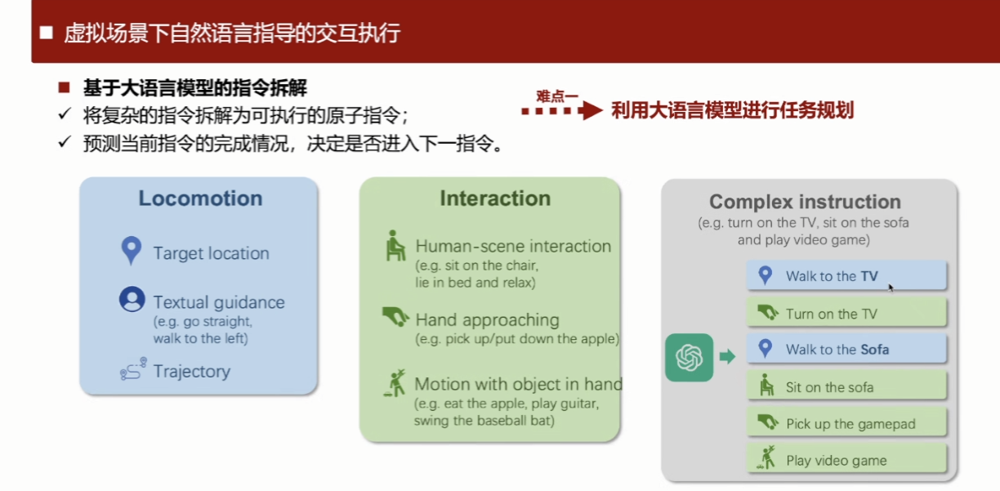
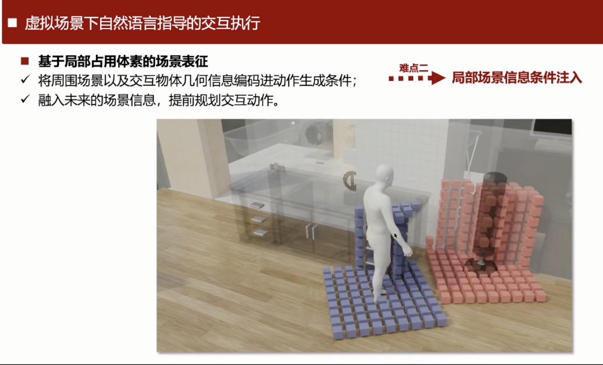
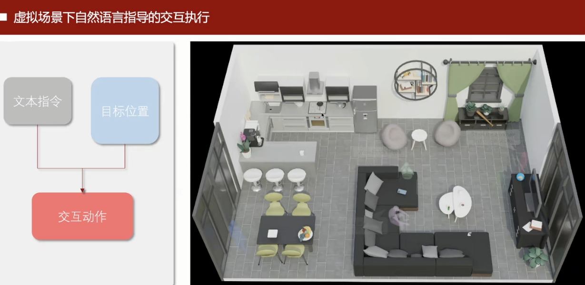

# Scaling Up Dynamic Human-Scene Interaction Modeling

CVPR 2024 (highlight)

https://www.ai.pku.edu.cn/info/1053/2984.htm

https://jnnan.github.io/trumans/

分享会议：https://event.baai.ac.cn/live/887

如果要用diffusion建模一小段动作 难度远小于 建模很长序列的动作

一般都是分段，如果比较长的序列

近日，北京大学人工智能研究院朱毅鑫助理教授团队与北京通用人工智能研究院黄思远研究员团队联合在CVPR2024会议上发表了题为“Scaling Up Dynamic Human-Scene Interaction Modeling”的论文。

该研究聚焦于人与场景交互的动作生成问题，在建模、方法和训练数据方面均有创新贡献。

作者们提出了一种使用**自回归条件扩散模型的动作生成框架**，实现了丰富、真实且无长度限制的人体动作生成。通过引入一种局部场景表征方法，高效地将场景信息作为条件融入扩散模型。对于长时间序列的动作，研究团队提出一种简单有效的进度标识符，使得自回归生成机制能够完整地呈现动作的语义。此外，研究团队发布了目前为止最大的一个**人物-场景交互数据集**，包含详尽的针对人物动作以及三维场景的标注信息。

​												图1. 使用手部轨迹控制人体动作，且动作符合场景约束

以上是把手部关键帧mask掉了，不加入噪声，这样就能准确划出轨迹

完全由用户指定

人们在日常生活中轻松自如地完成各种动作，如坐在椅子上、拿起瓶子或打开抽屉，这些动作的自然流畅性是仿真技术追求的目标。如今，仿真人类肢体动作已成为计算机视觉、计算机图形学、机器人技术和人机交互等领域的热点课题。生成人体动作的核心目标在于创造自然、逼真且多样化的动态模式，这在影视、游戏、增强现实与虚拟现实等多个领域都有广泛应用。深度学习技术的蓬勃发展极大地推动了人体动作生成技术的进步。人体建模技术的突破性进展，让从视频中捕捉动作和构建大规模动作数据库变得更加便捷和高效。正是基于这些技术革新，数据驱动的人体动作生成技术正迅速成为研究界的新宠。

目前，在给定场景和动作条件下生成人物动作的研究仍处于起步阶段，这主要由于缺乏高质量人体动作与场景交互数据集。现有的真实场景数据集，例如PiGraphs和PROX，在人体动作标注质量方面仍有不足。尽管通过VICON等设备录制的动作捕捉数据集能够带来高质量的动作标注，但这些数据集缺乏多样化的3D场景中人与场景的交互。最近，使用虚拟仿真技术的合成数据集因其低成本和高适应性而引起研究者们的关注。

本研究发布了一个**全新的人物-场景交互数据集TRUMANS**，有效且精确地将3D合成场景复制到兼具质量与规模的物理环境中。该数据集包括15小时的长期人体运动数据，覆盖了卧室、餐厅和办公室等100个场景配置。TRUMANS涵盖了包括寻路、物体操作以及与刚性和铰接物体的交互等全面的日常行为。尽管场景是合成的，但通过细致复制确保了人与物体之间的交互能够无缝、自然且精确地重现。

研究提出了一种方法，能够在特定场景和动作类型的条件下生成真实的人物动作，设计了一个局部场景感知器，识别周围环境特征并生成符合可供性的交互动作作为响应。此方法在**3D环境中的避障能力方面表现出色**——通过动作信息编码器，将时间信息融入动作片段中，使模型可以随时接收指令并生成相应的动作，达到了将逐帧的动作标签作为可控条件纳入。采用了自回归扩散模型技术，实现任意长度连续动作的生成。

​								图2. TRUMANS数据集来源于精细的动作捕捉和真实的渲染，可对场景做多样的替换

以下决定往哪里走 可能就是把比如hip给mask掉

这样就可以让用户输入xy 定义往哪里走

​							图3. TRUMANS数据集有详尽的人体、场景和动作标注

基于动作生成的研究目标和方法包含3个部分：自回归扩散模型的动作生成框架、每一个循环节内的扩散模型运作方式、将场景信息和动作类别信息作为条件融入模型的方法。

图4. 基于自回归条件扩散模型的动作生成方法

本研究提出了一种自回归扩散策略，通过一个个**循环节首尾相连的方式**逐步生成长动作序列，生成可控的、任意长度的自然且具多样性的人体动作。每个循环节通过**扩展前一个循环节的末尾几帧**，使下一个片段能够自然地与其衔接。过渡帧上的固定数据用掩码标记，训练的过程通过填充未被掩码的帧来补全每个片段的其余部分。由于使用了classifier-free的训练机制，该框架也能用于首个循环节的生成。

图5. 多样且符合场景约束的生成结果

**本地场景感知器**用于获取本地场景几何信息，并将其作为运动生成的条件。具体来说，给定一个场景，首先生成一个全局占用网格，**每个单元格被分配一个布尔值表示其是否可达，1表示可达，0表示不可达**。本地占用网格是以当前循环节的子目标为中心的三维网格，垂直范围内从0米到1.8米，方向与第一帧中角色骨盆的偏航方向对齐。本地占用网格的值通过查询全局占用网格获取。

本方法**使用Vision Transformer（ViT）对体素网格进行编码**。通过**沿xy平面划分本地占用网格，将z轴视为特征通道来构建Token，并将这些Token输入到ViT模型中，使用输出的场景嵌入作为扩散模型的条件**。虽然将场景离散化为网格降低了人与场景交互的精确度，但这对提高训练效率和方法的实用性是非常有必要的。

​													图6. 动态物体参与人物动作生成

本研究的方法在生成长期动作时逐帧使用动作标签作为条件。在这个模型中，一个特定动作可能会超过一个循环节，并在多个循环节中继续，因此模型需要理解动作执行的进程，引入一个进度标识符，用于支持逐帧的动作类别标签。在原始动作标签上添加一个0到1之间的实数，表示当前循环节在整个动作中的进度。模型能够处理跨多个循环节的动作，增强生成动作序列的语义性和连续性。

本文第一作者是北京大学人工智能研究院博士生蒋楠（导师朱毅鑫）、清华通班本科生张至远，通讯作者为朱毅鑫和黄思远。论文作者还包括北京大学人工智能研究院实习生李弘杰、北京大学前沿计算研究中心博士生马霄璇（导师王亦洲）、北京理工大学博士生王赞（导师梁玮），以及北京通用人工智能研究院研究员陈以新和刘腾宇。

### 摘要

面对数据稀缺和高级动作合成在人体场景交互（HSI）建模中的挑战，我们推出了 TRUMANS（跟踪场景中的人类动作）数据集，并提出了一种新颖的 **HSI 动作合成方法**。TRUMANS 是目前最全面的运动捕捉 HSI 数据集，涵盖了超过 15 小时的人类互动，分布在 100 个室内场景中。它详细捕捉了全身人类动作和局部物体动态，特别关注接触的真实性。该数据集通过将物理环境转换为精确的虚拟模型，并对人类和对象的外观及动作进行广泛增强，同时保持互动的真实感，从而进一步扩展。利用 TRUMANS，我们设计了一种基于扩散的自回归模型，能够高效生成任意长度的人类-场景交互（HSI）序列，同时考虑场景上下文和预期动作。在实验中，我们的方法在多种 3D 场景数据集上显示出显著的零样本泛化能力（例如 PROX、Replica、ScanNet、ScanNet++），生成的动作与原始运动捕捉序列非常相似，这得到了定量实验和人类研究的验证。

https://www.ai.pku.edu.cn/info/1053/2984.htm

