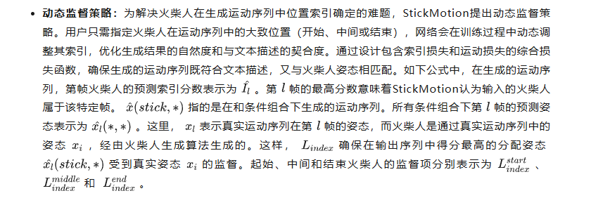

# StickMotion 基于手绘火柴人的人体动作生成算法

介绍：https://mp.weixin.qq.com/s?__biz=MzUxMDE4MzAzOA==&mid=2247833749&idx=4&sn=3d7a1c9e9564c9ec002a6ef4b84ea060&chksm=f8025c5ec50f12373daeb8acdd8b7451b57babf074b71f3a549b35859dd4492ce9daa2380377&scene=27

论文 ： https://arxiv.org/pdf/2503.04829

方法：diffusion

StickMotion: Generating 3D Human Motions by Drawing a Stickman**

Paper: https://arxiv.org/abs/2503.04829

Code: https://github.com/InvertedForest/StickMotion

人体姿态生成方法StickMotion，使用简单的火柴人表征来提高人体动作生成效率。

该论文StickMotion: Generating 3D Human Motions by Drawing a Stickman已被CVPR2025接收。

01

研究背景：文本驱动的局限与突破需求

文本到运动生成任务旨在将文本描述转化为逼真的人体运动序列，这一任务在影视制作、虚拟现实、游戏开发等领域有着广泛的应用前景。然而，单纯依靠文本描述，往往难以精准捕捉用户脑海中复杂且细致的人体运动。比如“向前高踢腿”这一简单描述，无法明确手臂的具体姿态。过往研究虽尝试通过复杂文本增强生成效果，但仍无法摆脱对大量文本的依赖。为了突破这一困境，本文提出了StickMotion，引入火柴人（stickman）条件，以此来精确控制人体运动细节。

02

StickMotion：核心技术与创新点

**1）火柴人的生成与编码**

- **生成算法（SGA）**：鉴于现有数据集中缺少手绘火柴人数据，本文提出SGA算法。该算法基于现有数据集中人体关节的3D坐标，能够自动生成风格各异的火柴人。在生成过程中，充分考虑了手绘特点，如笔画平滑度、位置偏差和比例缩放等问题。通过SGA算法，在KIT-ML和HumanML3D数据集上成功生成了多样化的火柴人训练数据。
- **信息编码**：在处理火柴人信息时，本文提出一种高效编码方式。用户只需绘制代表头部、躯干和四肢的六根线条，这些线条分别经过FCN编码后，再通过简单的Transformer编码器在Token维度相互作用，从而获得火柴人的嵌入表示。这种方法在降低计算资源消耗的同时，提高了火柴人识别的准确性。

**2）基于扩散模型的运动生成**

- **扩散过程**：StickMotion以扩散模型为基础，将运动生成任务分解为正向和反向过程。正向过程中，向实际运动添加高斯噪声，用于训练模型预测添加的噪声；反向过程中，根据用户输入的文本描述和火柴人，逐步去除噪声，生成运动序列。为平衡文本和火柴人条件对最终生成结果的影响，采用了无分类器扩散引导技术，并设置了相应的监督公式。
- **条件混合策略**：在反向过程中，通过条件混合策略，根据不同阶段调整文本和火柴人条件的权重，使生成的运动序列更符合预期。在初始阶段，根据特定公式确定条件混合权重，初步确定运动序列；在最终阶段，将权重调整为更注重所有条件的融合，进一步优化生成结果。

**3）独特的架构设计**

- **输入编码器**：StickMotion包含三个输入编码器，分别将噪声运动序列、文本和火柴人转化为向量形式。文本编码采用CLIPViT-B/32，火柴人编码则利用预训练并冻结的标准Transformer编码器，配合特征到姿态解码器，有效保留姿态信息。
- **多条件模块（MCM）**：MCM是StickMotion的关键组件，负责融合文本和火柴人条件。通过将数据按批次维度划分为四个部分，代表不同条件组合，利用条件融合模块在潜在空间中融合条件，再经潜在编码器重新编码，实现高效的多条件融合。与传统基于自注意力模块的多条件混合方法相比，MCM显著降低了计算复杂度，提升了模型性能。
- **动态监督策略：**为解决火柴人在生成运动序列中位置索引确定的难题，StickMotion提出动态监督策略。用户只需指定火柴人在运动序列中的大致位置（开始、中间或结束），网络会在训练过程中动态调整其索引，优化生成结果的自然度和与文本描述的契合度。通过设计包含索引损失和运动损失的综合损失函数，确保生成的运动序列既符合文本描述，又与火柴人姿态相匹配。如下公式中，在生成的运动序列，第帧火柴人的预测索引分数表示为 。第 帧的最高分数意味着StickMotion认为输入的火柴人属于该特定帧。 指的是在和条件组合下生成的运动序列。所有条件组合下第 帧的预测姿态表示为 。这里， 表示真实运动序列在第 帧的姿态，而火柴人是通过真实运动序列中的姿态 ，经由火柴人生成算法生成的。这样， 确保在输出序列中得分最高的分配姿态 受到真实姿态 的监督。起始、中间和结束火柴人的监督项分别表示为 、 和  。
- 

03

实验验证

实验结果表明，在两个数据集上，StickMotion与传统文本到运动方法相比，展现出了卓越的性能。为评估生成运动中融入的火柴人信息，本文提出了新指标StickmanSimilarity（StiSim）。在HumanML3D和KIT-ML数据集上，StiSim值分别达到41.5%和42.6%，证明了StickMotion能够有效学习输入火柴人的信息。

04

研究展望

StickMotion通过引入火柴人条件，为3D人体运动生成提供了一种高效且直观的方式。其创新的算法、架构设计和动态监督策略，不仅降低了计算复杂度，还显著提升了生成运动的质量和与用户需求的契合度。未来，随着研究的深入，StickMotion有望在更多领域得到应用和拓展，为数字内容创作、虚拟交互等行业带来新的发展机遇。

05

作者简介

王涛，北京邮电大学二年级研究博士生，研究方向主要为人体姿态，相关研究：人体姿态估计（ACMMM2023），姿态后处理（CVPR2024），人体姿态生成（CVPR2025）发表3篇会议论文。

金磊，北京邮电大学电子工程学院特聘副研究员，硕士生博士生导师，主要研究方向包括计算机视觉、大模型，其中深入研究人体姿态估计、人体动作识别、人体解析等细分领域，相关成果发表于CVPR, AAAI, NIPS, ACMMM，TIP, TMM等高水平会议及期刊，共发表SCI/EI索引论文40余篇。

赵健，中国电信人工智能研究院(TeleAI)多媒体认知学习实验室(EVOL)主任、资深研究科学家，博士毕业于新加坡国立大学，研究领域：AI治理、临地安防。共发表CCF-A类论文60余篇，含一作T-PAMI×2（IF: 20.8）、IJCV×3（IF: 11.6），第一发明人授权国家发明专利5项，曾获2023年度中国人工智能学会吴文俊人工智能优秀青年奖、2022年度中国人工智能学会吴文俊人工智能自然科学奖一等奖（2/5，中国智能科学技术最高奖），8次在国内外重要无约束视觉目标感知理解赛事中夺冠。个人主页：https://zhaoj9014.github.io。