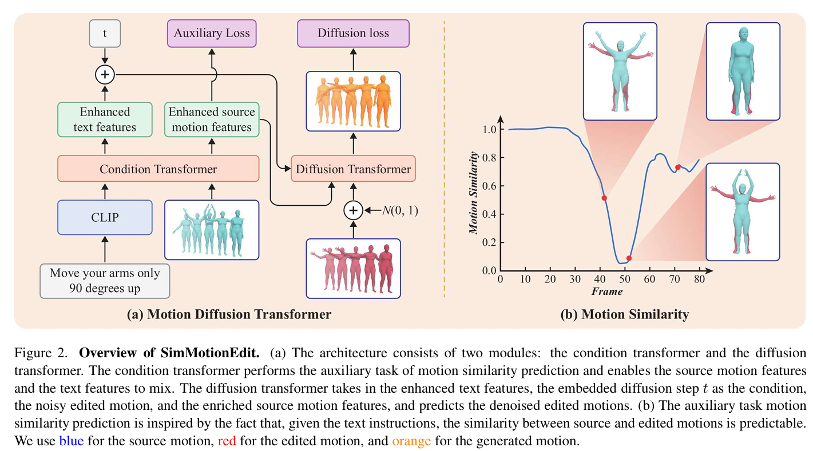

# SimMotionEdit文本编辑动作 动作相似度预测曲线2503

| 序号 | 文章题目+中稿会议                                            | 摘要翻译                                                     | 核心突出点                                                   | Method部分截图                                               | 是否开源           | 相关链接                                                     |
| ---- | ------------------------------------------------------------ | ------------------------------------------------------------ | ------------------------------------------------------------ | ------------------------------------------------------------ | ------------------ | ------------------------------------------------------------ |
| 4    | 《SimMotionEdit: Text-Based Human Motion Editing with Motion Similarity Prediction》**CVPR 2025** | 基于文本的3D人体运动编辑是计算机视觉与图形学领域关键而富有挑战性的任务。尽管已有研究探索了免训练方法，但近期发布的MotionFix数据集（包含源文本-运动三元组）为训练范式开辟了新途径，并展现出良好效果。==然而现有方法在精确控制方面存在不足，常导致运动语义与语言指令的错位。本文提出关联任务"运动相似性预测"，并设计多任务训练范式，通过联合训练运动编辑与运动相似性预测任务来促进语义表征学习。==为此我们进一步构建了先进的Diffusion-Transformer混合架构，分别处理运动相似性预测与运动编辑任务。大量实验表明，该方法在编辑对齐度与保真度方面均达到最先进水平。 | 1.网络结构上的创新，提出多任务训练框架以提升模型的运动编辑能力 2.遵循以下核心思想：要实现运动编辑，模型必须首先识别需要修改的部分。换言之，**给定源运动与编辑后运动，模型应能量化二者间的相似程度。** |  | :white_check_mark: | https://ideas.cs.purdue.edu/research/projects/sim-motion-edit/ |

概要

好的，我已经全面、仔细地阅读了这篇名为《SimMotionEdit: Text-Based Human Motion Editing with Motion Similarity Prediction》的论文。

这是一篇关于 **3D人体动作编辑** 的研究工作。接下来，我将为你清晰详细地拆解这篇论文在做什么，创新点是什么，以及它是如何实现的。

---

### 一句话总结

这篇论文提出了一种新的方法（SimMotionEdit），能够根据**文本指令**（比如“把胳膊抬高一点”）来**精确地编辑一个已有的3D人体动作序列**。其核心创新在于，它不直接进行编辑，而是引入了一个辅助任务——**“动作相似度预测”**，通过让模型先学会判断“源动作”和“目标动作”在每一帧上的相似程度，来更好地理解文本指令的意图，从而生成更准确、更自然的编辑后动作。

---

### 1. 核心问题（要解决什么？）

在计算机动画、游戏、虚拟现实等领域，我们不仅需要从头生成动作，更需要对已有的动作进行微调和修改。例如，一个动画师做好了一个走路的动作，现在想让这个角色“走得慢一点，并且不要摆动手臂”。

这项任务（Text-Based Human Motion Editing）的主要挑战在于：**如何让模型精确地理解文本指令，并只修改动作中相关的部分，同时保持其他部分不变且自然流畅？**

现有的方法存在一些问题：
*   **控制不精确**：模型可能“用力过猛”，改动了不该改动的地方；或者“理解不到位”，没有执行指令。
*   **语义错位**：生成的动作与文本指令的语义不完全匹配，比如让它“向左转”，结果它只是稍微侧了下身。
*   **信息融合困难**：如何有效地将**源动作信息**和**文本指令信息**融合在一起，共同指导最终的动作生成，是一个难题。

### 2. 核心思想与创新点

为了解决上述问题，作者提出了一个非常巧妙的核心思想，这个思想源于一个直觉：

**一个优秀的动画师在编辑动作前，首先会识别出哪些“关键帧”是需要修改的。**

同样地，模型也应该先学会==**识别出源动作中哪些部分与文本指令描述的修改目标“不相似”**。这些不相似的部分，就是需要编辑的区域。==

基于此，作者的核心创新是：
1.  **引入辅助任务：动作相似度预测 (Motion Similarity Prediction)**
    *   他们不让模型直接“傻瓜式”地学习“输入A -> 输出B”，而是增加了一个辅助的学习目标：**给定源动作和文本指令，预测出最终编辑好的动作与源动作在每一帧上的相似度。**
    *   这个相似度会形成一条随时间变化的曲线（见论文图2b）。例如，指令是“在后半段举起手”，那么这条相似度曲线在前半段应该很高（接近1，表示几乎无变化），在后半段会降低（表示有较大变化）。

1.  **多任务学习范式 (Multi-task Training)**
    *   模型需要同时完成两个任务：
        *   **主任务**：动作编辑（生成最终动作）。
        *   **辅助任务**：动作相似度预测。
    *   通过学习这个辅助任务，模型被迫去深入理解文本指令和源动作之间的关系，学习到一种**“语义上有意义的中间表示”**。这种表示捕捉了“哪里需要改”以及“怎么改”的信息。然后，这个高质量的中间表示可以极大地帮助主任务（动作编辑）做得更好。

2.  **先进的“扩散-Transformer”架构**
    *   他们设计了一个专门的神经网络架构来支持这种多任务学习。这个架构分为两个主要部分，解耦了两个任务的学习过程，使训练更稳定高效。

---

### 3. 具体方法（它是如何实现的？）

这篇论文的方法（SimMotionEdit）主要由以下几个部分构成：

#### A. 整体架构 (Overall Architecture)

模型主要包含两个Transformer模块（见论文图2a）：
1.  **条件Transformer (Condition Transformer)**：
    *   **输入**：源动作序列 + 文本指令（通过CLIP模型编码成特征）。
    *   **功能**：负责处理和融合这两个输入信息，并完成**动作相似度预测**这个辅助任务。
    *   **输出**：**增强后**的文本特征和动作特征。这些特征因为学习了相似度预测任务，已经包含了关于“哪里该改”的丰富信息。

2.  **扩散Transformer (Diffusion Transformer)**：
    *   **输入**：
        *   从条件Transformer输出的**增强后**的文本和动作特征。
        *   一个加了噪声的、不完美的“目标动作”。（这是扩散模型的标准操作）。
    *   **功能**：负责主要的生成工作，即**动作编辑**。它利用增强后的特征作为指导，逐步地从噪声中恢复出（即生成）一个干净、高质量的、符合要求的编辑后动作。
    *   **输出**：最终编辑好的动作序列。

#### B. 关键技术细节：如何实现“动作相似度预测”？

这个辅助任务的设计是论文的精髓所在，里面有很多细节：

1.  **定义可预测的相似度曲线 (Predictable Similarity Curve)**
    *   直接计算源动作和目标动作每一帧的距离（比如姿态的欧氏距离）效果很差，因为曲线会充满噪声且难以预测（见论文图3）。
    *   作者做了几步处理来让这个信号变得更“干净”和“可预测”：
        *   **滑动窗口**：在计算相似度时，不是比较第 `i` 帧和第 `i` 帧，而是比较源动作的第 `i` 帧和目标动作在 `i` 附近一个小窗口内的所有帧，取最小的距离。这解决了微小的时间偏移问题。
        *   **归一化**：将计算出的距离值通过min-max归一化到 `[0, 1]` 区间。这使得无论修改幅度大小（比如“稍微抬手”和“跳起来”），相似度都在一个统一的尺度上，便于模型学习。
        *   **噪声过滤**：他们定义了一个“动作信噪比”(MotionSNR)，过滤掉那些修改非常微小、难以区分的样本，避免给模型引入噪声。

2.  **分类而非回归 (Classification over Regression)**
    *   他们没有让模型去直接预测 `[0, 1]` 之间的精确相似度值（这是一个回归任务），因为这太难了，而且可能会过度约束模型。
    *   取而代之，他们将相似度**量化**成几个**离散的类别**，比如3个类别：`0` (不相似), `1` (中等相似), `2` (高度相似)。这样，辅助任务就变成了一个更简单的**分类任务**。
    *   实验证明，这种做法效果最好，因为它在提供有效指导和给予模型生成自由度之间取得了很好的平衡。

#### C. 训练过程

模型通过一个组合损失函数进行训练：
*   **`L_edit` (编辑损失)**：来自扩散Transformer，衡量生成的动作与真实目标动作之间的差距。
*   **`L_aux` (辅助损失)**：来自条件Transformer，衡量预测的相似度类别与真实相似度类别之间的差距（使用交叉熵损失）。

**总损失 `L = L_edit + L_aux`**。两个任务一起训练，相互促进。

---

### 4. 实验与结果

作者在标准的动作编辑数据集（MotionFix）上进行了大量实验，以证明其方法的有效性。

*   **定量比较 (Quantitative Comparison)**
    *   在各项评估指标上，SimMotionEdit都**显著优于**之前的SOTA（State-of-the-art）方法，如TMED、MDM-BP等。
    *   **对齐性指标** (如R@1, R@2, R@3) 和 **真实性/保真度指标** (M-score) 都取得了最好的结果。

*   **消融实验 (Ablation Study)**
    *   这是实验中非常关键的部分，用来验证各个创新点的作用。
    *   **去掉辅助任务** (`w/o aux loss`)：模型性能**显著下降**。这证明了动作相似度预测这个辅助任务确实是有效的。
    *   **对比不同的辅助损失**：实验表明，使用3个类别的分类损失效果最好，优于回归损失和更多类别的分类损失。这验证了他们设计的合理性。
    *   **对比不同的特征组合**：实验表明，同时使用增强后的文本和动作特征能达到最佳的平衡。

*   **定性/可视化结果 (Qualitative Results)**
    *   论文图4和图7展示了直观的对比。可以看出，他们的方法生成的动作更加自然，没有奇怪的自碰撞，并且更准确地遵循了文本指令的细微差别（例如，“坐得慢一点”、“不要把手举那么远”）。

*   **用户研究 (Perceptual Study - 见附录)**
    *   他们还招募了真人参与者来对生成结果进行打分。结果显示，在“与文本的对齐度”和“动作的合理性”两方面，人类也认为SimMotionEdit的结果**明显优于**之前最好的方法。

### 5. 总结与贡献

总而言之，这篇论文的主要贡献可以概括为：

1.  **提出了一种新颖且有效的多任务学习框架 (SimMotionEdit)**，用于解决文本驱动的3D人体动作编辑问题。
2.  **开创性地引入了“动作相似度预测”作为辅助任务**，极大地增强了模型对文本指令和源动作之间关系的理解能力，提高了编辑的精确性。
3.  **设计了一套完整的技术方案**，包括如何构建可预测的相似度曲线、如何将其转化为有效的分类任务，以及如何设计一个解耦的神经网络架构来稳定地训练模型。
4.  **通过全面的实验证明了其方法的先进性**，在定量、定性和用户研究方面都达到了新的SOTA水平，为该领域未来的研究提供了有价值的思路。

