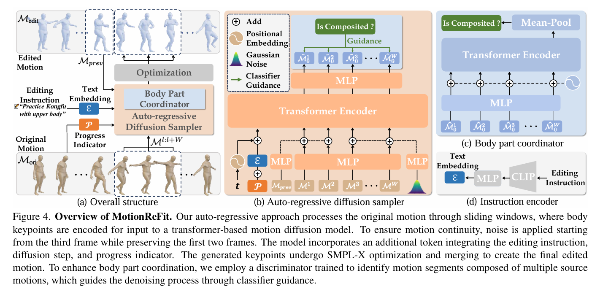
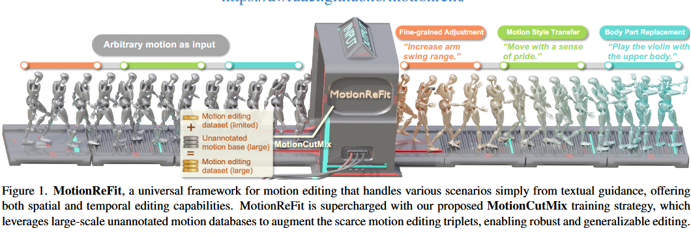

# （MotionReFit）Dynamic Motion Blending for Versatile Motion Editing

就是之前有个demo 现在跑不了了那个

| 序号 | 文章题目+中稿会议                                            | 摘要翻译                                                     | 核心突出点                                                   | Method部分截图                                               | 是否开源           | 相关链接                                                     |
| ---- | ------------------------------------------------------------ | ------------------------------------------------------------ | ------------------------------------------------------------ | ------------------------------------------------------------ | ------------------ | ------------------------------------------------------------ |
| 5    | 《Dynamic Motion Blending for Versatile Motion Editing》**CVPR 2025** | 文本引导的运动编辑技术实现了超越传统关键帧动画的高层语义控制与迭代修改能力。==现有方法依赖有限的预收集训练三元组（原始动作、编辑后动作及指令），这严重限制了其在多样化编辑场景中的适用性。==我们提出MotionCutMix——一种==通过基于输入文本混合身体部位动作来动态生成训练三元组的在线数据增强技术。==尽管MotionCutMix能有效扩展训练数据分布，但其组合特性会引入更强的随机性及潜在的身体部位不协调问题。为建模此类复杂分布，我们开发了MotionReFit：==一种配备动作协调器的自回归扩散模型。==该自回归架构通过分解长序列来降低学习难度，而动作协调器则能有效缓解动作组合产生的伪影。我们的方法可直接根据高层人类指令处理时空维度的运动编辑，==无需依赖额外规范或大型语言模型（LLMs）==。大量实验表明，MotionReFit在文本引导运动编辑任务中达到最先进性能。消融研究进一步证实，MotionCutMix在保持训练收敛性的同时显著提升了模型的泛化能力。 | 1.提出了一种数据增强技术（**通过混合身体部位动态生成训练三元组**），解决了原来的数据集限制造成的多样化编辑能力； 2.提出了**MotionReFit**：动作协调器，缓解动作组合造成的伪影； 3.无需依赖额外规范或者LLM |  | :white_check_mark: | [Dynamic Motion Blending for Versatile Motion Editing](https://awfuact.github.io/motionrefit/) |

好的，我已经全面仔细地阅读了这篇名为《Dynamic Motion Blending for Versatile Motion Editing》的论文。

这是一项关于 **3D 人体运动编辑** 的研究，目标是让用户能通过简单的 **文本指令**（比如“把手臂挥舞得更夸张一点”或“用骄傲的姿态走路”）来精确、灵活地修改一段已有的 3D 运动。

下面我将为你清晰、详细地拆解这篇论文的核心思想和贡献。

### 核心目标

论文的最终目标是创建一个**通用、强大且易于使用**的文本指令驱动的 3D 运动编辑框架。这个框架应该能处理各种复杂的编辑任务，包括：

1.  **局部身体部位编辑 (Body Part Replacement)**：只修改身体的某个部分，比如“上半身保持不动，下半身跳舞”。
2.  **运动风格迁移 (Motion Style Transfer)**：改变整个动作的情感或风格，比如把普通的走路变成“像个老人一样蹒跚地走”。
3.  **细粒度调整 (Fine-grained Adjustment)**：对动作进行微调，比如“把腿踢得再高一点”。

### 面临的主要问题

现有的方法在实现上述目标时存在三大瓶颈：

1.  **数据稀缺与泛化能力差**：训练这类模型需要大量的“三元组”数据，即 `(原始动作, 编辑后的动作, 编辑指令)`。这种数据非常昂贵且难以收集，导致现有模型的训练数据量有限，无法很好地泛化到新的、没见过的动作和指令组合上。
2.  **需要额外信息，不够智能**：一些方法需要用户手动指定要编辑的身体部位（比如提供一个“蒙版”），而不能仅从高层语义的文本指令（如“用上半身弹吉他”）中自主理解。
3.  **时空平滑性差**：生成的编辑后动作，在修改的部分与未修改的部分之间，或者在不同时间段的动作之间，过渡可能非常生硬、不自然。

### 论文的核心贡献与方法

为了解决上述问题，作者提出了两个关键创新：**MotionCutMix** (一种数据增强策略) 和 **MotionReFit** (一个模型架构)。

---

#### 贡献一：MotionCutMix —— 巧妙的“动作剪贴拼合”术

这是解决**数据稀缺问题**的“杀手锏”。它的核心思想是：既然成对的编辑数据那么少，那我们为什么不利用海量的、没有配对和标注的普通动作数据，来**动态地、在线地合成**新的训练数据呢？

**工作原理：**
1.  **取材**：从一个小的、有标注的编辑数据集（比如知道“挥手”这个动作）和一个巨大的、无标注的动作数据库（包含各种走路、跑步、跳跃等）中取样。
2.  **剪贴与融合**：假设要编辑“上半身”。它会把一个动作的“上半身”（比如从有标注数据里取出的“弹吉他”动作）和一个完全不相关的动作的“下半身”（比如从无标注库里取出的“走路”动作）“剪”下来，然后“粘贴”在一起。
3.  **智能融合 (Soft Mask)**：为了避免拼接处（比如腰部）出现断层和不自然，它使用了一种“软蒙版”技术进行平滑过渡，而不是硬生生地拼接。
4.  **生成新三元组**：通过这种方式，它凭空创造了大量全新的、多样化的训练三元组。比如 `(原始动作: 走路, 编辑后动作: 上半身弹吉他+下半身走路, 指令: “用上半身弹吉他”)`。

**效果**：通过 MotionCutMix，模型在训练时能看到千变万化的组合，极大地增强了其**泛化能力**和**鲁棒性**，即使在真实标注数据很少的情况下也能学得很好。

---

#### 贡献二：MotionReFit —— 精巧的“动作生成与协调”模型

这个模型是为了**处理 MotionCutMix 生成的复杂、多样甚至有些不协调的数据**而设计的。它主要由三部分组成：

1.  **自回归扩散模型 (Auto-regressive Diffusion Model)**：
    *   **扩散模型**是当前最强大的生成模型之一，能生成高质量、逼真的结果。
    *   **自回归**是关键。模型不是一次性生成整个长动作，而是像写句子一样，一小段一小段地（比如每次生成 16 帧）生成。它会看着前一小段的结尾来生成后一小段的开头，这保证了长动作在**时间上的连贯性与平滑性**。

2.  **运动协调器 (Motion Coordinator)**：
    *   **问题来源**：MotionCutMix 合成的动作有时可能不符合人体运动学规律（比如走路时同手同脚）。
    *   **解决方案**：作者训练了一个额外的“裁判”模型，即运动协调器。这个协调器专门学习如何区分“自然的动作”和“人工拼凑的不自然动作”。
    *   **工作方式**：在 MotionReFit 生成动作的最后阶段，这个协调器会介入，像一个教练一样对生成的动作进行“打分”和“指导”，微调动作细节，修复那些不协调的“小毛病”，确保最终输出的动作**自然且协调**。

3.  **多条件编码器 (Multiple Condition Encoders)**：
    *   模型将原始动作、文本指令、生成进度等多种信息编码后，一起作为生成新动作的引导条件，确保生成结果既保留了原始动作的未编辑部分，又精确执行了文本指令。

### 他们还做了一项贡献：STANCE 数据集

为了更好地评估模型性能，作者还构建并发布了一个新的高质量标注数据集 **STANCE**，包含了上述三种编辑任务的大量样本，为后续研究提供了宝贵的资源。

### 实验与结果

作者将他们的方法与当前顶尖的方法（如 MDM、TMED）进行了全面对比。结果表明：

*   **性能最优**：在各种量化指标上，MotionReFit 均取得了当前最佳（State-of-the-art）的性能。
*   **效果逼真**：从论文展示的定性结果来看，他们的方法生成的动作不仅准确遵循了指令，而且动作流畅、自然，完胜其他方法。
*   **组件有效**：通过消融实验证明，无论是 **MotionCutMix** 还是 **运动协调器**，都是不可或缺的。去掉任何一个，模型性能都会显著下降。

### 总结

简单来说，这篇论文的思路可以这样理解：

1.  **发现问题**：用文本编辑 3D 动作，最大的障碍是“教练”（训练数据）太少了。
2.  **提出方案一 (造数据)**：发明了 **MotionCutMix** 技术，像一个“动作魔法师”，能用现有的零散动作素材，自动“拼装”出海量的、全新的训练样本，解决了数据稀缺问题。
3.  **发现新问题**：拼装出来的动作偶尔会“四肢不协调”。
4.  **提出方案二 (强模型)**：设计了 **MotionReFit** 模型，它像一个“技艺高超的动画师”，不仅能根据文本指令逐步生成流畅的动作（自回归扩散），还带了一个“运动学专家”——**运动协调器**，在最后对动作进行精修，确保最终成品完美、自然。

总的来说，这是一项非常完整和漂亮的工作，通过“数据增强”和“模型设计”两方面的创新，显著提升了文本驱动下 3D 运动编辑的多功能性、鲁棒性和最终效果的质量，是该领域一个重要的进展。

