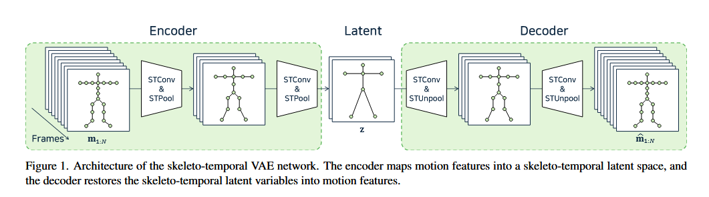
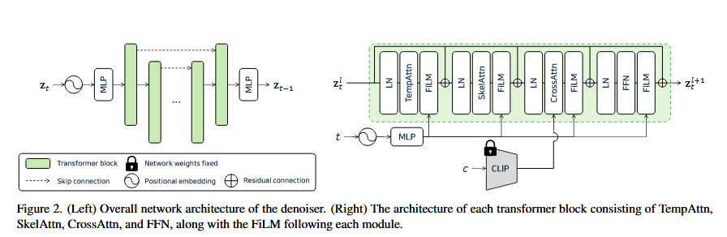
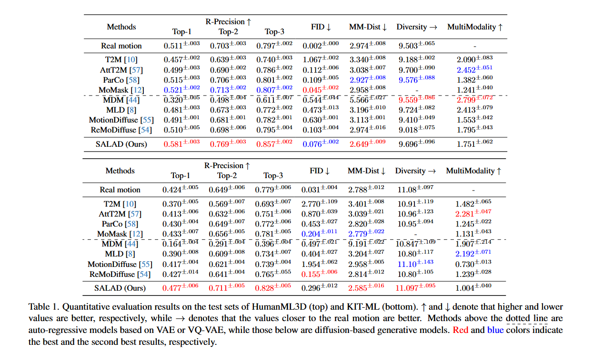
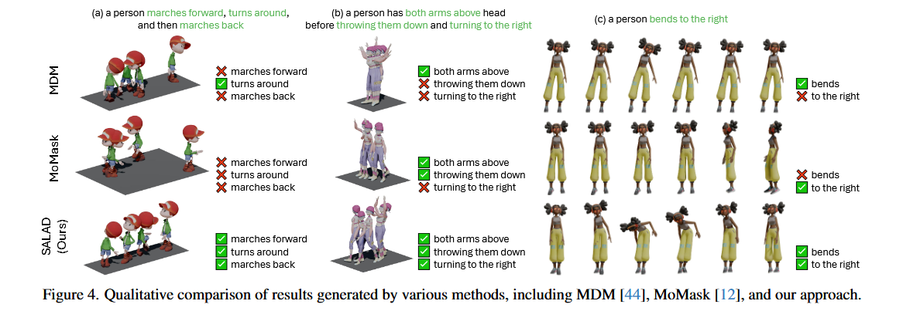
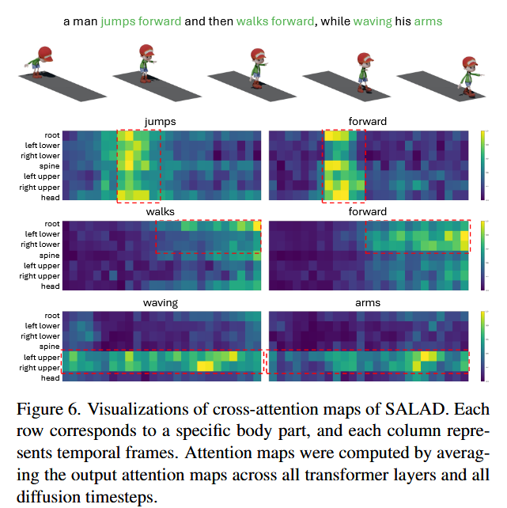

# salad 文本编辑动作

好的，没问题。这篇论文 **SALAD (Skeleton-aware Latent Diffusion)** 是一项非常有意思的工作，它不仅提升了文本生成3D人体动作的质量，更重要的是实现了一个非常实用的功能：**仅通过修改文本就能编辑已生成的动作，而且无需重新训练模型**。

我将为你详细拆解这篇论文，让你彻底明白它**做了什么**以及**是怎么做的**。

---

### 一、 论文核心思想

这篇论文的核心思想是：**让模型在理解人体动作时，不再把“一帧姿势”看作一个整体，而是像人一样，分别理解“骨骼关节的空间结构”和“动作随时间的变化”，并建立文本中每个词与特定身体部位、特定时间段的精细对应关系，从而实现高质量的生成和编辑。**

---

### 二、 背景与动机（为什么要做这个研究？）

在SALAD之前，用AI根据文本生成人体动作（Text-to-Motion）已经有很多方法了，但它们普遍存在以下几个痛点：

1.  **表示过于简化（Oversimplification）**：
    *   **对姿势的理解粗糙**：很多模型将一帧的人体姿势（比如22个关节点的位置）直接“压扁”成一个长长的一维向量。这样做会丢失骨骼的内在结构信息（比如手和胳膊是相连的，左腿和右腿是对称的）。
    *   **对文本的理解笼统**：模型常常将整个句子（如“一个人先跳跃，然后向右挥手”）也压缩成一个单一的向量。这会导致模型抓不住句子中的关键词和细节，比如“向右”这个方向信息就可能被忽略。

2.  **生成与文本对齐不佳**：由于上述的简化，生成的动作常常只能“大概”符合文本描述，对于复杂或包含多个步骤的指令，经常会出错或漏掉某些动作。比如，你让它“先左转再举起右手”，它可能只做了左转，或者举起了左手。

3.  **编辑困难，成本高**：如果你想修改一个已经生成的动作，比如把“走路”改成“跑步”，或者把“举左手”改成“举右手”，传统方法非常麻烦，通常需要：
    *   **手动指定遮罩（Masking）**：手动告诉模型“你只需要修改右手的动作，其他部分别动”。
    *   **优化或微调（Optimization/Fine-tuning）**：需要针对新的文本进行额外的计算和模型调整，费时费力。

**SALAD的目标就是解决这些问题，提出一个既能高质量生成，又能轻松编辑的统一框架。**

---

### 三、 论文方法详解（SALAD是怎么做的？）

SALAD的整个流程可以分为两步：
1.  **第一步：构建一个更懂“骨骼结构”和“时间动态”的动作压缩空间 (Skeleton-aware VAE)。**
2.  **第二步：在这个压缩空间里，利用一个强大的扩散模型来学习从文本到动作的生成 (Skeleton-aware Denoiser)。**

下面我们来详细拆解这两步。

#### **第1步：骨骼感知的变分自编码器 (Skeleton-aware VAE)**

这部分的目标不是生成，而是**学习如何高效地表示（压缩）人体动作**。想象一下，一张高清图片很大，我们可以把它压缩成一个小的JPEG文件，虽然损失了一些信息，但关键内容还在。VAE就扮演了这个“压缩器”和“解压器”的角色。

SALAD的VAE特殊之处在于它的“**骨骼感知（Skeleton-aware）**”和“**时序感知（Temporal-aware）**”。

*   **编码器（Encoder）**：
    *   **输入**：一段原始的动作数据（比如120帧，每帧包含所有关节点信息）。
    *   **处理方式**：它没有把每一帧压成一个向量，而是使用了**时空卷积（Skeleto-temporal Convolution, STConv）**。这个技术包含两个部分：
        1.  **骨骼卷积 (SkelConv)**：这是一种图卷积，它沿着人体骨骼的拓扑结构传递信息。比如，手腕的信息会和手肘、肩膀的信息进行交流。这让模型理解了“身体部位是相互连接的”。
        2.  **时间卷积 (TempConv)**：这是一维卷积，它沿着时间轴传递信息。比如，第`t`帧的姿势会和第`t-1`帧、`t+1`帧的姿势进行交流。这让模型理解了“动作是连续变化的”。
    *   **输出**：一个被压缩后的**潜空间（Latent Space）**表示。这个潜空间的数据维度更小，但依然保持了`[时间, 关节]`的二维结构，而不是被压扁的一维向量。这为后续的精细化生成和编辑打下了基础。

*   **解码器（Decoder）**：负责将压缩后的潜空间数据“解压”还原成原始的、可播放的动作数据。

通过这一步，SALAD得到了一个高质量的动作“压缩格式”，它既小巧，又保留了动作的核心时空结构。

*图1：SALAD的VAE结构，将动作数据映射到一个保留时空结构的潜空间。*

#### **第2步：骨骼感知的去噪扩散模型 (Skeleton-aware Denoiser)**

这是SALAD的核心生成模块。它在上面VAE构建的“压缩空间”里工作。

*   **基本原理（扩散模型）**：
    1.  **加噪**：取一个真实的（压缩后的）动作数据，不断地往上加噪声，直到它变成一个完全随机的噪声。
    2.  **去噪**：训练一个**去噪器（Denoiser）**，让它学习如何一步步地把这个随机噪声还原成原始的动作数据。
    3.  **生成**：在生成新动作时，我们从一个随机噪声开始，在**文本提示（Text Prompt）**的指导下，用训练好的去噪器一步步去噪，最终“雕刻”出一个符合文本描述的动作。

*   **SALAD的去噪器有何特别之处？**
    它的去噪器是一个Transformer架构，内部设计了三种不同的**注意力机制（Attention）**来分别处理不同维度的信息：
    1.  **时间注意力 (Temporal Attention)**：让模型关注不同时间帧之间的关系。
    2.  **骨骼注意力 (Skeletal Attention)**：让模型关注不同身体关节之间的关系。
    3.  **交叉注意力 (Cross-Attention)**：**这是最关键的一环！** 它负责建立**文本中的每个词**和**动作潜空间中每个时空单元（即某个关节在某个时间的姿态）**之间的联系。

    > **交叉注意力的直观理解**：
    > 比如文本是“a person waving his right hand high”，交叉注意力机制会学习到：
    > *   单词 "waving" 主要关联到 "手臂" 关节在整个时间段的运动。
    > *   单词 "right" 主要关联到 "右侧" 的手臂关节。
    > *   单词 "high" 主要关联到手臂关节在空间中的 "高度"。
    >
    > 这种精细的对应关系，是实现高质量生成和“零样本”编辑的基石。

*图2：去噪器的Transformer模块，包含三种注意力机制。*

#### **最精彩的部分：如何实现“零样本”文本编辑？**

SALAD的编辑能力完全依赖于对**交叉注意力图（Cross-Attention Map）**的巧妙操纵。这个注意力图记录了“哪个词对哪个时空单元影响最大”。

在生成动作的每一步去噪过程中，SALAD都可以“劫持”和“修改”这个注意力图，从而改变最终的生成结果。它实现了四种编辑方式：

1.  **词语替换 (Word Swap)**：
    *   **任务**：将“a man sits on the **chair**” (坐在椅子上) 改为 “a man sits on the **ground**” (坐在地上)。
    *   **做法**：在生成过程的前半段，使用"chair"的注意力图来确定“坐下”这个大体姿势；在后半段，换成"ground"的注意力图来微调姿势细节，让人物最终稳稳地坐在地上。

2.  **提示词优化 (Prompt Refinement)**：
    *   **任务**：在“a person walks” (走路) 后面加上 “...**then turns right**” (然后右转)。
    *   **做法**：保留"walks"部分的注意力图不变，只将新词"turns right"的注意力图“拼接”上去。这样，原始的走路动作被完美保留，同时增加了右转的新动作。

3.  **注意力重新加权 (Attention Re-weighting)**：
    *   **任务**：将“举手”改为“把手举得**更高**”。
    *   **做法**：在文本提示"a person is holding his left hand up **high**"中，找到对应单词"high"的注意力图，然后将这张图的权重值**乘以一个大于1的系数**（比如2）。这样模型就会更加“重视”这个词，从而生成一个手举得更高的动作。如果乘以一个小于1的系数，手就会举得低一些。

4.  **注意力镜像 (Attention Mirroring)**：
    *   **任务**：将“挥舞**左手**”改为“挥舞**右手**”。
    *   **做法**：在生成过程中，直接将与“左臂”关节相关的注意力图和与“右臂”关节相关的注意力图进行**交换**。这个操作证明了SALAD的注意力图确实精确地对应到了不同的身体部位。

*图3：论文中的编辑示例，非常直观地展示了这几种编辑方法的效果。*

---

### 四、 实验与结果

*   **定量比较**：在两个主流数据集（HumanML3D和KIT-ML）上，SALAD在**文本-动作对齐度（R-Precision）**指标上**显著优于**所有先前方法，意味着它生成的动作更符合文本描述。在**生成质量（FID）**上，也达到了顶尖水平。
*   **定性比较**：从论文给出的图片（Figure 4）可以看出，对于复杂的文本，其他模型要么漏掉动作，要么做得不像，而SALAD能准确地执行所有指令。
*   **用户研究**：针对编辑功能，他们邀请了真实用户来打分。结果显示，用户认为SALAD的编辑效果在**“保留原始动作”、“与新文本匹配”和“整体质量”**三个方面都远超其他方法。

---

### 五、 总结与贡献

这篇论文的主要贡献可以归纳为三点：

1.  **提出了一个骨骼感知的时空潜空间 (Skeleto-temporal Latent Space)**：通过特制的VAE，为动作数据创建了一个更合理、更结构化的“压缩表示”。
2.  **设计了一个强大的骨骼感知扩散模型 (SALAD)**：通过精细的注意力机制，建立了文本和动作之间前所未有的精细对应关系，显著提升了生成质量和文本对齐度。
3.  **首次实现了基于注意力图的零样本文本驱动动作编辑**：这是本文最大的亮点，提供了一种极其灵活、高效、无需额外训练的动作编辑方式，极具实用价值。

总而言之，SALAD不仅仅是又一个提升了指标的模型，它更在“**可解释性**”和“**可控性**”上迈出了一大步，让AI生成动作变得更像一个可以与之“沟通”和“协作”的智能工具，而不是一个黑箱。

##  全文

---

### **摘要 (Abstract)**

随着去噪扩散模型的兴起，文本驱动的动作生成技术取得了显著进展。然而，先前的方法通常过度简化了对骨骼关节点、时间帧和文本词语的表示，这限制了它们充分捕捉各模态内部信息及其相互作用的能力。此外，当使用预训练模型进行编辑等下游任务时，通常需要额外的操作，如手动干预、优化或微调。在本文中，我们引入了一种**骨骼感知的潜空间扩散模型（SALAD）**，该模型能明确地捕捉关节点、时间帧和词语之间错综复杂的相互关系。此外，通过利用生成过程中产生的**交叉注意力图（cross-attention maps）**，我们实现了一种基于注意力的**零样本（zero-shot）**、文本驱动的动作编辑方法。该方法使用一个预训练好的SALAD模型，除了文本提示外，无需任何额外的用户输入。我们的方法在**文本-动作对齐度**方面显著优于先前的方法，且不损害生成质量，并通过提供超越生成任务的多样化编辑能力，展示了其实用性和多功能性。代码已在项目主页上提供。

---

### **1. 引言 (Introduction)**

角色动画是各种计算机图形学和视觉应用（包括游戏、电影和互动媒体）中的一个关键组成部分。传统方法，如关键帧动画和动作捕捉，通常需要大量的人工劳动，既耗时又昂贵。近来，深度生成模型被引入以缓解这些挑战。特别地，扩散模型在文本到动作生成方面展现了令人鼓舞的结果，实现了直观高效的动画工作流程。

尽管取得了这些进步，但要完全捕捉帧、身体部位和文本描述之间复杂的相互关系，在文本驱动的动作生成中仍然是一个复杂的挑战。先前的方法通常将一个姿势表示为单个向量，并主要关注跨时间帧的姿势之间的时序关系，而忽略了骨骼关节点之间的空间交互。此外，这些模型常常将一个句子压缩成单个向量来进行条件化，这可能忽略了词语层面变化的重要细微差别。这种对骨骼、时序和文本组件之间交互的过度简化，可能导致生成结果中细节的缺失，凸显了建立能够忠实捕捉这些复杂依赖关系的模型的需求。

另一方面，学习有意义的表示是实现基于预训练模型的零样本下游任务的关键因素。例如，零样本的文本驱动图像和视频编辑方法 [3, 7, 13, 16, 26, 36, 46] 利用了预训练模型中的**注意力调制（attention modulation）**来实现直观的操纵。不幸的是，动作生成模型通常缺乏这种可解释和可操纵的中间表示。这一局限性源于上文提到的对动作和文本特征的过度简化，它限制了两者之间丰富的交互。尽管一些方法利用预训练模型结合手动遮罩、优化或微调 [22–24, 44, 49, 51] 来实现编辑，但这些方法需要额外的精力、时间和成本才能达到预期效果。因此，在动作合成过程中开发可解释的表示，可以提高下游任务（如零样本动作编辑）的多功能性和灵活性，而不仅仅是生成。

在本文中，我们提出了一个我们称之为**SALAD**的**骨骼感知的潜空间扩散模型**，用于在一个具有**骨骼-时序（skeleto-temporally）**结构化潜空间内进行文本驱动的动作生成。我们首先训练一个变分自编码器（VAE）[25]来构建一个解耦了空间和时间维度的动作潜空间。为此，我们采用**骨骼-时序卷积层**来促进相邻关节点和帧之间的信息交换。我们还采用**骨骼-时序池化层**来通过降维产生一个紧凑的表示，这可以降低扩散模型采样过程中的计算复杂性。随后，我们在这个潜空间内训练一个扩散模型，以生成由文本条件化的动作特征。为了训练去噪器，我们同时利用了**骨骼和时序注意力模块**，这能有效地实现骨骼-时序的连贯性。此外，我们采用**交叉注意力**来捕捉单个词语与动作潜空间的时空单元之间的细粒度交互。

除了动作生成，我们还引入了一种基于注意力的**零样本、文本驱动的动作编辑方法**，该方法利用预训练好的SALAD模型，无需额外的优化或微调。我们证明了SALAD的中间交叉注意力图能够捕捉文本和动作特征之间的关系。通过调制这些交叉注意力图，我们实现了文本驱动的动作编辑，允许用户仅通过文本输入，以一种无需训练的方式编辑生成的动作。我们还提出了一种新颖的针对特定动作任务的注意力调制方法，展示了我们方法的实际潜力。

总而言之，我们的贡献如下：
*   我们提出了SALAD，一个新颖的骨骼感知潜空间扩散模型，用于在一个骨骼-时序结构化的潜空间内进行文本驱动的动作生成。
*   我们对生成过程中的中间表示进行了解释，从而能够清晰地理解文本输入和生成动作之间的关系。
*   我们提出了一种在生成模型中使用交叉注意力调制的、基于注意力的零样本、文本驱动的动作编辑方法。

好的，这是对“相关工作” (Related Work) 部分的翻译，我将采用分点式结构，以便您能更清晰地理解。

---

### **2. 相关工作 (Related Work)**

#### **2.1. 文本驱动的动作生成 (Text-driven Motion Generation)**

*   **早期研究**：随着深度神经网络的兴起，基于自然语言描述的人体动作合成生成模型得到了广泛探索。早期的研究主要集中于从动作标签（如“投掷”、“踢”）生成动作。
*   **共享潜空间**：更先进的方法将文本和动作特征都投射到一个共享的潜空间中，从而能够从相同的输入文本生成固定的动作序列。
*   **增加多样性 (T2M)**：为了增加生成结果的多样性，T2M [10] 采用了一个时序变分自编码器（temporal VAE），可以生成与给定文本输入对齐的、多样化的动作序列。
*   **利用预训练编码器 (CLIP)**：后续研究利用了像CLIP [37]这样的大型预训练文本编码器，以提高模型对文本的理解能力，从而改善动作生成的效果。
*   **自回归模型**：研究者们也提出了行为类似语言模型的自回归模型。这些模型首先通过向量量化（vector quantization）将动作特征编码成离散的标记（token），然后根据文本提示自回归地预测下一个动作标记。
*   **扩散模型的兴起**：近来，去噪扩散模型已成为生成模型的主流框架，这促使文本驱动的动作生成方法也开始采用扩散模型作为其核心架构。
*   **本文的工作**：在本研究中，我们基于扩散模型的范式构建我们的框架，并通过**显式地建模关节点、时间帧和词语之间的关系**来提升文本驱动动作生成的性能。此外，我们引入了一种基于注意力的零样本、文本驱动的编辑方法，利用我们预训练的SALAD模型作为生成器，这代表了在单纯生成之外的一个新颖探索。

#### **2.2. 动作数据的骨骼感知处理 (Skeleton-aware Processing of Motion Data)**

*   **时空图卷积 (ST-GCN)**：由于动作数据由骨骼和时间两个独立的维度组成，一些方法被开发出来以在处理数据时尊重每个维度。Yan等人 [52] 提出了时空图卷积网络，可以同时学习动态骨骼的空间和时间模式。
*   **骨骼感知网络**：骨骼感知网络 [1] 采用了骨骼-时序卷积网络和保持拓扑结构的骨骼池化层，构建了一个共享的动作潜空间，从而实现了在同胚（homeomorphic）骨骼间的深度动作重定向（retargeting）。
*   **动作风格迁移**：通过采用骨骼-时序卷积模块，也实现了分部位的动作风格迁移。
*   **在文本生成中的应用**：在文本到动作生成领域，ParCo [58] 和 AttT2M [57] 在其动作量化过程中利用了骨骼-时序网络架构。
*   **本文的工作**：在我们的工作中，我们采用了类似的方法，通过使用骨骼-时序卷积网络和池化层来编码动作特征，从而获得一个有效的、维度紧凑的骨骼感知动作潜空间。此外，我们在文本条件的生成过程中，促进了这个骨骼感知的动作潜空间与文本特征之间的交互。

#### **2.3. 使用扩散模型进行零样本编辑 (Zero-shot Editing with Diffusion Models)**

*   **利用扩散模型进行编辑**：利用扩散模型的生成能力，研究者们提出了多种零样本编辑方法。
*   **SDEdit**：SDEdit [29] 首先对输入数据添加几个扩散时间步的噪声，然后使用一个编辑条件对含噪数据进行去噪，从而利用预训练的扩散模型实现高保真度的零样本编辑。
*   **Prompt-to-Prompt**：Prompt-to-Prompt [16] 验证了交叉注意力图建立了词语标记与生成图像空间布局之间的联系。此外，它引入了可在生成过程中使用的注意力调制方法，从而能够以零样本的方式生成高保真度的编辑结果。
*   **Null-text Inversion**：Null-text Inversion [30] 通过改进扩散模型反演方法，将Prompt-to-Prompt的技术扩展到了对真实图像的编辑。类似地，通过注意力调制进行图像和视频编辑的方法也得到了广泛研究。
*   **动作编辑的现有方法**：动作扩散模型通常采用**关节点遮罩（joint masks）**或**优化**的方法，来利用预训练模型进行动作编辑，但这些方法需要用户干预或为达到预期目标而进行额外的计算。
*   **其他零样本编辑方法 (CoMo)**：CoMo [19] 使用大型语言模型来操纵语义化的姿势标记，从而实现了零样本的文本驱动动作编辑。
*   **本文的工作**：我们证明了，与图像扩散模型类似，我们的SALAD模型中的中间交叉注意力图能够捕捉文本和动作之间的关系。此外，通过调制这些交叉注意力图，我们引入了一种**基于注意力的零样本、文本驱动的动作编辑方法**，该方法消除了手动遮罩、微调或优化的需要。

### 方法

想象一下，你是一位顶级动画师，现在接到了一个任务：把一段非常复杂的真人舞蹈动作（比如一段hip-hop），用电脑动画的形式重新做出来。这段舞蹈数据非常庞大，包含了每一毫秒里舞者身上几十个关节点的位置、旋转等等信息，直接处理起来又慢又占地方。

你怎么办呢？你不会傻乎乎地去一个点一个点地复制。你可能会这样做：

1.  **抓重点**：你会先看明白这段舞蹈的“精髓”是什么。比如，“哦，原来是先一个快速的滑步，然后身体向左倾斜，同时右手向上做一个wave。” 你把这个复杂的动作**提炼成了几个关键的、结构化的信息**。
2.  **再创作**：然后，你根据这些提炼出的“精髓”，用你的动画软件重新把动作做出来。

3.1节的这个 **Skeleton-aware VAE**，做的就是上面第一步——**抓重点、提炼精髓**的工作。它是一个超级智能的“动作分析师”和“压缩大师”。

---

### **3.1 骨骼感知的变分自编码器 (Skeleton-aware VAE) 的目标**

它的核心目标就一句话：**把原始、庞大、杂乱的动作数据，压缩成一个紧凑、高效、并且保留了动作核心时空结构的“动作精华”表示。**

这个“动作精华”我们称之为**潜空间表示 (Latent Representation)**，用字母 `z` 表示。

---

### **它是怎么做到的呢？—— VAE的“压缩”与“解压”之旅**

这个VAE由两个部分组成：一个**编码器 (Encoder)** 和一个**解码器 (Decoder)**，就像一个压缩软件和解压软件。

#### **第一站：编码器 (Encoder) - 智能压缩**

编码器的任务是把输入的原始动作数据 `m` 压缩成“动作精华” `z`。

*   **输入 (Input)**：一段原始动作数据 `m`。这个数据就像一部高清电影，非常庞大。它包含了`N`帧画面，每一帧都记录了`J`个关节点的信息。

*   **传统的笨办法**：以前的模型可能会把每一帧的几十个关节点信息粗暴地“拉平”成一个长长的一维数字列表。这就好比你把一幅名画的所有像素点按从左到右、从上到下的顺序抄下来，虽然信息都在，但画的结构、哪里是人脸、哪里是背景，这些重要的空间关系全都丢失了。

*   **SALAD的聪明做法 (核心技术点！)**：SALAD的编码器不这么干。它非常尊重动作的内在结构，用了两把刷子：

    1.  **骨骼卷积 (SkelConv)**：这就像一个“人体结构专家”。它不是独立地看每个关节点，而是沿着人体骨骼的自然连接进行分析。比如，它在分析“手腕”的时候，会同时参考“手肘”和“手指”的信息，因为它知道这几个部位是连在一起的，动作是相互协调的。这是一种**图卷积网络**的应用，把人体骨骼看作一张图。

    2.  **时间卷积 (TempConv)**：这就像一个“时间流逝观察家”。它会把当前这一帧的姿势和前后几帧的姿势联系起来看。它知道，一个“跳跃”动作不是凭空出现的，它前面必然有一个“屈膝”的准备动作，后面会有一个“落地”的缓冲动作。这保证了动作的**连贯性**和**流畅性**。

    这两个技术合在一起，就叫做**时空卷积 (STConv)**。

    **【请看图1左半部分】**：
    
    *   `m1:N` 是输入的原始动作。
    *   它首先被分解（`Separate`），然后通过一系列的`STConv`和`STPool`（池化，可以理解为进一步压缩提炼）层。
    *   经过这个过程，原始动作数据被智能地压缩成了潜变量 `z`。

*   **最终的“动作精华” `z`**：这个 `z` 不再是一个被压扁的长向量，它依然保持着 `[帧数, 关节数]` 这样的二维结构，只不过帧数和关节数都变少了（比如从120帧、22个关节，压缩成了30帧、7个主要身体部分）。这7个部分是：**躯干、脊柱、头部、左臂、右臂、左腿、右腿**。这样既大大减少了数据量，又保留了最重要的时空结构信息！

#### **第二站：解码器 (Decoder) - 精准还原**

解码器的任务就简单了，它是编码器的逆过程。它把压缩好的“动作精华” `z` 重新“解压”，还原成原始的动作数据 `m`。它使用的技术也是`STConv`和`STUnpool`（解池化），就像把压缩文件一步步还原。

*   **【请看图1右半部分】**：
    
    *   从潜变量 `z` 开始，通过`STConv`和`STUnpool`层。
    *   最后恢复（`Concatenate`）成完整的动作 `m1:N`。

---

### **为什么要这么费劲地做这个VAE？**

你可能会问，既然最终还是要生成动作，为什么不直接从文本生成原始动作，而要多此一举先搞一个压缩的潜空间呢？

原因有三：

1.  **降低计算成本**：在压缩后的潜空间里进行生成（也就是后面扩散模型的工作），数据量大大减小，计算速度会快非常多。这就像你在一个缩略图上画画，比在巨幅海报上画要快得多。
2.  **提高生成质量**：这个潜空间 `z` 已经被VAE“净化”过了，它去除了原始数据中的一些噪声和不重要的细节，只留下了最核心的动作模式。在这样一个“干净”且“结构化”的空间里学习生成，模型更容易抓住重点，生成的动作质量自然更高。
3.  **为精细化编辑打下基础**：因为潜空间 `z` 依然保留了 `[时间, 关节]` 的结构，这使得我们后面在做编辑时，可以精确地定位到“第5秒的左手”，并只修改这部分的信息，而不会影响到其他部分。如果是一维向量，这种精细操作就无从谈起了。

**总结一下3.1节**：

SALAD的第一步，就是通过一个精心设计的**骨骼感知VAE**，为人体动作数据量身定做了一套高效的“**压缩编码方案**”。这个方案的厉害之处在于，它在大幅压缩数据量的同时，完美地保留了人体动作的**空间结构（骨骼连接）**和**时间动态（动作连续性）**。这为后续的高质量、高效率、可编辑的动作生成铺平了道路。

图1展示了一个名为**骨骼感知变分自编码器 (Skeleto-temporal VAE)** 的网络结构。

- 它的**编码器 (Encoder)** 能够智能地将一个高维度的、复杂的原始动作序列 (m)，通过**时空卷积 (STConv)** 和**时空池化 (STPool)**，压缩成一个低维度的、但保留了核心时空结构的**潜空间表示 (Latent Representation) z**。
- 它的**解码器 (Decoder)** 则能够将这个潜空间表示 z，通过**时空卷积 (STConv)** 和**时空解池化 (STUnpool)**，高保真地**恢复**成原始的动作序列 (m̂)。

这个过程的意义在于，我们得到了一个**既紧凑又高质量的动作“编码”z**，为后续更复杂、更高效的生成任务（即用扩散模型处理z）打下了坚实的基础。

好的，没问题！现在我们进入SALAD模型最核心、最激动人心的部分——**3.2节 骨骼感知的去噪器 (Skeleton-aware Denoiser)**。这部分是真正施展“魔法”，从文本创造出动作的地方。

---

### **3.2 骨骼感知的去噪器 (Skeleton-aware Denoiser)**

想象一下，在3.1节，我们已经学会了如何把复杂的动作压缩成一本“精华摘要” `z`。现在，我们的目标是训练一个“**超级AI创作家**”，它能看着一段文字（比如“一个宇航员在月球上行走”），然后直接创作出对应的“精华摘要”`z`。一旦我们有了`z`，就可以用3.1节的解码器把它还原成生动的动作。

这个“超级AI创作家”就是我们的去噪器，它基于强大的**扩散模型（Diffusion Model）**原理工作。

#### **网络架构 (Network Architecture)**

这部分描述了“创作家”的大脑结构，也就是我们在图2中看到的那个多层Transformer网络。

*   **输入**：一个带噪声的动作潜变量 `z_t` (来自我们压缩后的潜空间)，以及一个文本提示 `c`。
*   **核心组件**：大脑由`L`层Transformer Block堆叠而成。每一层都包含了我们之前讨论过的三位专家：
    1.  **TempAttn (时间大师)**
    2.  **SkelAttn (结构大师)**
    3.  **CrossAttn (翻译大师)**
*   **其他辅助模块**：
    *   **FFN (前馈网络)**：用于信息整合。
    *   **LN (层归一化)**：稳定数据。
    *   **Residual Connection (残差连接)**：防止信息丢失。
    *   **FiLM (特征级线性调制)**：根据当前时间步`t`动态调整网络。

*   **设计目的**：这个架构的设计目的非常清晰：
    *   用 **TempAttn** 建模**帧与帧之间**的交互（时间连贯性）。
    *   用 **SkelAttn** 建模**关节与关节之间**的交互（空间合理性）。
    *   用 **CrossAttn** 建模**动作与文本之间**的交互（语义对齐）。

**左图中的多个绿色竖条，实际上就是同一个右图结构在不同计算阶段的体现** （和我们自己做的网络是一样的）

1. **TempAttn (Temporal Attention)**：**第一位专家——“时间大师”**。它专注于分析动作在**时间**上的连贯性。它会检查：“这一帧的姿势和前后帧的姿势协调吗？这个动作的节奏对吗？” 它让模型理解动作的“前因后果”。
2. **LN + SkelAttn (Skeletal Attention)**：**第二位专家——“空间/结构大师”**。它专注于分析动作在**空间**上的合理性。它会检查：“这个姿势符合人体结构吗？左手和左肩的关系对吗？身体的各个部分协调吗？” 它让模型理解人体的“物理约束”。
3. **LN + CrossAttn (Cross-Attention)**：**第三位专家，也是最重要的——“翻译大师”**。它的任务是**建立文本和动作之间的桥梁**。它会同时看两个东西：
   - 经过前两位专家处理过的动作信息。
   - 来自CLIP的文本特征 c。

---

### **公式详解**

现在我们来逐一攻克本节的所有公式。

#### **公式 (4), (5), (6): Transformer Block内部的更新流程**

这三个公式精确地描述了数据 `z_t^l` 在一个Transformer Block内部是如何被逐步更新的。

**`z_t^l ← z_t^l + FiLM(TempAttn(LN(z_t^l)))` (公式 4)**
*   **含义**：这是“时间大师”的工作站。
*   **`LN(z_t^l)`**：先把输入的`z`进行标准化。
*   **`TempAttn(...)`**：然后“时间大师”出马，对标准化后的`z`进行时间维度的自注意力计算。
*   **`FiLM(...)`**：根据当前时间步`t`的信息，对“时间大师”的输出进行微调。
*   **`z_t^l + ...`**：最后，把处理后的结果加回到原始的`z`上（残差连接）。

**`z_t^l ← z_t^l + FiLM(SkelAttn(LN(z_t^l)))` (公式 5)**
*   **含义**：这是“结构大师”的工作站。
*   **流程**：和公式(4)完全一样，只是把`TempAttn`换成了`SkelAttn`。它在经过时间处理后的`z`的基础上，进行空间维度的自注意力计算。

**`z_t^l ← z_t^l + FiLM(CrossAttn(LN(z_t^l), CLIP(c)))` (公式 6)**
*   **含义**：这是“翻译大师”的工作站，也是最关键的一步。
*   **`CrossAttn(..., ...)`**：它的输入有两个：
    1.  经过前两步处理的动作信息`z`。
    2.  经过CLIP编码器处理后的文本信息`c`。
*   **流程**：“翻译大师”将动作和文本进行对比和匹配，建立它们之间的联系。
*   **输出**：最后同样通过`FiLM`和残差连接进行更新。

**总结公式(4,5,6)**：这组公式清晰地展示了数据在一个处理单元中，依次经过**时间处理、空间处理、文-动对齐处理**的流水线作业过程。

---

#### **扩散参数化 (Diffusion Parametrization)**

**`v_t = α_t * ε - σ_t * x` (公式 7)**
*   这个公式我们之前已经详细解读过了。它定义了我们的“AI创作家”在每一步去噪时，具体要**预测的目标**是什么。它不直接预测噪声`ε`或最终结果`x_0`，而是预测一个指向最终结果的“**速度**”`v_t`。这种方法被证明在训练高噪声数据时更稳定。

---

#### **训练与推断 (Training and Inference)**

这部分描述了如何教会我们的“AI创作家”，以及如何使用它。

**`L_denoiser = || v̂_t - v_t ||²₂` (公式 8)**
*   **含义**：这是**去噪器的训练目标**。
*   **`v_t`**：根据公式(7)计算出的**真实速度**（我们知道正确答案）。
*   **`v̂_t`** (v上面有个帽子)：我们的模型（去噪器）**预测出的速度**。
*   **`|| ... ||²₂`**：计算预测速度和真实速度之间的**均方误差**。
*   **目标**：训练的目的就是不断调整模型参数，让这个误差（`L_denoiser`）变得尽可能小。也就是说，让模型预测得越来越准。
*   **`p_uncond`**：训练时，我们会以一定概率`p_uncond`**随机地丢掉文本条件`c`**（用一个空符号`∅`代替），让模型也学会**无条件生成**（即不给任何文本，随机生成一个动作）。这对于后续的引导至关重要。

**`v̂_θ(z_t, t, c) := v_θ(z_t, t, ∅) + w * (v_θ(z_t, t, c) - v_θ(z_t, t, ∅))` (公式 9)**
*   **含义**：这是在**推断（Inference）**，也就是实际生成动作时，使用的**无分类器引导 (Classifier-Free Guidance, CFG)** 技术。这是提升生成质量和文本相关性的一个**超级技巧**！
*   **`v̂_θ(...)`**：最终我们用来去噪的、**被增强过的**预测速度。
*   **`v_θ(z_t, t, c)`**：模型在看到文本`c`后，预测出的“有条件”的速度。
*   **`v_θ(z_t, t, ∅)`**：模型在没看到文本（无条件）时，预测出的“自由发挥”的速度。
*   **`v_θ(z_t, t, c) - v_θ(z_t, t, ∅)`**：这两者之差，可以理解为**文本`c`带来的“引导方向”**。它代表了文本希望动作朝哪个方向变化。
*   **`w` (CFG weight)**：引导强度系数。`w`越大，生成结果就越贴合文本描述，但可能会牺牲一些多样性和自然度；`w`越小，动作越自然多样，但可能和文本关系不大。
*   **`DDIM`**：最后提到，他们使用DDIM采样方法，这是一种可以减少去噪步数、加快生成速度的技术，同时不影响质量。

**总结公式(9)**：在生成时，我们不直接使用模型预测的速度。而是先计算出“纯粹因文本而产生的变化方向”，然后将这个方向以`w`倍的强度，疊加到“自由发挥”的速度上。这就像给一个自由奔跑的野马（无条件生成）套上一个缰绳（文本引导），并控制缰绳的松紧（`w`），让它朝着我们想要的方向跑。

---

### **3.3 零样本、文本驱动的动作编辑**

想象一下，你用SALAD生成了一个“宇航员在月球上行走”的动画，效果很棒。但现在你想改一下：“让宇航员**跳起来**行走”。

传统方法可能需要你重新生成，或者用复杂的软件手动修改。但SALAD提供了一种神奇的方法：**你只需要修改文本，模型就能自动、精准地编辑动作，而且是在生成过程中实时完成，不需要任何重新训练！** 这就是“零样本”编辑的含义。

这个魔法的核心，在于对“**翻译大师**”（Cross-Attention）工作成果的巧妙利用和“篡改”。

#### **魔法的秘密：交叉注意力图 (Cross-Attention Map)**

在生成动作的每一步，Cross-Attention模块都会产生一个**注意力图**。这个图就像一张热力图，记录了**文本中的每一个词语**对**动作中每一个时空单元（即某个关节在某个时间的姿态）**的影响力有多大。

比如，对于文本 "a man kicks a ball with his right foot"：
*   "kicks" 这个词的注意力会高度集中在“腿部”关节在某个时间段的快速前摆动作上。
*   "right" 这个词的注意力会集中在所有“右侧”的肢体上。
*   "foot" 这个词的注意力会集中在“脚部”关节上。

SALAD的编辑方法，就是通过**直接操纵（调制）这些注意力图**来实现的。它提出了四种不同的“魔法咒语”，如图3所示：

---

### **图3与四种编辑“魔法咒语”详解**

#### **1. 词语替换 (Word Swap)**

*   **咒语效果**：把动作中的某个元素换成另一个。例如，把“走路”换成“跑步”。
*   **图示解读**：图中的两个注意力图（绿色和橙色）分别代表了两个不同词语（如“走路”和“跑步”）的注意力。Word Swap就是把属于“走路”的注意力图换成“跑步”的。
*   **实现方式**：
    *   **原始文本**：“a person is **walking**.”
    *   **目标文本**：“a person is **running**.”
    *   在生成动作时，模型本来应该使用“walking”的注意力图来引导。我们施展魔法，在去噪的某个步骤之后，强行把“walking”的注意力图**替换**成预先计算好的“running”的注意力图。
    *   这样，模型在后续的生成中就会按照“running”的模式来调整动作，最终生成跑步的动画，而其他部分（比如人物的体型、场景）则保持不变。

#### **2. 提示词优化 (Prompt Refinement)**

*   **咒语效果**：在现有动作的基础上增加新的动作细节。例如，在“走路”的动作后面加上“然后挥手”。
*   **图示解读**：图中，绿色的注意力图代表原始文本（如“走路”），橙色的注意力图代表新增加的词（如“挥手”）。Prompt Refinement 就是把新的注意力图“拼接”到原始的注意力图后面。
*   **实现方式**：
    *   **原始文本**：“a person is walking.”
    *   **目标文本**：“a person is walking **and waving his hand**.”
    *   我们保留原始文本“a person is walking”对应的注意力图部分，然后把新词“and waving his hand”产生的注意力图**添加**进来。
    *   这样，模型既保留了走路的动作，又无缝地增加了挥手的新动作。

#### **3. 注意力重新加权 (Attention Re-weighting)**

*   **咒语效果**：增强或减弱动作的某个特征。例如，把“举手”变成“**高高地**举手”。
*   **图示解读**：左边是一个权重调整曲线（比如一个乘法因子），右边是注意力图。这个咒语就是用这个因子去乘以注意力图中特定词语对应的部分。
*   **实现方式**：
    *   **文本**：“a person is holding his hand up **high**.”
    *   我们找到与关键词“high”对应的注意力图部分（那部分热力图会特别亮）。
    *   然后，我们给这部分的数值**乘以一个大于1的系数**（比如2.0）。这就相当于对模型大喊：“‘high’这个词很重要，给我加倍注意！”
    *   结果，模型就会生成一个手举得更高的动作。反之，如果乘以一个小于1的系数，手就会举得低一些。

#### **4. 注意力镜像 (Attention Mirroring)**

*   **咒语效果**：将动作进行左右镜像。例如，把“踢左腿”变成“踢右腿”。
*   **图示解读**：图中，注意力图被分成了上下两部分（蓝色和橙色），分别代表左半身和右半身。这个咒语就是把这两部分的注意力值进行交换。
*   **实现方式**：
    *   **文本**：“a person kicks with his **left** leg.”
    *   在生成过程中，我们找到所有与“左侧”身体关节（如左大腿、左小腿、左脚）相关的注意力值，然后把它们与所有“右侧”身体关节的注意力值**互换**。
    *   这个操作极其巧妙，它不需要新的文本，直接在注意力图的**空间维度**上进行修改，就能实现完美的左右镜像动作。这也强有力地证明了，SALAD的注意力图确实精确地学习到了身体的左右侧概念。

---

### **总结**

3.3节是SALAD论文的点睛之笔。它揭示了，通过深入理解并利用生成模型内部的**中间表示（交叉注意力图）**，我们可以获得前所未有的**可控性和灵活性**。这四种编辑方法，共同赋予了SALAD强大的生成能力，使其能够仅根据文本提示，就能产生动态的、与上下文高度相关的、可编辑的动作，将文本驱动的动作生成技术推向了一个更实用、更具创造力的新高度。

## 注意力图

好的，我们用一个非常直观和生活化的例子来解释**注意力图 (Attention Map)** 到底是什么。

---

### **什么是注意力图？—— 一位尽职的“翻译官”的工作笔记**

想象一下，你是一位不会中文的外国导演，要指导一位中国演员拍戏。你身边有一位超级智能的同声传译官，他就是我们的**Cross-Attention（交叉注意力）**模块。

你的剧本（**文本**）是：
> "The hero **slowly** raises his **right** hand and **sadly** looks at the **sky**."
> （英雄**慢慢地**举起他的**右手**，**悲伤地**看着**天空**。）

演员的表演（**动作**）是一个连续的过程，包含了很多身体部位在不同时间的姿态。

现在，翻译官要开始工作了。他不是把整句话翻译完再告诉演员，而是**在演员表演的每一瞬间，告诉他当前最需要关注剧本里的哪个词**。

**注意力图**，就是这位翻译官在每一瞬间写下的**“工作笔记”**。

这份笔记是一张表格（或者说热力图），记录了这样的信息：

| 表演的“时空单元”  | 对"slowly"的关注度 | 对"right"的关注度 | 对"hand"的关注度 | 对"sadly"的关注度 | 对"sky"的关注度 | ...  |
| :---------------- | :----------------- | :---------------- | :--------------- | :---------------- | :-------------- | :--- |
| **第1秒的右手腕** | 90% 🔥🔥🔥            | 85% 🔥🔥🔥           | 95% 🔥🔥🔥🔥         | 5%                | 2%              | ...  |
| **第1秒的左手腕** | 10%                | 5%                | 5%               | 5%                | 2%              | ...  |
| **第1秒的脖子**   | 5%                 | 5%                | 2%               | 80% 🔥🔥🔥           | 90% 🔥🔥🔥         | ...  |
| **第1秒的左脚踝** | 2%                 | 1%                | 1%               | 1%                | 1%              | ...  |
| **第2秒的右手腕** | 88% 🔥🔥🔥            | 86% 🔥🔥🔥           | 96% 🔥🔥🔥🔥         | 6%                | 3%              | ...  |
| **第2秒的脖子**   | 4%                 | 4%                | 1%               | 82% 🔥🔥🔥           | 92% 🔥🔥🔥         | ...  |
| ...               | ...                | ...               | ...              | ...               | ...             | ...  |

**这张表格就是“注意力图”！** 我们可以从这张“笔记”中读出很多信息：

1.  **高度相关性**：
    *   在**“举手”**的整个时间段里（比如第1秒到第3秒），对于**“右手腕”**这个部位，翻译官会大声强调剧本里的 **"slowly", "right", "hand"** 这几个词。所以这些单元格的关注度（百分比）非常高，热力图上会是鲜红色（🔥🔥🔥🔥）。
    *   在**“抬头看”**的整个时间段里，对于**“脖子”和“头部”**，翻译官会着重强调 **"sadly"** 和 **"sky"**。

2.  **低度相关性**：
    *   在整个表演中，**“左脚踝”**这个部位基本和剧本里的所有词都没啥关系，所以它对应的所有单元格关注度都很低。
    *   同样，在处理“右手腕”时，它对"sadly"和"sky"的关注度也很低。

### **总结一下，注意力图是什么？**

在SALAD模型中，**注意力图（特指交叉注意力图）是一个多维的权重矩阵，它精确地量化了“文本中的每一个词”对“动作中每一个时空单元（某个关节在某一帧的姿态）”的影响力大小。**

它有几个关键特性：

*   **动态生成**：在生成动作的**每一步**去噪过程中，都会动态计算和更新。
*   **可解释性强**：它让我们能够“窥探”模型的内部思想，直观地看到模型是如何将文本和动作对应起来的。这是AI“可解释性”的一个极佳范例。
*   **可操纵性强**：正因为我们能看懂它，所以我们才能像修改笔记一样去**修改它**，从而实现对最终生成结果的精准控制。这就是SAL-AD编辑功能的核心魔法。

所以，当SALAD进行“词语替换”时，就好比我们擦掉了翻译官笔记里关于"slowly"的所有高亮标记，然后用代表"quickly"的新标记重新画上去。模型看到新的笔记，自然就会指导演员做出快速的动作了。

好的，我们来看论文的第四部分——**实验 (Experiments)**。这部分是用来“秀肌肉”的，通过各种数据和例子来证明他们提出的SALAD模型到底有多牛。

---

### **4. 实验 (Experiments)**

这部分主要回答了三个问题：
1.  **我们在什么数据上做的实验？** (4. Experiments)
2.  **我们是怎么配置实验的？** (4.1. Implementation Details)
3.  **实验结果怎么样？** (4.2. Quantitative Evaluation & 4.3. Qualitative Evaluation)

#### **4. Experiments - 实验用的“考场”和“考题”**

*   **考场**：作者在两个公认的、非常权威的动作-语言数据集上进行了测试，就像高考要在指定的考场一样。
    *   **HumanML3D**：一个大规模数据集，包含超过14,000段动作和近45,000句文本描述，涵盖了日常生活、运动、杂技等各种动作。
    *   **KIT-ML**：一个相对小一些，但同样经典的数据集。
*   **数据处理**：他们对数据进行了常规的划分，分为训练集、验证集和测试集，比例是80%、15%、5%。这保证了测试的公平性，模型在“考试”时看到的是它从未见过的“新题”。

#### **4.1. 实现细节 (Implementation Details) - “考生”的准备工作**

这部分介绍了实验的具体设置，就像公布考生的备考方案。

*   **硬件**：所有实验都在一块 **NVIDIA V100 GPU** 上完成。这说明模型虽然强大，但并不需要超大规模的计算集群。
*   **训练时长**：
    *   在HumanML3D数据集上，训练VAE（动作压缩器）需要35小时，训练Denoiser（动作创作家）需要17小时。
    *   在KIT-ML数据集上，训练VAE需要20小时，Denoiser需要7小时。
*   **训练参数**：
    *   **Epochs**：VAE训练50轮，Denoiser训练500轮。Epoch代表把整个训练数据集完整地过一遍。Denoiser需要更精细的训练，所以轮数更多。
    *   **Diffusion Steps**：扩散模型的总步数是1000步。
    *   **Sampling Steps**：在生成（推断）时，使用DDIM采样，只需要50步就能出结果，大大加快了生成速度。
    *   **CFG Weight (w)**：无分类器引导的强度`w`设为7.5，这是一个在“忠于文本”和“动作自然”之间取得较好平衡的经验值。

#### **4.2. 定量评估 (Quantitative Evaluation) - 用分数说话**

这部分是用客观的、可计算的**评分标准**来衡量模型的好坏，就像看考试成绩单。

*   **评分标准 (Metrics)**：
    *   **FID (Fréchet Inception Distance)**：衡量**生成质量**。分数越低，说明生成的动作和真实动作在统计分布上越接近，动作质量越高。
    *   **R-precision & MM-Dist**：衡量**文本-动作对齐度**。分数越高/越好，说明生成的动作越符合文本描述。这是最重要的指标之一。
    *   **Diversity & MultiModality**：衡量**多样性**。前者看生成的所有动作有多不一样，后者看对于同一句文本，能生成多少种不同的、合理的动作。这两个是次要指标。

*   **成绩单分析 (Tab. 1)**：
    *   **文本对齐度超群**：SALAD在两个数据集上的**文本-动作对齐度指标（R-precision）都持续地、显著地优于**所有其他方法。这证明SALAD最擅长“听懂人话”。
    *   **生成质量顶尖**：SALAD的**生成质量（FID）**在所有基于扩散模型的方法中，要么是最好的，要么是第二好的。
    *   **结论**：这些数据铁证如山地说明，通过**显式地建模骨骼、时间和文本之间的交互**，能够有效地提升生成动作的质量和忠实度。

#### **4.3. 定性评估 (Qualitative Evaluation) - “看图说话”**

这部分是通过展示具体的生成案例（图4），让读者直观地感受SALAD和其它模型的差距，就像看优秀作文和普通作文的对比。

*   **对比对象**：MDM 和 MoMask，两个当时很强的模型。
*   **问题发现**：
    *   **(a) "marches" (正步走)**：MDM虽然生成了前进、转身、后退的动作，但**没有走出“正步”的感觉**，忽略了关键词。
    *   **(b) "turn to the right" (向右转)**：MoMask准确地做出了举手和放下的动作，但**漏掉了“向右转”这个指令**。
    *   **(c) 短文本**：对于一个简短的指令，两个对比模型都**未能完美地反映**文本内容。

*   **SALAD的优势**：
    *   与之形成鲜明对比的是，SALAD**始终能够将文本中的所有描述信息，无论长短和复杂程度，都完整地融入到生成的动作中**。
    *   **结论**：这直观地证明了SALAD在生成与输入文本高度对齐的动作方面非常有效。

---

### **实验部分总结**

通过在标准数据集上进行严格的定量（看分数）和定性（看例子）评估，作者有力地证明了SAL-AD模型相比于现有方法具有明显的优势，特别是在**理解和执行复杂文本指令**方面。这些实验结果为论文提出的“骨骼感知”和“精细交互建模”等核心思想的有效性提供了坚实的证据。

#### **研究四：交叉注意力图的可视化 (Zero-shot Text-driven Motion Editing部分)**

- 
- **问题**：我们一直说Cross-Attention能建立词和动作的联系，有证据吗？
- **实验设计 (看图6)**：他们直接把交叉注意力图给画了出来。这张图是一个热力图，颜色越亮（偏黄），代表文本中的某个词对这个时空单元的影响越大。
- **文本**：“a man **jumps forward** and then **walks forward**, while **waving** his **arms**”
- **结果 (看图6)**：
  - 
  - **"jumps forward"**: 在动作的**早期**，几乎**全身**（root, legs, arms, spine）的注意力都很高。这非常符合跳跃这个全身性动作。
  - **"walks forward"**: 在动作的**后期**，注意力主要集中在**根节点（root）和腿部（lower body）**。
  - **"waving arms"**: 在**整个时间段**内，注意力都集中在**手臂（upper body）**上。
- **结论**：眼见为实！交叉注意力图清晰地、准确地捕捉到了**哪个词**，在**哪个时间**，影响了**哪个身体部位**。这为零样本编辑的成功提供了最直观、最有力的证据。

### **5. 讨论 (Discussion) - 谦虚的反思与展望**

这部分作者讨论了模型的优点、局限性和未来的研究方向。

- 
- **优点**: 生成效果好，还能零样本编辑，对动作和文本的理解深入。
- **局限性 (Limitations)**:
  1. 
  2. **多样性有限**: 虽然生成质量和对齐度很高，但在多样性指标上数值有限。这可能是因为模型在追求“忠于文本”时，牺牲了一部分“自由发挥”的空间，这是一个常见的权衡。
  3. **单人、短时动作**: 目前的模型只能生成**单个人**的动作，且文本和动作的**长度都有限**。
  4. **不能编辑真实动作**:==目前的方法只能编辑由SALAD自己生成的动作，还不能直接拿一段真实的视频动作来进行文本编辑。==
- **未来工作 (Future Work)**:
  - 
  - **处理多样性**: 找到一个能更好地平衡质量和多样性的方法。
  - **扩展能力**: 实现**多人互动**、**人群动画**、处理**更长的文本和动作序列**。
  - **编辑真实动作**: 结合**扩散模型反演（diffusion inversion）**技术，未来有望实现对真实动作的编辑。

是不是可以视频输入动作，然后进行动作编辑/风格迁移这种

------