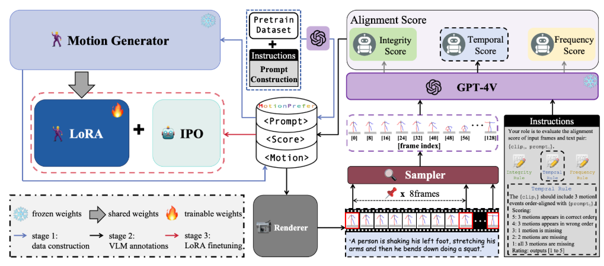
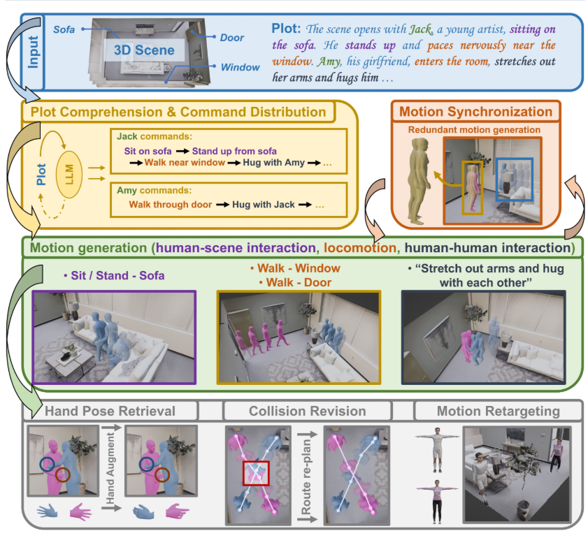

# 动作生成相关 论文总结 摘要等

<h2 tabindex="-1" class="heading-element" dir="auto" style="box-sizing: border-box; margin-top: 24px; margin-bottom: 16px; font-size: 1.5em; font-weight: 600; line-height: 1.25; padding-bottom: 0px; border-bottom: 0px; display: inline-block;">Motion Generation, Text/Speech/Music-Driven</h2><a id="user-content-motion-generation-textspeechmusic-driven" class="anchor" aria-label="Permalink: Motion Generation, Text/Speech/Music-Driven" href="https://github.com/Foruck/Awesome-Human-Motion?tab=readme-ov-file#motion-generation-textspeechmusic-driven" style="box-sizing: border-box; background-color: transparent; color: rgb(9, 105, 218); text-decoration: underline; float: left; padding-right: 4px; margin: auto; line-height: 1; position: absolute; top: 35px; left: -28px; display: flex; width: 28px; height: 28px; border-radius: 6px; opacity: 0; justify-content: center; align-items: center; transform: translateY(calc(-50% - 0.3rem)); text-underline-offset: 0.2rem;"><svg class="octicon octicon-link" viewBox="0 0 16 16" version="1.1" width="16" height="16" aria-hidden="true"><path d="m7.775 3.275 1.25-1.25a3.5 3.5 0 1 1 4.95 4.95l-2.5 2.5a3.5 3.5 0 0 1-4.95 0 .751.751 0 0 1 .018-1.042.751.751 0 0 1 1.042-.018 1.998 1.998 0 0 0 2.83 0l2.5-2.5a2.002 2.002 0 0 0-2.83-2.83l-1.25 1.25a.751.751 0 0 1-1.042-.018.751.751 0 0 1-.018-1.042Zm-4.69 9.64a1.998 1.998 0 0 0 2.83 0l1.25-1.25a.751.751 0 0 1 1.042.018.751.751 0 0 1 .018 1.042l-1.25 1.25a3.5 3.5 0 1 1-4.95-4.95l2.5-2.5a3.5 3.5 0 0 1 4.95 0 .751.751 0 0 1-.018 1.042.751.751 0 0 1-1.042.018 1.998 1.998 0 0 0-2.83 0l-2.5 2.5a1.998 1.998 0 0 0 0 2.83Z"></path></svg></a>

<slot id="details-content" pseudo="details-content" style="display: block;"><ul dir="auto" style="box-sizing: border-box; padding-left: 2em; margin-top: 0px; margin-bottom: 16px;">

<h3 tabindex="-1" class="heading-element" dir="auto" style="box-sizing: border-box; margin-top: 24px; margin-bottom: 16px; font-size: 1.25em; font-weight: 600; line-height: 1.25; display: inline-block;">2025</h3><a id="user-content-2025" class="anchor" aria-label="Permalink: 2025" href="https://github.com/Foruck/Awesome-Human-Motion?tab=readme-ov-file#2025" style="box-sizing: border-box; background-color: transparent; color: rgb(9, 105, 218); text-decoration: underline; float: left; padding-right: 4px; margin: auto; line-height: 1; position: absolute; top: 32.5px; left: -28px; display: flex; width: 28px; height: 28px; border-radius: 6px; opacity: 0; justify-content: center; align-items: center; transform: translateY(-50%); text-underline-offset: 0.2rem;"><svg class="octicon octicon-link" viewBox="0 0 16 16" version="1.1" width="16" height="16" aria-hidden="true"><path d="m7.775 3.275 1.25-1.25a3.5 3.5 0 1 1 4.95 4.95l-2.5 2.5a3.5 3.5 0 0 1-4.95 0 .751.751 0 0 1 .018-1.042.751.751 0 0 1 1.042-.018 1.998 1.998 0 0 0 2.83 0l2.5-2.5a2.002 2.002 0 0 0-2.83-2.83l-1.25 1.25a.751.751 0 0 1-1.042-.018.751.751 0 0 1-.018-1.042Zm-4.69 9.64a1.998 1.998 0 0 0 2.83 0l1.25-1.25a.751.751 0 0 1 1.042.018.751.751 0 0 1 .018 1.042l-1.25 1.25a3.5 3.5 0 1 1-4.95-4.95l2.5-2.5a3.5 3.5 0 0 1 4.95 0 .751.751 0 0 1-.018 1.042.751.751 0 0 1-1.042.018 1.998 1.998 0 0 0-2.83 0l-2.5 2.5a1.998 1.998 0 0 0 0 2.83Z"></path></svg></a>

<ul dir="auto" style="box-sizing: border-box; padding-left: 2em; margin-top: 0px; margin-bottom: 0px;"><li style="box-sizing: border-box;"><b style="box-sizing: border-box; font-weight: 600;">(TOG 2025)</b>&nbsp;<a href="https://zhongleilz.github.io/Sketch2Anim/" rel="nofollow" style="box-sizing: border-box; background-color: transparent; color: rgb(9, 105, 218); text-decoration: underline; text-underline-offset: 0.2rem;">Sketch2Anim</a>: Towards Transferring Sketch Storyboards into 3D Animation, Zhong et al.</li><li style="box-sizing: border-box; margin-top: 0.25em;"><b style="box-sizing: border-box; font-weight: 600;">(CVPR 2025)</b>&nbsp;<a href="https://arxiv.org/pdf/2505.00998" rel="nofollow" style="box-sizing: border-box; background-color: transparent; color: rgb(9, 105, 218); text-decoration: underline; text-underline-offset: 0.2rem;">DSDFM</a>: Deterministic-to-Stochastic Diverse Latent Feature Mapping for Human Motion Synthesis, Hua et al.</li><li style="box-sizing: border-box; margin-top: 0.25em;"><b style="box-sizing: border-box; font-weight: 600;">(CVPR 2025)</b>&nbsp;<a href="https://arxiv.org/abs/2504.05265" rel="nofollow" style="box-sizing: border-box; background-color: transparent; color: rgb(9, 105, 218); text-decoration: underline; text-underline-offset: 0.2rem;">From Sparse Signal to Smooth Motion</a>: Real-Time Motion Generation with Rolling Prediction Models, Barquero et al.</li><li style="box-sizing: border-box; margin-top: 0.25em;"><b style="box-sizing: border-box; font-weight: 600;">(CVPR 2025)</b>&nbsp;<a href="https://shape-move.github.io/" rel="nofollow" style="box-sizing: border-box; background-color: transparent; color: rgb(9, 105, 218); text-decoration: underline; text-underline-offset: 0.2rem;">Shape My Moves</a>: Text-Driven Shape-Aware Synthesis of Human Motions, Liao et al.</li><li style="box-sizing: border-box; margin-top: 0.25em;"><b style="box-sizing: border-box; font-weight: 600;">(CVPR 2025)</b>&nbsp;<a href="https://github.com/CVI-SZU/MG-MotionLLM" style="box-sizing: border-box; background-color: transparent; color: rgb(9, 105, 218); text-decoration: underline; text-underline-offset: 0.2rem;">MG-MotionLLM</a>: A Unified Framework for Motion Comprehension and Generation across Multiple Granularities, Wu et al.</li><li style="box-sizing: border-box; margin-top: 0.25em;"><b style="box-sizing: border-box; font-weight: 600;">(CVPR 2025)</b>&nbsp;<a href="https://seokhyeonhong.github.io/projects/salad/" rel="nofollow" style="box-sizing: border-box; background-color: transparent; color: rgb(9, 105, 218); text-decoration: underline; text-underline-offset: 0.2rem;">SALAD</a>: Skeleton-aware Latent Diffusion for Text-driven Motion Generation and Editing, Hong et al.</li><li style="box-sizing: border-box; margin-top: 0.25em;"><b style="box-sizing: border-box; font-weight: 600;">(CVPR 2025)</b>&nbsp;<a href="https://boeun-kim.github.io/page-PersonaBooth/" rel="nofollow" style="box-sizing: border-box; background-color: transparent; color: rgb(9, 105, 218); text-decoration: underline; text-underline-offset: 0.2rem;">PersonalBooth</a>: Personalized Text-to-Motion Generation, Kim et al.</li><li style="box-sizing: border-box; margin-top: 0.25em;"><b style="box-sizing: border-box; font-weight: 600;">(CVPR 2025)</b>&nbsp;<a href="https://arxiv.org/abs/2411.16575" rel="nofollow" style="box-sizing: border-box; background-color: transparent; color: rgb(9, 105, 218); text-decoration: underline; text-underline-offset: 0.2rem;">MARDM</a>: Rethinking Diffusion for Text-Driven Human Motion Generation, Meng et al.</li><li style="box-sizing: border-box; margin-top: 0.25em;"><b style="box-sizing: border-box; font-weight: 600;">(CVPR 2025)</b>&nbsp;<a href="https://arxiv.org/pdf/2503.04829" rel="nofollow" style="box-sizing: border-box; background-color: transparent; color: rgb(9, 105, 218); text-decoration: underline; text-underline-offset: 0.2rem;">StickMotion</a>: Generating 3D Human Motions by Drawing a Stickman, Wang et al.</li><li style="box-sizing: border-box; margin-top: 0.25em;"><b style="box-sizing: border-box; font-weight: 600;">(CVPR 2025)</b>&nbsp;<a href="https://arxiv.org/abs/2411.16805" rel="nofollow" style="box-sizing: border-box; background-color: transparent; color: rgb(9, 105, 218); text-decoration: underline; text-underline-offset: 0.2rem;">LLaMo</a>: Human Motion Instruction Tuning, Li et al.</li><li style="box-sizing: border-box; margin-top: 0.25em;"><b style="box-sizing: border-box; font-weight: 600;">(CVPR 2025)</b>&nbsp;<a href="https://star-uu-wang.github.io/HOP/" rel="nofollow" style="box-sizing: border-box; background-color: transparent; color: rgb(9, 105, 218); text-decoration: underline; text-underline-offset: 0.2rem;">HOP</a>: Heterogeneous Topology-based Multimodal Entanglement for Co-Speech Gesture Generation, Cheng et al.</li><li style="box-sizing: border-box; margin-top: 0.25em;"><b style="box-sizing: border-box; font-weight: 600;">(CVPR 2025)</b>&nbsp;<a href="https://atom-motion.github.io/" rel="nofollow" style="box-sizing: border-box; background-color: transparent; color: rgb(9, 105, 218); text-decoration: underline; text-underline-offset: 0.2rem;">AtoM</a>: Aligning Text-to-Motion Model at Event-Level with GPT-4Vision Reward, Han et al.</li><li style="box-sizing: border-box; margin-top: 0.25em;"><b style="box-sizing: border-box; font-weight: 600;">(CVPR 2025)</b>&nbsp;<a href="https://jiro-zhang.github.io/EnergyMoGen/" rel="nofollow" style="box-sizing: border-box; background-color: transparent; color: rgb(9, 105, 218); text-decoration: underline; text-underline-offset: 0.2rem;">EnergyMoGen</a>: Compositional Human Motion Generation with Energy-Based Diffusion Model in Latent Space, Zhang et al.</li><li style="box-sizing: border-box; margin-top: 0.25em;"><b style="box-sizing: border-box; font-weight: 600;">(CVPR 2025)</b>&nbsp;<a href="https://languageofmotion.github.io/" rel="nofollow" style="box-sizing: border-box; background-color: transparent; color: rgb(9, 105, 218); text-decoration: underline; text-underline-offset: 0.2rem;">The Languate of Motion</a>: Unifying Verbal and Non-verbal Language of 3D Human Motion, Chen et al.</li><li style="box-sizing: border-box; margin-top: 0.25em;"><b style="box-sizing: border-box; font-weight: 600;">(CVPR 2025)</b>&nbsp;<a href="https://shunlinlu.github.io/ScaMo/" rel="nofollow" style="box-sizing: border-box; background-color: transparent; color: rgb(9, 105, 218); text-decoration: underline; text-underline-offset: 0.2rem;">ScaMo</a>: Exploring the Scaling Law in Autoregressive Motion Generation Model, Lu et al.</li><li style="box-sizing: border-box; margin-top: 0.25em;"><b style="box-sizing: border-box; font-weight: 600;">(CVPR 2025)</b>&nbsp;<a href="https://hhsinping.github.io/Move-in-2D/" rel="nofollow" style="box-sizing: border-box; background-color: transparent; color: rgb(9, 105, 218); text-decoration: underline; text-underline-offset: 0.2rem;">Move in 2D</a>: 2D-Conditioned Human Motion Generation, Huang et al.</li><li style="box-sizing: border-box; margin-top: 0.25em;"><b style="box-sizing: border-box; font-weight: 600;">(CVPR 2025)</b>&nbsp;<a href="https://solami-ai.github.io/" rel="nofollow" style="box-sizing: border-box; background-color: transparent; color: rgb(9, 105, 218); text-decoration: underline; text-underline-offset: 0.2rem;">SOLAMI</a>: Social Vision-Language-Action Modeling for Immersive Interaction with 3D Autonomous Characters, Jiang et al.</li><li style="box-sizing: border-box; margin-top: 0.25em;"><b style="box-sizing: border-box; font-weight: 600;">(CVPR 2025)</b>&nbsp;<a href="https://lijiaman.github.io/projects/mvlift/" rel="nofollow" style="box-sizing: border-box; background-color: transparent; color: rgb(9, 105, 218); text-decoration: underline; text-underline-offset: 0.2rem;">MVLift</a>: Lifting Motion to the 3D World via 2D Diffusion, Li et al.</li><li style="box-sizing: border-box; margin-top: 0.25em;"><b style="box-sizing: border-box; font-weight: 600;">(CVPR 2025 Workshop)</b>&nbsp;<a href="https://arxiv.org/pdf/2505.09827" rel="nofollow" style="box-sizing: border-box; background-color: transparent; color: rgb(9, 105, 218); text-decoration: underline; text-underline-offset: 0.2rem;">Dyadic Mamba</a>: Long-term Dyadic Human Motion Synthesis, Tanke et al.</li><li style="box-sizing: border-box; margin-top: 0.25em;"><b style="box-sizing: border-box; font-weight: 600;">(ACM Sensys 2025)</b>&nbsp;<a href="https://arxiv.org/pdf/2503.01768" rel="nofollow" style="box-sizing: border-box; background-color: transparent; color: rgb(9, 105, 218); text-decoration: underline; text-underline-offset: 0.2rem;">SHADE-AD</a>: An LLM-Based Framework for Synthesizing Activity Data of Alzheimer’s Patients, Fu et al.</li><li style="box-sizing: border-box; margin-top: 0.25em;"><b style="box-sizing: border-box; font-weight: 600;">(ICRA 2025)</b>&nbsp;<a href="https://arxiv.org/abs/2410.16623" rel="nofollow" style="box-sizing: border-box; background-color: transparent; color: rgb(9, 105, 218); text-decoration: underline; text-underline-offset: 0.2rem;">MotionGlot</a>: A Multi-Embodied Motion Generation Model, Harithas et al.</li><li style="box-sizing: border-box; margin-top: 0.25em;"><b style="box-sizing: border-box; font-weight: 600;">(ICLR 2025)</b>&nbsp;<a href="https://guytevet.github.io/CLoSD-page/" rel="nofollow" style="box-sizing: border-box; background-color: transparent; color: rgb(9, 105, 218); text-decoration: underline; text-underline-offset: 0.2rem;">CLoSD</a>: Closing the Loop between Simulation and Diffusion for multi-task character control, Tevet et al.</li><li style="box-sizing: border-box; margin-top: 0.25em;"><b style="box-sizing: border-box; font-weight: 600;">(ICLR 2025)</b>&nbsp;<a href="https://genforce.github.io/PedGen/" rel="nofollow" style="box-sizing: border-box; background-color: transparent; color: rgb(9, 105, 218); text-decoration: underline; text-underline-offset: 0.2rem;">PedGen</a>: Learning to Generate Diverse Pedestrian Movements from Web Videos with Noisy Labels, Liu et al.</li><li style="box-sizing: border-box; margin-top: 0.25em;"><b style="box-sizing: border-box; font-weight: 600;">(ICLR 2025)</b>&nbsp;<a href="https://openreview.net/forum?id=IEul1M5pyk" rel="nofollow" style="box-sizing: border-box; background-color: transparent; color: rgb(9, 105, 218); text-decoration: underline; text-underline-offset: 0.2rem;">HGM³</a>: Hierarchical Generative Masked Motion Modeling with Hard Token Mining, Jeong et al.</li><li style="box-sizing: border-box; margin-top: 0.25em;"><b style="box-sizing: border-box; font-weight: 600;">(ICLR 2025)</b>&nbsp;<a href="https://openreview.net/forum?id=LYawG8YkPa" rel="nofollow" style="box-sizing: border-box; background-color: transparent; color: rgb(9, 105, 218); text-decoration: underline; text-underline-offset: 0.2rem;">LaMP</a>: Language-Motion Pretraining for Motion Generation, Retrieval, and Captioning, Li et al.</li><li style="box-sizing: border-box; margin-top: 0.25em;"><b style="box-sizing: border-box; font-weight: 600;">(ICLR 2025)</b>&nbsp;<a href="https://openreview.net/forum?id=d23EVDRJ6g" rel="nofollow" style="box-sizing: border-box; background-color: transparent; color: rgb(9, 105, 218); text-decoration: underline; text-underline-offset: 0.2rem;">MotionDreamer</a>: One-to-Many Motion Synthesis with Localized Generative Masked Transformer, Wang et al.</li><li style="box-sizing: border-box; margin-top: 0.25em;"><b style="box-sizing: border-box; font-weight: 600;">(ICLR 2025)</b>&nbsp;<a href="https://openreview.net/forum?id=Oh8MuCacJW" rel="nofollow" style="box-sizing: border-box; background-color: transparent; color: rgb(9, 105, 218); text-decoration: underline; text-underline-offset: 0.2rem;">Lyu et al</a>: Towards Unified Human Motion-Language Understanding via Sparse Interpretable Characterization, Lyu et al.</li><li style="box-sizing: border-box; margin-top: 0.25em;"><b style="box-sizing: border-box; font-weight: 600;">(ICLR 2025)</b>&nbsp;<a href="https://zkf1997.github.io/DART/" rel="nofollow" style="box-sizing: border-box; background-color: transparent; color: rgb(9, 105, 218); text-decoration: underline; text-underline-offset: 0.2rem;">DART</a>: A Diffusion-Based Autoregressive Motion Model for Real-Time Text-Driven Motion Control, Zhao et al.</li><li style="box-sizing: border-box; margin-top: 0.25em;"><b style="box-sizing: border-box; font-weight: 600;">(ICLR 2025)</b>&nbsp;<a href="https://knoxzhao.github.io/Motion-Agent/" rel="nofollow" style="box-sizing: border-box; background-color: transparent; color: rgb(9, 105, 218); text-decoration: underline; text-underline-offset: 0.2rem;">Motion-Agent</a>: A Conversational Framework for Human Motion Generation with LLMs, Wu et al.</li><li style="box-sizing: border-box; margin-top: 0.25em;"><b style="box-sizing: border-box; font-weight: 600;">(IJCV 2025)</b>&nbsp;<a href="https://arxiv.org/pdf/2502.05534" rel="nofollow" style="box-sizing: border-box; background-color: transparent; color: rgb(9, 105, 218); text-decoration: underline; text-underline-offset: 0.2rem;">Fg-T2M++</a>: LLMs-Augmented Fine-Grained Text Driven Human Motion Generation, Wang et al.</li><li style="box-sizing: border-box; margin-top: 0.25em;"><b style="box-sizing: border-box; font-weight: 600;">(ArXiv 2025)</b>&nbsp;<a href="https://arxiv.org/pdf/2505.08293" rel="nofollow" style="box-sizing: border-box; background-color: transparent; color: rgb(9, 105, 218); text-decoration: underline; text-underline-offset: 0.2rem;">M3G</a>: Multi-Granular Gesture Generator for Audio-Driven Full-Body Human Motion Synthesis, Yin et al.</li><li style="box-sizing: border-box; margin-top: 0.25em;"><b style="box-sizing: border-box; font-weight: 600;">(ArXiv 2025)</b>&nbsp;<a href="https://arxiv.org/pdf/2505.05589" rel="nofollow" style="box-sizing: border-box; background-color: transparent; color: rgb(9, 105, 218); text-decoration: underline; text-underline-offset: 0.2rem;">ReactDance</a>: Progressive-Granular Representation for Long-Term Coherent Reactive Dance Generation, Lin et al.</li><li style="box-sizing: border-box; margin-top: 0.25em;"><b style="box-sizing: border-box; font-weight: 600;">(ArXiv 2025)</b>&nbsp;<a href="https://wengwanjiang.github.io/ReAlign-page/" rel="nofollow" style="box-sizing: border-box; background-color: transparent; color: rgb(9, 105, 218); text-decoration: underline; text-underline-offset: 0.2rem;">ReAlign</a>: Bilingual Text-to-Motion Generation via Step-Aware Reward-Guided Alignment, Weng et al.</li><li style="box-sizing: border-box; margin-top: 0.25em;"><b style="box-sizing: border-box; font-weight: 600;">(ArXiv 2025)</b>&nbsp;<a href="https://research.nvidia.com/labs/dair/genmo/" rel="nofollow" style="box-sizing: border-box; background-color: transparent; color: rgb(9, 105, 218); text-decoration: underline; text-underline-offset: 0.2rem;">GENMO</a>: A GENeralist Model for Human MOtion, Li et al.</li><li style="box-sizing: border-box; margin-top: 0.25em;"><b style="box-sizing: border-box; font-weight: 600;">(ArXiv 2025)</b>&nbsp;<a href="https://arxiv.org/pdf/2504.16722" rel="nofollow" style="box-sizing: border-box; background-color: transparent; color: rgb(9, 105, 218); text-decoration: underline; text-underline-offset: 0.2rem;">ProMoGen</a>: PMG: Progressive Motion Generation via Sparse Anchor Postures Curriculum Learning, Xi et al.</li><li style="box-sizing: border-box; margin-top: 0.25em;"><b style="box-sizing: border-box; font-weight: 600;">(ArXiv 2025)</b>&nbsp;<a href="https://xiangyuezhang.com/SemTalk/" rel="nofollow" style="box-sizing: border-box; background-color: transparent; color: rgb(9, 105, 218); text-decoration: underline; text-underline-offset: 0.2rem;">SemTalk</a>: Holistic Co-speech Motion Generation with Frame-level Semantic Emphasis, Zhang et al.</li><li style="box-sizing: border-box; margin-top: 0.25em;"><b style="box-sizing: border-box; font-weight: 600;">(ArXiv 2025)</b>&nbsp;<a href="https://foram-s1.github.io/DanceMosaic/" rel="nofollow" style="box-sizing: border-box; background-color: transparent; color: rgb(9, 105, 218); text-decoration: underline; text-underline-offset: 0.2rem;">DanceMosaic</a>: High-Fidelity Dance Generation with Multimodal Editability, Shah et al.</li><li style="box-sizing: border-box; margin-top: 0.25em;"><b style="box-sizing: border-box; font-weight: 600;">(ArXiv 2025)</b>&nbsp;<a href="https://yong-xie-xy.github.io/ReCoM/" rel="nofollow" style="box-sizing: border-box; background-color: transparent; color: rgb(9, 105, 218); text-decoration: underline; text-underline-offset: 0.2rem;">ReCoM</a>: Realistic Co-Speech Motion Generation with Recurrent Embedded Transformer, Xie et al.</li><li style="box-sizing: border-box; margin-top: 0.25em;"><b style="box-sizing: border-box; font-weight: 600;">(ArXiv 2025)</b>&nbsp;<a href="https://yz-cnsdqz.github.io/eigenmotion/PRIMAL/" rel="nofollow" style="box-sizing: border-box; background-color: transparent; color: rgb(9, 105, 218); text-decoration: underline; text-underline-offset: 0.2rem;">PRIMAL</a>: Physically Reactive and Interactive Motor Model for Avatar Learning, Zhang et al.</li><li style="box-sizing: border-box; margin-top: 0.25em;"><b style="box-sizing: border-box; font-weight: 600;">(ArXiv 2025)</b>&nbsp;<a href="https://www.pinlab.org/hmu" rel="nofollow" style="box-sizing: border-box; background-color: transparent; color: rgb(9, 105, 218); text-decoration: underline; text-underline-offset: 0.2rem;">HMU</a>: Human Motion Unlearning, Matteis et al.</li><li style="box-sizing: border-box; margin-top: 0.25em;"><b style="box-sizing: border-box; font-weight: 600;">(ArXiv 2025)</b>&nbsp;<a href="http://inwoohwang.me/SFControl" rel="nofollow" style="box-sizing: border-box; background-color: transparent; color: rgb(9, 105, 218); text-decoration: underline; text-underline-offset: 0.2rem;">SFControl</a>: Motion Synthesis with Sparse and Flexible Keyjoint Control, Hwang et al.</li><li style="box-sizing: border-box; margin-top: 0.25em;"><b style="box-sizing: border-box; font-weight: 600;">(ArXiv 2025)</b>&nbsp;<a href="https://arxiv.org/pdf/2503.14919" rel="nofollow" style="box-sizing: border-box; background-color: transparent; color: rgb(9, 105, 218); text-decoration: underline; text-underline-offset: 0.2rem;">GenM3</a>: Generative Pretrained Multi-path Motion Model for Text Conditional Human Motion Generation, Shi et al.</li><li style="box-sizing: border-box; margin-top: 0.25em;"><b style="box-sizing: border-box; font-weight: 600;">(ArXiv 2025)</b>&nbsp;<a href="https://zju3dv.github.io/MotionStreamer/" rel="nofollow" style="box-sizing: border-box; background-color: transparent; color: rgb(9, 105, 218); text-decoration: underline; text-underline-offset: 0.2rem;">MotionStreamer</a>: Streaming Motion Generation via Diffusion-based Autoregressive Model in Causal Latent Space, Xiao et al.</li><li style="box-sizing: border-box; margin-top: 0.25em;"><b style="box-sizing: border-box; font-weight: 600;">(ArXiv 2025)</b>&nbsp;<a href="https://arxiv.org/pdf/2503.13859" rel="nofollow" style="box-sizing: border-box; background-color: transparent; color: rgb(9, 105, 218); text-decoration: underline; text-underline-offset: 0.2rem;">Less Is More</a>: Improving Motion Diffusion Models with Sparse Keyframes, Bae et al.</li><li style="box-sizing: border-box; margin-top: 0.25em;"><b style="box-sizing: border-box; font-weight: 600;">(ArXiv 2025)</b>&nbsp;<a href="https://arxiv.org/pdf/2503.13300" rel="nofollow" style="box-sizing: border-box; background-color: transparent; color: rgb(9, 105, 218); text-decoration: underline; text-underline-offset: 0.2rem;">Zeng et al</a>: Progressive Human Motion Generation Based on Text and Few Motion Frames, Zeng et al.</li><li style="box-sizing: border-box; margin-top: 0.25em;"><b style="box-sizing: border-box; font-weight: 600;">(ArXiv 2025)</b>&nbsp;<a href="https://mjwei3d.github.io/ACMo/" rel="nofollow" style="box-sizing: border-box; background-color: transparent; color: rgb(9, 105, 218); text-decoration: underline; text-underline-offset: 0.2rem;">ACMo</a>: Attribute Controllable Motion Generation, Wei et al.</li><li style="box-sizing: border-box; margin-top: 0.25em;"><b style="box-sizing: border-box; font-weight: 600;">(ArXiv 2025)</b>&nbsp;<a href="https://jackyu6.github.io/HERO/" rel="nofollow" style="box-sizing: border-box; background-color: transparent; color: rgb(9, 105, 218); text-decoration: underline; text-underline-offset: 0.2rem;">HERO</a>: Human Reaction Generation from Videos, Yu et al.</li><li style="box-sizing: border-box; margin-top: 0.25em;"><b style="box-sizing: border-box; font-weight: 600;">(ArXiv 2025)</b>&nbsp;<a href="https://arxiv.org/pdf/2503.06151" rel="nofollow" style="box-sizing: border-box; background-color: transparent; color: rgb(9, 105, 218); text-decoration: underline; text-underline-offset: 0.2rem;">BioMoDiffuse</a>: Physics-Guided Biomechanical Diffusion for Controllable and Authentic Human Motion Synthesis, Kang et al.</li><li style="box-sizing: border-box; margin-top: 0.25em;"><b style="box-sizing: border-box; font-weight: 600;">(ArXiv 2025)</b>&nbsp;<a href="https://arxiv.org/pdf/2503.06499" rel="nofollow" style="box-sizing: border-box; background-color: transparent; color: rgb(9, 105, 218); text-decoration: underline; text-underline-offset: 0.2rem;">ExGes</a>: Expressive Human Motion Retrieval and Modulation for Audio-Driven Gesture Synthesis, Zhou et al.</li><li style="box-sizing: border-box; margin-top: 0.25em;"><b style="box-sizing: border-box; font-weight: 600;">(ArXiv 2025)</b>&nbsp;<a href="https://arxiv.org/pdf/2502.17327" rel="nofollow" style="box-sizing: border-box; background-color: transparent; color: rgb(9, 105, 218); text-decoration: underline; text-underline-offset: 0.2rem;">AnyTop</a>: Character Animation Diffusion with Any Topology, Gat et al.</li><li style="box-sizing: border-box; margin-top: 0.25em;"><b style="box-sizing: border-box; font-weight: 600;">(ArXiv 2025)</b>&nbsp;Motion Anything: Any to Motion Generation, Zhang et al.</li><li style="box-sizing: border-box; margin-top: 0.25em;"><b style="box-sizing: border-box; font-weight: 600;">(ArXiv 2025)</b>&nbsp;<a href="https://arxiv.org/pdf/2502.18309" rel="nofollow" style="box-sizing: border-box; background-color: transparent; color: rgb(9, 105, 218); text-decoration: underline; text-underline-offset: 0.2rem;">GCDance</a>: Genre-Controlled 3D Full Body Dance Generation Driven By Music, Liu et al.</li><li style="box-sizing: border-box; margin-top: 0.25em;"><b style="box-sizing: border-box; font-weight: 600;">(ArXiv 2025)</b>&nbsp;<a href="https://diouo.github.io/motionlab.github.io/" rel="nofollow" style="box-sizing: border-box; background-color: transparent; color: rgb(9, 105, 218); text-decoration: underline; text-underline-offset: 0.2rem;">MotionLab</a>: Unified Human Motion Generation and Editing via the Motion-Condition-Motion Paradigm, Guo et al.</li><li style="box-sizing: border-box; margin-top: 0.25em;"><b style="box-sizing: border-box; font-weight: 600;">(ArXiv 2025)</b>&nbsp;<a href="https://cjerry1243.github.io/casim_t2m/" rel="nofollow" style="box-sizing: border-box; background-color: transparent; color: rgb(9, 105, 218); text-decoration: underline; text-underline-offset: 0.2rem;">CASIM</a>: Composite Aware Semantic Injection for Text to Motion Generation, Chang et al.</li><li style="box-sizing: border-box; margin-top: 0.25em;"><b style="box-sizing: border-box; font-weight: 600;">(ArXiv 2025)</b>&nbsp;<a href="https://arxiv.org/pdf/2501.19083" rel="nofollow" style="box-sizing: border-box; background-color: transparent; color: rgb(9, 105, 218); text-decoration: underline; text-underline-offset: 0.2rem;">MotionPCM</a>: Real-Time Motion Synthesis with Phased Consistency Model, Jiang et al.</li><li style="box-sizing: border-box; margin-top: 0.25em;"><b style="box-sizing: border-box; font-weight: 600;">(ArXiv 2025)</b>&nbsp;<a href="https://andypinxinliu.github.io/GestureLSM/" rel="nofollow" style="box-sizing: border-box; background-color: transparent; color: rgb(9, 105, 218); text-decoration: underline; text-underline-offset: 0.2rem;">GestureLSM</a>: Latent Shortcut based Co-Speech Gesture Generation with Spatial-Temporal Modeling, Liu et al.</li><li style="box-sizing: border-box; margin-top: 0.25em;"><b style="box-sizing: border-box; font-weight: 600;">(ArXiv 2025)</b>&nbsp;<a href="https://arxiv.org/pdf/2501.18232" rel="nofollow" style="box-sizing: border-box; background-color: transparent; color: rgb(9, 105, 218); text-decoration: underline; text-underline-offset: 0.2rem;">Free-T2M</a>: Frequency Enhanced Text-to-Motion Diffusion Model With Consistency Loss, Chen et al.</li><li style="box-sizing: border-box; margin-top: 0.25em;"><b style="box-sizing: border-box; font-weight: 600;">(ArXiv 2025)</b>&nbsp;<a href="https://arxiv.org/pdf/2501.01449" rel="nofollow" style="box-sizing: border-box; background-color: transparent; color: rgb(9, 105, 218); text-decoration: underline; text-underline-offset: 0.2rem;">LS-GAN</a>: Human Motion Synthesis with Latent-space GANs, Amballa et al.</li><li style="box-sizing: border-box; margin-top: 0.25em;"><b style="box-sizing: border-box; font-weight: 600;">(ArXiv 2025)</b>&nbsp;<a href="https://arxiv.org/html/2501.16778v1" rel="nofollow" style="box-sizing: border-box; background-color: transparent; color: rgb(9, 105, 218); text-decoration: underline; text-underline-offset: 0.2rem;">FlexMotion</a>: Lightweight, Physics-Aware, and Controllable Human Motion Generation, Tashakori et al.</li><li style="box-sizing: border-box; margin-top: 0.25em;"><b style="box-sizing: border-box; font-weight: 600;">(ArXiv 2025)</b>&nbsp;<a href="https://arxiv.org/pdf/2503.06897" rel="nofollow" style="box-sizing: border-box; background-color: transparent; color: rgb(9, 105, 218); text-decoration: underline; text-underline-offset: 0.2rem;">HiSTF Mamba</a>: Hierarchical Spatiotemporal Fusion with Multi-Granular Body-Spatial Modeling for High-Fidelity Text-to-Motion Generation, Zhan et al.</li><li style="box-sizing: border-box; margin-top: 0.25em;"><b style="box-sizing: border-box; font-weight: 600;">(ArXiv 2025)</b>&nbsp;<a href="https://arxiv.org/pdf/2501.16551" rel="nofollow" style="box-sizing: border-box; background-color: transparent; color: rgb(9, 105, 218); text-decoration: underline; text-underline-offset: 0.2rem;">PackDiT</a>: Joint Human Motion and Text Generation via Mutual Prompting, Jiang et al.</li><li style="box-sizing: border-box; margin-top: 0.25em;"><b style="box-sizing: border-box; font-weight: 600;">(3DV 2025)</b>&nbsp;<a href="https://coral79.github.io/uni-motion/" rel="nofollow" style="box-sizing: border-box; background-color: transparent; color: rgb(9, 105, 218); text-decoration: underline; text-underline-offset: 0.2rem;">Unimotion</a>: Unifying 3D Human Motion Synthesis and Understanding, Li et al.</li><li style="box-sizing: border-box; margin-top: 0.25em;"><b style="box-sizing: border-box; font-weight: 600;">(3DV 2025)</b>&nbsp;<a href="https://cyk990422.github.io/HoloGest.github.io//" rel="nofollow" style="box-sizing: border-box; background-color: transparent; color: rgb(9, 105, 218); text-decoration: underline; text-underline-offset: 0.2rem;">HoloGest</a>: Decoupled Diffusion and Motion Priors for Generating Holisticly Expressive Co-speech Gestures, Cheng et al.</li><li style="box-sizing: border-box; margin-top: 0.25em;"><b style="box-sizing: border-box; font-weight: 600;">(AAAI 2025)</b>&nbsp;<a href="https://hanyangclarence.github.io/unimumo_demo/" rel="nofollow" style="box-sizing: border-box; background-color: transparent; color: rgb(9, 105, 218); text-decoration: underline; text-underline-offset: 0.2rem;">UniMuMo</a>: Unified Text, Music and Motion Generation, Yang et al.</li><li style="box-sizing: border-box; margin-top: 0.25em;"><b style="box-sizing: border-box; font-weight: 600;">(AAAI 2025)</b>&nbsp;<a href="https://arxiv.org/abs/2408.00352" rel="nofollow" style="box-sizing: border-box; background-color: transparent; color: rgb(9, 105, 218); text-decoration: underline; text-underline-offset: 0.2rem;">ALERT-Motion</a>: Autonomous LLM-Enhanced Adversarial Attack for Text-to-Motion, Miao et al.</li><li style="box-sizing: border-box; margin-top: 0.25em;"><b style="box-sizing: border-box; font-weight: 600;">(AAAI 2025)</b>&nbsp;<a href="https://cure-lab.github.io/MotionCraft/" rel="nofollow" style="box-sizing: border-box; background-color: transparent; color: rgb(9, 105, 218); text-decoration: underline; text-underline-offset: 0.2rem;">MotionCraft</a>: Crafting Whole-Body Motion with Plug-and-Play Multimodal Controls, Bian et al.</li><li style="box-sizing: border-box; margin-top: 0.25em;"><b style="box-sizing: border-box; font-weight: 600;">(AAAI 2025)</b>&nbsp;<a href="https://arxiv.org/pdf/2412.11193" rel="nofollow" style="box-sizing: border-box; background-color: transparent; color: rgb(9, 105, 218); text-decoration: underline; text-underline-offset: 0.2rem;">Light-T2M</a>: A Lightweight and Fast Model for Text-to-Motion Generation, Zeng et al.</li><li style="box-sizing: border-box; margin-top: 0.25em;"><b style="box-sizing: border-box; font-weight: 600;">(WACV 2025)</b>&nbsp;<a href="https://reindiffuse.github.io/" rel="nofollow" style="box-sizing: border-box; background-color: transparent; color: rgb(9, 105, 218); text-decoration: underline; text-underline-offset: 0.2rem;">ReinDiffuse</a>: Crafting Physically Plausible Motions with Reinforced Diffusion Model, Han et al.</li><li style="box-sizing: border-box; margin-top: 0.25em;"><b style="box-sizing: border-box; font-weight: 600;">(WACV 2025)</b>&nbsp;<a href="https://motion-rag.github.io/" rel="nofollow" style="box-sizing: border-box; background-color: transparent; color: rgb(9, 105, 218); text-decoration: underline; text-underline-offset: 0.2rem;">MoRAG</a>: Multi-Fusion Retrieval Augmented Generation for Human Motion, Shashank et al.</li><li style="box-sizing: border-box; margin-top: 0.25em;"><b style="box-sizing: border-box; font-weight: 600;">(WACV 2025)</b>&nbsp;<a href="https://arxiv.org/abs/2409.11920" rel="nofollow" style="box-sizing: border-box; background-color: transparent; color: rgb(9, 105, 218); text-decoration: underline; text-underline-offset: 0.2rem;">Mandelli et al</a>: Generation of Complex 3D Human Motion by Temporal and Spatial Composition of Diffusion Models, Mandelli et al.</li></ul>

<h3 tabindex="-1" class="heading-element" dir="auto" style="box-sizing: border-box; margin-top: 24px; margin-bottom: 16px; font-size: 1.25em; font-weight: 600; line-height: 1.25; display: inline-block;">2024</h3><a id="user-content-2024" class="anchor" aria-label="Permalink: 2024" href="https://github.com/Foruck/Awesome-Human-Motion?tab=readme-ov-file#2024" style="box-sizing: border-box; background-color: transparent; color: rgb(9, 105, 218); text-decoration: underline; float: left; padding-right: 4px; margin: auto; line-height: 1; position: absolute; top: 32.5px; left: -28px; display: flex; width: 28px; height: 28px; border-radius: 6px; opacity: 0; justify-content: center; align-items: center; transform: translateY(-50%); text-underline-offset: 0.2rem;"><svg class="octicon octicon-link" viewBox="0 0 16 16" version="1.1" width="16" height="16" aria-hidden="true"><path d="m7.775 3.275 1.25-1.25a3.5 3.5 0 1 1 4.95 4.95l-2.5 2.5a3.5 3.5 0 0 1-4.95 0 .751.751 0 0 1 .018-1.042.751.751 0 0 1 1.042-.018 1.998 1.998 0 0 0 2.83 0l2.5-2.5a2.002 2.002 0 0 0-2.83-2.83l-1.25 1.25a.751.751 0 0 1-1.042-.018.751.751 0 0 1-.018-1.042Zm-4.69 9.64a1.998 1.998 0 0 0 2.83 0l1.25-1.25a.751.751 0 0 1 1.042.018.751.751 0 0 1 .018 1.042l-1.25 1.25a3.5 3.5 0 1 1-4.95-4.95l2.5-2.5a3.5 3.5 0 0 1 4.95 0 .751.751 0 0 1-.018 1.042.751.751 0 0 1-1.042.018 1.998 1.998 0 0 0-2.83 0l-2.5 2.5a1.998 1.998 0 0 0 0 2.83Z"></path></svg></a>

<ul dir="auto" style="box-sizing: border-box; padding-left: 2em; margin-top: 0px; margin-bottom: 0px;"><li style="box-sizing: border-box;"><b style="box-sizing: border-box; font-weight: 600;"></b></li><li style="box-sizing: border-box; margin-top: 0.25em;"><b style="box-sizing: border-box; font-weight: 600;"></b></li><li style="box-sizing: border-box; margin-top: 0.25em;"><b style="box-sizing: border-box; font-weight: 600;"></b></li><li style="box-sizing: border-box; margin-top: 0.25em;"><b style="box-sizing: border-box; font-weight: 600;"></b></li><li style="box-sizing: border-box; margin-top: 0.25em;"><b style="box-sizing: border-box; font-weight: 600;"></b></li><li style="box-sizing: border-box; margin-top: 0.25em;"><b style="box-sizing: border-box; font-weight: 600;"></b></li><li style="box-sizing: border-box; margin-top: 0.25em;"><b style="box-sizing: border-box; font-weight: 600;"></b></li><li style="box-sizing: border-box; margin-top: 0.25em;"><b style="box-sizing: border-box; font-weight: 600;"></b></li><li style="box-sizing: border-box; margin-top: 0.25em;"><b style="box-sizing: border-box; font-weight: 600;"></b></li><li style="box-sizing: border-box; margin-top: 0.25em;"><b style="box-sizing: border-box; font-weight: 600;"></b></li><li style="box-sizing: border-box; margin-top: 0.25em;"><b style="box-sizing: border-box; font-weight: 600;"></b></li><li style="box-sizing: border-box; margin-top: 0.25em;"><b style="box-sizing: border-box; font-weight: 600;"></b></li><li style="box-sizing: border-box; margin-top: 0.25em;"><b style="box-sizing: border-box; font-weight: 600;"></b></li><li style="box-sizing: border-box; margin-top: 0.25em;"><b style="box-sizing: border-box; font-weight: 600;"></b></li><li style="box-sizing: border-box; margin-top: 0.25em;"><b style="box-sizing: border-box; font-weight: 600;"></b></li><li style="box-sizing: border-box; margin-top: 0.25em;"><b style="box-sizing: border-box; font-weight: 600;"></b></li><li style="box-sizing: border-box; margin-top: 0.25em;"><b style="box-sizing: border-box; font-weight: 600;"></b></li><li style="box-sizing: border-box; margin-top: 0.25em;"><b style="box-sizing: border-box; font-weight: 600;"></b></li><li style="box-sizing: border-box; margin-top: 0.25em;"><b style="box-sizing: border-box; font-weight: 600;"></b></li><li style="box-sizing: border-box; margin-top: 0.25em;"><b style="box-sizing: border-box; font-weight: 600;"></b></li><li style="box-sizing: border-box; margin-top: 0.25em;"><b style="box-sizing: border-box; font-weight: 600;"></b></li><li style="box-sizing: border-box; margin-top: 0.25em;"><b style="box-sizing: border-box; font-weight: 600;"></b></li><li style="box-sizing: border-box; margin-top: 0.25em;"><b style="box-sizing: border-box; font-weight: 600;"></b></li><li style="box-sizing: border-box; margin-top: 0.25em;"><b style="box-sizing: border-box; font-weight: 600;"></b></li><li style="box-sizing: border-box; margin-top: 0.25em;"><b style="box-sizing: border-box; font-weight: 600;"></b></li><li style="box-sizing: border-box; margin-top: 0.25em;"><b style="box-sizing: border-box; font-weight: 600;"></b></li><li style="box-sizing: border-box; margin-top: 0.25em;"><b style="box-sizing: border-box; font-weight: 600;"></b></li><li style="box-sizing: border-box; margin-top: 0.25em;"><b style="box-sizing: border-box; font-weight: 600;"></b></li><li style="box-sizing: border-box; margin-top: 0.25em;"><b style="box-sizing: border-box; font-weight: 600;"></b></li><li style="box-sizing: border-box; margin-top: 0.25em;"><b style="box-sizing: border-box; font-weight: 600;"></b></li><li style="box-sizing: border-box; margin-top: 0.25em;"><b style="box-sizing: border-box; font-weight: 600;"></b></li><li style="box-sizing: border-box; margin-top: 0.25em;"><b style="box-sizing: border-box; font-weight: 600;"></b></li><li style="box-sizing: border-box; margin-top: 0.25em;"><b style="box-sizing: border-box; font-weight: 600;"></b></li><li style="box-sizing: border-box; margin-top: 0.25em;"><b style="box-sizing: border-box; font-weight: 600;"></b></li><li style="box-sizing: border-box; margin-top: 0.25em;"><b style="box-sizing: border-box; font-weight: 600;"></b></li><li style="box-sizing: border-box; margin-top: 0.25em;"><b style="box-sizing: border-box; font-weight: 600;"></b></li><li style="box-sizing: border-box; margin-top: 0.25em;"><b style="box-sizing: border-box; font-weight: 600;"></b></li><li style="box-sizing: border-box; margin-top: 0.25em;"><b style="box-sizing: border-box; font-weight: 600;"></b></li><li style="box-sizing: border-box; margin-top: 0.25em;"><b style="box-sizing: border-box; font-weight: 600;"></b></li><li style="box-sizing: border-box; margin-top: 0.25em;"><b style="box-sizing: border-box; font-weight: 600;"></b></li><li style="box-sizing: border-box; margin-top: 0.25em;"><b style="box-sizing: border-box; font-weight: 600;"></b></li><li style="box-sizing: border-box; margin-top: 0.25em;"><b style="box-sizing: border-box; font-weight: 600;"></b></li><li style="box-sizing: border-box; margin-top: 0.25em;"><b style="box-sizing: border-box; font-weight: 600;"></b></li><li style="box-sizing: border-box; margin-top: 0.25em;"><b style="box-sizing: border-box; font-weight: 600;"></b></li><li style="box-sizing: border-box; margin-top: 0.25em;"><b style="box-sizing: border-box; font-weight: 600;"></b></li><li style="box-sizing: border-box; margin-top: 0.25em;"><b style="box-sizing: border-box; font-weight: 600;"></b></li><li style="box-sizing: border-box; margin-top: 0.25em;"><b style="box-sizing: border-box; font-weight: 600;"></b></li><li style="box-sizing: border-box; margin-top: 0.25em;"><b style="box-sizing: border-box; font-weight: 600;"></b></li><li style="box-sizing: border-box; margin-top: 0.25em;"><b style="box-sizing: border-box; font-weight: 600;"></b></li><li style="box-sizing: border-box; margin-top: 0.25em;"><b style="box-sizing: border-box; font-weight: 600;"></b></li><li style="box-sizing: border-box; margin-top: 0.25em;"><b style="box-sizing: border-box; font-weight: 600;"></b></li><li style="box-sizing: border-box; margin-top: 0.25em;"><b style="box-sizing: border-box; font-weight: 600;"></b></li><li style="box-sizing: border-box; margin-top: 0.25em;"><b style="box-sizing: border-box; font-weight: 600;"></b></li><li style="box-sizing: border-box; margin-top: 0.25em;"><b style="box-sizing: border-box; font-weight: 600;"></b></li><li style="box-sizing: border-box; margin-top: 0.25em;"><b style="box-sizing: border-box; font-weight: 600;"></b></li><li style="box-sizing: border-box; margin-top: 0.25em;"><b style="box-sizing: border-box; font-weight: 600;"></b></li><li style="box-sizing: border-box; margin-top: 0.25em;"><b style="box-sizing: border-box; font-weight: 600;"></b></li><li style="box-sizing: border-box; margin-top: 0.25em;"><b style="box-sizing: border-box; font-weight: 600;"></b></li><li style="box-sizing: border-box; margin-top: 0.25em;"><b style="box-sizing: border-box; font-weight: 600;"></b></li><li style="box-sizing: border-box; margin-top: 0.25em;"><b style="box-sizing: border-box; font-weight: 600;"></b></li><li style="box-sizing: border-box; margin-top: 0.25em;"><b style="box-sizing: border-box; font-weight: 600;"></b></li><li style="box-sizing: border-box; margin-top: 0.25em;"><b style="box-sizing: border-box; font-weight: 600;"></b></li><li style="box-sizing: border-box; margin-top: 0.25em;"><b style="box-sizing: border-box; font-weight: 600;"></b></li><li style="box-sizing: border-box; margin-top: 0.25em;"><b style="box-sizing: border-box; font-weight: 600;"></b></li><li style="box-sizing: border-box; margin-top: 0.25em;"><b style="box-sizing: border-box; font-weight: 600;"></b></li><li style="box-sizing: border-box; margin-top: 0.25em;"><b style="box-sizing: border-box; font-weight: 600;"></b></li><li style="box-sizing: border-box; margin-top: 0.25em;"><b style="box-sizing: border-box; font-weight: 600;"></b></li><li style="box-sizing: border-box; margin-top: 0.25em;"><b style="box-sizing: border-box; font-weight: 600;"></b></li><li style="box-sizing: border-box; margin-top: 0.25em;"><b style="box-sizing: border-box; font-weight: 600;"></b></li><li style="box-sizing: border-box; margin-top: 0.25em;"><b style="box-sizing: border-box; font-weight: 600;"></b></li><li style="box-sizing: border-box; margin-top: 0.25em;"><b style="box-sizing: border-box; font-weight: 600;"></b></li><li style="box-sizing: border-box; margin-top: 0.25em;"><b style="box-sizing: border-box; font-weight: 600;"></b></li><li style="box-sizing: border-box; margin-top: 0.25em;"><b style="box-sizing: border-box; font-weight: 600;"></b></li><li style="box-sizing: border-box; margin-top: 0.25em;"><b style="box-sizing: border-box; font-weight: 600;"></b></li><li style="box-sizing: border-box; margin-top: 0.25em;"><b style="box-sizing: border-box; font-weight: 600;"></b></li><li style="box-sizing: border-box; margin-top: 0.25em;"><b style="box-sizing: border-box; font-weight: 600;"></b></li><li style="box-sizing: border-box; margin-top: 0.25em;"><b style="box-sizing: border-box; font-weight: 600;"></b></li><li style="box-sizing: border-box; margin-top: 0.25em;"><b style="box-sizing: border-box; font-weight: 600;"></b></li><li style="box-sizing: border-box; margin-top: 0.25em;"><b style="box-sizing: border-box; font-weight: 600;"></b></li><li style="box-sizing: border-box; margin-top: 0.25em;"><b style="box-sizing: border-box; font-weight: 600;"></b></li><li style="box-sizing: border-box; margin-top: 0.25em;"><b style="box-sizing: border-box; font-weight: 600;"></b></li><li style="box-sizing: border-box; margin-top: 0.25em;"><b style="box-sizing: border-box; font-weight: 600;"></b></li><li style="box-sizing: border-box; margin-top: 0.25em;"><b style="box-sizing: border-box; font-weight: 600;"></b></li><li style="box-sizing: border-box; margin-top: 0.25em;"><b style="box-sizing: border-box; font-weight: 600;"></b></li><li style="box-sizing: border-box; margin-top: 0.25em;"><b style="box-sizing: border-box; font-weight: 600;"></b></li><li style="box-sizing: border-box; margin-top: 0.25em;"><b style="box-sizing: border-box; font-weight: 600;"></b></li><li style="box-sizing: border-box; margin-top: 0.25em;"><b style="box-sizing: border-box; font-weight: 600;"></b></li><li style="box-sizing: border-box; margin-top: 0.25em;"><b style="box-sizing: border-box; font-weight: 600;"></b></li><li style="box-sizing: border-box; margin-top: 0.25em;"><b style="box-sizing: border-box; font-weight: 600;"></b></li><li style="box-sizing: border-box; margin-top: 0.25em;"><b style="box-sizing: border-box; font-weight: 600;"></b></li><li style="box-sizing: border-box; margin-top: 0.25em;"><b style="box-sizing: border-box; font-weight: 600;"></b></li><li style="box-sizing: border-box; margin-top: 0.25em;"><b style="box-sizing: border-box; font-weight: 600;"></b></li><li style="box-sizing: border-box; margin-top: 0.25em;"><b style="box-sizing: border-box; font-weight: 600;"></b></li><li style="box-sizing: border-box; margin-top: 0.25em;"><b style="box-sizing: border-box; font-weight: 600;"></b></li><li style="box-sizing: border-box; margin-top: 0.25em;"><b style="box-sizing: border-box; font-weight: 600;"></b></li><li style="box-sizing: border-box; margin-top: 0.25em;"><b style="box-sizing: border-box; font-weight: 600;"></b></li><li style="box-sizing: border-box; margin-top: 0.25em;"><b style="box-sizing: border-box; font-weight: 600;"></b></li><li style="box-sizing: border-box; margin-top: 0.25em;"><b style="box-sizing: border-box; font-weight: 600;"></b></li><li style="box-sizing: border-box; margin-top: 0.25em;"><b style="box-sizing: border-box; font-weight: 600;"></b></li><li style="box-sizing: border-box; margin-top: 0.25em;"><b style="box-sizing: border-box; font-weight: 600;"></b></li><li style="box-sizing: border-box; margin-top: 0.25em;"><b style="box-sizing: border-box; font-weight: 600;"></b></li><li style="box-sizing: border-box; margin-top: 0.25em;"><b style="box-sizing: border-box; font-weight: 600;"></b></li><li style="box-sizing: border-box; margin-top: 0.25em;"><b style="box-sizing: border-box; font-weight: 600;"></b></li><li style="box-sizing: border-box; margin-top: 0.25em;"><b style="box-sizing: border-box; font-weight: 600;"></b></li><li style="box-sizing: border-box; margin-top: 0.25em;"><b style="box-sizing: border-box; font-weight: 600;"></b></li><li style="box-sizing: border-box; margin-top: 0.25em;"><b style="box-sizing: border-box; font-weight: 600;"></b></li><li style="box-sizing: border-box; margin-top: 0.25em;"><b style="box-sizing: border-box; font-weight: 600;"></b></li><li style="box-sizing: border-box; margin-top: 0.25em;"><b style="box-sizing: border-box; font-weight: 600;"></b></li><li style="box-sizing: border-box; margin-top: 0.25em;"><b style="box-sizing: border-box; font-weight: 600;"></b></li><li style="box-sizing: border-box; margin-top: 0.25em;"><b style="box-sizing: border-box; font-weight: 600;"></b></li><li style="box-sizing: border-box; margin-top: 0.25em;"><b style="box-sizing: border-box; font-weight: 600;"></b></li></ul>

<h3 tabindex="-1" class="heading-element" dir="auto" style="box-sizing: border-box; margin-top: 24px; margin-bottom: 16px; font-size: 1.25em; font-weight: 600; line-height: 1.25; display: inline-block;">2023</h3><a id="user-content-2023" class="anchor" aria-label="Permalink: 2023" href="https://github.com/Foruck/Awesome-Human-Motion?tab=readme-ov-file#2023" style="box-sizing: border-box; background-color: transparent; color: rgb(9, 105, 218); text-decoration: underline; float: left; padding-right: 4px; margin: auto; line-height: 1; position: absolute; top: 32.5px; left: -28px; display: flex; width: 28px; height: 28px; border-radius: 6px; opacity: 0; justify-content: center; align-items: center; transform: translateY(-50%); text-underline-offset: 0.2rem;"><svg class="octicon octicon-link" viewBox="0 0 16 16" version="1.1" width="16" height="16" aria-hidden="true"><path d="m7.775 3.275 1.25-1.25a3.5 3.5 0 1 1 4.95 4.95l-2.5 2.5a3.5 3.5 0 0 1-4.95 0 .751.751 0 0 1 .018-1.042.751.751 0 0 1 1.042-.018 1.998 1.998 0 0 0 2.83 0l2.5-2.5a2.002 2.002 0 0 0-2.83-2.83l-1.25 1.25a.751.751 0 0 1-1.042-.018.751.751 0 0 1-.018-1.042Zm-4.69 9.64a1.998 1.998 0 0 0 2.83 0l1.25-1.25a.751.751 0 0 1 1.042.018.751.751 0 0 1 .018 1.042l-1.25 1.25a3.5 3.5 0 1 1-4.95-4.95l2.5-2.5a3.5 3.5 0 0 1 4.95 0 .751.751 0 0 1-.018 1.042.751.751 0 0 1-1.042.018 1.998 1.998 0 0 0-2.83 0l-2.5 2.5a1.998 1.998 0 0 0 0 2.83Z"></path></svg></a>

<ul dir="auto" style="box-sizing: border-box; padding-left: 2em; margin-top: 0px; margin-bottom: 0px;"><li style="box-sizing: border-box;"><b style="box-sizing: border-box; font-weight: 600;"></b></li><li style="box-sizing: border-box; margin-top: 0.25em;"><b style="box-sizing: border-box; font-weight: 600;"></b></li><li style="box-sizing: border-box; margin-top: 0.25em;"><b style="box-sizing: border-box; font-weight: 600;"></b></li><li style="box-sizing: border-box; margin-top: 0.25em;"><b style="box-sizing: border-box; font-weight: 600;"></b></li><li style="box-sizing: border-box; margin-top: 0.25em;"><b style="box-sizing: border-box; font-weight: 600;"></b></li><li style="box-sizing: border-box; margin-top: 0.25em;"><b style="box-sizing: border-box; font-weight: 600;"></b></li><li style="box-sizing: border-box; margin-top: 0.25em;"><b style="box-sizing: border-box; font-weight: 600;"></b></li><li style="box-sizing: border-box; margin-top: 0.25em;"><b style="box-sizing: border-box; font-weight: 600;"></b></li><li style="box-sizing: border-box; margin-top: 0.25em;"><b style="box-sizing: border-box; font-weight: 600;"></b></li><li style="box-sizing: border-box; margin-top: 0.25em;"><b style="box-sizing: border-box; font-weight: 600;"></b></li><li style="box-sizing: border-box; margin-top: 0.25em;"><b style="box-sizing: border-box; font-weight: 600;"></b></li><li style="box-sizing: border-box; margin-top: 0.25em;"><b style="box-sizing: border-box; font-weight: 600;"></b></li><li style="box-sizing: border-box; margin-top: 0.25em;"><b style="box-sizing: border-box; font-weight: 600;"></b></li><li style="box-sizing: border-box; margin-top: 0.25em;"><b style="box-sizing: border-box; font-weight: 600;"></b></li><li style="box-sizing: border-box; margin-top: 0.25em;"><b style="box-sizing: border-box; font-weight: 600;"></b></li><li style="box-sizing: border-box; margin-top: 0.25em;"><b style="box-sizing: border-box; font-weight: 600;"></b></li><li style="box-sizing: border-box; margin-top: 0.25em;"><b style="box-sizing: border-box; font-weight: 600;"></b></li><li style="box-sizing: border-box; margin-top: 0.25em;"><b style="box-sizing: border-box; font-weight: 600;"></b></li><li style="box-sizing: border-box; margin-top: 0.25em;"><b style="box-sizing: border-box; font-weight: 600;"></b></li><li style="box-sizing: border-box; margin-top: 0.25em;"><b style="box-sizing: border-box; font-weight: 600;"></b></li><li style="box-sizing: border-box; margin-top: 0.25em;"><b style="box-sizing: border-box; font-weight: 600;"></b></li><li style="box-sizing: border-box; margin-top: 0.25em;"><b style="box-sizing: border-box; font-weight: 600;"></b></li><li style="box-sizing: border-box; margin-top: 0.25em;"><b style="box-sizing: border-box; font-weight: 600;"></b></li><li style="box-sizing: border-box; margin-top: 0.25em;"><b style="box-sizing: border-box; font-weight: 600;"></b></li><li style="box-sizing: border-box; margin-top: 0.25em;"><b style="box-sizing: border-box; font-weight: 600;"></b></li><li style="box-sizing: border-box; margin-top: 0.25em;"><b style="box-sizing: border-box; font-weight: 600;"></b></li><li style="box-sizing: border-box; margin-top: 0.25em;"><b style="box-sizing: border-box; font-weight: 600;"></b></li><li style="box-sizing: border-box; margin-top: 0.25em;"><b style="box-sizing: border-box; font-weight: 600;"></b></li><li style="box-sizing: border-box; margin-top: 0.25em;"><b style="box-sizing: border-box; font-weight: 600;"></b></li><li style="box-sizing: border-box; margin-top: 0.25em;"><b style="box-sizing: border-box; font-weight: 600;"></b></li><li style="box-sizing: border-box; margin-top: 0.25em;"><b style="box-sizing: border-box; font-weight: 600;"></b></li><li style="box-sizing: border-box; margin-top: 0.25em;"><b style="box-sizing: border-box; font-weight: 600;"></b></li><li style="box-sizing: border-box; margin-top: 0.25em;"><b style="box-sizing: border-box; font-weight: 600;"></b></li><li style="box-sizing: border-box; margin-top: 0.25em;"><b style="box-sizing: border-box; font-weight: 600;"></b></li><li style="box-sizing: border-box; margin-top: 0.25em;"><b style="box-sizing: border-box; font-weight: 600;"></b></li></ul>

<h3 tabindex="-1" class="heading-element" dir="auto" style="box-sizing: border-box; margin-top: 24px; margin-bottom: 16px; font-size: 1.25em; font-weight: 600; line-height: 1.25; display: inline-block;">2022 and earlier</h3><a id="user-content-2022-and-earlier" class="anchor" aria-label="Permalink: 2022 and earlier" href="https://github.com/Foruck/Awesome-Human-Motion?tab=readme-ov-file#2022-and-earlier" style="box-sizing: border-box; background-color: transparent; color: rgb(9, 105, 218); text-decoration: underline; float: left; padding-right: 4px; margin: auto; line-height: 1; position: absolute; top: 32.5px; left: -28px; display: flex; width: 28px; height: 28px; border-radius: 6px; opacity: 0; justify-content: center; align-items: center; transform: translateY(-50%); text-underline-offset: 0.2rem;"><svg class="octicon octicon-link" viewBox="0 0 16 16" version="1.1" width="16" height="16" aria-hidden="true"><path d="m7.775 3.275 1.25-1.25a3.5 3.5 0 1 1 4.95 4.95l-2.5 2.5a3.5 3.5 0 0 1-4.95 0 .751.751 0 0 1 .018-1.042.751.751 0 0 1 1.042-.018 1.998 1.998 0 0 0 2.83 0l2.5-2.5a2.002 2.002 0 0 0-2.83-2.83l-1.25 1.25a.751.751 0 0 1-1.042-.018.751.751 0 0 1-.018-1.042Zm-4.69 9.64a1.998 1.998 0 0 0 2.83 0l1.25-1.25a.751.751 0 0 1 1.042.018.751.751 0 0 1 .018 1.042l-1.25 1.25a3.5 3.5 0 1 1-4.95-4.95l2.5-2.5a3.5 3.5 0 0 1 4.95 0 .751.751 0 0 1-.018 1.042.751.751 0 0 1-1.042.018 1.998 1.998 0 0 0-2.83 0l-2.5 2.5a1.998 1.998 0 0 0 0 2.83Z"></path></svg></a>

<ul dir="auto" style="box-sizing: border-box; padding-left: 2em; margin-top: 0px; margin-bottom: 0px;"><li style="box-sizing: border-box;"><b style="box-sizing: border-box; font-weight: 600;"></b></li><li style="box-sizing: border-box; margin-top: 0.25em;"><b style="box-sizing: border-box; font-weight: 600;"></b></li><li style="box-sizing: border-box; margin-top: 0.25em;"><b style="box-sizing: border-box; font-weight: 600;"></b></li><li style="box-sizing: border-box; margin-top: 0.25em;"><b style="box-sizing: border-box; font-weight: 600;"></b></li><li style="box-sizing: border-box; margin-top: 0.25em;"><b style="box-sizing: border-box; font-weight: 600;"></b></li><li style="box-sizing: border-box; margin-top: 0.25em;"><b style="box-sizing: border-box; font-weight: 600;"></b></li><li style="box-sizing: border-box; margin-top: 0.25em;"><b style="box-sizing: border-box; font-weight: 600;"></b></li><li style="box-sizing: border-box; margin-top: 0.25em;"><b style="box-sizing: border-box; font-weight: 600;"></b></li><li style="box-sizing: border-box; margin-top: 0.25em;"><b style="box-sizing: border-box; font-weight: 600;"></b></li><li style="box-sizing: border-box; margin-top: 0.25em;"><b style="box-sizing: border-box; font-weight: 600;"></b></li><li style="box-sizing: border-box; margin-top: 0.25em;"><b style="box-sizing: border-box; font-weight: 600;"></b></li><li style="box-sizing: border-box; margin-top: 0.25em;"><b style="box-sizing: border-box; font-weight: 600;"></b></li><li style="box-sizing: border-box; margin-top: 0.25em;"><b style="box-sizing: border-box; font-weight: 600;"></b></li><li style="box-sizing: border-box; margin-top: 0.25em;"><b style="box-sizing: border-box; font-weight: 600;"></b></li><li style="box-sizing: border-box; margin-top: 0.25em;"><b style="box-sizing: border-box; font-weight: 600;"></b></li><li style="box-sizing: border-box; margin-top: 0.25em;"><b style="box-sizing: border-box; font-weight: 600;"></b></li><li style="box-sizing: border-box; margin-top: 0.25em;"><b style="box-sizing: border-box; font-weight: 600;"></b></li><li style="box-sizing: border-box; margin-top: 0.25em;"><b style="box-sizing: border-box; font-weight: 600;"></b></li><li style="box-sizing: border-box; margin-top: 0.25em;"><b style="box-sizing: border-box; font-weight: 600;"></b></li><li style="box-sizing: border-box; margin-top: 0.25em;"><b style="box-sizing: border-box; font-weight: 600;"></b></li></ul>
</ul></slot>

摘要翻译

核心突出点

帮我进行题目，摘要的翻译，并写出核心突出点。翻译完给我两句总结

### 1.1、Sketch2Anim: Towards Transferring Sketch Storyboards into 3D Animation

**Sketch2Anim：将故事板草图转化为3D动画**

https://zhongleilz.github.io/Sketch2Anim/

Abstract

Storyboarding is a common practice in 3D animation, where animators use 2D sketches as references to manually create motions—a process that is both time-consuming and requires significant expertise. To automate this workflow, we introduce Sketch2Anim, a novel framework that translates 2D storyboard sketches into 3D animations through conditional motion synthesis. Sketch2Anim features a multi-conditional motion generator, leveraging 3D keyposes, joint trajectories, and action words for precise motion control. To bridge the 2D-3D domain gap, we also propose a neural mapper that aligns 2D sketches with 3D motion constraints in a shared embedding space, enabling direct 2D-to-3D animation control. Our method produces high-quality 3D motions and naturally supports interactive editing. Extensive experiments and user studies confirm the effectiveness of our approach.

**摘要**
故事板是3D动画制作的常见流程，动画师需以2D草图为参考手动创建动作——这一过程既耗时又依赖专业经验。为实现该流程的自动化，我们提出了Sketch2Anim框架，通过条件动作合成将2D故事板草图转化为3D动画。Sketch2Anim的核心是多条件动作生成器，结合3D关键姿势、关节轨迹和动作关键词实现精准动作控制。为弥合2D与3D的领域差异，我们还提出了一种神经映射器，将2D草图与3D动作约束对齐到共享嵌入空间，从而直接实现2D到3D的动画控制。本方法能生成高质量的3D动作，并天然支持交互式编辑。大量实验和用户研究验证了其有效性。

两句总结

1. **技术贡献**：Sketch2Anim通过多条件生成器和跨域神经映射，首次实现从2D草图到3D动画的端到端自动化合成。
2. **应用价值**：该方法不仅提升了动画制作效率，其交互编辑功能也为艺术创作提供了灵活支持。

方法：

**方法**
我们的流程包含两个核心模块——**多条件动作生成器**和**2D-3D神经映射器**。与直接将2D关键姿势和轨迹提升至3D不同，我们训练了一个专用于在嵌入空间中对齐2D与3D领域的神经映射器。得益于这一共享嵌入空间，我们能够在动作生成器中利用更丰富、更精确的3D关键姿势和轨迹作为动作条件，同时在推理阶段复用从故事板草图检测到的2D关键姿势和轨迹。

两句总结

1. **技术突破**：通过嵌入空间对齐策略，解决了2D草图与3D动作的异构数据兼容性问题。
2. **效率优势**：推理时仅依赖2D输入即可调用预训练的3D动作先验，兼顾生成质量与计算效率。

### 1.2、Deterministic-to-Stochastic Diverse Latent Feature Mapping for Human Motion Synthesis  人体动作合成中的确定性-随机性多样化隐特征映射

#### 1、链接：https://arxiv.org/pdf/2505.00998

是否开源：没看到 似乎都没主页

#### 2、图示：

#### 3、摘要：

Abstract Human motion synthesis aims to generate plausible human motion sequences, which has raised widespread attention in computer animation. Recent score-based generative models (SGMs) have demonstrated impressive results on this task. However, their training process involves complex curvature trajectories, leading to unstable training process. In this paper, we propose a Deterministic-to-Stochastic Diverse Latent Feature Mapping (DSDFM) method for human motion synthesis. DSDFM consists of two stages. The first human motion reconstruction stage aims to learn the latent space distribution of human motions. The second diverse motion generation stage aims to build connections between the Gaussian distribution and the latent space distribution of human motions, thereby enhancing the diversity and accuracy of the generated human motions. This stage is achieved by the designed deterministic feature mapping procedure with DerODE and stochastic diverse output generation procedure with DivSDE. DSDFM is easy to train compared to previous SGMs-based methods and can enhance diversity without introducing additional training parameters. Through qualitative and quantitative experiments, DSDFM achieves stateof-the-art results surpassing the latest methods, validating its superiority in human motion synthesis.

**摘要**
人体动作合成旨在生成逼真的人体动作序列，这一任务在计算机动画领域广受关注。基于分数的生成模型（SGMs）近期在该任务中展现了出色效果，但其训练过程涉及复杂的曲率轨迹，导致训练不稳定。本文提出**确定性-随机性多样化隐特征映射（DSDFM）**方法，包含两阶段：

1. **动作重建阶段**：学习人体动作的隐空间分布；
2. **多样化生成阶段**：通过设计的**确定性特征映射（DerODE）\**和\**随机多样化输出生成（DivSDE）**，建立高斯分布与动作隐空间的连接，在无需新增训练参数的情况下提升生成动作的多样性与准确性。相比传统SGMs，DSDFM训练更稳定且效果更优。定性与定量实验表明，DSDFM超越现有方法达到SOTA水平。

#### 4、方法：

### 1.3、(CVPR 2025) MG-MotionLLM: A Unified Framework for Motion Comprehension and Generation across Multiple Granularities 多粒度运动理解与生成的统一框架

#### 1、链接：

是否开源：否

#### 2、图示：

#### 3、摘要：

**框架描述**
**MG-MotionLLM** 通过统一指令处理多粒度运动相关任务：

- **粗粒度**：如文本生成动作、动作描述（上图模块）
- **细粒度**：如动作生成细节文本、动作定位（下图模块）

**MG-MotionLLM** can address diverse motion-relevant tasks at multiple granularities by giving different instructions in a unified manner.

- **coarse-grained**: e.g. text-to-motion and motion captioning (upper block)
- **fine-grained**: e.g. motion-to-detailed text and motion localization (bottom block).

To achieve this, we propose multi-granularity training scheme with novel auxiliary tasks captures motion-related features at different levels, improving understanding across a wide range of tasks. Specifically, we pretrain the model with a total of **28** distinct motion-relevant tasks, including **12** existing classical **coarse-grained** tasks and **16** newly proposed **fine-grained** ones. Here, we display examples of prompt templates for a part of tasks used during training.

为实现这一目标，我们提出**多粒度训练方案**，通过新型辅助任务捕捉不同层级的运动特征，提升跨任务理解能力。具体而言，我们使用总计 **28** 种运动相关任务预训练模型，包括 **12** 个经典**粗粒度**任务和 **16** 个新提出的**细粒度**任务。下图展示了部分训练任务的提示模板示例。

Visualization

#### 4、方法：

### 1.4、Shape My Moves Text-Driven Shape-Aware Synthesis of Human Motions  Shape My Moves：文本驱动的形状感知人体动作合成

#### 1、链接：

是否开源：否

#### 2、图示：

#### 3、摘要：

Motion Synthesis on Various Body Shapes

We showcase results of our model **ShapeMove** when it is applied to synthesize the same actions for different body shapes. In the following videos, we use the same motion description with different shape descriptions to demonstrate how our method captures the natural variations in performing the same action by the different body types. The first row of video illustrates four sample body types. The Action buttons allow choosing and displaying different motions executed by these four body types.

**不同体型上的动作合成**
我们展示了**ShapeMove**模型为不同体型生成相同动作的结果。在下方视频中，我们使用相同的动作描述搭配不同体型描述，来演示我们的方法如何捕捉不同体型执行同一动作时的自然差异。首行视频展示了四种示例体型。"动作"按钮可选择并展示这四种体型执行的不同动作。

#### 4、方法：

Method [↑ back to top](https://shape-move.github.io/#top)

In the inference phase (b), our model predicts motion tokens and the shape parameter from text inputs. We de-quantize these tokens using FSQ, and project into shape parameters with Projector. We concatenate Shape and Motion feature, and decode into the generated motion sequence with the Motion Decoder. Our model effectively synthesizes shape parameters and shape-aware motions reflecting the physical form and actions described in the input text.

**方法** [↑返回顶部](https://shape-move.github.io/#top)
在推理阶段(b)，我们的模型从文本输入预测动作标记和体型参数。通过FSQ反量化这些标记，并用Projector映射为体型参数。将**体型特征**与**动作特征**拼接后，通过动作解码器生成最终动作序列。我们的模型能有效合成体型参数和形状感知动作，精准反映输入文本描述的物理形态与行为。

1. **技术突破**：首次实现通过单一文本输入同步控制动作风格与体型参数，消除传统方法对预设3D模型的依赖。
2. **应用价值**：为游戏NPC、虚拟试衣等需动态适配多样体型的场景提供自动化解决方案。

### 1.5、SALAD: Skeleton-aware Latent Diffusion for Text-driven Motion Generation and Editing   SALAD：基于骨骼感知的潜在扩散模型实现文本驱动动作生成与编辑

#### 1、链接：https://seokhyeonhong.github.io/projects/salad/

是否开源：

#### 2、图示：

#### 3、摘要：

Abstract

Text-driven motion generation has advanced significantly with the rise of denoising diffusion models. However, previous methods often oversimplify representations for the skeletal joints, temporal frames, and textual words, limiting their ability to fully capture the information within each modality and their interactions. Moreover, when using pre-trained models for downstream tasks, such as editing, they typically require additional efforts, including manual interventions, optimization, or fine-tuning. In this paper, we introduce a skeleton-aware latent diffusion (SALAD), a model that explicitly captures the intricate inter-relationships between joints, frames, and words. Furthermore, by leveraging cross-attention maps produced during the generation process, we enable the attention-based zero-shot text-driven motion editing using a pre-trained SALAD model, requiring no additional user input beyond text prompts. Our approach significantly outperforms previous methods in terms of text-motion alignment without compromising generation quality, and demonstrates practical versatility by providing diverse editing capabilities beyond generation.

**摘要**
随着去噪扩散模型的兴起，文本驱动的动作生成技术取得了显著进展。然而，现有方法通常过度简化骨骼关节、时间帧和文本单词的表征，难以充分捕捉各模态内部及其交互关系的信息。此外，当将预训练模型应用于编辑等下游任务时，往往需要额外的人工干预、优化或微调。

本文提出**骨骼感知潜在扩散模型（SALAD）**，该模型显式建模关节、帧和单词之间的复杂交互关系。通过利用生成过程中产生的交叉注意力图，我们实现了基于预训练SALAD模型的**零样本文本驱动动作编辑**，仅需文本提示即可完成，无需额外用户输入。实验表明，我们的方法在保持生成质量的同时，显著提升了文本-动作对齐性能，并通过提供多样化的编辑功能展现了超越生成的实用价值。

#### 4、方法：

### 1.5、PersonaBooth: Personalized Text-to-Motion Generation 个性化

#### 1、链接：https://boeun-kim.github.io/page-PersonaBooth/

也有提出数据集

是否开源：

#### 2、图示：

#### 3、摘要：

Abstract

This paper introduces Motion Personalization, a new task that generates personalized motions aligned with text descriptions using several basic motions containing Persona. To support this novel task, we introduce a new large-scale motion dataset called **PerMo (PersonaMotion)**, which captures the unique personas of multiple actors. We also propose a multi-modal finetuning method of a pretrained motion diffusion model called **PersonaBooth**. PersonaBooth addresses two main challenges: i) A significant distribution gap between the persona-focused PerMo dataset and the pretraining datasets, which lack persona-specific data, and ii) the difficulty of capturing a consistent persona from the motions vary in content (action type). To tackle the dataset distribution gap, we introduce a persona token to accept new persona features and perform multi-modal adaptation for both text and visuals during finetuning. To capture a consistent persona, we incorporate a contrastive learning technique to enhance intra-cohesion among samples with the same persona. Furthermore, we introduce a contextaware fusion mechanism to maximize the integration of persona cues from multiple input motions. PersonaBooth outperforms state-of-the-art motion style transfer methods, establishing a new benchmark for motion personalization.

本文提出了一项新任务——**动作个性化（Motion Personalization）**，其目标是通过包含人物特征（Persona）的若干基础动作，生成与文本描述对齐的个性化动作。为支持这一任务，我们提出了一个大规模动作数据集 **PerMo（PersonaMotion）**，其中捕捉了多名演员的独特人物特征。此外，我们提出了一种基于预训练动作扩散模型的多模态微调方法 **PersonaBooth**，重点解决两大挑战：

1. **数据分布差异**：PerMo数据集以人物特征为核心，而预训练数据集缺乏此类数据，导致显著分布差距；
2. **人物特征一致性**：因动作内容（如类型）差异，难以从多样动作中提取一致的人物特征。

针对数据分布差异，我们引入**人物标记（persona token）\**以适配新特征，并在微调时对文本和视觉模态进行多模态适应。为提升人物一致性，采用\**对比学习技术**增强同人物样本的内部聚合性，并提出**上下文感知融合机制**，从多输入动作中最大化整合人物特征线索。实验表明，PersonaBooth在动作个性化任务上优于当前最优的动作风格迁移方法，为该领域设立了新基准。

#### 4、方法：

### 1.6、HOP : Heterogeneous Topology-based Multimodal Entanglement for Co-Speech Gesture Generation  演讲

#### 1、链接：https://star-uu-wang.github.io/HOP/

是否开源：

#### 2、图示：

#### 3、摘要：

**伴随语音的肢体动作**是增强人类交流清晰度与表现力的关键非语言线索，在多模态研究中日益受到关注。尽管现有方法在动作准确性上取得进展，但生成**多样化且连贯的肢体动作**仍面临挑战——多数方法假设多模态输入相互独立，且缺乏对其交互关系的显式建模。为此，我们提出一种新型多模态学习方法 **HOP**，通过捕捉**动作、音频节奏与文本语义间的异质纠缠关系**，生成协调的肢体动作。基于时空图建模，我们实现了音频与动作的对齐；此外，为提升模态一致性，通过**重编程模块**构建音频-文本语义表征，促进跨模态适配。HOP使三模态系统能学习彼此特征，并以拓扑纠缠形式表征。大量实验表明，HOP性能达到最优，生成的伴随动作更自然、更具表现力。

**核心创新与差异总结**

1. **异质纠缠建模**：与现有方法（假设模态独立）不同，HOP **显式建模动作、音频、文本三者的动态交互**，通过拓扑纠缠表征跨模态依赖关系，解决生成动作单一性问题。
2. **跨模态对齐增强**：提出**重编程模块**重构音频-文本语义，弥补传统方法中模态割裂的缺陷，生成动作与语音/语义的协调性显著优于纯时序对齐方案（如单纯基于LSTM或Transformer的方法）。

#### 4、方法：

### 1.7、Rethinking Diffusion for Text-Driven Human Motion Generation 重新思考扩散模型在文本驱动人体动作生成中的应用

#### 1、链接：https://neu-vi.github.io/MARDM/

是否开源：

#### 2、图示：

#### 3、摘要：

Abstract

Since 2023, Vector Quantization (VQ)-based discrete generation methods have rapidly dominated human motion generation, primarily surpassing diffusion-based continuous generation methods in standard performance metrics. However, VQ-based methods have inherent limitations. Representing continuous motion data as limited discrete tokens leads to inevitable information loss, reduces the diversity of generated motions, and restricts their ability to function effectively as motion priors or generation guidance. In contrast, the continuous space generation nature of diffusion-based methods makes them well-suited to address these limitations and with even potential for model scalability. In this work, we systematically investigate why current VQ-based methods perform well and explore the limitations of existing diffusion-based methods from the perspective of motion data representation and distribution. Drawing on these insights, we preserve the inherent strengths of a diffusion-based human motion generation model and gradually optimize it with inspiration from VQ-based approaches. Our approach introduces a human motion diffusion model enabled to perform bidirectional masked autoregression, optimized with a reformed data representation and distribution. Additionally, we also propose more robust evaluation methods to fairly assess different-based methods. Extensive experiments on benchmark human motion generation datasets demonstrate that our method excels previous methods and achieves state-of-the-art performances.

自2023年以来，基于向量量化（VQ）的离散生成方法迅速主导了人体动作生成领域，在标准性能指标上主要超越了基于扩散模型的连续生成方法。然而，VQ方法存在固有局限性：将连续动作数据表示为有限的离散标记会导致不可避免的信息损失，降低生成动作的多样性，并限制其作为动作先验或生成引导的有效性。相比之下，扩散模型的连续空间生成特性使其更适合解决这些局限，甚至具备模型可扩展性的潜力。

本研究系统性地探究了当前VQ方法表现优异的原因，并从动作数据表示和分布的角度分析了现有扩散方法的局限性。基于这些洞见，我们保留了基于扩散模型的人体动作生成方法的固有优势，同时借鉴VQ方法的思路逐步优化。我们提出了一种支持双向掩码自回归的人体动作扩散模型，通过改进的数据表示和分布进行优化。此外，我们还提出了更鲁棒的评价方法，以公平评估不同方法。在标准人体动作生成数据集上的大量实验表明，我们的方法超越了现有方法，达到了最先进的性能水平。

#### 核心创新点

1. **理论突破**：首次系统分析了VQ与扩散模型在动作生成领域的优劣势，为后续研究提供了理论基础
2. 方法创新：
   - 提出双向掩码自回归的扩散模型架构
   - 设计改进的数据表示和分布策略
3. **评估革新**：建立了更公平、全面的评估体系

#### 与现有工作的区别

1. 不同于简单采用VQ或扩散模型的现有方案，本工作创造性地融合了两者的优势
2. 解决了传统扩散模型在动作生成中的关键瓶颈问题
3. 提出的评估方法克服了当前领域评价指标单一的问题

#### 4、方法：

### 1.8、AToM: Aligning Text-to-Motion Model at Event-Level with GPT-4Vision Reward AToM：基于GPT-4Vision奖励实现事件级文本-动作模型对齐

#### 1、链接：https://atom-motion.github.io/

是否开源：coming soon.

#### 2、图示：

#### 3、摘要：

论文标题：AToM：基于GPT-4Vision奖励实现事件级文本-动作模型对齐

摘要：
近年来，文本生成动作模型以更高的效率和灵活性为创建逼真人体运动开辟了新途径。然而，由于文本提示与预期动作结果之间的复杂关系，实现动作生成与事件级文本描述的对齐仍面临独特挑战。为此，我们提出AToM框架，通过利用GPT-4Vision的奖励机制来增强生成动作与文本提示的匹配度。该框架包含三个阶段：首先，我们构建了MotionPrefer数据集，将三类事件级文本提示（涵盖动作完整性、时序关系和发生频率）与生成动作进行配对；其次，设计基于GPT-4Vision的精细化动作标注范式，包括视觉数据格式化、任务专用指令及各子任务的评分规则；最后，采用强化学习在现有文本生成动作模型上进行微调。实验表明，AToM显著提升了文本生成动作在事件级对齐上的质量。

与现有动作生成研究的最大不同：
1. **事件级对齐**：首次系统性地解决动作完整性、时序逻辑和频率控制等事件级文本描述的匹配问题，而非仅关注单一动作或简单动作序列
2. **多模态奖励机制**：创新性地引入GPT-4Vision作为评判者，通过视觉理解能力建立文本-动作的跨模态评估体系
3. **结构化标注范式**：提出包含格式化视觉数据、分层指令和量化评分规则的完整评估框架，突破了传统人工评估的局限性
4. **强化学习微调**：将大模型的视觉判断转化为可优化的奖励信号，实现了生成模型与事件级语义的端到端对齐

#### 4、方法：

>6，这也行。。
>
>我来帮你拆解这个系统的完整工作流程，并用更直观的方式解释它的创新点：
>
>---
>
>### **1. 核心流程分步解析**
>#### **阶段1：数据准备与初始化**
>- **输入**：用户输入文本提示（例如："一个人先抖左脚，伸展手臂，然后下蹲"）
>- **预处理**：系统将原始提示与预设指令结合，生成结构化提示（例如明确动作顺序和关键帧要求）
>- **模型加载**：使用预训练的动作生成模型（基础模型），并准备好两个关键组件：
>  - **LoRA**：轻量级适配器，用于微调模型理解事件级描述
>  - **IPO**：逆向姿态优化器，确保生成动作的物理合理性
>
>#### **阶段2：动作生成与采样**
>- **动作生成**：模型根据提示输出128帧的连续动作序列
>- **关键帧采样**：从128帧中**等距抽取8帧**（如第0/16/32...帧）作为代表
>- **可视化渲染**：将这8帧渲染成动画片段（类似GIF）
>
>#### **阶段3：GPT-4V智能评估**
>- **输入评估对**：将渲染的动画片段 + 原始文本提示一起输入GPT-4V
>- **三维度评分**：
>  - **完整性**：动作是否包含所有关键元素（如"抖脚+伸展+下蹲"是否齐全）
>  - **时序性**：动作顺序是否正确（必须先抖脚→再伸展→最后下蹲）
>  - **频率**：每个动作的持续时间/重复次数是否符合预期（如抖脚是否持续足够帧数）
>- **评分规则**：每个维度按1-5分量化（例如时序性评分标准如你图中所示）
>
>#### **阶段4：强化学习微调**
>- **数据记录**：将本次生成的（动作、提示、评分）存入MotionPrefer数据库
>- **模型优化**：用评分作为奖励信号，通过LoRA微调模型：
>  - 高分样本 → 强化类似生成模式
>  - 低分样本 → 抑制错误生成模式
>
>---
>
>### **2. 创新点详解（与其他技术的本质区别）**
>#### **(1) 事件级评估体系**
>传统方法只能评估单动作质量（如"下蹲是否像下蹲"），而AToM通过：
>- **分段验证**：要求GPT-4V检查复合动作的每个子事件（抖脚/伸展/下蹲）
>- **时序验证**：明确检查动作顺序（抖脚必须在伸展前）
>- **持续验证**：通过8帧采样判断动作是否持续足够时间
>
>#### **(2) GPT-4V作为"动作裁判"**
>- **跨模态理解**：GPT-4V能同时理解文本描述和视觉动作，替代传统人工评估
>- **可解释规则**：评分规则透明（如图中时序性规则明确要求3个动作顺序）
>- **动态优化**：评分直接反馈给生成模型形成闭环
>
>#### **(3) 高效微调架构**
>- **LoRA+IPO组合**：
>  - LoRA负责语义对齐（让模型理解"抖左脚"的文本含义）
>  - IPO负责物理合理性（避免生成扭曲的关节角度）
>- **三阶段训练**：先建库→再用VLM标注→最后微调，确保数据质量
>
>---
>
>### **3. 举个具体例子**
>**用户输入**："一个人先快速挥手两次，然后慢速转身"
>
>**系统处理**：
>1. 生成128帧动作（可能前50帧挥手，后78帧转身）
>2. 采样8帧发现：前3帧挥手→中间2帧无动作→后3帧转身
>3. GPT-4V评分：
>   - 完整性：4分（挥手和转身都存在，但挥手次数可能不足）
>   - 时序性：5分（挥手确实在转身前）
>   - 频率：2分（挥手应该出现两次但采样帧中只看到一次）
>4. 模型根据低频率评分优化下次生成，增加挥手持续时间
>
>---
>
>这种将大语言模型的语义理解能力转化为动作生成质量评估标准的方法，是目前其他文本生成动作系统所不具备的。

####  5、核心突出点

转成视频帧，gpt判断生成得对不对

lora

### 1.9、EnergyMoGen: Compositional Human Motion Generation with Energy-Based Diffusion Model in Latent Space   基于能量驱动隐空间扩散模型的组合式人体动作生成

#### 1、链接：https://jiro-zhang.github.io/EnergyMoGen/

是否开源：没看到

#### 2、图示：

#### 3、摘要：

Abstract

Diffusion models, particularly latent diffusion models, have demonstrated remarkable success in text-driven human motion generation. However, it remains challenging for latent diffusion models to effectively compose multiple semantic concepts into a single, coherent motion sequence. To address this issue, we propose **EnergyMoGen**, which includes two spectrums of Energy-Based Models: (1) We interpret the diffusion model as a latent-aware energy-based model that generates motions by composing a set of diffusion models in latent space; (2) We introduce a semantic-aware energy model based on cross-attention, which enables semantic composition and adaptive gradient descent for text embeddings. To overcome the challenges of semantic inconsistency and motion distortion across these two spectrums, we introduce Synergistic Energy Fusion. This design allows the motion latent diffusion model to synthesize high-quality, complex motions by combining multiple energy terms corresponding to textual descriptions. Experiments show that our approach outperforms existing state-of-the-art models on various motion generation tasks, including text-to-motion generation, compositional motion generation, and multi-concept motion generation. Additionally, we demonstrate that our method can be used to extend motion datasets and improve the text-to-motion task.

**摘要**
扩散模型（尤其是隐空间扩散模型）在文本驱动的人体动作生成中已展现出显著成效，但现有方法难以将多个语义概念有效组合成连贯的动作序列。为此，我们提出**EnergyMoGen**，包含两类能量驱动模型：

1. **隐空间能量模型**：将扩散模型解释为隐空间感知的能量模型，通过组合多个扩散模型生成动作；
2. **语义感知能量模型**：基于交叉注意力机制，实现文本嵌入的语义组合与自适应梯度下降。
   为克服两类模型间的语义不一致和动作失真问题，我们提出**协同能量融合**技术，使模型能通过组合文本描述对应的多能量项，合成高质量复杂动作。实验表明，本方法在文本生成动作、组合动作生成、多概念动作生成等任务上均超越现有最优模型，并可扩展动作数据集以提升文本驱动任务性能。

#### 4、方法：

####  5、核心突出点

组合，加动作 减动作

### 2.0 、The Language of Motion: Unifying Verbal and Non-verbal Language of 3D Human Motion

#### 1、链接：https://languageofmotion.github.io/

是否开源：

-  Initial code release
-  Inference code for text-to-motion

#### 2、图示：

#### 3、摘要：

Abstract

Human communication is inherently multimodal, involving a combination of verbal and non-verbal cues such as speech, facial expressions, and body gestures. Modeling these behaviors is essential for understanding human interaction and for creating virtual characters that can communicate naturally in applications like games, films, and virtual reality. However, existing motion generation models are typically limited to specific input modalities—either speech, text, or motion data—and cannot fully leverage the diversity of available data. In this paper, we propose a novel framework that unifies verbal and non-verbal language using multimodal language models for human motion understanding and generation. This model is flexible in taking text, speech, and motion or any combination of them as input. Coupled with our novel pre-training strategy, our model not only achieves state-of-the-art performance on co-speech gesture generation but also requires much less data for training. Our model also unlocks an array of novel tasks such as editable gesture generation and emotion prediction from motion. We believe unifying the verbal and non-verbal language of human motion is essential for real-world applications, and language mod

**摘要**
人类交流本质上是多模态的，涉及语音、面部表情和身体动作等言语与非言语信号的结合。建模这些行为对于理解人类交互及创建能自然沟通的虚拟角色（如游戏、电影和虚拟现实应用）至关重要。然而，现有动作生成模型通常局限于特定输入模态（语音、文本或动作数据），无法充分利用多样化数据。本文提出一种**统一言语与非言语表达的新型框架**，通过多模态语言模型实现人体动作理解与生成。该模型灵活支持文本、语音、动作或其任意组合作为输入，结合我们提出的预训练策略，不仅在协同语音手势生成任务上达到最优性能，且大幅降低训练数据需求。此外，该模型还支持**可编辑动作生成**和**动作情绪预测**等新任务。我们相信，统一人体动作的言语与非言语表达对现实应用至关重要。

#### 4、方法：

We employ modality-specific tokenizers to process various input modalities. Specifically, we train a compositional body motion VQ-VAE to tokenize face, hands, upper body, and lower body motions into discrete tokens, combining these modalityspecific vocabularies(audio and text) into a unified multimodal vocabulary. During training, mixed tokens from different modalities are used as input, and the output is generated through an encoder-decoder language model. The mixed tokens are fed into the transformer encoder, while the decoder predicts the probability distribution of the next token in an autoregressive manner at each step.

#### 🛠️ **核心技术流程**

1. **多模态标记化**

   - **动作分解**：通过组合式身体动作VQ-VAE，将面部、手部、上半身和下半身动作分别编码为离散标记
   - **跨模态统一**：将动作标记与音频（HuBERT）、文本（SentencePiece）词汇表整合为统一的多模态词汇表

2. **混合训练机制**

   - **输入处理**：不同模态的混合标记（如`<face_id_1>+<audio_id_2>+<text_id_3>`）作为Transformer编码器输入
   - **自回归生成**：解码器逐步预测下一个标记的概率分布，支持跨模态序列生成（如输入语音→输出动作+文本）

3. **预训练策略**

   - **多任务学习**：联合训练语音-动作对齐、文本-动作生成、情绪-动作关联等任务

   - **数据效率优化**：通过共享表征学习，减少对单一模态大规模数据集的依赖

     

####  5、核心突出点

多模态

### 2.1、ScaMo: Exploring the Scaling Law in Autoregressive Motion Generation Model

#### 1、链接：https://shunlinlu.github.io/ScaMo/

是否开源：

- 2024/12/06 Initialize the project and release the inference code.

#### 2、图示：

Approach Overview

#### 3、摘要：

The scaling law has been validated in various domains, such as natural language processing (NLP) and massive computer vision tasks; however, its application to motion generation remains largely unexplored. In this paper, we introduce a scalable motion generation framework that includes the motion tokenizer **Motion FSQ-VAE** and a text-prefix autoregressive transformer. Through comprehensive experiments, we observe the **scaling behavior** of this system. For the first time, we confirm the existence of scaling laws within the context of motion generation. Specifically, our results demonstrate that the normalized test loss of our prefix autoregressive models adheres to a logarithmic law in relation to compute budgets. Furthermore, we also confirm the power law between Non-Vocabulary Parameters, Vocabulary Parameters, and Data Tokens with respect to compute budgets respectively. Leveraging the scaling law, we predict the optimal transformer size, vocabulary size, and data requirements for a compute budget of 1e18. The test loss of the system, when trained with the optimal model size, vocabulary size, and required data, aligns precisely with the predicted test loss, thereby validating the scaling law.

缩放定律（Scaling Law）已在自然语言处理（NLP）和大规模计算机视觉任务中得到验证，但在**运动生成（Motion Generation）\**领域的应用仍鲜有探索。本文提出了一种可扩展的运动生成框架，包含\**运动分词器（Motion FSQ-VAE）\**和\**文本前缀自回归Transformer**。通过大量实验，我们首次在运动生成中验证了**缩放行为（Scaling Behavior）**的存在。具体而言，实验结果表明：

1. **归一化测试损失**与计算预算之间符合**对数定律**；
2. **非词表参数（Non-Vocabulary Parameters）、词表参数（Vocabulary Parameters）和数据量（Data Tokens）\**与计算预算之间分别符合\**幂律关系**。

基于缩放定律，我们预测了在**1e18计算预算**下的最优Transformer规模、词表大小和数据需求。当模型以最优配置训练时，其测试损失与理论预测完全吻合，从而验证了缩放定律的适用性。

#### 4、方法：

####  5、核心突出点

首次证明运动生成符合缩放定律，提出计算预算→性能的预测公式。

**缩放定律**是深度学习领域的一个经验规律，描述**模型性能（如测试损失、准确率）与计算资源（算力）、模型规模（参数量）、数据量之间的数学关系**。

### 2.2、Move-in-2D: 2D-Conditioned Human Motion Generation

#### 1、链接：https://hhsinping.github.io/Move-in-2D/

是否开源：

#### 2、图示：

#### 3、摘要：

*Move-in-2D* generates a motion sequence that aligns with a given text prompt and projects naturally onto the target scene.

Abstract

Generating realistic human videos remains a challenging task, with the most effective methods currently relying on a human motion sequence as a control signal. Existing approaches often use existing motion extracted from other videos, which restricts applications to specific motion types and global scene matching. We propose *Move-in-2D*, a novel approach to generate human motion sequences conditioned on a scene image, allowing for diverse motion that adapts to different scenes. Our approach utilizes a diffusion model that accepts both a scene image and text prompt as inputs, producing a motion sequence tailored to the scene. To train this model, we collect a large-scale video dataset featuring single-human activities, annotating each video with the corresponding human motion as the target output. Experiments demonstrate that our method effectively predicts human motion that aligns with the scene image after projection. Furthermore, we show that the generated motion sequence improves human motion quality in video synthesis tasks.

**生成逼真人体视频**仍具挑战性，当前最有效的方法依赖人体运动序列作为控制信号。现有方法常使用从其他视频提取的现成运动，限制了应用场景（特定运动类型和全局场景匹配）。我们提出*Move-in-2D*，一种基于场景图像生成人体运动序列的新方法，支持适应不同场景的多样化运动。该方法采用扩散模型，同时接收场景图像和文本提示作为输入，生成与场景匹配的运动序列。为训练模型，我们收集了大规模单人活动视频数据集，标注每段视频对应的人体运动作为目标输出。实验表明，我们的方法能有效预测投影后与场景对齐的人体运动。此外，生成的运动序列可提升视频合成任务中的人体运动质量。

#### 4、方法：

 **与现有方法的区别**

- **多模态条件融合**：同时利用**文本提示**（语义控制）和**场景图像**（空间约束）生成运动，而传统方法通常仅依赖单一条件（如纯文本或纯动作捕捉数据）。
- **场景自适应运动**：生成的运动能根据场景图像的空间布局（如障碍物、地面坡度）动态调整（如绕过障碍跑步），而非简单匹配预定义动作库。
- **端到端扩散框架**：通过扩散模型逐步去噪生成运动序列，直接联合优化文本-场景-运动的三者对齐，而非分阶段处理（如先生成动作再适配场景）。

####  5、核心突出点

成的3D运动序列（x）可投影到2D场景中，用于驱动视频合成（如生成人物在指定场景跑步的视频）。

**生成3D人体动作序列 → 投影到2D场景 → 驱动视频合成**

### 2.3、SOLAMI: Social Vision-Language-Action Modeling for Immersive Interaction with 3D Autonomous Characters  **面向3D自主角色的沉浸式社交交互视觉-语言-动作统一建模框架**

#### 1、链接：https://solami-ai.github.io/

是否开源：似乎有

#### 2、图示：

#### 3、摘要：

Abstract

Human beings are social animals. How to equip 3D autonomous characters with similar social intelligence that can perceive, understand and interact with humans remains an open yet foundamental problem.

In this paper, we introduce SOLAMI, the first end-to-end Social vision-Language-Action (VLA) Modeling framework for Immersive interaction with 3D autonomous characters. Specifically, SOLAMI builds 3D autonomous characters from three aspects: (1) Social VLA Architecture: We propose a unified social VLA framework to generate multimodal response (speech and motion) based on the user's multimodal input to drive the character for social interaction. (2) Interactive Multimodal Data: We present SynMSI, a synthetic multimodal social interaction dataset generated by an automatic pipeline using only existing motion datasets to address the issue of data scarcity. (3) Immersive VR Interface: We develop a VR interface that enables users to immersively interact with these characters driven by various architectures. Extensive quantitative experiments and user studies demonstrate that our framework leads to more precise and natural character responses (in both speech and motion) that align with user expectations with lower latency.

SOLAMI 是首个**端到端社交视觉-语言-动作（VLA）统一框架**，旨在为3D虚拟角色赋予类人的社交智能，实现与用户的**多模态（语音+动作）自然交互**。其核心突破在于：

- **多模态输入输出**：同时处理用户语音、动作，生成角色语言回应与动作响应。
- **数据与架构创新**：提出合成数据集SynMSI解决社交交互数据稀缺问题。
- **低延迟VR接口**：支持实时沉浸式交互（如虚拟拳击、舞蹈教学）。

#### 4、方法：

##### **(1) 社交VLA架构（Social VLA Architecture）**

- 多模态编码

  ：

  - **Motion Tokenizer**：将用户动作（如挥手、抱头）离散化为动作token。
  - **Speech Tokenizer**：将用户语音转换为文本token。

- 统一建模（SO LA MI模块）

  ：

  - 基于Transformer的跨模态融合，联合生成角色动作（Motion Token）和语音回复（Speech Token）。

- 实时驱动

  ：

  - 输出token通过VR接口实时渲染为角色动作与语音（如“头疼吗？”+关切弯腰动作）。

##### **(2) 合成数据集SynMSI**

- 数据生成管道

  ：

  - 利用现有动作数据集（如AMASS）自动合成多模态社交交互数据。
  - 包含**用户动作-语音输入**与**角色响应动作-语音输出**的配对样本。

- 解决痛点

  ：

  - 避免真人采集成本，覆盖长尾场景（如突发不适、即兴舞蹈）。

##### **(3) 沉浸式VR接口**

- 用户输入

  ：

  - VR头显捕捉用户动作（如拳击挥拳） + 麦克风捕获语音（如“来场拳赛！”）。

- 角色响应

  ：

  - 低延迟（<100ms）生成角色动作（蝙蝠侠格挡）与语音（“哈哈，接招！”）。

####  5、核心突出点

嗯，NPC交互，果然有人做呢

通过VR与NPC交互，可输入语音和动作，返回语音和动作

### 2.4、Lifting Motion to the 3D World via 2D Diffusion  **通过2D扩散模型将运动提升至3D世界**

#### 1、链接：https://lijiaman.github.io/projects/mvlift/

是否开源：

#### 2、图示：

#### 3、摘要：

Abstract

Estimating 3D motion from 2D observations is a long-standing research challenge. Prior work typically requires training on datasets containing ground truth 3D motions, limiting their applicability to activities well-represented in existing motion capture data. This dependency particularly hinders generalization to out-of-distribution scenarios or subjects where collecting 3D ground truth is challenging, such as complex athletic movements or animal motion. We introduce MVLift, a novel approach to predict global 3D motion---including both joint rotations and root trajectories in the world coordinate system---using only 2D pose sequences for training. Our multi-stage framework leverages 2D motion diffusion models to progressively generate consistent 2D pose sequences across multiple views, a key step in recovering accurate global 3D motion. MVLift generalizes across various domains, including human poses, human-object interactions, and animal poses. Despite not requiring 3D supervision, it outperforms prior work on five datasets, including those methods that require 3D supervision.

**1. 核心概述**

MVLift 是一种**无需3D标注**的全局3D运动估计方法，仅需2D姿态序列即可预测**世界坐标系下的3D运动**（关节旋转+根轨迹）。其创新在于：

- **无监督学习**：摆脱对3D动捕数据的依赖，适用于**分布外场景**（如高难度运动、动物动作）。
- **多阶段2D扩散**：通过多视角2D姿态扩散生成一致性序列，提升3D重建精度。
- **跨领域泛化**：支持人体姿态、人-物交互、动物动作等多种场景。

#### 4、方法：

####  5、核心突出点

非生成，2D视频**识别**3D动作 (小动物也有做 当然做得一般)

### 2.5、MoCLIP: Motion-Aware Fine-Tuning and Distillation of CLIP for Human Motion Generation

#### 1、链接：https://arxiv.org/pdf/2505.10810

是否开源：没有吧，也没主页

#### 2、图示：

#### 3、摘要：

Abstract 

Human motion generation is essential for fields such as animation, robotics, and virtual reality, requiring models that effectively capture motion dynamics from text descriptions. Existing approaches often rely on Contrastive Language-Image Pretraining (CLIP)-based text encoders, but their training on text-image pairs constrains their ability to understand temporal and kinematic structures inherent in motion and motion generation. This work introduces MoCLIP, a fine-tuned CLIP model with an additional motion encoding head, trained on motion sequences using contrastive learning and tethering loss. By explicitly incorporating motion-aware representations, MoCLIP enhances motion fidelity while remaining compatible with existing CLIP-based pipelines and seamlessly integrating into various CLIP-based methods. Experiments demonstrate that MoCLIP improves Top-1, Top-2, and Top-3 accuracy while maintaining competitive FID, leading to improved text-to-motion alignment results. These results highlight MoCLIP’s versatility and effectiveness, establishing it as a robust framework for enhancing motion generation.

人体运动生成在动画、机器人和虚拟现实等领域至关重要，需模型从文本描述中有效捕捉运动动态。现有方法多依赖基于CLIP的文本编码器，但其训练基于文本-图像对，难以理解运动固有的时空和运动学结构。本文提出MoCLIP，通过对比学习和Tethering Loss微调CLIP，增加运动编码头，显式融合运动表征。MoCLIP在提升运动保真度的同时兼容现有CLIP流程，可无缝集成至各类CLIP方法。实验表明，MoCLIP提高了Top-1/2/3准确率，保持竞争力FID，改善了文本-运动对齐效果，成为增强运动生成的鲁棒框架。

#### 4、方法：

图1展示了MoCLIP训练框架，通过微调CLIP模型实现人体运动表征。框架采用**M2T-Interpretable运动编码器**（含跨肢体注意力机制）从运动序列中提取时空嵌入，生成运动嵌入集合 \( M = \{M_0, M_1, ..., M_B\} \)。这些嵌入通过对比损失与文本嵌入对齐。为保留CLIP的语义知识，引入**蒸馏损失（Tethering Loss）**，用预训练的教师文本编码器约束学生文本编码器，参数λ控制约束强度以平衡运动适应与语义保留。

**管线流程**：  

1. **输入**：运动序列（彩色骨骼图，蓝色为冻结部分，橙/红为微调部分）。  
2. **运动编码**：M2T-Interpretable编码器通过跨肢体注意力捕捉肢体协调细节，输出运动嵌入 \( M \)。  
3. **对比学习**：运动嵌入 \( M \) 与文本嵌入 \( T \) 配对（如表格所示），通过对比损失优化对齐。  
4. **知识蒸馏**：教师文本编码器（冻结）指导学生文本编码器（微调），通过Tethering Loss约束学生模型，防止语义漂移。

####  5、核心突出点

**兼容性与可插拔性**：  
MoCLIP保留CLIP的原始架构，可直接替换现有CLIP模块（如文本编码器），无需重构下游任务 pipeline。

MoCLIP的核心创新在于**将CLIP的静态图像理解能力扩展到动态运动领域**，通过运动专用编码器和知识蒸馏，既捕捉了运动的时空细节，又保留了CLIP的通用语义。与传统动作生成模型相比，它解决了CLIP在运动场景中的固有局限（如时序建模不足），同时保持“即插即用”的兼容性。

### 2.？、

#### 1、链接：

是否开源：

#### 2、图示：

#### 3、摘要：

#### 4、方法：

####  5、核心突出点

### 2.？、

#### 1、链接：

是否开源：

#### 2、图示：

#### 3、摘要：

#### 4、方法：

####  5、核心突出点

手势

不同22joint的逼近目标速度做随机

joint相关性编码器

到26

# 表格

| 序号 | 文章题目+中稿会议                                            | 摘要翻译                                                     | 核心突出点     | Method部分截图                                               | 是否开源 | 相关链接                                       |
| ---- | ------------------------------------------------------------ | ------------------------------------------------------------ | -------------- | ------------------------------------------------------------ | -------- | ---------------------------------------------- |
| 1.1  | Sketch2Anim: Towards Transferring Sketch Storyboards into 3D Animation **Sketch2Anim：将故事板草图转化为3D动画** | Sketch2Anim通过多条件生成器和跨域神经映射，首次实现从2D草图到3D动画的端到端自动化合成。 | 分镜图         |  | 否       | https://zhongleilz.github.io/Sketch2Anim/      |
| 1.2  | Deterministic-to-Stochastic Diverse Latent Feature Mapping for Human Motion Synthesis  人体动作合成中的确定性-随机性多样化隐特征映射 | 本文提出**确定性-随机性多样化隐特征映射（DSDFM）**方法，包含两阶段：**动作重建阶段**：学习人体动作的隐空间分布； **多样化生成阶段**：通过设计的**确定性特征映射（DerODE）\**和\**随机多样化输出生成（DivSDE）**，建立高斯分布与动作隐空间的连接，在无需新增训练参数的情况下提升生成动作的多样性与准确性。相比传统SGMs，DSDFM训练更稳定且效果更优。定性与定量实验表明，DSDFM超越现有方法达到SOTA水平。 |                |                                                              |          |                                                |
| 1.3  | (CVPR 2025) MG-MotionLLM: A Unified Framework for Motion Comprehension and Generation across Multiple Granularities 多粒度运动理解与生成的统一框架 | **框架描述** **MG-MotionLLM** 通过统一指令处理多粒度运动相关任务： **粗粒度**：如文本生成动作、动作描述（上图模块） **细粒度**：如动作生成细节文本、动作定位（下图模块） | 框架，粗细粒度 |                                                              |          |                                                |
| 1.4  | Shape My Moves Text-Driven Shape-Aware Synthesis of Human Motions  文本驱动的形状感知人体动作合成 | **不同体型上的动作合成** 我们展示了**ShapeMove**模型为不同体型生成相同动作的结果。在下方视频中，我们使用相同的动作描述搭配**不同体型**描述，来演示我们的方法如何捕捉不同体型执行同一动作时的自然差异。首行视频展示了四种示例体型。"动作"按钮可选择并展示这四种体型执行的不同动作。 | 不同体型       |  | 否       | https://shape-move.github.io/                  |
| 1.5  | PersonaBooth: Personalized Text-to-Motion Generation 个性化  |                                                              |                |                                                              |          | https://boeun-kim.github.io/page-PersonaBooth/ |
| 1.6  | HOP : Heterogeneous Topology-based Multimodal Entanglement for Co-Speech Gesture Generation  演讲 | **异质纠缠建模**：与现有方法（假设模态独立）不同，HOP **显式建模动作、音频、文本三者的动态交互**，通过拓扑纠缠表征跨模态依赖关系，解决生成动作单一性问题。 **跨模态对齐增强**：提出**重编程模块**重构音频-文本语义，弥补传统方法中模态割裂的缺陷，生成动作与语音/语义的协调性显著优于纯时序对齐方案（如单纯基于LSTM或Transformer的方法）。 | 多模态         |                                                              |          | https://star-uu-wang.github.io/HOP/            |
|      |                                                              |                                                              |                |                                                              |          |                                                |
|      |                                                              |                                                              |                |                                                              |          |                                                |
|      |                                                              |                                                              |                |                                                              |          |                                                |
|      |                                                              |                                                              |                |                                                              |          |                                                |
|      |                                                              |                                                              |                |                                                              |          |                                                |
|      |                                                              |                                                              |                |                                                              |          |                                                |
|      |                                                              |                                                              |                |                                                              |          |                                                |
|      |                                                              |                                                              |                |                                                              |          |                                                |
|      |                                                              |                                                              |                |                                                              |          |                                                |

## 场景交互 Human-Scene Interaction

### 5.1、TSTMotion: Training-free Scene-aware Text-to-motion Generation **免训练的场景感知文本到动作生成**

#### 1、链接：https://tstmotion.github.io/

是否开源：似乎有

#### 2、图示：

​	An overview of our proposed training-free TSTMotion framework for the given text $d$ and 3D scene $S_{3D}$. At first, the Scene Compiler extracts the spatial auxiliary in the $S_{3D}$. Based on the spatial auxiliary, the Motion Planner incorporates the text description and well-designed prompt templates to infer the motion guidance $s[M_{mask}]$. Equipped with the $s[M_{mask}]$, the Aligned Motion Diffusion Model predicts initial scene-aware text-driven motion sequences $m$ with two training-free modifications. Finally, the Motion Checker is applied to iteratively refine and generate final $m$ to better align with the $d$ and $S_{3D}$.

​	我们提出的免训练框架TSTMotion的概述（针对给定文本$d$和3D场景$S_{3D}$）。首先，**场景编译器**从$S_{3D}$中提取空间辅助信息；基于此，**动作规划器**结合文本描述和精心设计的提示模板，推理出动作指导$s[M_{mask}]$。借助$s[M_{mask}]$，**对齐动作扩散模型**通过两项免训练修改预测初始的场景感知文本驱动动作序列$m$。最后，**动作检查器**迭代优化并生成最终$m$，使其更好地对齐$d$和$S_{3D}$。

>以下是针对图中TSTMotion框架的**分模块技术解析**，结合图示说明其免训练（training-free）实现场景感知动作生成的核心逻辑：
>
>---
>
>### **1. Scene Compiler（场景编译器）**
>**输入**：多张3D场景照片（S3D）  
>**功能**：  
>- **2D图像标注 + 3D分割**：  
>  使用预训练模型（如SAM、Mask2Former）对场景照片进行物体检测和语义分割，生成带边界框的3D场景表示。  
>- **目标区域定位**：  
>  将分割结果输入LLM（如GPT-4），通过自然语言指令（如“定位沙发和电视的相对位置”）解析场景空间关系，输出目标区域的空间辅助信息（Spatial Auxiliary）。  
>
>**关键点**：  
>- **免训练**：依赖现成的2D/3D视觉模型和LLM，无需额外训练。  
>- **输出**：场景的**高度图（height map）**和**路径图（road map）**，用于后续动作规划。
>
>---
>
>### **2. Motion Planner（动作规划器）**
>**输入**：文本描述（d） + Spatial Auxiliary  
>**功能**：  
>- **LLM生成动作关键帧**：  
>  通过精心设计的提示模板（prompt templates）引导LLM理解场景约束。例如：  
>  > *“你是一个3D人体动作专家，需在避开电视的情况下规划坐到沙发的动作，输出骨盆坐标关键帧。”*  
>- **输出动作指导（s[Mmask]）**：  
>  LLM生成带时间戳的关键帧序列（如图中的`keyframe_1`到`keyframe_40`），包含动作状态和骨盆位置坐标。  
>
>**关键点**：  
>- **空间约束注入**：LLM结合Spatial Auxiliary（如“沙发高度45cm”）确保动作物理合理性。  
>- **免训练**：直接调用LLM的推理能力，无需微调。
>
>---
>
>### **3. Aligned Motion Diffusion Model（对齐动作扩散模型）**
>**输入**：动作指导（s[Mmask]）  
>**功能**：  
>- **初始动作生成**：  
>  预训练的空白背景扩散模型（如MDM）根据s[Mmask]生成粗略动作序列（m）。  
>- **重叠减少**：  
>  通过**空间掩码（spatial mask）**动态调整动作，避免与场景物体（如茶几）碰撞。  
>
>**关键点**：  
>- **免训练修改**：  
>  - **条件注入**：将s[Mmask]作为扩散过程的额外条件。  
>  - **掩码引导**：利用场景分割结果约束动作生成范围。  
>- **输出**：初步对齐场景的3D动作序列。
>
>---
>
>### **4. Motion Checker（动作检查器）**
>**输入**：生成动作（m） + 文本（d） + 场景（S3D）  
>**功能**：  
>- **LLM验证对齐性**：  
>  通过自然语言指令要求LLM判断动作是否满足：  
>  1. **语义对齐**：动作是否符合文本描述（如“是否真的坐下了？”）。  
>  2. **空间对齐**：动作是否避开了场景障碍物（如“骨盆是否穿过电视？”）。  
>- **迭代优化**：  
>  若检查失败，返回Motion Planner重新规划或调整扩散模型输入。
>
>**关键点**：  
>- **自纠正机制**：通过LLM的零样本推理能力替代传统训练的判别器。
>
>---
>
>### **框架核心优势（与传统方法对比）**
>| **模块**     | **免训练实现方式**          | **传统方法痛点**                 |
>| ------------ | --------------------------- | -------------------------------- |
>| **场景理解** | 预训练分割模型+LLM          | 需标注3D场景-动作数据            |
>| **动作规划** | LLM提示工程生成关键帧       | 需训练强化学习策略或逆运动学模型 |
>| **动作生成** | 预训练扩散模型+空间掩码修改 | 需在场景数据上微调扩散模型       |
>| **对齐验证** | LLM零样本推理               | 需训练判别网络或设计复杂损失函数 |
>
>---
>
>### **技术贡献总结**
>1. **模块化免训练设计**：通过组合预训练模型（LLM+扩散模型+视觉工具）实现端到端场景感知生成。  
>2. **动态空间约束**：LLM实时解析场景几何，替代传统方法中固定的碰撞检测算法。  
>3. **可解释性**：关键帧规划和LLM验证使生成过程透明化，优于黑箱端到端模型。  
>
>此方法能发CCF-A的核心在于：**用基础模型组合解决数据稀缺问题**，且性能媲美需训练的方法。

#### 3、摘要：

Abstract

Text-to-motion generation has recently garnered significant research interest, primarily focusing on generating human motion sequences in blank backgrounds. However, human motions commonly occur within diverse 3D scenes, which has prompted exploration into scene-aware text-to-motion generation methods. Yet, despite notable progress, existing scene-aware methods often rely on large-scale ground-truth motion sequences in diverse 3D scenes, which poses practical challenges due to the expensive cost. To mitigate this challenge, we are the first to propose a Training-free Scene-aware Text-to-Motion framework, dubbed as TSTMotion, that efficiently empowers pre-trained blank-background motion generators with the scene-aware capability. Specifically, conditioned on the given 3D scene and text description, we adopt foundation models together to reason, predict and validate a scene-aware motion guidance. Then, the motion guidance is incorporated into the blank-background motion generators with two modifications, resulting in scene-aware text-driven motion sequences. Extensive experiments demonstrate the efficacy and generalizability of our proposed framework.

文本到动作生成近期备受关注，但现有研究主要集中于空白背景下的动作生成。然而，人类动作通常发生在多样3D场景中，这促使了场景感知文本到动作生成方法的探索。尽管已有进展，现有方法仍需依赖大规模多样3D场景中的真实动作序列，其高昂成本限制了实用性。为此，我们首次提出**免训练的**场景感知文本到动作框架**TSTMotion**，通过高效赋能预训练的空白背景动作生成器，使其具备场景感知能力。具体而言，基于给定3D场景和文本描述，我们联合基础模型推理、预测并验证场景感知动作指导，再通过两项修改将其融入空白背景生成器，最终输出场景感知的文本驱动动作序列。大量实验验证了框架的有效性和泛化性。

**总结**：  
TSTMotion的核心创新是**免训练**实现场景感知动作生成，通过预训练模型组合（如基础模型+扩散模型）和动态优化，避免了传统方法对大规模场景-动作配对数据的需求。

#### 4、方法：

####  5、核心突出点

STMotion的核心创新在于**完全免训练（training-free）**，直接利用预训练的大语言模型（LLM）、扩散模型和基础视觉模型（如2D/3D分割工具）的组合，无需对任何网络进行微调或重新训练。

1. **免训练（Training-free）**：  
   与现有场景感知方法需重新训练或微调不同，TSTMotion直接利用预训练模型（如空白背景动作生成器）和基础模型（如LLM、扩散模型），通过模块化协作实现场景适配，**无需额外训练数据或参数优化**，显著降低成本。

2. **动态场景-动作对齐**：  
   通过**动作规划器**和**动作检查器**的迭代优化机制，实时调整动作序列以适配3D场景约束（如避障）和文本语义，而传统方法通常依赖静态数据集或固定约束。

3. **轻量化修改**：  
   仅需对预训练扩散模型进行两项免训练修改（如空间掩码引导和条件注入），即可实现场景感知，而其他方法需从头设计网络架构或损失函数。

**对比差异总结**：  
TSTMotion的最大突破在于**摆脱了对场景-动作配对数据的依赖**，通过零样本（zero-shot）方式将现有空白背景生成器升级为场景感知版本，而其他方法（如SceneDiffuser、POSE等）均需在特定场景数据上训练或微调模型。

### 5.2、EnvPoser: Environment-aware Realistic Human Motion Estimation from Sparse Observations with Uncertainty Modeling 基于两阶段环境感知人体运动估计模型

#### 1、链接：https://xspc.github.io/EnvPoser/

是否开源：coming soon

解决问题：

- **你戴VR头盔时**：设备只能精确追踪**头部和双手**的位置（靠内置摄像头/传感器）。
- **但VR应用需要全身动作**：比如游戏里你的角色要走路、下蹲、靠墙，而设备**无法直接捕捉腰部、腿部的运动**。

#### 2、图示：

**目标**：  
通过VR设备稀疏信号（头/手跟踪）估计全身运动，解决**观测稀疏性**和**环境交互合理性**两大挑战。  
**关键难点**：  

- 仅头/手信号导致下肢运动多解性（ill-posed problem）  
- 需融合环境几何（如地面高度、障碍物）与语义（如“坐沙发”需骨盆接触）约束  

#### 3、摘要：

Abstract Estimating full-body motion using the tracking signals of head and hands from VR devices holds great potential for various applications. However, the sparsity and unique distribution of observations present a significant challenge, resulting in an ill-posed problem with multiple feasible solutions (i.e., hypotheses). This amplifies uncertainty and ambiguity in full-body motion estimation, especially for the lower-body joints. Therefore, we propose a new method, EnvPoser, that employs a two-stage framework to perform full-body motion estimation using sparse tracking signals and pre-scanned environment from VR devices. EnvPoser models the multi-hypothesis nature of human motion through an uncertainty-aware estimation module in the first stage. In the second stage, we refine these multi-hypothesis estimates by integrating semantic and geometric environmental constraints, ensuring that the final motion estimation aligns realistically with both the environmental context and physical interactions. Qualitative and quantitative experiments on two public datasets demonstrate that our method achieves state-of-the-art performance, highlighting significant improvements in human motion estimation within motion-environment interaction scenarios. Project page: https://xspc.github.io/EnvPoser/.

#### 4、方法：

Figure 2. Overview of EnvPoser: A Two-Stage Motion Estimation Model. Stage I involves training the uncertainty-aware initial estimation module on the AMASS dataset to produce initial motion estimates with uncertainty quantification. Stage II refines these estimates by training on motion-environment datasets, incorporating semantic and geometric environmental constraints

##### **Stage I: 不确定性感知初始运动估计**  

**输入**：VR设备头/手跟踪信号 + AMASS数据集预训练  
**技术实现**：  

- **Transformer多模态编码**：  
  - 观测嵌入（`X_hm`） + 姿态先验嵌入（`Z_hm`） + 位置编码（`Z_pos`）  
  - 通过自注意力机制融合时空特征  
- **双分支输出**：  
  - **姿态回归头**：预测初始全身运动序列（`θ_init`）  
  - **不确定性估计头**：输出各关节置信度（`δ`），标记高模糊区域（如下肢）  
    **创新点**：  
- 首次在运动估计中显式建模**多假设不确定性**，为Stage II提供优化方向。  

##### **Stage II: 环境感知运动优化**  

**输入**：Stage I输出 + 预扫描环境点云（`Z_env`）  
**技术实现**：  

1. **环境特征提取**：  
   - 点云裁剪与采样（适应人体移动范围）  
   - 场景编码器生成语义-几何联合特征（`Z_s`）  
2. **运动-环境注意力机制**：  
   - 通过`Motion-Environment Attention`模块对齐运动与环境约束（如“脚需接触地面”）  
3. **不确定性引导优化**：  
   - 高不确定性区域（如Stage I标记的下肢）优先采样优化  
   - 接触估计模块（`MLP`）预测足部/手部与场景接触力  
4. **最终回归**：  
   - 融合运动特征（`Z_M`）、环境特征（`Z_env`）、接触力（`C`）输出物理合理的运动（`θ_final`）  

####  5、核心突出点

- **你戴着VR头盔环顾四周**：设备用深度摄像头扫描房间，生成**3D地图**（知道沙发、桌子的位置和高度）。
- **输入**：你头部和双手的移动数据（比如头向左转，右手举起）。
- **输出**：系统预测你**全身的动作**（包括设备没直接捕捉的腿部、腰部运动）。

### 5.3、*TokenHSI* ：Unified Synthesis of Physical Human-Scene Interactions through Task Tokenization 【==oral==】 

#### 1、链接：https://liangpan99.github.io/TokenHSI/

是否开源：yes

解决问题：

**领域痛点**：

- 现有方法多为**单一任务专用控制器**（如“坐椅子”和“搬箱子”需独立训练模型），无法处理需**多技能组合**的复杂交互（如“搬箱子时坐下”）。
- 泛化性差：难以适应新物体形状（如不同高度的椅子）或新任务组合。

**TokenHSI目标**：
构建**单一统一策略模型**，通过**任务标记化**实现：
① 多技能统一训练 ② 灵活适配新场景/任务 ③ 支持技能自由组合。

#### 2、图示：

Introducing TokenHSI, a unified model that enables physics-based characters to perform diverse human-scene interaction tasks.

#### 3、摘要：

## Abstract

Synthesizing diverse and physically plausible Human-Scene Interactions (HSI) is pivotal for both computer animation and embodied AI. Despite encouraging progress, current methods mainly focus on developing separate controllers, each specialized for a specific interaction task. This significantly hinders the ability to tackle a wide variety of challenging HSI tasks that require the integration of multiple skills, e.g., sitting down while carrying an object. To address this issue, we present TokenHSI, a single, unified transformer-based policy capable of multi-skill unification and flexible adaptation. The key insight is to model the humanoid proprioception as a separate shared token and combine it with distinct task tokens via a masking mechanism. Such a unified policy enables effective knowledge sharing across skills, thereby facilitating the multi-task training. Moreover, our policy architecture supports variable length inputs, enabling flexible adaptation of learned skills to new scenarios. By training additional task tokenizers, we can not only modify the geometries of interaction targets but also coordinate multiple skills to address complex tasks. The experiments demonstrate that our approach can significantly improve versatility, adaptability, and extensibility in various HSI tasks.

#### 4、方法：

TokenHSI consists of two stages: (left) foundational skill learning and (right) policy adaptation.

##### **阶段一：基础技能学习（Foundational Skill Learning）**  

**输入处理**：  

- **多任务环境观测**（`Obs`）：包含人体本体感觉（关节角度、速度）和场景信息（物体位置、形状）。  
- **任务标记（One-hot Label）**：如“坐下”“搬运”等，通过**标记器（Tokenizers）**编码为向量（`T^f, T^s, T^m`等）。  

**模型设计**：  

- **Transformer编码器（φ）**：  
  - 输入 = **本体感觉标记（Shared Token）** + **任务标记**，通过**注意力掩码（Attention Mask）**控制信息流。  
  - **零初始化适配器（Adapters）**：在预训练编码器中插入可训练模块，实现任务间知识共享。  
- **动作头（Action Head）**：输出关节力矩，驱动物理模拟器生成动作。  

**关键创新**：  

- **共享本体感觉标记**：所有任务共用人体动力学表征，避免重复学习。  
- **任务标记解耦**：不同任务标记独立，防止技能间干扰。  

##### **阶段二：策略适应（Policy Adaptation）**  

**适配新任务/场景**：  

1. **新增任务标记器**：为新任务（如“搬箱子时坐下”）生成专属标记（`T^new`）。  
2. **冻结主干网络**：保留预训练Transformer编码器，仅训练新增适配器。  
3. **动态输入长度**：支持拼接多个任务标记（如`T^c + T^prop`），实现技能组合。  

**示例**：  

- 新椅子高度 → 调整“坐下”标记的几何参数（`T^prop`）。  
- 复合任务 → 组合“搬运”和“坐下”标记（`T^s + T^m`）。  

####  5、核心突出点

大一统 ，支持多任务

TokenHSI通过**任务标记化**和**动态适配机制**，将人-场景交互从“手工作坊”升级为“自动化工厂”，是物理模拟与强化学习的重大突破。

### 5.4、[Sitcom-Crafter: A Plot-Driven Human Motion Generation System in 3D Scenes](https://arxiv.org/abs/2410.10790)

#### 1、链接：https://github.com/WindVChen/Sitcom-Crafter

是否开源：感觉有

解决问题：

#### 2、图示：

**流程图描述**：
该流程图展示了基于给定剧情在3D虚拟环境中生成逼真人体动作的流程，分为以下部分：

1. **输入**：3D场景（带沙发、门、窗的客厅）和文本剧情描述（年轻艺术家Jack坐在沙发、起身、踱步，后被女友Amy进门拥抱）。
2. **剧情理解与指令分配**：大型语言模型（LLM）解析剧情，将动作分配给角色（如Jack的“坐沙发”“站立”“踱步”“拥抱”，Amy的“进门”“拥抱”）。
3. 动作生成
   - **人-场景交互**：坐、站、沙发互动。
   - **移动**：走向窗户/门。
   - **人-人交互**：复杂的“拥抱”动作生成。
4. **动作同步**：协调多角色动作（如生成冗余动作选项以确保自然交互）。
5. 底层处理
   - **手部姿势检索**：生成并适配拥抱的手势。
   - **碰撞修正**：调整路径避免碰撞。
   - **动作重定向**：将动作捕捉数据适配到特定角色和场景。

#### 3、摘要：

Recent advancements in human motion synthesis have focused on specific types of motions, such as human-scene interaction, locomotion or human-human interaction, however, there is a lack of a unified system capable of generating a diverse combination of motion types. In response, we introduce ***Sitcom-Crafter***, **a comprehensive and extendable system for human motion generation in 3D space**, which can be **guided by extensive plot contexts** to enhance workflow efficiency for anime and game designers. The system is comprised of eight modules, three of which are dedicated to motion generation, while the remaining five are augmentation modules that ensure consistent fusion of motion sequences and system functionality. Central to the generation modules is our novel 3D scene-aware human-human interaction module, which addresses collision issues by synthesizing implicit 3D Signed Distance Function (SDF) points around motion spaces, thereby minimizing human-scene collisions without additional data collection costs. Complementing this, our locomotion and human-scene interaction modules leverage existing methods to enrich the system's motion generation capabilities. Augmentation modules encompass plot comprehension for command generation, motion synchronization for seamless integration of different motion types, hand pose retrieval to enhance motion realism, motion collision revision to prevent human collisions, and 3D retargeting to ensure visual fidelity. Experimental evaluations validate the system's ability to generate high-quality, diverse, and physically realistic motions, underscoring its potential for advancing creative workflows.

现有动作生成技术多聚焦单一类型（如人-场景交互或移动），而**Sitcom-Crafter**首次提出**统一系统**，能生成多样动作组合，并通过**剧情引导**提升动画/游戏设计效率。系统包含8个模块（3个生成模块+5个增强模块），核心创新是**3D场景感知的人-人交互模块**，通过隐式3D符号距离函数==（SDF）解决碰撞问题==，无需额外数据成本。其他模块（移动、人-场景交互）沿用现有方法，增强模块确保动作同步、手部真实感、碰撞修正和视觉保真。实验验证了系统生成高质量、多样化且物理真实动作的能力。

#### 4、方法：

####  5、核心突出点

剧本 

解决了人-人交互（如拥抱）与场景交互的复杂融合问题。

统一系统

### 5.？、

#### 1、链接：

是否开源：

解决问题：

#### 2、图示：

#### 3、摘要：

#### 4、方法：

####  5、核心突出点

### 5.？、

#### 1、链接：

是否开源：

解决问题：

#### 2、图示：

#### 3、摘要：

#### 4、方法：

####  5、核心突出点

### 5.？、

#### 1、链接：

是否开源：

解决问题：

#### 2、图示：

#### 3、摘要：

#### 4、方法：

####  5、核心突出点

### 5.？、

#### 1、链接：

是否开源：

解决问题：

#### 2、图示：

#### 3、摘要：

#### 4、方法：

####  5、核心突出点

## Humanoid, Simulated or Real

### 5.？、**(SIGGRAPH 2025)** [PARC](https://arxiv.org/pdf/2505.04002): Physics-based Augmentation with Reinforcement Learning for Character Controllers  **基于物理增强与强化学习的角色控制器**

**(SIGGRAPH 2025)** [PARC](https://arxiv.org/pdf/2505.04002): Physics-based Augmentation with Reinforcement Learning for Character Controllers, Xu et al.

#### 1、链接：https://arxiv.org/pdf/2505.04002

是否开源：没

解决问题：

#### 2、图示：

Fig. 1. A visualization of a physically simulated character traversing a complex terrain using different agile parkour skills. Our framework starts with a small dataset of terrain traversal motions, and then performs an iterative dataset augmentation loop that progressively expands the capabilities of a motion generation model and a physics-based motion tracking controller.

#### 3、摘要：

Humans excel in navigating diverse, complex environments with agile motor skills, exemplified by parkour practitioners performing dynamic maneuvers, such as climbing up walls and jumping across gaps. Reproducing these agile movements with simulated characters remains challenging, in part due to the scarcity of motion capture data for agile terrain traversal behaviors and the high cost of acquiring such data. In this work, we introduce PARC (Physics-based Augmentation with Reinforcement Learning for Character Controllers), a framework that leverages machine learning and physicsbased simulation to iteratively augment motion datasets and expand the capabilities of terrain traversal controllers. PARC begins by training a motion generator on a small dataset consisting of core terrain traversal skills. The motion generator is then used to produce synthetic data for traversing new terrains. However, these generated motions often exhibit artifacts, such as incorrect contacts or discontinuities. To correct these artifacts, we train a physics-based tracking controller to imitate the motions in simulation. The corrected motions are then added to the dataset, which is used to continue training the motion generator in the next iteration. PARC’s iterative process jointly expands the capabilities of the motion generator and tracker, creating agile and versatile models for interacting with complex environments.

PARC provides an effective approach to develop controllers for agile terrain traversal, which bridges the gap between the scarcity of motion data and the need for versatile character controllers.

人类擅长在复杂多变的环境中运用敏捷运动技能（如跑酷中的攀墙、跳跃）。然而，在虚拟角色中复现这些动作仍具挑战性，原因包括：

1. **数据稀缺**：跑酷等敏捷地形穿越动作的动捕数据稀少且采集成本高。
2. **生成质量**：现有方法生成的合成动作常存在接触错误、不连续等问题。

本文提出 **PARC**（Physics-based Augmentation with Reinforcement Learning for Character Controllers），一种结合机器学习与物理模拟的**迭代式数据增强框架**，用于扩展地形穿越控制器的能力。其核心流程如下：

1. **初始训练**：基于小型核心动作数据集（如基础跑酷技能）训练动作生成器。
2. **合成数据生成**：用生成器产生新地形的合成动作（可能含瑕疵）。
3. **物理修正**：训练基于物理的跟踪控制器，在模拟中修正生成动作的接触错误和动态不连续性。
4. **迭代增强**：修正后的动作加入数据集，用于下一轮生成器训练，逐步提升生成器与控制器的能力。

PARC 提供了一种**低成本解决数据稀缺问题**的方案，可生成适应复杂地形的敏捷角色控制器。

#### 4、方法：

物理模拟+RL 修正生成动作

####  5、核心突出点

1. 迭代式数据增强
   - 传统方法依赖固定数据集，而 PARC 通过**生成→物理修正→迭代训练**的闭环，持续扩展动作库，减少对大规模动捕数据的依赖。
2. 物理与学习的协同优化
   - 生成器（数据驱动）与物理跟踪控制器（模拟驱动）**联合优化**，既保留生成动作的多样性，又确保物理合理性。
3. 解决合成动作的固有缺陷
   - 直接生成的合成动作常因缺乏物理约束导致脚部滑动、碰撞错误等问题，PARC 通过强化学习（RL）在模拟中修正这些瑕疵，提升可用性。
4. 适用于高难度动作
   - 专注于**敏捷地形穿越**（如跑酷），传统方法多针对平缓运动（行走、跑步），而 PARC 能处理动态跳跃、攀爬等复杂技能。

### 5.？、SkillMimic-V2: Learning Robust and Generalizable Interaction Skills from Sparse and Noisy Demonstrations

#### 1、链接：https://ingrid789.github.io/SkillMimicV2/

是否开源：

-  Release models on locomotion task.
-  Release models on ballplay task.
-  Release training and evaluation code.

解决问题：

#### 2、图示：

Figure 1: Our framework enables physically simulated robots to learn robust and generalizable interaction skills from sparse demonstrations: (top left) Learning sustained and robust dribbling from a single, brief demonstration; (top right) acquiring robust skill transitions from fragment skill demonstrations; (bottom left) generalizing book grasping to varied poses from one demonstration; and (bottom right) learning to reorientate a cube from a single grasp pose.

>该图展示了四个案例，说明一个框架如何让物理模拟机器人通过稀疏演示学习鲁棒且可泛化的交互技能。
>
>- **左上：运球恢复**
>  简化的绿色线条机器人从左至右连续运篮球，展示从干扰中恢复的能力，表明仅通过一次简短演示即可学会稳定运球。
>- **右上：鲁棒多技能切换**
>  不同颜色的线条机器人沿曲线排列传球，演示从碎片化演示中学会平滑切换传球技能，颜色差异可能代表技能阶段变化。
>- **左下：泛化书籍抓取**
>  两个场景中绿色机器人从书架取书并放到桌上，角度略有不同，展示通过单次演示泛化到不同姿态的能力。
>- **右下：鲁棒手中重定向**
>  绿色机械手以三种视角旋转灰色立方体，表明仅通过一次抓取演示学会物体重定向。
>
>**总结翻译：**
>该框架通过稀疏演示使机器人学习复杂技能，具备强鲁棒性和泛化能力，包括运球恢复、多技能切换、物体操作泛化等。

#### 3、摘要：

Abstract We address a fundamental challenge in Reinforcement Learning from Interaction Demonstration (RLID): demonstration noise and coverage limitations. While existing data collection approaches provide valuable interaction demonstrations, they often yield sparse, disconnected, and noisy trajectories that fail to capture the full spectrum of possible skill variations and transitions. Our key insight is that despite noisy and sparse demonstrations, there exist infinite physically feasible trajectories that naturally bridge between demonstrated skills or emerge from their neighboring states, forming a continuous space of possible skill variations and transitions.Building upon this insight, we present two data augmentation techniques: a Stitched Trajectory Graph (STG) that discovers potential transitions between demonstration skills, and a State Transition Field (STF) that establishes unique connections for arbitrary states within the demonstration neighborhood. To enable effective RLID with augmented data, we develop an Adaptive Trajectory Sampling (ATS) strategy for dynamic curriculum generation and a historical encoding mechanism for memory-dependent skill learning. Our approach enables robust skill acquisition that significantly generalizes beyond the reference demonstrations. Extensive experiments across diverse interaction tasks demonstrate substantial improvements over state-of-the-art methods in terms of convergence stability, generalization capability, and recovery robustness.

Keywords Character Animation, Human-Object Interaction, Reinforcement Learning, Manipulation

**翻译**：
我们解决了交互演示强化学习（RLID）中的一个核心挑战：**演示数据的噪声和覆盖范围限制**。现有数据收集方法虽能提供有价值的交互演示，但通常生成稀疏、断裂且含噪声的轨迹，无法覆盖技能变体与切换的全部可能性。我们的关键发现是：**即使演示数据噪声大且稀疏，仍存在无限物理可行的轨迹**，它们能自然桥接已演示技能或从其邻接状态衍生，构成连续的技能变体与切换空间。基于此，我们提出两种数据增强技术：

1. **缝合轨迹图（STG）**：发现演示技能间的潜在过渡路径；
2. **状态转移场（STF）**：为演示邻域内的任意状态建立唯一连接。
   为利用增强数据实现高效RLID，我们开发了：

- **自适应轨迹采样（ATS）**：动态生成训练课程；
- **历史编码机制**：支持依赖记忆的技能学习。
  该方法使机器人学习的技能**显著超越参考演示的泛化能力**。多样交互任务的实验表明，本方法在收敛稳定性、泛化能力和恢复鲁棒性上均显著优于现有技术。

#### 4、方法：

####  5、核心突出点
