# 动作生成综述

https://github.com/haofanwang/awesome-conditional-content-generation

https://hub.baai.ac.cn/view/32620

https://blog.csdn.net/Arachis_X/article/details/136691012

https://zhuanlan.zhihu.com/p/662298877

### 论文

## abstract

人体运动生成旨在生成自然的人体姿势序列，并显示出现实应用的巨大潜力。最近在运动数据收集技术和生成方法方面取得了重大进展，为提高人体运动生成的兴趣奠定了基础。

该领域的大多数研究侧重于基于条件信号（例如文本、音频和场景）生成人体运动。作者首先介绍人体运动和生成模型的背景，然后检查三个主流子任务的代表性方法：文本条件、音频条件和场景条件人体运动生成。此外，概述了公共数据集和评估指标。最后，讨论了未解决的问题并概述了潜在的未来研究方向。

## Introduction

动作生成领域过去有一些非常好的建模方法出现，如[SMPL](https://zhida.zhihu.com/search?content_id=235306232&content_type=Article&match_order=1&q=SMPL&zhida_source=entity)，[PyMAF](https://zhida.zhihu.com/search?content_id=235306232&content_type=Article&match_order=1&q=PyMAF&zhida_source=entity)，使得数据集的获取不那么难，再加上有一些很好的深度学习方法的支持，如：[GAN](https://zhida.zhihu.com/search?content_id=235306232&content_type=Article&match_order=1&q=GAN&zhida_source=entity)，DM，[VAE](https://zhida.zhihu.com/search?content_id=235306232&content_type=Article&match_order=1&q=VAE&zhida_source=entity)等，所以动作生成有比较好的发展。那么现在而言主要是做条件生成的模型比较多，比如给音频，视频，动作，文本，去生成一个动作，当然纯粹的无条件生成也有，不过好像并不实用。

由于各方面的原因，导致生成高质量的动作十分的困难，同时动作生成在各个领域又很实用，所以要去克服。这篇综述详细讲了这个领域的发展现状和发展趋势，现存的优秀方法，并且对未来做出了展望，而且对可能面临的挑战做了阐述。

这项调查是对现有的调查论文的补充，本综述只聚焦在**条件动作生成**（给定条件生成合理的并且符合条件的动作），同时关注多种运动的表示形式，比如用关节点，用 3d mesh去建模人体。

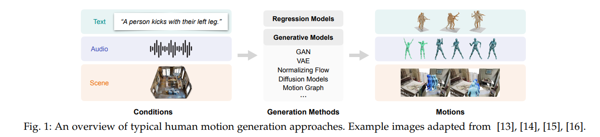

## PRELIMINARIES 准备工作

### Motion Data

**动作数据的表示**

分为**基于关键点**和**基于旋转**表示。

基于关键点有比较强的可解释性，但是在可视化的时候会需要求解逆运动学问题，并将关键点转化为旋转。后来出现了用人体表面关键点来标志的工作，因为提供了更多的信息，所以使得可视化更加简单了。

基于旋转的方法是用关节的旋转来表示人体姿势，即记录相对于父级结构中的关节点旋转参数，一些模型运用统计网格模型对人体进行建模，如SMPL，SMPL-X，进一步捕捉人体动作信息。除了基于SMPL的线性模型外，还探索了替代的建模方法，如GHUM和STAR。

具体：

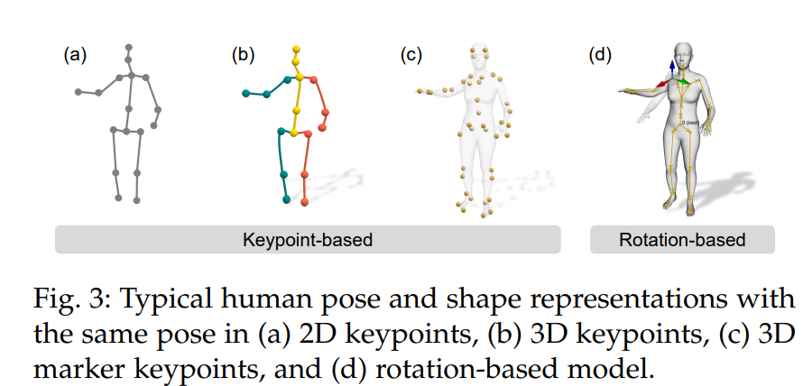

人体运动数据可以通过时间维度上人体姿态的序列进行有效表征。具体而言，我们将数据表征方式分为基于关键点和基于旋转的两大类。值得注意的是，这两种表征形式可以相互转换：通过**正向运动学（FK）可从关节旋转推导出关键点**，而**逆向运动学（IK）则能实现从关键点到关节旋转的反向推算**。

**基于关键点的表征**  
人体通过一组与解剖学标志（如关节或其他重要部位）对应的关键点来表示。如图3(a)(b)所示，每个关键点以像素坐标系或世界坐标系中的2D/3D坐标定义。运动数据即表现为关键点构型随时间变化的序列。此类表征可直接从动作捕捉系统获取，具有强可解释性。但若要将关键点数据用于动画或机器人领域，通常需通过逆向运动学（IK）将其转换为旋转参数。近期研究[60][61][62]提出采用人体表面更多标记点（即体表标记）进行表征（图3(c)），相比传统骨骼关键点，这类标记能更全面反映体型变化和肢体扭转信息。

**基于旋转的表征**  
人体姿态也可通过分层结构中身体部位相对于父节点的关节旋转角度（即关节角）表示。多数研究采用SO(3)空间的三维关节旋转，参数化形式包括欧拉角、轴角、四元数等。基于关节角的研究[33][34]进一步结合统计网格模型捕捉体型特征和运动形变，其中广泛应用的Skinned Multi-Person Linear (SMPL)模型[33]通过姿态参数`θ∈R^{K×3}（K=24个关节的相对旋转）和体型参数β∈R^{10}`（如身高）生成特定姿态的三维网格（图3(d)）。该可微分变形过程M(θ,β)∈R^{6890×3}产生的网格顶点可通过预训练线性回归器映射为稀疏3D关键点。SMPL-X[34]等扩展模型实现了身体-面部-手部的联合建模，GHUM[63]和STAR[64]则探索了其他建模方式。为简洁起见，下文表格中以"Rot."统称基于关节的3D旋转及其在统计人体模型（如SMPL）中的应用，不再细分二者差异。

**动作数据收集**

1. 有标记的动作数据。使用光学标记或惯性测量单元(IMU)，在3D空间中跟踪这些标记的运动。然后，这些数据可通过应用正运动学（FK）或SMPL等参数体网格来获得3D关键点。光学标记比IMU更准确，但便携性较差，通常用于室内环境，而IMU可用于室外设置。
2. 无标记动作数据。不需要标记，但是需要多视图，并且配置一定的算法，不如有标记的精确，但是胜在方便而且适合运于大动作。
3. （伪标记）Pseudo-labeling。适用于单眼图像和单眼视频（就是普通的视频那样），可以使用诸如OpenPose和VideoPose3D人体姿态估计器，或者使用SMPLify-X将模型拟合到图像以生成人体伪标记。相对应的，方便但是不精确。
4. 手动注释。涉及手动使用动画引擎设计人体运动，使用熟练艺术家团队。可以产生高质量的动画，但它昂贵、耗时且不可扩展。

人体动作生成的需求通常包括一个条件信号，如**文本描述、背景音频或周围环境**，如图1所示。因此生成的动作不仅本身应该合理，还应与条件信号协调一致。

具体：

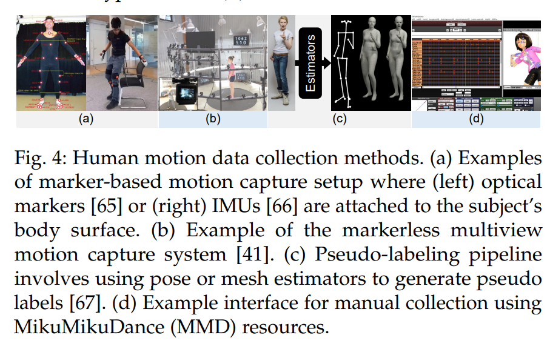

#### **3.1.2 运动数据采集**  
人体运动数据采集主要有四种方法：**(i) 基于标记的动作捕捉**、**(ii) 无标记动作捕捉**、**(iii) 伪标签生成** 和 **(iv) 人工标注**。  

1. **基于标记的动作捕捉**：  
   - **重点**：通过在受试者身体特定位置放置**反光标记点**或**惯性测量单元（IMUs）**，并在3D空间中追踪这些标记的运动（图4(a)）。  
   - 数据可通过**正向运动学**[39]或结合**MoSh**[68]的**参数化人体模型（如SMPL）**[33]转换为3D关键点。  
   - **光学标记**比IMUs更精确，但便携性较差，通常用于室内环境；**IMUs**适用于户外场景。  

2. **无标记动作捕捉**：  
   - **重点**：通过**单/多摄像头**结合**计算机视觉算法**（如[69][70][71]）追踪人体运动，利用多视角几何计算3D运动（图4(b)）。  
   - 需同步多个RGB或RGB-D摄像头，虽**精度低于标记法**，但更便捷且适用场景更广。  

3. **伪标签生成**：  
   - **重点**：针对**单目RGB图像/视频**，使用现成姿态估计器（如OpenPose[72]、VideoPose3D[37]）预测2D/3D关键点，或通过SMPLify-X[67]拟合人体模型生成伪3D网格标签（图4(c)）。  
   - 相比动作捕捉系统，**伪标签误差较大**。  

4. **人工标注**：  
   - **重点**：由专业团队使用动画引擎（如MikuMikuDance(MMD)，图4(d)）手动设计运动。  
   - 可生成高质量动画，但**成本高、耗时长且难以扩展**。  

---

#### **两句话总结**  
1. **重点**：运动数据采集的**四类方法**（标记/无标记/伪标签/人工）在**精度、成本、适用性**上差异显著，**标记法最精确但受限环境，伪标签便捷但误差较大**。  
2. **重点**：**SMPL模型**和**多视角几何算法**是3D运动重建的核心工具，而**人工标注**仅适用于高预算的小规模需求。

​	 

### Motion Generation Methods

人体动作生成方法，可以粗略的分为两类，regression models和generative models。

**回归模型**，一般就是有监督的，去学习一个函数这样，努力去建立输入到输出的直接映射。

**生成模型**，是无监督的，比如DDMP，VAE，GAN这样的模型，如图1所示。

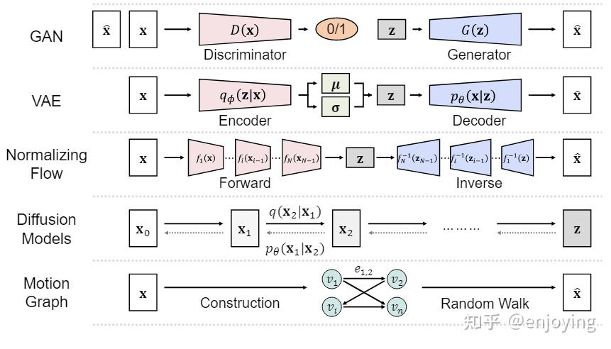

图1-生成模型方法总览

下面详细介绍各个方法：

1. generative Adversarial Networks（GAN）。有两个生成网络，一个叫做生成器，一个叫做辨别器，生成器从先验分布z中随机取样，然后经过生成器生成之后，得到了一个输出x1，那么之后这个输出x1被辨别器直接拿过去识别是真实样本还是生成的样本，这样可以用零和博弈的思想去实现这个GAN，目前GAN这个已经被做了好几百个模型，性能非常优秀但是也估计做到头了。

2. **Variational Autoencoders（VAE）**。

   非常优秀的模型，这里简述一下训练过程，有一个encoder和一个decoder。

   然后输入一个图像x1，经过encoder后产生一个满足正态分布（任何一个可以随机采样的分布都可以，不一定要正态分布）的编码，然后用这个编码输入到decoer中得到最后的结果x2，我们要训练的就是尽可能使得x1与x2像。

   训练完成之后，扔掉encoder，我们直接随机采样一个符合正态分布的图像，直接使用decoder解码，就可以得到图像了，它能够高效推断新样本。但是这里有一个问题，由于posterior collapse 问题，使得生成的图像质量并不高，所以出现了CVAE, LVAE和 [VQ-VAE](https://zhida.zhihu.com/search?content_id=235306232&content_type=Article&match_order=1&q=VQ-VAE&zhida_source=entity)这样的改进方法。（原文未提及训练过程，是我写的时候加上去的）

3. Normalizing Flows。标准化流模型通过构造一个可逆的变换函数，将任意复杂的数据分布变换为一些基本的简单分布（如单高斯分布、均匀分布等），通过巧妙设计的模型结构，模型可以对数据样本进行精确的最大似然估计。

4. [Diffusion Models](https://zhida.zhihu.com/search?content_id=235306232&content_type=Article&match_order=1&q=Diffusion+Models&zhida_source=entity)。扩散模型就是很简单的思想，基于[DDPM](https://zhida.zhihu.com/search?content_id=235306232&content_type=Article&match_order=1&q=DDPM&zhida_source=entity)，一个向样本加噪声的过程，一个向随机采样的样本中去除噪声的过程，能够产生一个非常高质量的样本，但是推理速度比VAE和GAN要慢很多。

5. Motion Graph。方法好像比较老，是2002年提出的，有兴趣可以去看看综述原文。

补充：

https://zhuanlan.zhihu.com/p/28333273901

### 自回归生成

[自回归模型](https://zhida.zhihu.com/search?content_id=254689105&content_type=Article&match_order=1&q=自回归模型&zhida_source=entity)（Autoregressive model，AR）是一种利用过去的观测值来预测当前或未来的值的模型。近些年最火的LLM，就是一种自回归模型，输入前一段文本，预测一个新单词，预测结束后将新单词拼到先前文本中，继续生成下一个单词。

[MoMask](https://link.zhihu.com/?target=https%3A//github.com/EricGuo5513/momask-codes)是一个非常不错的骨骼动画生成模型，模型先将SMPL动画**用VQ-VAE降维**，用一个Transformer对降维数据做自回归生成。可以做到输入一段文本，输出一段SMPL骨骼动画

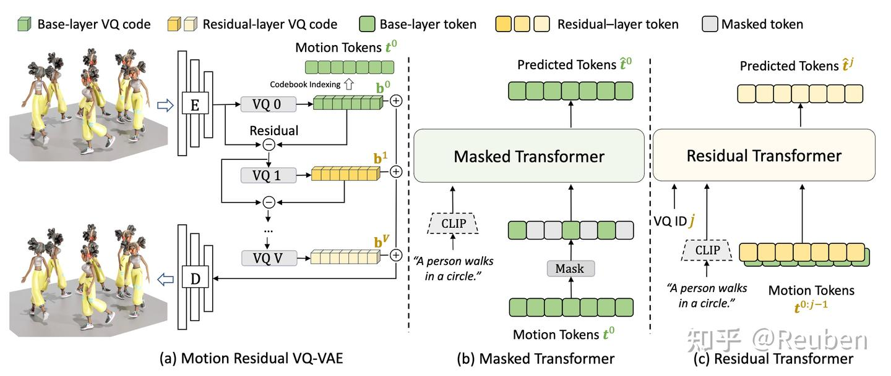

MoMask 动作生成原理

不过经过测试，感觉这些模型生成的动作都非常僵硬，而且抖动严重（作为训练集的CMU-BVH、AMASS都挺抖的）。而且比较偏科，比较擅长行进动画（行走、奔跑、跳跃）的生成，而且很多论文都在强调自己的移动轨迹，我感觉目前距离应用到游戏中还非常非常遥远。（有没有AI动作降噪、超分的工作？）

### diffusion

[扩散模型](https://zhida.zhihu.com/search?content_id=254689105&content_type=Article&match_order=1&q=扩散模型&zhida_source=entity)是AIGC的主力，生成模型的目标是给定一组数据，用这组数据构建一个分布，在分布中采样以得到新的（未出现过的）数据。而扩散模型可以将一个非常复杂的分布，转为一系列简单分布，于是非常适合作为生成模型。近些年最流行的AI画图stable diffusion就是基于扩散模型

目前有很多动作相关的视频模型，而且不少成功落地到AIGC产品中，b站现在一大堆恶搞视频，比如“等一下基德”、“多么绝望的舞蹈”、“小明剑魔”。（视频模型确实比3D生成更适合推广，毕竟每个人都能做视频，消化视频，但只有专家艺术家才会生产使用3D资产）

不过纯视频模型比较难实现物理真实、多人交互的连续性，一些视频模型在训练时也会加入一些3D物理数据。比如生成3D骨骼动画，再转为SVG骨架图片，供视频模型使用的工作。物理真实的视频模型，也是目前前沿在卷的方向

还有一些真的在生成3D骨骼动画的扩散模型，比如[MDM](https://link.zhihu.com/?target=https%3A//github.com/GuyTevet/motion-diffusion-model%3Ftab%3Dreadme-ov-file)是一个基于diffusion和SMPL的模型，可以实现输入文本数据，输出SMPL动画

### 详细： 3.2 动作生成方法 		

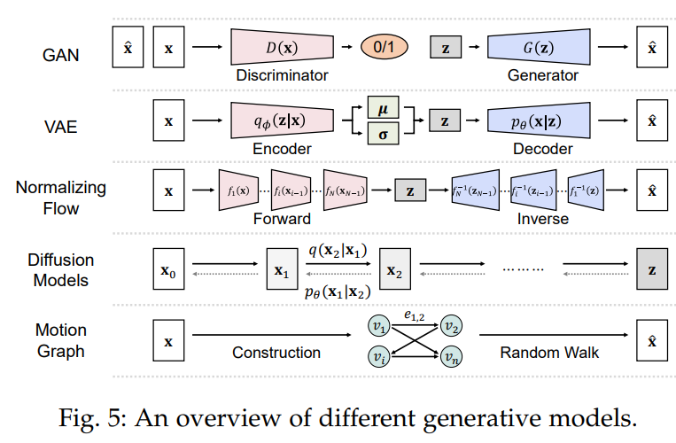

我们大致将人类动作生成方法分为两类。第一类方法基于回归模型，利用从输入条件编码的特征来预测人类动作。这些方法属于监督学习范式，旨在建立输入条件与目标动作之间的直接映射。另一类方法则基于生成模型，专注于以无监督的方式建模运动的潜在分布（或与条件的联合分布）。典型的深度生成模型包括生成对抗网络（GANs）、变分自编码器（VAEs）、归一化流（Normalizing Flows）和去噪扩散概率模型（DDPMs）。除了通用的生成模型外，任务特定模型——动作图（motion graph）在计算机图形学和动画领域也得到了广泛应用。图5展示了不同生成模型的概述。接下来，我们将简要介绍在动作生成中常用的生成模型。

**生成对抗网络（GANs）**。GANs [21] 是一类由两个神经网络组成的生成模型：生成器 G 和判别器 D。生成器从噪声向量 z 中生成合成数据，以欺骗判别器。相反，判别器则试图区分真实数据和生成器生成的合成数据。生成器与判别器之间的这种动态关系可以视为零和游戏或最小-最大游戏。它们之间交互的损失函数可以表示为：

$$
L_D = -E_{x \sim p_x} [\log(D(x))] - E_{z \sim p_z} [\log(1 - D(G(z)))], \tag{1}
$$

$$
L_G = -E_{z \sim p_z} [\log(D(G(z)))]. \tag{2}
$$

随着深度学习的兴起，各种基于深度学习的GANs被提出。模型如DCGAN [73]、PGGAN [74] 和 StyleGAN [75][76] 展现了显著的成就和潜力。这些GAN的进展对生成模型领域，尤其是合成数据的生成，做出了重要贡献。然而，GANs面临一些挑战，包括训练不稳定、收敛问题和模式崩溃。

**变分自编码器（VAEs）**。VAEs [19] 是显著的生成模型，为数据表示提供了稳健的解决方案。它们通过使用前馈模型 $\( q_\phi(z|x) \)$ 来近似难以处理的后验，从而解决交互似然性的问题。主要的优化目标是最小化这个近似与原始后验之间的KL散度。VAEs采用证据下界（ELBO）作为损失函数：
$$
ELBO = E_{z \sim q_\phi(z|x)} [\log(p_\theta(x|z))] - D_{KL}(q_\phi(z|x) || p_\theta(z)). \tag{3}
$$

由于 \($ q_\phi(z|x) $\) 的前馈模式，VAEs能够高效生成和推断新样本。此外，重参数化技巧使得可微分样本生成和重构基础的损失函数的使用成为可能，最终提高了训练效率和稳定性。这些优势使得VAEs的变体（如CVAE [77]、LVAE [78] 和 VQ-VAE [79]）在各个领域得到了广泛应用，并推动了生成模型的进步。然而，VAEs存在后验崩溃的风险，并且与GANs相比，生成的样本可能不够清晰。

**归一化流（Normalizing Flows）**。GANs和VAEs隐式学习数据的概率密度，难以计算确切的似然。相反，归一化流 [20] 是一类生成模型，显式学习数据分布 \( p(x) \)，并允许可处理的概率密度估计。这些模型采用一系列可逆变换 \($ \{f_i\}_{1:N} $\) 将简单的先验分布 \( p(z_0) \)（例如标准高斯分布）映射到复杂的数据分布 \( p(x) \)：
$$
z_i = f_i(z_{i-1}) \tag{4}
$$
$$
x = z_N = f_N \circ f_{N-1} \circ \cdots \circ f_1(z_0) \tag{5}
$$

目标分布的密度可以通过应用变量变化定理获得：

$$
\log p(z_i) = \log p(z_{i-1}) - \log \left| \frac{d f_i}{d z_{i-1}} \right| \tag{6}
$$

$$
\log p(x) = \log p(z_0) - \sum_{i=1}^{K} \log \left| \frac{d f_i}{d z_{i-1}} \right| \tag{7}
$$

其中，det是指方阵的行列式。归一化流通常通过最大化观察数据的对数似然来训练。由于可逆变换，归一化流提供了灵活性、精确的似然计算和简单的数据采样。然而，它们需要大量的变换来建模复杂的分布，可能在计算上昂贵且难以训练。

### 总结

**重点**：人类动作生成方法主要分为基于回归模型的监督学习和基于生成模型的无监督学习。生成模型包括生成对抗网络（GANs）、变分自编码器（VAEs）和归一化流（Normalizing Flows），每种方法在生成质量和训练稳定性方面各有优缺点。

详细：

### 方法 详细

#### 扩散模型（Diffusion Models）  
**重点**：扩散模型通过**前向噪声添加**和**反向去噪学习**生成高质量运动数据，其核心分为两个阶段：  

1. **前向扩散过程**：  
   - 在$T$步内对输入数据$x_0$逐步添加高斯噪声（噪声强度由$\{\beta_t\}_{1:T}$控制），生成噪声样本序列$\{x_t\}_{1:T}$。  
   - 单步噪声添加公式（式8）与联合分布（式9）：  
     $$
     q(x_t|x_{t-1}) = \mathcal{N}(x_t; \sqrt{1-\beta_t}x_{t-1}, \beta_t\mathbf{I}), \quad q(x_{1:T}|x_0) = \prod_{t=1}^T q(x_t|x_{t-1})
     $$
   - 当$T \to \infty$时，$x_T$收敛为标准高斯分布。  

2. **反向生成过程**：  
   - 通过神经网络$p_\theta$学习反向条件分布$q(x_{t-1}|x_t, x_0)$（式10），而非直接估计难以求解的$q(x_{t-1}|x_t)$：  
     $$
     p_\theta(x_{t-1}|x_t) = \mathcal{N}(x_{t-1}; \mu_\theta(x_t, t), \Sigma_\theta(x_t, t))
     $$
   - 类似VAE，通过优化**证据下界（ELBO）**训练模型。  

**优势与局限**：  
- **优势**：生成质量高、训练稳定，适合复杂分布建模。  
- **局限**：依赖长链马尔可夫过程，计算成本高且生成速度慢于GANs/VAEs。  

---

#### 运动图（Motion Graph）  
**重点**：运动图是一种基于**图结构**的运动序列生成方法，数学表示为有向图$G=\langle V, E \rangle$：  

1. **图结构定义**：  
   - 节点$v \in V$代表关键姿态或关键帧，边$e \in E$表示可行姿态过渡。  
   - 通过分析运动片段库，算法识别兼容姿态并建立连接边，确保过渡平滑性。  

2. **运动生成流程**：  
   - **随机游走**：从初始节点出发沿边遍历，生成节点序列$W=(v_1, v_2, ..., v_n)$，对应姿态拼接为新运动序列。  
   - **优化约束**：可引入额外目标（如物理合理性[85][86]）优化生成结果。  

**优势与局限**：  
- **优势**：无需显式数据，生成符合原始库特征的新运动；支持实时交互。  
- **局限**：依赖高质量运动库，复杂约束下优化难度大。  

---

### **两句话总结**  
1. **重点**：扩散模型通过**噪声扩散-去噪**框架实现高质量生成，但计算成本高；运动图利用**图遍历**生成新序列，适合实时应用但依赖数据质量。  
2. **重点**：两类方法分别代表**数据驱动**（扩散模型）与**规则驱动**（运动图）的生成范式，选择时需权衡生成质量、效率与资源条件。

## 文本条件 动作生成  TEXT-CONDITIONED MOTION GENERATION

文本对动作的强大的描述能力。有两种类别的文本生成动作action-to-motion(action2motion)和text-to-motion.

### **Action-to-motion**

这个相对于text2motion比较简单，方法也多种多样，综述原文基本就是在谈论谁做了相关工作能够用于action2motion，唯一要注意的是**action**就是一种文本，只不过它**非常的简短**，可以看作是一种类别，比如jump,eat,phone,jogging这样的词，所以与text2motion是有一些区别的。

### Text-to-Motion

文本到动作的任务旨在从自由形式的自然语言描述中生成相应的动作，由于语言的多样性并且难理解性，所以想要生成动作首先要理解语言，所以训练的复杂度会稍微大一些。

随着text2motion模型、JL2P、TEACH模型的提出，t2m领域发展的很快，但是这些方法都是基于数据集的，对于zero-shot场景很难有好的性能。为此motion[CLIP](https://zhida.zhihu.com/search?content_id=235306232&content_type=Article&match_order=1&q=CLIP&zhida_source=entity)模型融合了transformer和CLIP使得模型具有了一定的zero-shot能力，因为CLIP模型的优越性能，所以又有一些其他工作使用了CLIP。而另外有一些比较好的方法，如VQ-VAE和扩散模型也持续不断的被使用在了各种工作中。

#### 4 文本条件运动生成  
**重点**：文本能够显式或隐式地描述动作类型、速度、方向及目标位置，这种强表现力使其成为运动生成的理想条件输入。本节系统阐述文本条件运动生成任务（见表1顶部），主要分为两类：**动作类别到运动生成**和**文本到运动生成**。  

---

### 4.1 动作类别到运动生成  
**重点**：该任务基于预定义动作类别（如"行走"、"踢腿"、"投掷"）生成对应运动序列，通常采用**独热编码**表示动作类别。相比需要处理自然语言复杂性的文本到运动任务，其有限且明确的动作类别使生成过程更直接。  

#### 关键技术方法  
1. **SA-GAN**[88]  
   - 采用**自注意力图卷积网络（GCN）**结合GAN框架，通过**帧级+序列级双判别器**提升生成质量。  
2. **Kinetic-GAN**[92]  
   - 融合GAN与GCN优势，利用**潜在空间解耦**和**随机变量**生成多样高质量运动。  
3. **Action2Motion**[7]  
   - 基于**门控循环单元（GRU）**的逐帧VAE架构，实现运动序列生成。  
4. **ACTOR**[90]  
   - 使用**Transformer**构建序列级CVAE，通过**非自回归**方式一次性生成完整运动序列。  
5. **ODMO**[94]  
   - 在低维潜在空间中应用**对比学习**，首先生成运动轨迹再合成序列，增强轨迹可控性。  
6. **PoseGPT**[95]  
   - 将运动编码为**量化潜在表示**，通过**类GPT模型**在离散空间预测下一动作索引。  
7. **Cervantes等**[98]  
   - 结合**隐式神经表示（INR）**与**条件高斯混合模型（GMM）**，通过变分分布提取表征控制序列长度和动作类别。  
8. **MDM**[14]  
   - 扩散模型直接预测每步扩散样本（而非仅噪声），提升生成精度。  
9. **MLD**[101]  
   - 受**潜在扩散模型（LDM）**[169]启发，在潜在空间进行扩散并与VAE协同生成运动。  

#### 挑战与突破  
**重点**：现有方法虽在单动作生成表现优异，但**多动作复杂序列生成**仍需后处理拼接。为此：  
- **MultiAct**[99]  
  - 提出**递归式长期多动作生成框架**，通过**面向前向标准化方法**确保局部坐标系在递归步骤中共享地面几何约束。  

---

##### 两句话总结  
1. **重点**：动作类别到运动生成采用**结构化标签输入**（如独热编码），主流方法涵盖GAN/VAE/扩散模型等架构，其中**Transformer非自回归生成**（如ACTOR）和**潜在空间对比学习**（如ODMO）成为技术亮点。  
2. **重点**：当前瓶颈在于**多动作连贯生成**，MultiAct通过递归框架与几何约束实现突破，但**自然过渡与物理合理性**仍是未来优化方向。  

### 4.2 文本到动作（Text to Motion）

文本到动作任务旨在**根据自然语言描述生成人体动作序列**，充分利用语言的强大表达能力。与仅依赖有限预定义标签的“动作到动作”任务相比，文本到动作能够根据多样化的文本描述，生成更丰富多变的动作。然而，**核心挑战在于如何准确地将文本中的细微差别转化为相应的动作**，这需要对语言的细致理解和对物理动作动态的深入把握。

Text2Action [102] 首次利用生成对抗网络（GAN）从自然语言描述中生成多样化的动作。其他方法则探索了**文本与动作的联合嵌入学习**。例如，JL2P [104] 使用基于GRU的文本编码器和动作编码-解码器，将文本映射为对应的人体动作。Ghosh等人 [105] 进一步提出了**双流编码-解码模型**，实现文本与身体动作的共同嵌入，并结合GAN结构生成更自然的动作。Guo等人 [3] 提出了一种基于变分自编码器（VAE）的方法，在每一帧引入长度估计模块和词级注意力模块，从而生成多样且长度不一的动作序列。此外，TEMOS [108] 通过带有Transformer层的VAE学习动作与文本的联合分布，实现了多样动作序列的生成。TEACH [110] 则进一步将**历史动作作为编码器的补充输入**，特别适用于多段文本输入时，能够生成更自然、连贯的动作序列。

尽管上述方法注重基于给定数据集生成动作，但在**零样本（zero-shot）生成**方面仍面临挑战。为了解决这一问题，MotionCLIP [107] 利用基于Transformer的自编码器，并将动作的潜在空间与预训练视觉-语言模型CLIP [170]的文本和图像空间对齐，从而提升了零样本生成能力。AvatarCLIP [106] 同样采用CLIP [170]和基于参考的动作合成方法，实现了从自然语言描述生成多样化动画。此外，OOHMG [113] 通过文本-姿态生成器获得与文本一致的姿态，并将其作为掩码提示输入到预训练生成器中，无需配对数据或在线优化即可高效重建完整动作。值得注意的是，这些方法虽然以文本为输入，但通常只使用简短文本，主要包含动作类别名称。

近年来，受文本到图像生成领域VQ-VAE和扩散模型（Diffusion Models）巨大成功的启发，相关研究也逐渐增多。例如，研究者将token、语言池化token、时间步token和动作嵌入结合，输入到扩散模型中以生成可变长度和多样化的动作。MDM [14] 和 MLD [101]（在动作到动作部分已介绍）也采用了上述方法进行文本到动作生成。还有一些工作进一步探索了多条件下的动作生成。例如，MoFusion [116] 利用带有1D U-Net风格Transformer模块的扩散模型，从自然语言或音频输入生成人体动作序列。Zhou等人 [114] 则提出了UDE框架，将动作序列离散为潜在编码，将条件映射到统一空间，利用类似GPT的Transformer预测量化编码，并通过扩散模型生成动作。

---

**两句话总结：**

1. **文本到动作任务通过深度学习模型（如GAN、VAE、Transformer和扩散模型）将自然语言描述转化为丰富多样的人体动作序列，极大拓展了动作生成的表现力。**
2. **当前研究重点在于提升模型对复杂文本的理解能力、实现零样本生成，并通过多模态对齐和多条件输入，生成更自然、连贯且多样的动作。**

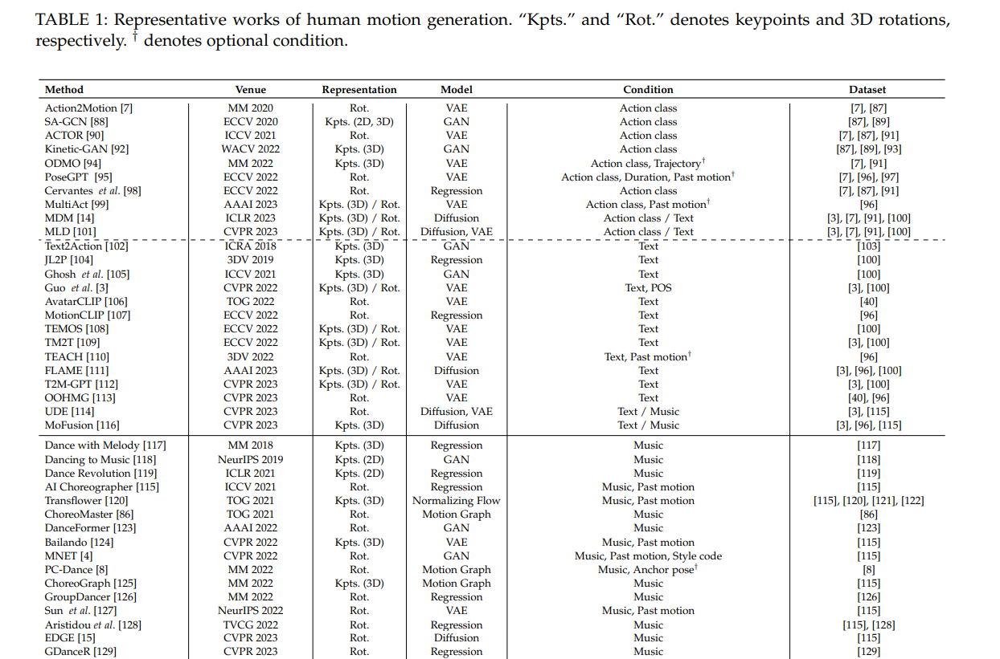

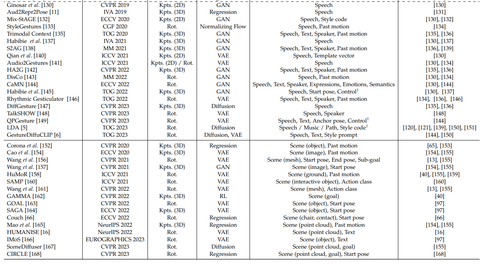

## AUDIO-CONDITIONED MOTION GENERATION

由于声音信号没有对应的动作，所以Audio2motion任务的自由度更高。A2M要求生成的动作是符合高级语义和低级节奏的，主要谈论了music-to-dance和speech-to-gesture。

### Music to Dance

从音乐到动作，比较简单的做法就是用回归模型，然后计算重建损失，实际上有不少这样的工作。但是音乐到舞蹈很难说有特别明显的联系，所以简单的重建损失无法满足这种一对多的映射。所以后续又有GAN，VQ-VAE的工作出现。

生成长动作序列的需求一直比较大，但是它会由于错误累计而导致运动冻结问题，所以有用VQ-VAE解决的，也有用教师强制方案过渡到自回归的方法。

### Speech to Gesture

speech-to-gesture generation (or co-speech gesture synthesis)这项任务旨在基于音频输入生成可信的人体一系列手势，有时候在输入时可能也要用到text transcript。目前主要是研究上半身的动作，因为下半身往往是静止的。的确，音频到手势应该是一对多的关系，所以实际上，运用生成模型会比较多。

再者，由于说话人的不同，实际上每个人的手势风格会有些许不同，所以需要明确的考虑说话人的身份，而且不能多模态输入（比如想同时输入文本和音频）的问题。由于这些不足的存在，所以出现了一些工作，解决了多模态输入的问题，并且还有可以用如MFCC编码器提高情感表达的生成质量的工作。

## SCENE-CONDITIONED MOTION GENERATION

场景驱动的动作生成，是指根据给定的场景信息生成与该场景相对应的运动或动作序列的过程，举一个简单的例子，假设有一个场景是"人在散步"。场景中可能包括人物的位置、周围环境的描述等信息。通过场景条件下的运动生成技术，可以根据场景信息生成人物散步的动作序列。生成的动作序列可能包括左脚迈步、右脚迈步、摆臂等一系列动作，以使得生成的运动与场景相符合。可以看到，这类型的工作应用范围是很广的，并且有很大的市场。

### Scene representation

场景的表示有2D图像，3D点云，网格，3D对象（包括3D位置、对象类型、体素表示）。可以认识到的是，用图像作为场景的应用范围最广。请注意，大多数方法将多种类型的场景表示作为输入，其中许多将过去的运动或开始姿势作为输入，也有一些方法使用额外的语言指令或动作标签生成运动的方法。

### scene pipeline

有三阶段的预测方法，首先预测 2D 目标，然后计划 2D 和 3D 路径，最后通过 VAE 模型沿路径生成 3D 运动。也有一下其他的改进办法如全身抓取运动，首先生成结束抓取姿态，然后再生成中间姿态。方法多种多样，但是**几乎都使用了VAE作为生成模型**。

### 详细:

#### 6 场景条件下的动作生成（Scene-Conditioned Motion Generation）

人体动作具有明确的目标导向性，并且会受到周围场景布局的影响。人在运动时会与环境进行交互，同时也受到环境物理属性的约束。**场景到动作生成任务**旨在生成与场景上下文一致、合理的人体动作，这一直是计算机图形学和计算机视觉领域的长期难题。本文综述主要关注**基于数据驱动的场景条件动作生成方法**（详见第2节），不涵盖基于物理仿真的方法[175]-[179]。在生成动态动作之前，也有部分研究提出了在给定场景条件下合成静态人体姿态[180]-[184]，但这类方法同样不在本综述的讨论范围之内。接下来，我们将从**场景表示**和**生成流程**两个角度介绍现有方法。具体方法可参考表1底部部分。

---

#### 6.1 场景表示（Scene Representation）

目前，研究者采用了多种场景表示方式，包括**2D图像**[154][157]、**点云**[16][165][167][168]、**网格（mesh）**[156][161]、**三维物体**[66][152][160][163][164][166]以及**特定目标位置**[156][162][167][168]等。

- **2D图像**：Cao等人[154]和Wang等人[157]使用RGB图像作为场景约束，通过从图像中提取特征隐式融合场景信息。
- **点云与网格**：许多工作[16][156][161][165][167][168]采用点云或网格来表示场景（如带有家具的房间），通常利用PointNet[185]提取场景特征，作为动作生成的条件信号。
- **三维物体**：三维物体的配置包括物体的三维位置[152][163]、物体类型[152][166]以及体素（voxel）表示[66][160]。例如，Corona等人[152]用物体的三维包围盒和物体类型（如杯子，以one-hot向量表示）来描述物体，并引入有向语义图对人体动作与物体进行联合参数化。他们采用循环神经网络（RNN）生成与物体交互的人体动作。COUCH[66]旨在生成可控的、以接触为驱动的人-椅交互动作，用体素网格表示椅子，能够准确捕捉人与椅子的空间关系。另一类典型方法则利用三维物体作为场景条件，生成全身抓取动作[163][164][166]，其中输入为三维物体位置[163][166]或点云[164]。
- **目标位置**：有些方法[156][162][167][168]直接给出目标位置来引导动作生成。例如，GAMMA[162]采用强化学习（Reinforcement Learning）训练策略网络，根据地面上的目标位置合成合理动作。SceneDiffuser[167]提出了一个通用的三维场景理解框架，利用扩散模型[22]，在给定点云场景和目标的情况下生成合理的人体动作。

需要注意的是，大多数方法会同时采用多种场景表示作为输入，并且许多方法还会将**历史动作或起始姿态**[66][152][154][156][157][158][165][168]作为输入。此外，近年来也出现了一些结合**语言指令**[16]或**动作标签**[160][161]进行动作生成的方法。例如，HUMANISE[16]结合语言描述（如“走到桌子旁”）在场景中生成相应的人体动作。IMoS[166]则结合意图动作指令（如“喝水”），在给定物体位置和类型的情况下生成可控的全身抓取动作。

---

**两句话总结：**

1. **场景条件下的动作生成任务通过多种场景表示（如2D图像、点云、三维物体、目标位置等），结合历史动作、语言指令等多模态信息，实现与环境紧密交互、目标明确的人体动作生成。**
2. **当前主流方法注重场景与动作的深度融合，采用数据驱动的方式提升动作的合理性和多样性，推动了虚拟人机交互和智能动画等领域的发展。**

#### 6.2 生成流程

目前，大多数现有方法都采用了多阶段的生成流程（pipeline）。一种常见的流程是：**首先预测目标位置**[154, 157]或目标交互锚点[66, 160, 161]，然后规划路径或轨迹，最后沿着轨迹补全动作[66, 154, 157, 160, 161, 165, 167]。  
例如，Cao 等人[154]提出了一种三阶段的动作生成方法：在给定场景的2D图像下，首先预测二维目标位置，然后规划二维和三维路径，最后通过VAE模型沿路径生成三维动作。与Cao等人类似，Wang等人[157]使用RGB图像作为场景上下文，先生成轨迹，再引导动作生成，并额外添加了判别分支以加强对场景上下文的考虑。SAMP[160]同样采用了多阶段流程，先估计目标位置和物体的交互方向，再根据起始身体姿态规划三维路径，最后通过自回归VAE生成合理的人体动作。

与SAMP[160]只在最后一帧建模粗略的人-物体交互不同，Mao等人[165]提出使用**每个关节的接触图**，为每个未来帧的每个人体关节提供更详细的接触信息，从而提升生成质量。Wang等人[161]首先预测多样化的人-场景交互锚点，然后结合标准A*算法和场景感知的随机探索进行多样化路径规划，最后用基于VAE的框架合成锚点姿态并补全动作。GOAL[163]和SAGA[164]旨在生成全身抓握动作，提出了两步法：先生成终止抓握姿态，再生成全身动作。与GOAL[163]不同，SAGA[164]通过VAE模型进一步捕捉了抓握终止姿态和中间动作的多样性。

还有一些方法直接利用给定的目标位置，而不是预测目标。例如，Wang等人[156]提出了一种分层流程，利用VAE模型[19]在每个给定子目标上生成静态人体，并用双向LSTM[186]为每对子目标生成中间的人体动作。通过拼接这些动作片段，可以合成长期的人体动作。

最近，CIRCLE[168]提出了一种新范式：首先用线性插值在给定起始姿态和目标位置之间初始化动作，然后提出场景感知的动作细化模块生成最终动作。场景特征从三维点云中提取，并融合到细化模块中。

---

**两句话总结：**  
1. **多阶段生成流程**（如先预测目标位置、再规划路径、最后补全动作）是当前人体动作生成的主流方法，许多工作通过引入VAE、LSTM等模型提升动作的自然性和多样性。  
2. **重点**：新方法不断通过更细致的交互建模、场景特征融合和多样化路径规划，推动动作生成在复杂场景下的表现和实用性。

## DATASETS

如图2所示，详细的归纳了常用的数据集，作者做出了非常详细的汇总。

常用的数据集可以根据它们伴随的条件信号进行分类，Text-Motion Datasets，Audio-Motion Datasets，Scene-Motion Datasets。

音频运动数据集可以分为受控和野外。尽管野外数据提供了更高的运动多样性，并且更具可扩展性，但提取的运动往往不太准确。

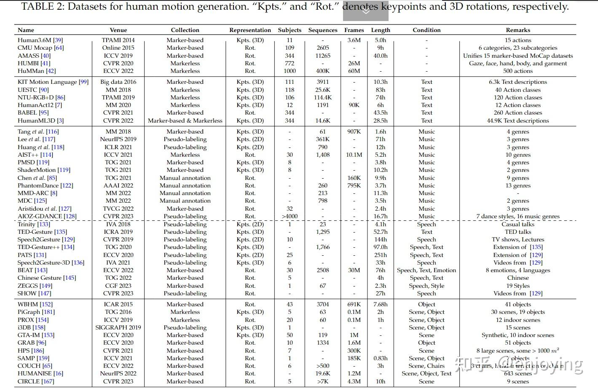

图2-数据集

#### 7 数据集（Datasets）

本节将讨论用于人体动作生成的各类数据集。常用的数据集可以根据其**附带的条件信号**进行分类。我们将分别介绍与文本、音频和场景等条件信号配对的人体动作数据集。在表2中，我们总结了这些数据集的主要特性，并补充列举了一些**不含额外条件信号的大规模人体动作数据集**，以供参考。

---

#### 7.1 文本-动作数据集（Text-Motion Datasets）

- **KIT-Motion Language [100]**  
  这是一个配对数据集，包含动作数据和语言数据。动作数据通过光学标记系统采集，语言数据则由对每个动作样本的描述性注释组成。

- **UESTC [91]**  
  该数据集通过微软Kinect V2传感器采集，包含三种模态：RGB视频、深度图和骨架序列。数据集涵盖了15种站立和坐姿动作类别，以及25种仅限站立的类别，总计40个不同类别。

- **NTU-RGB+D 120 [87]**  
  这是NTU-RGB+D [93]数据集的扩展版本，新增了60个类别和57600个RGB+D视频样本。整个数据集包含120种不同的动作类别，涵盖日常活动和健康相关活动。

- **HumanAct12 [7]**  
  该数据集源自PHSPD [188]，专注于3D动作片段，细分为多种典型人类行为。数据集包含如行走、跑步、坐下、热身等日常动作，共分为12个主类和34个子类。

- **BABEL（Bodies, Action and Behavior with English Labels）[96]**  
  该数据集为AMASS [40]综合动作数据集中的动作序列提供了文本标签。标签分为两种层级：针对整个序列的序列级标签和针对单帧的帧级标签。BABEL覆盖了超过2.8万个序列和6.3万帧，涵盖250种动作类别。

- **HumanML3D [3]**  
  该数据集由HumanAct12 [7]和AMASS [40]组合而成，每个动作序列都配有三种不同的文本描述。HumanML3D涵盖了日常生活、体育、杂技和艺术等广泛活动。

---

**两句话总结：**

1. **人体动作生成领域的数据集通常根据是否配有文本、音频或场景等条件信号进行分类，丰富的数据类型为多模态动作生成提供了坚实基础。**
2. **重点：主流数据集如KIT-Motion Language、BABEL和HumanML3D等，不仅涵盖多样的动作类别，还配有详细的文本描述，极大促进了基于文本的动作生成研究。**

#### 7.3 场景-动作数据集（Scene-Motion Datasets）

- **WBHM（Whole-Body Human Motion）[153]**  
  该数据集包含通过Vicon动作捕捉系统采集的多个人体与物体的三维全身动作数据。动作数据不仅涵盖了人体本身的运动，还包括与之交互的物体的位置和运动。数据集内含41种不同的三维物体模型，如楼梯、杯子、食物等。

- **PiGraph（Prototypical interaction Graphs）[182]**  
  PiGraph对真实世界的三维场景进行扫描[197]，并利用Kinect.v2捕捉人在与环境交互时的骨架数据。所有三维场景中的物体都经过人工语义标注，同时也对多种交互行为进行了注释。

- **PROX（Proximal Relationships with Object eXclusion）[155]**  
  该数据集包含人们与真实室内环境交互的RGB-D视频，由Kinect-One传感器采集。物体的姿态通过附加的标记器进行捕捉，每个物体都配有CAD模型。

- **i3DB [159]**  
  i3DB包含多种人-场景交互数据，每个采集到的RGB视频都配有注释过的物体位置和三维人体动作。每个物体都有类别标签（如椅子、桌子）。三维人体动作由估算的二维动作[198]经过人工修正获得。

- **GTA-IM（GTA Indoor Motion）[154]**  
  这是一个大规模合成数据集，基于GTA游戏引擎捕捉人-场景交互。数据集包含RGB-D视频、三维人体姿态、场景实例标签等。需要注意的是，GTA游戏引擎中的动作来自基于标记的动作捕捉系统。

- **GRAB（GRasping Actions with Bodies）[97]**  
  GRAB是一个大规模数据集，通过Vicon动作捕捉系统采集现实世界中人体对三维物体的全身抓握动作。注释内容包括全身动作、物体运动、手中操作以及接触区域。

- **HPS（Human POSEitioning System）[187]**  
  HPS捕捉了人在大规模三维场景（300-1000平方米，最大可达2500平方米）中的三维交互。图像由头戴式摄像头采集，并结合了预扫描三维场景中人物的三维姿态和位置。

- **SAMP（Scene-Aware Motion Prediction）[160]**  
  SAMP是一个丰富多样的人-场景交互数据集，通过54台Vicon高分辨率光学标记动作捕捉系统采集。采集过程中使用了多种物体，如沙发和扶手椅等。

- **COUCH [66]**  
  COUCH数据集捕捉了人在不同风格椅子上的坐姿和自由移动。数据集通过IMU和Kinect采集，包含多位受试者、真实椅子几何、精确标注的手部接触点以及RGB-D图像。

- **HUMANISE [16]**  
  HUMANISE是一个大规模、语义丰富的合成数据集，将AMASS数据集[199]中的人体动作序列与ScanNet数据集[200]中的室内场景扫描对齐。每个动作片段都配有关于动作类型和交互物体的丰富语义信息，并有语言描述。

- **CIRCLE [168]**  
  CIRCLE数据集收集了10小时的左右手到达动作，涵盖9种场景，既有现实世界（Vicon系统采集），也有VR应用采集。动作类型多样，包括爬行、弯腰等。

上述数据集不仅包含了场景信息，还包含了人体动作数据。同时，也有一些仅包含场景的数据集，常用作测试集，如Matterport3D [13]、Replica [201] 和 ScanNet [200]。

---

**两句话总结：**

1. **场景-动作数据集通过同时记录三维场景信息与人体动作，为研究人与环境交互提供了丰富的数据基础。**
2. **重点：这些数据集涵盖真实与合成场景、多种交互类型及详细语义标注，极大推动了场景条件下动作生成与理解的研究进展。**

#### 8 评估指标（Evaluation Metrics）

合适的评估指标对于比较不同方法、推动领域进步至关重要。然而，由于人体动作生成存在“一对多”映射、本身具有主观性，以及条件信号的高层次语义，**合成动作的评估是一个复杂且具有挑战性的问题**。本节我们将从不同角度总结常用的评估指标，并讨论它们的优缺点。相关内容可参考表3。

---

##### 8.1 保真度（Fidelity）

保真度指标旨在评估生成动作的整体质量，包括自然性、平滑性和合理性等方面。

###### 8.1.1 与真实数据的对比

在评估生成动作的质量时，**与真实数据的对比**是最直接的方法。

- **距离（Distance）**  
  大多数研究[11][16][104][105][108][110][111][114][117][130][135][137][138][140][141][146][152][154][156][158][160][163][164][165][166][167][168]采用距离指标来衡量合成动作与真实动作之间的差异。例如，Li等人[123]使用**归一化功率谱相似度（NPSS）**[202]来评估长期动作合成能力。NPSS在频域上进行比较，相较于均方误差（MSE），对帧错位不敏感。同时，**归一化方向动作相似度（NDMS）**[203]被提出用于衡量动作预测领域中动作方向的相似性和动作幅度的比例。

- **准确率（Accuracy）**  
  由于单纯的距离计算可能无法全面评估动作质量，一些研究[130][141]进一步计算**三维关键点正确率（PCK）**[204]，这是姿态估计领域常用的评估指标。PCK的计算方法是：若生成关节与目标关节的距离在预设阈值内，则判定为准确，最终统计准确关节的比例。

需要注意的是，真实数据仅代表给定条件输入下的一种可行结果，实际上可能存在无数种合理解。因此，**仅依赖与真实数据的对比来评估动作生成，可能无法全面反映模型性能**。

###### 8.1.2 自然性（Naturalness）

动作质量还体现在生成动作的自然性上，通常通过比较生成动作流形与真实动作流形来衡量。现有指标可分为**动作空间**和**特征空间**两类。

- **动作空间（Motion Space）**  
  部分方法基于动作空间中的几何统计量来衡量分布距离。例如，有研究[105][108][110][111][114]报告了**平均方差误差（AVE）**，用于计算真实动作与合成动作方差的差异。QPGesture[149]采用**Hellinger距离**[205]比较速度分布直方图。一些工作[149][158]还比较了关节位置的高阶导数（如加速度、冲击）。SAMP[160]和Wang等人[161]基于姿态旋转计算两种分布的**Fréchet距离（FD）**。在动作预测领域，还会用**功率谱熵（PSEnt）**和**KL散度（PSKL）**[206]来度量分布距离。SAGA[164]采用**PSKL-J**[206][207]来衡量生成与真实动作的加速度分布，从而评估动作的平滑性。

- **特征空间（Feature Space）**  
  第二类方法是在特征空间中，通过独立的神经网络作为动作特征提取器，计算分布距离。常用的指标有**Fréchet Inception Distance（FID）**，可通过辅助动作分类器[3][14][90][94][99][101][109][111][112][116][118][119][166]或自编码器[5][6][8][86][135][138][140][142][143][144][146][147][149][157]实现。该指标还可进一步将动作特征解耦为几何（姿态）和动力学（运动）两个方面[5][15][115][120][123][124][125][127]。这些方法利用精心设计的动作特征提取器[3][7][208][209][210]来计算特征距离。Kim等人[4]还训练了舞蹈风格分类器以提取风格特征并计算相应的FID。除了FID，还有其他指标用于衡量生成与真实分布的距离，包括**Inception Score（IS）**[132][211]、**卡方距离**[128]、**最大均值差异（MMD）**[88][92]、**最大平均相似度（MMS）**[98]、**典型相关分析（CCA）**[149][212]和**真实感分数（realistic score）**[148]等。

尽管这些指标直观易用，但也存在一些关键挑战。**它们对自然性的评估高度依赖于数据集分布和预训练特征提取器的有效性，可能无法全面反映动作整体质量**。例如，EDGE[15]指出，常用的FID分数与人工评价结果并不一致，这对该指标的有效性提出了质疑。

---

**两句话总结：**

1. **人体动作生成的评估指标主要包括与真实数据的距离、准确率，以及基于动作空间和特征空间的分布相似性，全面衡量动作的自然性与合理性。**
2. **重点：现有指标虽直观易用，但受限于数据分布和特征提取器的有效性，难以完全反映动作生成的真实质量，因此未来仍需探索更科学、客观的评估方法。**

## EVALUATION METRICS

合适的评价指标是至关重要的，并且客观的指标和用户的主观感受都不可或缺。

**Fidelity**

保真度指标旨在评估生成运动在自然度、平滑度、合理性等方面的一般质量。其中又分为与真实值比较，评价自然度用运动流形空间和真实运动的流形空间比较，还有就是物理方面的评价，比如足部滑动之类的。

**Diversity**

多样性是为了避免重复的内容。

**Condition Consistency**

评估生成运动与相应条件信号之间的一致性也很重要

**User Study**

preference，比较多个结果和基准线，问用户哪个结果好，并且最后算出与其他方法比较的获胜值。

rating，也就是评分，而不只是比较其他方法。

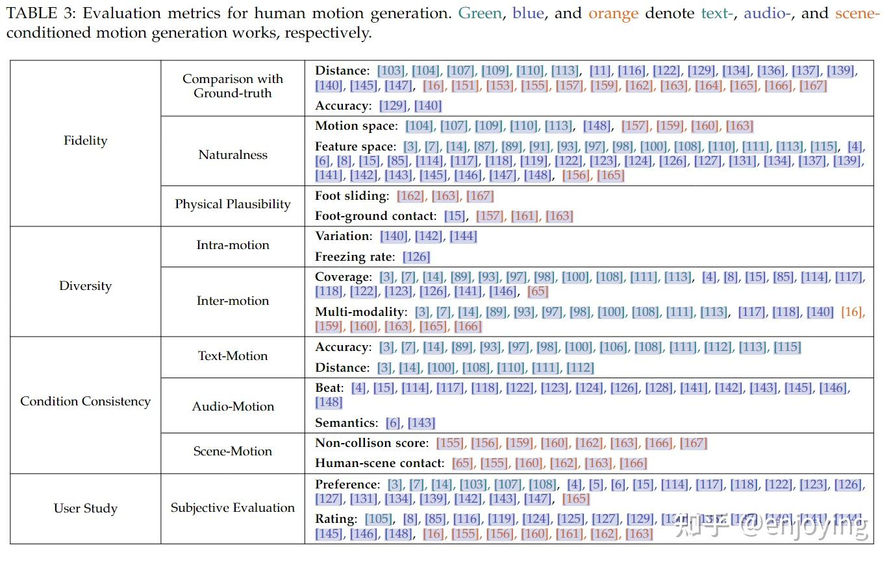

图3-评价指标

### 详细

#### 8 评估指标（Evaluation Metrics）

合适的评估指标对于比较不同方法、推动领域进步至关重要。然而，由于人体动作生成存在“一对多”映射、本身具有主观性，以及条件信号的高层次语义，**合成动作的评估是一个复杂且具有挑战性的问题**。本节我们将从不同角度总结常用的评估指标，并讨论它们的优缺点。相关内容可参考表3。

---

##### 8.1 保真度（Fidelity）

保真度指标旨在评估生成动作的整体质量，包括自然性、平滑性和合理性等方面。

###### 8.1.1 与真实数据的对比

在评估生成动作的质量时，**与真实数据的对比**是最直接的方法。

- **距离（Distance）**  
  大多数研究[11][16][104][105][108][110][111][114][117][130][135][137][138][140][141][146][152][154][156][158][160][163][164][165][166][167][168]采用距离指标来衡量合成动作与真实动作之间的差异。例如，Li等人[123]使用**归一化功率谱相似度（NPSS）**[202]来评估长期动作合成能力。NPSS在频域上进行比较，相较于均方误差（MSE），对帧错位不敏感。同时，**归一化方向动作相似度（NDMS）**[203]被提出用于衡量动作预测领域中动作方向的相似性和动作幅度的比例。

- **准确率（Accuracy）**  
  由于单纯的距离计算可能无法全面评估动作质量，一些研究[130][141]进一步计算**三维关键点正确率（PCK）**[204]，这是姿态估计领域常用的评估指标。PCK的计算方法是：若生成关节与目标关节的距离在预设阈值内，则判定为准确，最终统计准确关节的比例。

需要注意的是，真实数据仅代表给定条件输入下的一种可行结果，实际上可能存在无数种合理解。因此，**仅依赖与真实数据的对比来评估动作生成，可能无法全面反映模型性能**。

###### 8.1.2 自然性（Naturalness）

动作质量还体现在生成动作的自然性上，通常通过比较生成动作流形与真实动作流形来衡量。现有指标可分为**动作空间**和**特征空间**两类。

- **动作空间（Motion Space）**  
  部分方法基于动作空间中的几何统计量来衡量分布距离。例如，有研究[105][108][110][111][114]报告了**平均方差误差（AVE）**，用于计算真实动作与合成动作方差的差异。QPGesture[149]采用**Hellinger距离**[205]比较速度分布直方图。一些工作[149][158]还比较了关节位置的高阶导数（如加速度、冲击）。SAMP[160]和Wang等人[161]基于姿态旋转计算两种分布的**Fréchet距离（FD）**。在动作预测领域，还会用**功率谱熵（PSEnt）**和**KL散度（PSKL）**[206]来度量分布距离。SAGA[164]采用**PSKL-J**[206][207]来衡量生成与真实动作的加速度分布，从而评估动作的平滑性。

- **特征空间（Feature Space）**  
  第二类方法是在特征空间中，通过独立的神经网络作为动作特征提取器，计算分布距离。常用的指标有**Fréchet Inception Distance（FID）**，可通过辅助动作分类器[3][14][90][94][99][101][109][111][112][116][118][119][166]或自编码器[5][6][8][86][135][138][140][142][143][144][146][147][149][157]实现。该指标还可进一步将动作特征解耦为几何（姿态）和动力学（运动）两个方面[5][15][115][120][123][124][125][127]。这些方法利用精心设计的**动作特征提取器**[3][7][208][209][210]来计算特征距离。Kim等人[4]还训练了舞蹈风格分类器以提取风格特征并计算相应的FID。除了FID，还有其他指标用于衡量生成与真实分布的距离，包括**Inception Score（IS）**[132][211]、**卡方距离**[128]、**最大均值差异（MMD）**[88][92]、**最大平均相似度（MMS）**[98]、**典型相关分析（CCA）**[149][212]和**真实感分数（realistic score）**[148]等。

尽管这些指标直观易用，但也存在一些关键挑战。**它们对自然性的评估高度依赖于数据集分布和预训练特征提取器的有效性，可能无法全面反映动作整体质量**。例如，EDGE[15]指出，常用的FID分数与人工评价结果并不一致，这对该指标的有效性提出了质疑。

---

**两句话总结：**

1. **人体动作生成的评估指标主要包括与真实数据的距离、准确率，以及基于动作空间和特征空间的分布相似性，全面衡量动作的自然性与合理性。**
2. **重点：现有指标虽直观易用，但受限于数据分布和特征提取器的有效性，难以完全反映动作生成的真实质量，因此未来仍需探索更科学、客观的评估方法。**

#### 8.1.3 物理合理性
**物理合理性**指生成的运动是否符合物理规则，**重点关注足部与地面的交互**：（1）**脚部滑动**（foot sliding），（2）**足地接触**（foot-ground contact）。

**脚部滑动**  
部分研究通过量化足部滑移现象来评估。例如：  
- SAGA [164] 将"滑动"定义为：当脚后跟与地面距离小于阈值且双足移动速度超过阈值时触发；  
- CIRCLE [168] 统计生成序列中发生脚部滑动的帧数占比。

**足地接触**  
现有方法提出多种评估指标：  
- EDGE [15] 使用**物理接触评分（PFC）**；  
- SAGA [164] 计算**非碰撞分数**（身体网格顶点中高于地面的比例）；  
- HuMoR [158] 采用**二分类精度**评估人地接触，并统计**足部穿地频率**；  
- GAMMA [162] 结合地面高度阈值与滑动速度阈值计算接触分数。  

**核心问题**：当前缺乏统一的物理合理性量化标准，不同方法采用参数差异大，甚至评价体系也各不相同。**未来需开发更鲁棒且普适性强的评估指标**。

---

#### 8.2 多样性  
**核心目标**：生成多样化动作，避免重复性内容。评估分为两个维度：  

1. **单动作序列内多样性**（intra-motion）  
2. **多动作序列间多样性**（inter-motion）  

##### 8.2.1 动作内多样性  
针对长序列生成中的"冻结现象"（freezing problem），常用指标：  
- **变化度**：将动作分割为等长片段，计算片段间平均距离（如位姿/速度差异 [141,143,145]）；  
- **冻结率**：统计位姿参数的时间差异，量化静态动作占比 [127]。

##### 8.2.2 动作间多样性  
评估生成动作在整体分布上的多样性，分为两类：  
1. **覆盖率**（Coverage）  
   - 通过验证集采样N个条件信号，计算生成动作的**特征距离**（几何/运动/风格特征 [3,15,94]）  
   - 部分方法直接在动作空间计算多样性 [66,123]  

2. **多模态性**（Multi-modality）  
   - 对同一条件信号生成M组动作，计算组内平均距离：  
     ∙ 特征距离 [3,94] 或位姿距离 [16,141]  
     ∙ 高级指标：n-APD（标准化平均成对距离）[94,213]、ADE/FDE（位移误差）[213]  
   - 交互锚点或路径规划层面的多样性评估 [161]

---

**两句话总结**：  
**重点**：现有动作生成技术通过**物理合理性**（脚部滑动/接触）和**多样性**（单序列/多序列）两大维度评估质量，但**物理合理性缺乏统一标准**，而多样性评估已形成覆盖动作内变化度、冻结率以及动作间覆盖率和多模态性的完整体系。**未来突破方向**在于建立更普适的物理约束模型，并探索语义级多样性指标以贴近实际应用需求。

#### 8.3 条件一致性  
**核心目标**：评估生成动作与对应条件信号（如文本、音频、场景）的匹配程度。由于不同任务的条件类型差异大，需分任务讨论。

---

##### 8.3.1 文本-动作一致性  
**关键问题**：生成动作是否准确反映文本语义？  
- **准确性评估**  
  - **识别准确率**：使用预训练动作分类模型判断生成动作的类别匹配度 [7,90,94]；  
  - **R-Precision**：计算生成动作与文本特征的距离排名，取前k名平均精度 [3,14,101]（**重点：细粒度对齐**）。  
- **特征距离**  
  - **多模态距离**：直接量化文本特征与动作特征的差异 [3,14]；  
  - **Motion CLIP Score (mCLIP)**：利用CLIP空间的余弦相似度衡量文本-动作对齐 [111]；  
  - **互信息散度 (MID)**：通过跨模态信息流评估对齐程度 [111]。  

**局限性**：指标高度依赖预训练模型性能，可能无法客观反映真实对齐质量。

---

##### 8.3.2 音频-动作一致性  
**评估维度**：动作节拍与音频节拍的匹配度，以及语义关联性。  
- **节拍对齐**  
  - **节拍覆盖率/命中率**：统计音频节拍与动作节拍的重合比例 [118,119]；  
  - **节拍对齐分数**：结合节拍距离计算综合分数 [115]，后续研究加入音乐节拍权重优化 [5,15]；  
  - **角速度替代线速度**：用关节角速度变化评估节奏感，更贴近主观感知 [142]。  
- **语义关联**  
  - **语义手势召回率 (SRGR)**：基于真实数据的语义权重调整PCK指标 [144]；  
  - **语义评分 (SC)**：在联合嵌入空间量化动作与文本脚本的语义相似度 [6]。  

**关键缺陷**：现有指标忽略风格与情感的深层关联（如悲伤语音配欢快动作），**文化和谐性评估仍是空白**。

---

##### 8.3.3 场景-动作一致性  
**区分点**：与物理合理性（8.1.3）不同，**聚焦非地面物体与动作的交互逻辑**。  
- **非碰撞分数**  
  - 统计动作与场景物体无碰撞的比例（圆柱体模型/点云穿透检测 [157]）；  
  - 穿透体积量化（例如SAGA [164]用网格穿透体积cm³评估）。  
- **人-场景接触**  
  - **接触稳定性**：评估身体网格与物体的最小接触比例（抓握稳定性 [164]）；  
  - **接触误差/精度**：预测接触点与实际接触的均方误差（ACE）及k厘米内精度（AP@k）[66]。  
- **目标达成度**  
  - **执行时间**：从静止到目标动作的耗时 [160]；  
  - **身体-目标距离**：量化动作终点与目标物体的空间距离 [16,168]。  

**现状与挑战**：指标多为特定场景定制（如抓取、避障），**缺乏统一标准**，跨场景泛化能力受限。

---

**两句话总结**：  
**重点**：条件一致性评估需针对文本、音频、场景分别设计指标，**现有方法依赖预训练模型或特定场景定义**，且对风格/情感等深层关联的捕捉不足。**未来需突破跨模态对齐的客观量化瓶颈**，并建立兼顾通用性与细粒度场景适配的评估体系。

#### 8.4 用户研究  
**用户研究（主观评估）**是动作生成质量评估的关键补充，**重点解决客观指标的两大盲区**：  
1. **生物运动细节**（如抖动、脚部滑动）的人类敏感性；  
2. **文化语义层面**（如美学、情感表达）的复杂关联性。  

##### 评估方法  
- **偏好对比**（Preference）：  
  参与者观看两组动作并回答对比问题（如“哪组更符合文本描述？”、“哪段舞蹈与音乐风格更匹配？”），计算**胜率**或通过**Elo评分** [215] 量化生成质量 [15]。  
- **评分制**（Rating）：  
  要求用户对单组动作按维度（质量、多样性、一致性）打分（如1-5分），提供**细粒度量化反馈**。  

**局限性**：主观评估成本高，跨研究结果可比性低，且难以覆盖大规模生成场景。

---

### 9 总结与未来方向  
#### 核心挑战与突破方向  
1. **数据瓶颈**：  
   - **问题**：高质量动作数据稀缺，且表征形式与条件信号不统一；  
   - **解决路径**：探索**异构数据源融合**（弱监督学习、多模态基础模型 [107,218]）。  

2. **语义建模**：  
   - **重点**：动作不仅是肢体运动，更是**文化与情境的语义载体**（如手势含义、舞蹈风格）；  
   - **突破点**：基于语言先验的基础模型 [6,107]，从数据、方法、评估三层面深化语义关联建模。  

3. **评估体系**：  
   - **现状**：现有指标无法替代主观评估，且与人类感知存在偏差；  
   - **目标**：开发**可解释性强、符合人类直觉**的客观指标。  

4. **可控性**：  
   - **应用需求**：支持**交互式细粒度编辑**（如关节掩码控制 [15]、风格提示 [6]）；  
   - **技术挑战**：平衡生成自由度与约束条件的动态建模。  

5. **交互性**：  
   - **前沿场景**：从单人生成扩展到**动态交互**（如社交对话、群体舞蹈 [223]）；  
   - **关键问题**：建模人-人、人-环境的实时动作响应逻辑。  

---

**两句话总结**：  
**重点**：用户研究揭示**客观指标无法捕捉文化审美与细节瑕疵**，而未来需攻克数据-语义-评估的三角瓶颈，并推动生成技术向**高可控、强交互**演进。**核心趋势**在于融合多模态先验知识，构建既能满足专业需求又贴近人类感知的动作生成生态。

## conclusion

先是根据研究条件信号对动作生成研究进行分类，并详细讨论每个类别。此外提供了数据集资源和动作生成领域的一些评估指标。

以下是一些展望

1. Data：收集高质量的人体运动数据困难且昂贵。此外，数据集的适用性也不高。为了解决这些问题，未来的研究可以研究**异构数据源的使用**，通过弱监督学习方法或多模态基础模型整合它们的好处。
2. semantics。人体运动领域的一个具体挑战是如何为生成模型配备人体运动语义的先验知识。一些研究采用具有语言先验的预训练基础模型。未来的研究可以从不同的角度**更深入地探索语义连接**，包括数据、方法和评估。
3. evaluation。人体运动的适当评估指标至关重要但具有挑战性。虽然评估指标不能完全取代主观用户研究，但是未来的工作可以专注于设计更加**与人类的感知密切相关**并且具有**可解释性**的客观评估指标。
4. Controllability。控制生成内容的能力在实际应用中很重要。最近的一些工作探索了具有联合掩码或风格样式提示的可控人体运动生成。未来的工作可以进一步探索可控性以创建更用户友好的体验，例如交互式和细粒度的编辑。
5. Interactivity。目前的研究大多集中在在静态环境中生成单人运动。未来的工作可以在人与人和人类与环境交互的背景下深入研究人体运动生成。如紧密互动的社会群体，对话、群体舞蹈等。

## **Reference**

[1][arxiv.org/pdf/2307.10894.pdf](https://link.zhihu.com/?target=https%3A//arxiv.org/pdf/2307.10894.pdf)

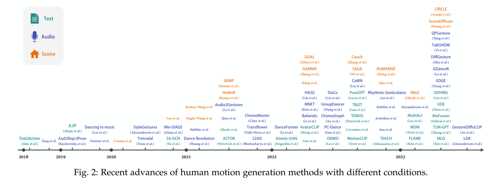

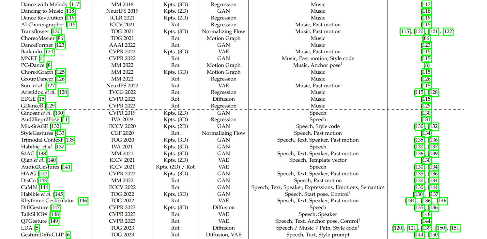

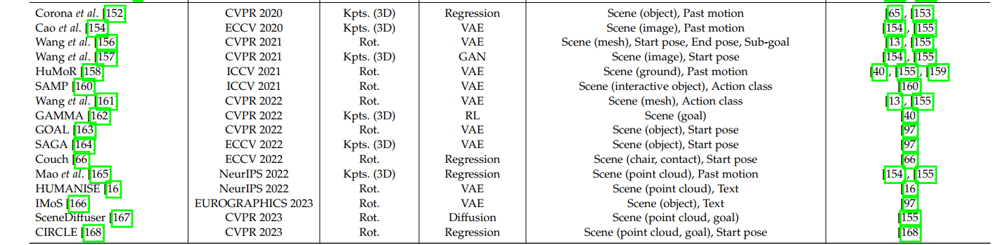

**文本驱动**

　　文本驱动人体动作生成任务旨在根据自然语言描述生成人体动作序列。这类方法可以分为两类：动作标签驱动和自然语言驱动。动作标签驱动利用有限的预定义标签生成动作，而自然语言驱动则可以基于多样化的文本描述生成更丰富的动作。

*我们想要的是**自然语言驱动**

**场景驱动**

　　场景驱动人体动作生成任务旨在根据场景环境生成合理的人体动作。这类方法通常采用多阶段管线，首先预测目标位置或目标交互锚点，然后规划路径或轨迹，最后沿轨迹生成动作

**05 未来展望** 

　　尽管这个领域取得了迅速的进展，但仍存在一些重大挑战需要未来的探索。有鉴于此，我们从不同角度展望了几个富有前景的未来研究方向，以期能激发人体动作生成研究的新突破。未来的工作可以从数据、语义、评价、可控性和互动性等方面进行深入研究，以实现更自然、真实、多样化的人体动作生成。

　　**数据**：收集高质量的人体动作数据具有挑战性，未来研究可以探讨使用异构数据源，通过弱监督学习方法或多模态基础模型整合数据优势。

　　**语义**：人体动作不仅仅是身体部位的运动，还具有丰富的非言语沟通功能。未来研究可以深入探讨从数据、方法和评价等方面捕捉人体动作与条件信号之间的高层语义关系。

　　**评价**：合适的动作评价指标至关重要，但具有挑战性。未来工作可以关注设计更符合人类感知且具有可解释性的客观评价指标。

　　**可控性**：生成内容的可控性在实际应用中非常重要。未来研究可以进一步探索可控性，以创造更用户友好的体验，例如交互式和细粒度编辑。

　　**互动性**：人体动作的互动性尚未得到充分探讨。未来研究可以关注人体动作生成在人际互动和人与环境互动背景下的应用，例如社交群体中的互动动作和动态可操作场景中的动作生成。

[61]: 
