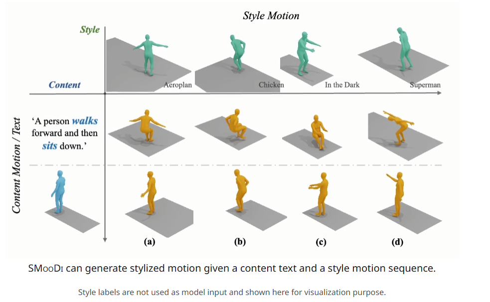

# Dance Like a Chicken Low-Rank Stylization for Human Motion Diffusion

| 序号   | 文章题目+中稿会议                                            | 摘要翻译                                                     | 核心突出点                                                   | Method部分截图                                               | 是否开源           | 相关链接                                          |
| ------ | ------------------------------------------------------------ | ------------------------------------------------------------ | ------------------------------------------------------------ | ------------------------------------------------------------ | ------------------ | ------------------------------------------------- |
| 1      | [StyleMotif](https://stylemotif.github.io/): Multi-Modal Motion Stylization using Style-Content Cross Fusion（ArXiv2025） | 我们提出**StyleMotif**——一种新颖的**风格化运动潜在扩散模型**，能够根据多模态输入的内容和风格条件生成运动。与现有方法仅关注生成多样化运动内容或从序列中迁移风格不同，==StyleMotif无缝融合了广泛的内容范围，同时整合来自运动、文本、图像、视频和音频等多模态输入的风格特征。== | 风格特征支持多种输入，比如运动、文本、图像、视频等           |                                   | :no_entry:         | https://stylemotif.github.io/                     |
| 2      | [Dance Like a Chicken](https://haimsaw.github.io/LoRA-MDM/): Low-Rank Stylization for Human Motion Diffusion | 我们提出**LoRA-MDM**——一种轻量级运动风格化框架，能够泛化至复杂动作并保持可编辑性。现有文本生成动作模型虽能覆盖广泛的3D人体动作，却难以捕捉**"Chicken Dance"**等细腻风格特征。由于风格特定数据稀缺，==当前方法通常将生成先验向参考风格靠拢，但这常导致分布外低质量生成结果。==<br>**本文的核心思想**：相较于在生成时逐个修改动作，通过调整生成先验来纳入风格（同时保持整体分布）更为有效。基于此，LoRA-MDM仅需少量样本即可学习适应新风格，并能在不同文本提示下复用该风格。低秩适应（LoRA）以语义化方式偏移动作流形，即使参考样本中未出现的动作也能实现逼真风格融合。==此外，保留分布结构支持高级操作（如风格混合与动作编辑）==。 | 1.塞了个LoRA进去，通过调整先验来直接纳入风格（同时保持整体分布）。<br>2.同时，结合sota的模型，可以做motion editing和motion style mixing的操作。 |  | :white_check_mark: | https://haimsaw.github.io/LoRA-MDM/               |
| 3 [53] | [MulSMo](https://arxiv.org/pdf/2412.09901): Multimodal Stylized Motion Generation by Bidirectional Control Flow（ArXiv2025） | 要生成既符合目标风格又遵循给定内容提示的运动序列，需要兼顾内容与风格的双重要求。==现有方法通常仅让信息从风格单向流向内容，这可能导致风格与内容之间的冲突，损害两者的融合效果。==与此不同，本研究构建了风格与内容之间的双向控制流，同时使==风格向内容方向调整，从而缓解风格-内容碰撞问题，并在融合过程中更好地保留风格动态特征。==此外，我们通过==对比学习将风格化运动生成的输入模态从单一（风格运动）扩展到文本、图像等多模态==，实现了对运动生成更灵活的风格控制。为提升性能，我们开发了==新型运动变分自编码器（VAE），将运动扩散模型升级为运动对齐的时序潜在扩散模型。==大量实验表明，本方法在不同数据集上均显著优于现有方法，同时支持多模态信号控制。我们的代码将开源发布。 | 1.传统都是直接风格指导动作生成，这篇是**双向控制流。**<br>2.对比学习可以支持多模态的输入；<br>3.为提升性能，将motion diffusion模型扩展到运行对齐的时序latent diffusion model |  | :no_entry:         | ArXiv：https://arxiv.org/pdf/2412.09901           |
| 4      | HUMOS: Human Motion Model Conditioned on Body Shape **[ECCV 2024]** | 生成逼真的人体运动对计算机视觉与图形学应用至关重要。==人体形态与尺寸的丰富多样性会显著影响运动方式，但现有运动模型通常忽视这些差异，仅采用标准化平均体型进行建模。这导致不同人体的运动呈现同质化特征，动作与物理属性不匹配，从而限制了运动多样性。==为此，我们提出一种创新方法，通过学习==基于体型的条件生成运动模型来解决该问题。==我们证明：通过循环一致性约束、直觉物理规则以及建模身份与运动相关性的稳定性约束，能够从非配对训练数据中学习此类模型。 | 1.支持多体型的动作生成，使得不同体型的动作生成结果都保持稳定 |  | :white_check_mark: | https://otaheri.github.io/publication/2024_humos/ |
| 5      | [SMEAR](https://dl.acm.org/doi/10.1145/3641519.3657457): Stylized Motion Exaggeration with ARt-direction**[Siggraph 2024]** | 在动画创作中，==**动态模糊帧**（smear frames）是艺术家惯用的运动表现手法。本文提出一种**自动化但支持艺术调控**的3D模糊帧生成方法，重点解决物体沿运动轨迹拉伸形成的**延长中间帧**（elongated in-betweens）问题。==该方法以关键帧动画的3D网格作为输入，为动画的每一帧输出变形后的网格模型，并允许艺术家在动画流程最终阶段、渲染开始前进行艺术化调整。我们的技术方案分两步实现：<br>1.**运动偏移量计算**：首先生成具有时空一致性的运动偏移量，量化输入网格各部分应产生的前导（leading）或拖尾（trailing）变形程度<br>2.**风格化处理框架**：通过设计的框架对这些运动偏移量进行风格化处理，以交互速率生成延长中间帧，并将该技术扩展至另外两种常见模糊帧效果——多重中间帧（multiple in-betweens）与运动轨迹线（motion lines）<br>新手用户可直接调用预设风格化函数实现快速原型设计，而资深艺术家则能通过我们在Blender中实现的**几何节点系统**（geometry node），设计更复杂的自定义风格化函数。 | 用图形学+数学（未使用神经网络)来建模出中间的插值姿态 | 纯数学方法                                                   | :white_check_mark: | https://github.com/MoStyle/SMEAR                  |
|        | [GitHub - XingliangJin/MCM-LDM: [CVPR 2024\] Arbitrary Motion Style Transfer with Multi-condition Motion Latent Diffusion Model](https://github.com/xingliangjin/mcm-ldm) |                                                              |                                                              |                                                              |                    | https://xingliangjin.github.io/MCM-LDM-Web/       |
|        | MoST: Motion Style Transformer between Diverse Action Contents |                                                              |                                                              |                                                              |                    | https://boeun-kim.github.io/page-MoST/            |
| [49]   | Monkey See, Monkey Do (MoMo)Harnessing Self-attention in Motion Diffusion for Zero-shot Motion Transfer（SIGGRAPH Asia 2024）利用运动扩散中的==自注意力==机制实现零样本动作迁移 | MoMo通过挖掘预训练扩散模型中自注意力机制的迁移能力，首次实现零样本动作迁移，在保持跟随者运动细节的同时精确复现领导者动作模式。 | **零样本迁移**：MoMo[49]通过注意力层操控实现                 | 沿着轨迹走？除此之外有什么不一样？？ | :white_check_mark: | https://monkeyseedocg.github.io/                  |
| [1]    | Unpaired Motion Style Transfer from **Video** to Animation 从视频到动画的无配对运动风格迁移 (siggraph 2020) | 本文提出了一种**无需配对数据**的运动风格迁移框架，能够从**无配对的带风格标签运动数据**中学习，并实现**训练集外新风格**的迁移。更突破性的是，该方法可直接从**2D视频**提取风格并应用于**3D动画**，无需3D重建过程。                                                <br />**==特征解耦==**：AdaIN[1]分离内容/风格特征 |                                                              |  |                    | https://arxiv.org/pdf/2005.05751                  |
| [21]   | Generative Human Motion Stylization in Latent Space(ICLR 2024) | 人体运动风格化的目标是在保持输入运动内容不变的前提下修改其风格。与现有直接在姿态空间操作的方法不同，我们利用预训练自编码器的**潜在空间**作为更具表现力和鲁棒性的表征，用于运动特征的提取与融合。基于此，我们提出了一种新型生成模型，能够为单一运动（潜在）代码生成多样化的风格化结果。在训练阶段，运动代码被解耦为两个编码组件：确定性的内容代码和符合先验分布的概率性风格代码；随后生成器通过对内容和风格代码的随机组合进行加工，重构对应的运动代码。我们的方法具有高度通用性，既可从带风格标签的运动数据中学习概率风格空间，**也能处理无标签数据**，在风格化处理上展现出显著灵活性。在推理阶段，用户可选择使用参考运动或风格标签作为风格提示，也可在无显式风格输入时，通过从无条件风格先验分布中采样实现新颖的重风格化。实验结果表明，尽管采用轻量化设计，我们提出的风格化模型在风格再现、内容保持以及跨应用场景的泛化能力方面均超越现有最优方法。                                              <br />==**特征解耦**==：沿用AdaIN[1]分离内容/风格特征 |                                                              |  |                    | https://yxmu.foo/GenMoStyle/                      |
| [27]   | Motion Puzzle: Arbitrary Motion Style Transfer by Body Part (siggraph 2022)动作风格迁移 | **==特征解耦==**：沿用AdaIN[1]分离内容/风格特征              | 控制**单个**身体部位运动风格                                 | 介绍https://zhuanlan.zhihu.com/p/708148312                   |                    | https://lava.kaist.ac.kr/?page_id=6467            |
|        | Human motion diffusion as a generative prior [ICLR 2024] 将人体运动扩散模型作为生成先验 | 训练先验模型从单个指定关节生成语义完整的运动。然后使用**DiffusionBlending**将几个这样的模型混合成一个 | **周期特征**：Li等[35]利用==相位特征==切换实现风格迁移       |                                                              | :white_check_mark: | https://github.com/priorMDM/priorMDM              |
|        | SMooDi: Stylized Motion Diffusion Model **ECCV 2024**        | 输入文本和风格化序列。风格适配器+风格控制信号。     <br />**风格化运动生成**   SMooDi[73]是唯一相关研究，其通过：<br />  1、为100STYLE数据集[40]生成文本标注   <br />2、结合**ControlNet**[71]和**分类器引导**[10]训练风格适配器   但存在**过拟合问题**，面对域外提示时生成动作呆板。 |                                                              |  |                    | https://neu-vi.github.io/SMooDi/                  |

[Motion Style Transfer](https://deepmotionediting.github.io/style_transfer) Siggraph 2020年的工作，但模型比较老，而且只有走路。

[GitHub - XingliangJin/MCM-LDM: [CVPR 2024\] Arbitrary Motion Style Transfer with Multi-condition Motion Latent Diffusion Model](https://github.com/xingliangjin/mcm-ldm)，这个也是类似工作，也是用Diffusion模型做的。


### **1. 核心任务目标的差异**

| **类型**     | **目标**                                                     | **典型输入**                           | **输出**                                                     |                                                              |
| ------------ | ------------------------------------------------------------ | -------------------------------------- | ------------------------------------------------------------ | ------------------------------------------------------------ |
| **风格迁移** | **保留输入动作的"内容"**（如走路、跳跃），仅改变其"风格"（如优雅、愤怒） | 源动作（内容） + 参考风格（动作/标签） | 与源动作内容一致，但风格与参考匹配的新动作                   | 风格迁移更契合实际场景（如游戏角色复用现有动画库 + 快速换风格）。 |
| **风格生成** | **根据条件（文本/标签）从头生成带有特定风格的新动作**，无需依赖具体源动作的"内容"骨架 | 文本描述/风格标签 + 随机噪声           | 全新动作（内容和风格均由条件控制，如生成"蹦蹦跳跳的快乐行走"） |                                                              |


1、**风格混淆消除**

2、可解释风格控制滑块 (StyleSlider)**

**核心创新**：将隐式风格向量转换为可解释的维度控制（如力量/柔韧度/节奏）
**技术路线**：

1. **维度发现**：对特征空间做正交分解，找到与人工标注风格维度（用户调研获得）对齐的主成分
2. **控制界面**：在推理时通过滑动条调整各维度强度（如力量+0.7，柔韧度-0.3）
3. **实时生成**：基于StyleGAN-V的架构实现低延迟（<50ms）

**实验设计**：

- 用户研究：证明滑块控制比文本提示更精准（p<0.01）
- 应用案例：调整「力量」滑块使舞蹈动作从芭蕾变为街舞

**优势**：无需重新设计模型，只需在潜在空间做线性变换

3、

**创新点**：生成违反物理规律但符合人类认知的风格化动作（如悬浮行走、反向关节运动）

4、

将2D动画风格（如新海诚/迪士尼画风）转换为3D动作特征

5、

随从： 玩家比如做出什么舞蹈动作，随从们/带的兵，就跟随做出类似动作，比如都挑衅，

比如玩家逃跑，带的兵就都很害怕，也会四散逃开之类的


方向3：**「多智能体风格博弈演化系统」**

**创新点**：构建NPC群体间的风格竞争-模仿机制，涌现不可预测的新动作风格

- 游戏用例

  ：

  - 大逃杀游戏中不同阵营发展出独特移动风格
  - MMO游戏中地域性动作文化自发形成
  - 塔防游戏敌人根据玩家策略进化克制性动作

- 核心技术

  ：

  1. 风格传播模型

     （3天）

     - 定义风格感染规则：视觉接触概率/战斗胜负关系
     - 开发风格遗传变异算法（20%概率随机突变关节运动模式）

  2. 群体强化学习框架

     （5天）

     - 使用Unity ML-Agents构建多智能体训练环境

     - 设计风格多样性奖励函数：

       ```
       复制代码奖励 = 对数(智能体间风格差异) + 动作可执行性  
       ```

  3. 玩家风格干预系统

     （2天）

     - 允许玩家通过特定操作「接种」风格（如舞蹈动作传播）
     - 开发风格溯源可视化工具（显示动作风格演化路径）

- 优势分析

  ：

  - 解决开放世界游戏NPC动作同质化问题
  - 创造玩家可参与的动态文化形成机制

- 快速验证

  ：

  - 在《GTA5》私服中搭建原型
  - 使用UE5 MetaHuman控制动作基因库

6、

环境影响npc

7、

生成boss

本质还是npc

恐怖游戏boss


# SMooDi: Stylized Motion Diffusion Model 风格化运动扩散模型

## Abstract

We introduce a novel Stylized Motion Diffusion model, dubbed SMooDi, to generate stylized motion driven by content texts and style motion sequences. Unlike existing methods that either generate motion of various content or transfer style from one sequence to another, SMooDi can rapidly generate motion across a broad range of content and diverse styles. To this end, we tailor a pre-trained text-to-motion model for stylization. Specifically, we propose style guidance to ensure that the generated motion closely matches the reference style, alongside a lightweight style adaptor that directs the motion towards the desired style while ensuring realism. Experiments across various applications demonstrate that our proposed framework outperforms existing methods in stylized motion generation.


Our model generates stylized human motions from content text and a style motion sequence. At the denoising step, our model takes the content text, style motion, and noisy latent as input and predicts the noise, which is then transferred to the predicted noisy latent for the next step. This denoising step is repeated T times to obtain the noise-free motion latent, which is fed into a motion decoder to produce the final stylized motion.

# SMooDi：风格化运动扩散模型

## 摘要

我们提出了一种新颖的风格化运动扩散模型**SMooDi**（**重点**），能够根据内容文本和风格运动序列生成风格化运动。与现有方法（仅能生成多样化内容的运动或在不同序列间迁移风格）不同，SMooDi可以快速生成**涵盖广泛内容与多样风格**（**重点**）的运动。为此，我们针对风格化任务定制了预训练的文本-运动模型。具体而言，我们提出了**风格引导机制**（**重点**）确保生成运动与参考风格高度匹配，同时设计了一个轻量级**风格适配器**（**重点**），在引导运动朝向目标风格的同时保持真实感。多场景实验表明，我们的框架在风格化运动生成上优于现有方法。

---

### 方法图解说明
  
（图示：SMooDi模型的工作流程）

1. **输入**：
   - **内容文本（c）**：描述目标运动的文本（如"某人向后走"）
   - **风格运动序列（S）**：体现目标风格的运动示例

2. **风格适配器（### 3.1）**：  
   将文本内容与风格运动融合，提取风格特征。例如，将"机械舞"风格注入"向后走"动作。

3. **风格引导（### 3.2）**：  
   对适配器输出进行细化，生成风格控制信号$$ \epsilon_t $$，指导后续去噪过程。

4. **迭代去噪**：  
   - 从带噪隐变量$$ Z_t $$开始（初始为随机噪声）
   - **潜空间去噪器（$$ \epsilon_\theta $$）**：  
     在每一步$$ t $$接收当前隐变量$$ Z_{t-1} $$、文本$$ c $$和风格引导$$ \epsilon_t $$，预测噪声并更新隐变量：  
     $$ Z_{t-1} = \frac{1}{\sqrt{\alpha_t}} \left( Z_t - \frac{1-\alpha_t}{\sqrt{1-\bar{\alpha}_t}} \epsilon_\theta \right) $$
   - 重复$$ T $$次直至获得干净隐变量$$ Z_0 $$

5. **解码器（D）**：  
   将$$ Z_0 $$解码为最终风格化运动，例如"带有机械舞风格的向后行走"。

---

### 核心创新
- **双路控制**：通过**文本定义内容**+**运动序列定义风格**，实现细粒度控制
- **轻量适配**：仅需微调预训练模型（如MDM）的少量参数，即可适配新风格
- **动态引导**：风格信号$$ \epsilon_t $$在每一步动态调整去噪方向

---

### 两句话总结
1. **重点** SMooDi首创**文本驱动内容+运动序列驱动风格**的双路扩散框架，突破传统方法在风格多样性上的限制。  
2. **重点** 通过**轻量风格适配器**和**迭代式风格引导**，在保持运动真实性的同时实现精准风格控制，用户仅需1个文本+1段示例即可生成新风格动作。  


# PriorMDM: Human Motion Diffusion as a Generative Prior  将人体运动扩散模型作为生成先验

好像和风格化没啥关系

## Abstract

In recent months, we witness a leap forward as denoising diffusion models were introduced to Motion Generation. Yet, the main gap in this field remains the low availability of data. Furthermore, the expensive acquisition process of motion biases the already modest data towards short single-person sequences. With such a shortage, more elaborate generative tasks are left behind.
In this paper, we show that this gap can be mitigated using a pre-trained diffusion-based model as a generative prior. We demonstrate the prior is effective for fine-tuning, in a few-, and even a zero-shot manner. For the zero-shot setting, we tackle the challenge of long sequence generation. We introduce DoubleTake, an inference-time method with which we demonstrate up to 10-minute long animations of prompted intervals and their meaningful and controlled transition, using the prior that was trained for 10-second generations.
For the few-shot setting, we consider two-person generation. Using two fixed priors and as few as a dozen training examples, we learn a slim communication block, ComMDM, to infuse interaction between the two resulting motions.
Finally, using fine-tuning, we train the prior to semantically complete motions from a single prescribed joint. Then, we use our DiffusionBlending to blend a few such models into a single one that responds well to the combination of the individual control signals, enabling fine-grained joint- and trajectory-level control and editing.
Using an off-the-shelf state-of-the-art (SOTA) motion diffusion model as a prior, we evaluate our approach for the three mentioned cases. Compared to SOTA methods, the DoubleTake approach demonstrates better quality scores for the intervals themselves and significantly better scores for the transitions between them. Through a user study, we show our communication block scores better quality and interaction levels compared to a SOTA model dedicated to the multi-person task. Our DiffusionBlending outperforms the motion inpainting approach over four different combinations of joints.

近几个月来，随着去噪扩散模型被引入运动生成领域，我们见证了该领域的飞跃式发展。然而，**重点**该领域的主要差距仍然是数据的低可用性。此外，运动数据的昂贵采集过程使得本就不足的数据偏向于短的单人序列。在这种短缺情况下，更精细的生成任务被搁置了。

本文中，我们证明可以通过使用预训练的基于扩散的模型作为**生成先验**来缩小这一差距。我们展示了这种先验在微调、少样本甚至零样本情况下的有效性。对于零样本场景，我们解决了长序列生成的挑战。我们提出了**DoubleTake**方法（**重点**），这是一种推理时方法，通过它我们展示了长达10分钟的动画生成，包括提示区间及其有意义且可控的过渡，而使用的先验模型仅训练了10秒的生成能力。

对于少样本场景，我们考虑双人生成。使用两个固定先验和少至十几个训练样本，我们学习了一个轻量级的通信模块**ComMDM**（**重点**），用于在两个生成的运动之间注入交互。

最后，通过微调，我们训练先验模型从单个指定关节生成语义完整的运动。然后使用**DiffusionBlending**（**重点**）将几个这样的模型混合成一个，使其能够很好地响应各个控制信号的组合，从而实现细粒度的关节和轨迹级别的控制和编辑。

我们使用现成的**最先进(SOTA)运动扩散模型**（**重点**）作为先验，评估了上述三种情况的方法。与SOTA方法相比，DoubleTake方法在区间本身和区间间过渡方面都表现出更好的质量分数。通过用户研究，我们展示了我们的通信模块在多人物任务中的质量和交互水平优于专用的SOTA模型。我们的DiffusionBlending在四种不同关节组合上的表现优于运动修复方法。

两句话总结：

1. **重点**本文提出PriorMDM框架，利用预训练扩散模型作为生成先验，有效解决了运动生成领域数据稀缺问题。
2. **重点**通过DoubleTake、ComMDM和DiffusionBlending三大创新方法，分别在长序列生成、双人交互和细粒度控制方面实现了突破性进展。


# Dance Like a Chicken: Low-Rank Stylization for Human Motion Diffusion


Figure 1. LoRA-MDM generates stylized motions using Low-Rank Adaptation of the Motion Diffusion Model (MDM). Left: motions generated using the base model. Middle: stylized generation using LoRA-MDM. Left: Style mixing


Abstract 

Text-to-motion generative models span a wide range of 3D human actions but struggle with nuanced stylistic attributes such as a ”Chicken” style. Due to the scarcity of style-specific data, existing approaches pull the generative prior towards a reference style, which often results in out-of-distribution low quality generations. In this work, we introduce LoRA-MDM, a lightweight framework for motion stylization that generalizes to complex actions while maintaining editability. Our key insight is that adapting the generative prior to include the style, while preserving its overall distribution, is more effective than modifying each individual motion during generation. Building on this idea, LoRA-MDM learns to adapt the prior to include the reference style using only a few samples. The style can then be used in the context of different textual prompts for generation. The low-rank adaptation shifts the motion manifold in a semantically meaningful way, enabling realistic style infusion even for actions not present in the reference samples. Moreover, preserving the distribution structure enables advanced operations such as style blending and motion editing. We compare LoRA-MDM to state-of-the-art stylized motion generation methods and demonstrate a favorable balance between text fidelity and style consistency. Project page at https://haimsaw.github.io/LoRA-MDM/


# 像鸡一样跳舞：基于低秩适配的人体运动扩散风格化模型


**图1**：LoRA-MDM通过运动扩散模型(MDM)的低秩适配生成风格化运动。左：基础模型生成结果；中：LoRA-MDM风格化生成；右：风格混合示例

## 摘要  

文本到运动生成模型虽能覆盖广泛的3D人体动作，但对"鸡舞"等**细微风格特征**的捕捉仍存在困难。由于**风格特定数据稀缺**，现有方法通常将生成先验向参考风格靠拢，但这往往导致**分布外低质量生成**。本文提出LoRA-MDM——一个轻量级运动风格化框架，既能泛化到复杂动作，又可保持编辑灵活性。  

我们的**核心洞见**是：与其在生成时逐个修改运动样本，**不如调整生成先验本身**来包含目标风格，同时保持其整体分布特性。基于此，LoRA-MDM仅需少量样本即可学习将参考风格适配到生成先验中。该风格可进一步结合不同文本提示进行多样化生成。**低秩适配**（就是(LoRA)的吧）会以语义明确的方式偏移运动流形，即使对于参考样本中未出现的动作，也能实现逼真的风格融合。此外，保持分布结构支持**高级操作**（如风格混合与运动编辑）。实验表明，LoRA-MDM在**文本保真度**与**风格一致性**间取得了更优平衡。项目主页：https://haimsaw.github.io/LoRA-MDM/

---

### 关键总结  
1. **方法创新**：通过低秩适配调整生成先验分布，而非直接修改样本，实现高效风格迁移  
2. **技术优势**：$$ \text{高质量} \propto \text{分布保持} + \text{低秩约束} $$，在少量数据下保持生成多样性


继续翻译成中文，并给出两句话总结，重点的标注**重点**，如果是1 使用##，如果是 3.1使用###，公式都弄好,公式前后加上$$，并帮我可读性写高一点（同时不可以缺少语句，原文该有的都有，可以增加你的理解，让翻译得容易读懂）,我要复制进typora中：

1. Introduction 

   

   Recent advancements in human motion generation conditioned on text have demonstrated impressive results, producing diverse and high-fidelity motions closely aligned with textual descriptions [8, 61, 70]. However, these models struggle to convey nuanced attributes, including profiles such as that of an elderly person, and fail to interpret abstract descriptions, such as ”a Superman style”. This limitation stems from the nature of existing text-to-motion datasets [18, 45, 47], which lack rich representations of styles and subtle nuances. In contrast, style-specific datasets [1, 40] provide better coverage of these nuances, but they are limited to a small and simple set of motions per style, falling short of capturing the wide variety of human actions. Using the latter datasets, a handful of approaches tackle motion stylization, or infusing a given style into the generation process of another motion. Specifically the two leading approaches either inject attention features from a given style motion into the generation process [49], or combine a ControlNet [71] with a classifier trained over the styles to perform guidance during the generation process [73]. In both cases, the generative process, based on a diffusion prior, is pushed out of its distribution to match the desired style, yielding lower overall quality, generalization, and editability. In this paper we introduce LoRA-MDM, a simple and efficient stylized motion generation method, yielding quality 1 arXiv:2503.19557v1 [cs.CV] 25 Mar 2025 and editability for diverse stylized actions. Drawing inspiration from image editing and, specifically, personalization literature [13, 50], our main insight is that augmenting the generation process with a given style means venturing into regions unfamiliar to the generative prior. Instead, it is better to shift the generative prior itself to include the style, while preserving its overall distribution structure. Equipped with this insight, a simple solution, of employing Low-Rank Adaptation (LoRA) [26], becomes clear; LoRA augments the weights of the prior in a low-ranked manner, which can be intuitively thought of as low frequency deformations to the target distribution manifold. Using LoRA, LoRA-MDM learns to embed the style within the output domain of the model, which can then be used to synthesize stylized motions in the context of different textual prompts. As we demonstrate, this offers two advantages: First, low-ranked augmentation diminishes forgetting, which in turn increases generation quality for stylized actions not seen during training. For example, directly fine-tuning a generated walking motion to walk like a chicken has little (or negative) influence on how the prior will generate kicks. Instead, our low-ranked tuning and structure preservation loss encourage the model to also kick like a chicken, since the changes affect the entire manifold. Second, because the generated stylized motions are in-distribution for the model, advanced operations such as stylized motion editing and style blending are supported, in sharp contrast to traditional motion style-transfer method. Using a pretrained state-of-the-art motion diffusion generative model and a LoRA trained on one or more styles, we demonstrate LoRA-MDM produces superior results compared to leading motion stylization approaches, qualitatively, quantitatively, and through a user study, both in terms of motion quality, and adherence to style or styles. Since the prior’s capabilities are not hampered, we also demonstrate that LoRA-MDM naturally combines with existing motion editing techniques. Specifically, we demonstrate trajectory control capabilities for generated stylized actions. In the future, we hope this personalization take on motion style can help set common practices for applying LoRA to other motion domains, and will inspire extending motion generation capabilities to other underrepresented axes.

## 1. 引言  

近年来，基于文本条件的人体运动生成技术取得了显著进展，能够生成与文本描述高度吻合的**多样化高保真运动**[8,61,70]。然而，这些模型在传达**细微属性**（如"老年人姿态"）或解释**抽象描述**（如"超人风格"）时仍存在明显不足。这一局限源于现有文本-运动数据集[18,45,47]**缺乏对风格和细微差异的丰富表征**。虽然风格专用数据集[1,40]能更好覆盖这些细节，但其仅包含少量简单动作，难以体现人类动作的广泛多样性。  

>风格专用数据集[1,40]
>
>Kfir Aberman, Yijia Weng, Dani Lischinski, Daniel CohenOr, and Baoquan Chen. Unpaired motion style transfer from video to animation. ACM Transactions on Graphics (TOG), 39(4):64–1, 2020. 1, 2
>
>Ian Mason, Sebastian Starke, and Taku Komura. Real-time style modelling of human locomotion via feature-wise transformations and local motion phases. Proceedings of the ACM on Computer Graphics and Interactive Techniques, 5(1):1–18, 2022. 1, 2

针对风格化运动生成（即将特定风格融入其他动作的生成过程），当前主流方法分为两类：  
1. **注意力特征注入法**[49]：在生成过程中植入参考风格运动的注意力特征  
2. **分类器引导法**[73]：结合ControlNet[71]与风格分类器进行生成引导  

这两种方法都通过**强制偏离扩散先验分布**来匹配目标风格，导致生成质量下降、泛化能力减弱和编辑灵活性丧失。本文提出的LoRA-MDM提供了一种高效解决方案，其核心思想受到图像编辑与个性化研究[13,50]的启发：  

**关键洞见**：与其在生成过程中冒险进入先验分布不熟悉的区域，不如**直接调整生成先验本身**使其包含目标风格，同时保持整体分布结构。  

基于此，我们采用**低秩适配(LoRA)**[26]技术——通过低秩方式调整模型权重，可直观理解为对目标分布流形进行低频变形。LoRA-MDM将风格嵌入模型输出域，从而支持结合不同文本提示生成风格化运动。这种方法具有双重优势：  

1. **低频增强减少遗忘**：$$ \mathcal{L}_{style} = \mathbb{E}_{x\sim p_{data}}[\|f_\theta(x)-f_{LoRA}(x)\|_2] $$ 使模型对训练中未见的风格化动作（如"鸡式踢腿"）仍能保持高质量生成，因为调整作用于整个运动流形  
2. **保持分布支持高级操作**：与传统运动风格迁移方法不同，生成结果仍处于模型分布内，天然支持**风格化运动编辑**和**风格混合**等操作  

实验表明，基于预训练运动扩散模型和单/多风格LoRA模块，LoRA-MDM在运动质量、风格契合度方面均优于现有方法（定性/定量评估+用户研究）。由于不损害先验能力，该方法还能与现有运动编辑技术（如轨迹控制）无缝结合。这项工作为运动风格个性化树立了新范式，未来有望推动LoRA在其他运动领域的应用，并拓展运动生成技术的覆盖维度。  

---

### 核心要点  
1. **问题本质**：传统方法通过扭曲生成分布实现风格化，导致$$ \text{质量} \downarrow + \text{泛化性} \downarrow $$  
2. **解决路径**：$$ \text{低秩适配} \oplus \text{分布保持} = \text{高质量风格化} + \text{编辑扩展性} $$


2. Related Work 

   2.1. Human Motion Synthesis Multimodal generation. In recent year, human motion generation has experienced significant progress with the advent of Transformers [66] and deep generative models [15, 24, 32]. Motions can be now generated from a variety of input modalities, including action categories [17, 38, 42, 68], music signals [2, 34, 55, 64], and textual descriptions [6, 18–20, 53, 59, 61, 72]. Early works achieved plausible 3D motion generation by leveraging variational autoencoders (VAEs) equipped with temporal models such as RNNs [17, 18, 34] and Transformers [42, 43]. However, these models often struggled to learn complex actions and handle fine-grained conditionality. To address this, a subsequent line of research modeled human motion generation in a discrete space. These approaches utilized VQ-VAE [65] to map human motions into discrete motion tokens, which were then generated from various modalities using language models like GPTs [19, 38, 55, 70] or generative masked Transformers [20, 44]. Diffusion models have also emerged as a powerful tool for motion synthesis due to their exceptional expressiveness. MDM [61] and MotionDiffuse [72] applied diffusion models directly in the raw motion feature space, while techniques like latent diffusion [6] and latent consistency models [9] have been adopted to enhance the efficiency of diffusion-based human motion synthesis. Motion style transfer. Motion style transfer aims to reenact an existing motion while incorporating the style characteristics specified by a reference style motion or label. Traditional methods, such as motion matching [67] and gram matrix optimization [11, 25], are limited in scalability and efficiency. Recent advances in data-driven deep learning models have enabled more efficient and faithful motion style transfer. Abermann et al.[1] introduced the use of AdaIN to disentangle style and content features, which has since been adapted in works such as Guo et al.[21], MotionPuzzle [27], Tang et al.[57], and MOCHA[28]. Adversarial learning has also been widely employed to enhance styleawareness [1, 58]. More recently, studies like MoMo [49] and MotionCLR [4] suggest that pre-trained motion diffusion models can achieve zero-shot style transfer by manipulating attention layers. Additionally, Li et al. [35] proposed a periodic autoencoder to extract phase features from motion, demonstrating style transfer as a byproduct of switching periodic phase features. More recently, MulSMo[36] suggested style mapping using a bidirectional control flow. Stylized motion generation. While style transfer focuses on re-enacting existing motions, our work aims to develop generative models capable of directly producing motions of specific styles given textual descriptions. To the best of our knowledge, SMooDi [73] is the only prior work in this area. SMooDi leveraged a pre-trained motion-to-text model [19] to caption the style dataset, 100STYLE [40], creating new text-motion pairs for style-specific motions. These pairs were then used to learn a style adaptor added on an existing motion diffusion model [6] using techniques from ControlNet [71] and classifier-guided sampling [10]. However, SMooDi suffers from overfitting on the style motion dataset, resulting in lifeless motions when handling out-of-domain prompts.

2.2. Personalized Image Generation Personalized image generation aims to introduce new visual concepts or styles to base text-to-image (T2I) models using reference images, which is directly relevant to our task. DreamBooth [50] fine-tunes the entire network with a preservation loss and requires only a few images. Textual Inversion [12] optimizes a token embedding for each new concept. However, both methods involve fine-tuning the entire network, which can be inefficient. Low-Rank Adaptation (LoRA)[26] improves fine-tuning efficiency by introducing low-rank layers to the base model and optimizing only the weight residuals. This approach has been widely adopted in personalized T2I models[3, 22, 33, 51, 56, 63]. Subsequent studies have expanded this personalization approach to handle multiple concepts [16, 46]. AnimateDiff [22] leverages existing personalized T2I models, converting them into animation generators by integrating a pre-trained motion module. Some works bypass the model training phase with dedicated personalization encoders [14, 54, 69] or by simply swapping certain attention layers [23, 29]. Given the relatively small size of human motion datasets, we adopt LoRA for stylized motion generation.

## 2. 相关工作  

### 2.1 人体运动合成  

**多模态生成**  
近年来，随着Transformer[66]和深度生成模型[15,24,32]的发展，人体运动生成取得显著进展。当前可通过**多种输入模态**生成运动，包括：  

- 动作类别[17,38,42,68]  
- 音乐信号[2,34,55,64]  
- 文本描述[6,18–20,53,59,61,72]  

早期研究采用**时序模型**（如RNN[17,18,34]和Transformer[42,43]）结合变分自编码器(VAE)生成3D运动，但难以建模复杂动作和细粒度条件。为此，后续工作转向**离散空间建模**：  
1. 使用VQ-VAE[65]将运动编码为离散token  
2. 通过GPT[19,38,55,70]或掩码Transformer[20,44]生成  

扩散模型凭借强大表现力成为新范式：  
- MDM[61]和MotionDiffuse[72]直接在原始运动特征空间应用扩散模型  
- 潜在扩散[6]和一致性模型[9]则提升生成效率  

**运动风格迁移**  
传统方法（如运动匹配[67]和Gram矩阵优化[11,25]）存在扩展性瓶颈。深度学习方法通过以下技术实现高效迁移：  

- **特征解耦**：AdaIN[1]分离内容/风格特征，被Guo等[21]、MotionPuzzle[27]等沿用  

  >[1] Kfir Aberman, Yijia Weng, Dani Lischinski, Daniel CohenOr, and Baoquan Chen. Unpaired motion style transfer from video to animation. ACM Transactions on Graphics (TOG), 39(4):64–1, 2020. 1, 2 :point_up_2:
  >
  >[21] Chuan Guo, Yuxuan Mu, Xinxin Zuo, Peng Dai, Youliang Yan, Juwei Lu, and Li Cheng. Generative human motion stylization in latent space. arXiv preprint arXiv:2401.13505, 2024. 2  :point_up_2:
  >
  >[27] Deok-Kyeong Jang, Soomin Park, and Sung-Hee Lee. Motion puzzle: Arbitrary motion style transfer by body part. ACM Transactions on Graphics (TOG), 41(3):1–16, 2022. 2  :point_up_2:
  
- **对抗学习**：增强风格感知[1,58]  
  
  >[58] Tianxin Tao, Xiaohang Zhan, Zhongquan Chen, and Michiel van de Panne. Style-erd: Responsive and coherent online motion style transfer. In Proceedings of the IEEE/CVF Conference on Computer Vision and Pattern Recognition, pages 6593–6603, 2022. 2   


- **零样本迁移**：MoMo[49]通过注意力层操控实现  
- >[49] Sigal Raab, Inbar Gat, Nathan Sala, Guy Tevet, Rotem ShalevArkushin, Ohad Fried, Amit Haim Bermano, and Daniel Cohen-Or. Monkey see, monkey do: Harnessing self-attention in motion diffusion for zero-shot motion transfer. In SIGGRAPH Asia 2024 Conference Papers, pages 1–13, 2024. 1, 2, 5, 6, 7 :point_up_2:
- **周期特征**：Li等[35]利用相位特征切换实现风格迁移  

- >[53] Yoni Shafir, Guy Tevet, Roy Kapon, and Amit Haim Bermano. Human motion diffusion as a generative prior. In The Twelfth International Conference on Learning Representations, 2024. 2, 7  :point_up_2:
- **双向控制流**：MulSMo[36]提出新型风格映射机制  
- >上面有

**风格化运动生成**  
SMooDi[73]是唯一相关研究，其通过：  

1. 为100STYLE数据集[40]生成文本标注  
2. 结合**ControlNet**[71]和**分类器引导**[10]训练风格适配器  
  但存在**过拟合问题**，面对域外提示时生成动作呆板。  

>[73] Lei Zhong, Yiming Xie, Varun Jampani, Deqing Sun, and Huaizu Jiang. Smoodi: Stylized motion diffusion model. In European Conference on Computer Vision, pages 405–421. Springer, 2025. 1, 2, 4, 5, 6, 12, 13  :point_up_2:
>
>[10] Prafulla Dhariwal and Alexander Nichol. Diffusion models beat gans on image synthesis. Advances in neural information processing systems, 34:8780–8794, 2021. 2

### 2.2 个性化图像生成  

**核心目标**：通过参考图像为文生图(T2I)模型添加新概念/风格，与本文任务高度相关。主要方法包括：  
- **全网络微调**：DreamBooth[50]加入保持损失，仅需少量图像  
- **嵌入优化**：Textual Inversion[12]为每个概念优化token嵌入  
- **高效适配**：LoRA[26]通过低秩层微调权重残差，成为主流方案[3,22,33,51,56,63]  

**扩展应用**：  
- 多概念处理[16,46]  
- AnimateDiff[22]将个性化T2I模型转化为动画生成器  
- 编码器方案[14,54,69]或注意力层替换[23,29]避免训练  

由于人体运动数据规模较小，本文采用**LoRA进行运动风格化生成**，在保持基础模型能力的同时实现高效适配。  

---

### 方法演进脉络  
1. **运动生成**：$$ \text{VAE/RNN} \rightarrow \text{离散token} \rightarrow \text{扩散模型} $$ 逐步解决复杂动作建模难题  
2. **风格迁移**：$$ \text{传统优化} \rightarrow \text{特征解耦} \rightarrow \text{零样本迁移} $$ 持续提升保真度与泛化性  
3. **个性化生成**：$$ \text{全参数微调} \rightarrow \text{嵌入优化} \rightarrow \text{LoRA} $$ 不断平衡效率与效果


## 3. 方法论

### 3.1 基础框架

**人体运动表示方法**  
我们采用Guo等人[18]提出的**263维人体运动表征**（完整定义见附录B.1），该表征包含：
- **根节点运动学**（Root kinematics）：  
  $$ \text{角速度} + \text{线速度} + \text{高度坐标} $$
- **关节级信息**：  
  所有关节相对于根节点的位置、速度和旋转参数
- **足部接触状态**：  
  用二进制标记表示双脚是否接触地面

### 3.2 去噪扩散模型

**扩散过程原理**  
基于DDPM框架[24]，我们构建**双向扩散过程**：

1. **前向过程**（加噪）：  
   $$ x_t = \sqrt{\alpha_t}x_0 + \sqrt{1-\alpha_t}\epsilon, \quad \epsilon \sim \mathcal{N}(0,I) $$
   其中$\alpha_t \in (0,1)$为预设参数，$t \in [0,T]$为时间步

2. **训练目标**：  
   生成器$G$需要从带噪观测$x_t$和条件$c$重建原始数据：  
   $$ \mathcal{L}_{simple} = \mathbb{E}_{x_0 \sim q(x_0|c),t \sim [1,T]} \left[ \|x_0 - G(x_t,t,c)\|^2 \right] $$

**运动扩散模型(MDM)**  
采用[61]提出的**Transformer-Decoder架构**，特点包括：
- 使用DistilBERT[52]进行文本编码
- 已被多个后续工作验证有效性[5,7,30,31,48,62]

### 3.3 低秩适配(LoRA)

**参数更新机制**  
给定预训练权重矩阵$W_0 \in \mathbb{R}^{d \times k}$：
- 传统微调：直接更新$W = W_0 + \Delta W$
- **LoRA创新点**：  
  $$ \Delta W = AB, \quad A \in \mathbb{R}^{d \times r}, B \in \mathbb{R}^{r \times k}, \quad r \ll \min(d,k) $$
  其中$r$为适配秩，训练时**仅优化$A,B$**而保持$W_0$冻结

### 3.4 LoRA-MDM系统架构

  
**图2** LoRA-MDM工作流程示意图

**核心组件**：
1. **双路输入**：
   - 文本提示（如"像鸡一样行走"）
   - 参考风格运动数据$\tilde{x}_0$

2. **改进的MDM结构**：
   - 在自注意力/交叉注意力层插入**LoRA模块**
   - 保持原始前馈网络结构

3. **双损失函数**：
   - **先验损失** $\mathcal{L}_{prior}$：保持运动数据结构  
     $$ \mathcal{L}_{prior} = \|G_\theta(x_t,y) - x_0\| $$
   - **风格损失** $\mathcal{L}_{style}$：捕捉目标风格特征  
     $$ \mathcal{L}_{style} = \|G_\theta(\tilde{x}_t,\tilde{y}) - \tilde{x}_0\| $$

**关键创新**：  
通过**特殊文本标记<>**将风格描述与参考运动绑定，实现：  
$$ \text{风格控制} = \text{文本引导} \otimes \text{运动示例} $$

---

### 方法优势总结
1. **高效适配**：LoRA仅需优化**0.1%参数**即实现风格迁移，较全模型微调效率提升百倍
2. **结构保持**：双损失机制确保生成动作既符合目标风格，又保持合理的人体运动学结构
3. **灵活扩展**：支持通过文本提示实时调整生成风格，如"夸张的"或"缓慢的"鸡式行走