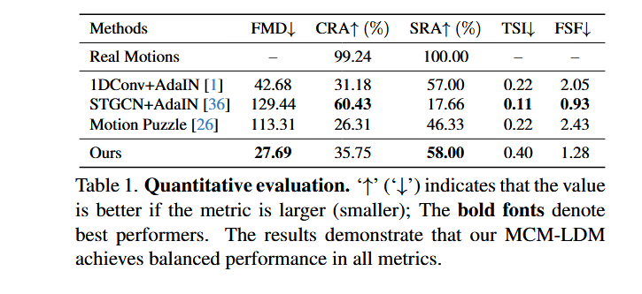
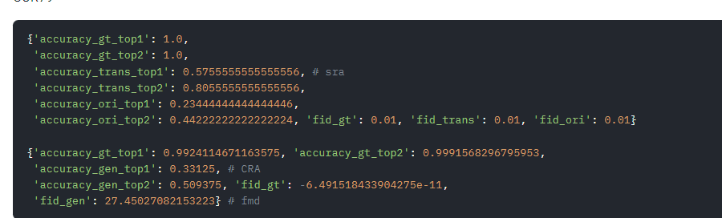

# 实验部分

# 总览

## 一、数据集介绍


## 二、评估指标和实验设置


## 三、实验结果

### 1. DCE 模块的消融实验

目标：2/3页

DCE先train好（当然Cstyle也要先train好，这个是用100Style数据集train的），frozen掉之后，取代MCM-LDM工作中的Style Remover，从头train HumanML3D数据集，轮次，学习率等参数与MCM-LDM保持一致，这样的话train完就可以和前面的工作做评估了。




DCE模块的训练过程（提一下学习率和epoch）：

- 1.训练一个Cstyle的分类器，做100Style数据集关于style的分类任务；
- 2.frozen Cstyle分类器，在100Style数据集上train DCE；

接着，Frozen掉DCE模块，用DCE模块替换掉本来MCM-LDM的style remover，从头train网络（数据集是HumanML3D）。

做完之后，即可跑评估标准，与上图进行一个定量的对比（可以写三行，不同的λadv值调参的结果（λadv=0.2， λadv=0.8， λadv=0.5））。

- （有时间，有最好）如果效果真的好很多，当然可以放结果对比图，这里的图是证明我们做风格迁移的效果更好。


### 2.场景任务，两个模块的消融实验（FiLM和时间加权denoiser去噪模块）

目标（算上图）：2/3页

- 关于DCE模块的消融，看一下时间是否允许

**场景-动作一致性打分器 (Scene-Motion Consistency Scorer) - 定量（新指标）SMCS:**

*   **概念:** 训练一个独立的模型（可以是基于Transformer的分类器或回归器），它的任务是接收一个动作序列和一个场景描述（文本嵌入），然后输出一个分数，表示这个动作和这个场景的匹配程度。

定量评估：只跟MCM-LDM比，我们的完整版/消融各个模块的版本，跟MCM-LDM只比SMCS指标。**比较让人信服的是有结果图的对比（有图），消融各个模块。**


### 3.定性分析

这里也放一张和题图差不多的图，如果时间允许可以多放一些对比试验。

- User Study：选一些（15~20）生成结果的视频，
  - （1）选出哪个最符合某个场景？
  - （2）选出哪个最符合某个Style？
  - （3）内容保真度，轨迹保真度，
  - （4）给出若干场景，选择更贴近于哪个场景？


# 正式开始实验部分

这里我们以testEvaluateEce0602这个机器为例，这个机器上面的内容是比较完整的。


## 一、关于DCE模块的训练过程

对于这一部分来说，需要保证git的分支是==testDCE==这个分支。

### 1.训练Cstyle，即类别的分类器

- 对应的训练Yaml文件为：`/root/autodl-tmp/MCM-LDM/style_classifier_config.yaml`

- 对应训练Cstyle的指令：`python train_style_classifier.py`
- 在训练开始之后，可以用tensorboard查看训练过程中的一些指标变化：

```python
tensorboard --logdir /root/autodl-tmp/MCM-LDM/experiments/style_classifier_checkpoints/style_classifier_training_experiment_v1/tensorboard_logs
```

明确一点：喂给Cstyle分类器的数据是100Style当中的motion和对应的style类别标签，这里的motion应该是263个维度的，而神经网络生成出来的结果应该是(nframes, 22)这样的结果，如果要直接测试生成结果可能还需要做一步转换。


务必注意在训练Cstyle的时候，下面数据集中`__get_item__`函数下面的数据归一化部分需要注释掉，因为我们的train脚本中会做一步基于HumanML3D的均值和方差的归一化操作，这里就不需要了：


#### （1）补充说明

训练CStyle的过程，看训练过程的准确率曲线，感觉是没什么问题的（一共训练100epoch，学习率1e-4）：


这个模块训练结束之后，指标如下：

```python
┏━━━━━━━━━━━━━━━━━━━━━━━━━━━┳━━━━━━━━━━━━━━━━━━━━━━━━━━━┓
┃        Test metric        ┃       DataLoader 0        ┃
┡━━━━━━━━━━━━━━━━━━━━━━━━━━━╇━━━━━━━━━━━━━━━━━━━━━━━━━━━┩
│         test_acc          │    0.9409835934638977     │
│         test_loss         │    0.1729532778263092     │
└───────────────────────────┴───────────────────────────┘
```

看起来这个Style分类器的效果是不错的。


### 2.关于DCE模块的训练过程

`python train_dce.py`，对应的文件yaml文件是：`/root/autodl-tmp/MCM-LDM/dce_training_config.yaml`，这里面有论文对应的$\lambda_{adv}$值，可以进行修改。

在训练完CStyle之后，我们将会开始DCE模块的训练。阅读代码的时候，可以从`train_dce.py`文件开始阅读。

VS Code的`launch.json`（注意，是MCM-LDM文件外面那个，不是里面的），会被修改为：


```json
{
        // Use IntelliSense to learn about possible attributes.
        // Hover to view descriptions of existing attributes.
        // For more information, visit: https://go.microsoft.com/fwlink/?linkid=830387
        "version": "0.2.0",
        "configurations": [
            {
                "name": "Train DCE Debug",
                "type": "debugpy",
                "request": "launch",
                ///root/autodl-tmp/MCM-LDM/demo_transfer.py
                "program": "/root/autodl-tmp/MCM-LDM/train_dce.py", // 确保这里指向正确的脚本路径
                "args": [
                    // "--cfg", "configs/config_test_our_train.yaml",
                    // //"--cfg_assets", "configs/assets.yaml",
                    // "--cfg_assets", "configs/assets0529.yaml",
                    // "--style_motion_dir", "demo/style_motion",
                    // "--content_motion_dir", "demo/content_motion",
                    // "--scale", "2.5", 
                    // //"--batch_size", "128",
                    // //"--nodebug"
                ],
                // /root/miniconda3/bin/python
                // "python": "/root/miniconda3/bin/python",
                "console": "integratedTerminal",
                "cwd": "/root/autodl-tmp/MCM-LDM" // 设置工作目录为项目根目录
            }
        ]
    }
```


这一部分有几个注意事项（==务必注意！==）

- （1）请注意，数据集中`__get_item__`函数下面的数据归一化部分依然需要注释掉。这里参考一、1节即可。

跑train的代码：`train_dce.py`

如果要训练DCE的话，请注意下面的参数：

> **后续需要关注和调整的：**
>
> 1. **首要关注 val_cstyle_acc_on_fc：** 我们希望这个指标在训练过程中显著下降。如果它一直很高（例如，只从95%降到80%），说明风格去除不充分，需要调整 lambda_style 和 lambda_content 的比例（通常是增加 lambda_style）。理想情况下，它应该降到一个接近随机猜测的水平（对于100类来说是1%），但这在实践中可能很难达到，降到20-30%或更低可能已经是不错的效果了。
> 2. **内容损失 (loss_content)：** 不能让这个损失过大，否则DCE提取的 f_c 会丢失太多原始 z_raw 的信息，影响后续生成。
> 3. **学习率和调度器：** 如果训练不稳定或收敛慢，考虑调整学习率或为优化器添加一个学习率调度策略。
> 4. **权重 lambda_style 和 lambda_content 的平衡：** 这是DCE训练中最需要精细调整的部分，通常没有一劳永逸的设置，需要根据实验结果来权衡。
> 5. 这个 acc_fc_no_grl 是一个**非常好的监控指标**：我们期望这个准确率在训练过程中逐渐下降，表明DCE正在成功地去除风格信息，使得 C_style 难以从 f_c 中识别出原始风格。


# 二、Finetune/重新训练——在HumanML3D数据集上

## 1.Finetune/重新训练

区别在于`/root/autodl-tmp/MCM-LDM/configs/base.yaml`这个yaml文件的这个字段：

```python
# 12行
PRETRAINED: '/root/autodl-tmp/MCM-LDM/checkpoints/denoiser_checkpoint/denoiser.ckpt' # Pretrained model path
```

如果上面的PRETRAINED字段有值，则可以理解成加载权重并finetune。如果为`''`，则应该是从头进行训练。

- `train`的指令如下：

```shell
python -m train --cfg /root/autodl-tmp/MCM-LDM/configs/config_finetune_mld_with_DCE.yaml --cfg_assets configs/assets.yaml --batch_size 128 --nodebug
```

如果要改train的配置（比如轮数等），可以去对应的yaml文件中改。


## 2.评估HumanML3D数据集上的结果

先进入这里：`cd /root/autodl-tmp/MCM-LDM`

具体的评估过程是这样的：

- 1.更改/root/autodl-tmp/MCM-LDM/configs/config_test_our_train.yaml中TEST字段下的checkpoints字段：

```python
CHECKPOINTS: '/root/autodl-tmp/MCM-LDM/experiments/mld/TrainDenoiser/checkpoints/epoch=79.ckpt'
```

- 2.跑测试：

运行下面的指令：

```bash
python demo_transfer_crafmd.py --cfg ./configs/config_test_our_train.yaml --cfg_assets ./configs/assets0529.yaml --style_motion_dir demo/content_test_feats --content_motion_dir demo/content_test_feats --scale 2.5
```

带有scene的如下：

```python
python demo_transfer_crafmd_wScene.py --cfg ./configs/config_test_our_train.yaml --cfg_assets ./configs/assets0529.yaml --style_motion_dir demo/content_test_feats --content_motion_dir demo/content_test_feats --scale 2.5
```


输出的路径如下（这个一共要测试1600项）：

`content=======results/mld/FinetuneWithDCEModule/content-0_expname_FinetuneWithDCEModule_scale_2-5.pkl`

需要等待一段时间，等待输出结果，同时可以开一个新的terminal，跑下面的代码：

```cmd
python demo_transfer_sra.py --cfg ./configs/config_test_our_train.yaml --cfg_assets ./configs/assets0529.yaml --style_motion_dir demo/style_test_feats --content_motion_dir demo/style_test_feats --scale 2.5
```

```python
python demo_transfer_sra_wScene.py --cfg ./configs/config_test_our_train.yaml --cfg_assets ./configs/assets0529.yaml --style_motion_dir demo/style_test_feats --content_motion_dir demo/style_test_feats --scale 2.5
```


输出的路径如下（这个一共要测试900项）：

`style=======results/mld/FinetuneWithDCEModule/style-0_expname_FinetuneWithDCEModule_scale_2-5.pkl`

注：如果是带有场景的，跑demo_transfer_crafmd_wScene.py和demo_transfer_sra_wScene.py这两个文件。


- 3.跑测试（剩下部分）：

切换conda环境：

```bash
conda activate evaluateEnv
```

跑下面的这两句指令（需要cd进去：`cd /root/autodl-tmp/MCM-LDM_Evaluation/MCM-LDM_Evaluation`）：

```python
python eval_FMD_CRA.py
python eval_SRA.py
```

指标的对应关系如下图所示：



## 3.跑demo_transfer出人的姿态的mp4效果图，供可视化


核心是下面这句：

```cmd
python demo_transfer.py --cfg ./configs/config_test_our_train.yaml --cfg_assets ./configs/assets0529.yaml --style_motion_dir demo/style_motion --content_motion_dir demo/content_motion --scale 2.5
```


# 三、为模型引入场景信息

### （1）训练

此时train的代码就变成了：

```python
python -m train_my --cfg /root/autodl-tmp/MCM-LDM/configs/config_train_denoiser.yaml --cfg_assets /root/autodl-tmp/MCM-LDM/configs/assets0529.yaml --batch_size 128 --nodebug
```

也就是说我们会在Scene对应的数据集上做训练。


# 四、渲染出结果图

去AutoDL中打开这个机器：`测试生成SMPL效果（现在只需要用这个）`，在第二页，进入到这个路径：/root/MotionLCM/MotionLCM/fit_npy.py 。接下来，按照下面的过程渲染出最终Blender的效果图。

- （1）把跑出来的style transfer之后的动作的**npy文件**（一般会紧挨着mp4文件，这个是跑出来的结果，content和style本身的不要放进来，==需要额外处理==）下载到一个文件夹当中。如果打包成zip的话，确保上传到`测试生成SMPL效果`这个机器之后unzip的结果在同一个文件夹下面。这里以/root/autodl-tmp/MotionLCM/fit_new.py同级目录下的`/root/autodl-tmp/MotionLCM/quickRender`这个文件夹为例，里面的内容如下：


- （2）进入到`fit_npy.py`文件当中，修改第343行：

```python
default="/root/autodl-tmp/MotionLCM/quickRender",  # 改成要渲染的文件夹的路径
```

然后用下面的指令渲染（==注意：如果文件夹里面有以_mesh.pkl结尾的文件，会跳过==）：

```python
python fit_npy.py
```

这个速度可能会比较慢，可能需要等待一段时间。有一个技巧可以加速渲染，来到`fit_npy.py`这个脚本当中，修改迭代次数（user study和初步看结果可以用5迭代次数，速度很快，渲染到论文当中的挑出来的好看的结果需要把default改成150，精确渲染）：

```python
parser.add_argument("--num_smplify_iters", type=int, default=15, help="num of smplify iters")  # 第348行，把default改成15
```


- （3）以上过程是进行SMPLify的过程，生成对应的SMPL的顶点。接下来是在Blender中渲染。进入到`/root/autodl-tmp/MotionLCM/batch_render_blender.py`这个文件当中，修改第106行为：

```python
default = "/root/autodl-tmp/MotionLCM/quickRender",  # 改成要渲染的文件夹的路径
```

运行以下指令即可批量把结果渲染出来：

```python
python batch_render_blender.py 
```


# 五、消融实验

整体流程是这样的。首先有一些重要的文件，要保证每个分支都有本地windows系统下面的`D:\GraduateStudent\Research\MotionGeneration\ablationStudy\important_files`里面的文件，放到MCM-LDM文件夹下面就行，后面需要。

- （1）首先，检查content_file，style_file里面的内容是否是正确的，style_file的东西可以通过`D:\GraduateStudent\Research\MotionGeneration\ablationStudy\style_motion`这个文件上传上去；
- （2）其次，确保一下`config_test_our_train.yaml`文件里面的配置是正确的，可以重新用demo_transfer（在上一步中，需要确认好content_file，style_file里面内容的准确性，保证公平）。每个消融实验的scene都跑固定的即可，比如可以跑[56]（bent down）相关的scene，这样评估指标才合理。

跑实验结果：

```python
python demo_transfer.py --cfg ./configs/config_test_our_train.yaml --cfg_assets ./configs/assets0529.yaml --style_motion_dir demo/style_motion --content_motion_dir demo/content_motion --scale 2.5
```


- （3）测试一下CRA， SRA， FMD相关的指标，具体流程如下：

```shell
# 1.
python demo_transfer_crafmd_wScene.py --cfg ./configs/config_test_our_train.yaml --cfg_assets ./configs/assets0529.yaml --style_motion_dir demo/content_test_feats --content_motion_dir demo/content_test_feats --scale 2.5
# 2.新建一个控制台，cd进去，然后跑
python demo_transfer_sra_wScene.py --cfg ./configs/config_test_our_train.yaml --cfg_assets ./configs/assets0529.yaml --style_motion_dir demo/style_test_feats --content_motion_dir demo/style_test_feats --scale 2.5
# 3.等上面两个跑完之后，新建一个控制台
conda activate evaluateEnv
cd /root/autodl-tmp/MCM-LDM_Evaluation/MCM-LDM_Evaluation
python eval_FMD_CRA.py # 务必注意！这俩里面要改一下读取的位置，这个位置会在控制台上被打印出来
python eval_SRA.py
```

这样就可以记录CRA，SRA，FMD相关的指标，

测试我们的SMCS指标：

- 先进行一步的转换：

```shell
python convert_joints2feats.py --input_folder='/root/autodl-tmp/MCM-LDM/results/mld/SceneMoDiffAll/style_transfer2025-06-05-15-41/' --output_folder='/root/autodl-tmp/MCM-LDM/results/mld/SceneMoDiffAll/style_transfer2025-06-05-15-41/res_feats'
```


```bash
python test_SMCS.py --ckpt_path='/root/autodl-tmp/MCM-LDM/experiments/style_classifier_checkpoints/style_classifier_training_experiment_v1/checkpoints/style-classifier-epoch=89-val_acc=0.96.ckpt' --input_folder='/root/autodl-tmp/MCM-LDM/results/mld/SceneMoDiffAll/style_transfer2025-06-05-15-41/res_feats' --ground_truth_class=3
```


原来的话 56是Bent，


## 1.w/o all

w/o all：

- SRA: 0.28444444444444444 
- CRA: 0.439375
- fmd：54.525
- SMCS: 0.65745

demo_transfer：11,GT=3,top5/6取平均值


w/o TDW（有FiLM的）

- SRA：0.441
- CRA: 0.33625
- fmd: 42.826
- SMCS:0.5778


totalModel:（有FiLM和TDW一起调控的）

- SRA：0.5363
- CRA：0.3719
- fmd：35.305
- SMCS：0.7552

以上消融实验的指标可以进行分析。


> 好的，这个澄清非常重要！如果 "SceneMoDiff w/o Scene Fusion (No FiLM, No TDW)" 的具体实现是：**$\mathbf{f}_{\text{scene}}$ 直接与原始风格特征 $\mathbf{f}_{s_{\text{motion}}}$ (来自MotionCLIP的输出) 进行简单的相加融合操作，然后这个融合后的特征作为风格条件输入到Denoiser中（并且Denoiser内部的独立场景特征通路可能被禁用或没有TDW作用）**，那么这确实会影响我们对这组数据的分析，但总体的大方向和你的核心优势依然存在。
>
> 让我们基于这个新的理解重新分析 "SceneMoDiff w/o Scene Fusion" 变体，并看看它如何融入整个故事线。
>
> **新的理解：**
>
> *   **SceneMoDiff w/o Scene Fusion (No FiLM, No TDW):**
>     *   $\mathbf{f}'_s = \mathbf{f}_{s_{\text{motion}}} + \alpha \cdot \mathbf{f}_{\text{scene}}$ (或者类似的简单加法/拼接后线性层，这里 $\alpha$ 是某个固定系数或无系数直接相加)。这个 $\mathbf{f}'_s$ 作为风格条件输入Denoiser。
>     *   Denoiser内部**没有**独立的 $\mathbf{f}_{\text{scene}}$ 输入，或者即使有，也没有TDW作用。
>     *   没有FiLM进行结构化的场景-风格调制。
>
> **基于新理解的数据分析和故事线调整：**
>
> 1.  **MCM-LDM (基线 - 无场景感知)**: (分析保持不变)
>     *   SMCS (25.05%) 作为参考。
>     *   FMD, CRA, SRA 代表SOTA的纯风格迁移性能。
>
> 2.  **SceneMoDiff w/o Scene Fusion (No FiLM, No TDW)**:
>     *   **SMCS (65.75%)**:
>         *   **新的解释：** 即使是通过简单的加法将场景特征 $\mathbf{f}_{\text{scene}}$ 混入风格特征 $\mathbf{f}_{s_{\text{motion}}}$，模型也能够捕捉到足够的场景信号来显著提升场景一致性（从25.05%到65.75%）。这表明场景信息本身对于指导动作生成是强有力的。
>     *   **FMD (43.94), CRA (34.50%), SRA (55.20%)**:
>         *   **新的解释：** FMD显著变差，CRA和SRA略有下降。这说明**简单粗暴的特征相加是一种非常原始的融合方式**。虽然它引入了场景信息，但也可能导致以下问题：
>             *   **特征空间不匹配/语义冲突**: 风格特征和场景特征可能位于不同的特征子空间或具有不同的语义尺度。直接相加可能会产生无意义或噪声大的融合特征。
>             *   **信息稀释/覆盖**: 场景特征可能会部分“覆盖”或“稀释”原始风格特征的表达，导致SRA下降。
>             *   **生成不自然**: 这种生硬的融合可能导致生成的动作在细节上不自然或出现伪影，从而使FMD升高。
>         *   SRA (55.20%) 仍然相对较高（仅略低于MCM-LDM的58.00%），这表明场景特征的加入并没有完全破坏风格，但FMD的显著增加说明了融合质量不高。
>
> 3.  **SceneMoDiff w/o TDW (Time-Dependent Weighting)**:
>     *   **实现方式回顾：** 这个变体包含FiLM ( $\mathbf{f}_{s_{\text{adapted}}} = \text{FiLM}(\mathbf{f}_{s_{\text{motion}}}, \mathbf{f}_{\text{scene}})$ )，并且独立的 $\mathbf{f}_{\text{scene}}$ 输入Denoiser，但其在FFN中的影响是**恒定的**（没有时间依赖的 $w_{\text{scene}}(t)$）。
>     *   **SMCS (57.78%)**:
>         *   **新的对比和解释：** 这个SMCS值低于"w/o Scene Fusion" (65.75%)。这是一个非常有趣的发现！这可能意味着：
>             *   **FiLM的初步融合 + Denoiser内部恒定的独立场景影响，在这种组合下，可能不如简单的“风格+场景”相加后直接作为风格输入的效果好（单就SMCS而言）。** 这可能是因为FiLM调制后的 $\mathbf{f}_{s_{\text{adapted}}}$ 和恒定影响的独立 $\mathbf{f}_{\text{scene}}$ 在Denoiser内部产生了某种冲突或冗余，或者恒定的独立场景影响设置不当。
>             *   这突显了**场景信息如何被整合以及在哪里被整合是至关重要的。**
>     *   **FMD (42.83), CRA (33.63%), SRA (44.10%)**:
>         *   FMD和CRA与 "w/o Scene Fusion" 类似，都比较差。
>         *   **SRA (44.10%) 大幅下降，仍然是最低点。** 这进一步强化了我们的判断：FiLM虽然进行了场景-风格融合，但如果Denoiser内部独立的场景特征以一种不恰当的、恒定的方式施加影响，会对风格的保持产生严重的负面作用，比简单相加的策略破坏性更大。这可能是因为独立的场景特征在整个去噪过程中持续地、不分阶段地“拉扯”动作的风格。
>
> 4.  **SceneMoDiff (Ours - Full Model)**: (核心分析保持不变，但对比的基点更清晰了)
>     *   **SMCS (75.52%)**: 仍然是最高分。
>         *   **新的对比和解释：** 远高于简单的加法融合 (65.75%) 和包含FiLM但无TDW的策略 (57.78%)。这表明我们提出的**层级化融合策略（FiLM初步适应 + Denoiser内部TDW动态调制独立场景特征）是实现最佳场景一致性的关键。** FiLM提供了一个比简单相加更结构化的初始融合，而TDW则确保了独立场景特征在Denoiser中被精细、动态地应用。
>     *   **FMD (35.31)**: 远优于两个中间消融变体，虽然仍略高于MCM-LDM，但显示出场景信息的引入在我们的完整模型中对动作质量的影响是可控的。
>     *   **CRA (37.19%)**: 仍然是最高。
>     *   **SRA (53.63%)**: 显著高于 "w/o TDW" (44.10%)，并接近简单加法融合的 "w/o Scene Fusion" (55.20%)。这表明我们的完整模型在提升场景感的同时，较好地保持了风格，TDW的动态调整起到了关键的平衡作用。与MCM-LDM的58.00%相比略低，这仍然可以被解释为场景对风格的合理适应性调整。
>
> **调整后的故事线：**
>
> **引言/目的：** (保持不变)
>
> **故事讲述流程：**
>
> 1.  **基线设定 (MCM-LDM)：** (保持不变)
>     *   强调其SMCS作为“机会水平”。
>
> 2.  **探索简单的场景信息融合方式及其局限性 (SceneMoDiff w/o Scene Fusion):**
>     *   “我们首先尝试了一种最直接的场景信息融合方式：将场景特征$\mathbf{f}_{\text{scene}}$与原始风格特征$\mathbf{f}_{s_{\text{motion}}}$简单相加，然后将此混合特征作为风格输入到Denoiser中（不使用FiLM，且Denoiser内部无TDW或独立的场景通路）。如"SceneMoDiff w/o Scene Fusion"所示，这种简单操作已能将SMCS从25.05%显著提升至65.75%，证明了场景信息对于引导动作生成的巨大潜力。”
>     *   “然而，这种朴素的融合策略也带来了明显的副作用：FMD从27.69大幅增加到43.94，表明生成的动作质量和真实感显著下降。同时，CRA和SRA也略有降低。这揭示了**简单地混合特征向量不足以实现高质量的场景感知风格迁移；虽然场景一致性有所改善，但代价是牺牲了动作的自然度和风格的纯粹性，可能是因为特征空间的直接叠加引入了噪声或导致了语义冲突。**”
>
> 3.  **评估结构化初步融合与独立场景影响（但无动态调整）的效果 (SceneMoDiff w/o TDW):**
>     *   “接下来，我们引入了FiLM进行结构化的初步场景-风格融合，并允许独立的场景特征$\mathbf{f}_{\text{scene}}$以恒定方式影响Denoiser的FFN（即"SceneMoDiff w/o TDW"）。出乎意料的是，SMCS（57.78%）反而低于上述简单相加的策略。更引人注目的是，SRA骤降至44.10%，远低于其他所有方法。FMD和CRA也未得到改善。”
>     *   **解释：** “这一结果表明，**不恰当的场景信息整合方式可能比简单混合更糟糕。** 尽管FiLM提供了更结构化的初始融合，但如果后续独立的场景特征在整个去噪过程中以一种恒定且可能不协调的方式强加影响，它会严重破坏风格的表达。这凸显了在Denoiser内部对场景影响进行精细控制的必要性。”
>
> 4.  **展示完整模型的优越性——TDW的关键作用 (SceneMoDiff - Ours - Full Model):**
>     *   “最终，我们的完整SceneMoDiff模型，它不仅采用FiLM进行初步的场景-风格融合，更关键的是，在Denoiser内部通过时间依赖权重（TDW）动态地调制独立场景特征$\mathbf{f}_{\text{scene}}$的影响。这一完整策略带来了全面的性能提升。”
>     *   **SMCS的领先：** “SMCS达到了75.52%，是所有设置中最高的，证明了我们分层和动态场景集成策略的卓越效果。”
>     *   **质量与风格的恢复与平衡：** “与移除TDW的变体相比，完整模型的FMD（35.31）显著改善，SRA（53.63%）也大幅回升。这充分证明了**TDW在协调场景适应与保持动作质量和风格方面的关键作用。** TDW允许场景信息在去噪的不同阶段施加不同强度的影响，避免了在早期阶段对风格的过度干扰，同时在后期精细调整动作以符合场景。”
>     *   **CRA的提升：** （分析保持不变，强调其积极意义）
>     *   **与MCM-LDM的比较：** “虽然FMD和SRA略逊于没有场景约束的MCM-LDM，但考虑到SMCS的巨大提升和CRA的领先，这种权衡是完全可以接受的，并突出了我们的方法在实现场景感知这一新颖目标上的成功。”
>     *   **结论：** “消融实验清晰地证明了我们SceneMoDiff框架中各个组件的贡献。简单的场景特征引入可以提高场景一致性但牺牲质量。不当的场景整合（如无TDW的恒定影响）甚至可能进一步损害风格。而我们提出的FiLM初步融合与Denoiser内部TDW动态场景特征调制的完整方案，有效地实现了场景感知、动作质量、内容保留和风格准确性之间的高水平平衡。”
>
> **核心论点更加清晰：**
>
> *   场景信息本身是有用的（简单相加能提升SMCS）。
> *   但如何整合场景信息至关重要。简单粗暴不行，不当的固定整合更糟。
> *   你的**层级化（FiLM）和动态化（TDW）**整合策略是成功的关键，特别是TDW对于平衡各种性能指标起到了决定性作用。
>
> 这个新的理解和调整后的故事线，我认为更加合理，并且能够更好地突出你方法中TDW这一核心创新点的价值。它解释了为什么中间的消融步骤（特别是"w/o TDW"）表现不佳，从而反衬出完整模型的巧妙之处。


w/o all: style丢失，scene比较遵循


