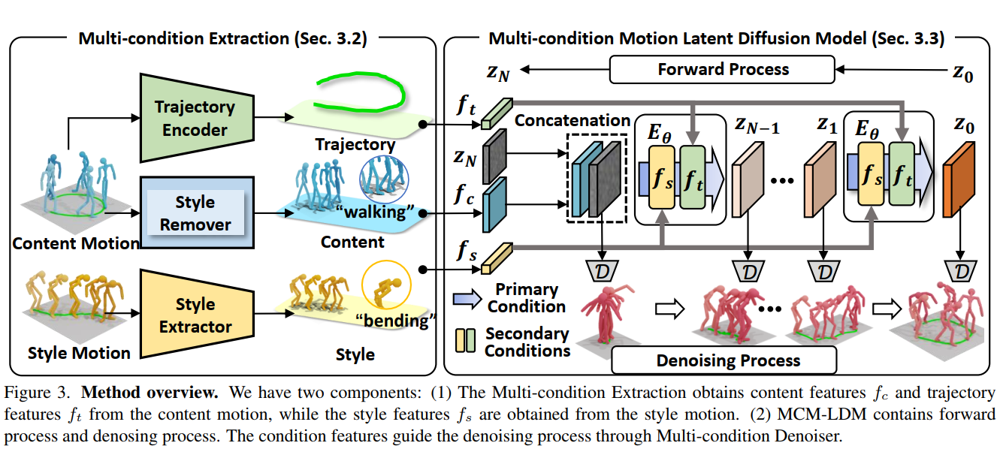

# 场景 + 风格 动作迁移

是否可以测试两个style（场景也作为一种style）的融合？

动作的style和场景的style怎么做融合？融合的模块

怎么评估?

​	评估方法，比如做一个场景分类器对生成结果做场景分类

​	

数据集：各种不同场景下的动作

1、收集数据集-各种不同场景下的动作

​	比如视频识别动作序列。问题：能否少量数据也能有效果呢？以及收集到的数据可以做哪些处理？

2、给现有数据集 加场景标注 。问题：可能本来是没有场景的，不准确

3、LLM 生成场景对应的style

目前任务：

找到数据集 至少7-8类，总的动作至少200-300个比较有说服力(比如实操的时候可以结合LLM生成的风格化序列：取10% + 自己构建的数据集（实际上可以先标注style100，看看是不是work的，比如手动标注10个场景）)

可以先尝试上述的网络结构不变，加一个scene encoder，塞一个$f_{scene}$进入到Diffusion过程里面，看看效果是不是符合预期（比如大风->用手挡住）

对于新的课题来说，比如我们这个，网络创新不重要（事实上网络的创新也很简单）。主要是把这件事做出来了。

f_scene可以采用这个方式：

512 

100个512