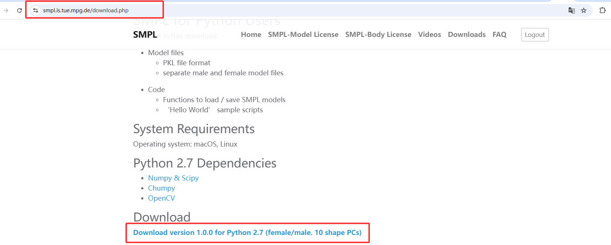
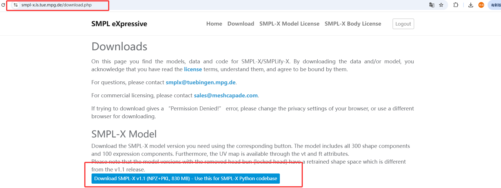
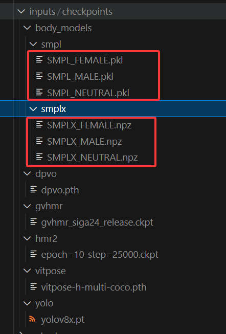
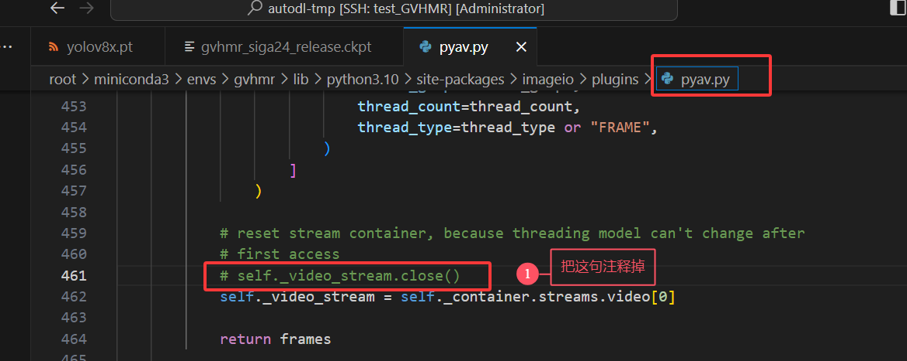
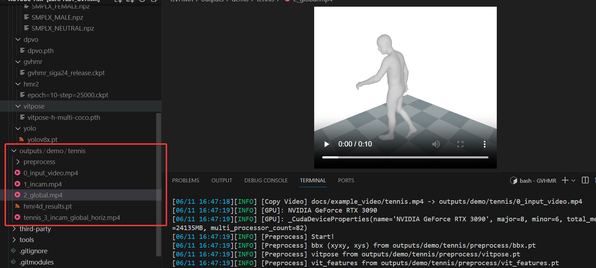

# 跑通 GVHMR 项目的介绍

对应的Github链接：https://github.com/zju3dv/GVHMR/blob/main/docs/INSTALL.md


# 一、配环境

## 1.基本环境配置

对应的指令如下：

```python
source /etc/network_turbo # 学术加速
git clone https://github.com/zju3dv/GVHMR
cd GVHMR
unset http_proxy && unset https_proxy # 关闭学术加速
conda create -y -n gvhmr python=3.10  # 参考报错【1】
conda activate gvhmr # 这句可能需要重开一个terminal
pip install -r requirements.txt
pip install -e .
```

以下是对应报错的总结：

- （1）报错【1】：报错`RuntimeError: Unable to read repodata JSON file '.../free/noarch', error was: repository does not start with an object`，解决方案是关闭学术加速代理：`unset http_proxy && unset https_proxy`；


## 2.百度网盘配置（用于下载权重等大数据）

由于我这边有百度网盘的会员，因此首先先在Windows上下载到本地，然后上传到网盘上，从网盘下载，这样对于几个G的权重数据也是能够成功上传上去的。以下介绍这部分的基本配置：
### （1）Linux上安装百度网盘和基本使用

> 好的，没有问题。在 Linux 系统上，尤其是服务器环境，使用命令行工具来操作百度网盘是最高效的方式。我将为你提供一份详细的、分步的教程，使用目前最流行和强大的开源工具 `BaiduPCS-Go` 来实现你的需求。
>
> ### 教程概述
>
> 本教程将分为四个主要部分：
> 1.  **安装 BaiduPCS-Go**: 下载并配置好这个强大的命令行工具。
> 2.  **获取浏览器 Cookie**: 安全地从你的浏览器中获取用于登录的 Cookie。
> 3.  **使用 Cookie 登录**: 在 `BaiduPCS-Go` 中完成登录认证。
> 4.  **浏览和下载文件**: 学习如何列出文件、切换目录和高速下载你需要的文件。
>
> ---
>
> ### Part 1: 安装 BaiduPCS-Go
>
> `BaiduPCS-Go` 是一个用 Go 语言编写的工具，安装非常简单，我们只需要下载编译好的二进制文件即可。
>
> #### 步骤 1.1: 确定你的系统架构并下载文件
>
> 首先，你需要知道你的 Linux 系统架构。在绝大多数情况下（包括几乎所有的云服务器和现代桌面版 Linux），它都是 `amd64` (也叫 `x86_64`)。你可以通过以下命令确认：
>
> ```bash
> uname -m
> ```
> 如果输出是 `x86_64`，那么你就需要下载 `amd64` 的版本。
>
> 现在，我们去 `BaiduPCS-Go` 的 [GitHub Releases 页面](https://github.com/qjfoidnh/BaiduPCS-Go/releases) 寻找最新的版本。
>
> **操作步骤**：
> 1.  打开终端。
> 2.  使用 `wget` 命令下载最新的、对应你系统架构的压缩包。下面以一个具体的版本为例（建议你去 Release 页面找最新的链接替换）。
>
>     ```bash
>     # 我自己下载的链接如下
>     # 可能需要再开一下学术加速：source /etc/network_turbo
>     wget https://github.com/qjfoidnh/BaiduPCS-Go/releases/download/v3.9.7/BaiduPCS-Go-v3.9.7-linux-amd64.zip
>     ```
>
> #### 步骤 1.2: 解压并安装
>
> 1.  下载完成后，使用 `tar` 命令解压文件：
>     ```bash
>     # 解压你刚刚下载的文件
>     unzip BaiduPCS-Go-v3.9.7-linux-amd64.zip 
>     ```
> 2.  解压后你会得到一个名为 `BaiduPCS-Go` 的文件夹。为了能在系统的任何路径下直接运行它，我们将其移动到 `/usr/local/bin` 目录下。
>     ```bash
>     # 进入解压后的目录
>     cd BaiduPCS-Go-v3.9.7-linux-amd64
>     
>     # 将主程序移动到系统路径中，这需要管理员权限
>     sudo mv BaiduPCS-Go /usr/local/bin/
>     ```
> 3.  为了确保程序有执行权限，我们给它添加可执行权限：
>     ```bash
>     sudo chmod +x /usr/local/bin/BaiduPCS-Go
>     ```
>
> #### 步骤 1.3: 验证安装
>
> 在终端输入以下命令：
> ```bash
> BaiduPCS-Go
> ```
> 如果你看到 `BaiduPCS-Go` 的欢迎信息和版本号，说明安装成功！程序会进入一个交互式命令行，你可以输入 `quit` 或按 `Ctrl+D` 退出。
>
> ---
>
> ### Part 2: 获取浏览器 Cookie
>
> 这是整个过程中最关键的一步。使用 Cookie 登录可以避免输入用户名密码，也能绕过复杂的验证码和两步验证（2FA）。
>
> 1.  **登录百度网盘**: 在你的电脑上，使用 Chrome 或 Firefox 浏览器，正常访问 `pan.baidu.com` 并登录你的账号。
>
> 2.  **打开开发者工具**: 登录成功后，在当前页面按 `F12` 键，打开浏览器的“开发者工具”。
>
> 3.  **找到网络请求**:
>     *   在开发者工具中，切换到 **"Network" (网络)** 标签页。
>     *   刷新一下网页（按 `F5`），或者点击网盘里的任意一个文件夹。
>     *   此时 Network 标签页会列出很多网络请求。
>
> 4.  **复制 Cookie**:
>     *   在请求列表中，找到任意一个向 `pan.baidu.com` 发出的请求，点击它。
>     *   在右侧出现的窗口中，找到 **"Request Headers" (请求标头)** 部分。
>     *   向下滚动，找到名为 **`Cookie:`** 的一行。
>     *   右键点击 `Cookie:` 旁边的**完整的值**，选择“复制值 (Copy value)”。这一长串字符串就是我们需要的 Cookie。
>
> 
>
> > **安全提示**: Cookie 包含了你的登录凭证，**绝对不要泄露给任何人！**
>
> ---
>
> ### Part 3: 使用 Cookie 登录
>
> 这里我们使用BDUSS登录，具体的指令如下：
> ```shell
> BaiduPCS-Go login -bduss=你的BDUSS值
> ```
>
> 
>
> ---
>
> ### Part 4: 浏览和下载文件
>
> 登录成功后，你就可以像在 Linux 终端里一样操作你的网盘文件了。比如有了上一步之后，可以输入BaiduPCS-Go进入交互式界面。
>
> #### 常用命令
>
> *   **列出文件和文件夹**:
>     ```bash
>     # 类似 ls 命令
>     ls
>     
>     # 显示更详细的信息
>     ll
>     ```
>
> *   **切换目录**:
>     ```bash
>     # 进入名为 "我的学习资料" 的文件夹 (如果文件夹名有空格，用引号括起来)
>     cd "我的学习资料"
>     
>     # 返回上一级目录
>     cd ..
>     ```
>
> *   **下载文件或文件夹**:
>     这是最重要的功能。使用 `download` 或其缩写 `d`。
>
>     ```bash
>     # 下载名为 "毕业论文.docx" 的文件到当前工作目录
>     download "毕业论文.docx"
>     
>     # 下载整个名为 "项目代码" 的文件夹
>     d "项目代码"
>     ```
>
> #### 高级下载技巧 (推荐)
>
> *   **指定保存路径**: 使用 `--saveto` 参数。
>     ```bash
>     # 将文件下载到你指定的 /root/downloads 目录
>     d "毕业论文.docx" --saveto /root/downloads
>     ```
>
> *   **提升下载速度**: 使用 `-p` 参数增加并行连接数，可以显著提升大文件的下载速度。
>     ```bash
>     # 使用 32 个线程并行下载，速度飞快！
>     d "我的电影.mp4" -p 32
>     ```
>
> *   **组合使用**:
>     ```bash
>     d "我的电影.mp4" -p 32 --saveto /root/autodl-tmp/movies
>     ```
>
> ### 总结
>
> 至此，你已经掌握了在 Linux 上通过 `BaiduPCS-Go` 工具，使用 Cookie 登录并高速下载百度网盘文件的全部流程。这是一个非常强大和稳定的解决方案，尤其适合在服务器上进行批量下载或自动化操作。


# 二、必要的文件下载

有一些重要的文件需要下载：

- （1）权重文件
- （2）SMPL相关的文件

接下来是对应这部分的指令：
```python
mkdir inputs
mkdir outputs
mkdir -p inputs/checkpoints
```

然后我们需要去下载对应的SMPL的文件，具体如下：
```python
# 1. You need to sign up for downloading [SMPL](https://smpl.is.tue.mpg.de/) and [SMPLX](https://smpl-x.is.tue.mpg.de/). And the checkpoints should be placed in the following structure:

inputs/checkpoints/
├── body_models/smplx/
│   └── SMPLX_{GENDER}.npz # SMPLX (We predict SMPLX params + evaluation)
└── body_models/smpl/
    └── SMPL_{GENDER}.pkl  # SMPL (rendering and evaluation)
```

对于smplx和smpl来说，由于文件不是很大，直接传上去就行。下载的文件分别如下：

【以下是SMPL】：记得SMPL解压之后要重命名成上面的文件格式。



【以下是SMPLX】



接下来用网盘将对应文件放置在对应的位置即可。

```python
BaiduPCS-Go
ll # 查看详细的文件列表
cd AIFiles
d GVHMR -p 32 --saveto /root/autodl-tmp/GVHMR # 使用32个下载进程进行下载，可以提升速度
```

权重文件也是用类似的方式进行下载的，注意最后的文件路径应该如下所示：

```python
mkdir -p inputs/checkpoints

# 1. You need to sign up for downloading [SMPL](https://smpl.is.tue.mpg.de/) and [SMPLX](https://smpl-x.is.tue.mpg.de/). And the checkpoints should be placed in the following structure:

inputs/checkpoints/
├── body_models/smplx/
│   └── SMPLX_{GENDER}.npz # SMPLX (We predict SMPLX params + evaluation)
└── body_models/smpl/
    └── SMPL_{GENDER}.pkl  # SMPL (rendering and evaluation)

# 2. Download other pretrained models from Google-Drive (By downloading, you agree to the corresponding licences): https://drive.google.com/drive/folders/1eebJ13FUEXrKBawHpJroW0sNSxLjh9xD?usp=drive_link

inputs/checkpoints/
├── dpvo/
│   └── dpvo.pth
├── gvhmr/
│   └── gvhmr_siga24_release.ckpt
├── hmr2/
│   └── epoch=10-step=25000.ckpt
├── vitpose/
│   └── vitpose-h-multi-coco.pth
└── yolo/
    └── yolov8x.pt
```

完成之后，如下图：



以上的文件，如果缺失的话，都在百度网盘上有备份，直接去下载即可。


# 三、跑相关程序

仓库作者提供的两个指令：

```python
python tools/demo/demo.py --video=docs/example_video/tennis.mp4 -s
python tools/demo/demo_folder.py -f inputs/demo/folder_in -d outputs/demo/folder_out -s
```

我们先运行一下第一句试一试效果：

```python
python tools/demo/demo.py --video=docs/example_video/tennis.mp4 -s
```

需要解决一些报错：

- 【1】`AttributeError: 'av.video.codeccontext.VideoCodecContext' object has no attribute 'close'`。依旧是库的版本问题，解决方案是：



- 【2】`[Errno 2] No such file or directory: 'ffmpeg'`：解决方案是安装ffmpeg

```python
conda install -c conda-forge ffmpeg
# 用下面的指令验证ffmpeg是否成功安装
which ffmpeg # ffmpeg -version 这句也可以起到验证的作用
```

解决以上的报错之后，应该就可以跑出结果来看了，结果还是不错的：




## 1.测试一下其他视频

原来有尝试过VIBE模型做姿态识别，但是效果比较差，这里我们用同样的视频测试一下GVHMR这篇工作，看起来结果确实好很多。接下来的要点就是是否有必要，以及如何接入到我们的管线当中。可以展示一下H Windows系统下： `D:\GraduateStudent\Research\MotionGeneration\ablationStudy\important_files2`里面的视频，效果不错。


20s的视频，处理时间大概是5分钟左右（包含渲染），如果只是要pt的结果的话，大概一分钟左右，效率还是可以接受的。


# 四、如何处理相关的结果？

这个代码会输出一个pt文件，经过查看，这个pt文件中包含以下的内容：

```python
正在加载文件: /root/autodl-tmp/GVHMR/outputs/demo/tennis/hmr4d_results.pt
文件加载成功！

--- [文件内容详细分析] ---
类型: 字典 (dict)，包含 4 个键。
所有的键: ['smpl_params_global', 'smpl_params_incam', 'K_fullimg', 'net_outputs']

--> 键 (Key): 'smpl_params_global'
  类型: 字典 (dict)，包含 4 个键。
  所有的键: ['body_pose', 'betas', 'global_orient', 'transl']

  --> 键 (Key): 'body_pose'
    类型: PyTorch 张量 (torch.Tensor)
      - 形状 (Shape): torch.Size([312, 63])
      - 数据类型 (Dtype): torch.float32
      - 所在设备 (Device): cpu

  --> 键 (Key): 'betas'
    类型: PyTorch 张量 (torch.Tensor)
      - 形状 (Shape): torch.Size([312, 10])
      - 数据类型 (Dtype): torch.float32
      - 所在设备 (Device): cpu

  --> 键 (Key): 'global_orient'
    类型: PyTorch 张量 (torch.Tensor)
      - 形状 (Shape): torch.Size([312, 3])
      - 数据类型 (Dtype): torch.float32
      - 所在设备 (Device): cpu

  --> 键 (Key): 'transl'
    类型: PyTorch 张量 (torch.Tensor)
      - 形状 (Shape): torch.Size([312, 3])
      - 数据类型 (Dtype): torch.float32
      - 所在设备 (Device): cpu

--> 键 (Key): 'smpl_params_incam'
  类型: 字典 (dict)，包含 4 个键。
  所有的键: ['body_pose', 'betas', 'global_orient', 'transl']

  --> 键 (Key): 'body_pose'
    类型: PyTorch 张量 (torch.Tensor)
      - 形状 (Shape): torch.Size([312, 63])
      - 数据类型 (Dtype): torch.float32
      - 所在设备 (Device): cpu

  --> 键 (Key): 'betas'
    类型: PyTorch 张量 (torch.Tensor)
      - 形状 (Shape): torch.Size([312, 10])
      - 数据类型 (Dtype): torch.float32
      - 所在设备 (Device): cpu

  --> 键 (Key): 'global_orient'
    类型: PyTorch 张量 (torch.Tensor)
      - 形状 (Shape): torch.Size([312, 3])
      - 数据类型 (Dtype): torch.float32
      - 所在设备 (Device): cpu

  --> 键 (Key): 'transl'
    类型: PyTorch 张量 (torch.Tensor)
      - 形状 (Shape): torch.Size([312, 3])
      - 数据类型 (Dtype): torch.float32
      - 所在设备 (Device): cpu

--> 键 (Key): 'K_fullimg'
  类型: PyTorch 张量 (torch.Tensor)
    - 形状 (Shape): torch.Size([312, 3, 3])
    - 数据类型 (Dtype): torch.float32
    - 所在设备 (Device): cpu

--> 键 (Key): 'net_outputs'
  类型: 字典 (dict)，包含 5 个键。
  所有的键: ['model_output', 'decode_dict', 'pred_smpl_params_incam', 'pred_smpl_params_global', 'static_conf_logits']

  --> 键 (Key): 'model_output'
    类型: 字典 (dict)，包含 4 个键。
    所有的键: ['pred_context', 'pred_x', 'pred_cam', 'static_conf_logits']

    --> 键 (Key): 'pred_context'
      类型: PyTorch 张量 (torch.Tensor)
        - 形状 (Shape): torch.Size([1, 312, 512])
        - 数据类型 (Dtype): torch.float32
        - 所在设备 (Device): cpu

    --> 键 (Key): 'pred_x'
      类型: PyTorch 张量 (torch.Tensor)
        - 形状 (Shape): torch.Size([1, 312, 151])
        - 数据类型 (Dtype): torch.float32
        - 所在设备 (Device): cpu

    --> 键 (Key): 'pred_cam'
      类型: PyTorch 张量 (torch.Tensor)
        - 形状 (Shape): torch.Size([1, 312, 3])
        - 数据类型 (Dtype): torch.float32
        - 所在设备 (Device): cpu

    --> 键 (Key): 'static_conf_logits'
      类型: PyTorch 张量 (torch.Tensor)
        - 形状 (Shape): torch.Size([1, 312, 6])
        - 数据类型 (Dtype): torch.float32
        - 所在设备 (Device): cpu

  --> 键 (Key): 'decode_dict'
    类型: 字典 (dict)，包含 5 个键。
    所有的键: ['body_pose', 'betas', 'global_orient', 'global_orient_gv', 'local_transl_vel']

    --> 键 (Key): 'body_pose'
      类型: PyTorch 张量 (torch.Tensor)
        - 形状 (Shape): torch.Size([1, 312, 63])
        - 数据类型 (Dtype): torch.float32
        - 所在设备 (Device): cpu

    --> 键 (Key): 'betas'
      类型: PyTorch 张量 (torch.Tensor)
        - 形状 (Shape): torch.Size([1, 312, 10])
        - 数据类型 (Dtype): torch.float32
        - 所在设备 (Device): cpu

    --> 键 (Key): 'global_orient'
      类型: PyTorch 张量 (torch.Tensor)
        - 形状 (Shape): torch.Size([1, 312, 3])
        - 数据类型 (Dtype): torch.float32
        - 所在设备 (Device): cpu

    --> 键 (Key): 'global_orient_gv'
      类型: PyTorch 张量 (torch.Tensor)
        - 形状 (Shape): torch.Size([1, 312, 3])
        - 数据类型 (Dtype): torch.float32
        - 所在设备 (Device): cpu

    --> 键 (Key): 'local_transl_vel'
      类型: PyTorch 张量 (torch.Tensor)
        - 形状 (Shape): torch.Size([1, 312, 3])
        - 数据类型 (Dtype): torch.float32
        - 所在设备 (Device): cpu

  --> 键 (Key): 'pred_smpl_params_incam'
    类型: 字典 (dict)，包含 4 个键。
    所有的键: ['body_pose', 'betas', 'global_orient', 'transl']

    --> 键 (Key): 'body_pose'
      类型: PyTorch 张量 (torch.Tensor)
        - 形状 (Shape): torch.Size([1, 312, 63])
        - 数据类型 (Dtype): torch.float32
        - 所在设备 (Device): cpu

    --> 键 (Key): 'betas'
      类型: PyTorch 张量 (torch.Tensor)
        - 形状 (Shape): torch.Size([1, 312, 10])
        - 数据类型 (Dtype): torch.float32
        - 所在设备 (Device): cpu

    --> 键 (Key): 'global_orient'
      类型: PyTorch 张量 (torch.Tensor)
        - 形状 (Shape): torch.Size([1, 312, 3])
        - 数据类型 (Dtype): torch.float32
        - 所在设备 (Device): cpu

    --> 键 (Key): 'transl'
      类型: PyTorch 张量 (torch.Tensor)
        - 形状 (Shape): torch.Size([1, 312, 3])
        - 数据类型 (Dtype): torch.float32
        - 所在设备 (Device): cpu

  --> 键 (Key): 'pred_smpl_params_global'
    类型: 字典 (dict)，包含 4 个键。
    所有的键: ['body_pose', 'betas', 'global_orient', 'transl']

    --> 键 (Key): 'body_pose'
      类型: PyTorch 张量 (torch.Tensor)
        - 形状 (Shape): torch.Size([1, 312, 63])
        - 数据类型 (Dtype): torch.float32
        - 所在设备 (Device): cpu

    --> 键 (Key): 'betas'
      类型: PyTorch 张量 (torch.Tensor)
        - 形状 (Shape): torch.Size([1, 312, 10])
        - 数据类型 (Dtype): torch.float32
        - 所在设备 (Device): cpu

    --> 键 (Key): 'global_orient'
      类型: PyTorch 张量 (torch.Tensor)
        - 形状 (Shape): torch.Size([1, 312, 3])
        - 数据类型 (Dtype): torch.float32
        - 所在设备 (Device): cpu

    --> 键 (Key): 'transl'
      类型: PyTorch 张量 (torch.Tensor)
        - 形状 (Shape): torch.Size([1, 312, 3])
        - 数据类型 (Dtype): torch.float32
        - 所在设备 (Device): cpu

  --> 键 (Key): 'static_conf_logits'
    类型: PyTorch 张量 (torch.Tensor)
      - 形状 (Shape): torch.Size([1, 312, 6])
      - 数据类型 (Dtype): torch.float32
      - 所在设备 (Device): cpu

--- [分析结束] ---
```

以下是对上面每个变量的介绍：

> 当然可以！这是一个非常好的输出，因为它揭示了模型（GVHMR）的详细工作流程和最终结果。我将为你逐一解释这些变量的含义以及如何解读它们的维度。
>
> ### 核心概念：视频帧数
>
> 在解读所有维度之前，请记住最关键的一个数字：**312**。这代表你的输入视频被处理后，总共有 **312 帧**。几乎所有张量（Tensor）的第一个维度都是 312，代表这是对每一帧的预测。
>
> ---
>
> ### 一、最终输出参数 (Top-Level Keys)
>
> 这是你最关心的、经过后处理的最终结果。
>
> #### 1. `smpl_params_global` (字典)
> **含义**: 这是最重要的结果之一。它包含了在**全局世界坐标系**中，每一帧的人体 SMPL 模型参数。全局坐标系意味着人的移动是相对于一个固定的世界原点的，这对于在场景中渲染或分析运动轨迹至关重要。
>
> *   **`body_pose`**: `torch.Size()`
>     *   **含义**: 每一帧中，人体 21 个主要关节的姿态（旋转）。SMPL 模型使用轴-角表示法（axis-angle），每个关节旋转需要 3 个参数。
>     *   **维度解读**: `[312 帧, 21 个关节 × 3 个参数/关节]`。
>
> *   **`betas`**: `torch.Size()`
>     *   **含义**: 人体的**体型 (shape)** 参数。它控制着人物的身高、胖瘦等。在一个视频中，人物的体型应该是固定的。
>     *   **维度解读**: `[312 帧, 10 个体型参数]`。注意：这 312 行的值理论上应该是完全相同或非常接近的，因为它代表同一个人的体型。
>
> *   **`global_orient`**: `torch.Size()`
>     *   **含义**: 人体根节点（通常是骨盆）的**全局朝向**。它决定了整个人在世界坐标系中的朝向。
>     *   **维度解读**: `[312 帧, 3 个旋转参数]`。
>
> *   **`transl`**: `torch.Size()`
>     *   **含义**: 人体根节点在世界坐标系中的**平移或位置 (Translation)**。它定义了人在三维空间中的 (X, Y, Z) 位置。
>     *   **维度解读**: `[312 帧, 3 个坐标值 (X, Y, Z)]`。
>
> #### 2. `smpl_params_incam` (字典)
> **含义**: 与 `smpl_params_global` 类似，但所有参数都是在**相机坐标系 (in-camera)** 中表示的。这意味着人的位置和朝向是相对于每一帧的摄像机视角的。这对于直接在 2D 图像上进行投影或渲染非常有用。它的内部结构与 `global` 版本完全相同。
>
> #### 3. `K_fullimg` (张量)
> **含义**: 这是**相机内参矩阵 (Camera Intrinsics Matrix, K)**。它描述了相机的光学特性，如焦距和图像中心点，用于将 3D 点投影到 2D 图像平面。
> *   **维度解读**: `torch.Size()` -> `[312 帧, 3x3 的矩阵]`。同样，如果相机是固定的，这 312 个 3x3 矩阵应该是相同的。
>
> ---
>
> ### 二、网络中间输出 (`net_outputs`)
>
> 这个字典包含了更多底层的、来自神经网络的原始输出和中间变量。这对于调试和深入理解模型行为非常有价值。
>
> #### 1. `model_output` (字典)
> **含义**: 这是神经网络模型最直接的输出。
>
> *   **`pred_context`**: `torch.Size()`
>     *   **含义**: 模型为每一帧提取的**上下文特征向量 (context vector)**。`512` 是一个常见的深度学习特征维度。
>     *   **维度解读**: `[1 个批次, 312 帧, 512 维特征]`。
>
> *   **`pred_x`**: `torch.Size()`
>     *   **含义**: 这是模型对每一帧所有参数的一个**扁平化的原始预测向量**。`151` 这个数字很可能是所有参数的拼接，例如：相机(3) + 体型(10) + 全局朝向(3) + 身体姿态(63) + 3D关节点(72) = 151。
>     *   **维度解读**: `[1 个批次, 312 帧, 151 维的原始预测]`。
>
> *   **`pred_cam`**: `torch.Size()`
>     *   **含义**: 预测的弱透视相机参数 (Weak-perspective camera)，通常是 `[scale, tx, ty]`。
>     *   **维度解读**: `[1 个批次, 312 帧, 3 个相机参数]`。
>
> *   **`static_conf_logits`**: `torch.Size()`
>     *   **含义**: "Logits" 指的是未经 Softmax 激活的原始分数。这可能是模型对某些静态属性的**置信度分数 (confidence scores)**。
>
> #### 2. `decode_dict` (字典)
> **含义**: 从 `pred_x` 这个原始预测中“解码”出来的中间状态参数。
>
> *   `body_pose`, `betas`, `global_orient`: 维度为 `[1, 312, ...]`，它们是 `model_output` 解码后、最终后处理之前的 SMPL 参数。
> *   **`global_orient_gv`**: `torch.Size()` -> `_gv` 可能代表 "global velocity" 或其他中间变量，用于平滑姿态。
> *   **`local_transl_vel`**: `torch.Size()` -> 这是**局部平移速度**。模型很可能通过预测速度然后进行积分来得到最终的位置，这能让运动轨迹更平滑。
>
> #### 3. `pred_smpl_params_incam` 和 `pred_smpl_params_global` (字典)
> **含义**: 这两个字典基本是顶层 `smpl_params_*` 字典的**带批次维度 (batch dimension)** 的版本。输出文件保存了两种形式，一种是去掉了批次维度的（方便直接使用），另一种是保留了网络原始输出的（方便调试）。
>
> ### 总结与如何使用
>
> *   **如果你想渲染视频或进行三维分析**：使用 `smpl_params_global` (用于世界坐标系) 和 `smpl_params_incam` (用于相机坐标系)。`K_fullimg` 用于将3D模型投影回2D图像。
> *   **如果你想研究模型的内部机制**：`net_outputs` 是你的宝库，它展示了从原始预测到最终结果的完整链路。
> *   **关键 takeaway**: 这个 `.pt` 文件不仅保存了最终结果，还保存了中间过程，结构设计得非常完善，既方便了使用者，也方便了研究者。


至此，GVHMR这个项目也算是配置完成了，后面如果有需要的话还会整理一下这个项目如何和我们的管线接起来。