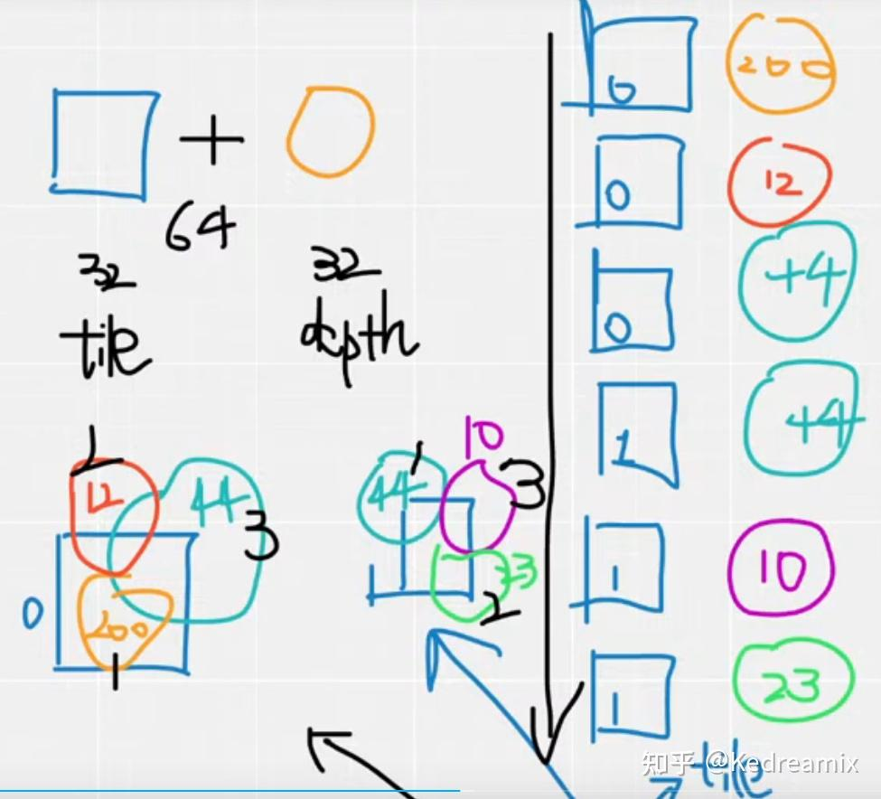

# Gaussian Splatting

[TOC]


# 一、综述文章的学习（上）

对应参考的文章为：[2401.03890](https://arxiv.org/pdf/2401.03890)

> 其他参考文章：
>
> - 【1】[3DGS综述以及对3DGS的理解：A Survey on 3D Gaussian Splatting - 知乎](https://zhuanlan.zhihu.com/p/679809915)
> - 【2】[第一次在美國直播（講解Gaussian Splatting的cuda code）[English CC\]](https://www.youtube.com/live/1buFrKUaqwM)

## 1.重点内容记录

- 3D GS通过构建基于数百万可学习三维高斯体的显式场景表征，结合高度并行化流程，显著提升了计算与渲染效率。该技术的创新性在于融合可微分管道与基于点渲染技术的优势[13]-[17]：三维高斯表征既保留了连续辐射场的高质量图像合成能力，又规避了NeRF类方法的计算冗余（如昂贵的光线步进计算与空域无效采样）。

文章的行文顺序如下：

- 第2部分：主要是一些问题描述和相关研究领域的一些简要的背景
- 第3部分：介绍3DGS，包括3DGS的多视角的合成和3DGS的优化
- 第4部分：3DGS 产生重大影响的各种应用领域和任务，展示了其多功能性
- 第5部分：对3DGS进行了一些比较和分析
- 第6、7部分：对一些未来的开放性工作进行总结和调查

------


## 2.背景

### （1）Radiance Field

可以结合这篇文章来看：[3DGS综述以及对3DGS的理解：A Survey on 3D Gaussian Splatting - 知乎](https://zhuanlan.zhihu.com/p/679809915)

> ### **隐式辐射场**  
> 隐式辐射场通过连续函数表征场景光场分布，无需显式定义几何结构。在深度学习时代，神经网络常被用于学习**连续体积场景表征**[34][35]，最典型的代表是NeRF[12]。在NeRF中（图3a），多层感知机（MLP）将空间坐标$(x, y, z)$与视角方向$(\theta, \phi)$映射至颜色$\mathbf{c}$和体积密度$\sigma$：  
> $$
> (\mathbf{c}, \sigma) \leftarrow \text{MLP}(x, y, z, \theta, \phi). \tag{1}
> $$
> 此方法提供了一种可微分且紧凑的场景表征方式，但需通过体积光线步进（ray marching）计算渲染结果，导致高昂计算开销。需注意，颜色$\mathbf{c}$通常与视角方向相关，而密度$\sigma$则无关[12]。  
>
> ### **显式辐射场**  
> 显式辐射场通过离散空间结构（如体素网格或点云[36][37]）直接存储光场数据，每个空间单元存储对应位置的辐射信息。其形式化表达为：  
> $$
> (\mathbf{c}, \sigma) \leftarrow \text{DataStructure}(x, y, z, \theta, \phi), \tag{2}
> $$
> 其中**DataStructure**可以是体素、点云等数据结构。显式方法对方向相关颜色的编码分为两类：  
> 1. **高维特征编码**：存储高维特征向量，通过轻量MLP解码为颜色；  
> 2. **方向基函数系数**：直接存储球谐函数（spherical harmonics）或球面高斯函数（spherical Gaussians）的系数，最终颜色由基函数系数与视角方向计算得出。  
>
> ### **3D高斯溅射（3D GS）：两全其美**  
> 3D GS[10]是结合隐式与显式辐射场优势的显式表征方法。其核心创新在于：  
> - **可学习三维高斯体**：以可优化的3D高斯体作为基本单元构成显式数据结构（DataStructure）；  
> - **直接编码不透明度**：直接为每个高斯体编码不透明度$\alpha$，而非传统方法中先计算密度$\sigma$再推导不透明度；  
> - **混合优化框架**：基于多视图图像监督优化高斯体参数，融合神经网络优化的拟合能力与显式数据结构的高效性，公式表达为：  
> $$
> (\mathbf{c}, \alpha) \leftarrow \text{3D Gaussian}(x, y, z, \theta, \phi). \tag{3}
> $$
>
> ---
>
> ### **技术解析**  
> 1. **隐式与显式辐射场的本质区别**  
>    - **隐式（如NeRF）**：通过神经网络隐式编码场景，需通过连续坐标查询网络参数生成颜色与密度，优势在于高保真建模，但计算效率低且难以直接编辑。  
>    - **显式（如体素/点云）**：将场景离散化为显式存储单元，支持快速数据访问，但受限于内存消耗与分辨率瓶颈。  
>
> 2. **3D GS的革新性**  
>    - **显式结构+隐式优化**：利用3D高斯体的显式空间分布，结合可微分渲染管线（differentiable rendering）优化高斯参数，兼具显式方法的高效性与隐式方法的建模精度。  
>    - **实时性突破**：通过并行化渲染算法（如基于图块的栅格化）避免NeRF中耗时的光线步进，实现实时高分辨率渲染。  
>    - **可编辑性增强**：显式高斯体支持直接操作（如移动、缩放），为场景编辑与动态建模提供基础。  
>
> 3. **公式对比**  
>    - **NeRF（公式1）**：依赖MLP隐式建模，计算复杂度随场景复杂度指数增长；  
>    - **3D GS（公式3）**：通过显式高斯体参数化场景，优化过程聚焦于局部区域，显著降低计算负载。  
>
> 4. **应用意义**  
>    - **虚拟现实/自动驾驶**：3D GS的实时渲染能力满足低延迟需求；  
>    - **影视特效**：支持动态场景的高效编辑与合成；  
>    - **机器人感知**：显式表征便于与SLAM等系统集成。

这里放一张理解显式隐式图像的图片，辅助理解：


------


### （2）Context and Terminology（背景和术语）

#### （a）体渲染(Volumetric rendering)

> **体积渲染**旨在通过沿相机光线积分辐射，将3D体积表示转换为图像。相机光线 $r(t)$ 可以参数化为：  
> $$
> r(t) = o + td, \quad t \in [t_{\text{near}}, t_{\text{far}}] 
> $$
> 其中 \( o \) 表示光线原点（相机中心），\( d \) 是光线方向，\( t \) 表示沿光线在近裁剪面和远裁剪面之间的距离。像素颜色 \( C(r) \) 通过沿光线 \( r(t) \) 的线积分计算，数学表达式为 [12]：
> $$
> C(r) = \int_{t_{\text{near}}}^{t_{\text{far}}} T(t) \sigma(r(t)) c(r(t), d) dt, \tag{3}
> $$
> 
>
> 其中 $\sigma(r(t))$ 是点 r(t)的体积密度，c(r(t), d) 是该点的颜色，T(t) 是透射率。Ray marching方法直接通过系统地“步进”沿光线并在离散区间采样场景的属性，近似体积渲染积分。NeRF [12] 共享Ray marching方法的相同理念，并引入重要性采样和位置编码，以提高合成图像的质量。在提供高质量结果的同时，光线行进法在计算上是昂贵的，尤其是在高分辨率图像中。
>

------


#### （b）Point-based Rendering

基于点的渲染是一种使用点而非传统多边形来可视化3D场景的技术。该方法特别适用于渲染复杂、非结构化或稀疏的几何数据。点可以通过添加额外属性，如可学习的神经描述符来进行增强，并且可以高效地进行渲染，但这种方法可能会出现渲染中的空洞或混叠效应等问题。**3DGS通过使用各向异性高斯进行更连贯的场景表达**，基于点的方法使用光栅化渲染点云，这本质上受益于并行计算策略[43]。

------


## 3.3D GAUSSIAN SPLATTING: PRINCIPLES

3DGS能够实时渲染高分辨率的图像，并且不需要神经网络，是一个突破。这一部分主要围绕两块进行讲解：

- 3DGS的前向过程
- 3DGS的优化过程

### （1）Rendering with Learned 3D Gaussians

假如现在有一个场景，目的是生成特定视角下的相机图像。NeRF对每一个像素使用光线行进和采样点，影响其实时性；而3DGS将3D高斯投影到图像平面，称为“泼溅”，如下图所示。然后对高斯进行排序并计算每个像素的值。**NeRF和3DGS的渲染可视为互逆关系。**

接下来，我们首先定义3D高斯，这是3D GS中场景表示的最小元素。接着，我们描述这些3D高斯如何用于可微渲染。最后，我们介绍3D GS中使用的加速技术，这是快速渲染的关键。

> 在这之前，先解决一个疑问：==为什么说NeRF和3DGS的渲染可以视为互逆关系？==
>
> 【参考】[3D Gaussian Splatting中的数学推导 - 知乎](https://zhuanlan.zhihu.com/p/666465701)，[《3D Gaussian Splatting for Real-Time Radiance Field Rendering》3D高斯的理论理解 - 知乎](https://zhuanlan.zhihu.com/p/664725693)
>
> 首先，我们回忆一下体渲染的这个事情。假设读者跟我一样是从NeRF才接触体渲染的，那么回顾一下NeRF中，沿着一个像素，发出一条射线，然后这条射线“射向体数据”（在NeRF里就是沿着光线进行采样，然后查询采样点的属性）的过程。这个过程可以归结为一种`backward mapping`。
> 所以很自然的，会有一种`forward mapping`的办法。形式上，就是将整个“体数据”投影到此时位姿所对应的图像平面。这种办法的前提就不能是用NeRF那种隐式表达了，需要一些显式的表达才能支持这样直接的投影。例如以三个顶点长成的三角面基元（primitive），然后将这些许多的三角面直接投影到成像平面上，判断哪些像素是什么颜色，当有多个三角形投影时，根据他们的“深度”来判断前后顺序，然后进行熟悉的alpha compositing。当然也会有其他基元，例如小的平面表示等等。
> 无论是`backward mapping`还是`forward mapping`，这个过程都涉及到将连续的表示变成离散的。在`backward mapping`里，是对场进行采样；在`forward mapping`里，是需要直接生成出基元，这也是一种连续化为离散。

从下图也可以看到NeRF和Gaussian在概念上的区别，左边是NeRF沿着光线查询连续 MLP，右边是Gaussian一组与给定光线相关的离散的高斯分布。更简单的理解是，Ray Marching+回头查询是一种`backward`的操作，而3DGS直接拍上去渲染是`forward`的操作。


首先简单介绍一下，3DGS是如何表示真实场景的，前面也有提过，在**Gaussian Splatting**中，3D世界用一组3D点表示，实际上是数百万个，大致在0.5到5百万之间。每个点是一个3D高斯，具有其独特的参数，这些参数是为每个场景拟合的，以便该场景的渲染与已知数据集图像紧密匹配，接下来就介绍他的属性。

下图则展示了3DGS的迭代过程中间结果：


#### （a）3D GS的属性

 一个3D高斯主要包括，中心（位置）$x,y,z$ 的均值$μ$ 、不透明度 $α$ 、3D 协方差矩阵 $Σ$ 和颜色 $c$（一般是RGB或者是球谐（SH）系数）。 其中$c$与视角有关，$c$ 由球谐函数表示。所有属性均可学习，都可以通过反向传播来学习和优化。

------


#### （b）Frustum Culling

给定特定的相机姿态，该步骤会判断哪些高斯位于相机的视锥外，并在后续步骤中剔除之，以节省计算。

------


#### （c）Splatting

> 在此步骤中，3D空间中的3D高斯（椭球体）被投影到2D图像空间（椭圆）。投影通过两个变换进行：首先，使用视图变换将3D高斯从世界坐标转换为相机坐标；随后，通过对投影变换的近似，将这些高斯溅射到2D图像空间。数学上，给定描述3D高斯空间分布的3D协方差矩阵$Σ$和视图变换矩阵$W$，投影的2D高斯所特征化的2D协方差矩阵$Σ'$通过以下公式计算：
>
> $$
> Σ' = J W Σ W^⊤ J^⊤, \tag{4}
> $$
> 其中$J$是投影变换的仿射近似的雅可比矩阵[10]、[39]。人们可能会想知道为什么这里不使用基于标准相机内参的投影变换。这是因为其映射不是仿射变换，因此无法直接投影$Σ$。3D GS采用了[39]中提出的仿射变换，该变换使用泰勒展开的前两项（包括$J$）来近似投影变换（参见[39]中的第4.4节）。

更详细的内容可以查看这篇论文：[vis2001_cameraready.dvi](https://www.cs.umd.edu/~zwicker/publications/EWAVolumeSplatting-VIS01.pdf)。但实际上，如果理解为这就是一个“拍到”平面上的过程，应该暂时不影响后面的学习和研究，大可以等到需要深入理解数学细节的时候再来理解。

------


#### （d）像素渲染

**逐像素渲染**。在深入探讨3D GS的最终版本之前，该版本利用了几种技术来提升并行计算，我们首先阐述其更简单形式，以提供对其基本工作机制的洞察。给定像素 \( x \) 的位置，其与所有重叠高斯的距离，即这些高斯的深度，可以通过视图变换矩阵 \( W \) 计算，形成一个已排序的高斯列表 \( N \)。然后，采用$α$混合来计算该像素的最终颜色：
$$
C = \sum_{n=1}^{|N|} c_n \alpha'_n \prod_{j=1}^{n-1} (1 - \alpha_j'), \tag{5}
$$
其中 $c_n$ 是学习到的颜色。最终的不透明度 $\alpha'_n$是学习到的不透明度$\alpha_n$和高斯的乘法结果，Gaussian定义如下：

$$
\alpha'_n = \alpha_n \times \exp\left(-\frac{1}{2} (x' - \mu'_n)^T \Sigma'^{-1}_n (x' - \mu'_n)\right), \tag{6}
$$
其中 $x'$ 和 $\mu'_n$ 是投影空间中的坐标。人们可能会担心，所描述的渲染过程可能比NeRFs更慢，因为**生成所需的已排序列表很难并行化来完成**。确实，这种担忧是有根据的；在使用这种简单的逐像素方法时，渲染速度可能会受到显著影响。为了实现实时渲染，3D GS做出了一些妥协，以适应并行计算。

用一张图来可视化最终计算的不透明度$\alpha_n'$的公式：


如果仔细看的话，我们会发现，实际上这个公式和[多变量正态分布的概率密度函数](https://link.zhihu.com/?target=https%3A//en.wikipedia.org/wiki/Multivariate_normal_distribution)十分相像，是忽略了带有协方差行列式的标准化项，而是用不透明度来加权。

> 根据上面的维基百科链接，多变量正态分布的概率密度函数为：
>
> 
>
> 可以看到，正常在`exp`函数前面的系数有`带有协方差行列式的标准化项`，这里就直接忽略掉了，使用学习到的不透明度$\alpha_n$直接加权，作为最终的不透明度。

------


#### （e）Tiles（Patches）

为了避免为每个像素计算高斯的成本，3D GS将精度从像素级别转移到patch级别，这一思路受到tiled-based的光栅化的启发[43]。具体而言，3D GS最初将图像划分为多个不重叠的tiles（patches）。图4b提供了tile的示意图。每个tile包含16×16个像素，如[10]所建议的那样。3D GS进一步确定哪些tile与这些投影的高斯相交。**考虑到一个投影的高斯可能覆盖多个tile，一种合理的方法是复制高斯，为每个副本分配一个标识符（即Tile ID），以便于与相关tile对应。**

来看下面这张图（上述的过程对应下图的（b）和（c）子图）：


更多的在代码解读部分结合来看会有更好的体会，以及可以看这个视频：(https://www.youtube.com/live/1buFrKUaqwM)。这个排序的内容类似于下图（有点潦草，但不影响理解）：


------

#### （f）并行渲染

在复制之后，3D GS将相应的Tile ID与从视图变换获得的每个高斯的深度值结合。这导致生成一个未排序的字节列表，其中高位表示Tile ID，低位表示深度。通过这种方式，排序后的列表可以直接用于渲染（即$α$合成）。上图4c和图4d提供了这些概念的可视化演示。

> 这里贴一下上面部分的原文，辅助学习：
>
> After replication, 3D GS combines the respective tile ID with the depth value obtained from the view transformation for each Gaussian. **This results in an unsorted list of bytes where the upper bits represent the tile ID and the lower bits signify depth.** By doing so, the sorted list can be directly utilized for rendering (i.e., alpha compositing).

**其实我的理解是，将tile id和深度拼在一起，这样自然就可以对每个tile中的不同深度的3D GS球做排序。后面的Tile对应高位靠后，相同的Tile则深度值大的靠后（低位靠后）。**(不用判断每个像素与高斯的距离，而是判断tile就简单多了)。

值得强调的是，每个tile和像素的渲染是`独立`进行的，这使得该过程非常适合并行计算。另一个好处是，每个瓦片的像素可以访问一个`公共共享内存`，并保持`统一的读取顺序`（图5），从而提高了$α$合成的并行执行效率。


在原始论文[10]的官方实现中，该框架将Tile和像素的处理视为与CUDA编程架构中的blocks和threads相似。总之，3D GS在渲染过程中引入了几种近似方法，以提高计算效率，同时保持高标准的图像合成质量。

> 解读一下上面那张图（Fig 5）：
>
> An illustration of the tile based parallel (at the pixel-level) rendering.
>
> 由于每一tile和每一像素的计算是独立的，所以可以基于CUDA编程的blocks和threads来实现并行计算，同时有利于访问公共共享内存并保持统一的读取顺序。
>
> 所有位于一个tile内的像素（这里是Tile1）访问存储在`共享内存`中的`相同有序高斯列表`进行渲染。当系统顺序处理每个高斯时，tile中的每个像素根据距离（即公式6中的指数项）评估高斯的贡献。因此，渲染一个tile只需遍历高斯列表一次。红色高斯的计算遵循类似的方法，这里为了简化而省略。

==其实还是得结合后面的代码部分来看，光看这个原理还是比较抽象的。==个人感觉就是一个Tile中的所有像素可以直接并行遍历有序高斯列表，然后直接计算alpha-compositing的值就可以了。


### （2）3DGS的优化

学习到这里，我们可能会有一个问题，怎么在空间中的一堆GS圆球中得到一个像样的图像的，确实是这样，如果没有进行优化或者是优化不完全，在渲染的时候就会出现很多伪影，从下图你可以看到。


3DGS的核心是**3D高斯集合的优化过程**。一方面需要通过可微渲染来使高斯符合场景纹理，另一方面表达场景需要的高斯数量是未知的。这分别对应`参数优化与密度控制`两步，这两步在优化过程中交替进行。优化过程中，需要手动设置很多超参数。为了清晰起见，我们省略了大多数超参数的符号。

------


#### （a）参数优化

##### （i）损失函数

- **损失函数**：图像合成后，计算渲染图像与真实图像的差异作为损失。一旦图像合成完成，就可以测量渲染图像与真实值之间的差异。所有可学习的参数通过随机梯度下降法使用 $\ell_1$ 和 D-SSIM 损失函数进行优化：
  $$
  \mathcal{L} = (1 - \lambda) \mathcal{L}_1 + \lambda \mathcal{L}_{D-SSIM},
  $$
  其中 $\lambda \in [0, 1]$是一个权重因子。

  > ### D-SSIM 解释
  >
  > D-SSIM（结构相似性指数的扩展）是一种用于评估图像质量的指标。它基于结构相似性（SSIM）指数，但在此基础上进行了改进，以更好地捕捉图像之间的感知差异。D-SSIM考虑了图像的亮度、对比度和结构信息，能够更准确地反映人眼对图像质量的感知。
  >
  > - **SSIM**：结构相似性指数（SSIM）是一种衡量两幅图像之间相似度的指标，主要关注图像的结构信息。它通过比较亮度、对比度和结构来评估图像质量。
  >
  > - **D-SSIM**：D-SSIM在SSIM的基础上引入了距离度量，通常用于处理图像失真或压缩后的质量评估。它通过考虑图像的局部特征和全局特征，提供了更全面的质量评估。
  >
  > 在损失函数中使用D-SSIM可以帮助优化图像合成的质量，使得生成的图像在视觉上更接近真实图像。

注：$\mathcal{L}$指的是`绝对误差损失`。它计算生成图像与真实图像之间的绝对差异。展开来说，有：
$$
\mathcal{L}_1 = \sum_{i} |I_{\text{rendered}}(i) - I_{\text{true}}(i)|
$$
**作用**：该项用于确保生成的图像在像素级别上与真实图像尽可能接近。它对每个像素的误差进行求和，鼓励生成图像的每个像素值与真实图像的对应像素值相匹配。

与 NeRF 的损失函数略有不同，由于Ray Marching成本高昂，**NeRF 通常在像素级别而不是图像级别进行计算**，而3DGS是图像级别的。

------


##### （ii）参数更新

- **参数更新：**

**3D高斯的多数参数可通过反向传播直接更新**，但对于协方差矩阵$\Sigma$来说，需要半正定矩阵（这里面是一个定义，应该是多元正态分布的协方差矩阵是一个半正定矩阵），直接优化可能会产生非半正定矩阵，而`只有半正定矩阵才有物理意义`。因此，改为优化四元数$q$和3D向量$s$。将协方差矩阵分解：
$$
\Sigma = RSS^TR^T
$$
其中$R$与$S$分别由$q$和$s$推导得到的旋转和缩放矩阵.

- $S$是一个对角缩放矩阵，含有3个参数；
- $R$是一个3x3的旋转矩阵，通过旋转四元数来表示；

> ### 补充：**半正定矩阵 (Positive Semi-Definite Matrix, PSD)**
>
> ### **半正定矩阵与梯度下降优化问题解析**
>
> ---
>
> #### **一、半正定矩阵 (Positive Semi-Definite Matrix, PSD)**
> ##### **数学定义**  
> 对于任意非零向量$\mathbf{v} \in \mathbb{R}^n$，若实对称矩阵$\mathbf{M} \in \mathbb{R}^{n \times n}$ 满足：  
> $$
> \mathbf{v}^T \mathbf{M} \mathbf{v} \geq 0
> $$
> 则称 $\mathbf{M}$为半正定矩阵。其核心性质包括：  
>
> 1. **特征值非负**：所有特征值$\lambda_i \geq 0$。  
> 2. **可分解性**：可表示为$\mathbf{M} = \mathbf{L} \mathbf{L}^T$（Cholesky 分解）。  
>
> ##### **物理意义**  
> 在概率统计中，协方差矩阵 $\Sigma$ 必须是半正定的，因为：  
> - 对角线元素表示方差（非负）；  
> - 非对角线元素表示协方差（对称性）；  
> - 整体描述数据分布的“扩散程度”。
>
> 
>
> ---
>
> #### 3D GS的优化方案 
> | **问题**                   | **后果**                           | **3D GS 的解决策略**                 |
> | -------------------------- | ---------------------------------- | ------------------------------------ |
> | 协方差矩阵非半正定         | 物理意义失效、数值不稳定、渲染失真 | 参数化旋转和缩放，间接构造协方差矩阵 |
> | 直接优化协方差矩阵自由度高 | 优化效率低、易陷入局部最优         | 用更少的参数（7 vs 6）控制形状       |
>
> 通过这种参数化方法，3D GS 在保证数学合理性的同时，提升了优化效率和渲染质量。


对于不透明度$α$来说，其计算图比较复杂。原文是这样介绍的：


这倒是也可以理解，因为$\Sigma'$本来就会用于计算$\alpha$值（在前面的公式推导部分有）。不过，为了避免自动微分的计算消耗，**3DGS还推导了$q$和$s$的梯度，这样在优化过程中就可以直接计算出来了。**

> 这里的数学是比较深的，后面有需要或者有兴趣看推导再认真看吧。看[3D Gaussian Splatting中的数学推导 - 知乎](https://zhuanlan.zhihu.com/p/666465701)这篇的`Derivation of Gradient`部分应该会有助于后续的理解。


#### （b）Density Control

- **初始化**：3DGS建议从SfM产生的稀疏点云初始化或随机初始化高斯（**显然，一个更好的初始化对后续的重建质量和收敛是十分重要的**），可以直接调用 [COLMAP](https://link.zhihu.com/?target=https%3A//colmap.github.io/) 库来完成这一步。然后进行点的密集化和剪枝以控制3D高斯的密度。当由于某种原因无法获得点云时，可以使用随机初始化来代替，但可能会降低最终的重建质量。以下步骤展示了初始化的这一过程：


- **点密集化**：在点密集化阶段，3DGS自适应地增加高斯的密度，以更好地捕捉场景的细节。该过程特别关注缺失几何特征或高斯过于分散的区域。密集化在一定数量的迭代后执行，比如100个迭代，针对在视图空间中具有较大位置梯度（即超过特定阈值）的高斯。==其包括在未充分重建的区域克隆小高斯或在过度重建的区域分裂大高斯。对于克隆，创建高斯的复制体并朝着位置梯度移动。对于分裂，用两个较小的高斯替换一个大高斯，按照特定因子减小它们的尺度。==这一步旨在在3D空间中寻求高斯的最佳分布和表示，增强重建的整体质量。
  - 这一部分的意义是什么呢，因为SGD只能对现有点进行调整，但是在完全没有点或点太多的区域，很难找到好的参数，所以这就是点密集化的作用。
  - 

- **点的剪枝：**点的剪枝阶段移除冗余或影响较小的高斯，可以在某种程度上看作是一种正则化过程。一般消除几乎是透明的高斯（$\alpha$低于指定阈值）和在世界空间或视图空间中过大的高斯。此外，为防止输入相机附近的高斯密度不合理地增加，这些高斯会在固定次数的迭代后将$\alpha$设置为接近0的值。该步骤在保证高斯的精度和有效性的情况下，能节约计算资源。

------


## 4.补充内容

### （1）用SH系数来表示颜色

球谐函数本身已经有一定的基础了，这里就只粘贴一个High Level的介绍。实际上，球谐函数在3D GS中算是作为工具来有损压缩颜色的，并不难理解。

> 在计算机图形学中，用球谐函数（Spherical Harmonics，简称SH）表示视角相关的颜色起着重要作用，最初是在Plenoxels中提出的。他能表示非兰伯特效应，比如金属表面的高光反射。不过这样也不是一定的，实际上也可以使用3个RGB值表示颜色，然后使用Gaussian Splatting。
>
> 图形学全局环境光照技术与球谐函数息息相关，我们的环境光来源四面八方，可以理解为一个球面函数，当模拟漫反射环境光，我们用一张环境贴图进行采样，对每一个点进行半球采样出在这个像素上的颜色，**球谐光照**简单来说就是用几个系数存取了整张环境贴图包围在球上**法线方向**所对应的的颜色信息。在渲染过程中传入球谐系数。在模型上根据对应的法线信息，从球谐函数中获取对应的颜色信息。
>
> 球谐函数是定义在球面上的特殊函数，换句话说，可以对球面上的任意点计算这样一个函数并得到一个值。
>
> 这里我们简单理解一下，SH，球谐函数，归根到底只是一组基函数，至于这组基函数是怎么来的，不管他。简单点来说，每一个函数都可以由多个基函数组合起来，如果我们有很多基函数，我们可以通过对应的权重系数复原出原来的函数，不过本质上还是一个有损压缩，不一定那么准确，不过如果基函数越多，复原的函数越准确，但是计算量也变大了。
>
> 在球面基函数中，最多的就是球谐函数了。球谐函数有很多很好的性质，比如正交性，旋转不变性（这边就不介绍了）。正交性说明每个基函数都是独立的，每个基函数都不能用别的基函数加权得到。当SH的系数用的越多，那么表达能力就越强，跟原始的函数就越接近。

关于球谐函数的进阶，在其他的笔记中有所总结，也可以看这篇非常经典的论文：[Microsoft Word - Spherical Harmonic Lighting.doc](https://3dvar.com/Green2003Spherical.pdf)


------


接下来，在阅读综述文章接下来的内容之前，有必要来具体**阅读一下3D GS的论文原文**。因此在下一部分中，我们回来总结3D GS的原始论文，并结合开源的代码辅助理解。


------


# 二、Gaussian Splatting论文和代码解读

> 【1】参考代码解读视频：https://www.youtube.com/live/1buFrKUaqwM
>
> 【2】Demo演示场景网站：[gsplat](https://gsplat.tech/)

## 1.一些收获

- 由于3DGS每个像素被Gaussian球的覆盖情况是不同的，因此没有办法直接用Pytorch来并行化计算（Pytorch并行化必须保证操作是相同的），因此3DGS的源码是用CUDA来写代码的。


## 2.Cuda部分的代码

在这里可以看到：[diff-gaussian-rasterization/cuda_rasterizer at 9c5c2028f6fbee2be239bc4c9421ff894fe4fbe0 · graphdeco-inria/diff-gaussian-rasterization](https://github.com/graphdeco-inria/diff-gaussian-rasterization/tree/9c5c2028f6fbee2be239bc4c9421ff894fe4fbe0/cuda_rasterizer)，重点关注的是`forward`和`backword`部分的代码，涉及到梯度的运算。

### （1）`forward.cu`

- step 1：`计算3D 高斯球投影到2D之后的“近似圆”的中心和半径`。注意，理论上来说投影出来的应该是椭圆，但椭圆要记录的信息是比较多的，为了减少存储量，用圆进行近似（包含圆心和半径），这算是一种trade-off，可能会导致计算像素被覆盖情况的时候产生额外的覆盖判断；
- step 2：把投影完的圆覆盖的像素都计算出来（对于其覆盖的像素，可以认为这个Gaussian球对其有贡献）。这里又做了优化，`即对图像做tiled处理（每个tile的大小是16x16，最后面的格子会往右补满16x16）`，于是问题变成圆和tiles的覆盖情况，此时对应tile里面的像素也认为是覆盖了（会多了不必要的计算成本，但是会使得计算变快）。
- step 3：计算Gaussian球的前后排列顺序；
- step 4：计算每个像素的颜色。做Alpha Compositing的时候，应该是从后往前进行混合的。

了解了以上的步骤之后，就可以看代码了（[diff-gaussian-rasterization/cuda_rasterizer/forward.cu at 9c5c2028f6fbee2be239bc4c9421ff894fe4fbe0 · graphdeco-inria/diff-gaussian-rasterization](https://github.com/graphdeco-inria/diff-gaussian-rasterization/blob/9c5c2028f6fbee2be239bc4c9421ff894fe4fbe0/cuda_rasterizer/forward.cu)），对应关系为：

> （1）preprocessCUDA：对应上面的step 1和step 2；
>
> （2）


#### （a）preprocessCUDA

#### （i）step 1：计算3D 高斯球投影到2D之后的“近似圆”的中心和半径

> 值得注意的点都会在这里进行说明。

```c++
// Compute 2D screen-space covariance matrix
float3 cov = computeCov2D(p_orig, focal_x, focal_y, tan_fovx, tan_fovy, cov3D, viewmatrix);
```

这里用`float3`去接收Splatting到二维后的协方差矩阵，因为此时的协方差矩阵是对称矩阵，因此存三个值就够了。这个协方差矩阵是：
$$
\left[ \begin{matrix}
a & b  \\
b & c \\
\end{matrix} \right]
$$
接下来，就是解step 1近似的圆的半径，这**可以通过求解协方差矩阵的特征向量和特征值**来得到。即$Ax = \lambda x$，所以就是令下面这个矩阵的行列式为0：
$$
\left[ \begin{matrix}
a-\lambda & b  \\
b & c-\lambda \\
\end{matrix} \right]
$$
来解一下这个方程，方程的解为：


实际上，这对应**两个不同的特征值。**比较大的特征值即为协方差矩阵表示椭圆的长轴半径，比较小的则指的是短轴半径，**我们需要的是长轴半径。**这部分的代码为：

```c++
const float det_cov_plus_h_cov = cov.x * cov.z - cov.y * cov.y;
float h_convolution_scaling = 1.0f;

if(antialiasing) //暂不用太关注
    h_convolution_scaling = sqrt(max(0.000025f, det_cov / det_cov_plus_h_cov)); // max for numerical stability

// Invert covariance (EWA algorithm)
const float det = det_cov_plus_h_cov;

// Compute extent in screen space (by finding eigenvalues of
// 2D covariance matrix). Use extent to compute a bounding rectangle
// of screen-space tiles that this Gaussian overlaps with. Quit if
// rectangle covers 0 tiles. 
float mid = 0.5f * (cov.x + cov.z);
float lambda1 = mid + sqrt(max(0.1f, mid * mid - det)); //det是协方差矩阵对应的行列式的值
float lambda2 = mid - sqrt(max(0.1f, mid * mid - det));
float my_radius = ceil(3.f * sqrt(max(lambda1, lambda2))); //注意这里有一个
```

为什么在计算`my_radius`的时候要`*3.f`呢？因为对于高斯函数而言，基本上三个标准差内的可以包含绝大多数值了，即`[μ-3σ，μ+3σ]`，而这行代码就是在做这件事。


#### （ii）step 2：把投影完的圆覆盖的像素都计算出来+tiled based

16*16的格子会被认定为一个tile，具体在函数`getRect(point_image, my_radius, rect_min, rect_max, grid);`中会计算出步骤（i）中计算得到的圆覆盖了哪些tile。这个函数在这里：[diff-gaussian-rasterization/cuda_rasterizer/auxiliary.h at 59f5f77e3ddbac3ed9db93ec2cfe99ed6c5d121d · graphdeco-inria/diff-gaussian-rasterization](https://github.com/graphdeco-inria/diff-gaussian-rasterization/blob/59f5f77e3ddbac3ed9db93ec2cfe99ed6c5d121d/cuda_rasterizer/auxiliary.h#L46)

具体为：

```c++
__forceinline__ __device__ void getRect(const float2 p, int max_radius, uint2& rect_min, uint2& rect_max, dim3 grid)
{
	rect_min = {
		min(grid.x, max((int)0, (int)((p.x - max_radius) / BLOCK_X))),
		min(grid.y, max((int)0, (int)((p.y - max_radius) / BLOCK_Y)))
	};
	rect_max = {
		min(grid.x, max((int)0, (int)((p.x + max_radius + BLOCK_X - 1) / BLOCK_X))), //向上取整的写法，在算法学习中有所记载
		min(grid.y, max((int)0, (int)((p.y + max_radius + BLOCK_Y - 1) / BLOCK_Y)))
	};
}
```

即计算圆心-半径，圆心+半径分别在哪些范围中，从而得到覆盖了哪些tile，而主函数`preprocessCUDA`后面有一句：
```c++
tiles_touched[idx] = (rect_max.y - rect_min.y) * (rect_max.x - rect_min.x);
```

用于保存每个圆覆盖了几个tile。

> 这里需要说明的一件事，就是上文的step 1，step 2的步骤是用圆去近似椭圆（实际上近似成圆会变得更鼓，引入一些额外覆盖判断，但不会漏判），但实际上还是有保存splatting后近似前的椭圆的。`此时在计算3D GS对像素的贡献的时候，还是以投影后的2D椭圆为依据的。`相对来说就不会太影响rendering的结果。


### （2）rasterizer_impl.cu

#### （i）step 3：计算Gaussian球的前后排列顺序

复习一下这张图：



其中tile ID占据32位，而3D GS的深度也占据32位（总共64位），于是就可以进行排序了了。首先排序tileID，当排序之后，tile ID小的会排在前面。同一tile ID的情况下，排序深度，3D GS depth小的会排在前面。（注意，3D GS depth的值和编号是没关系的，所以可能会出现右上角的200排在12的前面，这是没有问题的）

具体的函数实现在这里（关于排序的部分）：` CudaRasterizer::Rasterizer::forward`

```c++
// Compute prefix sum over full list of touched tile counts by Gaussians
// E.g., [2, 3, 0, 2, 1] -> [2, 5, 5, 7, 8]
CHECK_CUDA(cub::DeviceScan::InclusiveSum(geomState.scanning_space, geomState.scan_size, geomState.tiles_touched, geomState.point_offsets, P), debug)

// Retrieve total number of Gaussian instances to launch and resize aux buffers
int num_rendered;
CHECK_CUDA(cudaMemcpy(&num_rendered, geomState.point_offsets + P - 1, sizeof(int), cudaMemcpyDeviceToHost), debug);

size_t binning_chunk_size = required<BinningState>(num_rendered);
char* binning_chunkptr = binningBuffer(binning_chunk_size);
BinningState binningState = BinningState::fromChunk(binning_chunkptr, num_rendered);

// For each instance to be rendered, produce adequate [ tile | depth ] key 
// and corresponding dublicated Gaussian indices to be sorted
duplicateWithKeys << <(P + 255) / 256, 256 >> > (
    P,
    geomState.means2D,
    geomState.depths,
    geomState.point_offsets,
    binningState.point_list_keys_unsorted,
    binningState.point_list_unsorted,
    radii,
    tile_grid)
CHECK_CUDA(, debug)

int bit = getHigherMsb(tile_grid.x * tile_grid.y);

// Sort complete list of (duplicated) Gaussian indices by keys
CHECK_CUDA(cub::DeviceRadixSort::SortPairs(
    binningState.list_sorting_space,
    binningState.sorting_size,
    binningState.point_list_keys_unsorted, binningState.point_list_keys,
    binningState.point_list_unsorted, binningState.point_list,
    num_rendered, 0, 32 + bit), debug)

CHECK_CUDA(cudaMemset(imgState.ranges, 0, tile_grid.x * tile_grid.y * sizeof(uint2)), debug);

// Identify start and end of per-tile workloads in sorted list
if (num_rendered > 0)
    identifyTileRanges << <(num_rendered + 255) / 256, 256 >> > (
        num_rendered,
        binningState.point_list_keys,
        imgState.ranges);
CHECK_CUDA(, debug)
```

==CUDA代码不是很好阅读，现在看到1：39：55，感觉还得去专门学习一下CUDA，这可以从Compute Shader的熟练掌握开始。（CUDA的视频看到第1个的13:47秒位置）==


## 补充：数学专题


## 补充：一些额外收获

> 1. 原始的3DGS 对于室内的白墙场景可能会渲染的不好，这很可能跟墙壁没有纹理，导致估计距离等操作会出现错误判断；[Room – gsplat](https://gsplat.tech/room/)
> 2. 电视的地方（reflective的表面）也会出现错误的结果：[Room – gsplat](https://gsplat.tech/room/)，理论上应该是不同的地方有不同的反射光，但NeRF和3DGS都会把“光”重建到电视的里面去，造成效果错误。
> 3. 一个可以后续看一下的项目：[autonomousvision/sdfstudio: A Unified Framework for Surface Reconstruction](https://github.com/autonomousvision/sdfstudio)
> 4. 3DGS本身对于曝光度突然改变的处理不好，很可能会有一些floating的Guassian球，比如说曝光度突然降低的话可能会放一个半透的黑色Gaussian球在视角前面。再比如直视曝光度高的地方也会有类似的问题。类似的解决方案可能在这里：[NeRF in the Wild](https://nerf-w.github.io/)
> 5. 现在3DGS取出Mesh还是不太直观的，应该还没有很成熟的解决方案。不过3DGS用在UE和Unity里面应该有对应插件。

