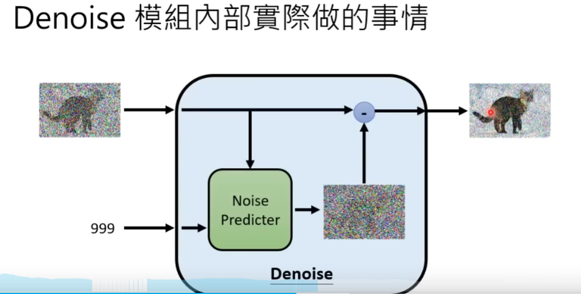

# Diffusion 模型概念汇总

参考的视频系列：https://www.bilibili.com/video/BV14c411J7f2/?spm_id_from=333.337.search-card.all.click&vd_source=f0e5ebbc6d14fe7f10f6a52debc41c99

# 一、基本原理概况

这一部分展示重点图片，尽量能够根据下面的图片说出对应的Diffusion的对应知识：





## 1.Noise Predictor怎么训练？

对手头的训练图片添加符合高斯分布的噪声（这个过程叫做forward process/diffusion process）：


此时的GT其实就是对应加入的噪声，训练noise predictor降低“预测出来的噪声”和“原本添加上去的噪声”之间的误差。


## 2.怎么把文字考虑进来？

先看去噪的时候，如下图：


与之前的唯一不同在于，去噪的时候Noise Predictor除了要吃一张有噪声的图片，还要吃用户输入的文本内容（prompt）。


下图则展示了Noise Predictor此时的构造：


**训练的时候如何训练呢？**

> 如下图，蓝色框的prompt，有噪声的图，还有对应的step会作为输入，而训练的noise predictor则会预测出噪声，和GT（添加的噪声）做对比，减少之间的差异。


对应的Algorithm将在下面进一步介绍。


## 3.Stable Diffusion概况

> 注：这里是李宏毅课程中的PPT，对应的SD应该是早期版本的架构，但后面的版本应当也包含下文所述的骨干部分。


基本的framework都是如下图所示（不只是SD，还有DALLE，Imagen都是类似的三个基本结构）：


- （1）Text Encoder：这个对生成结果的影响是很大的，反而像UNet的大小对Diffusion的生成质量影响有限（来源：Google Imagen）。


### （1）FID的概念


上图的CNN网络是提前pretrain好的，把真实图片和生成图片分别喂进去，看结果的”相近程度“。FID假设输出的两类结果都符合高斯分布，结果其实就是计算两组高斯分布之间的”距离“。**显然，结果越小越好**。FID的缺点在于需要sample大量的图片才可以计算出FID。


### （2）CLIP的概念


显然，CLIP SCORE越高，说明生成的图片和prompt越接近。


### （3）Decoder训练——Latent space的情况

对于中间产物是latent space的情况，使用AutoEncoder来进行训练，autoencoder会训练出对应的encoder和decoder（通过让输入图像和输出的生成图像分布尽可能一致），然后固定decoder即可作为diffusion模型中的decoder了。


### （4）Generation Model

在SD当中，noise并不是加到原始图像当中，而是加在latent space上（此时图片已经经过了encoder编码到latent space里面了）。当然同理，noise predictor也是在latent space上预测噪声的。


# 二、李宏毅——DDPM知识点总结（含diffusion背后数学原理）

## 0.一些有用的基础知识

参考链接：[Diffusion Models | Paper Explanation | Math Explained - YouTube](https://www.youtube.com/watch?v=HoKDTa5jHvg)

这里参考了四篇文章：

- 【1】[[1503.03585\] Deep Unsupervised Learning using Nonequilibrium Thermodynamics (arxiv.org)](https://arxiv.org/abs/1503.03585)
- 【2】[[2006.11239\] Denoising Diffusion Probabilistic Models (arxiv.org)](https://arxiv.org/abs/2006.11239)
- 【3】[[2102.09672\] Improved Denoising Diffusion Probabilistic Models (arxiv.org)](https://arxiv.org/abs/2102.09672)
- 【4】[[2105.05233\] Diffusion Models Beat GANs on Image Synthesis (arxiv.org)](https://arxiv.org/abs/2105.05233)


### 1.1 Denoising Diffusion Probabilistic Models（DDPM）

先去看李宏毅的全套视频：[【生成式AI】Diffusion Model 概念讲解 (1/2)_哔哩哔哩_bilibili](https://www.bilibili.com/video/BV14c411J7f2?p=1&vd_source=f0e5ebbc6d14fe7f10f6a52debc41c99)

以及看这个视频：[54、Probabilistic Diffusion Model概率扩散模型理论与完整PyTorch代码详细解读_哔哩哔哩_bilibili](https://www.bilibili.com/video/BV1b541197HX/?spm_id_from=333.337.search-card.all.click&vd_source=f0e5ebbc6d14fe7f10f6a52debc41c99)

#### （1）数学知识补充

- 马尔可夫链：[简述马尔可夫链【通俗易懂】 - 知乎 (zhihu.com)](https://zhuanlan.zhihu.com/p/448575579)
- KL散度的理解：[交叉熵、相对熵（KL散度）、JS散度和Wasserstein距离（推土机距离） - 知乎 (zhihu.com)](https://zhuanlan.zhihu.com/p/74075915)
  - 两个单变量高斯分布的KL散度：[单变量高斯分布的KL散度_单变量高斯密度函数-CSDN博客](https://blog.csdn.net/sinat_33598258/article/details/103866136)
- 对重参数化的理解：[重参数化技巧 - 知乎 (zhihu.com)](https://zhuanlan.zhihu.com/p/542478018)，在Diffusion模型和VAE等模型中大量使用。


#### （2）深度学习知识补充

##### （a）VAE

首先，推荐把李宏毅的三个相关视频看完：[(选修)To Learn More - Unsupervised Learning - Deep Generative Model (Part I)_哔哩哔哩_bilibili](https://www.bilibili.com/video/BV1Wv411h7kN?p=65&vd_source=f0e5ebbc6d14fe7f10f6a52debc41c99)以及后面的两个选修，这里有VAE的相关知识。

**其他参考资料：**

【1】[【学习笔记】生成模型——变分自编码器 (gwylab.com)](https://www.gwylab.com/note-vae.html)

【2】VAE：[机器学习方法—优雅的模型（一）：变分自编码器（VAE） - 知乎 (zhihu.com)](https://zhuanlan.zhihu.com/p/348498294)

**关于VAE模型的代码：**

[PyTorch-VAE/models/vanilla_vae.py at 8700d245a9735640dda458db4cf40708caf2e77f · AntixK/PyTorch-VAE (github.com)](https://github.com/AntixK/PyTorch-VAE/blob/8700d245a9735640dda458db4cf40708caf2e77f/models/vanilla_vae.py#L8)


### 2.相关推导

参考视频链接： [【生成式AI】Diffusion Model 概念讲解 (1/2)_哔哩哔哩_bilibili](https://www.bilibili.com/video/BV14c411J7f2/?p=1&vd_source=f0e5ebbc6d14fe7f10f6a52debc41c99)

#### （1）基本概念

回忆一下Diffusion Model的过程：


对于VAE模型和Diffusion模型，二者有相似之处：


> Diffusion的Add noise的过程就类比于VAE当中的Encoder，只不过这个过程不是学习出来的，而是固定好的。


##### Diffusion Model的演算法


接下来，我们来分析一下上图的过程：

> ### Training
>
> - 第二行做的事情是从数据集中采样出一张干净的图，记为$x_0$；（**sample clean image**）
>
> - 第三行做的事情是从1~T中采样出一个整数t出来，这里的T可以是一个比较大的数，比如1000；
>
> - 第四行：$\epsilon$是从一个高斯分布当中采样出来的，这个分布的均值是0，每个dimension的方差都固定是1；$\epsilon$的大小与image是一样大的，只不过都是噪音。（**sample a noise**）
>
> - 第五行：
>
>   
>
>   首先，红框里的部分是对$x_0$和$\epsilon$做加权平均，这里的权重是事先定义好的，是从$\bar\alpha_1,\bar\alpha_2,...,\bar\alpha_T$序列中依据第三行取出的$t$来查到的。在加权平均后得到的就是一张有噪声的图。一般来说设计上$\bar\alpha_1,\bar\alpha_2,...,\bar\alpha_T$是由大到小的，因此在第三行中采样出来的$t$越大（此时$\bar\alpha_t$越小），就越接近于噪音。
>
>   $\epsilon_\theta$指的是noise predictor，输入是有噪音的图片和时间戳$t$，预测的结果是含有噪声的图当中的噪声。而$\epsilon-\epsilon_\theta(·)$自然就是指预测出的噪声和第四行采样出来的噪声（这个噪声会和原图混在一起）之间的相似度了，也就是梯度下降的目标方向（该值越小越好）。
>
> 可以用下图来表示这个过程：
>
> 
>
> 此时想象的DDPM的过程就与实际产生了偏差，如下图：
>
> 
>
> 或许我们想象的是噪声是一步一步加上去的，每次denoise的过程就是将产生的噪声和这一步对应加上去的噪声做对比。但实际上**噪声是一次被加上的**。我们还是先来看一下产生图的过程。
>
> 
>
> ### Inference（产生图的过程）
>
> 
>
> - 第一行：采样出来一张全是噪声的图，即$X_T$，在diffusion相关文献中通常认为$X_T$是纯粹都是噪声的图；
> - 第二行到第五行是T个步骤，用来去除噪声，具体的：
>   - 第三行，又采样出一个noise出来，为$z$；
>   - 第四行，这里的$x_t$指的是上一步中产生出来的图，比如刚开始去噪的时候$t=T$，而$x_{t-1}$指的是这一步去噪之后的结果。$\epsilon_\theta$同样指的是noise predictor，其会吃$x_t$和时间戳t，从而预测出一个噪声$\epsilon_\theta(x_t, t)$，接下来就是用$x_t$减去乘了比例系数的预测噪声，得到去噪的结果，再乘一个比例系数$\frac{1}{\sqrt{\alpha_t}}$，最后再加入一个噪声$\sigma_tz$，得到去噪后的结果。
>
> 用图表示inference的过程，为：
>
> 

**接下来，我们来推导一下为什么training和inference的过程是这样的。**

------


#### （2）影像生成模型本质上的共同目标


**上图即为影像生成模型本质上的共同目标**，左侧的粉红色区域指的是从一个简单分布中采样一个$z$出来(比如从高斯分布中采样一个噪声)。z会经过网络G后得到生成图像，而我们希望生成图像的分布和真实图像的分布越接近越好。带有condition的情况也是类似的，不同之处只是condition也要作为网络的输入。**在接下来的推导中我们都假设没有condition，正如上图。**


##### 问题1：怎么衡量两个Distribution是否接近？

多数影像生成模型采用Maximum Likelihood Estimation，如下图：


实际上第二步当中的$P_\theta(x^i)$并不太能直接计算出来，不过我们还是先这样示意。$\theta^*$可以更进一步地进行推导：


> 粉色字左侧的那个$\approx$基于数学期望的定义成立，当m非常大时，相当于我们不断从data中取出图片，此时$\approx$左侧的式子就约等于数学期望，即$\approx$右侧的式子。

也就是说，我们本来的目标是最大化likelihood，现在可以等价于最小化KL散度（KL散度越大，两个分布差异性越大，KL散度严格≥0）。对于VAE,Diffusion Model，Flow-Base Model都是试图Maximum Likelihood，对于GAN来说就是minimize JS Divergence（或者其他GAN也有优化其他散度的）。

------


##### 回顾：VAE


对解决方案进行介绍：假设输入z输出为$G(z)$，这里的$G(z)$代表一个高斯分布的均值，此时直观理解就是要计算的$P_\theta(x|z)$就正比于$e^{-(G(z)和x的距离)}$。也就是说，如果x和$G(z)$越接近的话，$P_\theta(x|z)$就会越大。

在VAE中我们没办法直接计算$logP(x)$（**这里省去了$\theta$下标，后面的公式里有的也会省略，视情况来看，需要网络参数计算出来的就应该带$\theta$，不过有的省略掉了**），一般来说都是计算一个下界，如下图：


其中③的解释为，是求满足$q(z|x)$这个分布的期望，通过最大化这个lower bound，就可以最大化$logP(x)$。而这里的$q(z|x)$在VAE中就是encoder。

------


##### DDPM中的计算


> 注：这里的$P(X_T)$中并没有网络参数$\theta$，是因为这个$X_T$是采样出的一张噪声图，与我们的网络无关。

此时VAE和DDPM的区别就在于：


这里的推导过程不再赘述。在上图当中，DDPM这里的$P(x_0:x_T)$和VAE中的$P(x,z)$是类似的，因为$x_0$和$x$是同一个东西，都是指一张干净的图。所有VAE中的$z$在DDPM里都被替换成了$x_1:x_T$。DDPM里的q就是加噪声的过程。

------


##### $q(x_t|x_{t-1})$和$q(x_t|x_0)$怎么算？


对于上图②，也就是说我们想象中$q(x_t|x_0)$是通过一步一步加噪声获得的，但实际上可以一步到位，如下图：


这里之所以能进行合并操作的大概原因在于，这些高斯分布都是取自均值为0，方差为1的分布，而前面各自乘的系数值相当于改变了方差，因此可以把多个方差合成为一个。

在pytorch中，这一步的代码其实就是如下：

```python
self.betas = torch.linspace(min_beta, max_beta, n_steps).to(device)  # Number of steps is typically in the order of thousands
self.alphas = 1 - self.betas
self.alpha_bars = torch.tensor([torch.prod(self.alphas[:i+1]) for i in range(len(self.alphas))]).to(device)
```

> 关于torch.prod的用法：[torch.prod — PyTorch 2.1 documentation](https://pytorch.org/docs/stable/generated/torch.prod.html)：Returns the product of all elements in the `input` tensor.

------


##### DDPM Maximize的目标简化

在[DDPM中的计算](# DDPM中的计算)一节，我们说DDPM Maximize的目标为：
$$
\operatorname{Maximize} \mathrm{E}_{q\left(x_{1}: x_{T} \mid x_{0}\right)}\left[\log \left(\frac{P\left(x_{0}: x_{T}\right)}{q\left(x_{1}: x_{T} \mid x_{0}\right)}\right)\right]
$$
而这里的推导过程可以参考《Understanding Diffusion Models：A Unified Perspect》这篇文章，推导过程如下：


这里也不用跟着推了，总之最下面的（58）式就是我们真正要去Maximize的Lower Bound。将（58）式放大之后为：


每一项介绍如下：

- 第一项：概率分布为$q(x_1|x_0)$,对$logP_\theta(x_0|x_1)$求期望；
- 第二项：是一个KL散度，可以不去管他，因为跟网络的参数是没有关系的；
- 第三项：denoising matching term，我们的网络要想办法最小化这一项。
  - $p_\theta(x_{t-1}|x_t)$是我们网络可以操控的，需要好好在意；
  - **$q(x_{t-1}|x_t,x_0)$是我们接下来要去化简的东西。**

接下来会分析第三项的推导过程，而第一项和第三项的处理过程很类似，这里李宏毅也没有讲，有兴趣可以看看原始论文（有时间和兴趣再看吧。。。。。）。

------


###### $q(x_{t-1}|x_t,x_0)$怎么算？

虽然我们并不能直接求解出$q(x_{t-1}|x_t,x_0)$的值，但我们知道如下三项：


> **$q(x_{t-1}|x_t,x_0)$指的是什么？**
>
> 指的是当我已经看见了$x_0$和$x_t$，我想知道$x_{t-1}$长什么样子？

推导过程如下：


上图中的蓝框里的三项都是我们所知道的内容，并且三者都是高斯分布。还可以根据高斯分布的定义进行进一步的化简（高能。。。。。。）：


经过一番暴力推导，可见$q(x_{t-1}|x_t,x_0)$也是一个高斯分布，并且均值和方差如上图（84）式所示。也就是下面这张图：


看上去其实也是蛮合理的，即$q(x_{t-1}|x_t,x_0)$的高斯分布的mean是由$x_0$和$x_t$通过某种插值得到的。

------


###### KL散度怎么算？

现在的问题是，如何计算并最小化下面这个红框里的KL散度：


理论上现在如果我们知道KL散度这两项的高斯分布，可以套用下面公式直接计算KL散度的值：


但是实际上，我们并不需要去算这个KL散度，这就是这篇论文聪明的地方，看下图：


此时，如果想让橘色的分布和蓝色的分布越接近越好，由于橘色的分布的均值和方差都算完了，而蓝色分布的方差被固定住了，因此如果两者越接近越好只能是蓝色分布的均值和橘色分布的均值保持一致，所以实际如下图：


也就是让Denoise出来的$G(x_t)$和$q(x_{t-1}|x_t,x_0)$分布的mean越接近越好。所以实际上这个步骤如下：


右侧的这个式子其实还能再化简，因为我们已知$x_t$和$x_0$之间的关系，就可以继续下图的推导：


所以说，这里其实真正需要denoise模块去预测的，就是这个噪声$\epsilon$。这就对应了初始论文Inference部分的这个地方：


#### （3）Diffusion Model演算法Inference步骤最后的$\sigma_tz$是什么？

再上图第四步最后还有一个$\sigma_tz$，关于这个的解释直接看https://www.bilibili.com/video/BV14c411J7f2?p=6这一节就好。

------


# 三、DDPM代码实现

主要参考的链接：https://medium.com/@brianpulfer/enerating-images-with-ddpms-a-pytorch-implementation-cef5a2ba8cb1

可执行的源代码在DDPM.ipynb文件中。

#### （1）导入必要的包

```python
# Import of libraries
import random
import imageio
import numpy as np
from argparse import ArgumentParser

from tqdm.auto import tqdm
import matplotlib.pyplot as plt

import einops
import torch
import torch.nn as nn
from torch.optim import Adam
from torch.utils.data import DataLoader

from torchvision.transforms import Compose, ToTensor, Lambda
from torchvision.datasets.mnist import MNIST, FashionMNIST

# Setting reproducibility
SEED = 0
random.seed(SEED)
np.random.seed(SEED)
torch.manual_seed(SEED)

# Definitions
STORE_PATH_MNIST = f"ddpm_model_mnist.pt"
STORE_PATH_FASHION = f"ddpm_model_fashion.pt"
```


#### （2）定义一些参数

```python
no_train = False
fashion = True
batch_size = 128
n_epochs = 20
lr = 0.001
store_path = "ddpm_fashion.pt" if fashion else "ddpm_mnist.pt"
```


#### （3）定义展示图片的函数

```python
def show_images(images, title=""):
    """Shows the provided images as sub-pictures in a square"""

    # Converting images to CPU numpy arrays
    if type(images) is torch.Tensor:
        images = images.detach().cpu().numpy()

    # Defining number of rows and columns
    fig = plt.figure(figsize=(8, 8))
    rows = int(len(images) ** (1 / 2))
    cols = round(len(images) / rows)

    # Populating figure with sub-plots
    idx = 0
    for r in range(rows):
        for c in range(cols):
            fig.add_subplot(rows, cols, idx + 1)

            if idx < len(images):
                plt.imshow(images[idx][0], cmap="gray")
                idx += 1
    fig.suptitle(title, fontsize=30)

    # Showing the figure
    plt.show()
```

To test this utility function, we load our dataset and show the first batch. 

**Important:** Images must be normalized in the range [-1, 1], as our network will have to predict noise values that are normally distributed:

```python
# 定义展示第一个batch 图像的函数
def show_first_batch(loader):
    for batch in loader:
        show_images(batch[0], "Images in the first batch")
        break
```

------


#### （4）读取数据集中的数据

```python
# Loading the data (converting each image into a tensor and normalizing between [-1, 1])
transform = Compose([
    ToTensor(),
    Lambda(lambda x: (x - 0.5) * 2)]
)
ds_fn = FashionMNIST if fashion else MNIST
dataset = ds_fn("./datasets", download=True, train=True, transform=transform)
loader = DataLoader(dataset, batch_size, shuffle=True)
```

读取之后可以展示一下第一个batch里面的数据：

```python
show_first_batch(loader)
```

结果如下：


------


#### （5）DDPM网络结构搭建

We now proceed and define a DDPM PyTorch module. Since in principle the DDPM scheme is independent of the model architecture used in each denoising step, we define a high-level model that is constructed using a `network` parameter, as well as:

- `n_steps`: number of diffusion steps $T$;
- `min_beta`: value of the first $\beta_t$ ($\beta_1$);
- `max_beta`: value of the last  $\beta_t$ ($\beta_T$);
- `device`: device onto which the model is run;
- `image_chw`: tuple contining dimensionality of images.

The `forward` process of DDPMs benefits from a nice property: We don't actually need to slowly add noise step-by-step, but we can directly skip to whathever step $t$ we want using coefficients $\alpha_bar$.

For the `backward` method instead, we simply let the network do the job.

Note that in this implementation, $t$ is assumed to be a `(N, 1)` tensor, where `N` is the number of images in tensor `x`. We thus support different time-steps for multiple images.

```python
# DDPM class
class MyDDPM(nn.Module):
    def __init__(self, network, n_steps=200, min_beta=10 ** -4, max_beta=0.02, device=None, image_chw=(1, 28, 28)):
        super(MyDDPM, self).__init__()
        self.n_steps = n_steps
        self.device = device
        self.image_chw = image_chw
        self.network = network.to(device)
        self.betas = torch.linspace(min_beta, max_beta, n_steps).to(
            device)  # Number of steps is typically in the order of thousands
        self.alphas = 1 - self.betas
        self.alpha_bars = torch.tensor([torch.prod(self.alphas[:i + 1]) for i in range(len(self.alphas))]).to(device)

    def forward(self, x0, t, eta=None):
        # print(x0.shape, t.shape, eta.shape)  
        # torch.Size([128, 1, 28, 28]) torch.Size([128]) torch.Size([128, 1, 28, 28])
        # Make input image more noisy (we can directly skip to the desired step)
        n, c, h, w = x0.shape
        a_bar = self.alpha_bars[t]

        if eta is None:
            eta = torch.randn(n, c, h, w).to(self.device)

        noisy = a_bar.sqrt().reshape(n, 1, 1, 1) * x0 + (1 - a_bar).sqrt().reshape(n, 1, 1, 1) * eta
        return noisy

    def backward(self, x, t):
        # Run each image through the network for each timestep t in the vector t.
        # The network returns its estimation of the noise that was added.
        return self.network(x, t)
```

注：`noisy = a_bar.sqrt().reshape(n, 1, 1, 1) * x0 + (1 - a_bar).sqrt().reshape(n, 1, 1, 1) * eta`这一句指的是下面这部分：


------

#### （6）观察forward和backward的过程

Now that we have defined the high-level functioning of a DDPM model, we can already define some related utility functions.

In particular, we will be showing the forward process (which is independent of the denoising network) with the `show_forward` method.

We run the backward pass and generate new images with the `generate_new_images` method, but this time we will put more effort into the function and also make it such that a GIF image is created. Notice that in the paper (https://arxiv.org/pdf/2006.11239.pdf) by Ho et. al., two options are considered for $\sigma_t^2$:（这个参数是denoise的时候最后加的噪声$z$前面的系数的平方）

- $\sigma_t^2$ = $\beta_t$

- $\sigma*_t^2$ = $\frac{1 - \bar{\alpha_*{t-1}}}{1 - \bar{\alpha_{t}}} \beta_t$

In this implementation, they are both a few line-comments away. However, the two terms are rougly always the same and little difference is noticeable. By default, I choose the first option out of simplicity.

```python
def show_forward(ddpm, loader, device):
    # Showing the forward process
    for batch in loader:
        imgs = batch[0]

        show_images(imgs, "Original images")

        for percent in [0.25, 0.5, 0.75, 1]:
            show_images(
                ddpm(imgs.to(device),
                     [int(percent * ddpm.n_steps) - 1 for _ in range(len(imgs))]),
                f"DDPM Noisy images {int(percent * 100)}%"
            )
        break
```

如果运行前向过程，则可以得到下面的加噪效果（**虽然实际上依然是一次加上的噪声，但这里通过把n_steps调小，使得加噪声的参数发生改变，从而近似展示中间过程**）：


**生成图的代码如下：**

```python
def generate_new_images(ddpm, n_samples=16, device=None, frames_per_gif=100, gif_name="sampling.gif", c=1, h=28, w=28):
    """Given a DDPM model, a number of samples to be generated and a device, returns some newly generated samples"""
    frame_idxs = np.linspace(0, ddpm.n_steps, frames_per_gif).astype(np.uint)
    frames = []

    with torch.no_grad():
        if device is None:
            device = ddpm.device

        # Starting from random noise
        x = torch.randn(n_samples, c, h, w).to(device)  # 从随机噪声中得到最终的图像

        for idx, t in enumerate(list(range(ddpm.n_steps))[::-1]):  # [::-1]的意思是倒过来遍历，相当于reverse遍历
            # Estimating noise to be removed
            time_tensor = (torch.ones(n_samples, 1) * t).to(device).long()  # is assumed to be a `(N, 1)` tensor, N就是一个batch当中的图像数量
            eta_theta = ddpm.backward(x, time_tensor)

            alpha_t = ddpm.alphas[t]
            alpha_t_bar = ddpm.alpha_bars[t]  # 根据去噪的t取出alpha_t和alpha_t_bar,用于去噪

            # Partially denoising the image
            x = (1 / alpha_t.sqrt()) * (x - (1 - alpha_t) / (1 - alpha_t_bar).sqrt() * eta_theta)

            if t > 0:
                z = torch.randn(n_samples, c, h, w).to(device)

                # Option 1: sigma_t squared = beta_t
                beta_t = ddpm.betas[t]
                sigma_t = beta_t.sqrt()

                # Option 2: sigma_t squared = beta_tilda_t
                # prev_alpha_t_bar = ddpm.alpha_bars[t-1] if t > 0 else ddpm.alphas[0]
                # beta_tilda_t = ((1 - prev_alpha_t_bar)/(1 - alpha_t_bar)) * beta_t
                # sigma_t = beta_tilda_t.sqrt()

                # Adding some more noise like in Langevin Dynamics fashion
                x = x + sigma_t * z

            # Adding frames to the GIF，对DDPM算法本身并不重要，是产生GIF图的相关代码
            if idx in frame_idxs or t == 0:
                # Putting digits in range [0, 255]
                normalized = x.clone()
                for i in range(len(normalized)):
                    normalized[i] -= torch.min(normalized[i])
                    normalized[i] *= 255 / torch.max(normalized[i])

                # Reshaping batch (n, c, h, w) to be a (as much as it gets) square frame
                frame = einops.rearrange(normalized, "(b1 b2) c h w -> (b1 h) (b2 w) c", b1=int(n_samples ** 0.5))
                frame = frame.cpu().numpy().astype(np.uint8)

                # Rendering frame
                frames.append(frame)

    # Storing the gif
    with imageio.get_writer(gif_name, mode="I") as writer:
        for idx, frame in enumerate(frames):
            rgb_frame = np.repeat(frame, 3, axis=2)
            writer.append_data(rgb_frame)

            # Showing the last frame for a longer time
            if idx == len(frames) - 1:
                last_rgb_frame = np.repeat(frames[-1], 3, axis=2)
                for _ in range(frames_per_gif // 3):
                    writer.append_data(last_rgb_frame)
    return x
```

这里贴一个算法过程，方便对比来看：


------


#### （7）知识点补充：UNet

> Okay great! All that concerns DDPM is down on the table already. So now we simply define an architecture that will be responsible of denoising then we should be good to go... Not so fast! While in principle that's true, we have to be careful to conditioning our model with the temporal information.
>
> Remember that the only term of the loss function that we really care about is $||\epsilon - \epsilon_\theta(\sqrt{\bar{\alpha}_t}x_0 + \sqrt{1 - \bar{\alpha}*_t}\epsilon, t)||^2$, where $\epsilon$ is some random noise and $\epsilon_*\theta$ is the model's prediction of the noise. Now, $\epsilon_\theta$ is a function of both $x$ and $t$ and **we don't want to have a distinct model for each denoising step (thousands of independent models), but instead we want to use a single model that takes as input the image $x$ and the scalar value indicating the timestep $t$.**
>
> To do so, in practice we use a sinusoidal embedding (function `sinusoidal_embedding`) that maps each time-step to a `time_emb_dim` dimension. These time embeddings are further mapped with some time-embedding MLPs (function `_make_te`) and added to tensors through the network in a channel-wise manner.
>
> ***\*NOTE:\**** This UNet architecture is purely arbitrary and was desined to work with 28x28 spatial resolution images.这个UNet架构是完全任意的，设计用于28x28空间分辨率的图像。**也就是说这个Denoise Model其实有许多选择，这里用的是适配于28x28分辨率图片的UNet。**

首先，可以看下面的UNet教程：

- [The U-Net (actually) explained in 10 minutes - YouTube](https://www.youtube.com/watch?v=NhdzGfB1q74)
- [U-Net原理分析与代码解读 - 知乎 (zhihu.com)](https://zhuanlan.zhihu.com/p/150579454)

可以跟着写一个UNet，对应的参考链接为：[PyTorch Image Segmentation Tutorial with U-NET: everything from scratch baby - YouTube](https://www.youtube.com/watch?v=IHq1t7NxS8k)。

> 补充：类似keras的summary的好工具：[sksq96/pytorch-summary: Model summary in PyTorch similar to `model.summary()` in Keras (github.com)](https://github.com/sksq96/pytorch-summary)


##### 具体代码实现

【1】定义上面的sinusoidal_embedding，类似transformer的思想来做一个类似positional encoding的操作：

```python
def sinusoidal_embedding(n, d):
    # Returns the standard positional embedding
    embedding = torch.zeros(n, d)
    wk = torch.tensor([1 / 10_000 ** (2 * j / d) for j in range(d)])
    wk = wk.reshape((1, d))
    t = torch.arange(n).reshape((n, 1))
    embedding[:,::2] = torch.sin(t * wk[:,::2])
    embedding[:,1::2] = torch.cos(t * wk[:,::2])

    return embedding
```


【2】定义UNet当中Double Conv的模块：

注：跟原始的UNet论文肯定是有出入的，不过这个网络的自由度比较高，可以自行修改设计。

```python
class MyBlock(nn.Module):
    def __init__(self, shape, in_c, out_c, kernel_size=3, stride=1, padding=1, activation=None, normalize=True):
        super(MyBlock, self).__init__()
        self.ln = nn.LayerNorm(shape)
        self.conv1 = nn.Conv2d(in_c, out_c, kernel_size, stride, padding)
        self.conv2 = nn.Conv2d(out_c, out_c, kernel_size, stride, padding)
        self.activation = nn.SiLU() if activation is None else activation
        self.normalize = normalize

    def forward(self, x):
        out = self.ln(x) if self.normalize else x
        out = self.conv1(out)
        out = self.activation(out)
        out = self.conv2(out)
        out = self.activation(out)
        return out
```


【3】UNet网络的搭建：

这里贴一个UNet网络的基本结构，提供参考：


```python
class MyUNet(nn.Module):
    def __init__(self, n_steps=1000, time_emb_dim=100):
        super(MyUNet, self).__init__()

        # Sinusoidal embedding
        self.time_embed = nn.Embedding(n_steps, time_emb_dim)
        self.time_embed.weight.data = sinusoidal_embedding(n_steps, time_emb_dim)
        self.time_embed.requires_grad_(False)

        # First half
        self.te1 = self._make_te(time_emb_dim, 1)
        self.b1 = nn.Sequential(
            MyBlock((1, 28, 28), 1, 10),
            MyBlock((10, 28, 28), 10, 10),
            MyBlock((10, 28, 28), 10, 10)
        )
        self.down1 = nn.Conv2d(10, 10, 4, 2, 1)

        self.te2 = self._make_te(time_emb_dim, 10)
        self.b2 = nn.Sequential(
            MyBlock((10, 14, 14), 10, 20),
            MyBlock((20, 14, 14), 20, 20),
            MyBlock((20, 14, 14), 20, 20)
        )
        self.down2 = nn.Conv2d(20, 20, 4, 2, 1)

        self.te3 = self._make_te(time_emb_dim, 20)
        self.b3 = nn.Sequential(
            MyBlock((20, 7, 7), 20, 40),
            MyBlock((40, 7, 7), 40, 40),
            MyBlock((40, 7, 7), 40, 40)
        )
        self.down3 = nn.Sequential(
            nn.Conv2d(40, 40, 2, 1),
            nn.SiLU(),
            nn.Conv2d(40, 40, 4, 2, 1)
        )

        # Bottleneck
        self.te_mid = self._make_te(time_emb_dim, 40)
        self.b_mid = nn.Sequential(
            MyBlock((40, 3, 3), 40, 20),
            MyBlock((20, 3, 3), 20, 20),
            MyBlock((20, 3, 3), 20, 40)
        )

        # Second half
        self.up1 = nn.Sequential(
            nn.ConvTranspose2d(40, 40, 4, 2, 1),
            nn.SiLU(),
            nn.ConvTranspose2d(40, 40, 2, 1)
        )

        self.te4 = self._make_te(time_emb_dim, 80)
        self.b4 = nn.Sequential(
            MyBlock((80, 7, 7), 80, 40),
            MyBlock((40, 7, 7), 40, 20),
            MyBlock((20, 7, 7), 20, 20)
        )

        self.up2 = nn.ConvTranspose2d(20, 20, 4, 2, 1)
        self.te5 = self._make_te(time_emb_dim, 40)
        self.b5 = nn.Sequential(
            MyBlock((40, 14, 14), 40, 20),
            MyBlock((20, 14, 14), 20, 10),
            MyBlock((10, 14, 14), 10, 10)
        )

        self.up3 = nn.ConvTranspose2d(10, 10, 4, 2, 1)
        self.te_out = self._make_te(time_emb_dim, 20)
        self.b_out = nn.Sequential(
            MyBlock((20, 28, 28), 20, 10),
            MyBlock((10, 28, 28), 10, 10),
            MyBlock((10, 28, 28), 10, 10, normalize=False)
        )

        self.conv_out = nn.Conv2d(10, 1, 3, 1, 1)

    def forward(self, x, t):
        print(x.shape, t.shape)  # torch.Size([128, 1, 28, 28]) torch.Size([128, 1])
        t = self.time_embed(t)
        print("after enbed....", t.shape)  # torch.Size([128, 1, 100])
        
        n = len(x)
        out1 = self.b1(x + self.te1(t).reshape(n, -1, 1, 1))  # (N, 10, 28, 28)
        out2 = self.b2(self.down1(out1) + self.te2(t).reshape(n, -1, 1, 1))  # (N, 20, 14, 14)
        out3 = self.b3(self.down2(out2) + self.te3(t).reshape(n, -1, 1, 1))  # (N, 40, 7, 7)

        out_mid = self.b_mid(self.down3(out3) + self.te_mid(t).reshape(n, -1, 1, 1))  # (N, 40, 3, 3)

        out4 = torch.cat((out3, self.up1(out_mid)), dim=1)  # (N, 80, 7, 7)
        out4 = self.b4(out4 + self.te4(t).reshape(n, -1, 1, 1))  # (N, 20, 7, 7)

        out5 = torch.cat((out2, self.up2(out4)), dim=1)  # (N, 40, 14, 14)
        out5 = self.b5(out5 + self.te5(t).reshape(n, -1, 1, 1))  # (N, 10, 14, 14)

        out = torch.cat((out1, self.up3(out5)), dim=1)  # (N, 20, 28, 28)
        out = self.b_out(out + self.te_out(t).reshape(n, -1, 1, 1))  # (N, 1, 28, 28)

        out = self.conv_out(out)

        return out

    def _make_te(self, dim_in, dim_out):
        return nn.Sequential(
            nn.Linear(dim_in, dim_out),
            nn.SiLU(),
            nn.Linear(dim_out, dim_out)
        )
```

这个UNet的结构和输出噪声的过程不太好看，这里一句一句分析，直接来看forward函数：

> 【1】`t = self.time_embed(t)`:这句话对应init函数下面的部分：
>
> ```python
> # Sinusoidal embedding
> self.time_embed = nn.Embedding(n_steps, time_emb_dim)
> self.time_embed.weight.data = sinusoidal_embedding(n_steps, time_emb_dim)
> self.time_embed.requires_grad_(False)
> ```
>
> 其中做为输入参数的t的维度是[128，1]，nn.Embedding的API定义如下：[Embedding — PyTorch 2.1 documentation](https://pytorch.org/docs/stable/generated/torch.nn.Embedding.html)，介绍可以参考知乎文章：[nn.Embedding - 知乎 (zhihu.com)](https://zhuanlan.zhihu.com/p/345450458)
>
> 也就是说，`n_steps`, `time_emb_dim`分别表示一共有`n_steps`个词，以及想要为每个词创建一个`time_emb_dim`维度的向量。输出的t的维度是**[128，1，100]**，也就是输入的[128，1]维度的t每个“词”都用一个100维的向量进行编码，编码的权重是用前面的`sinusoidal_embedding`函数生成的，并且由于是硬编码因此网络不需要学习，`requires_grad_`设置为False。
>
> 
>
> 【2】` n = len(x)`
>
> 这里输入x的维度是[128, 1, 28, 28]，分别是[batch_size，channel，height，width]，因此n的值应该是128，表示列表中有128个元素，每个元素维度是[1，28，28]，其实输出的就是一个batch的图片数量。
>
> 【3】
>
> ```python
> out1 = self.b1(x + self.te1(t).reshape(n, -1, 1, 1))  # (N, 10, 28, 28)  # self.te1(t).reshape(n, -1, 1, 1).shape的输出结果为torch.Size([128, 1, 1, 1])
> out2 = self.b2(self.down1(out1) + self.te2(t).reshape(n, -1, 1, 1))  # (N, 20, 14, 14)
> out3 = self.b3(self.down2(out2) + self.te3(t).reshape(n, -1, 1, 1))  # (N, 40, 7, 7)
> ```
>
> 这里要先看b1，b2，b3，down12，te123都是什么：
>
> ```python
> def _make_te(self, dim_in, dim_out):
>   return nn.Sequential(
>       nn.Linear(dim_in, dim_out),
>       nn.SiLU(),  # https://pytorch.org/docs/stable/generated/torch.nn.SiLU.html,总之是一个激活函数
>       nn.Linear(dim_out, dim_out)
>   )
> 
> self.te1 = self._make_te(time_emb_dim, 1)  # 把time_emb_dim的维度经过全连接层变成1维度
> self.b1 = nn.Sequential(
> MyBlock((1, 28, 28), 1, 10), # MyBlock的构造函数传入的参数：shape for LN,in_c, out_c
> MyBlock((10, 28, 28), 10, 10),
> MyBlock((10, 28, 28), 10, 10)
> )
> # 这里的下采样居然不是用池化做的而是用卷积做的，我也没想到，可能可以自己魔改网络结构吧
> self.down1 = nn.Conv2d(10, 10, 4, 2, 1)  # in_channels, out_channels, kernel_size, stride=1, padding=0,
> 
> self.te2 = self._make_te(time_emb_dim, 10)
> self.b2 = nn.Sequential(
> MyBlock((10, 14, 14), 10, 20),
> MyBlock((20, 14, 14), 20, 20),
> MyBlock((20, 14, 14), 20, 20)
> )
> self.down2 = nn.Conv2d(20, 20, 4, 2, 1)
> 
> self.te3 = self._make_te(time_emb_dim, 20)
> self.b3 = nn.Sequential(
> MyBlock((20, 7, 7), 20, 40),
> MyBlock((40, 7, 7), 40, 40),
> MyBlock((40, 7, 7), 40, 40)
> )
> self.down3 = nn.Sequential(
> nn.Conv2d(40, 40, 2, 1),
> nn.SiLU(),
> nn.Conv2d(40, 40, 4, 2, 1)
> )
> ```
>
> 补充一个卷积层输出大小的计算公式，方便理解：
>
> ```
> 假设：输入图片（Input）大小为I*I，卷积核（Filter）大小为K*K，步长（stride）为S，填充（Padding）的像素数为P，那卷积层输出（Output）的特征图大小为多少呢?
> 
> 可以得出推导公式：
> 
> O=（I-K+2P）/S+1
> ```
>
> **简单来说其实这步就是UNet的下采样过程，每次都把时间序列t通过编码加入到图像上，然后再做一步Double Conv+下采样。这里作者魔改了不少UNet的结构，不过看着效果还行，后续真正使用Diffusion的时候可能会用一些Github现成的模型。**
>
> 
>
> 【4】后面其实都差不多了，就是UNet类似的网络结构，最终经过` self.conv_out = nn.Conv2d(10, 1, 3, 1, 1)`这步输出的图像尺寸为[128，1， 28， 28]，即和原始的输入一致，这个就是网络预测的噪声了。

------


####  （8）训练的过程

```python
def training_loop(ddpm, loader, n_epochs, optim, device, display=False, store_path="ddpm_model.pt"):
    mse = nn.MSELoss()
    best_loss = float("inf")
    n_steps = ddpm.n_steps

    for epoch in tqdm(range(n_epochs), desc=f"Training progress", colour="#00ff00"):
        epoch_loss = 0.0
        for step, batch in enumerate(tqdm(loader, leave=False, desc=f"Epoch {epoch + 1}/{n_epochs}", colour="#005500")):
            # Loading data
            x0 = batch[0].to(device)
            n = len(x0)  # batch size

            # Picking some noise for each of the images in the batch, a timestep and the respective alpha_bars
            eta = torch.randn_like(x0).to(device)
            t = torch.randint(0, n_steps, (n,)).to(device)

            # Computing the noisy image based on x0 and the time-step (forward process)
            noisy_imgs = ddpm(x0, t, eta)

            # Getting model estimation of noise based on the images and the time-step
            eta_theta = ddpm.backward(noisy_imgs, t.reshape(n, -1))

            # Optimizing the MSE between the noise plugged and the predicted noise
            loss = mse(eta_theta, eta)
            optim.zero_grad()
            loss.backward()
            optim.step()

            epoch_loss += loss.item() * len(x0) / len(loader.dataset)

        # Display images generated at this epoch
        if display:
            show_images(generate_new_images(ddpm, device=device), f"Images generated at epoch {epoch + 1}")

        log_string = f"Loss at epoch {epoch + 1}: {epoch_loss:.3f}"

        # Storing the model
        if best_loss > epoch_loss:
            best_loss = epoch_loss
            torch.save(ddpm.state_dict(), store_path)
            log_string += " --> Best model ever (stored)"

        print(log_string)
```

```python
# Training
store_path = "ddpm_fashion.pt" if fashion else "ddpm_mnist.pt"
if not no_train:
    training_loop(ddpm, loader, n_epochs, optim=Adam(ddpm.parameters(), lr), device=device, store_path=store_path)
```


其他参考链接：

[Diffusion Models (arxiv.org)](https://arxiv.org/pdf/2208.11970.pdf)

[Diffusion Explained | Papers With Code](https://paperswithcode.com/method/diffusion)

[Generating images with DDPMs: A PyTorch Implementation | by Brian Pulfer | MLearning.ai | Medium](https://medium.com/mlearning-ai/enerating-images-with-ddpms-a-pytorch-implementation-cef5a2ba8cb1)