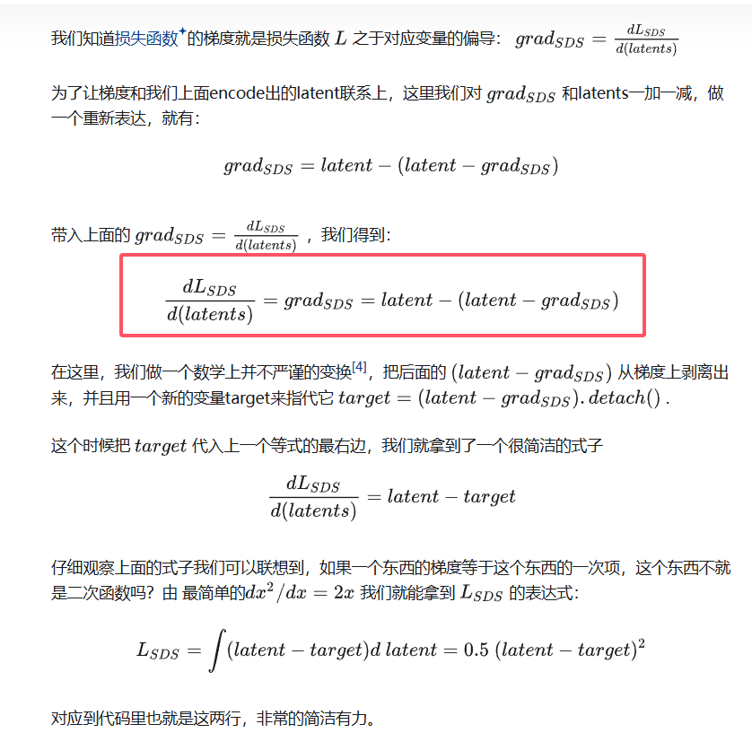
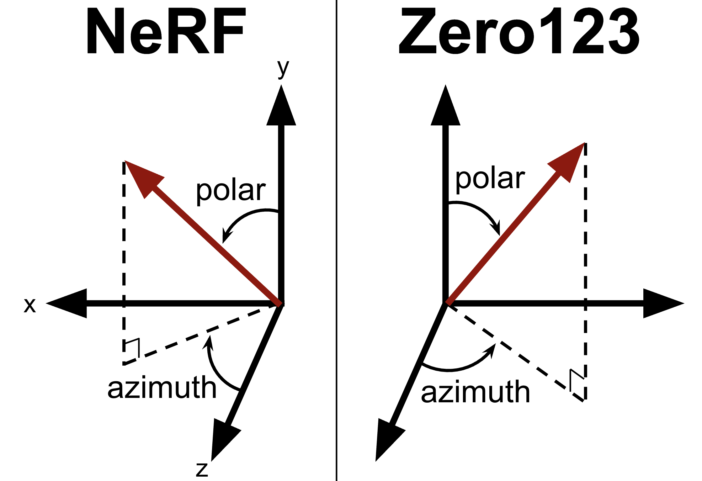

# SDS总结

对应的代码仓库：https://github.com/ashawkey/stable-dreamfusion/tree/5550b91862a3af7842bb04875b7f1211e5095a63

> 以下文章对代码解读的非常好：https://zhuanlan.zhihu.com/p/687684435

# Code organization & Advanced tips

以下是比较关键的一些代码的位置，方便阅读和整理：

* The SDS loss is located at `./guidance/sd_utils.py > StableDiffusion > train_step`:
```python
## 1. we need to interpolate the NeRF rendering to 512x512, to feed it to SD's VAE.
pred_rgb_512 = F.interpolate(pred_rgb, (512, 512), mode='bilinear', align_corners=False)
## 2. image (512x512) --- VAE --> latents (64x64), this is SD's difference from Imagen.
latents = self.encode_imgs(pred_rgb_512)
... # timestep sampling, noise adding and UNet noise predicting
## 3. the SDS loss
w = (1 - self.alphas[t])
grad = w * (noise_pred - noise)
# since UNet part is ignored and cannot simply audodiff, we have two ways to set the grad:
# 3.1. call backward and set the grad now (need to retain graph since we will call a second backward for the other losses later)
latents.backward(gradient=grad, retain_graph=True)
return 0 # dummy loss

# 3.2. use a custom function to set a hook in backward, so we only call backward once (credits to @elliottzheng)
class SpecifyGradient(torch.autograd.Function):
    @staticmethod
    @custom_fwd
    def forward(ctx, input_tensor, gt_grad):
        ctx.save_for_backward(gt_grad)
        # we return a dummy value 1, which will be scaled by amp's scaler so we get the scale in backward.
        return torch.ones([1], device=input_tensor.device, dtype=input_tensor.dtype)

    @staticmethod
    @custom_bwd
    def backward(ctx, grad_scale):
        gt_grad, = ctx.saved_tensors
        gt_grad = gt_grad * grad_scale
        return gt_grad, None

loss = SpecifyGradient.apply(latents, grad)
return loss # functional loss

# 3.3. reparameterization (credits to @Xallt)
# d(loss)/d(latents) = grad, since grad is already detached, it's this simple.
loss = (grad * latents).sum()
return loss

# 3.4. reparameterization (credits to threestudio)
# this is the same as 3.3, but the loss value only reflects the magnitude of grad, which is more informative.
targets = (latents - grad).detach()
loss = 0.5 * F.mse_loss(latents, targets, reduction='sum')
return loss
```
关于loss的另一种计算方法，在知乎文章 https://zhuanlan.zhihu.com/p/687684435里对这样写代码的一些说明，这里没太理解，用GPT解释了一下。这段代码如下：

```python
w = (1 - self.alphas[t])
grad = w[:, None, None, None] * (noise_pred - noise)

# 重点是下面两句
target = (latents - grad).detach()
loss_sds = 0.5 * F.mse_loss(latents, target, reduction="sum") / batch_size
```

知乎文章里是这样说的：



本来红框里面的部分不太理解，问了一下GPT,这个问题可以抽象为以下的情况：

> 要将方程 ( $\frac{dy}{dx} = x - (x - \frac{dy}{dx})$ ) 进行简化，我们可以先对其进行重写和分析。
>
> 1. **初步整理**： 我们可以重写原始方程为：$ [ \frac{dy}{dx} = x - (x - \frac{dy}{dx}) = \frac{dy}{dx} ] $由此我们发现，这个等式是恒成立的，且没有给出直接的关系。因此，我们需要考虑不同的情况来近似。
> 2. **引入目标**： 设 ( $target = x - \frac{dy}{dx} $)，如果我们希望将 ($ x - \frac{dy}{dx}$ ) 视为某个常量（或目标），这意味着在某些条件下，我们认为 ($ \frac{dy}{dx}$ ) 的变化相较于 ( x ) 来说是微小的，从而使得 ($ x - \frac{dy}{dx} $) 的变化也相对稳定。
> 3. **适用条件**：
>    - **当 ($\frac{dy}{dx}$) 的变化非常缓慢时**：如果 ( y ) 是一个与 ( x ) 的变化相比变化较小的函数，即 ( $\frac{dy}{dx}$ ) 持续接近于某一常数值，则可以将 ( $x - \frac{dy}{dx}$ ) 视为常量。
>    - **当 ( x ) 变化范围不大时**：如果 ( x ) 在一定区间内变化不大，而 ( $\frac{dy}{dx} $) 随之保持相对稳定，也可以认为 ( target ) 近似为常量。
>
> ### 总结
>
> 在 ( $\frac{dy}{dx} $) 相对于 ( x ) 的变化非常小或者缓慢时，可以近似将 ( $x - \frac{dy}{dx} $) 抽离出来，认定为某个目标常量，从而使得原方程变为： [ $\frac{dy}{dx} = x - target $]
>
> 这种情况下，我们假设 ( target ) 近似为常数，有助于简化分析和求解。

**感觉有点懂了。如果还是不能理解的话也没事，先这样吧。**

* Other regularizations are in `./nerf/utils.py > Trainer > train_step`.
    * The generation seems quite sensitive to regularizations on weights_sum (alphas for each ray). The original opacity loss tends to make NeRF disappear (zero density everywhere), so we use an entropy loss to replace it for now (encourages alpha to be either 0 or 1).
* NeRF Rendering core function: `./nerf/renderer.py > NeRFRenderer > run & run_cuda`.
* Shading & normal evaluation: `./nerf/network*.py > NeRFNetwork > forward`.
    * light direction: current implementation use a plane light source, instead of a point light source.
* View-dependent prompting: `./nerf/provider.py > get_view_direction`.
    * use `--angle_overhead, --angle_front` to set the border.
* Network backbone (`./nerf/network*.py`) can be chosen by the `--backbone` option.
* Spatial density bias (density blob): `./nerf/network*.py > NeRFNetwork > density_blob`.


# Debugging

`debugpy-run` is a convenient way to remotely debug this project. Simply replace a command like this one:

```bash
python main.py --text "a hamburger" --workspace trial -O --vram_O
```

... with:

```bash
debugpy-run main.py -- --text "a hamburger" --workspace trial -O --vram_O
```

For more details: https://github.com/bulletmark/debugpy-run 

# Axes and directions of polar, azimuth, etc. in NeRF and Zero123



This code refers to theta for polar, phi for azimuth.