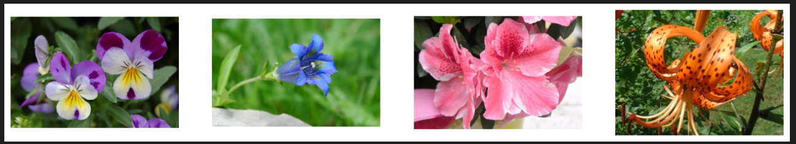

# HuggingFace Diffusers 笔记

参考链接：https://huggingface.co/docs/diffusers/index

# 一、基础准备

先用AutoDL创建一个服务器，然后直接在base conda环境中做测试即可，先安装diffusers和transformers库：
```bash
pip install diffusers["torch"] transformers
```


## 1.配置Huggingface镜像

https://hf-mirror.com/ 这篇下面有进行介绍。以下是需要输入配置的指令：
```bash
pip install -U huggingface_hub
export HF_ENDPOINT=https://hf-mirror.com
```


# 二、实操

## 1.基本认知

```python
from diffusers import DDPMScheduler, UNet2DModel

scheduler = DDPMScheduler.from_pretrained("google/ddpm-cat-256") # schedular
model = UNet2DModel.from_pretrained("google/ddpm-cat-256").to("cuda")

scheduler.set_timesteps(50)
# print(scheduler.timesteps)

import torch

sample_size = model.config.sample_size
noise = torch.randn((1, 3, sample_size, sample_size), device="cuda") # (1, 3, 256, 256),指的是（batch_size, channel, height, width）

# 以下为去噪的过程代码
input = noise  # 初始化为纯噪声（latent space维度）

for t in scheduler.timesteps:  # 遍历所有timestep（从大到小，如1000→0）
    with torch.no_grad(): # 测试,没有在训练
        # 步骤1：UNet预测噪声残差
        noisy_residual = model(input, t).sample  # 输入当前噪声图+时间步，输出预测的噪声
    
    # 步骤2：Schedular会根据当前的噪声图和时间步，计算出上一步的噪声图（去除一部分噪声）
    previous_noisy_sample = scheduler.step(noisy_residual, t, input).prev_sample  # 计算去噪后的图像
    
    # 步骤3：更新输入为去噪后的图像
    input = previous_noisy_sample  # 作为下一轮迭代的输入

# 把去噪后的结果转换为图像
from PIL import Image
import numpy as np
print('==============now input====================')
print(input.shape)  # (1, 3, 256, 256)
# print(input) # 范围是[-1, 1]
print('==============end====================')

image = (input / 2 + 0.5).clamp(0, 1).squeeze() # squeeze()去掉batch_size维度
image = (image.permute(1, 2, 0) * 255).round().to(torch.uint8).cpu().numpy() # permute函数是为了把维度从(3, 256, 256)变成(256, 256, 3)，*255是为了把范围从[0,1]变成[0,255]，round()四舍五入，to(torch.uint8)转换为uint8类型
image = Image.fromarray(image)
image.save("cat_manualDiffusion.png")  # 保存图片
```

 You’ll initialize the necessary components, and set the number of timesteps to create a `timestep` array. The `timestep` array is used in the denoising loop, and for each element in this array, the model predicts a less noisy image. The denoising loop iterates over the `timestep`’s, and at each timestep, it outputs a noisy residual and the scheduler uses it to predict a less noisy image at the previous timestep. This process is repeated until you reach the end of the `timestep` array.


## 2.Deconstruct the Stable Diffusion pipeline

本节的目标是拆解Stable Diffusion。Stable Diffusion是运作在Latent Space下的。The encoder compresses the image into a smaller representation, and a decoder converts the compressed representation back into an image. For text-to-image models, you’ll need a tokenizer and an encoder to generate text embeddings. From the previous example, you already know you need a UNet model and a scheduler.

对SD有一个基本的回顾：

> 以下是精简版回答，以表格形式总结Stable Diffusion核心组件及流程：
>
> ---
>
> ### **1. 核心组件功能**
> | 组件     | 作用                                                  | 训练阶段                                                     | 推理阶段（生成图像）                                         |
> | -------- | ----------------------------------------------------- | ------------------------------------------------------------ | ------------------------------------------------------------ |
> | **CLIP** | 文本编码器，将提示词转换为语义向量（Text Embeddings） | 固定权重（通常不训练），直接使用预训练模型                   | 将用户输入的文本提示编码为UNet可理解的向量                   |
> | **VAE**  | 图像编码器/解码器，在像素空间和潜在空间之间转换       | 训练：编码图像为潜在表示（压缩维度），解码重建图像           | 编码器：仅用于训练；解码器：将UNet输出的潜在表示解码为最终图像 |
> | **UNet** | 噪声预测器，在潜在空间逐步去噪                        | 训练：学习预测添加到潜在表示中的噪声（输入带噪潜在向量+时间步+文本条件） | 迭代去噪：根据CLIP文本条件，逐步预测并移除噪声，生成干净的潜在表示 |
>
> ---
>
> ### **2. 训练 vs 推理流程对比**
> | 阶段     | 输入                         | 输出                     | 关键操作                                                     |
> | -------- | ---------------------------- | ------------------------ | ------------------------------------------------------------ |
> | **训练** | 1. 图像 → VAE编码为潜在表示  | 重建图像（VAE解码）      | 1. 对潜在表示加噪声<br>2. UNet学习预测噪声（条件：CLIP文本+时间步） |
> |          | 2. 文本 → CLIP编码为嵌入向量 | 噪声预测损失（UNet输出） |                                                              |
> | **推理** | 1. 文本 → CLIP生成嵌入向量   | 生成图像（VAE解码）      | 1. 从随机噪声开始<br>2. UNet迭代去噪（条件：CLIP文本+调度器控制时间步） |
> |          | 2. 随机噪声 → UNet逐步去噪   |                          | 3. 最终潜在表示 → VAE解码为图像                              |
>
> ---
>
> ### **关键点总结**
> - **CLIP**：文本理解（不参与扩散训练，仅提供条件）。  
> - **VAE**：空间压缩（训练时编码/解码；推理时仅解码）。  
> - **UNet**：扩散核心（训练时学噪声预测，推理时执行去噪）。  
> - **流程差异**：训练时UNet学习噪声预测；推理时用学到的模型逐步去噪生成图像。

这一节的代码如下：
```python
from PIL import Image
import torch
from transformers import CLIPTextModel, CLIPTokenizer
from diffusers import AutoencoderKL, UNet2DConditionModel, PNDMScheduler

# 这些文件都可以去这里看：https://huggingface.co/stable-diffusion-v1-5/stable-diffusion-v1-5/tree/main
vae = AutoencoderKL.from_pretrained("CompVis/stable-diffusion-v1-4", subfolder="vae", use_safetensors=True)
tokenizer = CLIPTokenizer.from_pretrained("CompVis/stable-diffusion-v1-4", subfolder="tokenizer")
text_encoder = CLIPTextModel.from_pretrained(
    "CompVis/stable-diffusion-v1-4", subfolder="text_encoder", use_safetensors=True
)
unet = UNet2DConditionModel.from_pretrained(
    "CompVis/stable-diffusion-v1-4", subfolder="unet", use_safetensors=True
)

# 换一个Schedular进行尝试
from diffusers import UniPCMultistepScheduler

scheduler = UniPCMultistepScheduler.from_pretrained("CompVis/stable-diffusion-v1-4", subfolder="scheduler")

torch_device = "cuda"
vae.to(torch_device)
text_encoder.to(torch_device)
unet.to(torch_device)

# create text embeddings
prompt = ['a photo of a cartoon character, looks like someone in Genshin Impact.']
height = 512
width = 512 # 默认SD是512x512
num_inference_steps = 50  # Number of denoising steps
guidance_scale = 7.5
generator = torch.Generator(device=torch_device).manual_seed(1145)  # 新代码（在CUDA上）,generator需要和其他的tensor在同一个device上
batch_size = len(prompt)

text_input = tokenizer(
    prompt, padding="max_length", max_length=tokenizer.model_max_length, truncation=True, return_tensors="pt"
) # truncation=True表示如果超过最大长度就截断，return_tensors="pt"表示返回PyTorch的tensor格式
# 上面的max_length是77，tokenizer.model_max_length = 77
with torch.no_grad():
    text_embeddings = text_encoder(text_input.input_ids.to(torch_device))[0]

# You’ll also need to generate the unconditional text embeddings which are the embeddings for the padding token. These need to have the same shape (batch_size and seq_length) as the conditional text_embeddings:
max_length = text_input.input_ids.shape[-1] # shape[-1]表示最后一个维度的大小
print("show two shapes: tokenizer.model_max_length, text_input.input_ids.shape[-1]")
print(tokenizer.model_max_length, text_input.input_ids.shape[-1]) # 77, 77
uncond_input = tokenizer([""] * batch_size, padding="max_length", max_length=max_length, return_tensors="pt")
uncond_embeddings = text_encoder(uncond_input.input_ids.to(torch_device))[0]

# 现在我们可以把条件和无条件的文本嵌入连接起来了
text_embeddings = torch.cat([uncond_embeddings, text_embeddings])  # [2, 77, 768]
# create random noise, //8 是因为unet的输入是latent space维度
latents = torch.randn(
    (batch_size, unet.config.in_channels, height // 8, width // 8),
    generator=generator,
    device=torch_device,
)
latents = latents * scheduler.init_noise_sigma # which is required for improved schedulers like UniPCMultistepScheduler.

'''
The last step is to create the denoising loop that’ll progressively transform the pure noise in latents to an image described by your prompt. Remember, the denoising loop needs to do three things:

Set the scheduler’s timesteps to use during denoising.
Iterate over the timesteps.
At each timestep, call the UNet model to predict the noise residual and pass it to the scheduler to compute the previous noisy sample.
'''
from tqdm.auto import tqdm
scheduler.set_timesteps(num_inference_steps)
for t in tqdm(scheduler.timesteps):
    # expand the latents if we are doing classifier-free guidance to avoid doing two forward passes.
    latent_model_input = torch.cat([latents] * 2)

    latent_model_input = scheduler.scale_model_input(latent_model_input, timestep=t)

    # predict the noise residual
    with torch.no_grad():
        noise_pred = unet(latent_model_input, t, encoder_hidden_states=text_embeddings).sample

    # perform guidance
    noise_pred_uncond, noise_pred_text = noise_pred.chunk(2)
    noise_pred = noise_pred_uncond + guidance_scale * (noise_pred_text - noise_pred_uncond)

    # compute the previous noisy sample x_t -> x_t-1
    latents = scheduler.step(noise_pred, t, latents).prev_sample

# scale and decode the image latents with vae
latents = 1 / 0.18215 * latents
with torch.no_grad():
    image = vae.decode(latents).sample
image = (image / 2 + 0.5).clamp(0, 1).squeeze()
image = (image.permute(1, 2, 0) * 255).to(torch.uint8).cpu().numpy()
image = Image.fromarray(image)
image.save("02_output.png")

```


## 3.AutoPipeline的学习

简单来说，就是快速部署Diffusion Model对应的子模块，代码量很短即可完成任务。

> ### **Diffusers 中的 AutoPipeline 概念（简要介绍）**
> Hugging Face **Diffusers** 库中的 **AutoPipeline** 是一个**自动化管道（Pipeline）**，它可以根据任务类型（如文本生成图像、图像修复、超分辨率等）**自动选择最适合的预训练模型和调度器（Scheduler）**，简化了 Stable Diffusion 等扩散模型的使用流程。
>
> ---
>
> ### **AutoPipeline 的作用**
> 1. **自动适配任务**  
>    - 无需手动指定 `StableDiffusionPipeline`、`StableDiffusionImg2ImgPipeline` 等具体类，只需通过 `AutoPipelineForText2Image`、`AutoPipelineForImage2Image` 等通用接口，Diffusers 会自动加载合适的模型。
>    - 支持的任务包括：
>      - 文本生成图像（Text-to-Image）
>      - 图像生成图像（Image-to-Image）
>      - 图像修复（Inpainting）
>      - 超分辨率（Super Resolution）
>      - 深度图生成（Depth-to-Image）等。
>
> 2. **自动选择模型和调度器**  
>    - 根据任务类型，AutoPipeline 会从 Hugging Face Hub 加载**最新或最优的预训练模型**（如 `stabilityai/stable-diffusion-2-1`）。
>    - 自动配置适合的**噪声调度器（Scheduler）**（如 `PNDMScheduler`、`DPMSolverMultistepScheduler`）。
>
> 3. **简化代码**  
>    - 传统方式需要手动初始化模型、调度器，而 AutoPipeline 只需一行代码即可完成初始化，例如：
>      ```python
>      from diffusers import AutoPipelineForText2Image
>      pipeline = AutoPipelineForText2Image.from_pretrained("runwayml/stable-diffusion-v1-5")
>      ```
>    - 适合快速实验和部署，无需关心底层细节。
>
> 4. **兼容多种模型架构**  
>    - 支持 Stable Diffusion（1.x/2.x/XL）、Kandinsky、DeepFloyd IF 等扩散模型家族。
>    - 未来新发布的模型也能通过 AutoPipeline 自动适配。
>
> ---
>
> ### **适用场景**
> - **快速原型开发**：无需手动配置即可测试不同任务。
> - **模型对比**：轻松切换不同模型（如 SD v1.5 vs SD XL）。
> - **生产部署**：减少代码维护成本，自动适配最佳实践。
>
> ---
>
> ### **总结**
> AutoPipeline 是 Diffusers 提供的一个**高级抽象接口**，旨在让用户更便捷地使用扩散模型，**避免手动选择模型和调度器**，同时保持灵活性和性能。适合不想深入底层细节，但仍想高效利用扩散模型的开发者。

以下是文生图的示例代码（img2img，inpaint都是类似的，具体可以看huggingface的官方链接：[Train a diffusion model (huggingface.co)](https://huggingface.co/docs/diffusers/main/en/tutorials/basic_training)）

```python
# The AutoPipeline automatically detects the correct pipeline class to use.
from diffusers import AutoPipelineForText2Image
import torch

pipe_txt2img = AutoPipelineForText2Image.from_pretrained(
    "dreamlike-art/dreamlike-photoreal-2.0", torch_dtype=torch.float16, use_safetensors=True
).to("cuda")

prompt = "cinematic photo of Godzilla eating sushi with a cat in a izakaya, 35mm photograph, film, professional, 4k, highly detailed"
generator = torch.Generator(device="cpu").manual_seed(37)
image = pipe_txt2img(prompt, generator=generator).images[0]
image.save("cat_autoPipeline.png")  # 保存图片
```


## 4.Train a diffusion model

[Train a diffusion model (huggingface.co)](https://huggingface.co/docs/diffusers/main/en/tutorials/basic_training)

以下先基于这个链接：[diffusers_training_example.ipynb - Colab (google.com)](https://colab.research.google.com/github/huggingface/notebooks/blob/main/diffusers/training_example.ipynb)

首先，安装必要的包：

```shell
pip install -U diffusers[training]
```


### （1）Huggingface的配置与数据集下载

> 关于Huggingface的模型下载，推荐这个链接：https://zhuanlan.zhihu.com/p/663712983

**将环境变量的配置命令写入到终端的配置文件中**，**使得终端自动加载该环境变量，免去每次手动执行命令的麻烦**。

```bash
echo 'export HF_ENDPOINT="https://hf-mirror.com"' >> ~/.bashrc
```

- 优先推荐：`huggingface-cli`
  - 安装：`pip install -U huggingface_hub`

#### （a）数据集下载

可以在代码中这样写：

```python
dataset = load_dataset(
    config.dataset_name, 
    split="train", 
    token=globalConfig.huggingface_token, # 这里填写huggingface的token，为了安全起见放到了其他文件中
    download_mode="force_redownload")  # load the dataset
```

`print(dataset)`的输出结果如下：

```python
Dataset({
    features: ['image'],
    num_rows: 8189
})
```

> You can find additional datasets from the [HugGan Community Event](https://huggingface.co/huggan) or you can use your own dataset by creating a local [`ImageFolder`](https://huggingface.co/docs/datasets/image_dataset#imagefolder). Set `config.dataset_name` to the repository id of the dataset if it is from the HugGan Community Event, or `imagefolder` if you’re using your own images.

如果还是不行，可以尝试如下的方案：

> 你的代码仍然无法连接到 Hugging Face 数据集，可能是由于网络限制或镜像站不稳定。以下是 **手动下载数据集** 的方法（适用于 Linux 环境），以及一些额外的解决方案：
>
> ---
>
> ### **1. 手动下载数据集（Linux 方法）**
> #### **(1) 使用 `git lfs` 下载数据集**
> ```bash
> # 安装 git-lfs（如果未安装）
> sudo apt-get update && sudo apt-get install git-lfs -y
> git lfs install
> 
> # 克隆数据集（使用国内镜像）
> export HF_ENDPOINT=https://hf-mirror.com
> git lfs clone https://hf-mirror.com/datasets/huggan/anime-faces
> # 如果中间断了，可以cd进下载的文件夹当中，输入：
> git lfs pull # 要在下载到本地的文件夹当中写
> ```
> 如果数据集较大，可以只下载部分文件：
> ```bash
> git clone --depth 1 https://hf-mirror.com/datasets/huggan/anime-faces
> cd anime-faces
> git lfs pull --include="*.jpg"  # 只下载图片
> ```
>
> #### **(2) 使用 `wget` 或 `curl` 下载**
> 如果数据集是 `.zip` 或 `.tar.gz` 格式：
> ```bash
> wget https://hf-mirror.com/datasets/huggan/anime-faces/resolve/main/data.zip
> unzip data.zip -d ./anime-faces
> ```
>
> #### **(3) 加载本地数据集**
> ```python
> import os
> from datasets import load_dataset
> 
> # 指定本地路径
> dataset_path = "./anime-faces"  # 替换为你的路径
> dataset = load_dataset(dataset_path, split="train")
> ```
>
> ---
>
> ### **2. 检查网络连接**
> 确保你的服务器能访问 `hf-mirror.com`：
> ```bash
> ping hf-mirror.com
> curl -v https://hf-mirror.com
> ```
> 如果无法访问，可能是 **防火墙/代理问题**，尝试：
> ```bash
> export http_proxy=http://your-proxy:port
> export https_proxy=http://your-proxy:port
> ```
>
> ---
>
> ### **3. 强制使用镜像站**
> 确保环境变量生效：
> ```python
> import os
> os.environ['HF_ENDPOINT'] = 'https://hf-mirror.com'  # 强制镜像
> os.environ['HF_HUB_OFFLINE'] = '1'  # 离线模式（如果已下载）
> ```
>
> ---
>
> ### **4. 使用 `datasets` 的离线模式**
> 如果数据集已缓存，直接加载缓存：
> ```python
> dataset = load_dataset("huggan/anime-faces", split="train", download_mode="reuse_dataset_if_exists")
> ```
>
> ---
>
> ### **5. 检查 Hugging Face Token**
> 如果你的数据集是私有的，确保 `token` 正确：
> ```python
> from huggingface_hub import login
> login(token="your_token_here")  # 替代全局变量
> ```
>
> ---
>
> ### **6. 直接下载 `.parquet` 文件（备用方案）**
> 某些数据集提供 `.parquet` 格式，可直接下载：
> ```python
> import pandas as pd
> url = "https://hf-mirror.com/datasets/huggan/anime-faces/resolve/main/train.parquet"
> df = pd.read_parquet(url)
> ```
>
> ---
>
> ### **7. 使用 `aria2` 加速下载**
> 如果数据集很大，可以用多线程下载：
> ```bash
> sudo apt-get install aria2
> aria2c -x 16 -s 16 "https://hf-mirror.com/datasets/huggan/anime-faces/resolve/main/data.zip"
> ```
>
> ---
>
> ### **总结**
> 1. **推荐手动下载**（`git lfs clone` 或 `wget`），然后本地加载。  
> 2. 检查网络连接和代理设置。  
> 3. 确保 `HF_ENDPOINT` 环境变量生效。  
> 4. 如果问题持续，可能是服务器网络限制，尝试更换网络环境。
>
> 如果仍有问题，请提供：
> - 你使用的具体数据集名称（`huggan/anime-faces` 还是 `vollerei-id/anime_cartoon2`？）
> - `ping hf-mirror.com` 的结果
> - 是否在代理环境下运行？


#### （b）可视化数据集中的数据

Datasets uses the [Image](https://huggingface.co/docs/datasets/main/en/package_reference/main_classes#datasets.Image) feature to automatically decode the image data and load it as a [`PIL.Image`](https://pillow.readthedocs.io/en/stable/reference/Image.html) which we can visualize:

```python
import matplotlib.pyplot as plt

fig, axs = plt.subplots(1, 4, figsize=(16, 4))
for i, image in enumerate(dataset[:4]["image"]):
    axs[i].imshow(image)
    axs[i].set_axis_off()
# fig.show()
# 如果需要在linux上保存图片，可以使用下面的代码
plt.savefig("flowers.png", bbox_inches='tight', pad_inches=0.1)
```

可视化的结果如下：




#### （c）数据处理并放入DataLoader，准备训练

注意到上面的图的大小是不一致的，因此需要进行统一的数据处理，如下：

- `Resize` changes the image size to the one defined in `config.image_size`.
- `RandomHorizontalFlip` augments the dataset by randomly mirroring the images.
- `Normalize` is important to rescale the pixel values into a [-1, 1] range, which is what the model expects.

```python
# 处理图片
from torchvision import transforms

preprocess = transforms.Compose(
    [
        transforms.Resize((config.image_size, config.image_size)),
        transforms.RandomHorizontalFlip(),
        transforms.ToTensor(),
        # pytorch的transform.Normalize的公式是：normalize(x) = (x - mean) / std，transforms.ToTensor() 会将 PIL 图像或 NumPy 数组转换为 PyTorch 张量，并将像素值从 [0, 255] 缩放到 [0, 1]（浮点数）。
        # 所以就相当于把像素值从 [0, 255] 缩放到 [-1, 1]，mean和std都是0.5，所以就相当于把像素值从 [0, 255] 缩放到 [-1, 1]
        transforms.Normalize([0.5], [0.5]), 
    ]
)

# Use 🤗 Datasets’ set_transform method to apply the preprocess function on the fly during training:
def transform(examples):
    images = [preprocess(image.convert("RGB")) for image in examples["image"]]
    return {"images": images}

dataset.set_transform(transform)
import torch
train_dataloader = torch.utils.data.DataLoader(dataset, batch_size=config.train_batch_size, shuffle=True)
```


####  (d)创建UNet2DModel

Pretrained models in 🧨 Diffusers are easily created from their model class with the parameters you want. For example, to create a [UNet2DModel](https://huggingface.co/docs/diffusers/main/en/api/models/unet2d#diffusers.UNet2DModel):

```python
# 创建UNet2DModel
from diffusers import UNet2DModel
model = UNet2DModel(
    sample_size=config.image_size,  # the target image resolution
    in_channels=3,  # the number of input channels, 3 for RGB images
    out_channels=3,  # the number of output channels
    layers_per_block=2,  # how many ResNet layers to use per UNet block
    block_out_channels=(128, 128, 256, 256, 512, 512),  # the number of output channels for each UNet block
    down_block_types=(
        "DownBlock2D",  # a regular ResNet downsampling block
        "DownBlock2D",
        "DownBlock2D",
        "DownBlock2D",
        "AttnDownBlock2D",  # a ResNet downsampling block with spatial self-attention
        "DownBlock2D",
    ),
    up_block_types=(
        "UpBlock2D",  # a regular ResNet upsampling block
        "AttnUpBlock2D",  # a ResNet upsampling block with spatial self-attention
        "UpBlock2D",
        "UpBlock2D",
        "UpBlock2D",
        "UpBlock2D",
    ),
)

# It is often a good idea to quickly check the sample image shape matches the model output shape:
sample_image = dataset[0]["images"].unsqueeze(0) # unsqueeze(0)表示在第0维增加一个维度，变成(1, 3, 128, 128)，batch_size=1
print("Input shape:", sample_image.shape) # Input shape: torch.Size([1, 3, 128, 128])
print("Output shape:", model(sample_image, timestep=0).sample.shape) # Output shape: torch.Size([1, 3, 128, 128])

```


#### （e）创建Schedular

The scheduler behaves differently depending on whether you’re using the model for training or inference. During inference, the scheduler generates image from the noise. During training, the scheduler takes a model output - or a sample - from a specific point in the diffusion process and applies noise to the image according to a *noise schedule* and an *update rule*.

Let’s take a look at the [DDPMScheduler](https://huggingface.co/docs/diffusers/main/en/api/schedulers/ddpm#diffusers.DDPMScheduler) and use the `add_noise` method to add some random noise to the `sample_image` from before:

```python
import torch
from PIL import Image
from diffusers import DDPMScheduler

noise_scheduler = DDPMScheduler(num_train_timesteps=1000) # （1）
noise = torch.randn(sample_image.shape)
timesteps = torch.LongTensor([50]) # （2）这里的timesteps是一个一维的tensor，表示当前的时间步，值为50, LongTensor表示长整型的tensor
noisy_image = noise_scheduler.add_noise(sample_image, noise, timesteps)

# 以下代码的意思是把noisy_image的范围从[-1, 1]缩放到[0, 255]，然后转换为uint8类型的numpy数组，最后转换为PIL图像，permute函数是为了把维度从(1, 3, 128, 128)变成(1，128, 128, 3)，*255是为了把范围从[-1, 1]缩放到[0, 255]，to(torch.uint8)转换为uint8类型
Image.fromarray(((noisy_image.permute(0, 2, 3, 1) + 1.0) * 127.5).type(torch.uint8).numpy()[0])
# 保存图片为png格式
# Image.fromarray(((noisy_image.permute(0, 2, 3, 1) + 1.0) * 127.5).type(torch.uint8).numpy()[0]).save("noisy_image.png")

```

实际的损失函数的计算式子如下（会在后面的训练过程中使用）：

```python
import torch.nn.functional as F

noise_pred = model(noisy_image, timesteps).sample
loss = F.mse_loss(noise_pred, noise)
```


> 在Diffusion模型中，（1）和（2）的`timesteps`数值不同是因为它们分别代表不同的含义，这种差异是设计上的需要，不会对模型效果产生负面影响。以下是具体解释：
>
> ---
>
> ### （1）`num_train_timesteps=1000`
> - **含义**：这表示扩散过程的总步数为1000步。模型在训练时会逐步从纯噪声（`t=1000`）反向预测到清晰图像（`t=0`）。
> - **作用**：  
>   - 定义了噪声调度器的“时间分辨率”，即噪声添加/去除的粒度。  
>   - 更大的`num_train_timesteps`（如1000）能让扩散过程更平滑，但会增加计算成本。  
>   - 这个值在训练时固定，影响噪声方差（`beta_t`）的调度策略。
>
> ---
>
> ### （2）`timesteps = torch.LongTensor([50])`
> - **含义**：这里指定了当前操作的具体时间步是第50步（从1000步中选取）。  ==我的理解是这行代码仅用于测试加噪声的效果，实际训练不会这么做。==
> - **作用**：  
>   - 在`add_noise`中，`timesteps=50`表示对输入图像添加第50步对应的噪声强度（根据调度器计算的`alpha_t`和`beta_t`）。  
>   - 如果用于训练，这相当于告诉模型：“请学习如何从第50步的状态去噪”。  
>   - 如果用于推理（采样），可能表示从第50步开始反向生成图像（但通常采样是从`t=1000`开始）。
>
> ---
>
> ### 为什么可以不同？
> 1. **时间步的独立性**：  
>    `num_train_timesteps`是全局参数，而`timesteps`是单次操作的局部参数。调度器会根据全局步数（1000）计算第50步的噪声强度，两者是兼容的。
>
> 2. **噪声调度的数学性质**：  
>    无论`timesteps`取值多少（如50或500），调度器都会自动根据`num_train_timesteps`归一化到相同的噪声尺度范围（如线性或余弦调度）。例如，第50步的噪声量在1000步中和在500步中的“相对强度”可能不同，但调度器会保证一致性。
>
> 3. **训练时的随机采样**：  
>    在训练中，`timesteps`会被随机采样（如`torch.randint(0, 1000, (batch_size,))`），目的是让模型学习所有时间步的去噪能力。代码中的`50`只是一个示例。
>
> ---
>
> ### 是否有影响？
> - **无负面影响**：只要`timesteps`不超过`num_train_timesteps`（如50 ≤ 1000），操作是安全的。  
> - **训练时的关键点**：  
>   - 如果`timesteps`总是固定（如总是50），模型将无法学习其他时间步的去噪，导致性能下降。实际训练中应随机采样`timesteps`。  
>   - 在推理时，通常需要从`t=1000`逐步降到`t=0`（完整采样）或使用更少的步数（如DDIM的50步加速采样）。
>
> ---
>
> ### 总结
> - `num_train_timesteps=1000`：定义噪声调度的总步数（全局参数）。  
> - `timesteps=50`：指定当前操作的特定时间步（局部参数），其噪声强度由调度器根据全局步数计算。  
> - **正确用法**：训练时随机采样`timesteps`，推理时按需选择步数（可少于`num_train_timesteps`）。


### （2）训练模型

By now, you have most of the pieces to start training the model and all that’s left is putting everything together.

First, you’ll need an optimizer and a learning rate scheduler. Then, you’ll need a way to evaluate the model. For evaluation, you can use the [DDPMPipeline](https://huggingface.co/docs/diffusers/main/en/api/pipelines/ddpm#diffusers.DDPMPipeline) to generate a batch of sample images and save it as a grid:

```python
# train the model
from diffusers.optimization import get_cosine_schedule_with_warmup

optimizer = torch.optim.AdamW(model.parameters(), lr=config.learning_rate)
lr_scheduler = get_cosine_schedule_with_warmup(
    optimizer=optimizer,
    num_warmup_steps=config.lr_warmup_steps,
    num_training_steps=(len(train_dataloader) * config.num_epochs),
)

from diffusers import DDPMPipeline
from diffusers.utils import make_image_grid
import os

def evaluate(config, epoch, pipeline):
    # Sample some images from random noise (this is the backward diffusion process).
    # The default pipeline output type is `List[PIL.Image]`
    images = pipeline(
        batch_size=config.eval_batch_size,
        generator=torch.Generator(device='cpu').manual_seed(config.seed), # Use a separate torch generator to avoid rewinding the random state of the main training loop
    ).images

    # Make a grid out of the images
    image_grid = make_image_grid(images, rows=4, cols=4)

    # Save the images
    test_dir = os.path.join(config.output_dir, "samples")
    os.makedirs(test_dir, exist_ok=True)
    image_grid.save(f"{test_dir}/{epoch:04d}.png")
```


### （3）总的代码

```python
from dataclasses import dataclass

@dataclass  # 装饰器，dataclass的装饰器可以自动生成一些特殊方法，比如__init__()、__repr__()等
class TrainingConfig:
    image_size = 128  # the generated image resolution
    train_batch_size = 16
    eval_batch_size = 16  # how many images to sample during evaluation
    num_epochs = 10
    gradient_accumulation_steps = 1 # 表示在每个batch上累积多少次梯度再进行一次反向传播
    learning_rate = 1e-4
    lr_warmup_steps = 500
    save_image_epochs = 2
    save_model_epochs = 30
    mixed_precision = 'fp16'  # `no` for float32, `fp16` for automatic mixed precision
    output_dir = 'ddpm-butterflies-128'  # the model namy locally and on the HF Hub

    push_to_hub = False  # whether to upload the saved model to the HF Hub
    hub_private_repo = False  
    overwrite_output_dir = True  # overwrite the old model when re-running the notebook
    seed = 0

config = TrainingConfig()

# loading the dataset
from datasets import load_dataset
config.dataset_name = "huggan/flowers-102-categories"  # the dataset name
import globalConfig
dataset = load_dataset(
    config.dataset_name, 
    split="train", 
    token=globalConfig.huggingface_token, # 这里填写huggingface的token，为了安全起见放到了其他文件中
    # download_mode="force_redownload" # 注释掉，如果需要重新下载数据集可以打开
    )  # load the dataset
print(dataset)

import matplotlib.pyplot as plt

fig, axs = plt.subplots(1, 4, figsize=(16, 4))
for i, image in enumerate(dataset[:4]["image"]):
    axs[i].imshow(image)
    axs[i].set_axis_off()
# fig.show()
# 如果需要在linux上保存图片，可以使用下面的代码
plt.savefig("flowers.png", bbox_inches='tight', pad_inches=0.1)

# 处理图片
from torchvision import transforms

preprocess = transforms.Compose(
    [
        transforms.Resize((config.image_size, config.image_size)),
        transforms.RandomHorizontalFlip(),
        transforms.ToTensor(),
        # pytorch的transform.Normalize的公式是：normalize(x) = (x - mean) / std，transforms.ToTensor() 会将 PIL 图像或 NumPy 数组转换为 PyTorch 张量，并将像素值从 [0, 255] 缩放到 [0, 1]（浮点数）。
        # 所以就相当于把像素值从 [0, 255] 缩放到 [-1, 1]，mean和std都是0.5，所以就相当于把像素值从 [0, 255] 缩放到 [-1, 1]
        transforms.Normalize([0.5], [0.5]), 
    ]
)

# Use 🤗 Datasets’ set_transform method to apply the preprocess function on the fly during training:
def transform(examples):
    images = [preprocess(image.convert("RGB")) for image in examples["image"]]
    return {"images": images}

dataset.set_transform(transform)
import torch
train_dataloader = torch.utils.data.DataLoader(dataset, batch_size=config.train_batch_size, shuffle=True)

# 创建UNet2DModel
from diffusers import UNet2DModel
model = UNet2DModel(
    sample_size=config.image_size,  # the target image resolution
    in_channels=3,  # the number of input channels, 3 for RGB images
    out_channels=3,  # the number of output channels
    layers_per_block=2,  # how many ResNet layers to use per UNet block
    block_out_channels=(128, 128, 256, 256, 512, 512),  # the number of output channels for each UNet block
    down_block_types=(
        "DownBlock2D",  # a regular ResNet downsampling block
        "DownBlock2D",
        "DownBlock2D",
        "DownBlock2D",
        "AttnDownBlock2D",  # a ResNet downsampling block with spatial self-attention
        "DownBlock2D",
    ),
    up_block_types=(
        "UpBlock2D",  # a regular ResNet upsampling block
        "AttnUpBlock2D",  # a ResNet upsampling block with spatial self-attention
        "UpBlock2D",
        "UpBlock2D",
        "UpBlock2D",
        "UpBlock2D",
    ),
)

# It is often a good idea to quickly check the sample image shape matches the model output shape:
sample_image = dataset[0]["images"].unsqueeze(0) # unsqueeze(0)表示在第0维增加一个维度，变成(1, 3, 128, 128)，batch_size=1
print("Input shape:", sample_image.shape) # Input shape: torch.Size([1, 3, 128, 128])
print("Output shape:", model(sample_image, timestep=0).sample.shape) # Output shape: torch.Size([1, 3, 128, 128])

import torch
from PIL import Image
from diffusers import DDPMScheduler

noise_scheduler = DDPMScheduler(num_train_timesteps=1000) # （1）
noise = torch.randn(sample_image.shape)
# 暂时仅用于观察不同step加噪声的效果
timesteps = torch.LongTensor([800]) # （2）这里的timesteps是一个一维的tensor，表示当前的时间步，值为50, LongTensor表示长整型的tensor
noisy_image = noise_scheduler.add_noise(sample_image, noise, timesteps)

# 以下代码的意思是把noisy_image的范围从[-1, 1]缩放到[0, 255]，然后转换为uint8类型的numpy数组，最后转换为PIL图像，permute函数是为了把维度从(1, 3, 128, 128)变成(1，128, 128, 3)，*255是为了把范围从[-1, 1]缩放到[0, 255]，to(torch.uint8)转换为uint8类型
Image.fromarray(((noisy_image.permute(0, 2, 3, 1) + 1.0) * 127.5).type(torch.uint8).numpy()[0])
# 保存图片为png格式
Image.fromarray(((noisy_image.permute(0, 2, 3, 1) + 1.0) * 127.5).type(torch.uint8).numpy()[0]).save("noisy_image.png")

# train the model
from diffusers.optimization import get_cosine_schedule_with_warmup

optimizer = torch.optim.AdamW(model.parameters(), lr=config.learning_rate)
lr_scheduler = get_cosine_schedule_with_warmup(
    optimizer=optimizer,
    num_warmup_steps=config.lr_warmup_steps,
    num_training_steps=(len(train_dataloader) * config.num_epochs),
)

from diffusers import DDPMPipeline
from diffusers.utils import make_image_grid
import os

def evaluate(config, epoch, pipeline):
    # Sample some images from random noise (this is the backward diffusion process).
    # The default pipeline output type is `List[PIL.Image]`
    images = pipeline(
        batch_size=config.eval_batch_size,
        generator=torch.Generator(device='cpu').manual_seed(config.seed), # Use a separate torch generator to avoid rewinding the random state of the main training loop
    ).images

    # Make a grid out of the images
    image_grid = make_image_grid(images, rows=4, cols=4)

    # Save the images
    test_dir = os.path.join(config.output_dir, "samples")
    os.makedirs(test_dir, exist_ok=True)
    image_grid.save(f"{test_dir}/{epoch:04d}.png")

from accelerate import Accelerator # accelerate是一个用于加速训练的库,包含了分布式训练和混合精度训练的功能
from huggingface_hub import create_repo, upload_folder
from tqdm.auto import tqdm
from pathlib import Path
import os
import torch.nn.functional as F

def train_loop(config, model, noise_scheduler, optimizer, train_dataloader, lr_scheduler):
    # Initialize accelerator and tensorboard logging
    accelerator = Accelerator(
        mixed_precision=config.mixed_precision,
        gradient_accumulation_steps=config.gradient_accumulation_steps,
        log_with="tensorboard",
        project_dir=os.path.join(config.output_dir, "logs"),
    )
    if accelerator.is_main_process:
        if config.output_dir is not None:
            os.makedirs(config.output_dir, exist_ok=True)
        if config.push_to_hub:
            repo_id = create_repo(
                repo_id=config.hub_model_id or Path(config.output_dir).name, exist_ok=True
            ).repo_id
        accelerator.init_trackers("train_example")

    # Prepare everything
    # There is no specific order to remember, you just need to unpack the
    # objects in the same order you gave them to the prepare method.
    model, optimizer, train_dataloader, lr_scheduler = accelerator.prepare(
        model, optimizer, train_dataloader, lr_scheduler
    )

    global_step = 0

    # Now you train the model
    for epoch in range(config.num_epochs):
        progress_bar = tqdm(total=len(train_dataloader), disable=not accelerator.is_local_main_process)
        progress_bar.set_description(f"Epoch {epoch}")

        for step, batch in enumerate(train_dataloader):
            clean_images = batch["images"]
            # Sample noise to add to the images
            noise = torch.randn(clean_images.shape, device=clean_images.device)
            bs = clean_images.shape[0]

            # Sample a random timestep for each image
            timesteps = torch.randint(
                0, noise_scheduler.config.num_train_timesteps, (bs,), device=clean_images.device,
                dtype=torch.int64
            )

            # Add noise to the clean images according to the noise magnitude at each timestep
            # (this is the forward diffusion process)
            noisy_images = noise_scheduler.add_noise(clean_images, noise, timesteps)

            with accelerator.accumulate(model):
                # Predict the noise residual
                noise_pred = model(noisy_images, timesteps, return_dict=False)[0]
                loss = F.mse_loss(noise_pred, noise)
                accelerator.backward(loss)

                if accelerator.sync_gradients:
                    accelerator.clip_grad_norm_(model.parameters(), 1.0)
                optimizer.step()
                lr_scheduler.step()
                optimizer.zero_grad()

            progress_bar.update(1)
            logs = {"loss": loss.detach().item(), "lr": lr_scheduler.get_last_lr()[0], "step": global_step}
            progress_bar.set_postfix(**logs)
            accelerator.log(logs, step=global_step)
            global_step += 1

        # After each epoch you optionally sample some demo images with evaluate() and save the model
        if accelerator.is_main_process:
            pipeline = DDPMPipeline(unet=accelerator.unwrap_model(model), scheduler=noise_scheduler)

            if (epoch + 1) % config.save_image_epochs == 0 or epoch == config.num_epochs - 1:
                evaluate(config, epoch, pipeline)

            if (epoch + 1) % config.save_model_epochs == 0 or epoch == config.num_epochs - 1:
                if config.push_to_hub:
                    upload_folder(
                        repo_id=repo_id,
                        folder_path=config.output_dir,
                        commit_message=f"Epoch {epoch}",
                        ignore_patterns=["step_*", "epoch_*"],
                    )
                else:
                    pipeline.save_pretrained(config.output_dir)
    

# 开始训练
if __name__ == "__main__":
    # training loop
    train_loop(config, model, noise_scheduler, optimizer, train_dataloader, lr_scheduler)
```


## 5.可视化Stable Diffusion的Attention层

可以看这个链接：https://github.com/castorini/daam?tab=readme-ov-file


#### 补充：模型权重下载

使用如下的shell指令是合理的：

```shell
huggingface-cli download --token hf_*** --resume-download meta-llama/Llama-2-7b-hf --local-dir Llama-2-7b-hf
```

