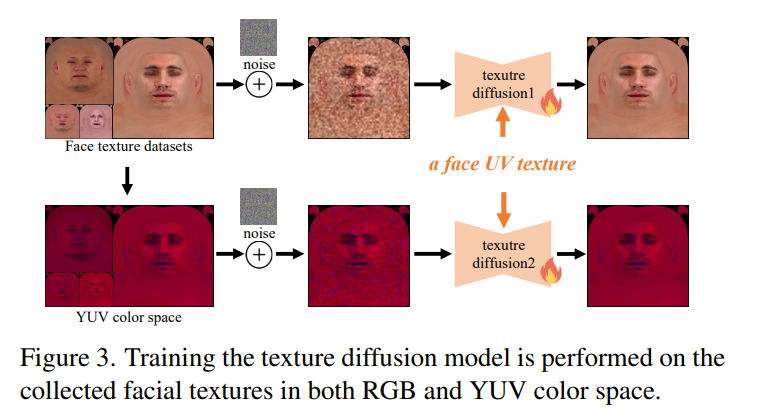

# Text-Guided 3D Face Synthesis - From Generation to Editing


# 一、大概内容

## 1.Abstract

​        文本引导的3D面部合成通过利用文本到图像（T2I）扩散模型取得了显著成果。然而，大多数现有工作只专注于直接生成，忽略了编辑，这限制了它们通过迭代调整来合成定制化的3D面部。在这篇论文中，我们提出了一个**从面部生成到编辑的统一文本引导框架**。在生成阶段，我们提出了一个几何-纹理解耦生成，以减轻由耦合引起的几何细节丢失。此外，解耦使我们能够利用生成的几何形状作为纹理生成的条件，从而获得高度几何-纹理对齐的结果。

​	我们进一步**使用一个微调的纹理扩散模型在RGB和YUV空间中增强纹理质量**（==增强纹理质量？看看后续怎么优化==）。在编辑阶段，我们首先使用一个预训练的扩散模型根据文本更新面部几何或纹理。

​	为了实现序列化编辑，我们引入了一个UV域一致性保持正则化，以防止对无关面部属性的意外变化。此外，我们提出了一个自我引导的一致性权重策略，以提高编辑效率，同时保持一致性。通过全面的实验，我们展示了我们方法在面部合成方面的优越性。项目页面：https://faceg2e.github.io/。（这一段的原文：To enable sequential editing, we introduce a UV domain consistency preservation regularization, preventing unintentional changes to irrelevant facial attributes. Besides, we propose a self-guided consistency weight strategy to improve editing efficacy while preserving consistency. Through comprehensive experiments, we showcase our method’s superiority in face synthesis）


## 2.Introduction

​	建模3D面孔是各种新兴应用的基本支柱，比如电影制作、视频游戏和增强现实/虚拟现实。传统上，创建详细复杂的3D人脸需要高技能的艺术家投入大量时间。随着深度学习的发展，现有的研究 [8, 10, 47, 56] 尝试使用生成模型从照片或视频中生成3D面孔。然而，生成的多样性主要受限于训练数据规模的限制。幸运的是，最近大规模的视觉-语言模型（比如CLIP [33]、Stable Diffusion [35]）为生成多样化的3D内容铺平了道路。通过整合这些模型，许多文本到3D的作品[23, 28, 29, 50, 52]可以以零样例（zero-shot）方式创建3D内容。

​	已经进行了许多关于文本到3D人脸合成的研究。它们要么使用CLIP，**要么采用文本到图像(T2I)模型的得分蒸馏采样(SDS)来引导3D人脸合成。**一些方法[46，53]采用神经场来生成视觉吸引人但质量较低的几何3D人脸。最近，Dreamface [54]已经展示了利用面部纹理上的SDS生成高质量3D面部纹理的潜力，但他们的几何精度不足，并且忽视了随后的面部编辑。少数作品[2，12，27]可以实现文本引导的面部编辑，允许进行粗粒度的编辑（例如，整体风格），但不能进行细粒度的调整（例如，唇色）。此外，他们在精确编辑控制的设计上的缺失导致在编辑过程中出现意外的变化，阻止了通过顺序编辑合成定制面部。

> 补充内容：
>
> 【1】SDS：score distillation sampling，得分蒸馏采样（Score Distillation Sampling，SDS）是一种机器学习技术，主要用于生成模型。这种方法通过对预先训练的模型生成的大量样本进行采样，再通过训练过程提取这些样本的特征（或称为“分数”），然后利用这些特征进行新样本的生成。这种方法可以高效地生成高质量的输出，同时保留并增强了原始模型的性能。
>
> **其他生成3D人脸的方法：NERF, CLIP**
>
> 【2】CLIP（Contrastive Language-Image Pretraining）是OpenAI发表的一种可以理解图像和文本之间关系的人工智能模型。CLIP通过同时学习图像和文本表示，然后通过文本描述从大量图像中找出相应的图像，或者相反，从大量的文本信息中找出与给定图片相匹配的描述，揭示了文本和图像之间的相互关联。这种方法能够以强大并且灵活的方式理解图像和文本，被广泛应用在图像分类，对象检测，文本到图像生成等各种任务中。

​	为了解决上述挑战，我们提出了一个名为**FaceG2E** 的文本引导的 3D 面部合成方法——从生成到编辑。我们提出了一个渐进式框架（progressive framework）来生成面部几何结构和纹理，然后进行由文本顺序控制的精确面部编辑。据我们所知，这是第一次尝试以顺序方式（sequential manner）编辑 3D 面部。我们提出了两个核心组件：（1）几何-纹理解耦生成和（2）自引导的一致性保持编辑。（(1) Geometry-texture decoupled generation and (2) Self-guided consistency preserved editing.）

​	为了具体说明，我们提出的几何-纹理解耦生成在两个独立阶段生成面部几何和纹理。通过结合无纹理渲染和SDS，我们引导T2I模型提供与几何相关的先验知识，**激发生成的几何形状中的细节（例如，皱纹，嘴唇形状）**。**在生成的几何形状基础上，我们利用ControlNet强制SDS意识到几何形状，确保精确的几何-纹理对齐。此外，我们对一个纹理扩散模型进行了微调，该模型融合了RGB和YUV颜色空间，用于在纹理领域计算SDS，从而提升了生成纹理的质量。**

> ==直观理解：==

​	我们新开发的自引导的一致性保持编辑使得人们可以按照文本进行高效的编辑，针对特定面部属性进行修改，而不会引起其他意外变化。在这里，我们首先使用预训练的图像编辑扩散模型来更新面部几何或纹理。然后我们引入了 UV 领域一致性保持规范化，以防止面部发生意外变化，使得顺序编辑成为可能。为了避免由于规范化导致编辑效果的退化，我们进一步提出了一个自引导的一致性加权策略。它通过将 T2I 模型的交叉注意力分数投影到 UV 领域，自适应地确定每个面部区域的规范化权重。如图 1 所示，我们的方法能够生成高保真度的 3D 面部几何结构和纹理，同时允许进行细粒度的面部编辑。通过提出的组件，我们在视觉和定量结果上都比其他 SOTA 方法表现得更好，如第 4 节所示。总之，我们的贡献包括：（这里省略贡献部分）


## 3.Related Work

### （1）Text-to-Image generation

这里就是正常介绍了一下Diffusion，以及使用Diffusion生成3D资产模型至今仍有较大的困难。


### （2）Text-to-3D generation

为了应对近年来文本到图像生成的成功，文本到3D生成在社区中引起了显著关注。早期方法[15, 21, 31, 39, 51]利用网格或隐式神经场来表示3D内容，并优化了2D渲染与文本提示之间的CLIP度量。然而，生成的3D内容的质量相对较低。最近，DreamFusion [32] 通过在强大的文本到图像扩散模型[38]中使用得分蒸馏采样（SDS）取得了令人印象深刻的成果。随后的工作通过减少生成时间[28]、改善表面材料表示[7]、以及引入精细的采样策略[19]进一步增强了DreamFusion。然而，高保真度和复杂3D面部的文本引导生成仍然具有挑战性。基于DreamFusion，我们精心设计了各阶段的得分蒸馏形式，通过利用各种扩散模型，实现了高保真度和可编辑的3D面部。


### （3）Text-to-3D face synthesis

最近，有人尝试从文本生成3D面孔。Describe3D [48] 和 Rodin [46] 提出了学习从文本到3D面孔的映射的方法，并在文本-面孔数据对上进行训练。他们仅使用在外貌描述上训练的映射网络来生成面孔，因此无法推广到域外的文本（例如名人或角色）。相反，我们的方法可以很好地推广到这些文本，并合成各种3D面孔。

其他作品[12、18、22、27、54]利用预训练的T2I模型进行SDS。Dreamface [54] 利用CLIP从candidates中选择面部几何形状。然后，他们使用纹理扩散网络进行SDS以生成面部纹理。Headsculpt [12]采用Stable Diffusion[35]和InstructPix2Pix [6]计算SDS，并依赖于SDS梯度的混合来约束编辑过程。这些方法不仅可以执行生成，还可以进行简单的编辑。然而，它们仍然缺乏精确编辑控制的设计，编辑结果中常常出现意想不到的变化。这使得它们无法通过顺序编辑合成高度定制的3D面孔。相反，我们的方法有助于准确编辑3D面孔，支持顺序编辑。

> 这里涉及到的工作（先把文章链接贴上来，有时间再看吧）：
>
> 【1】Describe3D：https://arxiv.org/pdf/2305.03302
>
> 【2】Rodin：https://arxiv.org/pdf/2212.06135
>
> 【3】Dreamface：https://arxiv.org/pdf/2304.03117
>
> 【4】Headsculpt：https://brandonhan.uk/HeadSculpt/，生成的结果全是洞，感觉肯定是不能用的，不过有时间看看思路是什么吧。
>
> 【5】InstructPix2Pix


## 4.Methodology

FaceG2E是一种渐进的文本到3D方法，首先生成一个高保真度的3D人脸，然后进行精细的面部编辑。如图2所示，我们的方法分为两个主要阶段：（a）几何-纹理解耦的生成，和（b）自引导一致性保持的编辑。

在第3.1节中，我们介绍了一些构成我们方法基础的预备知识。在第3.2节和第3.3节中，我们介绍了生成和编辑阶段。

### 对应文章3.1节 Preliminaries


> 补充：
>
> 【1】参数化3D 人脸模型：HIFI3D：论文为Highfidelity 3d digital human head creation from rgb-d selfies，链接：https://arxiv.org/abs/2010.05562
>
> 【2】SDS的基本介绍：https://zhuanlan.zhihu.com/p/637863048，顺便这个也包含对DreamFusion工作的基本介绍。


### 对应文章3.2节 Geometry-Texture Decoupled Generation

将几何和纹理分别生成有如下两点好处：

1) It helps enhance geometric details in the generated faces. 
2) It improves geometry-texture alignment by exploiting the generated geometry to guide the texture generation.

翻译过来就是：

1. 它有助于增强生成的面部的几何细节。
2. 通过利用生成的几何形状来指导纹理生成，它改进了几何-纹理的对齐。


#### （1）Geometry Phase

理想的几何形体生成应该是高质量的（比如无Surface Distortion），并且要和输入文本保持对齐。使用的三维面部可变模型（3D Morphable model）提供了强大的先验信息，以确保生成的几何形状的质量。至于与输入文本的对齐，我们在Stable Diffusion[35]网络ϕsd上使用SDS，以指导几何生成。

以前的研究[22、27、53]同时优化几何形状和纹理。我们注意到这可能会导致几何细节的丢失，因为某些几何信息可能被包含在纹理表示中。因此，我们的目标是增强SDS，在几何阶段提供更多以几何为中心的信息。为此，==我们用无纹理渲染˜I = R˜(g)来渲染几何形状g，例如，表面法线阴影或常亮灰色的漫反射阴影。无纹理的阴影将所有图像细节仅归因于几何形状，从而允许SDS专注于以几何为中心的信息。==以几何为中心的SDS损失定义为：


> 补充知识：[3D Morphable Models (3DMMs) - Metaphysic.ai](https://blog.metaphysic.ai/3d-morphable-models-3dmms/)
>
> 在上面的公式当中，w（t）是一个time-dependent weight function，g是指脸部的几何，β其实就是g参数化表达的一组系数，也就是我们要优化的地方。$y$是embedding of the input text.


#### （2）Texture Phase

许多研究[27、54]证明，通过最小化SDS损失可以生成纹理。然而，直接优化标准SDS损失可能会导致几何纹理对齐问题，如图.9所示。为了解决这个问题，我们提出了对生成的几何形有感知的纹理内容SDS(GaSDS)。我们采用ControlNet[55]赋予SDS对生成的几何形状的感知，从而使其能够维持几何-纹理的对齐。具体来说，**我们将g渲染成深度图e。然后，我们将depth-ControlNet ϕdc装备到SDS中，并将e作为条件，形成GaSDS：**


几何纹理对齐的问题：


我们提出的GaSDS解决了几何不对齐的问题，但是，在纹理中仍然存在诸如局部色彩失真或亮度不均的问题。==这是因为T2I模型缺乏纹理的先验知识，这阻碍了高质量纹理细节的合成。因此，我们提出了纹理先验SDS，以引入这样的纹理先验。受DreamFace[54]的启发，我们在纹理数据上训练扩散模型ϕtd1来估计纹理分布，从而提供先验。==我们的训练数据集包含500种纹理，包括经过处理的扫描数据和选定的合成数据[3]。与DreamFace不同，后者在训练中使用标记的文本，我们对所有纹理使用固定的文本关键字（例如，“面部纹理”）。由于ϕtd1的目标是作为先验来建模纹理分布，因此不需要纹理-文本对齐。我们还在YUV色彩空间上训练另一个ϕtd2以提升均匀亮度，如图3所示。我们在Stable Diffusion上对ϕtd1和ϕtd2进行微调。纹理先验SDS是用训练过的ϕtd1和ϕtd2进行公式化的：


> 这里公式里面的$\mathcal{L}_{tex}^{ga}$​指的是上面公式（4）里那个使用了GaSDS，也就是Texture Phase中同样考虑了几何对齐的问题（用深度图去对齐）。

训练Texture生成的Diffusion网络是这样的：




### 对应文章3.3节  Self-guided Consistency Preserved Editing

为了获得following editing instructions而不是生成prompts的能力，一个简单的想法是选择以文本为指导的图像编辑模型InstructPix2Pix [6] ϕip2p作为Stable Diffusion的替代品，以形成SDS。


其中，$z' t$ 表示编辑过的面部的latent，original face被嵌入到 $z_t$ 作为额外的条件输入，**这是按照InstructPix2Pix的设置。**请注意，==我们的几何和纹理由单独的参数β和u表示，因此可以独立优化其中一个，从而实现几何和纹理的单独编辑。==此外，在编辑纹理时，我们将$\mathcal{L}_{tex}^{pr}$（见上文的公式（5））整合进来，以保持纹理的结构合理性。


**Self-guided Consistency Weight**


方程7中的编辑SDS使得面部编辑变得有效，然而，细粒度的编辑控制依然具有挑战性，例如，结果中可能会出现不可预测和不希望的变化，如Fig10所示。这阻碍了顺序编辑，因为早期的编辑可能会被后续的编辑无意中打乱。因此，应该鼓励编辑前后的面部间的一致性。然而，在编辑过程中面部之间的一致性与编辑效果的明显度，存在一定的矛盾。想象一下在纹理中的一个特定像素，鼓励一致性趋向于让像素与原始像素相同，而编辑可能需要它取得一个完全不同的值以达到期望的效果。**解决这个问题的一个关键观察是，不同区域的一致性权重应该是不同的：对于与编辑说明相关的区域，应该保持较低的一致性水平因为我们优先考虑编辑效果。相反，对于无关的区域，应该保证较高的一致性。**例如，给出“让她戴上蝙蝠侠的眼罩”的指示，我们希望在眼睛附近有眼罩效果，同时保持脸部的其它部分不变。**为了找到编辑说明的相关区域，我们在UV域提出了一种自我指导的一致性权重策略。我们利用InstructPix2Pix模型自身的内建交叉关注机制。（The built-in cross-attention of the InstructPix2Pix model itself）**。Attention scores引入了不同图像区域和特定文本令牌之间的关联。一致性权重的一个例子在图4中展示。我们首先在说明中选择一个Region-indicating token`T*`，如`“眼罩”`。在每次迭代i中，我们从编辑的渲染图像I和令牌`T*`之间提取attention scores。根据当前视点，将得分归一化并解包（unwrap）到UV域，然后我们从解包得分中计算出时间一致性权重$\tilde{C_i}$：


where att(·, ·) denotes the cross-attention operation to predict the attention scores, the norm(·) denotes the normalization operation, and the proj denotes the unwrapping projection from image to UV domain. 由于$\tilde{C_i}$与视点相关，我们建立一个统一的一致性权重$C_i$来融合来自不同视点的$\tilde{C_i}$。$C_i$的初始状态是一个所有值为'one'的矩阵，表示将最高级别的一致性应用到所有区域。每步的$C_i$的更新受$\tilde{C_i}$的影响。具体来说，我们选择$\tilde{C_i}$中的值低于$C_i$的区域进行更新（补充：根据上面的式子，我的理解是attention分数越高，$\tilde{C_i}$就越低，所以把attention比较高的部分进行更新）。然后我们采用移动平均策略（moving average strategy）得到$C_i$：


w是一个固定的moving average factor， We take the $C_i$​ as a weight to perform region-specific consistency.


**Consistency Preservation Regularization**

手里有了一致性权重$C_i$​，我们在UV域提出了一个区域特定的一致性保持正则化，以鼓励在纹理和几何中编辑前后的面部一致性：


其中 do, de 表示编辑前后的纹理，po, pe表示从编辑前后的面部几何形状解包的顶点位置图，⊙表示哈达玛积。有了一致性保持正则化，我们提出了我们的自我指导一致性保持编辑的最终损失函数：


## 5. Experiments

实现基于Huggingface的Diffusers。我们使用Stable Diffusion的checkpoint用于几何生成，并使用sd-controlnet-depth来做纹理生成（https://huggingface.co/lllyasviel/sd-controlnet-depth）。我们使用了官方的instruct-pix2pix（https://huggingface.co/timbrooks/instruct-pix2pix）来做面部的编辑。RGB和YUV的texture diffusion models都基于stable-diffusion的checkpoint进行fine-tuned。我们使用NVdiffrast（https://arxiv.org/abs/2011.03277）来做differentiable rendering。我们使用了固定学习率为0.05的Adam [25]优化器。几何/纹理的生成和编辑分别需要200/400次迭代。在一台NVIDIA A30 GPU上生成或编辑一张面孔约需要4分钟。关于更多实现细节，我们建议读者参阅补充材料。


# 二、源码阅读

## 1.如何跑出这个代码

以下内容是在Colab当中跑的，重点核心部分如下（如果直接全部运行有问题就一句一句来，反正大概就是需要这些依赖的文件）：

```python
!git clone https://github.com/JiejiangWu/FaceG2E.git
%cd FaceG2E
!pip install diffusers==0.20.2
!pip install git+https://github.com/openai/CLIP.git
!pip install kornia
!git clone https://github.com/NVlabs/nvdiffrast
%cd nvdiffrast
!pip install .
%cd ..
!pip install "jax[cuda12_pip]==0.4.23" -f https://storage.googleapis.com/jax-releases/jax_cuda_releases.html
!pip install Ninja
```

然后，挂载Google Drive到Colab上，并把https://github.com/JiejiangWu/FaceG2E?tab=readme-ov-file这里提到的google Drive上的文件都放在对应的路径下面，用Linux的`unzip XXX`指令将文件解压。

> 有空格的文件名可能需要这么解压：`!unzip HIFI3D/Tencent\ AI-NEXT\ 3D\ Face\ Model\ \(East-Asian\ Version\).zip`

解压之后的文件布局：


接着在跑代码之前提前创建好exp/demo文件夹，否则可能会报错。

接着修改代码`util/io_util.py`中的第21行左右，原来的（**会导致报错**）：`imageio.imwrite(path,(img_.clip(0,1).detach().cpu().numpy()*255.).astype(np.uint8))`，修改完的版本为：

```python
import cv2
# 假设 img_ 是一个包含 RGB 数据的 Tensor
img_bgr = img_.clip(0, 1).detach().cpu().numpy() * 255.
img_bgr = img_bgr.astype(np.uint8)

# 将 RGB 转换为 BGR
img_bgr = img_bgr[..., ::-1]  # 对最后一个维度进行反转

# 使用 OpenCV 保存图像
cv2.imwrite(path, img_bgr)  # 这里有个坑，因为OpenCV似乎是以BGR格式存储RGB图像的
```


### 一个跑出的demo

```python
!python main.py --stage "coarse geometry generation" --text "a zoomed out DSLR photo of Emma Watson" --exp_root exp --exp_name demo --total_steps 201 --save_freq 40 --sds_input "norm grey-rendered" --texture_generation direct
```

这个会生成几何mesh，但diffusion贴图是一张纯灰色的贴图，Render之后的结果如下：


接下来我们生成Texture：

```python
!python main.py --stage "texture generation" --text "a zoomed out DSLR photo of Emma Watson"  --exp_root exp --exp_name demo --total_steps 401 --save_freq=40 --sds_input rendered --texture_generation latent --latent_sds_steps 200 --load_id_path "./exp/demo/a zoomed out DSLR photo of Emma Watson/coarse geometry generation/seed42/200_coeff.npy"
```

注意，这里的`200_coeff.npy`是上一步生成mesh的时候会生成的文件，这里需要保证对应的id_path是存在的。

> 注：普通的Colab Tesla T4会一直报CUDA Out of Memory，无奈花钱租用A100了，效率至上，多点时间学别的。

剩下的编辑也是正常跑就行，经过测试代码是可以跑通的。


## 2.Colab如何Debug代码

很可能由于算力不够或是其他的原因，我们需要去Google Colab上对代码进行debug以辅助代码的阅读，目前我能想到的是按照类似下篇的方式：https://stackoverflow.com/questions/51068987/how-to-add-a-breakpoint-in-jupyter-notebook，安装以下包：

```python
```


## 3.mesh generation

```c
//方便查看：这个是该阶段的opt
Namespace(device='cuda', seed=42, total_steps=201, save_freq=40, exp_root='exp', exp_name='demo', path_debug=False, fit_param=['id', 'tex'], lr=0.05, stage='coarse geometry generation', render_resolution=224, viewpoint_range_X_min=-20, viewpoint_range_X_max=20, viewpoint_range_Y_min=-45, viewpoint_range_Y_max=45, viewpoint_range_Z_min=0, viewpoint_range_Z_max=0, force_fixed_viewpoint=True, t_z_min=0, t_z_max=3, display_rotation_x=10, display_rotation_y=10, display_rotation_z=0, display_translation_z=1.5, dp_map_scale=0.0025, texture_generation='direct', latent_init='zeros', textureLDM_path='./ckpts/TextureDiffusion/unet', edit_prompt_cfg=100, edit_img_cfg=20, edit_scope='tex', guidance_type='stable-diffusion', sd_version='2.1', controlnet_name='depth', vis_att=False, text='a zoomed out DSLR photo of Emma Watson', negative_text='', use_view_adjust_prompt=True, static_text='a diffuse texture map of a human face in UV space', use_static_text=True, sds_input=['norm', 'grey-rendered'], random_light=True, w_SD=1.0, w_texSD=3.0, cfg_SD=100, cfg_texSD=1, set_t_schedule=True, schedule_type='linear', set_w_schedule=False, w_schedule='linear', w_texSD_max=20, w_texSD_min=3, latent_sds_steps=201, employ_yuv=False, textureLDM_yuv_path='./ckpts/TextureDiffusion-yuv/unet', w_texYuv=1, w_reg_diffuse=1, attention_reg_diffuse=False, attention_sds=False, scp_fuse='avm2', indices_to_alter_str='', w_sym=0, w_smooth=0, load_id_path=None, load_dp_path=None, load_diffuse_path=None)
```

以下是关于这个阶段看代码的收获：

- （1）会调用HuggingFace的StableDiffusion pipeline，默认使用2.1的管线，同时在这一步中不使用任何ControlNet
  - `guidance = StableDiffusion(device, True, False, sd_version=opt.sd_version)  # use float32 for training  # fp16 vram_optim`
  - StableDiffusion:`def __init__(self, device, fp16, vram_O, sd_version='2.1', hf_key=None,controlnet_name=None):`
- （2）按照上述方法运行的时候，因为没有`'./unet_traced.pt'`这个文件，所以Stable Diffusion中`pipe.unet`并没有加载上TracedUNet，note：暂时不确定这个是用来做什么的（似乎在mesh生成的步骤是用不上的）。
- （3）关于StageFitter：

```python
fitter = StageFitter(SD_guidance = guidance,  # stable Diffusion
                            stage=opt.stage,  # coarse geometry generation
                     		diffuse_generation_type=opt.texture_generation,  # direct
                            render_resolution=opt.render_resolution,  # 224
                         	saved_id_path=opt.load_id_path,  # None
                     		saved_dp_path=opt.load_dp_path,  # None
                     		saved_diffuse_path=opt.load_diffuse_path,  # None
                            latent_init=opt.latent_init,   # 'zeros'
                     		dp_map_scale=opt.dp_map_scale, # '0.0025'
                     		edit_scope=opt.edit_scope)   # tex
```

StageFitter的构造函数如下（大概就是初始化Hifi 3DMM，一个Mesh Renderer，以及要优化的参数：`self.id_para, self.diffuse_texture, self.diffuse_latent`）：

```python
class StageFitter(object):
    def __init__(self, SD_guidance,
                stage='coarse geometry generation',
                diffuse_generation_type = 'direct',
                render_resolution=224,fov=12.593637,camera_d=10,
                texture_resolution=512, dp_map_resolution=128,
                device='cuda',
                saved_id_path = None,
                saved_dp_path = None,
                saved_diffuse_path = None,
                latent_init='zeros',
                dp_map_scale=0.0025,
                edit_scope='tex',
                ):
        self.stage = stage
        self.guidance = SD_guidance
        self.diffuse_generation_type = diffuse_generation_type
        # camera setting
        self.resolution = render_resolution
        self.fov = fov
        self.camera_d = camera_d
        center = self.resolution / 2
        self.focal = center / np.tan(self.fov * np.pi / 360)
        self.edit_scope = edit_scope
        # hifi 3dmm
        self.facemodel = HIFIParametricFaceModel(
                hifi_folder='./HIFI3D', camera_distance=self.camera_d, focal=self.focal, center=center,
                is_train=True, 
                opt_id_dim = 526,
                opt_exp_dim = 203,
                opt_tex_dim = 80,
                use_region_uv = False,
                used_region_tex_type = ['uv'],
                use_external_exp = False
            )
        self.renderer = MeshRenderer(
            rasterize_fov=self.fov, znear=1, zfar=20, rasterize_size=self.resolution
        )
        self.texRes = texture_resolution
        self.dpRes = dp_map_resolution
        self.device=device
        self.latent_init=latent_init
        self.dp_map_scale=dp_map_scale
        self.init_parameters()
        self.set_transformation_range()
        
        with torch.no_grad():
            if self.stage != 'coarse geometry generation':
                self.load_shape(saved_id_path,saved_dp_path)
            if self.stage == 'edit':
                self.load_diffuse(saved_diffuse_path)

        self.define_optim_param()
```

- （4）T-Schecular：

  - `ts = T_scheduler(opt.schedule_type,total_steps,max_t_step = guidance.scheduler.config.num_train_timesteps)`: `opt.schedule_type`是`linear`


### （1）一些记录的Prompt

以下是原来的：

> python main.py --stage "coarse geometry generation" --text "a zoomed out DSLR photo of Mark Elliot Zuckerberg" --exp_root exp --exp_name demo --total_steps 201 --save_freq 40 --sds_input "norm grey-rendered" --texture_generation direct

--text：`a zoomed out DSLR photo of`Mark Elliot Zuckerberg


## 4.Texture Generation

对应的opt参数：

```c++
//方便查看：这个是该阶段的opt
Namespace(attention_reg_diffuse=False, attention_sds=False, cfg_SD=100, cfg_texSD=1, controlnet_name='depth', device='cuda', display_rotation_x=10, display_rotation_y=10, display_rotation_z=0, display_translation_z=1.5, dp_map_scale=0.0025, edit_img_cfg=20, edit_prompt_cfg=100, edit_scope='tex', employ_yuv=False, exp_name='demo', exp_root='exp', fit_param=['id', 'tex'], force_fixed_viewpoint=True, guidance_type='stable-diffusion', indices_to_alter_str='', latent_init='zeros', latent_sds_steps=200, load_diffuse_path=None, load_dp_path=None, load_id_path='./exp/demo/a zoomed out DSLR photo of Emma Watson/coarse geometry generation/seed42/200_coeff.npy', lr=0.05, negative_text='', path_debug=False, random_light=True, render_resolution=224, save_freq=40, schedule_type='linear', scp_fuse='avm2', sd_version='2.1', sds_input=['rendered'], seed=42, set_t_schedule=True, set_w_schedule=False, stage='texture generation', static_text='a diffuse texture map of a human face in UV space', t_z_max=3, t_z_min=0, text='a zoomed out DSLR photo of Emma Watson', textureLDM_path='./ckpts/TextureDiffusion/unet', textureLDM_yuv_path='./ckpts/TextureDiffusion-yuv/unet', texture_generation='latent', total_steps=401, use_static_text=True, use_view_adjust_prompt=True, viewpoint_range_X_max=20, viewpoint_range_X_min=-20, viewpoint_range_Y_max=45, viewpoint_range_Y_min=-45, viewpoint_range_Z_max=0, viewpoint_range_Z_min=0, vis_att=False, w_SD=1.0, w_reg_diffuse=1, w_schedule='linear', w_smooth=0, w_sym=0, w_texSD=3.0, w_texSD_max=20, w_texSD_min=3, w_texYuv=1)
```


#  三、记录AutoDL如何跑出这个代码

1. 配环境的过程暂时先略；
2. 关于Google Drive上面的大型文件下载：暂时需要的模型参数都放到硬盘里了（E盘），到时候如果AutoDL不保存的话可以每次拽上去；
3. AutoDL访问github和huggingface不行，可以参考这篇：https://www.autodl.com/docs/network_turbo/。注：学术加速用不了，用镜像；

设置的launch.json文件如下：

```json
{
    // Use IntelliSense to learn about possible attributes.
    // Hover to view descriptions of existing attributes.
    // For more information, visit: https://go.microsoft.com/fwlink/?linkid=830387
    "version": "0.2.0",
    "configurations": [
        {
            "name": "Python Debugger: Current File with Arguments",
            "type": "debugpy",
            "request": "launch",
            "program": "${file}",
            "console": "integratedTerminal",
            "args": [
                "--stage", "coarse geometry generation",
                "--text", "a zoomed out DSLR photo of Emma Watson",
                "--exp_root", "exp",
                "--exp_name", "demo",
                "--total_steps", "201",
                "--save_freq", "40",
                "--sds_input", "norm grey-rendered",
                "--texture_generation", "direct"
            ],
            "env": {
                "HF_ENDPOINT": "https://hf-mirror.com"
            }
        }
    ]
}
```

`mv ~/.cache/huggingface /sys/fs/cgroup/huggingface`

`export HF_HOME=/root/autodl-tmp/huggingface`

如果要永久修改的话，使用下面这个指令：

```bash
echo "export HF_HOME=/path/to/new/cache" >> ~/.bashrc
source ~/.bashrc
```


# Q:

【1】InstructP2P生成细节效果不好，如何处理细节的部分；

【2】dis map可以通过SDS Loss 生成的话，要怎么加入到渲染当中，和2D Diffusion的结果对齐；

【3】dis map在HRN中通过人脸扫描获得了先验知识，对应代码可以生成，但HRN和zhoukun那篇的3DMM不同，现有的dis map没法用，不知道要在哪份代码上修改；


# 四、源码重要定位点

## 1.几何生成阶段

走的逻辑如下：

- guidance的逻辑：https://github.com/JiejiangWu/FaceG2E/blob/main/main.py#L274，进了Stable Diffusion；
- SD的init函数：https://github.com/JiejiangWu/FaceG2E/blob/main/models/sd.py#L43
  - 配置上：controlnet是none，vram_O：**根据 VRAM 的可用性来优化模型的内存使用和计算效率**。如果有足够的 VRAM，启用多种内存管理策略以降低内存占用；如果没有足够的 VRAM（默认传入），则采取其他措施，如使用 Xformers 的高效注意力，确保模型能够在指定的设备上运行。这样做是为了平衡性能与资源消耗，确保推理过程尽可能流畅。
  - 关于https://github.com/JiejiangWu/FaceG2E/blob/main/models/sd.py#L89的解释：`unet_traced = torch.jit.load('./unet_traced.pt')`，大概就是通过加载一个经过 JIT 编译的 UNet 模型，创建一个新的 UNet 类，并将其集成到某个推理管道中，以实现更高效的模型推理，在总的项目中**暂时没用到**；
  - schedular选择了DDIM；
  - https://github.com/JiejiangWu/FaceG2E/blob/main/models/sd.py#L89：注意这里提前保存了一个`self.alphas = self.scheduler.alphas_cumprod.to(self.device)`，cumprod是累积连乘，这里指的应该是下面的$\bar{\alpha_t}$：

- 初始化SD（调用其init函数）后，判断https://github.com/JiejiangWu/FaceG2E/blob/main/main.py#277，这里默认是false，也就是在几何阶段先不管attentionscore之类的内容。
- https://github.com/JiejiangWu/FaceG2E/blob/main/main.py#L291，这个`opt.indices_to_alter`指的是编辑的时候对哪些indice比较关注，比如[add, a, mask, on, his, head]，就可以选择注意力机制更关注[5,6]，**几何生成阶段用不到。**

接下来就是StageFitter的初始化，包括基本可训练/不可训练的参数配置、3DMM的加载与初始化、MeshRenderer的初始化等，见下一部分。


### （1）StageFitter的介绍

对应下述代码：

```python
fitter = StageFitter(SD_guidance = guidance,
                            stage=opt.stage,diffuse_generation_type=opt.texture_generation,
                            render_resolution=opt.render_resolution,
                         saved_id_path=opt.load_id_path,saved_dp_path=opt.load_dp_path,saved_diffuse_path=opt.load_diffuse_path,
                            latent_init=opt.latent_init,dp_map_scale=opt.dp_map_scale,edit_scope=opt.edit_scope)
```

这个类比较关键，依次介绍逻辑：

- 该类的定位：https://github.com/JiejiangWu/FaceG2E/blob/main/models/stage_fitter/__init__.py#L16，传入的guidance是SD，stage是"coarse geometry generation"，diffuse_generation_type是direct，分辨率是224，latent_init是”zeros“（还可以选比如ones，rands，应该就是初始化成0还是随机值之类的），dp_map_scale是默认的0.0025，edit_scope是默认的tex（这是几何生成阶段，不做edit，所以这一项用不到）
- 在该类中，会进行HIFIParametricFaceModel的初始化：https://github.com/JiejiangWu/FaceG2E/blob/main/models/stage_fitter/__init__.py#L41，来看一下HIFIParametricFaceModel的构造函数https://github.com/JiejiangWu/FaceG2E/blob/main/models/hifi3dmm.py#L192，大概就是根据配置和HIFI3D的文件路径读取基本的3DMM，并初始化变量；
- 同时，该类还会初始化一个MeshRenderer：使用nvdiffrast，无非就是渲染器那套，https://github.com/JiejiangWu/FaceG2E/blob/main/util/nvdiffrast.py#L21，点进去一看有个ndc_proj就懂了；
- 一些分辨率的配置：==texRes是512，dpRes是128。==
- 接下来，是初始化变量：https://github.com/JiejiangWu/FaceG2E/blob/main/models/stage_fitter/__init__.py#L59，对应函数https://github.com/JiejiangWu/FaceG2E/blob/main/models/stage_fitter/__init__.py#L78，==note：如果要加待训练的参数，这里要做添加。==有一些可训练的和一些不能训练的参数，后面forward的时候再做总结；
- 接下来，是定义每个阶段要被优化的变量：https://github.com/JiejiangWu/FaceG2E/blob/main/models/stage_fitter/__init__.py#L102，比如当前阶段是course geometry generation，所以待优化的变量是`self.optim_param = [self.id_para, self.diffuse_texture, self.diffuse_latent]`。==note：如果要做新的优化参数，这里要做添加。==
  - todo：几何生成阶段为什么还要优化diffuse_texture和diffuse_latent？反正应该也会强制不要diffuse贴图，放不放这应该都行才对。


回到总的main函数，接下来是T_Schedular的初始化：https://github.com/JiejiangWu/FaceG2E/blob/main/main.py#L301，见下一部分。


### （2）T_Schedular的初始化

```python
# using SDS -- a normal decreasing schedule in denoise process
ts = T_scheduler(opt.schedule_type,total_steps,max_t_step = guidance.scheduler.config.num_train_timesteps)
```

这里传入的schedule_type是默认的linear，total_steps是201（bash文件指定），max_t_step则是DDIMSchedular里面的值，应该不需要在意。T_Schedular的类定义在这里：https://github.com/JiejiangWu/FaceG2E/blob/main/util/T_scheduler.py#L6。这里其实没太多内容，就是根据schedular_type计算一下T_Schedular的minstep，maxstep之类的。

> todo：需要补充：为什么前面在初始化guidance:SD的时候已经有一个schedular了，这里为什么还需要一个schedular，他们对于训练和inference阶段的作用分别是什么？

------


### （3）继续看main函数

回到总的main函数，继续看https://github.com/JiejiangWu/FaceG2E/blob/main/main.py#L314，有一个变量叫做`fitter.random_view_with_choice`，在geometry阶段该变量设置为false即可。接下来是prompt和SDS_input的设置：https://github.com/JiejiangWu/FaceG2E/blob/main/main.py#L328，在这个阶段prompt就是sh运行文件的输入prompt，negative prompt默认是空。

sds_input如下：

> --sds_input "norm grey-rendered"

然后是text_z的设置：

```python
text_z = {
    'default':guidance.get_text_embeds(text, negative_text),
    'front view': guidance.get_text_embeds(text+', front view', negative_text),
    'back view': guidance.get_text_embeds(text+', back view', negative_text),
    'side view': guidance.get_text_embeds(text+', side view', negative_text)
}
static_text_z = guidance.get_text_embeds(opt.static_text, negative_text)
```

text_z容易理解，static_text_z embed的原始文本是默认的'a diffuse texture map of a human face in UV space'。

在main函数中，接下来是整体训练的优化器的配置：https://github.com/JiejiangWu/FaceG2E/blob/main/main.py#L425，在几何生成阶段中，使用Adan优化器。

接着，开train！

```python
 for iter_step in tqdm(range(total_steps)):
        optim.zero_grad()
        loss = train_step(fitter,text , text_z,static_text_z, opt, sds_input=sds_input,employ_textureLDM=fitter.employ_textureLDM, iter_step=iter_step, total_steps=total_steps,
                            attention_store=guidance.attentionStore,indices_to_alter=opt.indices_to_alter)  # 来看这句
        scaler.scale(loss).backward()
        scaler.step(optim)
        scheduler.step()
        scaler.update()
```


### （4）训练一个step的代码（SDS直接更新参数）

刚才说了，train一个step的代码：

```python
loss = train_step(fitter,text , text_z,static_text_z, opt, sds_input=sds_input,employ_textureLDM=fitter.employ_textureLDM, iter_step=iter_step, total_steps=total_steps,
                            attention_store=guidance.attentionStore,indices_to_alter=opt.indices_to_alter)
```

train_step函数在这里：https://github.com/JiejiangWu/FaceG2E/blob/main/main.py#L23，喂给他的参数有：fitter里面什么都有，包括SD，T_Schedular等；text是用户输入的prompt，text_z和static_text_z上面就是，是embedding之后的内容；sds_input是norm grey-rendered，employ_textureLDM是False，attenion_score和indices_to_alter都是None，不用管。


### （5）保存中间结果的代码


# 五、其他补充知识

## 1.几何生成阶段

### （1）Stable Diffusion

- （a）关于tokenizer：

> ### Tokenization 过程
>
> 1. **分词 (Tokenization)**:
>    - Tokenizer 将输入的句子或文本划分为更小的单位，称为**token**。这些 token 可以是单词、字符或 subword（子词）。
>    - 例如，句子 "I love cats" 可能被分解为 ["I", "love", "cats"]。
> 2. **编码 (Encoding)**:
>    - 每个 token 被映射到一个唯一的整数 ID。这些 ID 是模型在训练过程中学习到的。
>    - 对于上述例子，可能会得到 [101, 2034, 5000] 这样的 ID 列表。
> 3. **处理特殊符号**:
>    - Tokenizer 还会处理一些特殊符号，比如开始和结束标记、填充标记等，这有助于模型理解文本的结构。
>    - 在某些情况下，还会对不常见的词汇使用替代规则，如将稀有词汇切分成多个 subword，以确保所有文本都能被有效编码。

- （b）关于SD中schedular的介绍：https://medium.com/invokeai/schedulers-in-ai-image-generation-2ca6d7458f17，也可以参考这篇链接：https://blog.csdn.net/Lizhi_Tech/article/details/133928749
- （c）
