#  人脸细节论文相关

有关3D人脸重建的合集仓库：https://github.com/weihaox/awesome-digital-human

# 一、InstructPix2Pix

https://arxiv.org/pdf/2211.09800

​	我们提出了一种方法，用于训练生成模型遵循人类编写的图像编辑指令。由于这一任务的训练数据难以大规模获取，==我们提出了一种生成配对数据集的方法，结合了多个在不同模态上预训练的大型模型：大型语言模型（如GPT-3）和文本到图像模型（如Stable Diffusion）。这两个模型捕捉了关于语言和图像的互补知识，可以结合生成用于跨模态任务的配对训练数据。==

​	利用我们生成的配对数据，我们训练了一个条件扩散模型，该模型在给定输入图像和文本指令的情况下，生成编辑后的图像。我们的模型在前向传播中直接执行图像编辑，不需要任何额外的示例图像、输入/输出图像的完整描述或逐个示例的微调。尽管完全基于合成示例（即生成的书面指令和生成的图像）进行训练，但我们的模型实现了零样本泛化，能够处理任意真实图像和自然的人类书写指令。我们的模型使得直观的图像编辑成为可能，可以按照人类指令执行多种多样的编辑操作：替换物体、改变图像风格、改变场景、艺术媒介等。可以在图1中找到选定示例。

## ==1.Method==

​	我们将基于指令的图像编辑视为一个监督学习问题：(1) 首先，我们生成一个配对的训练数据集，包括文本编辑指令和编辑前后的图像（见第3.1节，图2a-c）；然后 (2) 我们在这个生成的数据集上训练一个图像编辑扩散模型（见第3.2节，图2d）。尽管我们的模型是通过生成的图像和编辑指令进行训练的，但它能够泛化到使用任意人类编写的指令来编辑真实图像。有关我们方法的概述，请参见图2。

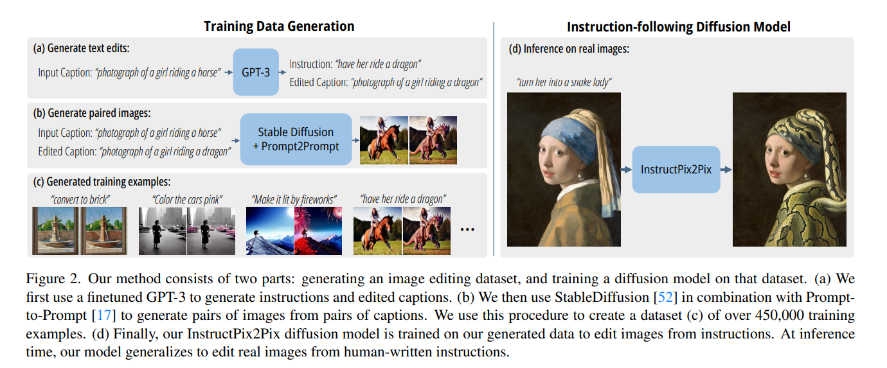

​		以下是一些具体的细节：

### （1）Finetune GPT3

主要做的事情是下面这张图：

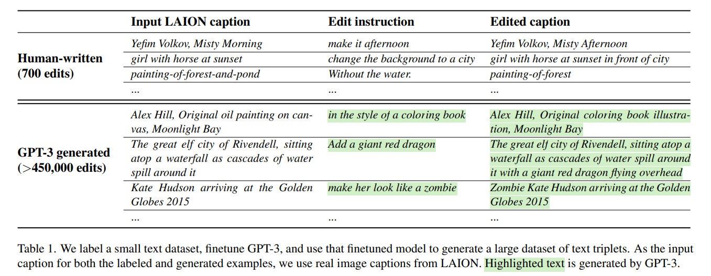

### （2）将两个文本提示（即编辑前和编辑后）转换为一对相应的图像

（a）将一对标题转化为一对相应图像的==一个挑战==是，==文本到图像模型在图像一致性方面没有任何保证，即使在条件提示的非常小变化下也是如此。==例如，两个非常相似的提示：“一只猫的图片”和“一只黑猫的图片”可能会生成完全不同的猫的图像。这对于我们的目的而言并不合适，因为我们打算使用这对数据作为训练模型进行图像编辑的监督（而不是生成不同的随机图像）。

- 因此，我们采用了==Prompt-to-Prompt==方法，这是一种旨在鼓励来自文本到图像扩散模型的多次生成保持相似性的近期方法。这个过程通过在一些==去噪步骤中借用交叉注意力权重来实现==。图3展示了使用和不使用Prompt-to-Prompt的采样图像的比较。

​	下面这张图是是否使用Prompt-to-Prompt的前后对比：

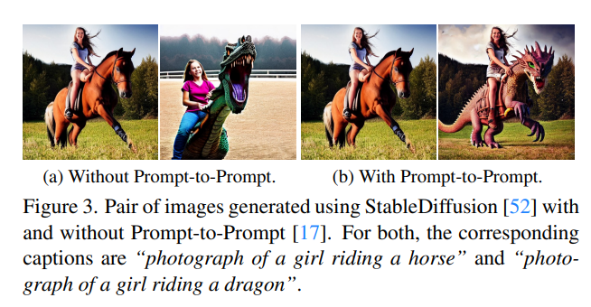

（b）尽管这在很大程度上有助于同化生成的图像，==但不同的编辑可能需要在图像空间中进行不同程度的变化。==例如，较大幅度的改变，如更改大规模图像结构（例如，移动物体、用不同形状的物体替换），可能对生成的图像对要求的相似性较低。==Prompt-to-Prompt有一个可以控制两幅图像之间相似性的参数：共享注意力权重的去噪步骤比例 ( p )。==但问题是仅从标题和编辑文本中确定 ( p ) 的最佳值是困难的。因此，==我们为每对标题生成100个样本图像对，每个图像对都有一个随机的 ( $p \sim U(0.1, 0.9)$ )，并通过使用====基于CLIP的度量进行过滤==：由Gal等人提出的CLIP空间中的方向相似性。==该度量衡量了两幅图像之间的变化（在CLIP空间中）与两幅图像标题之间的变化的一致性。==进行这种过滤不仅有助于最大化我们图像对的多样性和质量，还使我们的数据生成更加稳健，能够抵御Prompt-to-Prompt和Stable Diffusion的失败。

### （3）损失函数

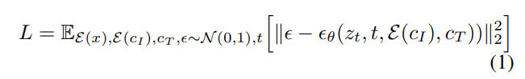

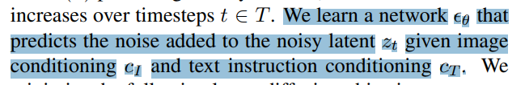

其中$c_T$指的是 text instruction conditioning，$z_t$是noisy latent，$c_I$是图像条件（应该指的是要被编辑的图像），$\xi(c_I)$则指的是将图像条件转到latent space。==在Stable Diffusion的基础上进行微调==，为了支持图像条件，我们在第一个卷积层中添加额外的输入通道，将$ ( z_t )$ 和$\xi(c_I)$进行拼接。扩散模型的所有可用权重均从预训练检查点初始化，==作用于新添加的输入通道的权重则初始化为零。==我们重复使用最初为标题设计的文本条件机制，将文本编辑指令 ($ c_T $) 作为输入。

### （4）Classifier-free Guidance for Two Conditionings

​	算是比较正常的思路，如下图所示：

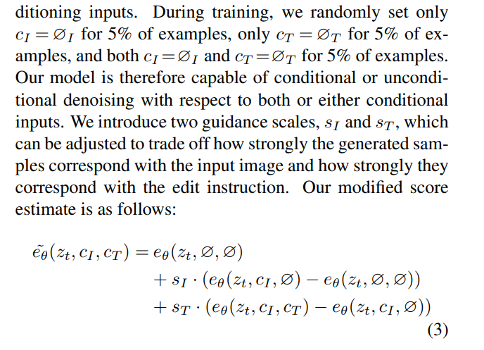

------

# 二、HRN

论文链接：https://arxiv.org/pdf/2302.14434

> 论文里还有与多视角照片有关的实现细节，这里先不整理。

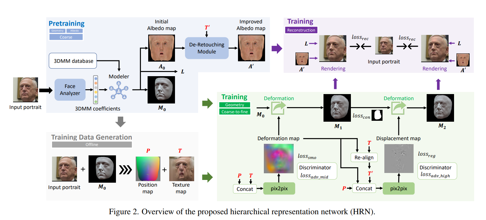

> 论文提到他们的贡献：
>
> (A) 我们提出了一种分层建模策略，并提出了一个新框架 HRN 以解决单视图人脸重建（FR）任务。我们的 HRN 产生准确且高度细致的人脸重建结果，并在两个大规模单视图 FR 基准测试中超越现有的最先进方法。
>
> (B) ==我们引入了细节先验，以指导对分层细节的真实建模，并设计了一个去修饰模块，以促进几何形状和外观的解耦。==
>
> (C) 我们将 HRN 扩展为多视图形式，形成 MVHRN，使得能够从稀疏视图图像中进行准确的人脸建模，并在两个大规模多视图 FR 基准测试中超越现有方法。
>
> (D) 为了推动稀疏视图和高保真 FR 任务的研究，我们推出了一个高质量的 3D 人脸数据集 FaceHD-100（==数据集没有开源==），包含 2,000 个详细的 3D 人脸模型及其对应的高清多视图图像。

## 3.Methods

依据Figure2，先介绍一下总体流程。==首先采用 3DMM 来预测粗略的mesh和albedo map（图 2 中的蓝色区域）==。**然后，使用分层建模的策略（3.2节），以粗到细的方式处理复杂的面部细节（绿色和紫色区域）。为了促进对分层细节的准确和真实建模，通过对抗学习和半监督学习结合了 3D 先验（第 3.3 节）。此外，我们提出了一个去修饰模块（第 3.4 节），以更好地解耦几何形状和外观，缓解不同皮肤纹理和光照之间的歧义。**此外，我们将框架扩展为多视图形式（第 3.5 节），并引入一个高质量的 3D 人脸数据集（第 3.6 节），以推动稀疏视图人脸重建的研究。为了简化起见，我们在每个部分中指定了相关的损失函数和训练策略。

### 3.2 Hierarchical Modeling

​	3DMM 在表达面部各种形状方面表现出色，==但低维表示本身严重限制了其对细节的学习==，导致面部对齐不完美或结果过于平滑。一些方法通过引入displacement map来扩展 3DMM，以重建一些细节，例如皱纹和凸起。然而，简单的displacement map仍然无法处理某些大尺度的细节，比如下颌和脸颊的轮廓，这主要是由于==displacement map专注于高频部分==。基于这样的观察，我们将面部几何分解为三个组成部分：

- (1) 低频部分，提供粗略对齐到输入脸部的粗略形状；
-  (2) 中频细节，描述相对于低频部分的轮廓和局部形状的细节；
-  (3) 高频细节，如皱纹、微小凸起等。

如图 1 所示，从低频部分到高频细节，尺度逐渐减小，而精细度则依次增加。

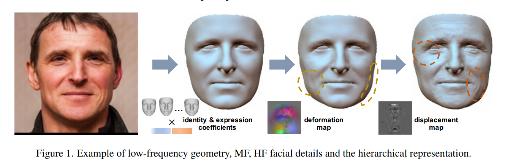

​	我们设计了分层表示以分别建模上述三个组成部分。

- 对于低频部分，我们采用 BFM 作为基础模型，并输出低维系数，以实现对输入面部的粗略重建。
- 接着，我们引入一个三通道变形图（deformation map），该图位于 UV 空间中，表示每个顶点相对于粗糙结果的偏移。作为中频细节的表示，变形图提供了一种灵活的方式来操控几何形状。我们使用 64×64 的大小来表示变形图，以平衡中频细节的精细度和光滑度。
- 对于高频细节，我们采用了根据文献 [19] 的位移图，这是一个单通道的图（256 × 256），表示沿法线方向的几何变形。位移图被转换为用于渲染过程中的详细法线，以逐像素的方式（==注：感觉应该是逐顶点+片元插值==）展现所有微小细节，突破了基础模型顶点密度的限制。因此，我们能够利用这些表示描述任意复杂的面孔。

重新来看Figure2：

$I$指的是参考图，首先使用一个regression network去计算BFM（该项目使用的3DMM）的系数，基于3DMM数据库可以生成course的mesh$M_0$和Albedo 贴图$A_0$，结合$I$和$M_0$，我们能够==通过应用可微渲染和粗到细的策略==，在 UV 空间中获得修复后的纹理$ T$。我们concatenate position map$P$和修复后的纹理$T$作为接下来输入给hierarchical details learning模块的参数。

> “Position map”指的是一种映射，用于表示每个像素或顶点在三维空间中的位置。这种映射通常用于捕捉人脸的几何信息，能够帮助模型更准确地重建面部的形状和细节。

我们应用了两个pix2pix的网络用于顺序合成deformation map和displacement map。==注意到deformation map会修改脸的几何，从而使得$T$和deformed mesh难以对齐==，解决方案是将三通道的deformation map投影到2D space，and transform it to a reversal flow $F$ to re-align $T$ . 

利用 $T $中丰富的细节和逐像素学习策略，我们成功获得了准确的细节图，这些细节图进一步以粗到细的方式用于生成详细的面部网格 $M_1$ 和 $M_2$。最后，结合照明 $L $以及从去修饰模块（第 3.4 节）生成的精细albedo，我们实现了从单张图像中进行详细的人脸重建。

总体而言，该框架采用自监督的方式进行训练，==辅以从人脸扫描中学习到的 3D 细节先验（第 3.3 节）==。为了降低训练复杂性，我们采用了文献 [15] 中的预训练编码器和多层感知机（MLP）作为人脸分析器，以预测系数并生成相应的 $P$ 和 $T$，用于后续的细节学习。这两个image translation network是共同训练的，相关的损失函数由三个组成部分构成：

> ==文献15被参考的内容相对比较多，该文献为：Yu Deng, Jiaolong Yang, Sicheng Xu, Dong Chen, Yunde Jia, and Xin Tong. Accurate 3d face reconstruction with weakly-supervised learning: From single image to image set.==

### 损失函数的设计

#### （1）Reconstruction Loss

重建损失是通过比较渲染的人脸和输入的人脸计算的，包含了photometric loss $(L_{\text{photo}})$、感知级损失 ($L_{\text{per}}$) 和landmark损失 ($L_{\text{lan}}$)，遵循文献 [15] 的方法。得益于3DMM的delighted albedo and the illumination system ，photometric loss将促使面部几何形状的变形，以适应输入面部的各种阴影和高光区域。重要的是，我们在从 $M_1$ 和 $M_2$ 渲染的两个图像上都应用重建损失，这有助于解耦中频（MF）和高频（HF）细节。

#### （2）Detail Loss

We apply the total variation loss $L_{tv}$ [29] to encourage the smoothness of the deformation map, and use the L1 regularization loss $L_{reg}$to limit the scale of the displacement map.

> 【29】指的是：Justin Johnson, Alexandre Alahi, and Li Fei-Fei. Perceptual losses for real-time style transfer and super-resolution. In European conference on computer vision, pages 694–711. Springer, 2016.

#### （3）Contour-aware Loss

我们提出了一种新颖的轮廓感知损失$ (L_{\text{con}})$，以实现面部轮廓的准确建模。$L_{\text{con}}$在$ M_1$ 上工作，旨在拉动边缘的顶点以对齐面部轮廓。如图 3 所示，我们首先将 $M_1 $的顶点投影到图像空间。然后，我们使用预训练的人脸抠图网络 [34] 预测人脸掩膜 $(M_{\text{face}})$，并进行后处理以获取每一行的左侧和右侧点。给定一个顶点 (p) 和对应的投影点 ($p'$) 在$ (M_{\text{face}})$ 上，我们获得向量 $(l_p) $和$ (r_p)$（从 $(p') $到水平方向的边缘点）。然后$ (L_{\text{con}}) $可以描述为：

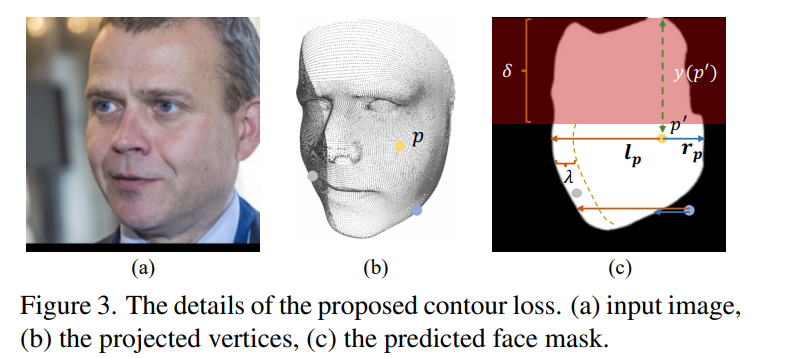

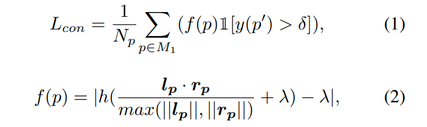

这里的$h$指的是ReLU函数，and λ denotes a soft margin relative to the face contour (λ = 0.01 as default)。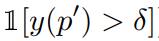指的是$p'$是否是在图像的lower部分（默认$\delta=100$），如我们所见，$(L_{\text{con}})$ 会惩罚位于面部软边界之外的顶点（如图 3 中的蓝色和灰色点），并将它们拉向面部轮廓，同时保持面部内部的顶点不变。结合deformation map的$ (L_{\text{tv}})$，$(L_{\text{con}}) $将避免面部轮廓附近的不平滑效果。需要注意的是，我们只关注面部轮廓的下半部分，以避免头发的干扰。与常规的分割损失相比，$(L_{\text{con}})$ 为优化面部轮廓提供了更直接的方向，并且训练起来更容易。我们将在第 4.4 节进行消融研究，以揭示$ (L_{\text{con}})$ 的有效性。

### 3.3 3D Priors of Facial Details

尽管可以通过重建损失（第 3.2 节）从单张图像中粗略学习面部细节，但==仍然存在不真实和模糊==的问题。添加额外的正则化可能有助于缩小解空间，但也会导致细节准确性和保真度的严重下降。

为了解决这个问题，我们在框架中==利用从人脸扫描和相应的多视角图像中获取的 3D 先验面部细节==。首先，给定一张原始图像及其对应的扫描，我们将原始扫描转换为在 BFM 空间中与图像对齐（细节可见于补充文件）。然后，我们可以通过使用第 3.2 节中提到的损失函数以及对顶点距离的额外监督（参考文献 [3]），为每张图像获得真实的变形图和位移图。得益于强大的层次表示，扫描的细节可以被准确捕捉。具体请参见图 4。

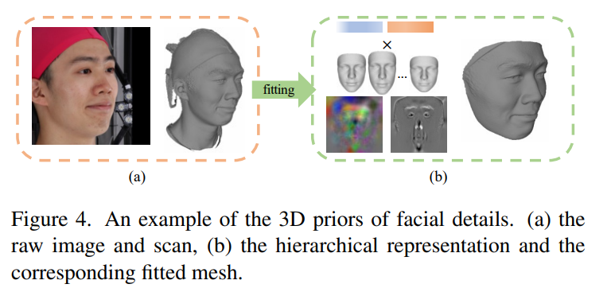

我们从两个方面利用 3D 细节的先验知识。一方面，我们开发了两个判别器，并使用对抗损失 [28] $(L_{\text{adv mid}}) $和 $(L_{\text{adv high}})$ 来监督变形图和位移图的domain distribution。另一方面，我们从 3D 扫描中获取上述配对数据，以进行监督学习，从而指导第 3.2 节中的自监督学习。具体来说，我们分别为预测的变形图和位移图补充了$ (L_1) $损失$ (L_{\text{mid}}) $和$ (L_{\text{high}})$。需要注意的是，在训练中使用了mask，以消除来自扫描中眼睛和头发区域的干扰。

### 3.4 De-Retouching Module

​	人脸图像是几何形状、光照和albedo的结合结果。先前的研究假设albedo是平滑的，并使用来自 3DMM 的低频反射率模型。然而，实际的皮肤纹理充满了高频细节，如痣、伤疤、雀斑和其他瑕疵，这给几何细节的学习带来了模糊性，尤其是在单视角人脸重建任务中。

​	受到文献 [33] 的启发，我们提出了一种去修饰模块（DRM），旨在生成具有高频细节的albedo，从而促进几何和外观的更精确解耦。我们从 FFHQ [30] 收集了 10,000 张人脸图像，并聘请了一组专业的图像编辑人员来处理这些图像，==目标是去除皮肤瑕疵和其他纹理细节，同时保持与形状相关的内容，如皱纹、丘疹等。==然后，我们通过应用第 3.2 节中指定的过程，将配对图像转换为 UV 空间中的纹理图，并训练一个图像翻译网络 ($G$) 来实现皮肤修饰。

​	Given re-ligned的纹理$T’$，我们首先应用$G$网络去掉其texture details，得到$T_0$，如下图5所示。目标则是重新将纹理细节bake到course的Albedo $A_0$上，从而获得更有细节的$A'$用于渲染。我们假设$A_0$到$T_0$以及$A'$到$T'$这两个阶段的shading是一致的。

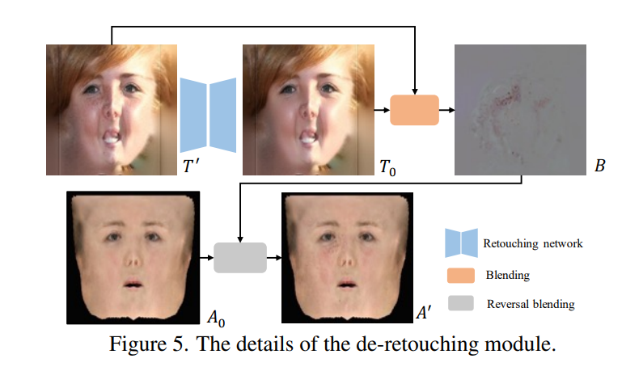

​	这一部分细节上的公式如下（==直观理解就是train了一个网络，用于去除Texture上的高频细节（如痘痘），然后将细节加到Albedo 贴图上，当时还没有使用Diffusion，现在或许可以用Diffusion更容易地做到类似的事情。==）：

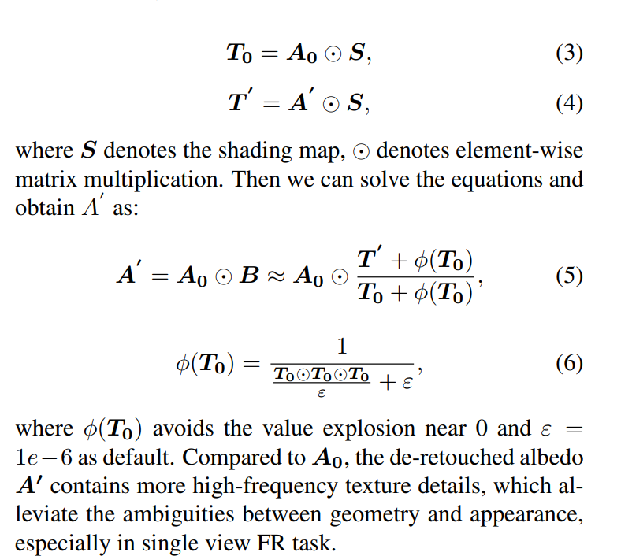

------

# 三、Text-Guided 3D Face Synthesis - From Generation to Editing

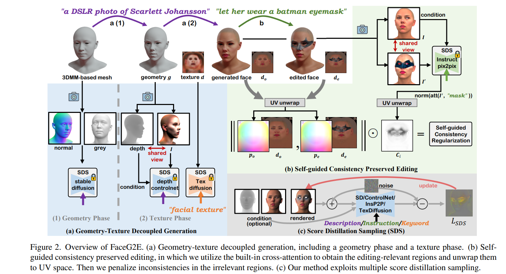

## 3.Methods

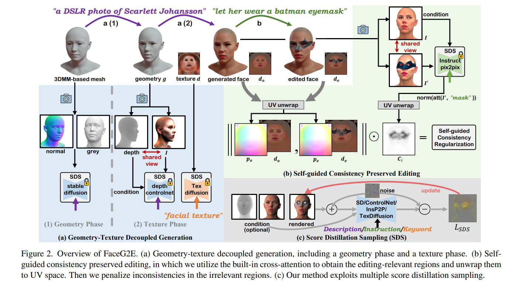

主要内容整理到这篇里了：

[Text-Guided 3D Face Synthesis - From Generation to Editing](Text-Guided 3D Face Synthesis - From Generation to Editing.md)

# 四、DreamFace: Progressive Generation of Animatable 3D Faces under Text Guidance

https://arxiv.org/pdf/2304.03117

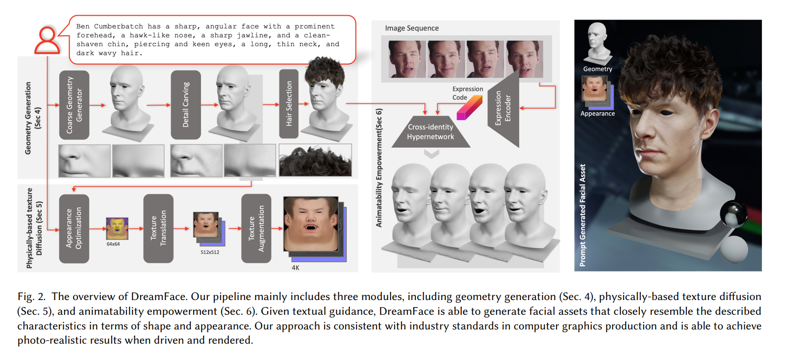

DreamFace 框架主要包括三个模块：几何体生成、基于物理的材质扩散生成和动画能力生成。这三个模块相辅相成，共同实现了一种高效而可靠的 3D 生成技术。

## Method

### （1）几何生成

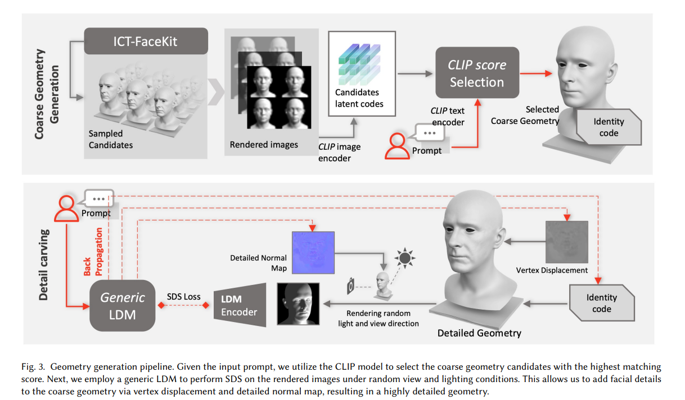

​	几何体生成模块的核心任务是根据文本提示生成与之一致的几何模型。==DreamFace 采用了基于 CLIP（Contrastive Language-Image Pre-Training）的选择框架，首先从人脸几何参数空间内随机采样的候选项中选择最佳的粗略几何模型（第四节），然后在粗略几何体的基础上进行细粒度的细节雕刻，应用SDS，优化切线空间中的详细位移和法线图。==此外，该框架还支持基于文本提示的发型和颜色生成。

​	接下来，我们生成与预测的neutral geometry和文本提示一致的physically-based appearance（见第5节）。我们引入了一种dual-path mechanism，使用两个潜在扩散模型（LDMs），==包括一个用于从任意提示输入多样化生成结果的通用LDM，以及一个在UV空间中的新颖纹理LDM。纹理LDM使用包含physically-based增强UV纹理数据集进行训练，as well as prompt tuning for the compensation of data variance。==我们还引入了两阶段优化，在latent空间和图像空间中执行分数蒸馏采样（SDS），这一过程通过我们的dual-path mechanism得到了增强。这使得潜在空间能很好地雕刻，具备紧凑的先验，从而实现高效和精细的合成。最后，我们学习从潜在空间映射到基于物理的资产，并随后采用超分辨率生成4K纹理。

> 这部分后面还有与Animation相关的模块，先不看。

#### 具体Method

2024年11月16日，中国虚拟现实大会（ChinaVR 2024）开幕式于福建省厦门市集美区举行。本届大会聚焦于学术分享和研讨，旨在令参会者能够充分交流、凝智聚力，掌握技术和行业的前沿知识，推动相关技术的稳固落地，携手推动行业技术发展。在开幕式上，各主办单位领导发表致辞，强调了虚拟现实等领域的意义、机遇与挑战。

大会主席王涌天教授首先代表组委会，对大会的顺利举办表示热烈祝贺，并对在场嘉宾的到来表示诚挚的欢迎和感谢，同时对大会的主题和内容进行介绍，并对虚拟现实与图形图像领域的交叉融合提出了展望，获得会场观众的阵阵掌声。王涌天教授指出，虚拟现实技术作为信息技术的新前沿，正从实验室走向应用场景。在国家政策的支持下，虚拟现实作为战略性新兴产业之一，能够展示出无限的发展潜力，具备广阔的前景。

随后，厦门大学党委林东伟常务副书记指出了虚拟现实领域的重要性和战略意义。虚拟现实领域产业进入了高速发展期，而高校作为人才、智力、技术等创新要素的聚集地，是推动虚拟现实技术高质量发展的关键力量。会议将深入贯彻落实习近平总书记在福建考察时的重要讲话精神，聚焦元宇宙，大模型等前沿话题，共同探讨虚拟现实前沿科技发展、关键技术创新与展望、产业技术开发与推广应用等话题。

随着姚俊峰教授对大会组织情况、许威威教授对大会程序情况的基本介绍，大会正式启动。本次大会邀请赵沁平院士、丁文华院士、王坚院士、澳大利亚南澳大学Bruce Thomas教授、日本大阪大学Kiyoshi Kiyokawa教授、香港理工大学Henry Duh教授等虚拟现实及相关领域的知名专家学者出席大会。ChinaVR 2024 大会分为七个主题论坛，包含面向元宇宙的轻量级WebXR技术、虚拟医疗以及应用、智能三维重建和点云处理、XR智能交互设计与体验、空间计算、三维建模与生成技术论坛，此外大会还专设一个电影技术特色论坛。

中国虚拟现实大会（ChinaVR）作为国内虚拟现实领域的顶级学术盛会，自2001年由赵沁平院士发起以来，至今已经成功举办23届。该会议不仅是国内虚拟现实领域最早的学术平台，也是规模最大、影响力最强的年度科技盛会之一。随着虚拟现实技术的不断发展与普及，ChinaVR的影响力也日益增强。它不仅成为了行业内的重要风向标，更是推动虚拟现实技术创新和发展的重要力量。每年的盛会都为与会者提供了一个展示最新研究成果和技术进展的机会，进一步助力整个行业的知识共享与合作发展。每年，ChinaVR都会吸引来自虚拟现实及其相关领域的专家、学者、以及工业界的技术专家和工程师参加，与参会者共同分享前沿课题和创新知识，探讨行业发展动态，推进虚拟现实及相关技术的应用与发展。该会议能够为学术界和工业界搭建了十分良好的交流平台，可以有效促进科研成果的转化和应用。

第二十四届中国虚拟现实大会（ChinaVR 2024）于2024年11月14日至11月17日在福建省厦门市集美区召开。本届大会历时4天，数百位国内外虚拟现实领域的专家学者、从业人员聚集在厦门，共同探讨虚拟现实及相关领域的前沿科技进展与关键技术创新。大会围绕元宇宙、大模型等前沿话题，围绕感知交互、图形图像、渲染仿真、VR/AR内容呈现、数字孪生等主题展开讨论，为参会者带来一场精彩的学术盛宴。此外，作为大会的一大亮点，ChinaVR 2024携手金鸡电影节，隆重推出FilmTech特色论坛，深入探讨虚拟现实技术与电影艺术的融合创新。

本次ChinaVR会议主办方为中国图象图形学学会、中国计算机学会、中国仿真学会，承办方则包含厦门大学、中国图象图形学学会虚拟现实专业委员会、中国计算机学会虚拟现实与可视化技术专业委员会、中国仿真学会虚拟技术及应用专业委员会。
